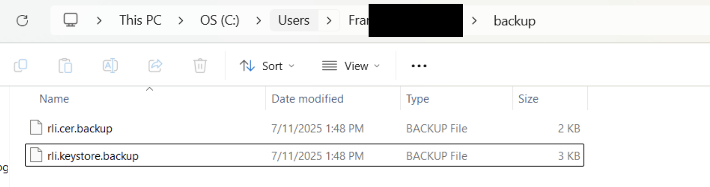
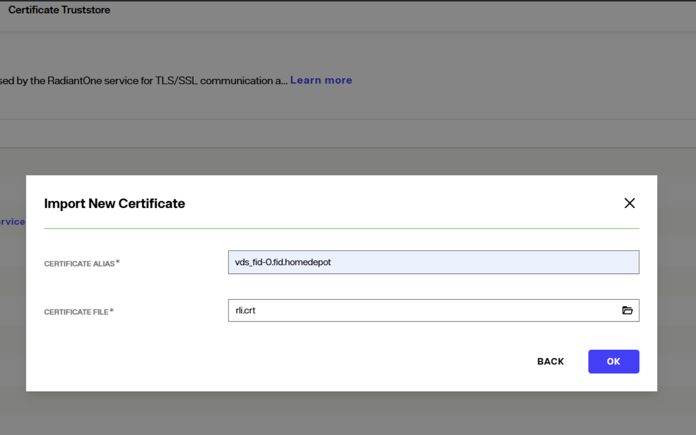
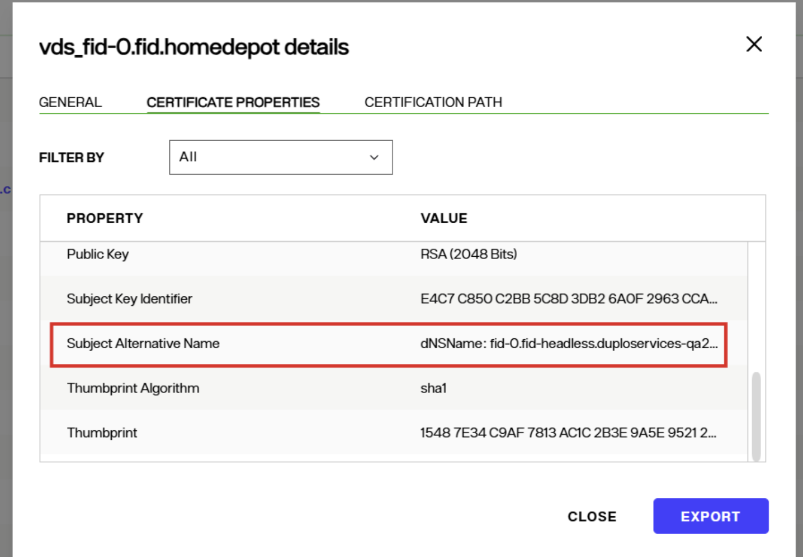
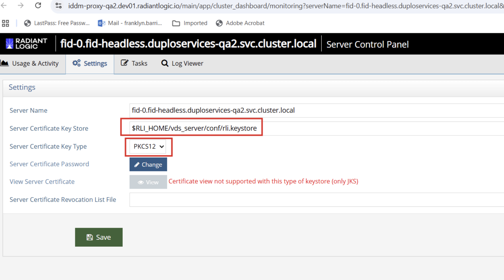

## Overview

Self-signed server certificates are used for LDAPS (LDAP over TLS), internal HTTPS (pod-to-pod communication), 
accessing Identity Data Management via the Control Panel UI, and for accessing the Classic Control Panel.

This document provides steps on how to update self-signed certificates in self-managed Identity Data Management. 

**Prerequisites**

* You must have access to your deployed self-managed Identity Data Management.
* You must have generated your new self-signed certificate. 
* When you create your self-signed certificate, it must be properly formed and include all relevant hostnames using the Subject Alternative Name (SAN) extension. This is critical for compatibility with modern TLS clients and to avoid runtime errors due to hostname mismatches during certificate validation. For replica sets, it is recommended to include at least five pod FQDNs in your SAN. This approach supports better scalability.


To update certificates without breaking service, follow these steps:

1. Create a local backup for the existing certificate and keystore and copy the keystore.

   **Example commands for one pod:**
   
   ```
   C:\Users\abcuser>kubectl.exe cp ${NAMESPACE}/${RELEASE_NAME}-iddm-fid/fid-0:/opt/radiantone/vds/vds_server/conf/rli.keystore ./backup/rli.keystore.backup
   C:\Users\abcuser>kubectl.exe cp ${NAMESPACE}/${RELEASE_NAME}-iddm-fid/fid-0:/opt/radiantone/vds/vds_server/conf/rli.cer ./backup/rli.cer.backup
   
   ```
   
   `kubectl cp ./rli.keystore duploservices-qa2/fid-0:/opt/radiantone/vds/vds_server/conf/rlicopy.keystore ` 
   
   **Example script for multiple pods:**
   
   ```
   # Set variables
   NAMESPACE="iddm-abc"
   RELEASE_NAME="my-iddm"
   
   # Create backup directory
   mkdir -p ./backup/$(date +%Y%m%d)
   
   # Backup from all pods if StatefulSet
   for i in 0 1 2; do
     if kubectl get pod ${RELEASE_NAME}-iddm-fid-$i -n ${NAMESPACE} &>/dev/null; then
       kubectl cp ${NAMESPACE}/${RELEASE_NAME}-iddm-fid-$i:/opt/radiantone/vds/vds_server/conf/rli.keystore \
         ./backup/$(date +%Y%m%d)/rli.keystore.pod$i.backup
     fi
   done
   ```
   
   Verify that the backup has been created by navigating to your backup folder. 
   
  
   


3. Upload the new certificate to the Control Panel trust store. 

   Add the new certificate to the trust store by accessing your control panel URL. In Control Panel, navigate to Client Certificates
   and click IMPORT. Give it an alias name and browse your certificate file. After selecting the file, click OK. 
   
    

   

5. Once you have replaced the certificate, click on the certificate alias and navigate to the certificate properties tab. 
   Ensure that your certificate has a SAN property assigned to it.  

   

   


4. Replace the pod's `rli.keystore` file.

   Navigate to pod's /vds/vds_server/conf and rename the old rli.keystore to rliold.keystore. Then, rename the new rlinew.keystorefile
   to rli.keystore by following these steps: 
   
   * Copy new keystore to first pod:
      ```bash
      kubectl cp ./rli.keystore ${NAMESPACE}/${RELEASE_NAME}-iddm-fid-0:/opt/radiantone/vds/vds_server/conf/rlinew.keystore
      ```
   
   * Access the pod:
     `kubectl exec -it -n ${NAMESPACE} ${RELEASE_NAME}-iddm-fid-0 -- bash`
   
   * Replace the keystore and fix permissions:
   
     `cd /opt/radiantone/vds/vds_server/conf`
     `mv rli.keystore rliold.keystore.$(date +%Y%m%d)`
     `mv rlinew.keystore rli.keystore`
     `chown 1000:1000 rli.keystore`
     `chmod 660 rli.keystore`
   
   * Update keystore type to PKCS12 if needed:
   
     ```
     cd /opt/radiantone/vds/vds_server/conf/jetty
     cat config.properties  # Check current type
     # If changing from JKS to PKCS12, update:
     sed -i 's/jetty.ssl.keystore.type=JKS/jetty.ssl.keystore.type=PKCS12/' config.properties
     ```
     Then, exit bash by running the `exit` command.

5. In the Control Panel, verify that the key store is pointing to your new rli.keystore. 
   If you're using a .p12 certificate, change the certificate key type to PKCS12; otherwise, leave it as is(set to the default JKS format).

   


6. Restart the pod by following these steps:
   
  * Access the pod:
    `kubectl exec -it -n ${NAMESPACE} ${RELEASE_NAME}-iddm-fid-0 -- bash`
  
  * After accessing it, stop the server and relaunch control panel:
  
  ```
    cd /opt/radiantone/vds/bin
    ./stopWebAppServer.sh
    sleep 5
    ./launchControlPanel.sh
  ```
  
  * Wait for services to come back up: 
   `kubectl get pod ${RELEASE_NAME}-iddm-fid-0 -n ${NAMESPACE} -w`


### Verify Certificate Installation and Connectivity 

1. Test SSL connection 

 ```bash
 kubectl port-forward -n ${NAMESPACE} ${RELEASE_NAME}-iddm-fid-0 2636:2636 &
 openssl s_client -connect localhost:2636 -showcerts | grep -A20 "Certificate chain"
 ```

2. Check SANs

 ```bash
 openssl s_client -connect localhost:2636 2>/dev/null | openssl x509 -noout -text | grep -A1 "Subject Alternative Name"
 ```


## Updating server certificate across multiple pods

If you have multiple RadiantOne pods (e.g., with fid-0, fid-1, fid-N), you must update the server certificate on each pod. To do so, you can perform a StatefulSet certificate update by following these steps:

* Copy the certificates to all pods.

* Restart all pods. They will automatically restart in order.

* Verify each pod after it restarts.

Here is an example script for reference:

```bash
#!/bin/bash
NAMESPACE="iddm-abc"
RELEASE_NAME="my-iddm"
REPLICAS=3

# Step 1: Copy & Replace Keystore in All Pods
for i in $(seq 0 $((REPLICAS-1))); do
  echo "Updating fid-$i..."
  kubectl cp ./rli.keystore ${NAMESPACE}/${RELEASE_NAME}-iddm-fid-$i:/opt/radiantone/vds/vds_server/conf/rlinew.keystore
  kubectl exec -n ${NAMESPACE} ${RELEASE_NAME}-iddm-fid-$i -- bash -c '
    cd /opt/radiantone/vds/vds_server/conf &&
    mv rli.keystore rliold.keystore &&
    mv rlinew.keystore rli.keystore &&
    chown 1000:1000 rli.keystore &&
    chmod 660 rli.keystore
  '
done

# Step 2: Restart StatefulSet
kubectl rollout restart statefulset ${RELEASE_NAME}-iddm-fid -n ${NAMESPACE}
kubectl rollout status statefulset ${RELEASE_NAME}-iddm-fid -n ${NAMESPACE}

# Step 3: Verify Each Pod
for i in $(seq 0 $((REPLICAS-1))); do
  echo "Verifying fid-$i..."
  kubectl exec -n ${NAMESPACE} ${RELEASE_NAME}-iddm-fid-$i -- \
    openssl s_client -connect localhost:2636 -servername fid-$i.fid-headless </dev/null 2>/dev/null | \
    grep "Verify return code"
done
```

