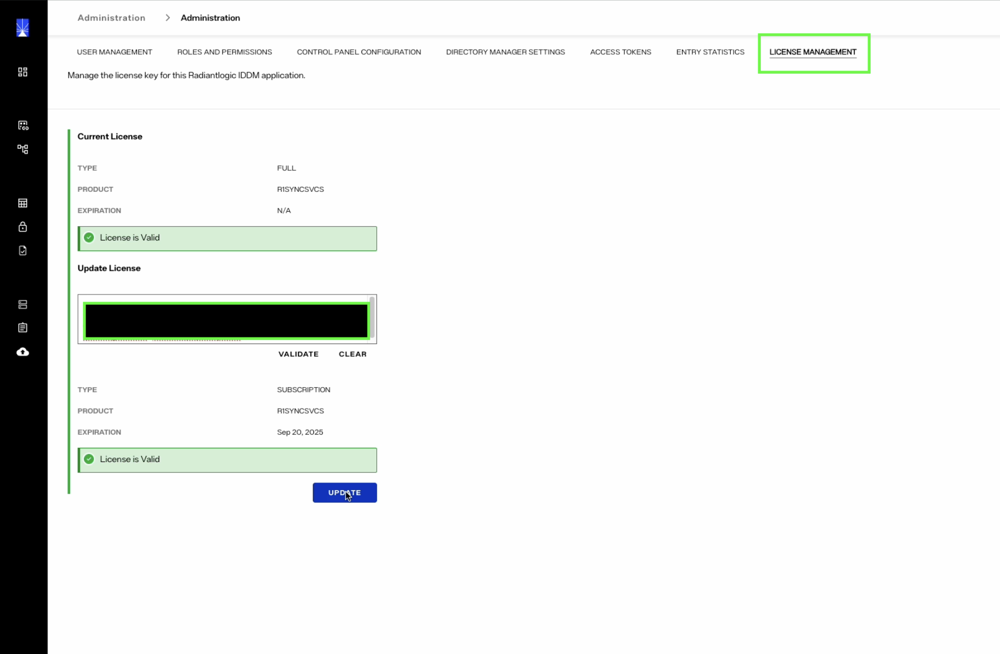

## Overview

This document provides detailed instructions for updating the license key in a **self-managed Identity Data Management** environment. 
You only need to follow these steps if your existing license key is about to expire. These steps do not apply to the SaaS version of Identity Data Management.  

> If you are unable to access your Identity Data Management application endpoints due to an invalid license, you will need to update your `values.yaml` file with the new license key and redeploy your application.  

### Prerequisites

- You must have administrative access to the Identity Data Management Control Panel.  
- Obtain the new license key from Radiant Logic prior to following these steps.  

### Steps to Update Your License

1. Log in to the **Identity Data Management Control Panel** using your administrative credentials.  

2. From the main menu, select **Administration > License Management**.

   

4. In the **Update License** section, enter the **New License Key** provided by Radiant Logic.  

5. Click **VALIDATE** to confirm the authenticity and validity of the new license key.  
   Wait until the system displays the message **“License is Valid.”**  
   
6. Once validation is successful, click the **UPDATE** button to apply the new license key to the system. 

7. After the update process is complete, confirm that the system displays **“License is Valid”** in a green notification box.  
   The license expiration date and product details should be automatically updated to reflect the new license information.  
