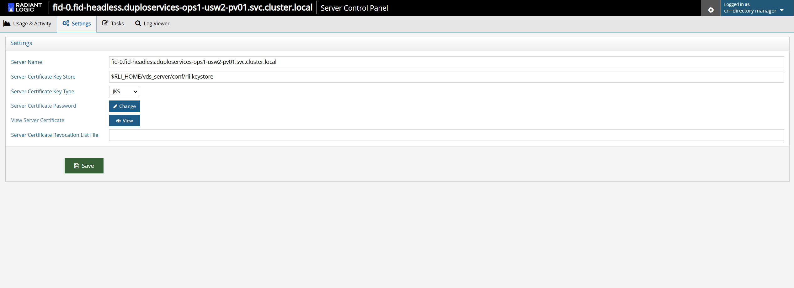

## Overview

Certificates are used for LDAPS (LDAP over TLS), internal HTTPS (pod-to-pod communication), 
accessing Identity Data Management via the Control Panel UI, and for accessing the Classic Control Panel.

This document provides steps on how to update your certificates in self-managed Identity Data Management. For each keystore type, steps are provided for two scenarios:

- **Unchanged password** – You use the same password as the old one (default value is `radiantlogic`) in the new keystore. This avoids modifying the `config.properties` password entry, so only the keystore file needs to be replaced.  
- **Changed password** – You use a different password for the new keystore. This requires updating `config.properties` (manually via CLI or automatically through the Control Panel) so that Identity Data Management can read the keystore at startup.

**Prerequisites**

* You must have access to your deployed self-managed Identity Data Management.
* You must have generated your certificate (JKS or PCKS12 format). 
* When you create your certificate, it must be properly formed and include all relevant hostnames using the Subject Alternative Name (SAN) extension. This is critical for compatibility with modern TLS clients and to avoid runtime errors due to hostname mismatches during certificate validation. For replica sets, it is recommended to include at least five pod FQDNs in your SAN. This approach supports better scalability.


To update your certificate, follow these steps:

### Step 1 – Mount the new certificate keystore into the pods

Before making any changes, mount your new keystore into each Identity Data Management pod:

  #### i. Create a Kubernetes secret (either JKS or PKCS#12) 
  
  **JKS**
  ```
  kubectl create secret generic fid-keystore-secret \
    --from-file=rli.keystore -n <namespace>
  ```
  
  **PKCS12**
  ```
  kubectl create secret generic fid-keystore-secret \
    --from-file=my-cert.p12 -n <namespace>
  ```
  
  
  #### ii. Update values.yaml to mount the secret into the pods
  
  ```
  extraVolumes:
    - name: fid-keystore
      secret:
        secretName: fid-keystore-secret
  
  extraVolumeMounts:
    - name: fid-keystore
      mountPath: /etc/rli/certs
      readOnly: true
  ```
  
  
  #### iii. Update the helm deployment 
  
  ```
  helm upgrade <release-name> oci://... -n <namespace> --values values.yaml
  ```
  
  After this step, the certificate is available at `/etc/rli/certs/<filename>`.

### Step 2 – Activate the new certificate

The activation process depends on certificate type (JKS or PKCS12), password scenario (unchanged or changed), and update method (Control Panel or CLI). Follow the steps below that match your specific scenario.

#### Option 1: Activate JKS certificate without changing the password

Follow these steps if you would like to use the existing password with the updated certificate. 

**a. Using Server Control Panel UI**

  i. Access your Control Panel, switch to Classic control panel and open the Server Control Panel UI.
  
  ii. Navigate to **Settings → Security → SSL**.
  
     
  
  iii. Enter the current password (default is `radiantlogic`) in **Server Certificate Password**.
  
  iv. Click **Save**. This updates `config.properties` automatically.
  
  v. Restart pods:
  
  ```
  kubectl rollout restart statefulset/fid -n <namespace>
  ```

**b. Using CLI**

  ```
  POD=$(kubectl get pod -n <namespace> -l "app.kubernetes.io/name=fid" -o jsonpath="{.items[0].metadata.name}")
  kubectl exec -it $POD -n <namespace> -- bash
  cd /opt/radiantone/vds/vds_server/conf/
  cp rli.keystore rli.keystore.bak
  cp /etc/rli/certs/rli.keystore .
  exit
  kubectl rollout restart statefulset/fid -n <namespace>
  ```

#### Option 2: Activate JKS certificate with a new password 

Follow these steps if you would like to use the password with the updated certificate. 

**a. Using Server Control Panel UI**

  i. Access your Control Panel, switch to classic control panel and open the Server Control Panel UI.
  
  ii. Go to **Settings → Security → SSL**. 
  
  iii. Set **Server Certificate Password** to the new value.  
  
  iv. Click **Save** and restart by executing this command:
  
  ```
  kubectl rollout restart statefulset/fid -n <namespace>
  ```

**b. Using CLI**

  ```
  # Replace keystore as above
  kubectl exec -it $POD -n <namespace> -- bash
  ENCRYPTED=$(/opt/radiantone/vds/bin/vdsconfig.sh encrypt-value -value 'NewPassword')
  cd /opt/radiantone/vds/vds_server/conf/jetty/
  sed -i "s|^jetty.ssl.keystore.password=.*|jetty.ssl.keystore.password=$ENCRYPTED|" config.properties
  exit
  kubectl rollout restart statefulset/fid -n <namespace>
  ```

#### Option 1: Activate PKCS12 certificate without changing the password 

**a. Using Server Control Panel UI**

  i. Access your Control Panel, switch to classic control panel and open the Server Control Panel UI.
  
  ii. Go to **Settings → Security → SSL**.
  
  iii. Set the following values:
  
   * **Server Certificate keystore:** `$RLI_HOME/vds_server/conf/custom.p12`  
   * **Server Certificate type:** PKCS12  
   * **Server Certificate password:** Keep the existing value for this field.  
  
  iv. Save and restart:
  
  ```
  kubectl rollout restart statefulset/fid -n <namespace>
  ```

**b. Using CLI**

  ```
  # inside the pod
  cd /opt/radiantone/vds/vds_server/conf/
  cp /etc/rli/certs/my-cert.p12 ./custom.p12
  cd /opt/radiantone/vds/vds_server/conf/jetty/
  sed -i 's|jetty.ssl.keystore.location=.*|jetty.ssl.keystore.location=$RLI_HOME/vds_server/conf/custom.p12|' config.properties
  sed -i 's|jetty.ssl.keystore.type=.*|jetty.ssl.keystore.type=PKCS12|' config.properties
  exit
  kubectl rollout restart statefulset/fid -n <namespace>
  ```

#### Option 2: Activate PKCS12 certificate with a new password 

  **a. Using the server Control Panel UI**
  
  i. Access your Control Panel, switch to classic control panel and open the Server Control Panel UI.
  
  ii. Go to **Settings → Security → SSL**.
  
  iii. Set the following values:
  
   * **Server Certificate keystore:** `$RLI_HOME/vds_server/conf/custom.p12`
   * **Server Certificate type:** PKCS12
   * **Server Certificate password:** Enter a new password of your choice. 
  
  iv. Save and restart the pods:
  
  ```
  kubectl rollout restart statefulset/fid -n <namespace>
  ```

**Using CLI**

  ```
  ENCRYPTED=$(/opt/radiantone/vds/bin/vdsconfig.sh encrypt-value -value 'NewPassword')
  sed -i 's|jetty.ssl.keystore.location=.*|jetty.ssl.keystore.location=$RLI_HOME/vds_server/conf/custom.p12|' config.properties
  sed -i 's|jetty.ssl.keystore.type=.*|jetty.ssl.keystore.type=PKCS12|' config.properties
  sed -i "s|^jetty.ssl.keystore.password=.*|jetty.ssl.keystore.password=$ENCRYPTED|" config.properties
  exit
  kubectl rollout restart statefulset/fid -n <namespace>
  ```


### Step 3 - Verify the certificate update

  #### i. Check rollout status
  
  ```
  kubectl rollout status statefulset/fid -n <namespace>
  ```
  
  #### ii. Test SSL connection
  
  ```
  kubectl port-forward -n <namespace> fid-0 2636:2636 &
  openssl s_client -connect localhost:2636 -showcerts | grep -A20 "Certificate chain"
  ```
  
  #### iii. Check SAN entries
  
  ```
  openssl s_client -connect localhost:2636 2>/dev/null | \
  openssl x509 -noout -text | grep -A1 "Subject Alternative Name"
  ```
