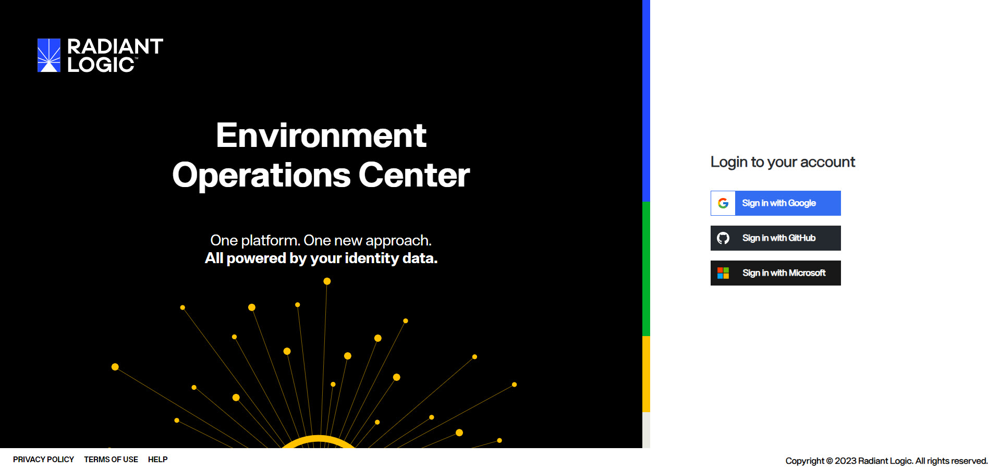
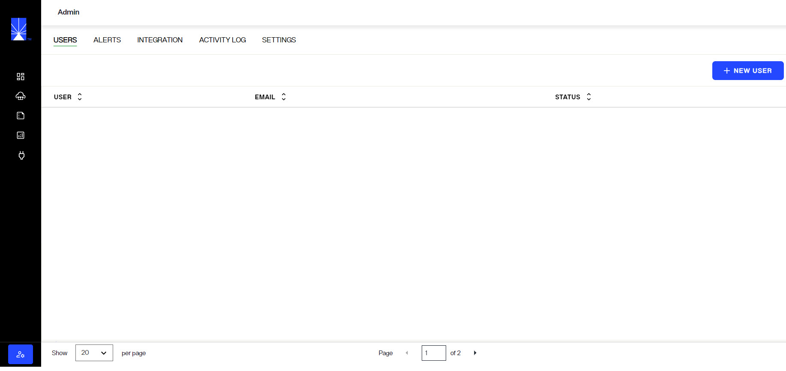
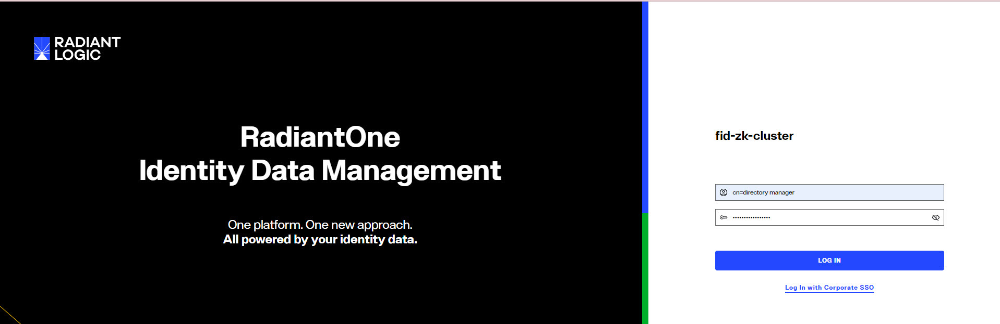
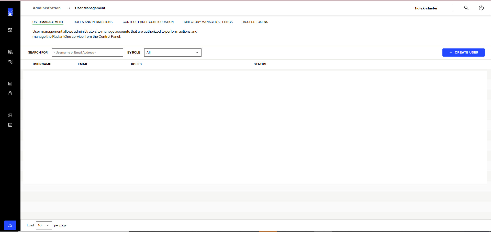

## Overview

There are two tools that administrators use to manage RadiantOne Identity Data Management.
- The Environment Operations Center is used by administrators to create environments, access monitoring dashboards, scale resources, apply updates, schedule backups, and troubleshooting issues.
- The Control Panel is used by administrators to configure identity views, directory stores, synchronization and global settings. The Identity Data Management environment must be created in the Environment Operations Center before administrators can access and use the Control Panel.

## Environment Operations Center

The Environment Operations Center is used by administrators to install RadiantOne Identity Data Management. This is done during the environment creation. Once an environment is created, it can be monitored and managed (e.g. patched, backed-up, restarted, or stopped)

When the tenant administrator logs into Environment Operations Center for the first time, they can configure other admin accounts for delegated administration. 

## Control Panel

The RadiantOne Identity Data Management Control Panel is used by administrators to configure and maintain identity views, directory stores, synchronization and global settings. 

The endpoint to reach the Control Panel can be found by navigating to the environment details in the Environment Operations Center.

The Directory Administrator credentials for Control Panel are defined when the environment is created. These credentials must be used to log into the Control Panel for the first time. 

The Directory Administrator can create other admin accounts and roles as needed from the Control Panel > Admin section. Users can login with a [username and password](control-panel-overview.md), an [Access Token](../security/access-tokens.md), or a [corporate SSO provider](control-panel-overview#oidc-token) can be configured.

