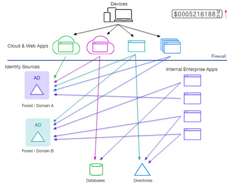
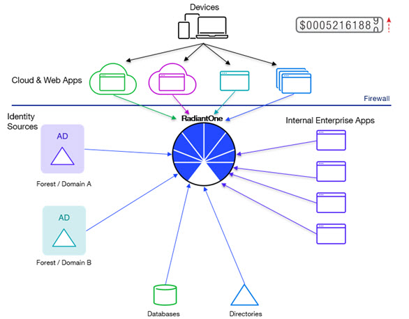
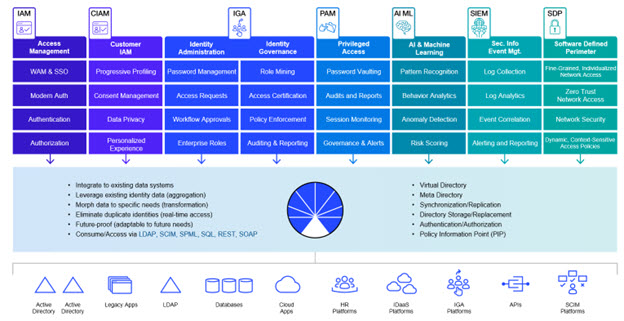
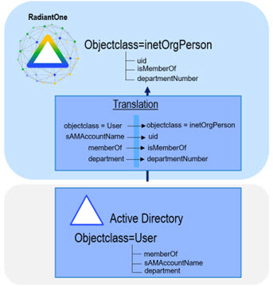
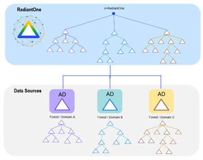
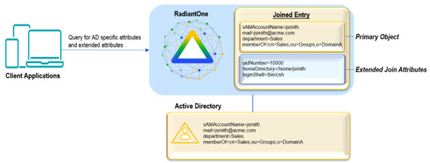
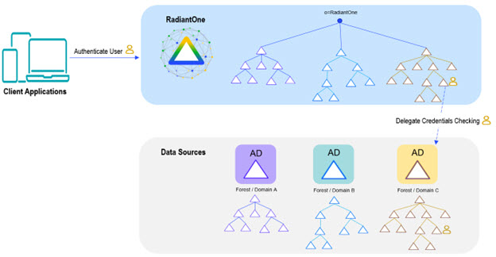

## Overview

**Managing a Fragmented Identity Data Infrastructure**

A widespread problem companies face today is the epidemic of identity information dispersed across a fragmented infrastructure. Mission-critical identity data is now stored across multiple LDAP, Active Directory, database and web applications, making user authentication and authorization increasingly difficult. The complex data architecture, often stored in legacy applications, needs to be updated to provide a central identity access point. These changes must be made slowly, as updating your entire identity infrastructure is costly, time consuming, and can open your infrastructure to security risks.

New identity data acquired through mergers and acquisitions quickly adds to the complex identity mix, intersecting with the existing identity data systems. This leads to identity intersection, where it becomes difficult to disambiguate users from one another. User data is spread across disparate identity systems, inaccessible to applications because they cannot connect to multiple sources or because the data is in a format/accessible through a protocol they cannot handle. You want to be able to extend access to all users in your infrastructure– no matter where, or in what manner, they are stored.

When identity sources contain overlapping identities, not only does the integration effort become more complex, but the need for joining data from multiple heterogeneous sources is required.

More joining means more queries to underlying data sources, which consumes power and results in slower performance. Situations like this make a persistent cache invaluable for reaching the required performance.

In addition to having many data sources and huge volumes of overlapping entries, large organizations typically deploy many applications to provide services to a variety of users, including employees, customers, partners, and suppliers—both inside and outside of the firewall. Serving the data requirements of these multiple applications and diverse users is often an integration headache for identity architects. The challenge of presenting different views— sometimes hierarchical, and sometimes flat—of the existing data sets/structures to the appropriate applications far surpasses the capabilities of a simple LDAP proxy.

Enterprises must work to preserve their investments in the existing data infrastructure while gathering information from multiple repositories to present a clear, single access point of identity information for requesting applications. They must integrate identity information swiftly and securely, all while translating the information through different languages and protocols. RadiantOne Identity Data Management includes all the capabilities necessary to inventory existing data sources, and offer model-driven, unique views to the varying needs of each individual application.

**RadiantOne Identity Data Management**

The solution is the RadiantOne Identity Data Management service that acts as a hub capable of delivering the data from all your identity silos to each application in the way it understands. Building the hub requires a set of features that are complex to manage without a guided process. RadiantOne offers a set of tools which walk the user through implementing best practice of these advanced features.

Identity Data Management aggregates, integrates, and translates data from across the identity infrastructure, into a single access point for applications. Through virtualization and join, RadiantOne seamlessly builds global profiles by extracting the schemas from each local data source and builds the new view (in a flat or hierarchical form) where identities and attributes are remapped and virtualized. 

With a virtualized central access point, authentication and authorization decisions are made simple. Credentials checking can be handled by RadiantOne directly against a local store or persistent cache, or delegated to the underlying data sources. Fine-grained authorization is achieved by quick access to all user attributes in the data silos. This allows RadiantOne to feed your applications the required user attributes from a variety of identity stores via a standards-based protocol, so they can perform richer, attribute-based authorization based on a more complete identity picture. Also, for applications that leverage groups-based authorization, RadiantOne offers flexible group definitions by aggregating, mapping and migrating existing groups into the RadiantOne platform, or allowing you to dynamically create new groups based on a select set of criteria.

**The Union Challenge**

At the core of RadiantOne Identity Data Management is the ability to make a union set of identities, to make identification of users more accurate and efficient. Union is the ability to create a global list where each user is represented once and only once, even if they have multiple accounts spread across the identity infrastructure.

To create a global list without duplicate identities, you need to correlate and disambiguate the identities. Union requires some kind of criteria, one or more attributes, to detect and correlate same-users across systems. This is the common, global identifier. A match based on this attributes(s) allows us to remove duplicates. The result is a “union compatible” operation, where all users are represented exactly once, and only once, in the virtualized global list. Correlating same-users across various data sources enables the creation of a global profile. The global profile maintains links to local accounts, to pull in attributes from them, for a complete 360-degree view of users.

**How RadiantOne Solves the Union Challenge**

The Global Identity Builder makes it easy to create a union of all users in your identity infrastructure, which is used as a reference list for authentication and authorization. The tool guides the designer through the process of correlating (detecting) same-user accounts across identity silos, so that there are no duplicate identities in the final list.

The profiles in this list have pointers back to the identity’s accounts across data sources. This means that attributes can be pulled from the original identity sources to create a rich global profile to be used for authentication and authorization. You can find more details on the union process in the Concepts section found [here](concepts.md).

## Identity Data Management Feature Overview

RadiantOne accepts requests submitted by applications using LDAP, SCIMv2 and REST. These requests are then routed, mapped, transformed by the engine, and forwarded to the underlying data sources. The results are gathered, normalized, filtered, and returned to the requesting application.

As a bonus, Identity Data Management also offers a local storage that can be used for purposes such as:

- Storage of Global Groups
- Create new groups that include members from multiple data sources being aggregated.
- Storage of application-specific attributes that don’t currently exist when deploying new applications, often they require storage of very specific attributes. Instead of having to extend your existing directory schemas to accommodate these, you can use the RadiantOne directory store.
- Legacy LDAP Directory Replacement
 If your identity integration/virtualization project involves a need for LDAP directory consolidation/migration, Identity Data Management provides both the storage and temporary synchronization mechanisms to provide you with a flexible, scalable alternative that allows you to migrate your applications at your own pace.

## Common Use Cases

RadiantOne is the platform for all identity-driven projects. Powering identity-driven projects with the right identity information introduces several critical integration hurdles that must be overcome prior to deployment. These hurdles have been discussed throughout this guide and are summarized below.

- Aggregating Identities: Authenticating users requires a set of usernames and passwords. Many organizations find that there is no single directory that has all that information, forcing companies to waste time recreating that information all over again, which means duplicated administrative effort or painful synchronization requirements.
- Integrating and Unifying Identities: Authorization services are based on policy, which evaluates a set of conditions and rules tied to the user's profile or group memberships. Not having complete profile or membership data means that administrators need to recreate that data in order for the policy to work.

The RadiantOne platform solves these challenges by leveraging data where it exists and provides services as needed, all without disrupting the existing data infrastructure.

Many enterprises face similar technical complexities that can be solved seamlessly with the RadiantOne platform. It comes equipped with a complete tool set making it easy for administrators to configure and solve many of the most common use cases. RadiantOne was designed to address identity integration challenges that range from mapping disparate systems to a common schema, to streamlining identities in fragmented data silos by consolidating them into one central access point for Identity and Access Management (IAM), Identity Governance and Administration (IGA), and other solutions that require an identity integration platform. A diagram depicting common use cases is shown below.

### Mergers and Acquisitions

One of the most common use cases for the RadiantOne platform is related to mergers and acquisitions.

Most enterprises have made large investments in their Active Directory infrastructures. More and more identity and security initiatives can benefit from the significant user and group information stored in Active Directory. However, many identity and security applications that have been written and/or customized to work specifically with LDAP directories like Oracle Directory (old Sun Java Directory) have a difficult time integrating with Active Directory. This is primarily due to the differences in schemas. These challenges are compounded when dealing with mergers and acquisitions where the number of Active Directory and LDAP Directory servers that applications must integrate with expands dramatically.

The RadiantOne platform allows applications that expect a specific LDAP Directory schema to leverage existing Active Directory identity and group information. Applications can query RadiantOne with the schema they expect and RadiantOne properly translates the requests to make them compatible with Active Directory. With this approach, applications can leverage Active Directory information without requiring time-consuming changes and customizations.

### Active Directory Integration

The RadiantOne platform helps you solve your authentication and security challenges while keeping your existing Active Directory (AD) infrastructure. Like most enterprises with Windows desktops, there is a good probability that your organization has made a significant investment in Active Directory. Now your users are asking why they can't use their AD ids and credentials to log in to all their applications within the enterprise. Your security team wants to take advantage of the group definitions that already exist in AD, and your Identity and Access Management (IAM) and Identity Governance and Administration (IGA) projects would like a single identity store while your existing infrastructure is comprised of multiple AD domains and forests, and legacy LDAP directories.

On the one hand, it would make sense to try and consolidate everything into a single Active Directory instance but there are valid historical and logistical reasons for having multiple forests and domains. The need to store additional attributes for application specific entitlements and profiles should also not be ignored. On some levels it makes sense to put all attributes into AD.

However, AD administrators will always remind you that Active Directory is first and foremost a NOS-based system, and extending the schema can have serious consequences on the core functionality that AD is designed to address. In addition, there is the issue of who owns the data and that certain requirements are better served through the functionality of an RDBMS, not AD.

With RadiantOne, you can leverage what you already have in AD without having to stretch AD into areas it wasn't designed for. The three most common scenarios for Active Directory integration are:

- Logically consolidating multiple AD Forests and Domains
- Schema Extensions
- Delegated Authentication

These scenarios are detailed below.

**Consolidating multiple AD Forests and Domains**

With RadiantOne, you can keep your existing AD forests and domains while still logically consolidating them into a single directory.

**Schema extensions to Active Directory**

RadiantOne allows application-specific objects and attributes to reside in other sources while
still providing a unified profile of the user.

**Delegated Authentication to Active Directory**

RadiantOne allows applications to leverage the existing ids and credentials by delegating the authentication requests to Active Directory.

