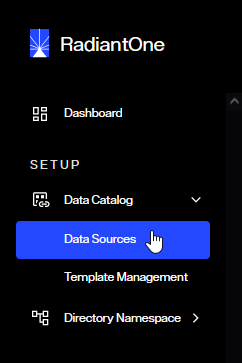
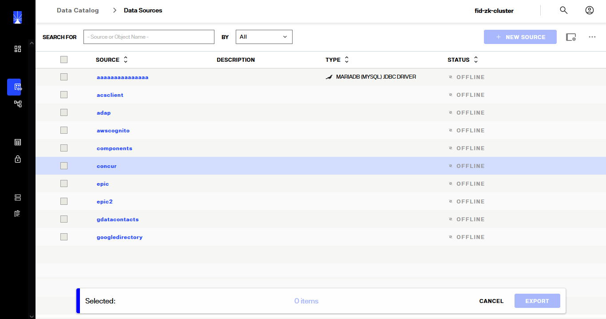
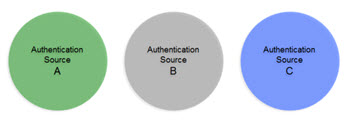
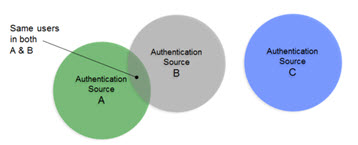
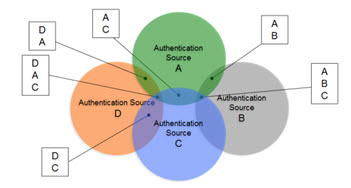
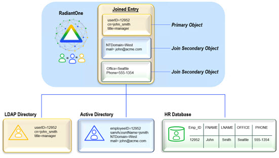
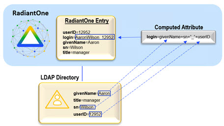
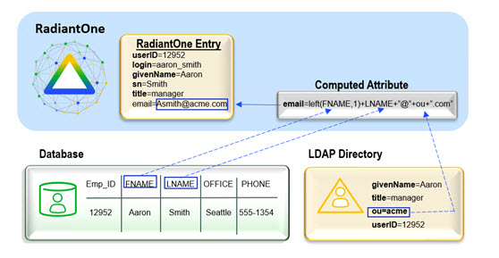

## Concepts Introduction

The following are concepts that you should understand in order to configure and administer RadiantOne Identity Data Management. 

  - [Data Source](#data-source)
  - [Union](#union)
  - [Identity Correlation](#identity-correlation)
  - [Joins](#joins)
  - [Bind Order](#bind-order)
  - [Computed Attributes](#computed-attributes)
  - [Interception Scripts](#interception-scripts)
  - [Groups](#groups)
  - [Schema Extraction](#metadataschema-extraction)
  - [Delegated Authentication](#delegated-authentication)

## Data Source

A data source in RadiantOne represents the connection to a backend. This could be a source that is LDAP-accessible (LDAP Data Source), JDBC-accessible (Database Data Source), or accessible through an API call (Java, web service or REST using a Custom Data Source). Data sources can be managed from the Main Control Panel > Data Catalog > Data Sources.


 
Figure 1: Managing Data Sources

>[!warning]
>Two LDAP data sources named vdsha and replicationjournal are included by default. These data sources contain connections to all RadiantOne nodes in a given cluster. One node is defined as the primary server and all others as failover servers. The vdsha data source is used internally by many operations including persistent cache refreshes. The replicationjournal data source is used internally for inter-cluster replication. These data sources should not be deleted or have their status changed to “offline”.

Configuring connections to all backends from a central location simplifies the management task when changes to the backend are required. For details on managing data sources (add, edit, and delete), please see [Data Sources](/04-backend-settings/#data-sources).

Data sources are used when configuring virtual views from database backends, LDAP backends, and joins. 

LDAP data sources defined for RadiantOne are contained in <RLI_HOME>/vds_server/datasources/ldap.xml. Database data sources are contained in <RLI_HOME>/vds_server/datasources/database.xml, and custom data sources are contained in <RLI_HOME>/vds_server/datasources/custom.xml.

>[!warning]
>One of the main purposes of having a data source defining the connection is to isolate the connection string from the metadata files (.dvx and .orx). It is strongly recommended that you use generic data source names that can remain (be relevant) as you migrate from a development to production environment where you only need to change the connection information. In addition, there are reserved characters that should not be used in data source names which are spaces, commas, brackets or parenthesis, colons, and the word “domain”.

### To Import Data Sources

If you have existing data sources defined ([exported](#to-export-data-sources) from another instance of RadiantOne) and you would like to import those, from the Main Control Panel > Settings Tab > Server Backend section click on the sub-section representing the types of data sources you want to import (LDAP Data Sources, Database Data Sources or Custom Data Sources). On the right side, click **Import**. Browse to the XML file containing the data source definitions that you have exported from another RadiantOne server and click **OK**. 

>[!warning]
>If a data source in the import file has the same name as an existing data source, the existing data source is overwritten by the one you are importing.

### To Export Data Sources

If you have existing data sources defined in a RadiantOne server and you would like to re-use them for another RadiantOne server, from the Main Control Panel > Data Catalog > Data Sources, click **...** in the upper-right corner and select **Export**). Select the data sources you want to export, indicate a file name and location and click **Export**.



Figure 2: Exporting Data Sources

You can then copy the export file to the desired RadiantOne server and use the [Import](#to-import-data-sources) option to import the data sources.

>[!warning]
>The following default data sources are included with RadiantOne: vdsha (points to the RadiantOne nodes in the cluster), advworks, derbyorders, derbysales, examples, northwind, log2db, and vdapdb (points to the local Derby database server), and replicationjournal (points to a local RadiantOne Universal Directory store and is used for inter-cluster replication). Therefore, be aware that when you import one of these data sources on the target RadiantOne server, the data sources with the same name are overwritten. For this reason, it is recommended that you do not export these data sources.

## Union

Union is a well-known term in the RDBMS-world and the value of the union operation is key for any federated identity service. Union is essentially the ability to create a list where every user is listed once and only once, even if they appear multiple times in the data stores across the enterprise. User overlap can occur for several different reasons. There could be one user listed numerous times, or multiple users with the same name spread across disparate data silos. The result of a union is a unique list of users that is indexed for each system which enables fast and easy lookups. The reason this capability is critical for an identity service is because it makes the identification of a user more accurate and efficient. 

For example, if you don’t have a single source of users, an application would have to look in all the different data stores across the enterprise to find a particular user. Even if a user is listed in only one store (unless that exact store is already known), an application still needs to locate them, resulting in multiple queries issued (at least one to each source the user could potentially be located in). However, if you have a master index (an “identity hub”), the client application only needs to query this list to locate a user, which results in queries to only the backend stores where the user is located. The more sources involved, the more valuable this global index is. It is this global list that is created and maintained by RadiantOne. 

In cases where the data stores contain user overlap, RadiantOne performs aggregation and correlation, creating a common key to identify users across disparate systems. However, the union operation is still important for data sources that may or may not have identity intersection. If they do not have identity overlap there is no need for correlation, but the function of union is still crucial for building your identity service.

The diagrams below provide a summary/review of data sources containing duplicate/intersecting identities.

In the first scenario, the data sources have no overlap of identities. In this scenario the benefits of union would still be important for identity management since a single unique index/list is still required for applications to identify a user for authentication. However, the design effort is a bit easier as no correlation logic is required. An aggregation of sources A, B, and C is sufficient, so the primary design consideration in this case is what hierarchy applications are expecting and to build this namespace accordingly.



Figure 3: Data Sources with no Overlapping Identities

In cases where there starts to be user overlap (as seen in Sources A and B in the diagram below), the configuration starts to require correlation. In this scenario, an aggregation of users from sources A, B and C is required in addition to correlation for the overlapping users in sources A and B. The design considerations now involve correlation logic in addition to where you want the unique list of users to appear in the virtual namespace.



Figure 4: Data Sources with Some Level of Overlapping Identities

In scenarios where the number of data sources increases, the amount of overlapping identities varies (as depicted in the diagram below), and the logic required to correlate identities becomes complex with the possible need of cascading rules to determine correlation, RadiantOne can create the union of identities which is the basis for supporting authentication and authorization and the foundation for the RadiantOne Identity Data Platform.



Figure 5: Complex Identity Integration Scenario

## Identity Correlation

Identity overlap means a same user exists in more than one data source. If there is not a single identifier that is common for the overlapping users, then correlation logic is required to determine the match. Correlation links the common users and is required to build a unique list. 

To correlate identities, a logical rule must exist for each data source so that a combination of attributes (eventually transformed) will yield a match for common users. For each source, different attributes can be used to generate the correlation logic. 

To build a virtual view that correlates identities, use the Global Identity Builder. See the [RadiantOne Global Identity Builder Guide](/global-identity-builder-guide/introduction) for details.

## Joins

Joining is a way to combine information from multiple data sources into a single entry. There are two types of joins in RadiantOne. One type is known as a [regular join](#regular-join) and the other is an [extended join](#extended-join). Each is described below.

### Regular Join

A Regular Join is defined as adding existing attribute(s) from another data source(s) to a virtual entry. The starting point for the join is known as the primary (or main) object. The data sources to be joined are known as secondary (or target) objects. Any object in the RadiantOne namespace can be a primary or secondary object. In RadiantOne, entries representing the same user across all data sources must have a unique identifier (common key) or a set of common identifiers in order to join. In the diagram below, the LDAP directory has been joined with Active Directory and a database based on a common value of userID matching EmployeeID in Active Directory and Emp_ID in the database.



Figure 6: Regular Join Example

#### Configuring a Regular Join

The primary source for regular joins is a virtual view of either an LDAP Backend, Database Backend (a specific object in the database), a web service backend, or you can even set up the join at a global level (to apply to all entries in the RadiantOne namespace).

>[!warning]
>The only exception to the following steps is if you want the join configured at a global level (to apply to all virtual entries contained in any root naming context). In this case, the join is configured from the Main Control Panel > Settings Tab > Interception > Global Join. Click **Add** to configure a global level join.

Configuration Steps for LDAP and DSML Backends

1.	From the Main Control Panel > Directory Namespace tab, navigate to the primary/main source below Root Naming Contexts. 

2.	On the Objects tab on the right side, click **Add** and select the object class that will condition the main entries to be the source of the join.

3.	Select an object class from the Primary Objects section and then click **New** in the Join Profiles section. 

4.	Select the Regular type of join and click **Next**.

5.	Select the attribute you want to base the join condition on from the Join Attribute drop-down menu.

  If you would like to create an attribute based on existing attributes of the primary object to base your join condition on, click ** Add Computed Attributes**. This allows you to build a new attribute based on the attributes available in the primary object. This new attribute can then be used to base your join condition on. This computed attribute name is prefixed with “vsysa” and is used only to condition the join. It is not returned as part of the virtual entry even if a client were to specifically request it.

  For more information, please see [Computed Attributes](#computed-attributes).

  >[!note] The Object Class is set for the class associated with the primary object and cannot be changed. Even if you have defined an object class mapping, you see the base object class, not the remapped one.

6.	Click **Next**.

7.	Select the location that contains the secondary objects you want to join with. This can be either a location in the RadiantOne namespace or another LDAP server that has been defined as a [data source](#data-source). If RadiantOne is used, select vds as the [data source](#data-source). If you want to join to some other LDAP, you must first configure the data source and then it appears in the drop-down list to select during this step. Click Browse to locate the Base DN or enter the location yourself.

8.	Specify the scope of search you would like to perform to find the entries to join with. The drop-down options are base, one, or sub.

9.	Specify the size limit (the number of entries to return to join for each unique entry in the primary source). Typically, this should be one (one entry in the primary source matches one entry in the secondary source).

10.	Select the specific object class associated with the secondary entries you want to join with from the drop-down list. If the target source is RadiantOne and the object class required for your secondary entries is not listed in the drop-down, you must first extend the RadiantOne LDAP schema. For information on schema extension, please see [Extending RadiantOne LDAP Schema](07-directory-schema#extending-the-radiantone-ldap-schema).

11.	Select the attribute from the secondary object that you want to base the join condition on from the Join Attribute drop-down menu. The value of this attribute should match the value of the primary source join attribute that you set in steps above. The Join Condition parameter displays the attribute matching criteria for the join.

12.	Click **Next**.

13.	 If you would like all of the possible attributes returned from the secondary object, select the All attributes option. Otherwise, list the attributes to return.

14.	If you choose to list the attributes, all attributes are listed by default. You can choose to remove the ones you don’t want by selecting them (you can select multiple at once), and clicking **Remove**.

15.	If you accidently delete an attribute and need to add it back, click Add and select the attribute from the list. You can select multiple attributes at once using Ctrl + click.

16.	You can provide a virtual/mapped name for any of the attributes as well by clicking in the Virtual Name column for the attribute and entering the mapped attribute name.

17.	Click **Next**.

18.	Enter a unique name for this join profile and click Finish.

19.	Click **Save**. 

20.	Click **Yes** to confirm changes to the server.

21.	Click **OK** to exit the confirmation.

**Configuration Steps for Database Backends**

1.	From the Main Control Panel > Directory Namespace tab, navigate to the primary/main source below Root Naming Contexts. Select the primary database object below Root Naming Contexts (noted as a white or blue folder icon).

2.	Select the Object tab and click New in the Join Profiles section. The Join Wizard opens.

3.	Choose the Regular type of join and click **Next**.

4.	Select the attribute from the primary database object that you want to base the join on in the Join Attribute drop-down menu. 

If you would like to create an attribute based on existing attributes of the primary object to base your join condition on, click the Add Computed Attributes option. This allows you to build a new attribute based on the attributes available in the primary object. This new attribute can then be used to base your join condition on. For more information, please see [Computed Attributes](#computed-attributes).

  >[!note] The Object Class will be set to the class for the primary object. You cannot change the object mapping from here. For more information on changing the object class associated with the database object, please see the [RadiantOne Namespace Configuration Guide](/namespace-configuration-guide/01-introduction).

5.	Click **Next**.

6.	Select the data source representing the target to join with from the drop-down menu.

7.	Select the location that contains the objects you want to join with. You can click Browse to locate the Base DN or enter the location yourself.

8.	Specify the scope of search you would like to perform on the secondary source to find the entries to join with. The drop-down options are base, one, or sub.

9.	Specify the size limit (the number of entries to return to join for each unique entry in the primary source). Typically, this should be one (one entry in the primary source matches one entry in the secondary source).

10.	Select the specific object class associated with the secondary entries you want to join with in the Object Class drop-down menu. If the target source is RadiantOne and the object class required for your secondary entries is not listed in the drop-down, you must first extend the RadiantOne LDAP schema. For information on schema extension, please see [Extending RadiantOne LDAP Schema](07-directory-schema#extending-the-radiantone-ldap-schema).

11.	Select the attribute from the secondary object that you want to base the join condition on from the drop-down menu. The value of this attribute should match the value of the primary object join attribute that you set above. The Join Condition parameter displays the attribute matching criteria for the join.

12.	Click Next.

13.	If you would like all of the possible attributes returned from the secondary object, select the All attributes option. Otherwise, list the attributes to return.

14.	If you choose to list the attributes, all attributes are listed by default. You can choose to remove the ones you don’t want by selecting them (you can select multiple at once), and clicking **Remove**.

15.	If you accidently delete an attribute and need to add it back, click **Add** and select the attribute from the list. You can select multiple attributes at once using Ctrl + click.

16.	You can provide a virtual/mapped name for any of the attributes as well by clicking in the Virtual Name column for the attribute and entering the mapped attribute name.

17.	Click **Next**.

18.	Enter a unique name for this join profile and click **Finish**.

19.	Click **Save**. 

20.	Click **Yes** to confirm changes to the server. 

21.	Click **OK** to exit the confirmation.

If you need to edit the join condition, select the join in the list of Join Profiles, click the **Edit** option and modify the relevant parameters.

-	**Base DN** – The location in the directory containing the objects you would like to join with. This was set in step 7 above.

-	**Scope** – the scope of search that should be performed to locate the entries to join with in the secondary source. This was set in step 8 above.

-	**Join Condition** – the matching criteria used to identify the entries to join. This was set during step 4 and 11 above.

-	**Additional Filter** – By default, the only filter criteria to condition a join is the object class of the parent entry (e.g. objectclass=inetOrgPerson). You can add more criteria to condition the primary entries to join. For example, if you only want to join entries that have a location of San Francisco, you could add (l=San Francisco) in the Additional Filter parameter.

-	**Attributes to return from the secondary objects** – list of attributes to return from the secondary object.

-	**Computed Attributes** – if you are basing the join on a [computed attribute](#computed-attributes) and you want to change the join to use a different/new computed attribute or you want to edit/delete a previously created computed attribute, click **Computed Attributes**. Remember that if you choose to add a new computed attribute, this computed attribute name is prefixed with “vsysa” and is only used to condition the join. It is not returned as part of the virtual entry even if a client were to specifically request it. If you add a new computed attribute to base the join on, you must edit the join condition manually to use the new computed attribute.

If you make any changes to the join condition, remember to click **Save** in the top right corner and click **OK** to apply the changes to the server.

If you are familiar with the [syntax](#deactivating-a-join), you can click **Edit Manually** at the bottom of the Attributes tab in the Edit window. 

#### Deactivating a Join

To deactivate a join, uncheck the join’s Active box in the Join Profiles section on the Objects tab and click Save. To reactivate the join, check the join’s Active box and click Save.


Figure 7: Marking a Join as Active/Inactive

### Extended Join

An extended join is defined by adding new attributes (meaning these attributes don’t exist anywhere yet) to a virtual entry. This is primarily used to accommodate the storage of application-specific attributes. In the case of an extended join, RadiantOne handles the creation and management of the new attributes. The new attributes are stored in a local RadiantOne Universal Directory (HDAP) store or any backend that has been virtualized. RadiantOne then joins the primary entries with these extended attributes and handles the lifecycle of these attributes accordingly.

The diagram below depicts an extended join. AuthzCode, lastLogon, and pwdreset are the application-specific extension attributes that are stored in a local RadiantOne Universal Directory store. RadiantOne manages the lifecycle (creation, modification, deletion) of the entries/attributes in the local store.


Figure 8: Extended Join Example

#### Configuring an Extended Join

The primary source is a virtual view of either an LDAP Backend, Database Backend (a specific object in the database), or a web service backend.

>[!warning] Deleting an extended join does not remove the entries in the extension storage. If you want the extension entries removed, you must do it manually.

#### Configuration Steps for LDAP Backends

1.	From the Main Control Panel -> Directory Namespace tab, navigate to the primary/main source below Root Naming Contexts.

2.	On the Objects tab on the right side, click Add and select the object class that will condition the primary entries to be the source of the join.
3.	Click **Save**.

4.	Select an object class from the Primary Objects section, and then locate the Join Profiles section. Click **New**. The Join Wizard opens.

5.	Select the Extended type of join and click **Next**.

6.	Select the object class that will condition the primary entries to be the source of the join.

7.	Choose whether you want the default data store or custom settings.
<br> **Default** – if this is chosen, RadiantOne stores the extension attributes below the cn=extendedxjoin naming context. This is a hidden naming context and is not seen from the LDAP clients. Hidden naming contexts are prefixed with the keyword hiddenContexts in the rootdse.ldif file. 

  The entries are created automatically and the extension attributes are added, update and deleted based on client requests. The only parameters to configure when using the default settings are the object class you want associated with the extension attributes, and the attribute names.

  **Custom** – if this is chosen, RadiantOne stores the extension attributes in the location of your choice. The location must first exist (create it if you haven’t already) in the virtual namespace. RadiantOne manages the creation of the entries and attributes as well as all modifications to these entries. The parameters you must configure are; the base DN (the location in the virtual namespace where you want to store the extension attributes), the object class to associate the extension attributes with, and how to comprise the RDN attribute (name and attribute from the primary object to populate the target RDN with).

  >[!warning] If your chosen location in the virtual namespace is configured as something other than a RadiantOne Universal Directory store, then the underlying backend must be capable of storing the extension attributes. For example, if the backend is a database table, then columns representing the extension attributes must exist. If the backend is an LDAP directory, the extension attributes should be defined in the schema (if schema checking is enforced) and the object class that is associated with the extension attributes should be set during the configuration steps described below.

8.	The Base DN parameter is relevant only when Custom data store settings has been selected in step 4. The Base DN is the location in the virtual namespace where you want the extension entries/attributes stored.

9.	Enter the object class that is associated with the extension attributes in the Object Class parameter of the Secondary section. The default object class that is used is extensibleObject.

10.	As mentioned above, the RDN setting is only relevant when Custom data store settings have been selected in step 4. This is how the RDN value for the extension entries is set. Enter an RDN name (or leave xid which is the default), and select the attribute that you want to populate the RDN with.

11.	Click **Next**.

12.	Click **Add** to set the extension attribute name. Add as many extension attributes as you need.

13.	When finished, click **Next**.

14.	Enter a unique name for configuration and click Finish to exit the wizard.

15.	Click **Save**. Click **OK** to confirm saving changes to the server.

#### Configuration Steps for Database Backends

1.	From the Main Control Panel > Directory Namespace tab, navigate to the primary/main source below Root Naming Contexts.

2.	Select the primary database object selected below Root Naming Contexts (noted as a white or blue folder icon).

3.	Select the Object tab and click New in the Join Profiles section. The Join Wizard opens.

4.	Choose the Extended type of join and click Next.

5.	Choose whether you want the default data store settings or custom.
<br>Default – if this is chosen, RadiantOne stores the extension attributes below the cn=extendedxjoin naming context. This is a hidden naming context and is not seen from the LDAP clients. Hidden naming contexts are prefixed with the keyword hiddenContexts in the rootdse.ldif file. 

  The entries are created automatically and the extension attributes are added, update and deleted based on client requests. The only parameters to configure when using the default settings are the objectclass you want associated with the extension attributes, and the attribute names.

  **Custom** – if this is chosen, RadiantOne stores the extension attributes in the location of your choice. The location must first exist (create it if you haven’t already) in the RadiantOne namespace. RadiantOne manages the creation of the entries and attributes as well as all modifications to these entries. The parameters you must configure are; the base DN (the location in the virtual namespace where you want to store the extension attributes), the object class to associate the extension attributes with, and how to comprise the RDN attribute (name and attribute from the primary object to populate the target RDN with).

>[!warning] If your chosen location in the RadiantOne namespace is configured as something other than a local RadiantOne Universal Directory store, then the underlying backend must be capable of storing the extension attributes. For example, if the backend is a database table, then columns representing the extension attributes must exist. If the backend is an LDAP directory, the extension attributes should be defined in the schema (if schema checking is enforced) and the object class that is associated with the extension attributes should be set during the configuration steps described below.

6.	The Base DN parameter is only relevant when Custom data store settings have been selected in step 6. The Base DN is the location in the RadiantOne namespace where you want the extension entries/attributes stored. 

7.	Enter the object class that is associated with the extension attributes in the Object Class parameter of the Secondary section. The default object class that will be used is extensibleObject.

8.	As mentioned above, the RDN setting is only relevant when Custom data store settings have been selected in step 6. This is how the RDN value for the extension entries will be set. Enter an RDN name (or leave xid which is the default), and select the attribute that you want to populate the RDN with.

9.	Click **Next**.

10.	Click **Add** to set the extension attribute name. Add as many extension attributes as you need.

11.	When finished, click **Next**.

12.	Enter a unique name for configuration and click **Finish** to exit the wizard.

13.	Click **Save**. Click **OK** to confirm saving changes to the server.

If you need to modify the join condition, select the corresponding join profile and click **Edit**.

-	If the default data store settings are used, then nothing can be changed in the Secondary Object section. If custom data store settings are used, then you can change the Base DN (location in RadiantOne to store the extension entries).

-	Additional Filter – By default, the only filter criteria to condition a join is the object class of the parent entry (e.g. objectclass=inetOrgPerson). You can add more criteria to condition the primary entries to join. For example, if you only want to join entries that have a location of San Francisco, you could add (l=San Francisco) in the Additional Filter parameter.

-	Extended Object Class – this is the objectclass associated with the extension attributes.

-	Extension Attributes to join to the primary objects – list of attributes to return. 

If you make any changes to the join, click **Save** in the top right corner and click **OK** to apply the changes to the server.

If you are familiar with the [syntax](#join-syntax), you can click **Edit Manually** at the bottom of the Attribute tab in the Edit window. 

#### Deactivating a Join

To deactivate a join, uncheck the join’s Active box in the Join Profiles section on the Objects tab and click **Save**. To reactivate the join, check the join’s Active box and click **Save**.


Figure 9: Marking a Join as Active/Inactive

### Join Syntax

Examples of the join syntax are shown below. If you need to edit the join condition manually, you must follow this syntax.

**Example 1 – Regular Join**

`LDAP://[VDS]/ou=people,o=myviews?sn:1,cn:1,mail:255,title?sub?(uid=@[CID]) ##JOINTYPE=INNER##SIZELIMIT=1##ALLOW_PARTIAL_ENTRY=yes`

-	The [VDS] shown here indicates the local RadiantOne service as the server containing the secondary objects you want to join.

-	The ou=people,o=myviews section specifies the branch (known as the Secondary Object Base DN) that contains the entries to join to the primary entries.

-	The attributes listed (sn, cn, mail, title) are the attributes to be returned from the secondary entries. The numeric value set after the attribute indicates the precedence level (0 being least authoritative, 255 being most authoritative…if no value is specified, an authority level of 128 is assumed). For more information, please see the section titled [Attribute Priority](#attribute-priority).

-	A sub level search scope is specified to find the secondary objects to join.

-	The join takes place when uid from the ou=people,o=myviews branch matches the CID attribute in the primary source.

-	##JOINTYPE=INNER is set to specify that only primary entries that have a matching entry in the joined source should be returned in the result. Primary entries that do not have a matching entry are not returned. The options for jointype are INNER and LEFT. With LEFT join type, all entries from the primary source are returned. If the primary entry has a matching entry in a secondary source(s), those additional attributes comprise the primary entry.

-	##SIZELIMIT=1 is set to specify only one entry should be returned from the secondary object (for each entry in the primary source). In this case, it is assumed that only one entry should be returned from the ou=people,o=myviews branch (for each entry in the primary source).

>[!note] If no sizelimit is specified, the default used is 1000.

-	##ALLOW_PARTIAL_ENTRY=yes. This is to specify the behavior of RadiantOne if this secondary source is unavailable and it is not able to join. If this is present in the join condition, RadiantOne returns a partial entry to the client. For more details, see [Behavior if a Secondary Source is Unavailable](#behavior-if-a-secondary-source-is-unavailable).

>[!note]
>DO NOT use the ALLOW_PARTIAL_ENTRY=YES property if you plan on caching the joined view as the whole entry must be in the cache and during refresh scenarios you don’t want a partial entry to end up in the cache.

**Example 2 – Regular Join**

`LDAP://198.123.123.444:389/dc=anotherldap,dc=com?sub?(&(sn=@[LASTNAME])(givenname=@[FIRSTNAME]))##USERID=cn=directorymanager##PASSWORD=secret##SIZELIMIT=1`

-	The IP address shown here indicates the server that you want to join to (also known as the Secondary Source).

-	The dc=anotherldap,dc=com section specifies the branch (base dn) in that server that contains the secondary objects to be joined.

-	Since no attributes are listed, all attributes from the secondary object are returned by default.

-	A sub level search scope is specified to find the secondary objects to join.

-	The join takes place when sn matches LASTNAME and givenName matches FIRSTNAME from the dc=anotherldap,dc=com branch.

-	##USERID specifies the user to connect to the secondary source (198.123.123.444)

-	##PASSWORD specifies the password for the user mentioned above.

-	##SIZELIMIT=1 is set to specify only one entry should be returned from the secondary object (for each entry in the primary source). In this case, it is assumed that only one entry should be returned from the dc=anotherldap,dc=com branch (for each entry in the primary source).

>[!note]
>If no sizelimit is specified, the default used is 1000.

**Example 3 – Extended Join**

`LDAP://[VDS]/xid=@[uid],cn=config?newattr1,newattr2?base?(objectclass=*)##EXTENDED=extensibleObject`

-	The [VDS] shown here indicates the local RadiantOne service contains the secondary objects you want to join with.

-	Xid=@[uid] is the RDN of the extension entry. The @[uid] part is substituted with the uid value from the primary entry. This is the unique identifier between the primary entry and the extension entry and used by RadiantOne for the join. The cn=config suffix after the RDN makes up the entire DN for the extension entry.

-	Newattr1 and newattr2 are the extension attributes that will be stored in the RadiantOne Universal Directory store. 

-	A base search scope is specified to find the extension entries to join.

-	(objectclass=*) is part of the primary source filter meaning that only entries that match this filter is extended with the extension attributes during the join.

-	##EXTENDED dictates that this is an extended type of join (as opposed to a regular join which would not have this keyword). The value of EXTENDED is the objectclass to associate the extension entries/attributes with.

**Example 4 – Multiple Join Conditions**

To manually add more than one join condition, separate each LDAP URL with a semicolon (if you go through the wizard to set up multiple join conditions, then they are automatically separated with a semicolon).

`LDAP://[VDS]/dv=activedirectory,o=vds?sAMAccountName,objectclass,cn?one?(employeeID=@[employeeNumber:VARCHAR(255)]);LDAP://[VDS]/dv=oracle,o=vds?EMPNO,ENAME?one?(EMPNO=@[employeeNumber:VARCHAR(255)])`

### Attribute Properties

In a join configuration, attributes from each source can have certain characteristics assigned to them. These properties dictate attribute priority, visibility, searchability and updateability. 

>[!warning]
>The attribute properties described in this section are only applicable for dynamic, non-cached virtual views as they dictate how RadiantOne builds the joined view on-the-fly. Once a virtual view is in persistent cache, these characteristics are irrelevant.

#### Attribute Priority

The priority level is only needed when the attribute name returned from the secondary source is the same (or has been mapped to the same) as in the primary source. The default behavior of RadiantOne is to return a multi-valued attribute if a secondary object returns an attribute with the same name as the primary object (as long as the values are different). If you do not want the attribute to return as a multi-value, you can set a priority for the attributes. The default priority level set for all attributes is normal. From the interface, you would use the priority levels shown below. The corresponding numeric values are also shown and would only be used if you edit the condition manually.

Priority Level – Numeric Value:

-	Lowest – 1
-	Low – 64
-	Normal – 128
-	High – 192 
-	Highest – 255

If you have defined your virtual view from the Main Control Panel > Directory Namespace tab, select the primary object in the list of Root Naming Contexts. On the right side, select the Objects tab (for database backends, this tab is named Object). In the Virtual Object section, the entire list of attributes coming from the primary object is displayed, returned from any secondary objects, and any computed attributes. Select the attribute name that has more than one source and then click Edit Attribute. The details for the attribute are shown. The origin of the attribute shows all sources the attribute comes from. Click in the Priority column to set the priority accordingly. The attribute with the higher priority is returned in the virtual entry.

In addition to setting priority, you can also specify whether the attributes returned from secondary sources are hidden (not visible in the virtual entry), searchable, or updateable.


Figure 10: Attribute Properties (Hidden, Searchable, Updateable, Priority/Weight)

#### Hidden

You can define an attribute as hidden because you need it for the join (it may be the attribute you are basing your join on), but you don’t want the value to be in the final joined virtual entry. 

To define an attribute as hidden, from the Main Control Panel > Directory Namespace tab, select the view/object below the list of Root Naming Contexts. On the right side, select the Objects tab (for database backends, the Object tab) and in the Virtual Object attribute list, select the attribute you want to hide. Click **Edit Attribute** and check the Hidden in Result box. These attributes are not returned in the virtual entry.

>[!warning]
>If you edit the join condition manually, and want to make an attribute returned from a secondary object hidden, add a value of 256 to the priority weight you have set. For example, if mail were an attribute returned from a join and you had it set with a priority value of 128 (NORMAL) and NON searchable, and NON updateable, then to make it hidden in the virtual entry, you would change the numeric value to be 1920 (128 + 512 + 1024 +256). Mail:1920 is how it would appear in the join condition if you were to edit the join manually.

#### Searchable

You can define attributes as searchable or not.

-	If an attribute from a secondary source is defined as searchable, and a client uses the attribute in a search filter, RadiantOne must attempt the join on all entries from the primary source and then apply the filter to see which ones match the client search filter. If attributes from secondary sources must be searchable, RadiantOne must go through every entry in the primary source and attempt to join it with a secondary object. After, the client search filter is applied to the result.

-	If an attribute from a secondary source is defined as non-searchable, RadiantOne can apply the search filter on the primary entries (to narrow down the possible join candidates) and then only join those entries. The performance is better in this case because the join only needs to occur on a subset of the primary entries. 

To define an attribute as searchable, from the Main Control Panel > Directory Namespace tab, select the view/object below the list of Root Naming Contexts. On the right side, choose the Objects tab (for database backends, choose the Object tab) and in the Virtual Object attribute list, select the attribute you want to be searchable. Click on Edit Attribute and check the Searchable box. If you do not want the attribute searchable, uncheck this option. When finished, click OK. Click Save in the top right corner and click OK to apply the changes to the server.

>[!warning]
>If you edit the join condition manually, and want to make an attribute returned from a secondary object non-searchable, add a value of 512 to the priority weight you have set. For example, if mail were an attribute returned from a join and you had it set with a priority value of 128 (NORMAL) and updateable, then to make it non-searchable, you would change the numeric value to be 640 (128 + 512). Mail:640 is how it would appear in the join condition if you were to edit the join manually.

#### Updateable

You can define attributes as updateable or not.

-	If an attribute is updateable, clients may modify the value (remember just because they can doesn’t mean [access controls](access-control) will allow it).

-	If an attribute is not updateable, clients cannot modify the value.

To define an attribute as updateable, from the Main Control Panel -> Directory Namespace tab, select the view/object below the list of Root Naming Contexts. On the right side, choose the Objects tab (for database backends, choose the Object tab) and in the Virtual Object attribute list, select the attribute you want to be updateable. Click on Edit Attribute and check the Updateable box. If you do not want the attribute updateable, uncheck this option. When finished, click OK. Click Save in the top right corner and click OK to apply the changes to the server.

>[!warning]
>If you edit the join condition manually, and want to make an attribute returned from a secondary object not updateable, add a value of 1024 to the priority weight you have set. For example, if phone were an attribute returned from a join and you had it set with a priority value of 128 (NORMAL) and searchable, then to make it not updateable, you would change the numeric value to be 1152 (128 + 1024). Phone:1152 is how it would appear in the join condition if you were to edit the join manually. If you didn’t want the phone attribute to be searchable or updateable (and still have NORMAL priority), it would have a numeric value of 1664. (128 + 512 + 1024).

#### Numeric Values Corresponding to Attribute Properties

The following table indicates the numeric values for each attribute property.

Property	| Numeric Value
-|-
Lowest Priority	| 1
Low Priority	| 64
Normal Priority	| 128
High Priority	| 192
Highest Priority	| 255
Hidden	| 256
NOT Searchable | 512
NOT Updateable	| 1024

Only one priority level is assigned per attribute per source. Whereas a combination of hidden, searchable, and updateable can be assigned per attribute per source. Below are some examples.

Attribute mail coming from a join/secondary source that is searchable, updateable, NORMAL priority and NOT hidden = 128 

Attribute mail coming from a join/secondary source that is NOT searchable, updateable, NORMAL priority and NOT hidden = 640         (128+512=640)

Attribute mail coming from a join/secondary source that is searchable, NOT updateable, HIGHEST priority and NOT hidden = 1279      (255+1024=1279)

Attribute mail coming from a join/secondary source that is NOT searchable, updateable, HIGH priority and hidden = 960      (192+512+256=960)

### How the Join is Performed

>[!warning]
>If the “Limit Attributes Requested from the LDAP Backend” optimization is enabled for a proxy to an LDAP backend, in addition to a join, the attribute(s) from the primary LDAP source that the join(s) are based on should be listed as “always requested” on the Attributes Tab. Otherwise, RadiantOne may not get the attribute(s) from the primary backend that are required to perform the join and the join cannot be done. For more information on limiting attributes requested from the LDAP backend, please see the [RadiantOne Namespace Configuration Guide](/namespace-configuration-guide/01-introduction).

#### Pre-filtering on the Primary Source

If the filter in the client search involves attribute(s) that come from the primary (main) source only, RadiantOne pre-filters (applying that filter to the primary entries to reduce the number of entries that are required to join). If the filter in the client search involves attributes that can come from secondary (joined) sources and those attributes(s) are marked as searchable, then RadiantOne cannot pre-filter on those attributes and must join everything first and then apply the filter on the joined result. RadiantOne knows if attributes used in the filter could come from secondary sources if the attribute(s) are specifically requested in the join condition, or if *  is used in the join condition to return everything from the joined source.

If you require the attributes from the secondary sources to be [Searchable](#searchable) (used in a filter from a client search), you must specify them as such. If the filter received in the search contains any attributes that are defined as searchable from a secondary source, then RadiantOne does not pre-filter against the primary source for those attributes. The join is first performed (all entries are joined), and then the filter is applied on the result. For example, let’s say you have a backend pointing to a Sun Directory and you want to join with a virtual view of Active Directory. The following join condition could be defined:

`LDAP://[VDS]/dv=activedirectory,o=vds?sAMAccountName,objectclass,cn:1152?one?(employeeID=@[employeeNumber:VARCHAR(255)])`

Since cn is requested in the join condition (as searchable, NOT updateable, and NORMAL priority, dictated by the numeric value), RadiantOne knows that it should apply the filter received from the client after first joining the entries. The Sun entries are joined with the Active Directory entries (where employeeNumber=employeeID) and then the filter requested by the client is applied on the result. Obviously, performance is slower if you want attributes from joined sources to be searchable (because of the requirement to first join all entries).

However, if a filter also contains an attribute that is only defined in the primary source (and not listed in any join condition), RadiantOne applies the filter on the primary entries to reduce the number that needs to be joined. Then, the reduced number of entries are joined and the client filter is applied on the joined result.

For example, using the join condition defined above, if RadiantOne receives a filter like: (&(mail=lcallahan@rli.com)(cn=laura callahan)), it first searches the Sun Java Directory for entries matching mail=lcallahan@rli.com (because mail is not defined as an attribute to return from Active Directory). Then it joins the entries that were returned with the corresponding entries in Active Directory. Finally, RadiantOne applies the original filter on the joined entries and the ones that match are returned to the client. The result sent back to the client depends on whether your join configuration is set for a Left or Inner join. Each is described below.

#### Left Join

In a Left Join, all entries from the primary source are returned in the result and if they have a matching entry in a secondary source(s), those additional attributes comprise the main entry. If an entry in the primary source does not have a matching entry in a secondary source it is still a possible candidate to be returned to the client (if it matches the original filter in the client request).


Figure 11: Left Join Example

#### Inner Join

In an Inner Join, the primary entries (from the starting point for the join) are joined with matching secondary entries. Only entries that can be joined (the intersection) are possible candidates to be returned to the client (if it matches the original filter in the client request). The entry(s) that are returned will be comprised of attributes from the primary object and any secondary objects that were joined.


Figure 12: Inner Join Example

#### Behavior if a Secondary Source is Unavailable

The behavior of RadiantOne in cases where one or more of the secondary sources is unavailable depends on if the Process Joins and Computed Attributes Only when Necessary optimization is enabled or not. For more information on this setting, please see the [RadiantOne Namespace Configuration Guide](/namespace-configuration-guide/01-introduction).

If the Process Joins and Computed Attributes Only when Necessary optimization is enabled, and the filter coming in from the client request only involves attributes from the primary source, and the attributes requested are only from the primary (main) source, RadiantOne does not need to perform the join. If one of the secondary backend sources is down, RadiantOne does not know in this case because the optimization tells it to only join if necessary, and in this example, a join is not necessary. Therefore, RadiantOne does not know if a secondary backend is down or not. In this situation, the entry (with the specific attributes requested) is returned to the client. If the filter in the client request involves attributes that could come from a secondary source (and they are configured as searchable), or if the requested attributes from the client include attributes from secondary sources(s), the optimization is not possible and RadiantOne must join. In this case, the default behavior is to not return the entry at all. If the client issued a base search, they receive LDAP error code 32 along with the error message from the secondary backend that was unavailable. If the client issued a one level or subtree search, they receive error code 9 along with the error message from the secondary backend that failed.

If you would prefer RadiantOne return partial entries, then you must specifically indicate this in the external join condition. [Manually edit the join condition](#deactivating-a-join) and add the following:

`##ALLOW_PARTIAL_ENTRY=yes`

If partial entries has been allowed, and the client issued a base search, they receive LDAP error code 0 (no error) along with the partial entry (whatever information RadiantOne was able to retrieve from available sources). Each returned entry contains an additional attribute of vsyspartialentry=true. If the client issued a one level or subtree search, they receive LDAP error code 9 along with the partial entry (whatever information RadiantOne was able to retrieve from available sources) and an error message from the secondary backend that was unavailable. Each returned entry contains an additional attribute of vsyspartialentry=true.

>[!note]
>DO NOT use the ALLOW_PARTIAL_ENTRY=YES property if you plan on caching the joined view as the whole entry must be in the cache and during refresh scenarios you don’t want a partial entry to end up in the cache.

Please see the diagram below for more details on the [join behavior](#join-behavior-diagram).
 
#### Join Behavior Diagram


Figure 13: Join Behavior Diagram

>[!warning]
>If the joined virtual view is stored in persistent cache, during refresh operations, all backends must be available for the persistent cache to be refreshed. If one of the backends is not available when RadiantOne attempts to rebuild the entry and update the cache (resulting in error code 1 or 9 returned), the cache is not updated and the failed entry is logged in cn=cacherefreshlog. In addition, do not set the ALLOW_PARTIAL_ENTRY property to YES if you plan on caching the joined view as the whole entry must be in the cache and during refresh scenarios you don’t want a partial entry to end up in the cache.

## Bind Order

If you have configured joins between multiple sources, RadiantOne can send the bind request (credential checking) to many backends (any that play a role in the join). If you are not using joins, then bind order is irrelevant.

After the join is configured, you can set the bind order (the backends to check in a particular order). The diagram below depicts an example. The database is configured with bind order 1. Therefore, RadiantOne attempts the bind there first. If the bind fails against the database, the LDAP directory receives the bind request (as per the configuration). If the bind were to fail again, Active Directory would receive the bind request. If all sources fail, the client receives a bind failure error from RadiantOne.


Figure 14: Bind Order Example

For specific configuration details, please see the [RadiantOne Namespace Configuration Guide](/namespace-configuration-guide/01-introduction).

## Computed Attributes

If you would like your virtual entries to include attributes that are derived from existing attributes, or set to a constant value, you can use Computed Attributes. Computed attributes can be based on attributes from the primary object, secondary objects, and/or previously computed attributes, or can contain a constant value. 

If you create a computed attribute from a binary attribute, use the getBinary(attribute) function to get the binary value. If you do not use this function, the computed attribute will have the value in the form of {base64Binary}xxxx. Also, the computed attribute name should be defined in the list of [binary attributes](03-front-end-settings-tab#binary-attributes) in order for RadiantOne to handle it properly.

Creating multiple computed attributes with the same name is not allowed. If you need to create a computed attribute from a previously computed attribute, that attribute must appear in the virtual object list first. All attributes of the virtual object can be seen on the Objects tab.

>[!warning]
>Attributes from the primary source have a blue square icon in the Origin column. Attributes from secondary sources have a green square icon in the Origin column. Computed Attributes have a red square icon in the Origin column.

To use a computed attribute to base a join on, click **Add Computed Attribute** during step 2 of the join configuration. The diagram below depicts a computed attribute named login that can be used in a join condition.



Figure 15: Computed Attribute Example to use as Join Criteria

If you do not need to create a join based on a computed attribute, you can define them by clicking **Change** next to Define Computed Attribute on the Objects tab (for database backends, this is located at the bottom of the Object tab).

The diagram below depicts a computed attribute example where the value is comprised of attributes coming from both the primary object and a secondary object.



Figure 16: Computed Attribute Example

There are three options available to assist in the configuration of a computed attribute. Any combination of these can be used to define the computed attribute.

-	Constant – enter a value that you want to be returned for the attribute.

-	Attribute – select an existing attribute to base the computed attribute value on.

-	Function – a list of the most common functions that are available for creating the computed attribute value are described briefly below.

**avg(this.attributeName)** – Computes the average from the specified attribute values. The attribute name in this example is uid.

`Example: avg(this.uid) values[1,2,3] returns 2`

**firstValue(this.attributeName)** – Selects the first value from the specified attribute values. The attribute name in this example is uid.

`Example: firstValue(this.uid) values[1,2,3] returns 1`

**lastValue(this.attributeName)** - Select last value from attribute values.

`Example: lastValue(this.uid) values[1,2,3] returns 3`

**left(attribute,separ)** - Leftmost characters of the specified attribute before the separator string are returned.

`Example: left("me@mydomain.com","@") returns "me"`

**left(attribute,size)** - Leftmost characters (up to the amount specified in the size) of the specified attribute are returned.

`Example: left("123456789",5) returns "12345"`

**lookup(dataSourceID,baseDN,scope,filter,attrName,sizelimit)** - Executes an LDAP search/lookup and returns the value(s) found. The following is a sub-tree search to find the mail attribute for user with uid=me. VDS is the data source name/ID.

`Example: lookup("[VDS]","o=mycompany",2,"(uid=me)","mail",1)`

**lower(attribute)** - Converts all of the characters in the specified attribute to lower case.

`Example: upper("abCD") returns "abcd" `

**max(this.attributName)** – Returns the maximum value from the specified attribute values. The attribute name in this example is uid.

`Example: max(this.uid) values[1,2,3] returns 3`

**min(this.attributeName)** – Returns the minimum value from the specified attribute values. The attribute name in this example is uid.

`Example: min(this.uid) values[1,2,3] returns 1`

**parent(dnAttribute)** - Returns the parent DN of a given dnAttribute.

`Example: parent(dn), assuming the dn value is "uid=me,ou=myorg,o=mycompany", the function returns "ou=myorg,o=mycompany for the computed attribute value.`

**rdn(dnAttribute)** - Returns the RDN part of a given dnAttribute.

`Example: rdn(dn), assuming the dn value is "uid=me,ou=myorg,o=mycompany", the function returns "uid=me" for the computed attribute value.`

**rdnval(dnAttribute)** – Returns the value of the RDN for a given dnAttribute.

`Example: rdnval("uid=me") returns "me" for the computed attribute value.`

**remapDN(originalDNattribute,dnTemplate)** – Re-maps the original DN attribute based on a template. DN template is a representation of pattern to apply and it may contain a placeholder of %rdn and/or %dn. %rdn is the rdn value of the original DN. %dn is the value of original DN.

`Example: remapDN(memberOf,"cn=%rdn,dc=my_groups") - %rdn is replaced with the rdn value extracted from the memberof attribute. `

`Example: remapDN(uniqueMember,"%dn,dc=my_users") adds a suffix of “dc=my_users” to the original dn.`

**remapDN(originalDNattribute,oldSuffix,newSuffix)** – Changes the old suffix in the originalDNattribute to the newSuffix. Based on the example below, if a uniqueMember value was “uid=lcallahan,o=mycompany”, the computed attribute value would be “uid=lcallahan,dc=mycorp”.

`Example: remapDN(uniqueMember,"o=mycompany","dc=mycomp") `

**remapDN(attr2remap,dataSourceID,externalBaseDN,scope,externalIdAttr)** – Extracts the RDN value from the <attr2remap> attribute and does a lookup in a data source where <externaldAttr>=<attr2remap>. Based on the example below, if a uniqueMember value was “uid=lcallahan,o=mycompany”, and the DN resulting from the lookup where sAMAccountName=lcallahan (in the vds data source, one level below o=proxy), was cn=lcallahan,dc=addomain1,dc=com, the computed attribute value would be “cn=lcallahan,dc=addomain1,dc=com”.


`Example: remapDN("uniqueMember","vds","o=proxy",1,"samAccountName")`

>[!note]
>This is not compatible with other functions meaning you can’t take the result of this function and pass it as a parameter to another function.

**replaceFromDictionary(attribute,normalizedFileName,defaultValue)** – Normalizes an attribute value based on a mapping described in a file. Some sample dictionary files are located here: <RLI_HOME>/ontology/normalization

Replaces the value of the attribute based on matching values in the given dictionary file.

`Example: replaceFromDictionary("BOB","firstname.dat",null) returns "ROBERT" (this mapping was dictated by the contents of the firstname.dat file).`

**right(attribute,separ)** - Rightmost characters of Attribute (after separ) are returned. 

`Example: right("me@mydomain.com","@") returns "mydomain.com" for the computed attribute value.`

**right(attribute,size)** - Rightmost characters of Attribute (number of characters is specified in the size) are returned.

`Example: right("123456789",5) returns "56789" `

**sortAsc(this.attributeName)** - Sorts the specified attribute values into ascending order.

`Example: sortAsc(this.uid), assuming values of uid are [1,3,2] returns [1,2,3] `

**sortDesc(this.attributeName)** - Sorts the specified attribute values into descending order.

`Example: sortDesc(this.uid), assuming values of uid are [1,3,2] returns [3,2,1] `

**sum(this.attributeName)** - Computes total sum from attribute values.

`Example: sum(this.uid), assuming values of uid are [1,2,3] returns 6 `

**upper(attributename)** - Converts all of the characters in the value of attribute to upper case.

`Example: upper("abCD") returns "ABCD" `

For detailed steps based on the type of primary source you are configuring, please see the Namespace Configuration Guide.

## Interception Scripts

Interception scripts are written in Java and used to override the default behavior of RadiantOne to implement functionality to meet your needs. Examples of functionality you can introduce are:

-	Complex mappings (concatenations, or string manipulations)

-	Override the incoming query (pre-processing)

-	Processing/changing a result (post processing)

>[!warning]
>Interception scripts are powerful and offer a lot of flexibility. However, this logic is executed inside RadiantOne so caution should be taken to ensure no undesirable effects. It is highly recommended that you engage Radiant Logic Professional Services to write the interception script(s). If you choose to write your own script(s), the Radiant Logic support team might be unable to diagnose problems in a timely manner. This can result in additional consultation fees imposed on the customer related to the time required to assess and certify the script logic. This is beyond the scope of support and falls under Radiant Logic Professional Services.

Interception scripts can be configured at a [global level](03-front-end-settings#global-interception) (to apply to all root naming contexts configured for the RadiantOne namespace), or for a specific backend (LDAP, Database, Web Services). For details on how to enable interception scripts for your specific type of backend, please see the [RadiantOne Namespace Configuration Guide](/namespace-configuration-guide/01-introduction). This section describes the tasks that are common for interception scripts no matter where they are enabled.

1.	After the script has been enabled from the Main Control Panel click Save in the upper right corner and apply the changes to the server. 

2.	Edit the script located in: `<RLI_HOME>/vds_server/custom/src/com/rli/scripts/intercept/<naming_context>`
<br>If you are using a global Interception, the script is: <RLI_HOME>/vds_server/custom/src/com/rli/scripts/intercept/globalIntercept.java

3.	Rebuild the intercept.jar file by clicking **Build Interception Jar** or by using ANT: C:\radiantone\vds\vds_server\custom>c:\radiantone\vds\ant\bin\ant.bat buildjars

4.	Restart the RadiantOne service. If RadiantOne is deployed in a cluster, you must restart the service on all nodes. Your script logic should now be invoked for the operations you have enabled.

For samples of interception scripts, please see the Radiant Logic Knowledge Base at: https://support.radiantlogic.com

Only registered customers have access to the Knowledge Base. 

>[!warning]
>If errors result from interception scripts, error code 1 is always returned by the script. To override this default behavior, and customize/return error codes based on
>the script logic, set useInterceptionErrorCodeOnViews to true using the following command:
>```
>https://radiantoneservice:8090/adap/util?action=vdsconfig&commandname=set-property&name=useInterceptionErrorCodeOnViews&value=true
>```
>For more information, including how to authenticate and issue configuration updates using the REST-based configuration API see:
>[Command Line Configuration](/command-line-configuration-guide/01-introduction).


### Using a Java IDE to Customize Scripts

You can use our own Java IDE to customize scripts instead of using the Main Control Panel. Import the RadiantOne Custom project into your Java IDE. An example is described below using Eclipse IDE.

1.	Install Eclipse IDE for Java developers.

2.	Launch Eclipse and choose File > Import.

  

  Figure 17: Option to Import Projects into Eclipse IDE

3.	Expand the General folder, select Existing Projects into Workspace and click **Next**.

  

  Figure 18: Option to Import Existing Projects into Workspace

4.	Click **Browse** next to Select Root Directory and navigate to <RLI_HOME>/vds_server/custom.

  

  Figure 19: Importing RadiantOne Custom Project

5.	Click **Finish**.

6.	Navigate below the Custom folder to src.com.rli.scripts.intercept. The scripts associated with the interceptions appears below. Double-click on the script to open it in the Eclipse IDE editor.

  

  Figure 20: Example Global Intercept Script

7.	Edit the script.

8.	Save the script.

9.	On the RadiantOne machine, rebuild the intercept.jar with ANT using the following syntax: C:\radiantone\vds\vds_server\custom>c:\radiantone\vds\ant\bin\ant.bat buildjars

10.	Restart the RadiantOne service. If deployed in a cluster, restart it on all nodes.

## Groups

Groups in an LDAP directory categorize sets of people who share common roles within an organization. They are primarily used to simplify the configuration of access permissions. Managing access permissions for all individuals on a per-user basis can be time-consuming and inefficient. Grouping users and assigning access permissions to the entire group is a better approach.

### Authorization Enforcement Point

When it comes to evaluating access permissions/authorization, the notion of enforcement point should be understood. Based on the specific configuration/use case, the enforcement point is the application itself, and/or RadiantOne.

  **Application Enforcement:**
  <br>Typically, in situations where the application is configured to assign roles to specific groups, it will be the enforcement point for authorization. This is common with Web Access Management (WAM) products. The application searches the directory for the groups and then checks group membership to see if a particular user should have access to a protected resource. In this scenario, RadiantOne only must respond with groups and members, and the application enforces authorization for the resources it protects.

  **RadiantOne Enforcement:**
  <br>[Access control checking](06-security#access-control) can be turned on or off at the level of RadiantOne. If access control checking is enabled, every time a user authenticates to RadiantOne, it verifies whether the user (or a group the user is a member of) has permissions to access the entries. It allows or denies access based on permissions that have been defined. 

Both the application and RadiantOne can play a role in authorization enforcement if required. If access control checking is enabled in RadiantOne, it decides whether the service account the application connects to the directory with can see groups or not. Then, after reading the group entries, the application decides whether a particular user can access a resource based on roles that are defined in the application itself.

### Static & Dynamic LDAP Groups

Group members can be either static (explicit member DN in the group entry) or dynamic (group members are built based on specific criteria). The benefit of dynamic groups is that they are easier to define and manage because all group members do not need to be manually added/removed one at a time. Only a common filter that encompasses all group members needs to be configured. If a user entry changes (and the change impacts an attribute used in a dynamic group) they are automatically added/removed from groups without requiring a change in the group definition. However, the disadvantage of dynamic groups is that not all LDAP directories support them and even fewer LDAP applications can consume them. This is because the application logic must include the ability to not only request a group but be able to evaluate the memberURL attribute which requires them to issue an additional search to the directory to get the list of members.

The differences between static and dynamic groups are depicted in the diagrams below.


Figure 21: Example of Static Group


 
Figure 22: Example of Traditional LDAP Dynamic Groups

### Groups Supported by RadiantOne

RadiantOne can be configured for both static and dynamic LDAP groups (as they are described above). In RadiantOne, static and dynamic LDAP groups are described and configured as user-defined groups. RadiantOne also offers auto-generated groups in which both the group names and members are dynamically created.

All types of groups can be created with the [Groups Builder wizard](05-creating-virtual-views#groups-builder). This section focuses on the definition of each type.

  **User-Defined Groups**
<br>Static group names are explicitly listed for the group entry (just as with “standard” LDAP group entries). A user-defined group may be named anything and have members that are either statically defined or dynamically created based on a specific rule (dynamically assigned group members are similar to “standard” LDAP dynamic groups). The diagram below depicts an example of user-defined groups with dynamic members. In the example, group members are built dynamically based on the department attribute in the user entries. If a user’s department were to change, they would automatically be reflected as a member of the new group. For simplicity, only the member ID is shown in the virtual entry whereas the full user DN is returned (as an LDAP client expects) when these groups are requested.


 
Figure 23: User-Defined Groups with Dynamic Members

Static group members are specific user DNs explicitly listed as members for the group entry. Static group members can be any user DN in the virtual directory tree which means they can come from any backend source.

Dynamic group members are assigned to groups based on rules defined for specific attributes. The attribute values determine which group the member is associated with. First, determine the starting point in the virtual namespace to locate the possible group members. Then, decide which attribute(s) of these entries should be used to determine which group they belong to. For example, if all user entries that contain a department attribute value of “Sales” or “Sales Associate” should be a member of the Sales group, then the LDAP filter used in the rule would look like: (|(departmentNumber=Sales)(departmentNumber=Sales Associate)). Any valid LDAP filter can be used to create the rule for populating group membership.

**Auto-Generated Groups**

With auto-generated groups, group names are determined based on all possible values of a specified user attribute. The attribute values to determine the group names can be pulled from any virtual entries. First, determine the starting point in the virtual namespace to locate entries that contain the attribute you want to base group names on. Then, decide which attribute of these entries contains the possible group names. For example, if all user entries contained a department attribute, possible group names could be determined by creating a unique list of all possible departments. The list is the basis for creating the group names. If all users were associated with one of five different departments (Marketing, Sales, HR, Support, Engineering), then there would be a total of five auto-generated group names based on these values. The group members are determined dynamically based on the value of their department attribute.

>[!warning]
>The attribute you select to base the auto-generated group names on must be single-valued in the user entries.

The diagram below depicts an example of auto-generated groups with both group names and members generated dynamically. In this example, department names are the basis for determining the group names in RadiantOne. This offers an enormous amount of flexibility. If a new department were to appear in the database, a new group would automatically appear in RadiantOne with this new name. Group members are built dynamically based on the department attribute in their entries. If a user’s department were to change, they would automatically be reflected as a member of the new group in RadiantOne. For simplicity, only the member ID is shown in the virtual entry whereas the full user DN will be returned (as an LDAP client expects).


 
Figure 24: Auto-Generated Groups with Dynamic Group Names and Dynamic Members

See the [Groups Builder wizard](05-creating-virtual-views#groups-builder) for details on creating both user-defined and auto-generated groups.

## Metadata/Schema Extraction

A main key capability of RadiantOne is metadata/schema extraction. To virtualize each [data source](#data-source) the first step is to discover the metadata/schema. This is essential for understanding how each data source stores identities and the related context about the identities. During the schema extraction process, existing objects, attributes and relationships are discovered. This metadata allows RadiantOne to create a global common model of all objects and is the core/basis for defining virtual views. This entire process is depicted in the diagram below.


 
Figure 25: Metadata/Schema Discovery and View Definition Global Process

The schema extraction process can be launched from the Main Control Panel > Context Builder tab > Schema Manager sub-tab.

## Delegated Authentication

Since all data sources store user and password information differently (and use varying encryption mechanisms), it is important for RadiantOne to be able to delegate the bind to the underlying source when needed. The first step is to build a federated namespace from all sources where user information resides.

After the federated namespace has been built, an application can query RadiantOne and unknowingly be able to search across numerous sources of user information.


 
Figure 26: Example of a Federated Namespace

### Authentication – Client Issues the Bind DN

When a user logs in with a username and password, some applications send a search request to find (“identify”) the user’s entry. Once the user is in the RadiantOne namespace, the entry is returned to the application (the entry contains the virtual DN for the user, which is where the user exists in the RadiantOne namespace). The application then issues a bind request using the virtual DN and the password that was entered during the login process. For clarity, this process is described in two steps depicted in the diagrams below: Identification and Credentials Checking.

In the example below, the backend source is an LDAP directory that is mounted in the RadiantOne namespace using a proxy configuration. Again, there are two steps in the process: Identification and Credentials Checking. 
 


Figure 27: Identification Step


 
Figure 28: Credentials Checking Step

If the underlying source does not understand an LDAP bind operation (i.e. a relational database), RadiantOne can be customized to encrypt the password that was passed from the client using the appropriate algorithm and then compare that value with the value stored in the database (the attribute that has been mapped to userPassword) to decide whether the bind succeeds or fails. This encryption is performed via an interception script. As mentioned before, the entire authentication process happens in two steps: Identification and Credentials Checking. They are depicted below.


 
Figure 29: Identification Step


 
Figure 30: Credentials Checking

A template for the interception script is provided and can be customized to use the needed encryption algorithm. 

### Authentication – Client Issues a User ID Only

If a client application only sends a user ID to RadiantOne, and is not configured to first search for the user and then issue a bind with the full DN, RadiantOne can be configured with User ID to DN Mappings (to first find the DN and then issue the bind to the appropriate backend source). For details on configuring User ID to DN Mappings please see [User to DN Mapping](interception#user-to-dn-mapping). The following diagram depicts the process.

>[!warning]
>The Identification and Credentials Checking steps still happen, however, they are both performed by RadiantOne (first find the user, then Bind to check credentials).


 
Figure 31: Entire Authentication Process using User ID to DN Mapping Rules
 
