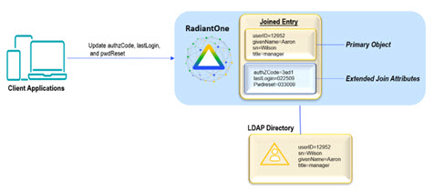
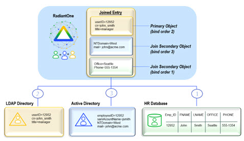
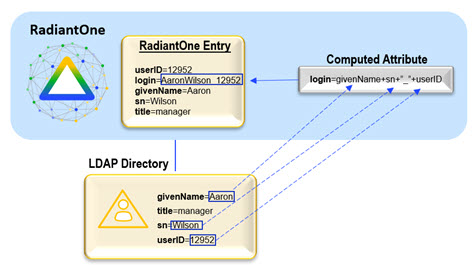
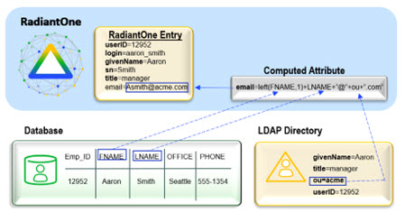

## Concepts Introduction

The following are concepts that you should understand in order to configure and administer RadiantOne Identity Data Management. 

  - [Data Source](#data-source)
  - [Union](#union)
  - [Identity Correlation](#identity-correlation)
  - [Joins](#joins)
  - [Bind Order](#bind-order)
  - [Computed Attributes](#computed-attributes)
  - [Interception Scripts](#interception-scripts)
  - [Groups](#groups)
  - [Schema Extraction](#metadataschema-extraction)
  - [Delegated Authentication](#delegated-authentication)

## Data Source

A data source in RadiantOne represents the connection to a backend. This could be a source that is LDAP-accessible (LDAP Data Source), JDBC-accessible (Database Data Source), or accessible through an API call (Java, web service or REST using a Custom Data Source). Data sources can be managed from the Main Control Panel > Data Catalog > Data Sources.


 
>[!warning] Two LDAP data sources named vdsha and replicationjournal are included by default. These data sources contain connections to all RadiantOne nodes in a given cluster. One node is defined as the primary server and all others as failover servers. The vdsha data source is used internally by many operations including persistent cache refreshes. The replicationjournal data source is used internally for inter-cluster replication. These data sources should not be deleted or have their status changed to “offline”.

Configuring connections to all backends from a central location simplifies the management task when changes to the backend are required. For details on managing data sources (add, edit, and delete), please see [Data Sources](../configuration/data-sources/data-sources.md).

Data sources are used when configuring virtual views from database backends, LDAP backends, and joins. 

LDAP data sources defined for RadiantOne are contained in <RLI_HOME>/vds_server/datasources/ldap.xml. Database data sources are contained in <RLI_HOME>/vds_server/datasources/database.xml, and custom data sources are contained in <RLI_HOME>/vds_server/datasources/custom.xml.

>[!warning] One of the main purposes of having a data source defining the connection is to isolate the connection string from the metadata files (.dvx and .orx). It is strongly recommended that you use generic data source names that can remain (be relevant) as you migrate from a development to production environment where you only need to change the connection information. In addition, there are reserved characters that should not be used in data source names which are spaces, commas, brackets or parenthesis, colons, and the word “domain”.

### To Import Data Sources

If you have existing data sources defined ([exported](#to-export-data-sources) from another instance of RadiantOne) and you would like to import those, from the Main Control Panel > Settings Tab > Server Backend section click on the sub-section representing the types of data sources you want to import (LDAP Data Sources, Database Data Sources or Custom Data Sources). On the right side, click **Import**. Browse to the XML file containing the data source definitions that you have exported from another RadiantOne server and click **OK**. 

>[!warning] If a data source in the import file has the same name as an existing data source, the existing data source is overwritten by the one you are importing.

### To Export Data Sources

If you have existing data sources defined in a RadiantOne server and you would like to re-use them for another RadiantOne server, from the Main Control Panel > Data Catalog > Data Sources, click **...** in the upper-right corner and select **Export**). Select the data sources you want to export, indicate a file name and location and click **Export**.


You can then copy the export file to the desired RadiantOne server and use the [Import](#to-import-data-sources) option to import the data sources.

>[!warning] The following default data sources are included with RadiantOne: vdsha (points to the RadiantOne nodes in the cluster), advworks, derbyorders, derbysales, examples, northwind, log2db, and vdapdb (points to the local Derby database server), and replicationjournal (points to a local RadiantOne Universal Directory store and is used for inter-cluster replication). Therefore, be aware that when you import one of these data sources on the target RadiantOne server, the data sources with the same name are overwritten. For this reason, it is recommended that you do not export these data sources.

## Union

Union is a well-known term in the RDBMS-world and the value of the union operation is key for any federated identity service. Union is essentially the ability to create a list where every user is listed once and only once, even if they appear multiple times in the data stores across the enterprise. User overlap can occur for several different reasons. There could be one user listed numerous times, or multiple users with the same name spread across disparate data silos. The result of a union is a unique list of users that is indexed for each system which enables fast and easy lookups. The reason this capability is critical for an identity service is because it makes the identification of a user more accurate and efficient. 

For example, if you don’t have a single source of users, an application would have to look in all the different data stores across the enterprise to find a particular user. Even if a user is listed in only one store (unless that exact store is already known), an application still needs to locate them, resulting in multiple queries issued (at least one to each source the user could potentially be located in). However, if you have a master index (an “identity hub”), the client application only needs to query this list to locate a user, which results in queries to only the backend stores where the user is located. The more sources involved, the more valuable this global index is. It is this global list that is created and maintained by RadiantOne. 

In cases where the data stores contain user overlap, RadiantOne performs aggregation and correlation, creating a common key to identify users across disparate systems. However, the union operation is still important for data sources that may or may not have identity intersection. If they do not have identity overlap there is no need for correlation, but the function of union is still crucial for building your identity service.

The diagrams below provide a summary/review of data sources containing duplicate/intersecting identities.

In the first scenario, the data sources have no overlap of identities. In this scenario the benefits of union would still be important for identity management since a single unique index/list is still required for applications to identify a user for authentication. However, the design effort is a bit easier as no correlation logic is required. An aggregation of sources A, B, and C is sufficient, so the primary design consideration in this case is what hierarchy applications are expecting and to build this namespace accordingly.


In cases where there starts to be user overlap (as seen in Sources A and B in the diagram below), the configuration starts to require correlation. In this scenario, an aggregation of users from sources A, B and C is required in addition to correlation for the overlapping users in sources A and B. The design considerations now involve correlation logic in addition to where you want the unique list of users to appear in the virtual namespace.


In scenarios where the number of data sources increases, the amount of overlapping identities varies (as depicted in the diagram below), and the logic required to correlate identities becomes complex with the possible need of cascading rules to determine correlation, RadiantOne can create the union of identities which is the basis for supporting authentication and authorization and the foundation for the RadiantOne Identity Data Platform.


## Identity Correlation

Identity overlap means a same user exists in more than one data source. If there is not a single identifier that is common for the overlapping users, then correlation logic is required to determine the match. Correlation links the common users and is required to build a unique list. 

To correlate identities, a logical rule must exist for each data source so that a combination of attributes (eventually transformed) will yield a match for common users. For each source, different attributes can be used to generate the correlation logic. 

To build a virtual view that correlates identities, use the Global Identity Builder. See the [RadiantOne Global Identity Builder Guide](../configuration/global-identity-builder/introduction.md) for details.

## Joins

Joining is a way to combine information from multiple data sources into a single entry. There are two types of joins in RadiantOne. One type is known as a [regular join](#regular-join) and the other is an [extended join](#extended-join). Each is described below.

### Regular Join

A Regular Join is defined as adding existing attribute(s) from another data source(s) to a virtual entry. The starting point for the join is known as the primary (or main) object. The data sources to be joined are known as secondary (or target) objects. Any object in the RadiantOne namespace can be a primary or secondary object. In RadiantOne, entries representing the same user across all data sources must have a unique identifier (common key) or a set of common identifiers in order to join. In the diagram below, the LDAP directory has been joined with Active Directory and a database based on a common value of userID matching EmployeeID in Active Directory and Emp_ID in the database.


### Extended Join

An extended join is defined by adding new attributes (meaning these attributes don’t exist anywhere yet) to a virtual entry. This is primarily used to accommodate the storage of application-specific attributes. In the case of an extended join, RadiantOne handles the creation and management of the new attributes. The new attributes are stored in a local RadiantOne Universal Directory (HDAP) store or any backend that has been virtualized. RadiantOne then joins the primary entries with these extended attributes and handles the lifecycle of these attributes accordingly.

The diagram below depicts an extended join. AuthzCode, lastLogon, and pwdreset are the application-specific extension attributes that are stored in a local RadiantOne Universal Directory store. RadiantOne manages the lifecycle (creation, modification, deletion) of the entries/attributes in the local store.



## Bind Order

If you have configured joins between multiple sources, RadiantOne can send the bind request (credential checking) to many backends (any that play a role in the join). If you are not using joins, then bind order is irrelevant.

After the join is configured, you can set the bind order (the backends to check in a particular order). The diagram below depicts an example. The database is configured with bind order 1. Therefore, RadiantOne attempts the bind there first. If the bind fails against the database, the LDAP directory receives the bind request (as per the configuration). If the bind were to fail again, Active Directory would receive the bind request. If all sources fail, the client receives a bind failure error from RadiantOne.



## Computed Attributes 

If the entries in virtual view should include attributes that are derived from existing attributes, you can use Computed Attributes. Computed attributes can be based on attributes from the primary object, secondary objects (from joins), and/or previously computed attributes.

If you need to create a computed attribute from a previously computed attribute, that attribute must appear first in the list in the Computed Attributes window.

The diagram below depicts a computed attribute named login that can be computed based on the attributes givenName, sn, and uid.



The diagram below depicts a computed attribute example where the value is comprised of attributes coming from both the primary and secondary objects.



## Interception Scripts

Interception scripts are written in Java and used to override the default behavior of RadiantOne to implement functionality to meet your needs. Examples of functionality you can introduce are:

-	Complex mappings (concatenations, or string manipulations)

-	Override the incoming query (pre-processing)

-	Processing/changing a result (post processing)

>[!warning]
>Interception scripts are powerful and offer a lot of flexibility. However, this logic is executed inside RadiantOne so caution should be taken to ensure no undesirable effects. It is highly recommended that you engage Radiant Logic Professional Services to write the interception script(s). If you choose to write your own script(s), the Radiant Logic support team might be unable to diagnose problems in a timely manner. This can result in additional consultation fees imposed on the customer related to the time required to assess and certify the script logic. This is beyond the scope of support and falls under Radiant Logic Professional Services.

Interception scripts can be configured at a [global level](../configuration/global-settings/global-interception) (to apply to all root naming contexts configured for the RadiantOne namespace), or for a specific backend (LDAP, Database, Web Services). For details on how to enable interception scripts for your specific type of backend, please see the [Identity Views Guide](../identity-views/identity-views#interception-scripts). This section describes the tasks that are common for interception scripts no matter where they are enabled.

1.	After the script has been enabled from the Main Control Panel click Save in the upper right corner and apply the changes to the server. 

2.	Edit the script located in: `<RLI_HOME>/vds_server/custom/src/com/rli/scripts/intercept/<naming_context>`
<br>If you are using a global Interception, the script is: <RLI_HOME>/vds_server/custom/src/com/rli/scripts/intercept/globalIntercept.java

3.	Rebuild the intercept.jar file by clicking **Build Interception Jar** or by using ANT: C:\radiantone\vds\vds_server\custom>c:\radiantone\vds\ant\bin\ant.bat buildjars

4.	Restart the RadiantOne service. If RadiantOne is deployed in a cluster, you must restart the service on all nodes. Your script logic should now be invoked for the operations you have enabled.

For samples of interception scripts, please see the Radiant Logic Knowledge Base at: https://support.radiantlogic.com

Only registered customers have access to the Knowledge Base. 

>[!warning]
>If errors result from interception scripts, error code 1 is always returned by the script. To override this default behavior, and customize/return error codes based on
>the script logic, set useInterceptionErrorCodeOnViews to true using the following command:
>```
>https://radiantoneservice:8090/adap/util?action=vdsconfig&commandname=set-property&name=useInterceptionErrorCodeOnViews&value=true
>```
>For more information, including how to authenticate and issue configuration updates using the REST-based configuration API see:
>[Command Line Configuration](/command-line-configuration-guide/01-introduction).


## Groups

Groups in an LDAP directory categorize sets of people who share common roles within an organization. They are primarily used to simplify the configuration of access permissions. Managing access permissions for all individuals on a per-user basis can be time-consuming and inefficient. Grouping users and assigning access permissions to the entire group is a better approach.

### Authorization Enforcement Point

When it comes to evaluating access permissions/authorization, the notion of enforcement point should be understood. Based on the specific configuration/use case, the enforcement point is the application itself, and/or RadiantOne.

  **Application Enforcement:**
  <br>Typically, in situations where the application is configured to assign roles to specific groups, it will be the enforcement point for authorization. This is common with Web Access Management (WAM) products. The application searches the directory for the groups and then checks group membership to see if a particular user should have access to a protected resource. In this scenario, RadiantOne only must respond with groups and members, and the application enforces authorization for the resources it protects.

  **RadiantOne Enforcement:**
  <br>[Access control checking](06-security#access-control) can be turned on or off at the level of RadiantOne. If access control checking is enabled, every time a user authenticates to RadiantOne, it verifies whether the user (or a group the user is a member of) has permissions to access the entries. It allows or denies access based on permissions that have been defined. 

Both the application and RadiantOne can play a role in authorization enforcement if required. If access control checking is enabled in RadiantOne, it decides whether the service account the application connects to the directory with can see groups or not. Then, after reading the group entries, the application decides whether a particular user can access a resource based on roles that are defined in the application itself.

### Static & Dynamic LDAP Groups

Group members can be either static (explicit member DN in the group entry) or dynamic (group members are built based on specific criteria). The benefit of dynamic groups is that they are easier to define and manage because all group members do not need to be manually added/removed one at a time. Only a common filter that encompasses all group members needs to be configured. If a user entry changes (and the change impacts an attribute used in a dynamic group) they are automatically added/removed from groups without requiring a change in the group definition. However, the disadvantage of dynamic groups is that not all LDAP directories support them and even fewer LDAP applications can consume them. This is because the application logic must include the ability to not only request a group but be able to evaluate the memberURL attribute which requires them to issue an additional search to the directory to get the list of members.

The differences between static and dynamic groups are depicted in the diagrams below.


 
### Groups Supported by RadiantOne

RadiantOne can be configured for both static and dynamic LDAP groups (as they are described above). In RadiantOne, static and dynamic LDAP groups are described and configured as user-defined groups. RadiantOne also offers auto-generated groups in which both the group names and members are dynamically created.

All types of groups can be created with the [Groups Builder wizard](05-creating-virtual-views#groups-builder). This section focuses on the definition of each type.

  **User-Defined Groups**
<br>Static group names are explicitly listed for the group entry (just as with “standard” LDAP group entries). A user-defined group may be named anything and have members that are either statically defined or dynamically created based on a specific rule (dynamically assigned group members are similar to “standard” LDAP dynamic groups). The diagram below depicts an example of user-defined groups with dynamic members. In the example, group members are built dynamically based on the department attribute in the user entries. If a user’s department were to change, they would automatically be reflected as a member of the new group. For simplicity, only the member ID is shown in the virtual entry whereas the full user DN is returned (as an LDAP client expects) when these groups are requested.


Static group members are specific user DNs explicitly listed as members for the group entry. Static group members can be any user DN in the virtual directory tree which means they can come from any backend source.

Dynamic group members are assigned to groups based on rules defined for specific attributes. The attribute values determine which group the member is associated with. First, determine the starting point in the virtual namespace to locate the possible group members. Then, decide which attribute(s) of these entries should be used to determine which group they belong to. For example, if all user entries that contain a department attribute value of “Sales” or “Sales Associate” should be a member of the Sales group, then the LDAP filter used in the rule would look like: (|(departmentNumber=Sales)(departmentNumber=Sales Associate)). Any valid LDAP filter can be used to create the rule for populating group membership.

**Auto-Generated Groups**

With auto-generated groups, group names are determined based on all possible values of a specified user attribute. The attribute values to determine the group names can be pulled from any virtual entries. First, determine the starting point in the virtual namespace to locate entries that contain the attribute you want to base group names on. Then, decide which attribute of these entries contains the possible group names. For example, if all user entries contained a department attribute, possible group names could be determined by creating a unique list of all possible departments. The list is the basis for creating the group names. If all users were associated with one of five different departments (Marketing, Sales, HR, Support, Engineering), then there would be a total of five auto-generated group names based on these values. The group members are determined dynamically based on the value of their department attribute.

>[!warning] The attribute you select to base the auto-generated group names on must be single-valued in the user entries.

The diagram below depicts an example of auto-generated groups with both group names and members generated dynamically. In this example, department names are the basis for determining the group names in RadiantOne. This offers an enormous amount of flexibility. If a new department were to appear in the database, a new group would automatically appear in RadiantOne with this new name. Group members are built dynamically based on the department attribute in their entries. If a user’s department were to change, they would automatically be reflected as a member of the new group in RadiantOne. For simplicity, only the member ID is shown in the virtual entry whereas the full user DN will be returned (as an LDAP client expects).


 
See the [Groups Builder wizard](05-creating-virtual-views#groups-builder) for details on creating both user-defined and auto-generated groups.

## Metadata/Schema Extraction

A main key capability of RadiantOne is metadata/schema extraction. To virtualize each [data source](#data-source) the first step is to discover the metadata/schema. This is essential for understanding how each data source stores identities and the related context about the identities. During the schema extraction process, existing objects, attributes and relationships are discovered. This metadata allows RadiantOne to create a global common model of all objects and is the core/basis for defining virtual views. This entire process is depicted in the diagram below.


 
The schema extraction process can be launched from the Main Control Panel > Context Builder tab > Schema Manager sub-tab.

## Delegated Authentication

Since all data sources store user and password information differently (and use varying encryption mechanisms), it is important for RadiantOne to be able to delegate the bind to the underlying source when needed. The first step is to build a federated namespace from all sources where user information resides.

After the federated namespace has been built, an application can query RadiantOne and unknowingly be able to search across numerous sources of user information.


 
### Authentication – Client Issues the Bind DN

When a user logs in with a username and password, some applications send a search request to find (“identify”) the user’s entry. Once the user is in the RadiantOne namespace, the entry is returned to the application (the entry contains the virtual DN for the user, which is where the user exists in the RadiantOne namespace). The application then issues a bind request using the virtual DN and the password that was entered during the login process. For clarity, this process is described in two steps depicted in the diagrams below: Identification and Credentials Checking.

In the example below, the backend source is an LDAP directory that is mounted in the RadiantOne namespace using a proxy configuration. Again, there are two steps in the process: Identification and Credentials Checking. 
 


 
If the underlying source does not understand an LDAP bind operation (i.e. a relational database), RadiantOne can be customized to encrypt the password that was passed from the client using the appropriate algorithm and then compare that value with the value stored in the database (the attribute that has been mapped to userPassword) to decide whether the bind succeeds or fails. This encryption is performed via an interception script. As mentioned before, the entire authentication process happens in two steps: Identification and Credentials Checking. They are depicted below.


 

 
A template for the interception script is provided and can be customized to use the needed encryption algorithm. 

### Authentication – Client Issues a User ID Only

If a client application only sends a user ID to RadiantOne, and is not configured to first search for the user and then issue a bind with the full DN, RadiantOne can be configured with User ID to DN Mappings (to first find the DN and then issue the bind to the appropriate backend source). For details on configuring User ID to DN Mappings please see [User to DN Mapping](interception#user-to-dn-mapping). The following diagram depicts the process.

>[!warning]
>The Identification and Credentials Checking steps still happen, however, they are both performed by RadiantOne (first find the user, then Bind to check credentials).


 
