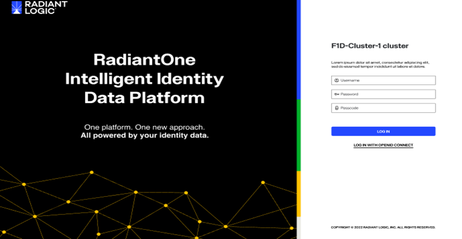
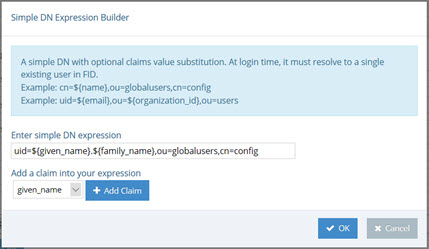
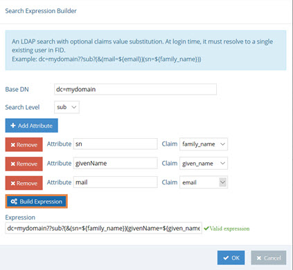

## Accessing the Control Panel
The Control Panels utilize a web server that is installed with RadiantOne. The endpoint to access the Control Panel is defined when you create an environment in the Environment Operations Center. For details on creating environments and locating the Control Panel endpoint, see the [RadiantOne Environment Operations Center Guide](/documentation/environment-operations-center-guide/overview).



## Authentication 

### Username and Password 
Log in using the directory administrator (cn=directory manager) as the user with the password you set during the install of RadiantOne. Once logged in, the Directory Administrator should navigate in the Control Panel to the ADMIN section and define other users needed to administer RadiantOne. A user can either use their full DN (if known), or their user ID. However, to login with just a user ID, you must configure a [user ID to DN Mapping](03-front-end-settings#user-to-dn-mapping).

The Main Control Panel displays a message when authentication fails. The table below lists the possible error messages. 

Message	 | Cause | Solution
-|-|-
“Authentication failed. Reason: Access is denied.” | Incorrect login ID or incorrect password. | Verify the login ID and password and try again.
"Authentication failed. Reason [LDAP: error code 49 - Password has expired.]" | The user's password has expired. | If the client application supports password reset capabilities, the user can reset their password. <br>The Main Control Panel supports resetting expired passwords. The user can click the *Reset Password* link in the message displayed on the Main Control Panel to set a new password. If the [password policy](06-security#password-policy-associated-with-control-panel-delegated-administrator-roles) associated with the user requires the current password to set a new password, the user is prompted to enter their current password along with the new password. 
“Authentication failed. Reason: [LDAP: error code 19 - The password failure limit has been reached and the account is locked. Please retry later or contact the system administrator to reset the password.]” | The account is locked. | Retry later or contact the system administrator to reset the password.

### Last Login Time
The time the user last logged into the Control Panel is displayed above the "Logged in as..." information shown in the top right.


### MFA 

### OIDC Token 
The RadiantOne Main Control Panel also supports SSO with your corporate Identity Provider using OpenID Connect (OIDC) token-based authentication. This option provides the security of sending user login credentials to the authentication server (the Identity Provider), not the application (Control Panel, the Relying Party). OpenID Connect token authentication allows you to send your username and password just once, to the Identity Provider (IDP) and then pass the token in the request to the Main Control Panel. When OIDC is configured in RadiantOne, the Main Control Panel login screen displays:


The administrator must click the Login with OpenID Connect option to login with an OpenID Connect token.

The high-level flow is shown below.


Detailed steps:

1.	The RadiantOne Admin navigates his browser to the RadiantOne Main Control Panel and clicks “Login with OpenID Connect”.

2.	The browser redirects the user to the OIDC Provider’s authorization endpoint with the necessary parameters (ClientID, redirect URI, scope).

3.	The RadiantOne Admin will authenticate to OIDC server (if not already authenticated) and the OIDC server prompts the user for authorization: Control Panel wants to access info (scopes) about you. Do you Authorize this?

4.	Admin user gives consent.

5.	OIDC server gives Control Panel an Authorization code.

6.	The Control Panel sends the OIDC server the authorization code and requests an ID token.

7.	OIDC Server sends the ID token to Control Panel.

8.	Control Panel uses the information in the token along with the OIDC to FID User Mapping rules to locate the user in the FID namespace to enforce permissions based on what delegated admin role the user is a member of – which dictates what the admin is allowed to do within the Control Panel.

To enable support for OIDC authentication:

1.	Have your client ID and secret associated with the Control Panel application configured in your OIDC server ready. The Redirect URL configured for the web application should point to the URL associated with the Main Control Panel. Example: https://cp.federated-identity.com/main/j_spring_openid_security_check

2.	Log into the Main Control Panel.

3.	Navigate to Settings > Security > OIDC Provider Configuration.

4.	Select an OIDC Provider from the drop-down list. If you are using your own provider, select the Custom option.

5.	Click Discover. The Authorization Endpoint URL and Token Endpoint URL should auto-populate. If you configure a custom provider, you can enter the needed Authorization Endpoint URL and Token Endpoint URL. In OpenID Connect the authorization endpoint handles authentication and authorization of a user. In the OpenID Connect Authorization Code Flow, the token endpoint is used by a client to obtain an ID token, access token, and refresh token.

6.	Enter the Client ID associated with the Control Panel application configured in the OIDC provider.

7.	Enter the Client Secret associated with the Control Panel configured in the OIDC provider.

8.	Select the Client Authentication Method corresponding to how the Control Panel client has been configured in the OIDC Server. There are two options available: CLIENT_SECRET_POST and CLIENT_SECRET_BASIC.

9.	Click the value for Requested Scopes to display a list of possible choices: openid, email, profile. Openid is required. You can add more if needed as long as they match the configuration of the client in the OIDC server.

10.	Click Edit next to OIDC to FID User Mapping. This configuration determines the logic to link the user that logs into the Control Panel with an Open ID Connect token with an identity in the RadiantOne namespace. This process determines which identity is used to enforce authorization within the Main Control Panel. The user mappings must result in a single user. If no user is found or if more than one user is found, the login fails. The RadiantOne user that is linked to the authentication token must be a member of a RadiantOne [Delegated Administrative group](01-introduction#delegated-administration-roles). 

11.	In the OIDC to FID User Mappings window, click `Add`.

12.	There are two options for identifying the RadiantOne admin user. If the RadiantOne user can be identified by using values/claims from the token to comprise the DN, use the Simple DN Expression Builder. If the RadiantOne user can be identified by performing a lookup in RadiantOne based on values from the token, use the Search Expression Builder.

13.	Click `Save`.

Examples of configuring the Simple DN Expression and the Search Expression are shown below.

In the Simple DN Expression example shown below, the RadiantOne user is identified by using the given_name and family_name claims from the token to compute the DN.



In the Search Expression example shown below, the values of the family_name, given_name, and email claims from the token are used to condition a sub-tree search in RadiantOne, starting at the dc=mydomain naming context to locate the identity.



To disable support for OIDC authentication:

1. Log into the Main Control Panel. 

1. Navigate to Settings > Security > OIDC Provider Configuration.

1. Click the Enabled toggle from on to off. 

	

1. Click **Save**.

   
## Authorization 
Roles-based access controls is used to enforce privileges for Control Panel. Any user that can authenticate to RadiantOne can administrator the service if they belong to the proper group that is associated with one of the delegated administrator roles. RadiantOne includes default delegated admin roles that users can be assigned to. Custom delegated admin roles can also be defined. 
Roles & permissions are managed from Control Panel > Admin > Roles & Permissions.

Describe classification of permissions. Describe how permissions can be defined per data source.

### Default Delegated Admin Roles
The default delegated admin roles can be viewed from Control Panel > Admin > Roles & Permissions. The default roles cannot be edited. However, you can use the default role definition as a basis for defining a new custom role by choosing the default role from the list when prompted to *Clone Permissions* during new role creation.

**Directory Administrator:**  Members assigned this role can perform all operations (all operations that the other default roles can perform) in addition to being able to update username and password properties for data sources via an LDAP modify command.

Control Panel Config	| Permissions
-|-
SETUP > Data Catalog > Data Sources | View & Edit
SETUP > Data Catalog > Template Management | View & Edit
SETUP > Directory Namespace | View & Edit
MANAGE > Directory Browser | View & Edit
MANAGE > Tasks | View & Edit
MANAGE > Security | View & Edit
GLOBAL SETTINGS | View & Edit
ADMIN > User Management | View & Edit
ADMIN > Roles & Permissions | View & Edit
ADMIN > Directory Manager Settings | View & Edit
ADMIN > Control Panel Config | View & Edit
ADMIN > Access Tokens | View & Edit

**Namespace Administrator:**  Members assigned this role are responsible for managing the RadiantOne namespace. The namespace is managed from Control Panel > SETUP > Directory Namespace > Namespace Design.
The responsibilities include:
-  Creating new naming contexts and mounting backends
-  Configuring and managing identity views
-  Creating and managing RadiantOne directory stores
-  Creating and managing synchronization pipelines 

Control Panel Config	| Permissions
-|-
SETUP > Data Catalog > Data Sources | View & Edit
SETUP > Data Catalog > Template Management | View & Edit
SETUP > Directory Namespace | View & Edit
MANAGE > Directory Browser | View & Edit
MANAGE > Tasks | View & Edit
MANAGE > Security | View Only
GLOBAL SETTINGS | View Only
ADMIN > User Management | View Only
ADMIN > Roles & Permissions | View Only
ADMIN > Directory Manager Settings | View Only
ADMIN > Control Panel Config | View Only
ADMIN > Access Tokens | View Only


**Schema Administrator:**  Members assigned this role are responsible for managing the RadiantOne LDAP schema. The schema is managed from Control Panel > SETUP > Directory Namespace > Directory Schema.
The responsibilities include:
- Creating new LDAP object classes and attributes
- Extending the RadiantOne LDAP schema with objects and attributes from data source (backend) schemas.
- Importing new LDIF formatted files to extend the RadiantOne LDAP schema.

Control Panel Config	| Permissions
-|-
SETUP > Data Catalog > Data Sources | View & Edit
SETUP > Data Catalog > Template Management | View & Edit
SETUP > Directory Namespace | View & Edit
MANAGE > Directory Browser | View Only
MANAGE > Tasks | View Only
MANAGE > Security | View Only
GLOBAL SETTINGS | View Only
ADMIN > User Management | View Only
ADMIN > Roles & Permissions | View Only
ADMIN > Directory Manager Settings | View Only
ADMIN > Control Panel Config | View Only
ADMIN > Access Tokens | View Only
 

**Security Administrator:**  Members assigned this role are responsible for managing access controls, password policies, and attribute encryption. 
Access controls are managed from Control Panel > MANAGE > Security > Access Controls.
The responsibilities include:
- Creating and managing access controls
- Creating and managing password policies
- Managing attribute and LDIF file encryption
- Manage access tokens

Control Panel Config	| Permissions
-|-
SETUP > Data Catalog > Data Sources | View Only
SETUP > Data Catalog > Template Management | View Only
SETUP > Directory Namespace | View Only
MANAGE > Directory Browser | View Only
MANAGE > Tasks | View Only
MANAGE > Security | View & Edit
GLOBAL SETTINGS | View Only
ADMIN > User Management | View Only
ADMIN > Roles & Permissions | View Only??????
ADMIN > Directory Manager Settings | View Only
ADMIN > Control Panel Config | View Only
ADMIN > Access Tokens | View & Edit

**Operator**

**Read Only:**  Members assigned this role can only view configurations. They are not allowed to edit anything.

Control Panel Config	| Permissions
-|-
SETUP > Data Catalog > Data Sources | View Only
SETUP > Data Catalog > Template Management | View  Only
SETUP > Directory Namespace | View  Only
MANAGE > Directory Browser | View Only
MANAGE > Tasks | View Only
MANAGE > Security | View Only
GLOBAL SETTINGS | View Only
ADMIN > User Management | View Only
ADMIN > Roles & Permissions | View Only
ADMIN > Directory Manager Settings | View Only
ADMIN > Control Panel Config | View Only
ADMIN > Access Tokens | View Only

### Creating Roles 
Custom roles can be created from Control Panel > Admin > Roles & Permissions.
1. Click **ADD ROLE**.
2. Enter the role name.
3. (Optional) select an existing role to quickly clone/assign similar permissions to the new role.
4. Click **OK**.
5. Go through each set of permissions and assign the proper privilege: None, View Only, or View & Edit.
6. Click **SAVE**.


## Customizing the Interface 

### Color theme 

### Message of the Day 

### Banner 

## Navigating the Control Panel 

### Dashboard 

### Setup

**Data Catalog**

*Data Sources (managing data sources)*

*Schemas (managing schemas)*

*Drivers and Templates (managing templates)*

**Directory Namespace**

*Namespace Design*

*Directory Schema*

*Global Identity Builder*

### Manage 

**Directory Browser**

Searching 

Managing Entries (CRUD on users and groups) 

**Tasks**

**Security**  

*Attribute Encryption*

*Password Policies* 

*Access Controls* 


### Global settings

*Client Protocols*  

LDAP, SCIM, REST 

*Client Certificates*

*Token Validators* 

*Tuning* 

*Attributes Handling*

*Changelog*

*Log Settings* 

### Admin  

**Directory Admin Settings** 

*Directory Manager Account*
The directory manager (cn=directory manager by default) is the super user for the directory and this account is defined during the RadiantOne install. For details on defining this account, see the Environment Operations Center Guide.

The super user is the only user that can login to the Main Control Panel while RadiantOne is not running. When you log into the Main Control Panel with this user, you can perform any of the operations described in [Delegation Administration](01-introduction.md#delegated-administration-of-radiantone). Also, access permissions and password policies do not apply for this user. This safety measure prevents someone from accidentally denying the rights needed to access and manage the server. Access to this super user account should be limited. If you require many directory managers, add these as members to the [Directory Administrator Role](01-introduction.md#delegated-administration-roles) instead of having them all use the single super user account.

The RadiantOne super user account is associated with an LDAP entry in the RadiantOne namespace located at: cn=Directory Manager,ou=RootUsers,cn=config. Cn=Directory Manager,ou=RootUsers,cn=config is authorized the same as cn=Directory Manager. If you want to log into the Main Control Panel with a [PIV Card/Certificate](01-introduction#logging-in-with-piv-cardsmart-cardcertificate) as the super user, you can store the certificate in the entry at this location.

To configure the Directory Manager username:

1.	In the Main Control Panel, go to the Setting Tab > Server Front End section > Administration sub-section.
2.	In the Directory Manager Settings section on the right side, edit the value in the User name field.

>[!warning] 
>The new value of the parameter should be in the same syntax: `cn=<new user value>`.

3.	Click **Save**.

4.	Restart the RadiantOne service.

5.	Re-open the Main Control Panel.

6.	Log in as the new user.

If you update the Directory Manager username, the LDAP entry in the RadiantOne namespace is located at: cn=Directory Manager,ou=RootUsers,cn=config is updated with a seeAlso attribute that contains the value of the new username. This allows the new username to be used to log into the Main Control Panel.

*Directory Manager Password*

The directory administrator (e.g. cn=directory manager) password is set during the install of RadiantOne and can be updated in Control Panel. You must know the current password to update the password. To change this password, from the Main Control Panel > Settings Tab > Administration section, click “Change the password” link. Enter the old (current) password and the new value. Confirm the new value and click **Save** in the upper right corner.

>[!warning] 
>If you change the password and you are currently logged into the Control Panel as the directory administrator, you must close the Control Panel and re-open it logging in with the new password.

You can also change the directory administrator’s password via LDAP. The DN representing the directory administrator is: cn=Directory Manager,ou=RootUsers,cn=config. The example below is using an LDIF file and the ldapmodify command to modify the password:

`dn: cn=Directory Manager,ou=RootUsers,cn=config`
<br>`changetype: modify`
<br>`replace: userPassword`
<br>`userPassword: newpassword`

An example of the syntax used in the command is shown below, assuming the LDIF file described above is named ChangePassword.ldif. You must bind as the cn=directory manager with the current password in order to update the password with this LDAP command.

ldapmodify.exe -D "cn=Directory Manager,ou=RootUsers,cn=config" -w currentpassword -h localhost -p 2389 -f c:\radiantone\ChangePassword.ldif

>[!note] 
>The RadiantOne service may be running when this command is executed.

You can also change the directory administrator's password via REST (ADAP API). The following commands can be issued from a Linux client that is able to connect to the RadiantOne service's REST endpoint.
Set the following on the Linux client:
```
REST_ENDPOINT="https://localhost:9101"
BIND_DN="cn=Directory Manager"
BIND_USER_DN="cn=Directory Manager,ou=rootusers,cn=config"
CURRENT_PASSWORD="MySuperSecretPassw0rd2"
NEW_PASSWORD="MySuperSecretPassw0rd3"
BASE64_USERNAME_PASSWORD=$(echo -n $BIND_DN:$CURRENT_PASSWORD | base64)
```

Run the following curl command on the Linux client:
```
curl -k --location --request PATCH "$REST_ENDPOINT/adap/$BIND_USER_DN" \
--header "Content-Type: application/json" \
--header "Authorization: Basic $BASE64_USERNAME_PASSWORD" \
--data '{
   "params": {
      "mods": [
       {
         "attribute": "userPassword",
         "type": "REPLACE",
          "values": [
           "'$NEW_PASSWORD'"
           ]            
          }
       ]
   }
}'
```

<br>
If the command is successful, an HTTP status of 200 is returned: 
{"httpStatus":200}

An example of using Postman as a REST client to update the cn=directory manager password is shown below.
1. Add an Authorization header that contains Basic with the base 64 encoded value for cn=directory manager:currentpassword. Use cn=directory manager in the authorization header value, not cn=Directory Manager,ou=RootUsers,cn=config. E.g. <br>Basic Y249RGlyZWN0b3J5IE1hbmFnZXI6bmV3cGFzc3dvcmQxMjM=

2. Issue a PATCH operation with `http://RESTENDPOINT:8089/adap/cn=Directory Manager,ou=RootUsers,cn=config` with the following body:

```
{
    "params": {
        "mods": [
            {
                "attribute": "userPassword",
                "type": "REPLACE",
                "values": ["newpassword"]
            }
        ]
    }
}
```


*Administrators Group DN*

This parameter can be set to the DN of the Administrators group defined in the virtual namespace. The administrators group is checked for authorization purposes as members of this group do not have limits or password policy enforced for them. To manage this value, from the Main Control Panel > Settings Tab > Administration section, locate the Administrators Group DN parameter. Enter the value of a valid group DN located in the virtual namespace.

**User Management**

**Roles & Permissions** 

**Control Panel Configuration**  
The Control Panel supports SSO with your corporate Identity Provider using OpenID Connect (OIDC) token-based authentication. This option provides the security of sending user login credentials to the authentication server (the Identity Provider), not the application (Control Panel, the Relying Party). OpenID Connect token authentication allows you to send your username and password just once, to the Identity Provider (IDP) and then pass the token in the request to the Main Control Panel. When OIDC is configured in RadiantOne, the Main Control Panel login screen displays:


The administrator must click the Login with OpenID Connect option to login with an OpenID Connect token.

The high-level flow is shown below.


Figure 4: OIDC Authorization Code Flow

Detailed steps:

1.	The RadiantOne Admin navigates his browser to the RadiantOne Main Control Panel and clicks “Login with OpenID Connect”.

2.	The browser redirects the user to the OIDC Provider’s authorization endpoint with the necessary parameters (ClientID, redirect URI, scope).

3.	The RadiantOne Admin will authenticate to OIDC server (if not already authenticated) and the OIDC server prompts the user for authorization: Control Panel wants to access info (scopes) about you. Do you Authorize this?

4.	Admin user gives consent.

5.	OIDC server gives Control Panel an Authorization code.

6.	The Control Panel sends the OIDC server the authorization code and requests an ID token.

7.	OIDC Server sends the ID token to Control Panel.

8.	Control Panel uses the information in the token along with the OIDC to FID User Mapping rules to locate the user in the FID namespace to enforce permissions based on what delegated admin role the user is a member of – which dictates what the admin is allowed to do within the Control Panel.

To enable support for OIDC authentication:

1.	Have your client ID and secret associated with the Control Panel application configured in your OIDC server ready. The Redirect URL configured for the web application should point to the URL associated with the Main Control Panel. Example: https://cp.federated-identity.com/main/j_spring_openid_security_check

2.	Log into the Main Control Panel.

3.	Navigate to Settings > Security > OIDC Provider Configuration.

4.	Select an OIDC Provider from the drop-down list. If you are using your own provider, select the Custom option.

5.	Click Discover. The Authorization Endpoint URL and Token Endpoint URL should auto-populate. If you configure a custom provider, you can enter the needed Authorization Endpoint URL and Token Endpoint URL. In OpenID Connect the authorization endpoint handles authentication and authorization of a user. In the OpenID Connect Authorization Code Flow, the token endpoint is used by a client to obtain an ID token, access token, and refresh token.

6.	Enter the Client ID associated with the Control Panel application configured in the OIDC provider.

7.	Enter the Client Secret associated with the Control Panel configured in the OIDC provider.

8.	Select the Client Authentication Method corresponding to how the Control Panel client has been configured in the OIDC Server. There are two options available: CLIENT_SECRET_POST and CLIENT_SECRET_BASIC.

9.	Click the value for Requested Scopes to display a list of possible choices: openid, email, profile. Openid is required. You can add more if needed as long as they match the configuration of the client in the OIDC server.

10.	Click Edit next to OIDC to FID User Mapping. This configuration determines the logic to link the user that logs into the Control Panel with an Open ID Connect token with an identity in the RadiantOne namespace. This process determines which identity is used to enforce authorization within the Main Control Panel. The user mappings must result in a single user. If no user is found or if more than one user is found, the login fails. The RadiantOne user that is linked to the authentication token must be a member of a RadiantOne [Delegated Administrative group](01-introduction#delegated-administration-roles). 

11.	In the OIDC to FID User Mappings window, click `Add`.

12.	There are two options for identifying the RadiantOne admin user. If the RadiantOne user can be identified by using values/claims from the token to comprise the DN, use the Simple DN Expression Builder. If the RadiantOne user can be identified by performing a lookup in RadiantOne based on values from the token, use the Search Expression Builder.

13.	Click `Save`.

Examples of configuring the Simple DN Expression and the Search Expression are shown below.

In the Simple DN Expression example shown below, the RadiantOne user is identified by using the given_name and family_name claims from the token to compute the DN.


Figure 5: DN Expression Builder

In the Search Expression example shown below, the values of the family_name, given_name, and email claims from the token are used to condition a sub-tree search in RadiantOne, starting at the dc=mydomain naming context to locate the identity.


Figure 6: Search Expression Builder

To disable support for OIDC authentication:

1. Log into the Main Control Panel. 

1. Navigate to Settings > Security > OIDC Provider Configuration.

1. Click the Enabled toggle from on to off. 

	

1. Click **Save**.

**Access Tokens** 

**Entry Statistics**

### Switch to Classic Control Panel 
Some settings must be managed using the RadiantOne Classic Control Panel.
To switch to Classic Control Panel, use the menu options for the logged in user in the upper right.


The following settings must be managed from the RadiantOne Classic Control Panel:
-	Synchronization: Classic Control Panel > Synchronization tab <br> See [Synchronization](../configuration/synchronization/synchronization-concepts) for details. 
-	Password Policies​: Classic Control Panel > Settings > Security > Password Policies
-	SCIM config (frontend): ​Classic Control Panel > Settings > Server Front End  > SCIM
-	REST config (frontend)​: Classic Control Panel > Settings > Server Front End > Other Protocols
-	External Token Validators​: Classic Control Panel > Settings > Security > External Token Validators
-	Limits​: Classic Control Panel > Settings > Limits
-	Attribute Handling​: Classic Control Panel > Settings > Server Front End > Attributes Handling
-	Changelog Settings​: Classic Control Panel > Settings > Logs > Changelog
-	Log Settings​: Classic Control Panel > Settings > Logs > Log Settings
-	Control Panel customizations (lock, color theme, session timeout, max users, banner, custom message on login screen)​: ​Classic Control Panel > Settings > Server Front End > Administration
-	PCache Refresh Monitoring: Classic Control Panel > PCache Monitoring tab
-	Intercluster Replication Monitoring: Classic Control Panel > Replication Monitoring tab
-	Zookeeper: Classic Control Panel > ZooKeeper tab
