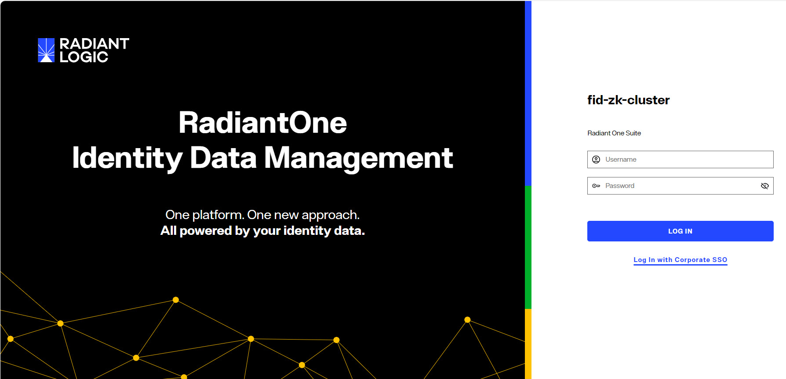

## Overview
The Control Panel is a web-based interface that administrators use to configure and manage the RadiantOne Identity Data Management product.
RadiantOne also offers a configuration API that can be called programmatically with an [Access Token](/documentation/configuration/security/access-tokens).

## Accessing the Control Panels
The Control Panels utilize a web server that is installed with RadiantOne. The endpoint to access the Control Panel is defined when you create an environment in the Environment Operations Center. For details on creating environments and locating the Control Panel endpoint, see [Create Environments](/documentation/installation/create-environments).



For more details, see [Configuration Required in Classic Control Panel](#switch-to-classic-control-panel)

### Classic Control Panel
To switch to Classic Control Panel, use the menu options for the logged in user in the upper right.


The currently logged in user must have permissions to [access the Classic Control Panel](#permissions).

## Authentication 

### Username and Password 
Log in using the directory administrator (cn=directory manager) as the user with the password you set during the install of RadiantOne. Once logged in, the Directory Administrator should navigate in the Control Panel to the ADMIN section and define other users needed to administer RadiantOne. A user can either use their full DN (if known), or their user ID. However, to login with just a user ID, you must configure a [user ID to DN Mapping](/documentation/configuration/global-settings/client-protocols).

The Control Panel displays a message when authentication fails. The table below lists the possible error messages. 

Message	 | Cause | Solution
-|-|-
“Authentication failed. Reason: Access is denied.” | Incorrect login ID or incorrect password. | Verify the login ID and password and try again.
"Authentication failed. Reason [LDAP: error code 49 - Password has expired.]" | The user's password has expired. | If the client application supports password reset capabilities, the user can reset their password. <br>The Classic Control Panel supports resetting expired passwords. The user can click the *Reset Password* link in the message displayed on the Classic Control Panel to set a new password. If the [password policy](documentation/configuration/security/password-policies) associated with the user requires the current password to set a new password, the user is prompted to enter their current password along with the new password. 
“Authentication failed. Reason: [LDAP: error code 19 - The password failure limit has been reached and the account is locked. Please retry later or contact the system administrator to reset the password.]” | The account is locked. | Retry later or contact the system administrator to reset the password.

### Last Login Time
The time the user last logged into the Control Panel is displayed above the "Logged in as..." information shown in the top right.


### MFA 
Support for MFA logins, you must integrate with an OIDC provider that offers MFA. The MFA checking is handled by the OIDC provider. See the OIDC token configuraton below.

### OIDC Token 
The RadiantOne Control Panel supports SSO with your corporate Identity Provider using OpenID Connect (OIDC) token-based authentication. This option provides the security of sending user login credentials to the authentication server (the Identity Provider), not the application (Control Panel, the Relying Party). OpenID Connect token authentication allows you to send your username and password just once, to the Identity Provider (IDP), have MFA validated (if enabled and supported by the Identity Provider), and then pass the token in the request to the Control Panel. When OIDC is configured in RadiantOne, the Control Panel login screen displays:


The administrator must click the "Log in with Corporate SSO" option to login with an OpenID Connect token.

The high-level flow is shown below.


Detailed steps:

1.	The RadiantOne Admin navigates his browser to the RadiantOne Control Panel and clicks “Login with Corporate SSO”.

2.	The browser redirects the user to the OIDC Provider’s authorization endpoint with the necessary parameters (ClientID, redirect URI, scope).

3.	The RadiantOne Admin authenticates to the OIDC server (if not already authenticated) and the OIDC server prompts the user for authorization: Control Panel wants to access info (scopes) about you. Do you Authorize this?

4.	Admin user gives consent.

5.	OIDC server gives Control Panel an Authorization code.

6.	The Control Panel sends the OIDC server the authorization code and requests an ID token.

7.	OIDC Server sends the ID token to Control Panel.

8.	Control Panel uses the information in the token along with the *Claims to User DN Mapping rules* to locate the user in the RadiantOne namespace to enforce permissions based on what delegated admin role the user is a member of – which dictates what the admin is allowed to do within the Control Panel.

To enable support for OIDC authentication:

1.	Have your client ID and secret associated with the Control Panel application configured in your OIDC server ready. The Redirect URL configured for the web application should point to the URL associated with the Control Panel. Example: https://cp.federated-identity.com/main/j_spring_openid_security_check

2.	Log into the Control Panel.

3.	Navigate to Admin > Control Panel Configuration tab.

4.	Select an OIDC Provider from the drop-down list. If you are using your own provider, select the Custom option.

5.	Click "Discover Endpoint URLs". The Authorization Endpoint URL and Token Endpoint URL should auto-populate. If you configure a custom provider, you can enter the needed Authorization Endpoint URL and Token Endpoint URL. In OpenID Connect the authorization endpoint handles authentication and authorization of a user. In the OpenID Connect Authorization Code Flow, the token endpoint is used by a client to obtain an ID token, access token, and refresh token.

6.	Enter the Client ID associated with the Control Panel application configured in the OIDC provider.

7.	Enter the Client Secret associated with the Control Panel configured in the OIDC provider.

8.	Select the Client Authentication Method corresponding to how the Control Panel client has been configured in the OIDC Server. There are two options available: CLIENT_SECRET_POST and CLIENT_SECRET_BASIC.

9.	Select a value for Requested Scopes to display a list of possible choices: openid, email, profile..etc. Openid is required. You can add more if needed as long as they match the configuration of the client in the OIDC server. Click **ADD SCOPE** to add the selected scope to the configuration.

10.	Click **ADD MAPPING** next to *DN Mapping Expression*. This configuration determines the logic to link the user that logs into the Control Panel with an Open ID Connect token with an identity in the RadiantOne namespace. This process determines which identity is used to enforce authorization within the Control Panel. The user mappings must result in a single user. If no user is found or if more than one user is found, the login fails. The RadiantOne user that is linked to the authentication token must be a member of a RadiantOne default or custom [Delegated Administrative group](#default-delegated-admin-roles). 

11.	In the OIDC to FID User Mappings window, click `Add`.

12.	There are two options for identifying the RadiantOne admin user. If the RadiantOne user can be identified by using values/claims from the token to comprise the DN, use the Simple DN Mapping. If the RadiantOne user can be identified by performing a lookup in RadiantOne based on values from the token, use the Advanced DN Mapping.

13.	Click **SAVE**.

Examples of configuring the Simple DN Mapping and an Advanced DN Mapping are shown below.

In the Simple DN Mapping example shown below, the RadiantOne user is identified by using the given_name and family_name claims from the token to compute the DN.


In the Advanced DN Mapping example shown below, the values of the family_name, given_name, and email claims from the token are used to condition a sub-tree search in RadiantOne, starting at the dc=mydomain naming context to locate the identity.


To disable support for OIDC authentication:

1. Log into the Control Panel. 

1. Navigate to Admin > Control Panel Configuration tab.

1. Click the Enabled toggle from on to off for the OpenID Connect Provider. 

	

1. Click **SAVE**.

   
## Authorization 
Roles-based access controls are used to enforce privileges for Control Panel. Any user that can authenticate to RadiantOne can administrator the service if they belong to the proper group that is associated with one of the delegated administrator roles. RadiantOne includes default delegated admin roles that users can be assigned to. Custom delegated admin roles can also be defined. 
Roles & permissions are managed from Control Panel > Admin > Roles & Permissions.

Assigning roles to users is done from Control Panel > Admin > User Management tab.

### Default Delegated Admin Roles
The default delegated admin roles can be viewed from Control Panel > Admin > Roles & Permissions. The default roles cannot be edited. However, you can use the default role definition as a basis for defining a new custom role by choosing the default role from the list when prompted to *Clone Permissions* during new role creation.

**Directory Administrator:**  Members assigned this role can perform all operations (all operations that the other default roles can perform) in addition to being able to update username and password properties for data sources via an LDAP modify command.

Control Panel Config	| Permissions
-|-
SETUP > Data Catalog > Data Sources | View & Edit
SETUP > Data Catalog > Template Management | View & Edit
SETUP > Directory Namespace > Namespace Design | View & Edit
SETUP > Directory Namespace > Directory Schema | View & Edit
MANAGE > Directory Browser | View & Edit
MANAGE > Tasks | View & Edit
MANAGE > Security > Attribute Encryption | View & Edit
MANAGE > Security > Access Control | View & Edit
GLOBAL SETTINGS | View & Edit
ADMIN > User Management | View & Edit
ADMIN > Roles & Permissions | View & Edit
ADMIN > Directory Manager Settings | View & Edit
ADMIN > Control Panel Config | View & Edit
ADMIN > Access Tokens | View & Edit
ADMIN > Entry Statistics | View & Edit
ACCESS CLASSIC CONTROL PANEL | Impersonate Role defined for cn=directory administrators,ou=globalgroups,cn=config

**Namespace Administrator:**  Members assigned this role are responsible for managing the RadiantOne namespace. The namespace is managed from Control Panel > Setup > Directory Namespace > Namespace Design.
The responsibilities include:
-  Creating new naming contexts and mounting backends
-  Configuring and managing identity views
-  Configuring and managing persistent cache
-  Creating and managing RadiantOne directory stores
-  Creating and managing synchronization pipelines 

Control Panel Config	| Permissions
-|-
SETUP > Data Catalog > Data Sources | View & Edit
SETUP > Data Catalog > Template Management | View & Edit
SETUP > Directory Namespace > Namespace Design | View & Edit
SETUP > Directory Namespace > Directory Schema | View & Edit
MANAGE > Directory Browser | View & Edit
MANAGE > Tasks | View & Edit
MANAGE > Security > Attribute Encryption | View Only
MANAGE > Security > Access Control | View Only
GLOBAL SETTINGS | View Only
ADMIN > User Management | View Only
ADMIN > Roles & Permissions | View Only
ADMIN > Directory Manager Settings | View Only
ADMIN > Control Panel Config | View Only
ADMIN > Access Tokens | View Only
ADMIN > Entry Statistics | View Only
ACCESS CLASSIC CONTROL PANEL | Impersonate Role defined for cn=namespaceadmin,ou=globalgroups,cn=config

**Schema Administrator:**  Members assigned this role are responsible for managing the RadiantOne LDAP schema. The schema is managed from Control Panel > Setup > Directory Namespace > Directory Schema.
The responsibilities include:
- Creating new LDAP object classes and attributes
- Extending the RadiantOne LDAP schema with objects and attributes from data source (backend) schemas.
- Importing new LDIF formatted files to extend the RadiantOne LDAP schema.

Control Panel Config	| Permissions
-|-
SETUP > Data Catalog > Data Sources | View & Edit
SETUP > Data Catalog > Template Management | View & Edit
SETUP > Directory Namespace > Namespace Design | View & Edit
SETUP > Directory Namespace > Directory Schema | View & Edit
MANAGE > Directory Browser | View Only
MANAGE > Tasks | View Only
MANAGE > Security > Attribute Encryption | View Only
MANAGE > Security > Access Control | View Only
GLOBAL SETTINGS | View Only
ADMIN > User Management | View Only
ADMIN > Roles & Permissions | View Only
ADMIN > Directory Manager Settings | View Only
ADMIN > Control Panel Config | View Only
ADMIN > Access Tokens | View Only
ADMIN > Entry Statistics | View Only
ACCESS CLASSIC CONTROL PANEL | Impersonate Role defined for cn=schemaadmin,ou=globalgroups,cn=config

**Security Administrator:**  Members assigned this role are responsible for managing access controls, password policies, and attribute encryption. 
Access controls are managed from Control Panel > Manage > Security > Access Controls.
The responsibilities include:
- Creating and managing access controls
- Creating and managing password policies
- Managing attribute and LDIF file encryption
- Manage access tokens

Control Panel Config	| Permissions
-|-
SETUP > Data Catalog > Data Sources | View Only
SETUP > Data Catalog > Template Management | View Only
SETUP > Directory Namespace > Namespace Design | View Only
SETUP > Directory Namespace > Directory Schema | View Only
MANAGE > Directory Browser | View Only
MANAGE > Tasks | View Only
MANAGE > Security > Attribute Encryption | View & Edit
MANAGE > Security > Access Control | View & Edit
GLOBAL SETTINGS | View Only
ADMIN > User Management | View Only
ADMIN > Roles & Permissions | View Only
ADMIN > Directory Manager Settings | View Only
ADMIN > Control Panel Config | View Only
ADMIN > Access Tokens | View & Edit
ADMIN > Entry Statistics | View Only
ACCESS CLASSIC CONTROL PANEL | Impersonate Role defined for cn=aciadmin,ou=globalgroups,cn=config

**Read Only:**  Members assigned this role can only view configurations. They are not allowed to edit anything.

Control Panel Config	| Permissions
-|-
SETUP > Data Catalog > Data Sources | View Only
SETUP > Data Catalog > Template Management | View  Only
SETUP > Directory Namespace > Namespace Design | View  Only
SETUP > Directory Namespace > Directory Schema | View  Only
MANAGE > Directory Browser | View Only
MANAGE > Tasks | View Only
MANAGE > Security > Attribute Encryption | View Only
MANAGE > Security > Access Control | View Only
GLOBAL SETTINGS | View Only
ADMIN > User Management | View Only
ADMIN > Roles & Permissions | View Only
ADMIN > Directory Manager Settings | View Only
ADMIN > Control Panel Config | View Only
ADMIN > Access Tokens | View Only
ADMIN > Entry Statistics | View Only
ACCESS CLASSIC CONTROL PANEL | Impersonate Role defined for cn=readonly,ou=globalgroups,cn=config

### Creating Roles 
Custom roles can be created from Control Panel > Admin > Roles & Permissions tab. 
1. Click **ADD ROLE**.
2. Enter the role name.
3. (Optional) select an existing role to quickly clone/assign similar permissions to the new role.
4. Click **OK**.
5. Go through each set of permissions and assign the proper privilege: None, View Only, or View & Edit.
6. Click **SAVE**.

### Permissions
The permissions available for creating custom roles in the new Control Panel are not applicable to the Classic Control Panel. However, custom roles can be associated with a Classic Control Panel role to allow administrators the needed access to both the new and Classic Control Panels.

**Classic Control Panel**

Classic Control Panel has the following admins and groups by default:

Default administrative user | Group membership 
-|-
uid=aciadmin,ou=globalusers,cn=config | Member of the ACI Administrator Group.
uid=namespaceadmin,ou=globalusers,cn=config | Member of the Namespace Administrator Group.
uid=operator,ou=globalusers,cn=config | Member of the Operator Group.
uid=schemaadmin,ou=globalusers,cn=config | Member of the Schema Administrator Group.
uid=superadmin,ou=globalusers,cn=config | Member of the Directory Administrator Group.
uid=icsadmin,ou=globalusers,cn=config | Member of the ICS Administrator Group.
uid=icsoperator,ou=globalusers,cn=config | Member of the ICS Operator Group.
uid=readonly,ou=globalusers,cn=config | Member of the Read Only Group.

The roles and corresponding required permissions are described in the table below.

Role	| Required Permissions (Value of vdPrivilege)
-|-
<span style="color:lightblue">Directory Administrator</span> <br> Members of this group can perform all operations (all operations that the other groups defined below can perform) in addition to:<br>Change privileges for the delegated roles<br>Access the Global Sync Tab <br>Update username and password properties for data sources via LDAP modify command | <span style="color:lightblue">config-read <br>config-write <br>services-restart <br> services-shutdown <br>update-schema <br>instance-read <br>instance-write <br>acl-read <br>acl-write <br>naming-context-read <br>naming-context-write <br>data-source-read <br>data-source-write <br>data-store-read <br>data-store-write <br>ics-admin <br>tasks-admin <br>globalidviewer-read <br>globalidviewer-write </span>
<span style="color:lightblue">Read Only</span> <br> Members of this group can read the RadiantOne configuration, read settings for any configured instances, read naming context configurations, read configured data sources, and view synchronization topologies on the Global Sync Tab. Members can also log into the RadiantOne Global Identity Viewer Console and use the Global Identity Viewer to search for identities and groups. | <span style="color:lightblue">config-read <br>instance-read <br>naming-context-read <br>data-source-read <br>globalidviewer-read </span>
<span style="color:lightblue">Namespace Administrator</span> <br> Members of this group can perform the following operations:<br> Read RadiantOne configuration<br> Access Wizards tab in Main Control Panel<br> Restart the RadiantOne service from Main Control Panel<br> Create, update, or delete naming contexts<br> Create, update, or delete backend mappings<br> Create, update, and manage persistent cache <br> Create, update, or delete data sources<br> Create, update, or delete RadiantOne Universal Directory stores<br> Update RadiantOne LDAP schema<br> Launch tasks	| <span style="color:lightblue">config-readconfig-write <br>services-restart<br>update-schema <br>naming-context-read<br>naming-context-write <br>data-source-read <br> data-store-read <br> data-store-write <br> tasks-admin <br> ics-admin
<span style="color:lightblue">Operator</span> <br> Members of this group can perform the following operations: <br> Read RadiantOne configuration <br> Create, update, or delete RadiantOne Universal Directory (HDAP) Stores <br> Restart the RadiantOne service from the Main Control Panel <br> Stop the RadiantOne service from the Main Control Panel <br> Launch Tasks | <span style="color:lightblue">config-read <br> config-write <br> services-restart <br> services-shutdown <br> data-store-read <br> data-store-write <br> tasks-admin <br> naming-context-read</span>
<span style="color:lightblue">Schema Administrator </span> <br> Members of this group can perform the following operations: <br> Read RadiantOne configuration <br> Create, update or delete schema objects (objectclasses or attributes <br> Extend RadiantOne LDAP schema with objects and attributes from orx files <br> Create, update or delete data sources | <span style="color:lightblue">config-read <br> update-schema <br> data-source-read <br> data-source-write </span>
<span style="color:lightblue">ACI Administrator</span> <br> Members of this group can perform the following operations: <br> Read RadiantOne configuration <br> Create, update and delete access controls | <span style="color:lightblue">config-read <br> acl-read <br> acl-write <br> naming-context-read </span>
<span style="color:lightblue">ICS Administrator</span> <br> Members of this group can perform the following operations: <br> Read RadiantOne configuration <br> Access Wizards tab in Main Control Panel <br> Perform all operations from the Global Sync Tab <br> Log into the RadiantOne Global Identity Viewer | <span style="color:lightblue">config-read <br> config-write <br> naming-context-read <br> data-source-read <br> ics-admin <br> ics-workflow-approve <br> tasks-admin <br> globalidviewer-read <br> globalidviewer-write <br> globalidviewer-designer</span>
<span style="color:lightblue">ICS Operator</span> <br> Members of this group can perform the following operations: <br> Read RadiantOne configuration <br> Access the Global Sync tab and read topologies <br> Log into the RadiantOne Global Identity Viewer | <span style="color:lightblue">config-read <br> ics-operator

**New Control Panel**

For the new Control Panel, each class of permissions matches a section in the left navigation menu.


- **DATA CATALOG**: Assign permissions to configure and manage data sources with the ability to set specific permission overrides for specific data sources. For example, you can assign a set of users permissions to manage and use a specific set of data sources.  The data sources must be defined prior to assigning permisssions.
- **DIRECTORY NAMESPACE**: Assign permissions to namespace design (where identity views are created from) and directory schema (where the LDAP directory schema is managed).
- **DIRECTORY BROWSER**: Assign permissions to the Directory Brower where entries in the RadiantOne namespace can be managed.
- **SECURITY**: Assign permissions to configure attribute encryption and access controls.
- **TASKS**: Various actions (e.g. initializing a RadiantOne directory) are launched as tasks. Use this to assign permissions for admins that can manage tasks (e.g. change JVM settings, modify task schedules, delete tasks...etc.).
- **GLOBAL SETTINGS**: Assign permissions to configuration for LDAP access (supported directory controls and user to DN mapping), and the client certificate truststore (to manage client certificates for SSL/TLS communications.
- **ADMINISTRATION**: Assign access to user management, roles & permissions, directory manager settings, control panel configuration, access tokens and entry statistics.
- **CLASSIC CONTROL PANEL**: enable or disable access to the Classic Control Panel and indicate what role (identified by group membership) should be enforced in the Classic Control Panel. This is to allow administrators the needed access to both the new and Classic Control Panels.

### Assigning Users to Roles
Admin users can be assigned to roles from Control Panel > Admin > User Management tab.
Either search for a user to manage their roles, or click **CREATE USER** to create a new user and assign their roles during the creation.

**Creating Users**
1. From Control Panel > Admin > User Management tab, click **CREATE USER**.
2. Enter a username.
3. Enter a passwod.
4. Confirm the password.
5. Enter a first name.
6. Enter a last name.
7. Enter an email address.
8. Toggle the status to either active or inactive. Inactive users are not allowed to log into Control Panel.
9. To assign roles, select a role from the drop-down list and click **+ASSIGN ROLE**. Repeat this step until all roles are selected.
10. Click **CREATE**.

**Assigning Roles to Existing Users**
1. From Control Panel > Admin > User Management tab, search for a user and click on the username to select it.
2. Locate the *Assign Roles* section.
3. Select a role from the drop-down list and click **+ASSIGN ROLE**. Repeat this step until all roles are selected.
4. Click **SAVE**
    
 
## Customizing the Interface 
The following settings are currently only applicable to the **Classic Control Panel**.

To switch to Classic Control Panel, use the menu options for the logged in user in the upper right.


### Color theme 
The Classic Control Panel can have a custom color theme.

### Message of the Day 
The Classic Control Panel login page contains a basic username and password text box. To add a custom message on the login page, follow the steps below.

1.	Switch to the Classic Control Panel as a member of the Directory Administrators role.
1.	Go to the Settings tab > Server Front End > Administration.
1.	In the *Message of the Day Configuration*, enter the message contents.
1.	Enter a message title (will display if a popup window is used).
1.	(Optional) check the box to enable a "Warning" icon if you want the message to be prefixed with a "Warning".
1.	(Optional) check the box to enable a "Popup" message that displays the message title and contents that the user must explicitly acknowledge and close. 
1.	Click **Save**.
1.	Log out of the Classic Control Panel to be returned to the login screen to view the custom message.

An example of the custom message on the login page is shown below.


### Banner 

## Navigating the Control Panel 

### Dashboard 

### Setup

**Data Catalog**

*Data Sources (managing data sources)*

*Schemas (managing schemas)*

*Drivers and Templates (managing templates)*

**Directory Namespace**

The RadiantOne namespace can be comprised of many different root naming contexts. Each one can represent a different type of backend configuration. This might be a RadiantOne Directory store, or an identity view created from a data source (LDAP, database, or custom).  The configuration of the namespace is managed in the Namespace Design section.  The LDAP schema for RadiantOne is configured in the Directory Schema section.

*Namespace Design*

The RadiantOne namespace is managed from here. Create and manage RadiantOne Directory stores, identity views, and persistent cache from here. For details, see: [Managing Directory Stores](/documentation/configuration/directory-stores/managing-directory-stores) and [Managing Identity Views](/documentation/configuration/identity-views/intro-view-design).

*Directory Schema*

The RadiantOne LDAP directory schema is managed from here. For details, see: [Managing Directory Schema](/documentation/configuration/directory-stores/managing-directory-schema).

*Global Identity Builder*

The [Global Identity Builder](/documentation/configuration/global-identity-builder/concepts) is only access in the Classic Control Panel.
To switch to Classic Control Panel, use the menu options for the logged in user in the upper right.


The currently logged in user must have permissions to [access the Classic Control Panel](#permissions).

### Manage 

**Directory Browser**

Searching 

Managing Entries (CRUD on users and groups) 

**Tasks**

**Security**  

*Attribute Encryption*

*Password Policies* 

*Access Controls* 


### Global settings

*Client Protocols*  

LDAP, SCIM, REST 

*Client Certificates*

*Token Validators* 

*Tuning* 

*Attributes Handling*

*Changelog*

*Log Settings* 

### Admin  

**Directory Admin Settings** 

*Directory Manager Account*
The directory manager (cn=directory manager by default) is the super user for the directory and this account is defined during the RadiantOne install. For details on defining this account, see the Environment Operations Center Guide.

The super user is the only user that can log into the Control Panel while RadiantOne is not running. When you log into the Control Panel with this user, you can perform any of the operations described in [Delegated Administration](#default-delegated-admin-roles). Also, access permissions and password policies do not apply for this user. This safety measure prevents someone from accidentally denying the rights needed to access and manage the server. Access to this super user account should be limited. If you require many directory managers, add these as members to the [Directory Administrator Role](#default-delegated-admin-roles) instead of having them all use the single super user account.

The RadiantOne super user account is associated with an LDAP entry in the RadiantOne namespace located at: cn=Directory Manager,ou=RootUsers,cn=config. Cn=Directory Manager,ou=RootUsers,cn=config is authorized the same as cn=Directory Manager. 

To configure the Directory Manager username:

1.	In the Main Control Panel, go to the Setting Tab > Server Front End section > Administration sub-section.
2.	In the Directory Manager Settings section on the right side, edit the value in the User name field.

>[!warning] 
>The new value of the parameter should be in the same syntax: `cn=<new user value>`.

3.	Click **Save**.

4.	Restart the RadiantOne service.

5.	Re-open the Main Control Panel.

6.	Log in as the new user.

If you update the Directory Manager username, the LDAP entry in the RadiantOne namespace is located at: cn=Directory Manager,ou=RootUsers,cn=config is updated with a seeAlso attribute that contains the value of the new username. This allows the new username to be used to log into the Main Control Panel.

*Directory Manager Password*

The directory administrator (e.g. cn=directory manager) password is set during the install of RadiantOne and can be updated in Control Panel. You must know the current password to update the password. To change this password, from the Main Control Panel > Settings Tab > Administration section, click “Change the password” link. Enter the old (current) password and the new value. Confirm the new value and click **Save** in the upper right corner.

>[!warning] 
>If you change the password and you are currently logged into the Control Panel as the directory administrator, you must close the Control Panel and re-open it logging in with the new password.

You can also change the directory administrator’s password via LDAP. The DN representing the directory administrator is: cn=Directory Manager,ou=RootUsers,cn=config. The example below is using an LDIF file and the ldapmodify command to modify the password:

`dn: cn=Directory Manager,ou=RootUsers,cn=config`
<br>`changetype: modify`
<br>`replace: userPassword`
<br>`userPassword: newpassword`

An example of the syntax used in the command is shown below, assuming the LDIF file described above is named ChangePassword.ldif. You must bind as the cn=directory manager with the current password in order to update the password with this LDAP command.

ldapmodify.exe -D "cn=Directory Manager,ou=RootUsers,cn=config" -w currentpassword -h localhost -p 2389 -f c:\radiantone\ChangePassword.ldif

>[!note] 
>The RadiantOne service may be running when this command is executed.

You can also change the directory administrator's password via REST (ADAP API). The following commands can be issued from a Linux client that is able to connect to the RadiantOne service's REST endpoint.
Set the following on the Linux client:
```
REST_ENDPOINT="https://localhost:9101"
BIND_DN="cn=Directory Manager"
BIND_USER_DN="cn=Directory Manager,ou=rootusers,cn=config"
CURRENT_PASSWORD="MySuperSecretPassw0rd2"
NEW_PASSWORD="MySuperSecretPassw0rd3"
BASE64_USERNAME_PASSWORD=$(echo -n $BIND_DN:$CURRENT_PASSWORD | base64)
```

Run the following curl command on the Linux client:
```
curl -k --location --request PATCH "$REST_ENDPOINT/adap/$BIND_USER_DN" \
--header "Content-Type: application/json" \
--header "Authorization: Basic $BASE64_USERNAME_PASSWORD" \
--data '{
   "params": {
      "mods": [
       {
         "attribute": "userPassword",
         "type": "REPLACE",
          "values": [
           "'$NEW_PASSWORD'"
           ]            
          }
       ]
   }
}'
```

<br>
If the command is successful, an HTTP status of 200 is returned: 
{"httpStatus":200}

An example of using Postman as a REST client to update the cn=directory manager password is shown below.
1. Add an Authorization header that contains Basic with the base 64 encoded value for cn=directory manager:currentpassword. Use cn=directory manager in the authorization header value, not cn=Directory Manager,ou=RootUsers,cn=config. E.g. <br>Basic Y249RGlyZWN0b3J5IE1hbmFnZXI6bmV3cGFzc3dvcmQxMjM=

2. Issue a PATCH operation with `http://RESTENDPOINT:8089/adap/cn=Directory Manager,ou=RootUsers,cn=config` with the following body:

```
{
    "params": {
        "mods": [
            {
                "attribute": "userPassword",
                "type": "REPLACE",
                "values": ["newpassword"]
            }
        ]
    }
}
```


*Administrators Group DN*

This parameter can be set to the DN of the Administrators group defined in the virtual namespace. The administrators group is checked for authorization purposes as members of this group do not have limits or password policy enforced for them. To manage this value, from the Main Control Panel > Settings Tab > Administration section, locate the Administrators Group DN parameter. Enter the value of a valid group DN located in the virtual namespace.

**User Management**
[Manage delegated admin users](#assigning-users-to-roles) from here.

**Roles & Permissions** 
[Manage default and custom roles](#default-delegated-admin-roles) from here.

**Control Panel Configuration**  
[Manage the OIDC Provider Configuration to support SSO into Control Panel](#oidc=token) from here.

**Access Tokens** 
[Manage Access Tokens](documentation/configuration/security/access-tokens) from here.

**Entry Statistics**
[Run Entry Statistics Reports]() from here.

### Switch to Classic Control Panel 
Some settings must be managed using the RadiantOne Classic Control Panel.
To switch to Classic Control Panel, use the menu options for the logged in user in the upper right.


The following settings must be managed from the RadiantOne Classic Control Panel:
-	Synchronization: Classic Control Panel > Synchronization tab <br> See [Synchronization](/documentation/configuration/synchronization/synchronization-concepts) for details. 
-	Password Policies​: Classic Control Panel > Settings > Security > Password Policies <br> See [Password Policies](/documentation/configuration/security/password-policies) for details. 
-	SCIM config (frontend): ​Classic Control Panel > Settings > Server Front End  > SCIM <br> See [SCIM](../web-services-api-guide/scim) for details. 
-	REST config (frontend)​: Classic Control Panel > Settings > Server Front End > Other Protocols <br> See [REST](../web-services-api-guide/rest) for details. 
-	External Token Validators​: Classic Control Panel > Settings > Security > External Token Validators
-	Limits​: Classic Control Panel > Settings > Limits <br> See [Limits](../tuning/tuning-limits) for details. 
-	Attribute Handling​: Classic Control Panel > Settings > Server Front End > Attributes Handling
-	Changelog Settings​: Classic Control Panel > Settings > Logs > Changelog 
-	Log Settings​: Classic Control Panel > Settings > Logs > Log Settings <br> See [Log Settings](../troubleshooting/troubleshooting) for details. 
-	Control Panel customizations (lock, color theme, session timeout, max users, banner, custom message on login screen)​: ​Classic Control Panel > Settings > Server Front End > Administration
-	PCache Refresh Monitoring: Classic Control Panel > PCache Monitoring tab
-	Intercluster Replication Monitoring: Classic Control Panel > Replication Monitoring tab
-	File Manager: Classic Control Panel > Settings > Configuration > File Manager
-	Zookeeper: Classic Control Panel > ZooKeeper tab
