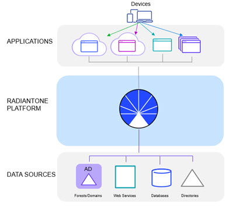
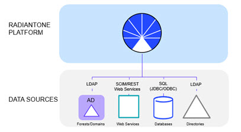

## Integration Architecture

Figure 3: RadiantOne Logical Architecture

The logical model is based on three primary layers.

**Application Layer**

The application layer is the interface between applications and RadiantOne. Applications query RadiantOne using LDAP, SCIMv2 or REST and expect standardized responses in return. The applications are not aware of the complexity or number of data sources they are receiving data from. To them, RadiantOne represents the single data source where all of the information they require resides. For claims-aware applications, any federated identity provider handles the different authentication methods and the token translation. RadiantOne is used as the information point to identify users and retrieve profile attributes to augment claims. 

**RadiantOne Identity Data Management**

The second layer of the logical architecture is the RadiantOne Identity Data Mangement product. This is the layer that transforms the existing data into the identity views that match the requests from the applications. Two of the most important aspects of this layer are the mapping/transformation capabilities and the flexibility of namespace design.

**Organization of the namespace.**

How identity views are created out of existing data silos.

How different identity views coming from the same or different data sources can be linked together to form a federated namespace.

Common representation and first level of mapping existing data sources.

How each data source is mapped into a common metadata representation.

The layer provides data handling services and facilitates the flow of data between the application and the data sources.

**Data Sources Layer**

Communication between RadiantOne and the existing identity data sources is done at the Data Source Layer. Operations driven by the business logic of the virtualization layer are translated to operate natively on the data source.

For example, LDAP cannot be used (natively) to query information in a database. Using RadiantOne, an LDAP query is remapped into a SQL query, a connection is established with the database, and the results are remapped back into LDAP (at the virtualization layer).

When using RadiantOne with other directory services, it routes LDAP requests back to other directory sources, as well as performs translation of the directory request into one suitable for the local directory structure.

Identity data sources accessible by RadiantOne are:

- Directory services via LDAP/JNDI.
- Databases via JDBC and ODBC.
- Web Service access through REST/SCIM.

Figure 4: Access to Backends

