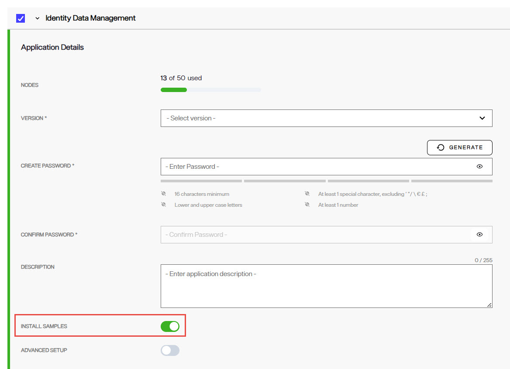

## Overview

The default naming contexts and default data sources for the RadiantOne service are described below. If samples are installed, additional naming contexts and data sources are also installed. When creating new environments and installing Identity Data Management in the Environment Operations Center, toggle the *INSTALL SAMPLES* option on to install the sample naming contexts and data sources.

Some of the files mentioned in this guide are edited using the Control Panel's File Manager option. To edit files in File Mananger:
1. In the upper-left corner of the Control Panel, click  and select Open Classic Control Panel. 
2. Click Open. The classic control panel launches in a new browser tab. 
3. In the classic Control Panel, navigate to Settings > Configuration > File Manager.

## Default Naming Contexts

This section describes all the default root naming contexts included with RadiantOne. Some are part of samples (if installed) and some are required for the RadiantOne service. Some of the naming contexts can be viewed/managed from the Control Panel > Setup > Directory Namespace > Namespace Design and the data (run-time) can be seen from the Control Panel > Setup > Directory Browser. If a naming context is a sample and safe to delete, it is indicated in the description below.

The default and sample naming contexts are as follows.

- o=vds
  This naming context contains many sample virtual views mounted below it. This naming context may be hidden (by specifying it as a hidden context in the rootdse.ldif file for the RadiantOne service) but should not be deleted.  

- o=companydirectory
  This is a sample local RadiantOne Universal Directory store. The data is stored in this RadiantOne Universal Directory can be managed from the Directory Browser tab in the Main Control Panel. This naming context is used in the RadiantOne training materials. If you do not plan on using the RadiantOne Tutorials (for training) then this entire naming context may be deleted (de-activate it before removing the naming context).

- o=companyprofiles
  This is a sample of an LDAP proxy. The backend LDAP in this example is the RadiantOne Universal Directory local store that matches the o=companydirectory setting mentioned above. A proxy can point to any LDAP server. This is not a critical naming context and it may be deleted if needed (de-activate it before removing the naming context). Deleting the naming context also deletes the underlying identity view file and schema file. Both files are named o_companyprofiles.

- o=examples
  This is a sample of a virtual view from a database backend. The database used here is Apache Derby and is included in the RadiantOne installation. This is not a critical naming context and it may be deleted if needed (de-activate it before removing the naming context. You need to deactivate and delete the child node prior to removing the root naming context). After deleting the naming context, you can also delete the underlying schema, ou_hr_o_examples, and identity view files o_examples and ou_hr_o_examples.

- ou=AllProfiles
  This naming context is used by the legacy ID-Connect client web application and has three levels mounted below it. There are two nodes pointing to local RadiantOne Universal Directory stores (ou=ad_sample and ou=localvds) and one virtual view containing definitions to dynamically build groups (ou=VirtualGroups). If you do not plan on using the legacy ID-Connect application then this entire naming context may be deleted (de-activate each node first before removing the naming context).
After deleting the naming context, you can also delete the underlying identity view files o_allprofiles and virtualgroups.

>[!note] Although the ou=AllProfiles naming context is associated with the "default" schema file, this schema file should not be deleted if you delete the ou=AllProfiles naming context as it is used by other RadiantOne internal components.

- cn=replicationjournal
  This naming context is used for inter-cluster replication. This naming context may be hidden (by specifying it as a hidden context in the rootdse.ldif file for RadiantOne) but should not be deleted.

-  cn=extendedxjoin
  This naming context is used when the default store setting is configured for an extended join. This naming context may be hidden (by specifying it as a hidden context in the rootdse.ldif file for RadiantOne) but should not be deleted.

- cn=config
  This naming context stores certain global configuration information for RadiantOne. This naming context may be hidden (by specifying it as a hidden context in the rootdse.ldif file for RadiantOne) but should not be deleted.

- cn=changelog
  This naming context stores a list of changes made to RadiantOne. Clients can leverage this for detecting changes that happen in the RadiantOne namespace. This naming context should not be deleted.

- cn=cacherefreshlog
  This naming context stores a list of changes made during persistent cache refresh. This naming context should not be deleted.

- cn=registry
  This naming context is used internally by RadiantOne to store configuration information for the Global Sync Module and the Global Identity Builder. This naming context may be hidden (by specifying it as a hidden context in the rootdse.ldif file for RadiantOne) but should not be deleted.

- cn=system-registry
  This naming context is used internally by RadiantOne to store ADAP session tokens. This naming context may be hidden (by specifying it as a hidden context in the rootdse.ldif file for RadiantOne) but should not be deleted.

- dv=globalprofiles
  This naming context is created and used by the Global Identity Builder and Global Identity Viewer applications. This naming context may be hidden (by specifying it as a hidden context in the rootdse.ldif file for RadiantOne) but should not be deleted.

## Default Data Sources

RadiantOne includes sample LDAP and database data sources.  There is an option to install samples when you create the environment in Environment Operations Center.

### Default LDAP Data Sources

An LDAP data source named vdsha is included by default. This data source contains connections to all RadiantOne nodes in a given cluster. One node is defined as the primary server and all others as failover servers. This data source is used internally by many operations including persistent cache refreshes and should not be deleted or have its status changed to “offline”.

An LDAP data source named replicationjournal is included by default. This data source plays a role in inter-cluster replication and should not be deleted or have its status changed to “offline”.

>[!warning] If you change the super user/directory administrator password after installing RadiantOne, you must manually edit both the vdsha and replicationjournal LDAP data sources to update the password here as well. Changes to the data sources are performed from the Control Panel > Setup > Data Catalog > Data Sources.

### Default Database Data Sources

There are nine default database data sources defined for the Derby databases installed with RadiantOne (advworks, derbyorders, derbysales, examples, log2db, multistore, northwind, rx500 and vdapdb). These databases support the [sample virtual views](#default-naming-contexts) mounted below o=examples and o=vds.

