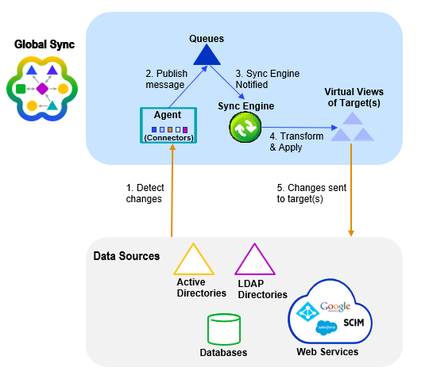

## Introduction

RadiantOne Synchronization is an advanced set of tools for synchronization and identity management. This component allows you to synchronize objects distributed across disparate data sources (directories, databases or applications): a change in an object in one source, at the attribute level, or for the whole object can be reflected into many other connected objects. Using a publisher/subscriber approach, any object can publish events (creation, deletion or modification for the whole object, or any attributes of this object) and propagate them to subscriber objects. User-defined attribute mappings and transformations can be applied during synchronization.

## Architecture

The synchronization architecture is comprised of Agents, Queues, Sync Engine, Attribute mappings and transformation scripts.

Agents manage Connectors which are components used to interface with the data sources. Changes flow to and from the Connectors asynchronously in the form of messages. This process leverages queues to temporarily store messages as they flow through the synchronization pipeline. The attribute mappings and/or transformation scripts are processed by the Sync Engine prior to the events being sent to the target endpoints.

>[!warning]
>All sources must have views mounted in the RadiantOne namespace to complete the synchronization configuration. To simplify management of the synchronization flows, it is recommended to have a dedicated section of the namespace for all source identity views. Once a view has been configured as a source for synchronization, no further changes should be made to the view (e.g. no object/attribute mapping changes, no adding/removing persistent cache, etc.). 

See the figure below for a high-level architecture of the synchronization process.

## Configuration
The high-level steps to configure synchronization are the following:

- [Data sources](../configuration/data-sources/data-sources) - connections for the servers that you want to sync data from/to.
- [Configure virtual views](../configuration/identity-views/intro-view-design) of data sources that you want to sync data from/to.
- [Extend RadiantOne LDAP schema](../configuration/directory-stores/managing-directory-schema) with any missing object class definitions (associated with the objects to be synchronized).
- [Create topologies](../configuration/data-sources/data-sources) – graphical representation of the synchronization flows.
- Configure Pipelines – [capture connector](../configuration/synchronization/pipelines), and [transformation](../configuration/synchronization/transformations).
- [Configure Queue Time to Live](../configuration/synchronization/synchronization-concepts).

