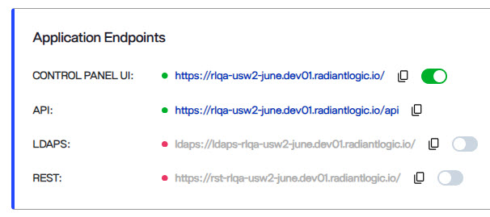

## Overview
This document outlines compliance with the W3C standards for accessibility as it relates to RadiantOne. Level AA attainment is achieved by meeting priority one (Level A) and two (Level AA) checkpoints as outlined by the W3C for web-based applications. These checkpoints are outlined in this document.

## Guideline 1.1 – Text Alternatives
This guideline ensures there are text alternatives for any non-text content so that it can be changed into other forms that people might need, such as large print, braille, speech, symbols or simpler language.

### 1.1.1 Non-text Content – Level A
RadiantOne provides symbol icons instead of text alternatives. An example is for indicating if the service is started. A green light indicates the service is available. A red light indicates the service is not started.

 
## Guideline 1.2 – Time-based Media

This guideline ensures there are alternatives for time-based media. 

RadiantOne does not use time-based media in web applications.

### 1.2.1 Audio-only and Video-only (Prerecorded) - Level A

RadiantOne does not use any elements requiring audio control in web applications.

### 1.2.2 Captions (Prerecorded) - Level A

RadiantOne does not use any pre-recorded audio or video content. 

### 1.2.3 Audio Description or Media Alternative (Prerecorded) - Level A

RadiantOne does not use any elements requiring audio control in web applications.

### 1.2.4 Captions (Live) - Level AA

RadiantOne does not contain any live audio content. 

### 1.2.5 Audio Description (Prerecorded) - Level AA

RadiantOne does not contain prerecorded video content. 

## Guideline 1.3 – Adaptable

This guideline ensures that content can be presented in different ways without losing information or structure.

### 1.3.1 Info and Relationships - Level A

Lists of primary navigation links are consistent. Headers, sidebars, and main content are all identified in the source HTML using tags that allow programmatic determination of content. 

The 
 tag indicates that the user is navigating within sidebar content. The id="main-content" tag indicates that the user is navigating within the main section of the user interface. The <head> tag indicates that the user is navigating within the page’s header. 

### 1.3.2 Meaningful Sequence - Level A
RadiantOne sequences page content in a meaningful way and uses HTML tags to allow reading sequences to be programmatically determined. Tables use HTML table elements. Lists use HTML UL and LI tags. 

### 1.3.3 Sensory Characteristics - Level A

Instructions for understanding and operating the RadiantOne service do not rely solely on visual location, shape, size, or orientation. Text messages and audio cues are also provided using text-to-speech-narration tools. Focus is not removed from the element the user is currently on. 

### 1.3.4 Orientation - Level AA

RadiantOne’s display orientation does not change. 

### 1.3.5 Identify Input Purpose - Level AA

RadiantOne text fields, check boxes, radio buttons, and other input fields are clearly identified so that their purpose can easily be determined. 

## Guideline 1.4 – Distinguishable

### 1.4.1 Use of Color - Level A
RadiantOne offers accessible alternative cues that convey information, prompt the user for a response, and distinguish visual elements. 

### 1.4.2 Audio Control - Level A

RadiantOne does not use any elements that require audio control.

### 1.4.3 Contrast (Minimum) - Level AA

On each screen, RadiantOne’s foreground and background colors contrast each other sufficiently for all content, including text and screen elements. 

### 1.4.4 Resize text - Level AA

RadiantOne users can resize fonts without any loss of content or functionality. 

### 1.4.5 Images of Text - Level AA

RadiantOne uses text to convey information, rather than images of text, unless the text is part of a graphic. 

### 1.4.10 Reflow - Level AA

RadiantOne’s Control Panel UI screens reflow automatically to accommodate web browser zooming. Content reflows without overlapping or text being cut off. 

### 1.4.11 Non-text Contrast - Level AA

RadiantOne user interface components and graphical objects uses borders to achieve a 3:1 or greater contrast ratio of adjacent colors. 

### 1.4.12 Text Spacing - Level AA

RadiantOne’s HTML supports word, line, and paragraph formatting properties that help prevent the loss of content and functionality. Furthermore, RadiantOne uses flex-styled CSS containers, not fixed containers. Content reflows without overlap or text being cut off. 

### 1.4.13 Content on Hover or Focus - Level AA

RadiantOne contains content that is triggered by hovering the pointer. The pointer can be moved over this content without obscuring the content. 

## Guideline 2.1 – Keyboard Accessible

All functionality should be available from the keyboard.

### 2.1.1 Keyboard - Level A

RadiantOne makes each screen fully keyboard navigable and operable by making sure that all screen elements that can be accessed with the mouse can be reached using the keyboard alone. 

### 2.1.2 No Keyboard Trap - Level A

All RadiantOne functionality is operable through the keyboard. Keyboard focus can be moved to and from components using the keyboard only. 

### 2.1.4 Character Key Shortcuts - Level A

RadiantOne does not use keyboard shortcuts. 

## Guideline 2.2 – Enough Time

### 2.2.1 Timing Adjustable - Level A

RadiantOne UI session timeouts can be adjusted using the Control Panel Session Timeout function. 

### 2.2.2 Pause, Stop, Hide - Level A

RadiantOne does not contain information that moves or blinks. Windows are scrolled through manually by the user. 

## Guideline 2.3 – Seizures and Physical Reactions

### 2.3.1 Three Flashes or Below Threshold - Level A 

RadiantOne does not contain blinking content. 

## Guideline 2.4 – Navigable

This guideline ensures users can navigate, find content and determine where they are.

### 2.4.1 Bypass Blocks - Level A

RadiantOne offers keyboard users an option to bypass blocks of content that are repeated on multiple pages. When the users navigates past the main tabs using the keyboard’s Tab key, RadiantOne displays a “Press enter to skip to settings content” button. 

### 2.4.2 Page Titled - Level A

RadiantOne’s HTML head section says, “Radiant Logic, Inc. | Cluster Control Panel”. 

### 2.4.3 Focus Order - Level A

Most RadiantOne page contents are not sequential. RadiantOne wizards are sequential and are navigated accordingly. 

### 2.4.4 Link Purpose (In Context) - Level A

RadiantOne links have meaningful names that can be understood when read alone or in the context of surrounding content. 

### 2.4.5 Multiple Ways - Level AA

RadiantOne’s Main Control Panel uses a single URL. Each wizard, however, uses several URLs. These wizards include configuration steps that are part of a process. 

### 2.4.6 Headings and Labels - Level AA

RadiantOne code is marked up where text is styled and/or formatted to organize content into sections and subsections. 

### 2.4.7 Focus Visible - Level AA

Pressing the keyboard Tab key cycles through fields in the RadiantOne UI, with the active field highlighted. 

## Guideline 2.5 – Input Modalities

This guideline ensures users can operate functionality through various inputs beyond the keyboard.

### 2.5.1 Pointer Gestures - Level A

RadiantOne does not contain multi-point or path-based gestures for operation. 

### 2.5.2 Pointer Cancellation - Level A

With the exception of opening drop-down lists, the pointer’s down-event does not execute functions in RadiantOne. 

### 2.5.3 Label in Name - Level A

RadiantOne fields, including text fields, drop-down lists, buttons, have labels that describe the corresponding field. 

### 2.5.4 Motion Actuation - Level A

RadiantOne does not contain functionality that can be operated by device motion or user motion. 

## Guideline 3.1 – Readable

This guideline ensures content is readable and understandable.

### 3.1.1 Language of Page - Level A

RadiantOne’s default human language is specified in its HTML.  

### 3.1.2 Language of Parts - Level AA

RadiantOne’s code does not contain any non-English language sentences or phrases. 

## Guideline 3.2 – Predictable

This guideline ensures the web page appears and operates in predictable ways.

### 3.2.1 On Focus - Level A

In RadiantOne, when the user tabs through user interface components, this does not initiate the change of context. 

### 3.2.2 On Input - Level A

When a user interacts with content on a page, RadiantOne’s behavior is predictable. When focus changes, it happens in a predictable way.  

### 3.2.3 Consistent Navigation - Level AA

RadiantOne screen navigation and repetitive screen content are accessible by positioning and structuring repetitive screen navigation consistently. RadiantOne includes a way to skip over repetitive content. 

### 3.2.4 Consistent Identification - Level AA

RadiantOne components that have the same functionality, such as Add, Edit, and Delete buttons, wizard configuration buttons, 

## Guideline 3.3 – Input Assistance

This guideline helps users avoid and correct mistakes.

### 3.3.1 Error Identification - Level A

RadiantOne detects input errors automatically. When an improper value is entered, the error is identified and described with a text in a popup box. 

### 3.3.2 Labels or Instructions - Level A

RadiantOne labels for user input are meaningful and unique. This includes text boxes, radio buttons, check boxes, drop-down lists, and list boxes. 

### 3.3.3 Error Suggestion - Level AA

RadiantOne input errors are automatically detected and corrected. The user interface then displays a message informing the user of the incorrect input value and the value that RadiantOne replaced it with. 

### 3.3.4 Error Prevention (Legal, Financial, Data) - Level AA

RadiantOne does not contain web pages that cause legal commitments or financial transactions to occur. 

## Guideline 4.1 – Compatible

This guidelines maximizes compatibility with current and future user agents, including assistive technologies.

### 4.1.1 Parsing - Level A

RadiantOne screen element structures and relationships in the code are marked up. The code on each page in the UI parses correctly. 

### 4.1.2 Name, Role, Value - Level A

RadiantOne user interface component accessible names and roles can be programmatically determined. Roles, states, and properties that can be set by the user can be set in a methodical manner. 

### 4.1.3 Status Messages - Level AA

RadiantOne status messages present information to users using assistive technologies. 
