# RadiantOne LDAP Browser Guide

## Overview

The LDAP Browser is a Java-based LDAP client used for viewing and managing the content of any LDAP directory.

To connect to the RadiantOne LDAP service, please see create a profile [Create a Profile](#Create-a-Profile-for-Radiantone) for RadiantOne.

To connect to any LDAP server, please see the section on [creating profiles](#Create-a-Profile).

This guide presents the LDAP Browser concepts and procedures as follows:


▪ [LDAP Browser Concepts](#LDAP-Browser-Concepts)

▪ [LDAP Browser Interface](#ldap-browser-interface)

▪ [Using the LDAP Browser](#Using-the-LDAP-Browser)

### LDAP Browser Concepts

This section describes some terms that are important to know for using the LDAP Browser.

▪ [Profile](#Profile)

▪ [LDIF](#LDIF)

#### Profile

A profile stores the necessary information required to connect to an LDAP-enabled directory. This information includes server name, port, username and password (if required), and BaseDN. The profile information is stored in a .prof file and can found in the directory of $RLI_HOME\<instance_name>\ldif\profiles. For more information, please see [Manage Directory Profiles](#Manage-Directory-Profiles)

#### LDIF

An LDIF file can be generated from the directory trees. After testing the tree from the LDAP Browser, an LDIF file can be generated for populating an existing LDAP directory. For more information, please see [Creating an LDIF File](#Create-an-LDIF-file-for-populating-a-directory).

### LDAP Browser Interface

The LDAP Browser commands can be accessed in any of the following ways:

- Pull-down Menus
<br> The menus are available from the menu bar at the top of the LDAP Browser interface.
After you click the menu name to display a list of commands, click the command for the desired action.

- Popup Menus
<br> In the LDAP Browser, right-click on an entry to display the popup menu (See Figure 4.1)

    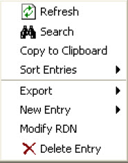

    Figure 4.1: LDAP Browser Shortcut Menu

- The Toolbar
<br> The toolbar contains the LDAP Browser buttons required to use the interface (See Figure 4.2).

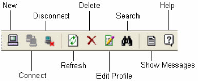

Figure 4.2: LDAP Browser Toolbar

When you open a .prof file, the LDAP Browser displays the directory tree according to the Base DN entered in the configuration. As you select a node in the tree, information about the entry appears on the right side. See Figure 4.3.

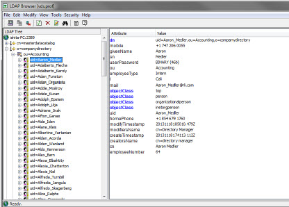

Figure 4.3: LDAP Browser Interface

## Using the LDAP Browser

The following procedures describe how to:

[Manage Directory Profiles](#Manage-directory-profiles)

[Modify directory contents](#modify-directory-content)

[Configure Browser to Connect to LDAP Directories via SSL](#Configure-browser-to-connect-to-ldap-directories-via-ssl)

### Manage Directory Profiles

To view the directory through the LDAP Browser, a profile must be created.

#### Create a Profile

This stores the information needed to connect to the directory.

1. Start the LDAP Browser from <RLI_HOME>/bin/LDAPBrowser.exe. On UNIX platforms use, $RLI_HOME/bin/runLDAPBrowser.sh.


2. Choose File > New.

3. Enter the parameters needed to connect to the LDAP directory. This includes server name, port, user and password (if required), Base DN, and the name to save the file as. See Figure 4.4.

    This profile is stored in a .prof file and can be found in <RLI_HOME>\<instance_name>\ldif\profiles directory.

    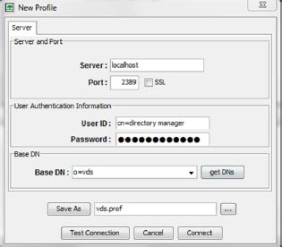

Figure 4.4: New Profile

##### Create a Profile for RadiantOne

Make sure that the RadiantOne service’s LDAP port is running. <!--You can start it from the Dashboard tab in the Main Control Panel. For more details on starting the RadiantOne service, please see the System Administration Guide.

The parameters needed to connect to the RadiantOne LDAP service are as follows:

- Server – the name of the machine where RadiantOne is installed

- Port – by default this is 2389

- User/Password – not required if anonymous access is allowed to the RadiantOne service. Otherwise you can use cn=directory manager with the password you set during the RadiantOne install

- Base DN – by default this is set to o=vds

- Save Profile as – enter any name you choose

#### Open a Profile

Opens the LDAP Directory tree by loading the values from the selected profile file. The left pane displays the directory tree.

>[!note] 
>If you already have a profile open, you should disconnect before trying to open a different profile.

1. Choose File > Open/Connect.

2. Select the profile and click Connect. See Figure 4.5.

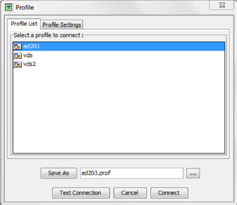

Figure 4.5: Open Profile

#### Edit a Profile

The loaded profile can be edited. The different parameters can be modified and the new values are automatically changed in the profile.

1. Choose Modify > Profile > Edit.

2. Enter new parameters and click Next.

>[!note]
>Uou can also click on the Edit Profile button on the toolbar to reach this same menu.

#### Delete a Profile

The loaded profile can be deleted.

1. Choose Modify  Profile > Delete.
2. Click Yes to confirm the deletion. See Figure 4.6.

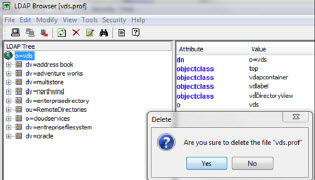

Figure 4.6: Delete Profile

### Modify Directory Content

#### Adding Entries

1. Right-click on the node above where you would like to add an entry and choose New Entry and choose the type of entry.

>[!note]
>If you choose the User entry type, this uses the inetOrgPerson objectclass. If you choose Active Directory User, the entry uses the User object. The Active Directory User option is only for adding users into Active Directory. If you want to add a new entry using a different objectclass, then choose the More option. If you are trying to insert a new entry through RadiantOne, then you must make sure the correct objectclass appears in the RadiantOne LDAP schema (or else it is not displayed in the Object Class drop-down list when you select the More option). For details on extending the LDAP schema, please see the RadiantOne System Administration Guide.

2. Enter the information about the new entry. See Figure 4.7.
3. Click OK when finished.

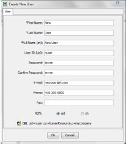

Figure 4.7: Add New Entry

#### Deleting Entries

1. Right-click on the entry to be deleted and choose Delete Entry.

2. A confirmation box is displayed. Click Yes to proceed with the deletion (See Figure 4.8).

>[!note]
>You will be notified if the entry has children. You will have the option to delete the child nodes too.

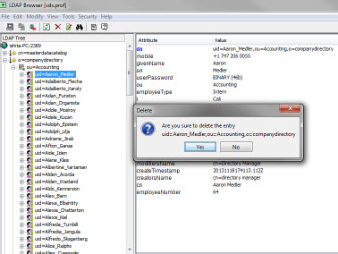

Figure 4.8: Delete Entry

#### Modifying Entries

##### Updating Attributes

Attributes of the selected entry can be modified if the connected user has permissions to do so.

1. Select the entry in the tree.
   
2. On the right side, double-click on the attribute you have permission to change.
   
3. Enter a new value and click OK. See Figure 4.9.


Figure 4.9: Edit Attribute

If you want to add a value to a multi-valued attribute, right-click on the attribute and choose Add > Value. Provide a new value on the line provided.

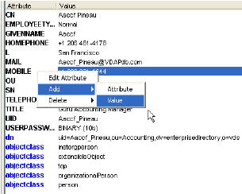

Figure 4.10: Adding a Value for a Multi-Valued Attribute

Only attributes that have values are displayed in the LDAP Browser. If you want to add a value for an attribute that does not yet have one, right-click on any of the existing attributes and choose Add > Attribute. Select the attribute you want to add from the drop-down list and provide a value.

##### Editing Binary Attributes

The LDAP Browser can be used to view, edit, and update binary attributes like photos, audio, and certificates.

If an attribute is binary, the value is displayed with BINARY as the value. Double-clicking on the attribute displays the binary editor.

You have the option to save the attribute (Save As), view, or insert a new value (Insert From). If it is an audio attribute, you have the option to play it.

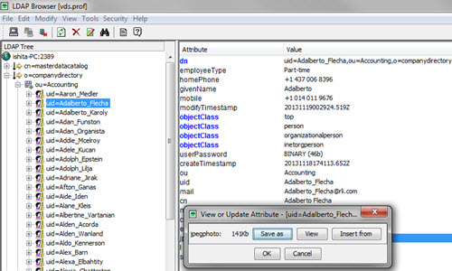

Figure 4.11: Viewing a Binary Photo Attribute

##### Deleting Attributes

Attributes of the selected entry can be deleted if the connected user has permissions to do so.

1. Select an entry on the left side.
   
2. In the right pane, right-click on the attribute and choose Delete > Attribute.

>[!note]
>Required attributes cannot be deleted. To remove a value of an attribute (for multi-valued attributes), choose the Delete > Value option.

3. A confirmation box is displayed. Click Yes to proceed with the deletion. See Figure 4.12.

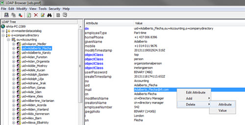

Figure 4.12: Delete Attribute

### Refreshing the Tree

This feature allows for refreshing the tree under the selected entry. Use this function if the tree structure has changed but the changes are not visible.

Right-click on the branch that has changed, and choose Refresh.

### Configure Browser to Connect to LDAP Directories via SSL

The LDAP Browser is a Java LDAP client. As such, you can use it to connect to LDAP directories over SSL. The LDAP directory server certificate needs to be imported into the cacerts database for the LDAP Browser (unless it is signed by a known Certificate Authority).

There are two methods that can be used: keytool or the Main Control Panel.

#### Using Keytool to Import the Certificate File

You must send the LDAP server certificate file to the client machine(s), which commutes via SSL with the directory server. The following command can be used to import the certificate into the keystore for the LDAP Browser:

```
>C:\radiantone\jdk\jre\bin>keytool -import -alias rli -keystore c:\radiantone\jdk\jre\lib\security\cacerts -file rli.cer
```

>[!note]
><Java_Home>/lib/security/cacerts is the default truststore from JDK with password _changeit_ and _rli.cer_ is the server’s c ertificate in this example.

#### Using the Main Control Panel to Import the Certificate File

Since the RadiantOne service and the LDAP Browser share the same client certificate store by default, you can import the client certificates from the Main Control Panel.

1. In the Main Control Panel > Settings > SSL. In the Manage Certificates section, click the Manage button next to Client Certificates.
   
2. Click the Add Certificate button.
   
3. Click Browse and navigate to the location of the saved LDAP server certificate. Select the certificate and click Open. The certificate file is displayed. Click OK.
   
4. Click Add Certificate
   
5. Enter a name for the certificate and click OK.
   
6. Enter the Key Store password (which is changeit by default) and click OK.
   
7. The server certificate name should appear in the list. Click OK to exit the Manage Client Certificates window. See Figure 4.13.

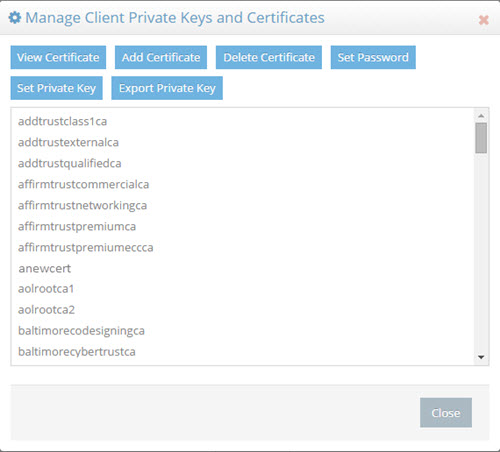

Figure 4.13: Managing Client Certificates

After the LDAP server certificate has been imported, in the connection profile, set the SSL port and check the SSL option. See Figure 4.14.

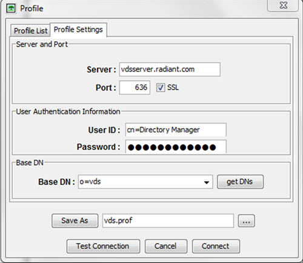

Figure 4.14: Connecting to the LDAP Server over SSL

### Create an LDIF File for Populating a Directory

Entire trees and single entries coming from real or virtual directories can be easily exported to an LDIF file, or directly inserted into another LDAP Directory Server.

#### LDIF Functions

The LDAP Browser supports a simplified version of the LDIF file format. For example, it does not support 'changetypes'. All binary attributes are Base64 encoded.

##### Export Options

There are two basic Export functions:

- Export to an LDIF file

- Export to an existing LDAP Directory Server

###### Export to LDIF

This function saves the selected entry or entries into an LDIF file.

1. Right-click at the level that you want to export and choose Export > Export To LDIF (See Figure 4.15).


Figure 4.15: Export Menu

2. Enter the required information for the LDIF file. Depending on the scope option chosen, only the selected entry (one entry), the entries below this entry (one level), or the entire tree below this entry (sub tree) are exported to the LDIF file.
   
3. Select to export all entries or specify a maximum number of entries to be exported. Enter a name for the file or accept the default.
   
4. You can change the Target DN to whatever you need. In Figure 4.16, the Target DN has been set to ou=people,o=radiant.

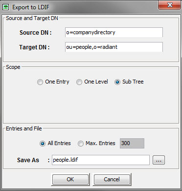

Figure 4.16: Configuring the LDIF File

5. Click OK when finished.
   
6. Click Yes to start exporting.

7. Click OK on the confirmation window.

The file that is generated is stored in the directory <RLI_HOME>\vds_server\ldif. This LDIF file is now available for importing into an existing LDAP directory server.

### Export to LDAP

The entries under the selected DN can be exported to an existing LDAP directory using Export to LDAP.

1. Verify that a profile has been created for the destination LDAP directory (see [Creating Profiles](#create-a-profile) for more information).
   
2. Right-click on the branch/entry that needs to be exported and choose Export > Export to LDAP. See Figure 4.17.

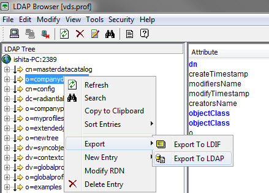

Figure 4.17: The Tree to be Exported to the LDAP Directory is Selected

3. Select the profile (.prof file) containing the destination LDAP directory.
   
4. Select the tree path where the branch to be exported should be created under.
   
5. Click Connect. The Select the Tree Path is displayed. See Figure 4.18.

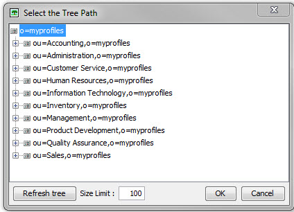

Figure 4.18: The Destination Directory with the Appropriate Branch Selected

6. Enter necessary information for the export and click OK. Click OK to close the window confirming the import into the destination directory.

## Using the Search Feature

The LDAP Browser offers a searching utility. This utility can be used to search for information contained in the directory.

1. Select the binocular icon from the right-click menu (or toolbar). See Figure 4.19.

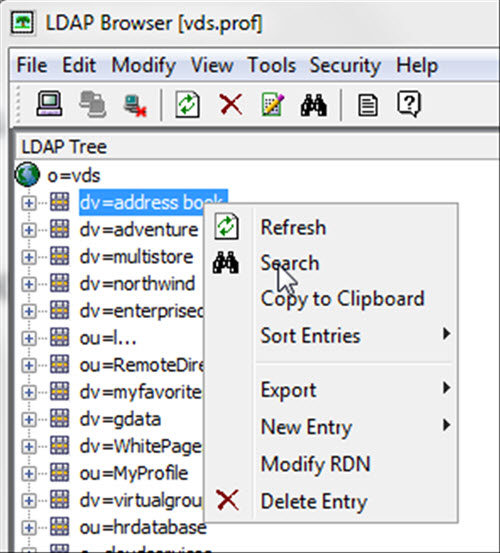

Figure 4.19: The Search Utility

2. The search parameters needed are DN (to start searching from), filter (by default set to objectclass=*), attributes (if you only want specific attributes returned), maximum number of entries to return (default is 100), and search scope (default is set to one level). The example below shows a search for information contained in one of the default virtual directory views provided with RadiantOne (companyprofiles). When an entry is selected, the attributes are displayed. See Figure 4.20.

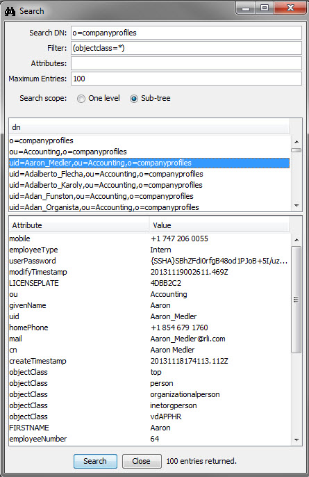

Figure 4.20: Using the Search Utility

This concludes the LDAP Browser Guide. For details on configuring RadiantOne, please see the System Administration Guide.