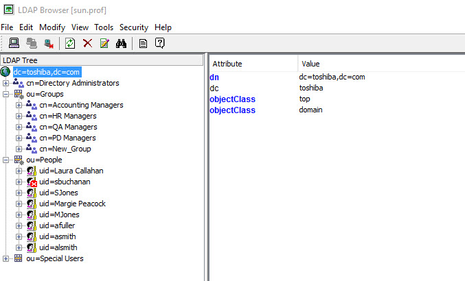
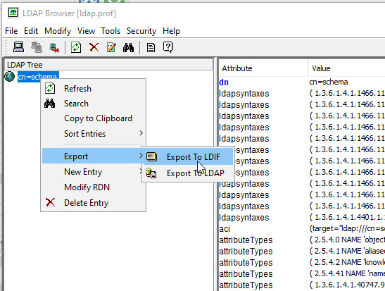

# Inventory Existing Directory

Taking inventory of the existing directory is mostly a manually process. Once you’ve acquired the basic credentials from the directory owner, you can access the directory from any LDAP client. RadiantOne includes the LDAP Browser client that can be used to connect to the directory. From here, you can get a glimpse of the existing hierarchy and export schema and branches to LDIF files. Below is an example of using the RadiantOne LDAP Browser.

 
## Schema

To get the schema information from the LDAP directory, use a base DN of cn=schema in LDAP Browser. Then, export the schema to LDIF from the right-click menu.

 
## LDAP Controls

Understanding the enabled LDAP controls (e.g. paged results, VLV/sort, persistent search, proxy authorization) is a manual process. Check the legacy directory server settings to determine which controls are enabled. 

## Password Policies

Understanding the password policies defined in the legacy directory is a manual process. You must work with the directory owner/administrator to understand how password policies are enforced. Some questions to ask might be:

What level are password policies enforced (e.g. global, per group, per “ou”/tree branch, per user)?

What are the requirements of the policies themselves (e.g. password strength, lockout policy, password hash…etc.)?
