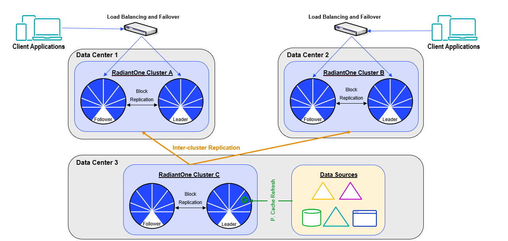
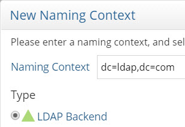
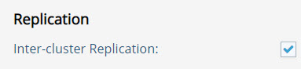

# Chapter 3: Import Data into RadiantOne Universal Directory

The recommended approach is to import the data as is (stick to the original DIT of the backend) to avoid complex re-mappings of group memberships. The import of the data is achieved through a persistent cache initialization of the proxy view. Once the data is in persistent cache, complex reorganizations of the original DIT can be done using virtualization. This includes things like flattening the hierarchy to get a list of users and groups, and merging overlapping users and groups (requiring correlation)…etc. Once you’ve configured the desired virtual view(s) as persistent cache, this image can be replicated to a RadiantOne Universal Directory (HDAP) store. This allows a separation of duties between the persistent cache refresh maintenance/process and the layer consumed by client applications. This also simplifies the cutover process once the backend server is fully decommissioned. The persistent cache refresh layer can be removed or repurposed.

>**Note – The persistent cache refresh (Cluster C) and client consumption layers (Custers A & B) shown below are depicting clusters containing two nodes for each. A Radiant Logic Architect can assess your throughput needs and recommend the best architecture.**

 
>**Note – if you would like to discuss a particular use case or alternate approach, please contact your Radiant Logic Account Representative.**

To get the existing data, create a proxy view of the backend directory and create a persistent cache as outlined below. The terms Persistent Cache/Refresh Layer and Client Consumption layer are used below to describe the configuration applicable to each.

On the Persistent Cache/Refresh Layer:

1.	Define an LDAP data source for the backend directory on the Main Control Panel > Settings > Server Backend > LDAP Data Sources section.

2.	Create a Root Naming Context from the Main Control Panel > Directory Namespace tab of type “LDAP Backend”. If you need assistance, see the RadiantOne Namespace Configuration Guide.

 
3.	Configure and initialize a persistent cache for the proxy view in addition to the desired refresh strategy (e.g. periodic or real-time). If you need assistance, see the RadiantOne Deployment and Tuning Guide.
4.	(Optional) If you need to configure more advanced views/hierarchies, you can virtualize the persistent cache as an LDAP directory backend and create the desired view. Then, define a persistent cache for this view.
5.	Enable Inter-cluster replication for the final persistent cache view that contains the image that should be replicated to the Client Consumption Layer RadiantOne Universal Directory (HDAP) store. 

 
6.	From the Main Control Panel > Settings > Server Backend > LDAP Data Sources section, verify the replicationjournal LDAP data source points to the desired journal. 
7.	Temporarily stop the persistent cache refresh (if it is running) and export the persistent cache view into an LDIF file. Copy this file to the Client Consumption layer machine.

On the Client Consumption Layer:
1.	Configure the target RadiantOne Universal Directory (HDAP) store with the same root naming context as the backend directory (the one expected by client applications).
2.	Initialize the RadiantOne Universal Directory (HDAP) store with the export of the persistent cache image.
3.	Enable inter-cluster replication on the RadiantOne Universal Directory (HDAP) store. For assistance with this configuration, see the RadiantOne Namespace Configuration Guide.

 
4.	From the Main Control Panel > Settings > Server Backend > LDAP Data Sources section, verify the replicationjournal LDAP data source points to the desired journal (and should be the same location referenced in the replicationjournal data source on the Persistent Cache/Refresh Layer – verified in step 6 above in the previous section).

As changes are detected on the backend legacy LDAP, the persistent cache views are refreshed and then replicated to the RadiantOne Universal Directory (HDAP) store that is being consumed by the client applications that have been migrated to the new directory.  A few things to keep in mind:

-	For bind operations, the persistent cache must contain the user passwords from the backend directory. The hashed passwords are then replicated to the RadiantOne Universal Directory (HDAP) store. As long as the password hash is compatible with the RadiantOne Universal Directory, users should be able to bind against it. Otherwise, binds need redirected. Consult with a Radiant Logic Architect so they can recommend the appropriate configuration.

-	If client applications perform modifications, additional configuration is required to properly route the changes to the persistent cache/refresh layer. Consult with a Radiant Logic Architect so they can recommend the appropriate configuration. 
