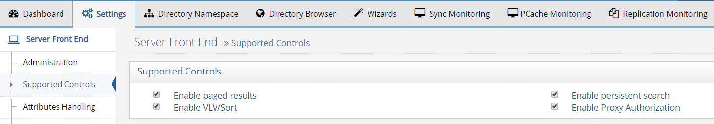
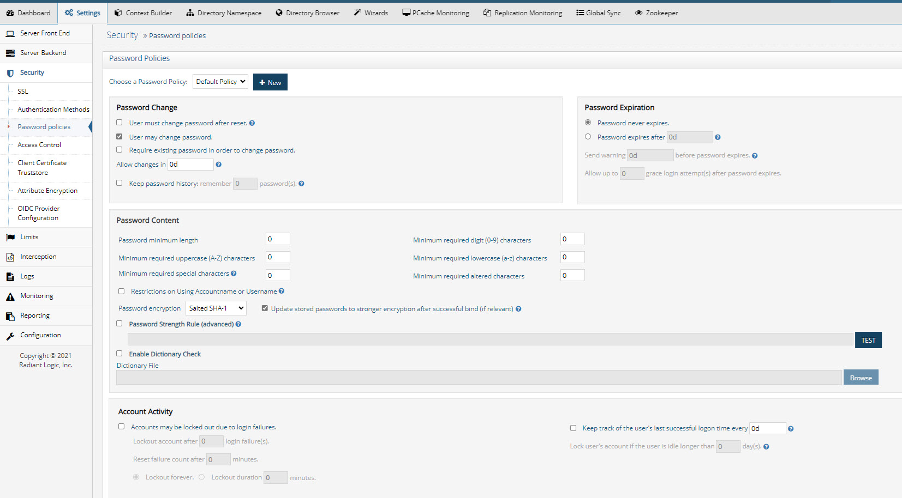
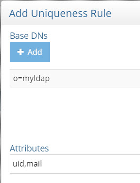
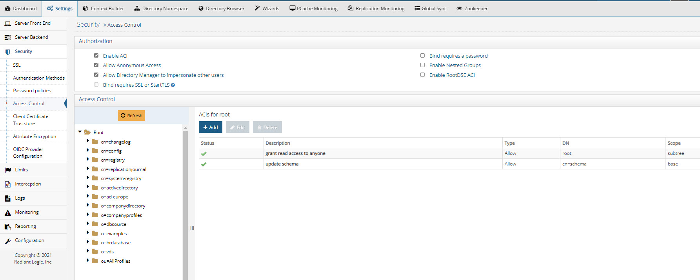

# Chapter 4: Configure RadiantOne Server Settings

Configure the appropriate server settings on the Client [Consumption Layer machine](03-import-data-into-radiantone-universal-directory.md):

## LDAP Controls and Extensions

RadiantOne supports the following controls and extensions:

-	Subtree Delete Control - 1.2.840.113556.1.4.805

-	Password expired notification control - 2.16.840.1.113730.3.4.4
-	Password expiring notification control - 2.16.840.1.113730.3.4.5

-	Password policy control - 1.3.6.1.4.1.42.2.27.8.5.1

-	Persistent search control - 2.16.840.1.113730.3.4.3

-	Virtual list view request control - 2.16.840.1.113730.3.4.9

-	Proxied authorization (version 2) control, described in RFC 4370 - 2.16.840.1.113730.3.4.18

-	Server-side sort request, described in RFC 2891 - 1.2.840.113556.1.4.473

-	Authorization bind identity response control, described in RFC 3829 - 2.16.840.1.113730.3.4.15

-	Authorization bind identity request control, described in RFC 3829 - 2.16.840.1.113730.3.4.16

-	Who Am I extended operation, described in RFC 4532 - 1.3.6.1.4.1.4203.1.11.3

-	Paged Results Control - 1.2.840.113556.1.4.319

-	Dynamic entries extension, described in RFC 2589  - 1.3.6.1.4.1.1466.101.119.1

-	All Operational Attributes feature, described in RFC 3673 - 1.3.6.1.4.1.4203.1.5.1

-	Absolute True and False Filters as described in RFC 4526 - 1.3.6.1.4.1.4203.1.5.3

The following controls that could be used in Sun Java Directory/ODSEE are not supported in RadiantOne:

-	Manage DSA IT control, described in RFC 3296 - 2.16.840.1.113730.3.4.2

-	Get effective rights request control - 1.3.6.1.4.1.42.2.27.9.5.2

-	Account usability control - 1.3.6.1.4.1.42.2.27.9.5.8

-	Specific backend search request control - 2.16.840.1.113730.3.4.14

-	Real attributes only request control - 2.16.840.1.113730.3.4.17

-	Virtual attributes only request control - 2.16.840.1.113730.3.4.19

Paged Results, VLV/Sort, Persistent Search and Proxy Authorization Controls are enabled from the Main Control Panel > Settings tab > Server front end > Supported Controls. For details about each, please see the RadiantOne System Administration Guide.
 

Password expired notification, password expiring notification, and password policy control are configured for password policies. Configure password policies on the Client Consumption layer. 
 

## RootDSE

Directory Servers provide information about themselves to clients through the rootDSE. It contains information about the server in the form of attributes, some of which are multi-valued. The rootDSE may contain information about the vendor, the naming contexts the server supports, the LDAP controls the server supports, the supported SASL mechanisms, schema location, and other information. The contents of the rootDSE generally determine the sequence and format of requests clients issue to the server.

The RadiantOne rootDSE is located at <RLI_HOME>\vds_server\conf\rootdse.ldif and is the default content returned to clients when they request the rootDSE (an LDAP search request with an empty DN). Some LDAP clients search the rootDSE to determine the naming contexts available in the LDAP directory and leverage this information to determine the baseDN (starting point in the directory) to pass in search requests.

## Plugins

Some legacy LDAP directories support plug-ins to add specific functionality to the server. 

Some of the most commonly used plugins and how to configure them in RadiantOne are described in this section.

### Attribute Uniqueness

The Attribute Uniqueness plugin in legacy LDAP directories ensures that the value of a given attribute is unique among all entries of a subtree.

To enable comparable functionality in RadiantOne, from the Main Control Panel, navigate to the Setting tab > Interception section (requires [Expert Mode](01-overview#expert-mode)) > Special Attributes Handling. Locate the Attribute Uniqueness setting and configure the attributes here.

 
### Referential Integrity

The referential integrity plug-in in legacy LDAP directories performs integrity updates on specified attributes immediately after a delete, rename, or move operation. It ensures that all attributes that reference the deleted, renamed or moved entry are updated accordingly.

To enable comparable functionality in RadiantOne, from Main Control Panel, navigate to the Setting tab -> Interception section (requires Expert Mode) > Special Attributes Handling. Locate the Referential Integrity setting and configure the references here.

### Linked Attributes
The isMemberOf plug-in in legacy LDAP directories enables clients to check a user’s group membership by requesting the isMemberOf attribute in the user entries. This can be more efficient than searching in group entries looking for a uniquemember (especially in situations where group entries can be large/have many members).

To enable comparable functionality in RadiantOne, from Main Control Panel, navigate to the Setting tab > Interception section (requires Expert Mode) > Special Attributes Handling. Locate the Linked Attributes setting and configure the link between the location of users and the location of potential groups they are a member of here. RadiantOne computes isMemberOf only when the attribute is explicitly requested from clients.

This setting can be used for other back-link/forward-link attributes also (e.g. manager, owner, reportsTo…etc.).

### Strong Password Check

The Strong Password Check plug-in enables the Directory Server to verify that a user’s password doesn’t contain unallowed strings from a specified dictionary file. This can be used as a method to enforce strong password policies.
To enable comparable functionality in RadiantOne, from Main Control Panel, navigate to the Setting tab ->Security -> Password policies.  Locate the Password Content section and check the option to Enable Dictionary Check. Click Browse to navigate to the dictionary file.

The dictionary file must be a text-formatted file containing one dictionary word per line.

## Schema

The RadiantOne LDAP schema is comprised a series of LDIF files located: <RLI_HOME>\vds_server\conf\ldaschema_XX.ldif. XX being the number indicating the order in which the files are loaded. To extend the schema, the easiest approach is to get the object classes and attributes in LDIF format and then name the file ldapschema_XX.ldif where XX is the sequence you want the file loaded.

>**IMPORTANT NOTE - If you apply a new ldapschema_XX.ldif file and it has a number GREATER than 50 (e.g. ldapschema_51.ldif) and this definition includes object classes or attributes that are already defined in the VDS schema (in lower numbered schema files), the existing definitions are overridden with the latest definitions. This only starts AFTER the ldapschema_50.ldif file.  Otherwise, the definition in the lower numbered files are not overridden.**

If the LDAP directory stores the schema information in the cn=schema naming context, connect to this naming context from the RadiantOne LDAP Browser and you can export the schema to LDIF from there. Name the file ldapschema_XX.ldif (where XX is the sequence you want the schema loaded in) and save in <RLI_HOME>/vds_server/conf.
 

## ACLs

RadiantOne provides migration utilities to assist with translating the existing access controls into RadiantOne format. aciUtils and ibmAciMigration utilities are located in <RLI_HOME>/bin/advanced. 

For details on using these utilities to migrate ACLs from the backend LDAP directory to RadiantOne Universal Directory (HDAP), see the RadiantOne ACI Migration Guide.

Access controls can be viewed and defined manually from the Main Control Panel > Settings tab > Security > Access Controls section.

 
## Password Policies
To support best practices around auditing and maintenance, RadiantOne only supports password policies assigned to LDAP groups or sub-trees (user’s located in a given container in the FID namespace). Password policies defined at the user level are not supported. If you are replacing an LDAP directory that enforces password policies at the user level (e.g. in the passwordpolicysubentry attribute), when preparing the LDIF from the underlying directory (that you will use to initialize RadiantOne Universal Directory) do not include the passwordPolicySubentry attribute and move to use password policies defined at the group and/or “OU” (subtree) level.
Details about the RadiantOne password policy implementation are here:

https://tools.ietf.org/html/draft-behera-ldap-password-policy-10

The screen shot below shows the possible properties for RadiantOne Universal Directory password policies. For details on the properties see the RadiantOne System Administration Guide.
 

