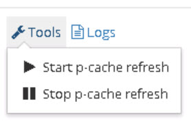

# Decommission Legacy Directory

Once all applications have successfully migrated over to use RadiantOne Universal Directory, the legacy directory can be decommissioned and the persistent cache refresh and inter cluster replication processes can be stopped.

1.	On the [Client Consumption Layer](03-import-data-into-radiantone-universal-directory), go to the Main Control Panel > Directory Namespace tab.

2.	Select the naming context for the RadiantOne Universal Directory (HDAP) store and on the right side, uncheck inter-cluster replication and click Save.

3.	On the Persistent Cache Refresh Layer, go to the Main Control Panel > PCache Monitoring tab. 

4.	Select the persistent cache refresh topology and once it loads, choose Tools > Stop PCache Refresh.

 
For information on stopping RadiantOne components, see the RadiantOne Deployment and Tuning Guide.

For simpler scenarios, where a single layer is used (and clients are consuming the persistent cache view directly), the persistent cache can be converted to a RadiantOne Universal Directory store. This is a sensitive operation and must be performed during off-peak hours.

Before converting a persistent cache to an RadiantOne Universal Directory (HDAP) store, the persistent cache refresh should be stopped. You can set the refresh method to “none” on the Main Control Panel -> Directory Namespace -> Cache > `<cached branch>` > Refresh Settings tab. Also, suspend intercluster replication if it is used by setting “replicationInSuspendMode” : true, in ZooKeeper at /`radiantone/<zk_version>/<clustername>/config/namings/<namingcontext_being_replicated>`

Convert the persistent cache naming context into a RadiantOne Universal Directory with the following command using the <RLI_HOME>/bin/vdsconfig.bat(.sh) utility:
`convert-pcache-to-hdap -namingcontext <namingcontext> [-instance <instance>]`

**Command Arguments:**

`-namingcontext <namingcontext>`
 [required] The name of the persistent cache naming context to be converted to a RadiantOne Universal Directory (HDAP) store.

`-instance <instance>`
 The name of the RadiantOne FID instance. If this is not specified, the default instance named vds_server is used.

>[!note] Before the conversion, you are prompted to confirm the operation.  Enter “y” to confirm, or “n” to discontinue.

After the persistent cache has been converted to a RadiantOne Universal Directory store, rebuild the index to remove any persistent cache operational attributes. For details on how to rebuild the index, see the RadiantOne Command Line Configuration Guide. If intercluster replication is used, enable it by setting “replicationInSuspendMode” : false, in ZooKeeper at /`radiantone/<zk_version>/<clustername>/config/namings/<namingcontext_being_replicated>`
