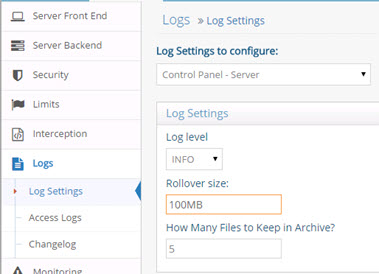
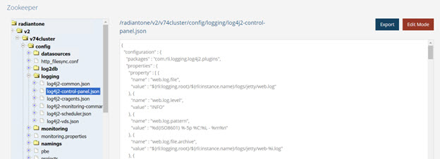

# Control Panels and Configuration Tools

## Control Panel

A Jetty web server hosts the Main and Server Control Panels. There are two log files applicable to this component. The Server Log contains internal server activities and is generated the first time each day that Jetty is started. The Access Log contains the save operations performed by administrators.

### Server Log

The log file is web.log. 

This file rolls over when it reaches 100M in size and 5 files are archived. These settings are configured from the Main Control Panel > Settings tab > Logs > Log Settings section. Select Control Panel – Server from the Log Settings to Configure drop-down list. Define the log level, rollover size and number of files to keep archived.

Figure 1: Main Control Panel Server Log Settings

Web.log can be viewed and downloaded from Server Control Panel > Log Viewer. 

### Access Log

The Control Panel access log file contains the save operations performed by administrators. When any user that is a member of the delegated administration groups saves changes in the Main or Server Control Panels, this activity is logged into the web_access log. This is a CSV formatted log file with the delimiter being <TAB>. These settings are configured from the Main Control Panel > Settings tab > Logs > Log Settings section. Select Control Panel – Access from the Log Settings to Configure drop-down list. Define the log level, rollover size and number of files to keep archived.

 
Figure 2: Main Control Panel Access Log Settings

Web_access.log file can be viewed and downloaded from Server Control Panel > Log Viewer.

<!-- 

The condition for deleting an archive is based on the total number of archives (configured in the How Many Files to Keep in Archive setting), or the age of the archive (configured in the web.access.file.maxTime property in the Advanced section), whichever comes first.

If you want to base archive deletion on the total number of archives, configure the web.access.file.maxTime property to 1000000d (1 million days), so that it is never triggered and indicate the maximum number of archive files to keep in the How Many Files to Keep in Archive property. If you want to base archive deletion on the age of the archive, configure the How Many Files to Keep in Archive to something like 1000000 (1 million files) so it is never triggered, and define the max age in number of days (e.g. 30d for 30 days) for the web.access.file.maxTime property in the Advanced section (requires [Expert Mode](01-overview#expert-mode)).

Other Advanced properties (requires [Expert Mode](01-overview#expert-mode)) that can be used to further condition the archive deletion are:

-	web.access.file.archive.scan.folder - the base folder where to find the logs to delete

-	web.access.file.archive.scan.depth - the depth to search for log files

-	web.access.file.archive.scan.glob -  the regex (glob style) to match to select which files to delete

### Custom Settings

More fine-grained configuration log settings related to the Main and Server Control Panels can be managed from the Main Control Panel > ZooKeeper tab (requires [Expert Mode](01-overview#expert-mode)). Navigate to radiantone/v1/cluster/config/logging/log4j2-control-panel.json. Click Edit Mode to modify the settings. Generally, these advanced settings should only be changed if advised by Radiant Logic.

 
Figure 3: Log4J Settings Applicable to the Main and Server Control Panels
