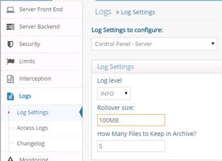
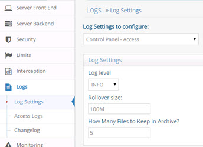
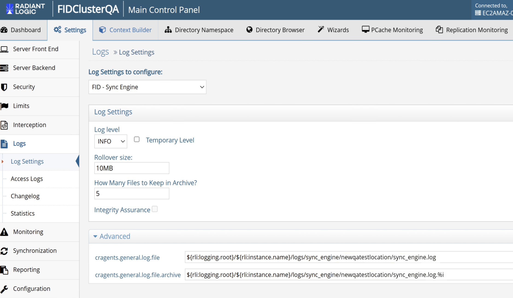
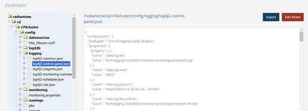
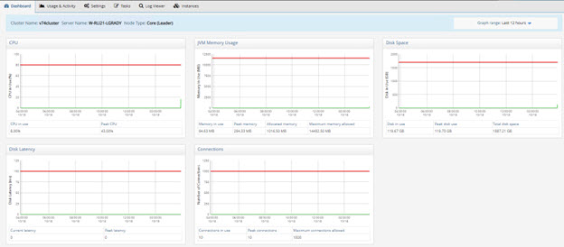
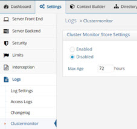

# Control Panels and Configuration Tools

## Control Panel

A Jetty web server hosts the Main and Server Control Panels. There are four log files applicable to this component. The Windows service logs contains information related to installing, starting, uninstalling, and stopping the service. The Server Log contains internal server activities and is generated the first time each day that Jetty is started. The Access Log contains the save operations performed by administrators.

### Windows Service Log

If the Control Panel has been installed as a Windows Service, information related to installing, starting, and uninstalling the service can be found in: 

<RLI_HOME>/logs/rli_mgmt_console_service.log

Information about stopping the service can be found in:

<RLI_HOME>/logs/rli_mgmt_console_service_stop.log

### Server Log
The log file and default location is: <RLI_HOME>/vds_server/logs/jetty/web.log. 

This file rolls over when it reaches 100M in size and 5 files are archived. These settings are configured from the Main Control Panel > Settings tab > Logs > Log Settings section. Select Control Panel – Server from the Log Settings to Configure drop-down list. Define the log level, rollover size and number of files to keep archived.

Figure  1: Main Control Panel Server Log Settings

To change the archive location, expand below the Advanced section (requires [Expert Mode](01-overview#expert-mode)) and indicate the path in the web.log.file.archive property. Generally, these advanced settings should only be changed if advised by Radiant Logic.

The condition for deleting an archive is based on the total number of archives (configured in the How Many Files to Keep in Archive setting), or the age of the archive (configured in the web.log.file.maxTime property in the Advanced section), whichever comes first.

If you want to base archive deletion on the total number of archives, configure the web.log.file.maxTime property to 1000000d (1 million days), so that it is never triggered and indicate the maximum number of archive files to keep in the How Many Files to Keep in Archive property. If you want to base archive deletion on the age of the archive, configure the How Many Files to Keep in Archive to something like 1000000 (1 million files) so it is never triggered, and define the max age in number of days (e.g. 30d for 30 days) for the web.log.file.maxTime property in the Advanced section (requires [Expert Mode](01-overview#expert-mode)).

Other Advanced properties (requires [Expert Mode](01-overview#expert-mode)) that can be used to further condition the archive deletion are:

-	web.log.file.archive.scan.folder - the base folder where to find the logs to delete

-	web.log.file.archive.scan.depth - the depth to search for log files

-	web.log.file.archive.scan.glob -  the regex (glob style) to match to select which files to delete

### Access Log

The Control Panel access log file contains the save operations performed by administrators. When any user that is a member of the delegated administration groups saves changes in the Main or Server Control Panels, this activity is logged into: <RLI_HOME>/vds_server/logs/jetty/web_access.log. This is a CSV formatted log file with the delimiter being *TAB*. These settings are configured from the Main Control Panel > Settings tab > Logs > Log Settings section. Select Control Panel – Access from the Log Settings to Configure drop-down list. Define the log level, rollover size and number of files to keep archived.

 
Figure 2: Main Control Panel Access Log Settings

To change the archive location, expand below the Advanced section (requires [Expert Mode](01-overview#expert-mode)) and indicate the path in the web.access.file.archive property. Generally, these advanced settings should only be changed if advised by Radiant Logic.

The condition for deleting an archive is based on the total number of archives (configured in the How Many Files to Keep in Archive setting), or the age of the archive (configured in the web.access.file.maxTime property in the Advanced section), whichever comes first.

If you want to base archive deletion on the total number of archives, configure the web.access.file.maxTime property to 1000000d (1 million days), so that it is never triggered and indicate the maximum number of archive files to keep in the How Many Files to Keep in Archive property. If you want to base archive deletion on the age of the archive, configure the How Many Files to Keep in Archive to something like 1000000 (1 million files) so it is never triggered, and define the max age in number of days (e.g. 30d for 30 days) for the web.access.file.maxTime property in the Advanced section (requires [Expert Mode](01-overview#expert-mode)).

Other Advanced properties (requires [Expert Mode](01-overview#expert-mode)) that can be used to further condition the archive deletion are:

-	web.access.file.archive.scan.folder - the base folder where to find the logs to delete

-	web.access.file.archive.scan.depth - the depth to search for log files

-	web.access.file.archive.scan.glob -  the regex (glob style) to match to select which files to delete

### Sync engine logs

Starting in **RadiantOne FID v7.4.26**, you can customize the log file destination, archive naming patterns, file rollover thresholds, and archive retention count for the Sync Engine directly from the Control Panel. 

#### Accessing Sync Engine Log Settings

1. Log in to the **RadiantOne Control Panel** as an administrator.
2. In the top navigation bar, ensure **Expert Mode** is enabled (toggle in the top right).
3. Navigate to **Settings** > **Logs** > **Log Settings**.
4. In the **Log Settings to configure** dropdown, select **FID - Sync Engine**.

   

5. Configure the log settings according to your logging and disk retention requirements:

   | Field | Description | Example |
   | :--- | :--- | :--- |
   | **Log level** | The level of detail written to the Sync Engine log. Higher levels such as DEBUG and TRACE log more information but increase log size and can affect performance. For details on each level, see [Log Levels](01-overview#log-levels). | `INFO` |
   | **Temporary Level** | When checked, the selected log level applies only until a date and time you specify, then reverts automatically. Use this to capture detailed logs while troubleshooting without leaving verbose logging on. For details, see [Temporary Log Level Setting](03-radiantone-universal-directory#temporary-log-level-setting). | Checked, with DEBUG set to revert after troubleshooting |
   | **Integrity Assurance** | When checked, RadiantOne protects the log files against tampering so that any modification to a log file after it is written can be detected. | Checked, for environments with audit or compliance requirements |
   | **Rollover size** | The maximum size the active log file can reach before it is rolled over into the archive. | `10MB` |
   | **How Many Files to Keep in Archive?** | The maximum number of archived log files to retain. When this number is exceeded, the oldest archived files are deleted. | `5` |

6. To change the log file locations, expand the **Advanced** section and configure the following settings:

   | Field | Description | Example |
   | :--- | :--- | :--- |
   | **cragents.general.log.file** | The path and file name of the active Sync Engine log file. | `${rli:logging.root}/${rli:instance.name}/logs/sync_engine/newqatestlocation/sync_engine.log` |
   | **cragents.general.log.file.archive** | The path and naming pattern for archived log files. `%i` is replaced with the roll index of each archived file. | `${rli:logging.root}/${rli:instance.name}/logs/sync_engine/newqatestlocation/sync_engine.log.%i` |

7. Click **Save**.

### Custom Settings

More fine-grained configuration log settings related to the Main and Server Control Panels can be managed from the Main Control Panel -> ZooKeeper tab (requires [Expert Mode](01-overview#expert-mode)). Navigate to `radiantone/<version>/<clustername>/config/logging/log4j2-control-panel.json`. Click the Edit Mode button to modify the settings. Generally, these advanced settings should only be changed if advised by Radiant Logic.

 
Figure 3: Log4J Settings Applicable to the Main and Server Control Panels

## Server Control Panel - Cluster Monitor

A special storage mounted at cn=clustermonitor is used to store historical information about the RadiantOne service’s statistics including CPU usage, memory usage, disk space, disk latency, and connection usage. This historical information is used to populate the graphs shown on the Server Control Panel -> Dashboard tab. An example is shown below.

 
Figure 4: Server Control Panel > Dashboard tab

The cluster monitor store is configurable from Main Control Panel > Settings > Logs > Clustermonitor. You can enable/disable the store from here and indicate a max age for the entries to prevent the contents from growing too large.
Note – if you disable the cluster monitor store, no graphs display on the Server Control Panel -> Dashboard tab.

 
Figure 5: Cluster Monitor Log Settings

## Context Builder

For auditing purposes, <RLI_HOME>/logs/contextbuilder_audit.log can be used. This log contains details about the files that were saved/created/deleted, the date/time the change occurred, and the current OS user that was using Context Builder.

## VDSCONFIG Command Line Utility

Configuration commands issued using the vdsconfig utility can be logged. To enable logging of configuration requests using vdsconfig, navigate to <RLI_HOME>/config/advanced and edit features.properties. Set vdsconfig.logging.enabled=true. Restart the RadiantOne service. If RadiantOne is deployed in a cluster, restart the service on all nodes. The log settings are configurable and initialized from <RLI_HOME>/config/logging/log4j2-vdsconfig.json

The default audit log is <RLI_HOME>/logs/vdsconfig.log.

>[!warning] If you want the admin name that issued the command logged, make sure you have enabled the setting to Require a UserID and Password to Execute Commands. For information about this setting, see the RadiantOne Command Line Configuration Guide.
