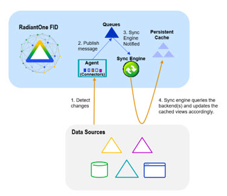
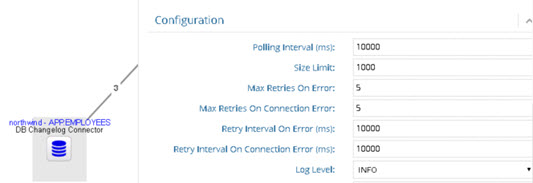

# Chapter 3: RadiantOne Universal Directory and Federated Identity Service

The main log file for troubleshooting the RadiantOne service is <RLI_HOME>/<instance_name>/logs/vds_server.log. For clients accessing the RadiantOne service via the SQL interface (VRS), the log file is <RLI_HOME>/<instance_name>/logs/vrs/vrs_server.log.

This chapter describes the RadiantOne Universal Directory and Federated Identity Service logs.

## Windows Service Log

If the RadiantOne service has been installed as a Windows Service, information related to installing, starting, and uninstalling the service can be found in: 

<RLI_HOME>/logs/rli_fid_server_service.log

Information about stopping the service can be found in:

<RLI_HOME>/logs/rli_fid_server_service_stop.log

## RadiantOne Server Log

Server logging is configured from the Main Control Panel > Settings tab > Logs > Logs Settings section. Select the VDS – Server option from the Log Settings to Configure drop-down menu.

More fine-grained configuration settings related to the RadiantOne service can be managed from the Main Control Panel > ZooKeeper tab (requires [Expert Mode](01-overview#expert-mode)). Navigate to radiantone/v1/cluster/config/logging/log4j2-vds.json. These advanced settings should only be changed if advised by Radiant Logic.


 
Figure 3.1: Log4J Settings for the RadiantOne Service

### Log Contents

The vds_server.log records:
	Host name of the local RadiantOne server. This is only reported when the service starts. An example is:
<br> 2017-08-14 10:33:16,839 WARN  VDSServer:54 - zkId:1 hostname:vds72l IP:10.11.8.22 cloudId:6646de6a-356a-45b1-b1cf-5ae118c35fc5

-	Open/closed connections by LDAP clients to the RadiantOne service

-	LDAP requests made to the RadiantOne service

-	LDAP responses from the RadiantOne service

-	Some information generated by the RadiantOne engine: errors (backend unavailable, etc…), requests, etc…

-	Commands issued by RadiantOne against the underlying backends.  

-	Requests made to ZooKeeper.

-	Activities from the Context Builder tool.

-	SCIMv2 requests and responses. The SCIMv2 incoming queries from clients are prefixed with ScimRequest for the requests and ScimResponse for the replies from RadiantOne. RadiantOne server log level of at least INFO is required to log the SCIMv2 requests.

### Log Level

Select a log level from the drop-down list in the Log Settings section. For details on available log levels, see [Chapter 1](01-overview).

>[!warning] to troubleshoot/trace ACI evaluation decisions, RadiantOne server log level must be set to DEBUG. When DEBUG level is set, the evaluation rules can be seen in: <RLI_HOME>/vds_server/logs/vds_server.log. An example of ACI evaluation is shown below:
2021-05-07T15:40:44,920 DEBUG com.rli.slapd.aci.generic.AciHandler:436 - 
  [ACI EVAL] operation: 'SEARCH REQUEST'
  [ACI EVAL]  targetDN: 'ou=Accounting,o=companydirectory'
  [ACI EVAL]   subject: 'uid=Aaron_Medler,ou=Accounting,o=companydirectory'
  [ACI EVAL] Aci candidates {2}:
  [ACI EVAL] Aci candidate # 1 - '(targetattr = "*")(target = "ldap:///o=companydirectory")(targetscope = "subtree")(version 3.0;acl "myaci description";deny (all) (userdn = "ldap:///uid=Aaron_Medler,ou=Accounting,o=companydirectory");)'
  [ACI EVAL] Aci candidate # 2 - '(targetattr!="aci")(version 3.0; acl "Grant read access to anyone"; allow (read,search,compare) userdn="ldap:///anyone";)'
  [ACI EVAL] Aci evaluation result: --DENY-- 
2021-05-07T15:40:44,921 DEBUG com.rli.slapd.server.nio.SessionHandler:2354 - [conn=50 op=2]  Entry discared by ACI

### Rollover Size

By default, the vds_server.log file rolls over once it reaches 100MB in size. Change this value if needed.

### Log Archiving

By default, 20 log files are kept (oldest ones are deleted to maintain a maximum of 20). You can change this value in the How Many Files to Keep in Archive setting. The archived files are named vds_server-<yyyy-MM-dd_HH-mm-ss>.log.zip and located in <RLI_HOME>/<instance_name>/logs. The default instance name is vds_server, so the path would be: <RLI_HOME>/vds_server/logs/.

The condition for deleting an archive is based on the total number of archives (configured in the How Many Files to Keep in Archive setting), or the age of the archive (configured in the server.log.file.maxTime property in the Advanced section), whichever comes first.

If you want to base archive deletion on the total number of archives, configure the server.log.file.maxTime property to 1000000d (1 million days), so that it is never triggered and indicate the maximum number of archive files to keep in the How Many Files to Keep in Archive property. If you want to base archive deletion on the age of the archive, configure the How Many Files to Keep in Archive to something like 1000000 (1 million files) so it is never triggered, and define the max age in number of days (e.g. 30d for 30 days) for the server.log.file.maxTime property in the Advanced section (requires [Expert Mode](01-overview#expert-mode)).

Other Advanced properties (requires Expert Mode) that can be used to further condition the archive deletion are:

-	server.log.file.archive.scan.folder - the base folder where to find the logs to delete

-	server.log.file.archive.scan.depth - the depth to search for log files

-	server.log.file.archive.scan.glob -  the regex (glob style) to match to select which files to delete

## RadiantOne Access Log 

The vds_server_access.log contains less information than vds_server.log and is used more for auditing. Access logging is configured from the Main Control Panel > Settings tab > Logs > Access Logs section.

### Log Output Format

The output format for the access log is Text by default. The other output option is CSV. If you want the log content written to a database, you must enable the CSV output option and use the [Log2DB utility](#configuring-the-database-logging-utility-log2db).

>[!note] to turn off access logging, uncheck both the text and csv output options.

If you would like column name headers (descriptions) in the CSV file, check the “Add Column Name Headers to CSV Logging” option.

If you change any output format settings, remember to click the Save button. The RadiantOne service does not need to be restarted unless you check the option to Add Column Name Headers to CSV Logging. If you enable/disable this option, you must restart the RadiantOne service. Also, the headers are only added/removed on a new log file.

### Bind DN Information in vds_server_access.log

By default, the Search Results in vds_server_access.log do not contain bind DN information. To enable bind DN information to be logged for search results in the access log:

1.	In the Main Control Panel, go to the Zookeeper tab. 

2.	In the pane on the left, expand /radiantone/v2/<cluster name>/config/ and select the vds_server.conf node. 

3.	Click **Edit Mode**. 

4.	Change the value for enableAccessLoggingWithWhoDidThat to true. 


Figure 3. 2: Enabling bind DN info for vds_server_access.log 

5.	Click **Save**. 

The access log now displays bind DN information for Search Results for both successful and unsuccessful binds.

>[!note] This setting does not affect vds_server_access.csv, which displays bind DN information by default.

The following example entry shows bind DN information for a successful bind. 

```
2020-11-10 16:26:04,896 |localhost~201110154406|<== conn=10 op=57 MsgID=57 SearchResult {resultCode=0, matchedDN=null, errorMessage=null} ### nEntries=1 ### bindDN="cn=Directory Manager" ### etime=0 ###
```

The following example entry shows bind DN information for an unsuccessful bind attempt. 

```
2022-05-09 15:02:40,446 |localhost ~220509150108|<== conn=5 op=3 MsgID=3 BindResponse {resultCode=49, matchedDN=null, errorMessage=Reason: 52e - Invalid credentials} ### bindDN="cn=Marketing User,dc=hdap" ### etime=8 ###
```

### Rollover Size

The vds_server_access.log rolls over when it reaches 100MB in size. Change this value if needed.

### Log Contents

This log file acts as an audit log (and is used to generate reports from) and records the following information:

- 	Who binds to RadiantOne

-	Open/closed connections by LDAP clients to the RadiantOne service

-	LDAP requests made to RadiantOne 

-	LDAP responses from RadiantOne 

More information can be found in the Log Details section below.

### Log Details

Details regarding the CSV column names and descriptions are shown below.

Table 1: Access Log CSV/Database Column Names and Description

ACCESS LOG COLUMNS	| DESCRIPTION
-|-	
LOGID	| This is the unique accesslog id based on `<timestamp>+<counter>`.
LOGDATE	| This is the date of request.
LOGTIME	| This is the time of request.
LOGTYPE	 | 1:request, 2:response, 3:connect, 4:disconnect
SERVERID	| This is `<servername>-<instancename>`.
SERVERPORT	| This is the RadiantOne service port the request came in on.
SESSIONID	| This is the server session id.
MSGID	| This is the LDAP operation message ID.
CLIENTIP | This is the IP address of client. For calls sent to RadiantOne through REST (through the ADAP API) or SCIM, X-Forwarded-For header is supported. In this context, the whole chain of IP addresses (e.g. client, load balancer…etc.) are logged.
BINDDN	| BindDn contains the value representing the user to authenticate, that RadiantOne gets in the BindRequest. 
BINDUSER	| If Proxy Authorization is used in the request, BindUser contains the authorization DN. This is the DN associated with the user which RadiantOne bases authorization on. If Proxy Authorization is not used in the request, BindUser is empty.
CONNNB   | This is the connection number.
OPNB	| This is the operation number.
OPCODE	| This is the protocol operation type (see table 2 below).
OPNAME	| This is the protocol operation name (see table 2 below).
BASEDN	| This is the basedn (starting point in the RadiantOne namespace) rec'd in the request.
ATTRIBUTES	| These are the attributes received in the request.
SCOPE	| This is the scope received in the request.
FILTER	| This is the filter received in the request.
SIZELIMIT	| This is the sizelimit received in the request.
TIMELIMIT	| This is the timelimit received in the request.
LDAPCONTROLS	| These are the LDAP controls received in the request. This column also indicates if a secure socket is used. If the request came in on the non SSL/TLS port, this column has [Plain]. If the request came in on the SSL/TLS port, this column has [SSL/TLS] followed by the LDAP control requested (if any). A summary is shown below.<br> [Plain]  - plain socket, not secure <br> [SSL/TLS]  -  secure socket, protocol unknown <br> [SSL/TLS-<protocol>] - secure socket with protocol used (e.g. [SSL/TLS-TLSV1.2])
CHANGES	| These are the changes for add/delete/modify requests.
RESULTCODE | This is the ldap operation result code returned by RadiantOne.
ERRORMESSAGE	| This is the error message returned by RadiantOne.
MATCHEDDN	| This is returned in the result message from RadiantOne in case of errors like (32) noObjectFound or (21) invalidSyntax. This is usually set to the last DN used in finding the requested entry.
NBENTRIES	| This is the number of entries returned in searchrequest.
ETIME	| This is the elapsed time (in ms) to complete the operation.

 
Table 2: Operation Name and Code

OPNAME	| OPCODE
-|-
BindRequest	| 0
BindResponse	| 1
UnbindRequest	| 2
SearchRequest	| 3
SearchResponse	| 4
SearchResult	| 5
ModifyRequest	| 6
ModifyResponse	| 7
AddRequest	| 8
AddResponse	| 9
DelRequest	| 10
DelResponse	| 11
ModifyRDNRequest	| 12
ModifyRDNResponse	| 13
CompareRequest	| 14
CompareResponse	| 15
AbandonRequest	| 16
SearchResultReference	| 19
ExtendedRequest	| 23
ExtendedResponse	| 24
Connect	| 30
Disconnect	| 31

### Ignore Logging for Internal Naming Contexts

Queries to certain internal naming contexts can happen frequently resulting in a lot of “noise” in the access log. To ignore logging for these naming contexts, expand below the Advanced section (requires [Expert Mode](01-overview#expert-mode)) and check the box next to the naming context. Logging for the following naming contexts can be ignored.

-	ROOT – this is for queries requesting the rootDSE (an empty base DN) and is often used by hardware load balancers to check the availability of the RadiantOne service.

-	cn=changelog – modifications to entries in the RadiantOne namespace are tracked in the changelog. Other services can query the changelog frequently to check for changes.

-	cn=clustermonitor – various statistics and availability of cluster nodes are retrieved by querying cn=clustermonitor.
	cn=replicationjournal – inter-cluster replication queries the cn=replicationjournal.

### Ignore Logging Related to Monitoring

Certain queries used to monitor RadiantOne can happen frequently, resulting in a lot of “noise” in the access log. Logging of monitoring requests is disabled by default. To enable logging of monitoring requests, navigate to <RLI_HOME>/config/advanced and edit features.properties. Set vds.data.collection.logging=true. Restart the RadiantOne service. If RadiantOne is deployed in a cluster, restart the service on all nodes.

>[!note] if vds.data.collection.logging is set to true, ZooKeeper exceptions returned by data collectors used for monitoring are logged into <RLI_HOME>/vds/vds_server/logs/vds_server.log. Also, requests for data collectors on the admin HTTP port are logged into <RLI_HOME>/vds/vds_server/logs/scheduler/server.log.

### Logging to a Database

RadiantOne logs all access to data in the vds_server_access.log (if the server [log level](#log-level) is set to a minimum of Info) by default. All this information can also be logged into a database which allows for third-party reporting tools to easily create meaningful charts and graphs for compliance analysis. Logging to a database requires the [CSV log format](#log-output-format) option enabled and running the Log2DB utility. Configuring and starting the Log2DB utility are described in the section below.

#### Configuring the Database Logging Utility (Log2DB)

The Log2DB utility reads the contents from vds_server_access.csv (CSV log output must be configured) and writes this into a database.

The database that houses the table which the Log2DB utility writes to may be in any database server you choose. 

>[!warning] if you plan on using the RadiantOne default report generation, then the log2db database must be Microsoft SQL Server, Oracle, Derby or PostgreSQL. For details on default reports see the RadiantOne Monitoring and Reporting Guide.

The default settings leverage a Derby database that is included with RadiantOne. These settings are described below and are located on the Main Control Panel -> Settings Tab -> Reporting section -> Log2db Settings sub-section. The default configuration file for logging to a database is: <RLI_HOME>/config/log2db/AccessLog2DBconfig.properties.

-	Database Datasource – data source defined in Main Control Panel -> Settings tab -> Server Backend section -> DB Data Sources representing the database that the Log2DB utility writes to.

-	Table Name - The table name that stores the log contents.

-	Mode – Value of either Truncate or Append. When you start the Log2DB utility, if you are in truncate mode, it empties the contents of the log table before anything new gets added. If you are using append mode, then the new log content is appended at the end of the table (rows are added).

-	Table Creation - Enter the appropriate create table syntax for the type of database you want to use.

#### Managing the Log Table

If the table that is going to store the access log content does not exist, use the CREATE TABLE Button to create it. Make sure the create table statement listed in the Table Creation parameter is accurate. You can also execute <RLI_HOME>\bin\advanced\runCreateAccessLogTable.bat (runCreateAccessLogTable.sh on UNIX) to create the log table in the database.

To create the indexes for the log table, click the CREATE INDEX button.

To delete the contents of the log table, click the EMPTY TABLE button.

#### Starting the Database Logging Utility 

The utility that writes the RadiantOne logs into a database is named Log2DB and can be started from command line or as a service. The database server configured to store the log contents must be running prior to starting the Log2DB utility.

>[!warning] If RadiantOne is deployed in a cluster, the data source associated with the database housing the log content is shared by all cluster nodes. However, since search requests can be directed to any cluster node, the Log2DB utility must be running on each cluster node.

**From Command Line**

On Windows platforms, execute <RLI_HOME>/bin/runAccessLog2DB.bat <path to properties file>. On UNIX platforms, execute runAccessLog2DB.sh <path to properties file>.

For example:

```
runAccessLog2DB.bat 
C:\radiantone\vds\config\log2db\AccessLog2DBconfig.properties
```

This starts the database logging utility. The Log2DB utility reads the vds_server_access.csv file and inserts the contents into the database log table. If you want activity that has happened while the Log2DB utility was not running to be written into the log table (for reporting purposes for example) set the “detect new only” property in the AccessLog2DBconfig.properties to false before starting the utility.

**As a Windows Service**

To install the RadiantOne database access logger as a service:

1.	Navigate to <RLI_HOME>/bin/windows.service. 

2.	(optional) To change the name of the service that gets installed, edit db-access-logger-service-install.bat.

3.	Execute the db-access-logger-service-install.bat file. A command window opens briefly and then closes.

4.	Check your Windows Services. You should now have a service named RadiantOne DB Access Logger (or other name as defined in step 2 above). You can now start and stop the database logger as a Windows service. 

>[!note] If you would like to uninstall the service, first stop the service and then execute db-access-logger-service-uninstall.bat.

**As a Linux Daemon

To install the Log2DB utility as a Linux daemon: 

1.	Copy the script using the following command:

```
cp runAccessLog2DB.sh
```

2.	Modify the script’s file access rights using the following command:

```
chmod +x /etc/init.d/runAccessLog2DB.sh
```

3.	Install the script as follows:

```
/sbin/chkconfig –add runAccessLog2DB.sh
```

## JVM Garbage Collection and Memory Heap

Logging for the garbage collection and memory for the RadiantOne JVM is enabled by default. If java.lang.OutOfMemoryError appears in the vds_server.log file, logs for the JVM can be found in <RLI_HOME>/vds_server/logs. Example files:

```
gc2018-07-12_12-09-02.log.0.current
java_pic3577.hprof
```

## VRS Logs

If the SQL API (VRS) is used to access RadiantOne, there are two logs associated with this. They are vrs_access and vrs_server. 

### VRS Server

VRS Server logging is configured from the Main Control Panel -> Settings tab -> Logs -> Logs Settings section. Select the VDS - VRS Server option from the Log Settings to Configure drop-down menu.

#### Log Location

These log files are located in <RLI_HOME>/<instance_name>/logs/vrs. The default instance name is vds_server, so the path would be: <RLI_HOME>/vds_server/logs/vrs.

#### Log Level
Select a log level from the drop-down list in the Log Settings section. For details on available log levels, see [Chapter 1](01-overview).

### Rollover Size

By default, the vrs_server.log file rolls over once it reaches 100MB in size. Change this value if needed.

### Log Archiving

By default, 10 files are kept in the archive. Change this value in the How Many Files to Keep in Archive setting. The archived files are named vrs_server-`<number>`.log and located in `<RLI_HOME>/<instance_name>/logs/vrs`. The default instance name is vds_server, so the path would be: <RLI_HOME>/vds_server/logs/vrs.

The condition for deleting an archive is based on the total number of archives (configured in the How Many Files to Keep in Archive setting), or the age of the archive (configured in the vrs.general.log.file.maxTime property in the Advanced section), whichever comes first.

If you want to base archive deletion on the total number of archives, configure the vrs.general.log.file.maxTime property to 1000000d (1 million days), so that it is never triggered and indicate the maximum number of archive files to keep in the How Many Files to Keep in Archive property. If you want to base archive deletion on the age of the archive, configure the How Many Files to Keep in Archive to something like 1000000 (1 million files) so it is never triggered, and define the max age in number of days (e.g. 30d for 30 days) for the vrs.general.log.file.maxTime property in the Advanced section (requires [Expert Mode](01-overview#expert-mode)).

Other Advanced properties (requires [Expert Mode](01-overview#expert-mode)) that can be used to further condition the archive deletion are:

-	vrs.general.log.file.archive.scan.folder - the base folder where to find the logs to delete

-	vrs.general.log.file.archive.scan.depth - the depth to search for log files

-	vrs.general.log.file.archive.scan.glob -  the regex (glob style) to match to select which files to delete

### VRS Access

VRS Access logging is configured from the Main Control Panel -> Settings tab -> Logs -> Logs Settings section. Select the VDS - VRS Access option from the Log Settings to Configure drop-down menu. The vrs_access.log contains less information than vrs_server.log and is used more for auditing.

#### Log Location

These log files are in <RLI_HOME>/<instance_name>/logs/vrs. The default instance name is vds_server, so the path would be: <RLI_HOME>/vds_server/logs/vrs.

#### Log Level

Select a log level from the drop-down list in the Log Settings section. For details on available log levels, see [Chapter 1](01-overview).

#### Rollover Size

By default, the vrs_access.log file rolls over once it reaches 100MB in size. Change this value if needed.

### Log Archiving

By default, 10 files are kept in the archive. Change this value in the How Many Files to Keep in Archive setting. The archived files are named vrs_access-<number>.log and located in <RLI_HOME>/<instance_name>/logs/vrs. The default instance name is vds_server, so the path would be: <RLI_HOME>/vds_server/logs/vrs.

The condition for deleting an archive is based on the total number of archives (configured in the How Many Files to Keep in Archive setting), or the age of the archive (configured in the server.log.file.maxTime property in the Advanced section), whichever comes first.

If you want to base archive deletion on the total number of archives, configure the vrs.access.log.file.maxTime property to 1000000d (1 million days), so that it is never triggered and indicate the maximum number of archive files to keep in the How Many Files to Keep in Archive property. If you want to base archive deletion on the age of the archive, configure the How Many Files to Keep in Archive to something like 1000000 (1 million files) so it is never triggered, and define the max age in number of days (e.g. 30d for 30 days) for the vrs.access.log.file.maxTime property in the Advanced section (requires [Expert Mode](01-overview#expert-mode)).

Other Advanced properties (requires [Expert Mode](01-overview#expert-mode)) that can be used to further condition the archive deletion are:

-	vrs.access.log.file.archive.scan.folder - the base folder where to find the logs to delete

-	vrs.access.log.file.archive.scan.depth - the depth to search for log files

-	vrs.access.log.file.archive.scan.glob -  the regex (glob style) to match to select which files to delete

## RadiantOne Persistent Cache with Real-time Refresh

The logs associated with persistent cache with real-time refresh are described in this section.
The high-level diagram below depicts the components involved.



Figure 3.3: High-level Persistent Cache with Real-time Refresh Diagram

1.	A connector detects changes in the backend.

2.	The connector publishes changes into a queue (one queue per backend). The message doesn't require all attributes of the entries, just enough to process the refresh.

3.	The Sync Engine picks up changes from the queue. This is event-driven (not polling).

4.	The Sync Engine queries the backend(s) and updates the persistent cache view(s) accordingly.

### Agent

The agent logs are located at: <RLI_HOME>\logs\sync_agents\agent_fid_sd_agent_real_time.log

The log level is controlled by the setting in Main Control Panel -> Settings tab -> Logs -> Log Settings. Select the Sync Agents – Agents option.


Figure 3.4: Sync Agents Log Settings

### Connectors

The capture connector logs are located at: <RLI_HOME>\logs\sync_agents\<naming_context>_<baseDN>_<data_source>\connector.log

The log level is defined per connector with the setting in Main Control Panel -> PCache Monitoring tab. Select the connector on the topology and the configuration window displays. In the Configuration section, select the level from the Log Level drop-down list.



Figure 3.5: Connector Log Level

### Sync Engine

The sync engine log is located at <RLI_HOME>\vds_server\logs\sync_engine\sync_engine.log on the RadiantOne node where the sync engine processor that is assigned for the pipeline is running. If RadiantOne is deployed in a cluster, a sync engine processor can be running on one or more nodes and the pipeline processing is distributed across them. Check for the <RLI_HOME>\vds_server\logs\sync_engine\sync_engine.log on each cluster node to find the correct log file. Or you can use the Global Sync tab to download the corresponding sync_engine.log file by selecting the topology and clicking Configure next to the pipeline. Select the Apply component and in the Log Viewer section, click the Download button.

## HDAP Trigger

When virtual views are created on RadiantOne Universal Directory (HDAP) stores or persistent cache, and those views are configured for persistent cache, the change capture connector type defaults to HDAP Trigger. This is an internal mechanism that automatically refreshes persistent caches that are built on top of other persistent caches or RadiantOne Universal Directory (HDAP) stores. When the RadiantOne VDS Sync Engine is configured for DEBUG log level, the HDAP trigger activity is logged into: <RLI_HOME>/vds_server/logs/sync_engine/sync_engine.log

You can set the log level from Main Control Panel > Settings > Logs > Log Settings as shown below.


Figure 3.6: VDS Sync Engine Log Level

## RadiantOne Persistent Cache with Periodic Refresh

### Snapshot Files

Periodic persistent cache refresh leverages a snapshot mechanism to detect changes in the backend data source(s). The “snapshot” is an LDIF formatted file that contains the entries from the backend. During a refresh cycle, a new LDIF file is generated from the backend and compared to the last snapshot to detect changes. The current snapshot file is located in: <RLI_HOME>/vds_server/ldif/import/<naming>_FULL_periodic.ldif

#### Log

The log associated with persistent cache with periodic refresh is configured from the Main Control Panel > Settings tab > Logs > Logs Settings section. Select the VDS – Persistent Cache Periodic Refresh option from the Log Settings to Configure drop-down menu.

More fine-grained configuration settings related to RadiantOne can be managed from the Main Control Panel -> ZooKeeper tab (requires [Expert Mode](01-overview)). Navigate to radiantone/<version>/<cluster_name>/config/logging/log4j2-vds.json. These advanced settings should only be changed if advised by Radiant Logic.


Figure 3.7: Log4J Settings Applicable to Persistent Cache with Periodic Refresh

#### Log Contents

The periodiccache.log records persistent cache, periodic refresh activity. Below is an example of the activity you can find in this log. The example below is based on a naming context named dc=pxy that has been configured as persistent cache with periodic refresh.

```
[2016-03-18 14:56:01,571] [Storage Periodic Refresh - dc=pxy] scheduling refresh - cron expression=0 0/2 * * * ?
[2016-03-18 14:58:00,769] [Storage Periodic Refresh - dc=pxy] Entries exported: 10015 in 1 sec
[2016-03-18 14:58:00,770] [Storage Periodic Refresh - dc=pxy] Sorting C:\radiantone\vds\vds_server\ldif\import\dc=pxy_temp.ldif...
[2016-03-18 14:58:01,123] [Storage Periodic Refresh - dc=pxy] Delta refresh starting...
[2016-03-18 14:58:01,588] [Storage Periodic Refresh - dc=pxy] Compared: 10000 entries [inserted=2, updated=0, deleted=0]...
[2016-03-18 14:58:01,590] [Storage Periodic Refresh - dc=pxy] Finished: total compared 10015 entries [inserted=4, updated=10, deleted=0]
```

#### Log Level

Only log level INFO is applicable. Therefore, this cannot be changed.

#### Rollover Size

By default, the periodiccache.log file rolls over once it reaches 10MB in size. Change this value if needed.

#### Log Archiving

By default, 10 files are kept in the archive. Change this value in the How Many Files to Keep in Archive setting. The archived files are named periodiccache-<N>.log and located in <RLI_HOME>/<instance_name>/logs. The default instance name is vds_server, so the path would be: <RLI_HOME>/vds_server/logs/.

The condition for deleting an archive is based on the total number of archives (configured in the How Many Files to Keep in Archive setting), or the age of the archive (configured in the periodiccache.log.file.maxTime property in the Advanced section), whichever comes first.

If you want to base archive deletion on the total number of archives, configure the periodiccache.log.file.maxTime property to 1000000d (1 million days), so that it is never triggered and indicate the maximum number of archive files to keep in the How Many Files to Keep in Archive property. If you want to base archive deletion on the age of the archive, configure the How Many Files to Keep in Archive to something like 1000000 (1 million files) so it is never triggered, and define the max age in number of days (e.g. 30d for 30 days) for the periodiccache.log.file.maxTime property in the Advanced section (requires [Expert Mode](01-overview)).

Other Advanced properties (requires [Expert Mode](01-overview)) that can be used to further condition the archive deletion are:

-	periodiccache.log.file.archive.scan.folder - the base folder where to find the logs to delete

-	periodiccache.log.file.archive.scan.depth - the depth to search for log files

-	periodiccache.log.file.archive.scan.glob -  the regex (glob style) to match to select which files to delete

## ADAP Access Log

ADAP is the RESTFul Web Service included in RadiantOne. It allows REST-access to RadiantOne. ADAP access logging is configured from the Main Control Panel -> Settings tab -> Logs -> Log Settings section. Select the VDS – ADAP Access option from the Log Settings to Configure drop-down menu. 

### Log Contents
 
The ADAP access log records the following.
-	Simple binds

-	Authorization (basic or token)

-	Searches

-	Operations including Post, Put, RDN Patch, and deletes

-	Detailed error messages

### Log Level 

Select a log level from the drop-down list in the Log Settings section. For details on available log levels, see Chapter 1. The default log level for this log is OFF.

>[!warning] to log Certificate Revocation error messages when accessing ADAP using mutual authentication, set the log level to DEBUG from the Main Control Panel -> Zookeeper tab by navigating to radiantone/v2/<cluster_name>/config/logging/log4j2-vds.json and updating the “Loggers” section with the information shown below.

```json
"loggers" : {
     "logger" : [
      {
       "name" : "org.eclipse.jetty",
       "level" : "DEBUG"
     }, {
       "name" : "com.rli.zookeeper",
       "level" : "INFO"
     }, {

```


### Rollover Size

By default, the adap_access.log file rolls over once it reaches 100MB in size. Change this value if needed.

### Log Archiving

By default, 10 files are kept in the archive. Change this value in the How Many Files to Keep in Archive setting. The archived files are named adap_access-<N>.log and located in <RLI_HOME>/<instance_name>/logs. The default instance name is vds_server, so the path would be: <RLI_HOME>/vds_server/logs/. 

The condition for deleting an archive is based on the total number of archives (configured in the How Many Files to Keep in Archive setting), or the age of the archive (configured in the adap.access.log.file.maxTime property in the Advanced section), whichever comes first.

If you want to base archive deletion on the total number of archives, configure the adap.access.log.file.maxTime property to 1000000d (1 million days), so that it is never triggered and indicate the maximum number of archive files to keep in the How Many Files to Keep in Archive property. If you want to base archive deletion on the age of the archive, configure the How Many Files to Keep in Archive to something like 1000000 (1 million files) so it is never triggered, and define the max age in number of days (e.g. 30d for 30 days) for the adap.access.log.file.maxTime property in the Advanced section (requires [Expert Mode](01-overview#expert-mode)).

Other Advanced properties (requires [Expert Mode](01-overview#expert-mode)) that can be used to further condition the archive deletion are:

	adap.access.log.file.archive.scan.folder - the base folder where to find the logs to delete
	adap.access.log.file.archive.scan.depth - the depth to search for log files
	adap.access.log.file.archive.scan.glob -  the regex (glob style) to match to select which files to delete

## SCIM Log

The RadiantOne service supports SCIMv2. SCIM logging is configured from the Main Control Panel > Settings tab > Logs > Logs Settings section. Select the VDS – SCIM option from the Log Settings to Configure drop-down menu. 

### Log Contents

The SCIM log records the following. 

-	Operations including post, put, patch, and deletes

-	Internal processing related to servicing requests from SCIM clients

### Log Level

Select a log level from the drop-down list in the Log Settings section. The default log level for this log is INFO. For details on available log levels, see [Chapter 1](01-overview). 

### Rollover Size

By default, the scim.log file rolls over once it reaches 100MB in size. Change this value if needed. 

### Log Archiving

By default, 20 files are kept in the archive. Change this value in the How Many Files to Keep in Archive setting. The archived files are named scim-<yyyy-MM-dd_HH-mm-ss>.log.zip and are located in <RLI_HOME>/<instance_name>/logs. The default instance name is vds_server, so the path would be <RLI_HOME>/vds_server/logs/.

The condition for deleting an archive is based on the total number of archives (configured in the How Many Files to Keep in Archive setting), or the age of the archive (configured in the scim.log.file.maxTime property in the Advanced section), whichever comes first. 

If you want to base archive deletion on the total number of archives, configure the scim.log.file.maxTime property to 1000000d (1 million days), so that it is never triggered and indicate the maximum number of archive files to keep in the How Many Files to Keep in Archive property. If you want to base archive deletion on the age of the archive, configure the How Many Files to Keep in Archive to something like 1000000 (1 million files) so it is never triggered, and define the max age in number of days (e.g. 30d for 30 days) for the scim.log.file.maxTime property in the Advanced section (requires [Expert Mode](01-overview#expert-mode)). 

Other Advanced properties (requires [Expert Mode](01-overview#expert-mode))  that can be used to further condition the archive deletion are: 

-	scim.log.file.archive.scan.folder – the base folder where to find the logs to delete

-	scim.log.file.archive.scan.depth – the depth to search for log files

-	scim.log.file.archive.scan.glob – the regex (glob style) to select the files to delete

## Active Directory Password Capture Component

The component that captures an Active Directory password hash (ADPasswordHash.Ws.exe) logs activity to the following file by default: <RLI_HOME>/bin/ad_pwd/logs/ad_pwd_has_ws_server.log

To edit the log file settings:
1.	In a file explorer, navigate to <RLI_HOME>\bin\ad_pwd.
2.	In a file editor such as Notepad, open ADPasswordHash.Ws.exe.config. 
3.	Edit and save the following parameters as required. 


 
Figure 3.8: Configuring Active Directory Password Extraction Logs

### FileName

This parameter sets the name and location of the log file, including archived log files. By default, the log file is named ad_pwd_hash_ws_server.log. The default base directory (“basedir”) is <RLI_HOME>\bin\ad_pwd. 

>[!warning] If you change the base directory, verify that RadiantOne has access to the folder.

Archived log files are also saved to this location. Archived log file names use filename value and are appended with the archiveNumbering value. See ArchiveNumbering below for more information. 

### ArchiveNumbering

Archived log file names are appended according to the selection for this property. Allowable values for this parameter include the following. 

>[!note] In the following examples, the fileName has been set to PwdHashWSServer.

Allowable Value	| How the log file name is appended	| Example(s) 
-|-|-
Sequence 	| In a continuous series where the most recent log file has the highest number.	| PwdHashWSServer1.log <br>PwdHashWSServer2.log <br>PwdHashWSServer3.log
Rolling	| In a continuous series where the most recent log file is numbered 0. | PwdHashWSServer0.log <br>PwdHashWSServer1.log <br>PwdHashWSServer2.log
Date 	| With the date the archive was created in the format YYYYMMDD. 	| PwdHashWSServer20221022.log <br> PwdHashWSServer20221023.log <br>PwdHashWSServer20221024.log
DateAndSequence 	| With the date followed by a sequence. Useful if multiple log files reach the maximum archive file size on the same day (see ArchiveAboveSize below). 	| <br>PwdHashWSServer20221022.1.log <br>PwdHashWSServer20221022.2.log <br>PwdHashWSServer20221022.3.log

### ArchiveAboveSize

By default, this log file rolls over once it reaches 10 MB in size. Change this value if needed. 

### MaxArchiveFiles

By default, 20 files are kept in the archive. Change this value, if needed, in the maxArchiveFiles setting. 

### Log Level

Specify a log level by modifying the minlevel parameter value. The default level is “Info”. For details on available log levels, see [Chapter 1](01-overview).
 
