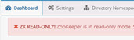

# Chapter 4: ZooKeeper

The log location for ZooKeeper is: <RLI_HOME>\logs\zookeeper. 
Zookeeper.log contains internal server details regarding the operations performed by Zookeeper. The max file size is 100MB and this is configurable in <RLI_HOME>/config/logging/log4j2-zookeeper-server.json.

## Read Only Mode

In a cluster, when ZooKeeper loses contact with over half of the other ZooKeeper servers in the ensemble, it enters a read-only mode. This allows the RadiantOne service to continue to process search operations even when the ZooKeeper quorum is lost. However, the RadiantOne service denies any write operations by returning LDAP error code 53: Unwilling to Perform to the client. Also, no configuration changes can be made while ZooKeeper is in read-only mode. Administrators can log into the Control Panel during this time but will be unable to make configuration changes. If an administrator is logged into the Control Panel when ZooKeeper enters read-only mode, a warning message appears at the top and no configuration changes are allowed.

 
Figure 4.1: Warning Indicating ZooKeeper Entered Read-only Mode

To recover from ZooKeeper read-only mode, make sure ZooKeeper is restarted on more than half of the cluster nodes. Once the quorum is reestablished, the RadiantOne cluster recovers automatically.

>**Note - As an alternative to the default read-only mode, ZooKeeper can be configured for SHUTDOWN mode when the quorum is lost. In this case, the RadiantOne service on all cluster nodes shuts down. If this behavior is preferable, set "onZkWriteLossVdsServerBehavior" : "SHUTDOWN", for the /radiantone/v1/cluster/config/vds_server.conf node on the Main Control Panel -> ZooKeeper tab. For more information, see the RadiantOne Deployment and Tuning Guide.**
 
 