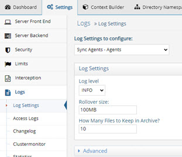
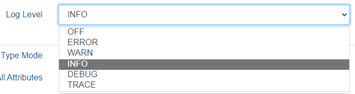

# Synchronization

The components described in this section are applicable to the RadiantOne Synchronization capability. The high-level diagram below depicts the components involved. 

If the virtual view of the source is configured in persistent cache, the default HDAP trigger method is used to detect and publish the change (detailed in 1b in the diagram). If the virtual view of the source is not configured in persistent cache, the capture connector detects changes directly on the source. In this case, the agent manages the connector (detailed in 1a in the diagram).

## Agent

The Agent manages the capture connectors. The agent log file agent_fid_sd_agent_real_time.log on the RadiantOne node where the sync agent is running. You can view and download this log file from the Server Control Panel > Log Viewer.

This log file provides details about the state of capture connectors (e.g. started). An example of the kind of message you can find in this log:

**2021-12-14T08:26:22,853 INFO  com.rli.cragents.orchestrator.client.e:80 - [SyncWorker-agent_W-RLI21-LGRADY_fid_sd_agent__real_time_PID_2472] Connector started for o_activedirectory_sync_ou_testing_o_companydirectory_pipeline_o_activedirectory**

The log level is controlled by the setting in Main Control Panel -> Settings tab -> Logs -> Log Settings. Select the Sync Agents – Agents option.

 

## Connectors

Capture connectors log activity to `<piplelineId>\connector.log` on the RadiantOne node where the sync agent is running. You can view and download this log file from the Server Control Panel > Log Viewer.
 
1.	The log level is defined per connector with the setting in Main Control Panel > Global Sync tab. 

1.	Select the topology and click Configure next to the relevant pipeline. 

1.	Click the Capture component and expand the Advanced Properties section.
	
 

1.	Locate the Log Level property and select the level from the drop-down list.
	
	
 
1.	Click **Save**.

## Sync Engine (Transformation and Apply)

The Sync Engine processes the transformations and sends the changes to the destination. These activities are logged in sync_engine.log on the RadiantOne node where the sync engine processor that is assigned for the pipeline is running. You can view and download sync_engine.log from the Server Control Panel > Log Viewer.  or you can use the Main Control Panel > Global Sync tab by selecting the topology and clicking Configure next to the pipeline. Select the Apply component and in the Log Viewer section, click Download.

An example of transformation and apply activities that you can find in this log are shown below. Important information is highlighted in red.

2021-12-14T09:38:27,954 INFO  com.rli.cragents.queue.b:331 - HDAP@[Queue o_activedirectory_sync_ou_testing_o_companydirectory_pipeline_o_activedirectory] Polled 1 new events from queue

2021-12-14T09:38:27,954 INFO  com.rli.cragents.refresh.EventsProcessor:374 - [EventsProcessor-Sync - sync pipeline - o_activedirectory_sync_ou_testing_o_companydirectory_pipeline_o_activedirectory] Starting sync session  o_activedirectory_sync_ou_testing_o_companydirectory_pipeline_o_activedirectory1639503507954 for processing batch of 1 events...

2021-12-14T09:38:27,955 INFO  com.rli.cragents.refresh.EventsProcessor:215 - [EventsProcessor-Sync  - sync pipeline - o_activedirectory_sync_ou_testing_o_companydirectory_pipeline_o_activedirectory] [SessionId=o_activedirectory_sync_ou_testing_o_companydirectory_pipeline_o_activedirectory1639503507954, SequenceId=11] Processing sync event SyncEvent:{ChangeEvent [eventType:INSERT,connectorCursor:[2302571] : [seq: 0] : [deletedCursor: 2302520],EventID:CN=Allie Baba,CN=Users,DC=seradiant,DC=dom,messageAttributes:[Attributes = accountexpires:[9223372036854775807], badpasswordtime:[0], badpwdcount:[0], cn:[Allie Baba], codepage:[0], countrycode:[0], displayname:[Allie Baba], distinguishedname:[CN=Allie Baba,CN=Users,DC=seradiant,DC=dom], dscorepropagationdata:[16010101000000.0Z], givenname:[Allie], instancetype:[4], lastlogoff:[0], lastlogon:[0], logoncount:[0], name:[Allie Baba], objectcategory:[CN=Person,CN=Schema,CN=Configuration,DC=seradiant,DC=dom], objectclass:[top, person, organizationalPerson, user], objectguid:[f1ede72292706942831dc451bdb22198], objectsid:[{base64binary}AQUAAAAAAAUVAAAA8bKdBjJRDGMRc5FC5v0DAA==], primarygroupid:[513], pwdlastset:[132839771030547655], samaccountname:[ababa], samaccounttype:[805306368], sn:[Baba], useraccountcontrol:[66048], userprincipalname:[ababa@seradiant.dom], usnchanged:[2302571], usncreated:[2302566], whenchanged:[20211214173823.0Z], whencreated:[20211214173823.0Z] ],patchOperations:[ ] ], Message sequence=11 - body=Message body=[eventId=CN=Allie Baba,CN=Users,DC=seradiant,DC=dom, creatorsName=cn=Directory Manager, connectorNameId=o_activedirectory_sync_ou_testing_o_companydirectory_pipeline_o_activedirectory, eventType=INSERT, objectclass=[top, queueMessage, ], connectorCursor=..., modifyTimestamp=20211214173827.951Z, createTimestamp=20211214173827.951Z, sequence=11, messageAttributes=..., changeMode=DEFAULT, modifiersName=cn=Directory Manager, entrydn=..., timestampms=1639503507951, ]}

2021-12-14T09:38:27,956 INFO  com.rli.cragents.refresh.h:270 - [o_activedirectory_sync_ou_testing_o_companydirectory_pipeline_o_activedirectory FidApplyChangeEvent processEntry] Processing dn:uid=ababa,ou=Testing,o=companydirectory

2021-12-14T09:38:27,956 INFO  com.rli.cragents.refresh.h:271 - [o_activedirectory_sync_ou_testing_o_companydirectory_pipeline_o_activedirectory FidApplyChangeEvent processEntry] Processing changeEvent:ChangeEvent [eventType:INSERT,changeMode:ADAPTIVE,connectorCursor:[null],EventID:uid=ababa,ou=Testing,o=companydirectory,messageAttributes:[Attributes = cn:[Allie Baba], givenName:[Allie], objectclass:[inetOrgPerson], sn:[Baba], uid:[ababa] ],patchOperations:[ ] ]

2021-12-14T09:38:27,961 INFO  com.rli.cragents.refresh.h:431 - [o_activedirectory_sync_ou_testing_o_companydirectory_pipeline_o_activedirectory FidApplyChangeEvent insertChangeEvent] Inserted ldapEntry:uid=ababa,ou=Testing,o=companydirectory

2021-12-14T09:38:27,962 INFO  com.rli.cragents.refresh.EventsProcessor:259 - [EventsProcessor-Sync - sync pipeline - o_activedirectory_sync_ou_testing_o_companydirectory_pipeline_o_activedirectory] [SessionId=o_activedirectory_sync_ou_testing_o_companydirectory_pipeline_o_activedirectory1639503507954, SequenceId=11] Done processing sync event.

2021-12-14T09:38:27,962 INFO  com.rli.cragents.refresh.EventsProcessor:329 - [EventsProcessor-Sync - sync pipeline - o_activedirectory_sync_ou_testing_o_companydirectory_pipeline_o_activedirectory] Done processing batch of 1 events in 8 ms

