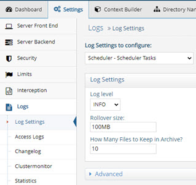
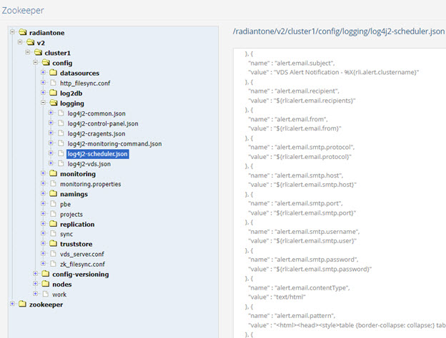

# Chapter 6: Task Scheduler and Tasks
The Task Scheduler schedules tasks. Activities that are processed as tasks are: 

-	Exporting to LDIF

-	Importing from LDIF

-	Login analysis (initiated from the virtual identity wizard)

-	Initializing a persistent cache or RadiantOne Universal Directory (HDAP) store

-	Re-indexing a persistent cache or RadiantOne Universal Directory (HDAP) store

-	Default monitoring
There are two aspects of logging described in this section: 

-	The task scheduler itself 

-	The tasks themselves

## Scheduler Server

The task scheduler logging is configured from the Main Control Panel > Settings tab > Logs > Logs Settings section. Select the Scheduler – Scheduler Server option from the Log Settings to Configure drop-down menu.

Figure 6. 1: Main Control Panel, Task Scheduler Log Settings

### Log Level

Select a log level from the drop-down list in the Log Settings section. For details on available log levels, see [Chapter 1](01-overview).

### Rollover Size

By default, the task scheduler log file rolls over once it reaches 100MB in size. Change this value if needed.

### Log Location

The task scheduler log file is server.log and is in <RLI_HOME>/<instance_name>/logs/scheduler. The default instance name is vds_server, so the path would be: <RLI_HOME>/vds_server/logs/scheduler. To change the location, expand below the Advanced section and indicate the path in the scheduler.server.log.file property.

### Log Archiving

By default, 10 files are kept in the archive. Change this value in the How Many Files to Keep in Archive setting. The archived files are named server-<number>.log and located in <RLI_HOME>/<instance_name>/logs/scheduler. The default instance name is vds_server, so the path would be: <RLI_HOME>/vds_server/logs/scheduler. To change the archive location, expand below the Advanced section (requires [Expert Mode](01-overview#expert-mode)) and indicate the path in the scheduler.server.log.file.archive property. Generally, these advanced settings should only be changed if advised by Radiant Logic.

The condition for deleting an archive is based on the total number of archives (configured in the How Many Files to Keep in Archive setting), or the age of the archive (configured in the scheduler.server.log.file.maxTime property in the Advanced section), whichever comes first.

If you want to base archive deletion on the total number of archives, configure the scheduler.server.log.file.maxTime property to 1000000d (1 million days), so that it is never triggered and indicate the maximum number of archive files to keep in the How Many Files to Keep in Archive property. If you want to base archive deletion on the age of the archive, configure the How Many Files to Keep in Archive to something like 1000000 (1 million files) so it is never triggered, and define the max age in number of days (e.g. 30d for 30 days) for the scheduler.server.log.file.maxTime property in the Advanced section (requires [Expert Mode](01-overview#expert-mode)).

Other Advanced properties (requires [Expert Mode](01-overview#expert-mode)) that can be used to further condition the archive deletion are:

-	scheduler.server.log.file.archive.scan.folder - the base folder where to find the logs to delete

-	scheduler.server.log.file.archive.scan.depth - the depth to search for log files

-	scheduler.server.log.file.archive.scan.glob -  the regex (glob style) to match to select which files to delete

## Scheduled Tasks

Logging for scheduled tasks is configured from the Main Control Panel > Settings tab > Logs > Logs Settings section. Select the Scheduler – Scheduler Tasks option from the Log Settings to Configure drop-down menu.

Figure 6.2: Main Control Panel, Scheduled Tasks Log Settings

### Log Level

Select a log level from the drop-down list in the Log Settings section. For details on available log levels, see [Chapter 1](01-overview).

### Rollover Size

By default, the task log file rolls over once it reaches 100MB in size. Change this value if needed.

### Log Location

The task log file is task.<taskID>.log and is located in <RLI_HOME>/<instance_name>/logs/scheduler. The default instance name is vds_server, so the path would be: <RLI_HOME>/vds_server/logs/scheduler. To change the location, expand below the Advanced section and indicate the path in the scheduler.task.log.file property.

### Log Archiving

By default, 10 files are kept in the archive. Change this value in the How Many Files to Keep in Archive setting. The archived files are named task.<taskID-<number>>.log and located in <RLI_HOME>/<instance_name>/logs/scheduler. The default instance name is vds_server, so the path would be: <RLI_HOME>/vds_server/logs/scheduler. To change the archive location, expand below the Advanced section (requires [Expert Mode](01-overview)) and indicate the path in the scheduler.task.log.file.archive property.

More fine-grained configuration settings related to the task scheduler and tasks can be managed from the Main Control Panel > ZooKeeper tab (requires [Expert Mode](01-overview)). Navigate to radiantone/<version>/<cluster_name>/config/logging/log4j2-scheduler.json. Click Edit Mode to modify the settings. Generally, these advanced settings should only be changed if advised by Radiant Logic.

Figure 6.3: Log4J Settings for the Task Scheduler

### Email Alert Task

Email Alert settings are configured from the Main Control Panel (associated with the leader node if deployed in a cluster) -> Settings Tab -> Monitoring section -> Email Alerts Settings. These properties are saved in Zookeeper at /radiantone/<version>/<cluster_name>>/config/monitoring.properties.

These settings can be reused in log4j logging configurations by using the following properties:

${rli:alert.email.recipients}
${rli:alert.email.from}
${rli:alert.email.protocol}
${rli:alert.email.smtp.host}
${rli:alert.email.smtp.port}
${rli:alert.email.smtp.user}
${rli:alert.email.smtp.password}
An example of using these properties in a log4j configuration is shown below for the log configuration of the scheduler.

 
Figure 6.4: Example of Leveraging Email Alert Settings in Log4J Configurations
