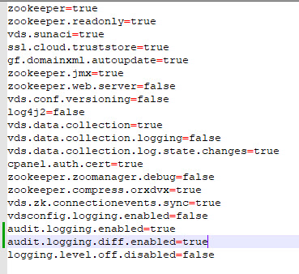

# Audit Logging

Configuration commands issued via the RadiantOne Control Panel, vdsconfig utility, and ADAP can be logged. The types of configuration commands detailed in the audit log include schema, view, and ZooKeeper configuration changes. Audit.log is located in <RLI_HOME>/vds_server/logs. This feature is supported in v7.4.5(+).

To enable audit logging:

1. In the file system, navigate to <RLI_HOME>/config/advanced. 

2. In a file editor such as Notepad, open features.properties. 

3. Set audit.logging.enabled=**true**.

4. If you want to enable logging delta changes, set audit.logging.diff.enabled=**true**.

5. If you want to enable logging for the vdsconfig utility, set vdsconfig.logging.enabled=**true**.

6. Save features.properties.

    

    Figure 1: Features.properties settings

7. Restart the Control Panel.
8. Restart the RadiantOne service.

  >[!warning] If RadiantOne is deployed in a cluster, restart the services on all nodes. 

To disable the ability to turn off audit logging:

1. In the file system, navigate to <RLI_HOME>/config/advanced.

1. In a file editor such as Notepad, open features.properties.

1. Set logging.level.off.disabled=**true**.

1. Save features.properties.

1. Restart the Control Panel.

1. Restart the RadiantOne service.

  >[!warning] If RadiantOne is deployed in a cluster, restart the services on all nodes. 

