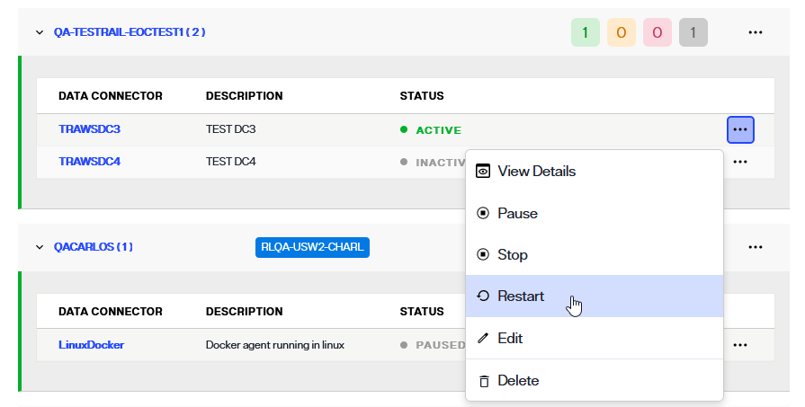
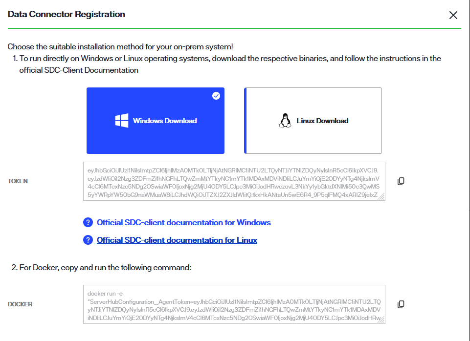

## Overview

Learn how to apply patches to an environment to update the version of RadiantOne Identity Data Management. 

Learn how to edit, enable or disable, and delete Secure Data Connectors from Environment Operations Center. 

Learn how to manage a Secure Data Connector client, including updating, troubleshooting, and reviewing client logs.

## Updating RadiantOne Identity Data Management - SaaS Deployments

### Preparing for the Patch

Prior to updating RadiantOne Identity Data Management, ensure you have a recent environment backup.

1. In Environment Operations Center, navigate to Environments > [EnviromentName] > BACKUPS tab.
1. If you do not have any recent backups, click **Backup**.
 

1. Enter a backup file name (there is a default auto-prefix) and click **SAVE**. This process takes a few minutes. Ensure the backup file shows in the list of backups before applying the RadiantOne Identity Data Management patch.

Sheduled backups can be enabled and configured by clicking the cog icon next to: Sheduled: [enabled/disabled]

### Applying the Patch

1. In Environment Operations Center, navigate to Environments > [EnviromentName] > OVERVIEW tab.
1. In the Application Details section, click **UPDATE** next to the *VERSION*.
 
1. Select the version to update to from the drop-down list and click **UPDATE**. This version must be greater than the version currently installed.
1. Click **UPDATE** again to confirm. This is a rolling update of all RadiantOne Identity Data Management nodes which can take around 10 minutes to finish. 

### Release Notes

For the list of improvements and bug fixes related to the release, see: [Release Notes](../release-notes/iddm-8-0-0)

### Known Issues 

For known issues reported after the release, please see the Radiant Logic Knowledge Base: 

https://support.radiantlogic.com/hc/en-us/categories/4412501931540-Known-Issues  

### How to Report Problems and Provide Feedback 

Feedback and problems can be reported from the Support Center/Knowledge Base accessible from: https://support.radiantlogic.com  

If you do not have a user ID and password to access the site, please contact support@radiantlogic.com. 

## Secure Data Connectors

The section describes managing data connectors and the secure data connector client.

### Managing Data Connectors

Secure data connectors can be managed from the *Secure Data Connectors* screen. From here, you can edit, enable or disable, and delete connectors. This guide outlines the steps to manage data connectors.

All of the operations to manage secure data connectors are available in the **Options** (**...**) menu for each connector. To begin managing a connector, select the **Options** (**...**) menu of the specific connector you wish to modify.

**Edit a data connector**

The name and description of a data connector can be updated. To edit connector details, select **Edit** from the associated **Options** (**...**) menu.

This enables editing of the **Data Connector** row. In the provided name and description fields, update the connector details as needed. Select :white_check_mark: to update the connector details.

The connectors list displays updated details for the updated *Secure Data Connector*.

**Enable or disable a connector**

To disable a data connector, select **Pause** from the **Options** (**...**) menu.

The connector status updates to "Paused" and all associated connections are disabled.

To reactivate a data connector, select **Start** from the **Options** (**...**) menu.

The connector status updates to "Active" and all associated connections are enabled.

**Restart a data connector**

To restart a data connector, select **Restart** from the **Options** (**...**) menu.

The connector completely stops and starts. This action is similar to starting a data connector for the first time, which does pulling all latest configurations, stops, and starts all the required processes.

**Delete a data connector**

To delete a data connector, select **Delete** from the **Options** (**...**) menu.

[!warning] Deleting a data connector is a permanent action and cannot be undone.

A confirmation dialog asks you to confirm that you would like to delete the selected data connector. Select **Delete** to proceed and delete the connector.

If you would like to keep the connector, select **Cancel** to exit out of the workflow to delete the connector.

If the connector is successfully deleted, you receive a confirmation message on the *Secure Data Connectors* home screen and the connector is no longer available in the list of connectors.

### Manage the Secure Data Connector Client

This guide outlines the steps to manage a secure data connector client, including updating, troubleshooting, and reviewing client logs.

**Update the secure data connector client**

Client updates can be applied by stopping the client or as a rolling update. The following sections outline how to apply updates to Windows, Linux, or Docker systems, as well as how to apply rolling updates to avoid an interruption in service.

*Update on Windows or Linux*

The client must be stopped before applying an update. To stop the client, select **Ctrl + C** in the terminal window running the client.

To install the update, unzip the new client version in the same directory that contains the current client. Overwrite everything except for *appsettings.Production.json*, as this is the configuration file for the client.

If the update is being installed on a Windows system, launch the *RaidantLogic.OnPremisesAgentClient.Agent.exe* file.

If the update is being installed on a Linux system, run the following command:

`dotnet run RadiantLogic.OnPremisesAgentClient.Agent.dll`

*Update on Docker*

To update a secure data connector client on Docker, stop the Docker image and then start it again with the latest tag. The client starts running again with the latest available version.

**Rolling update**

Installing a rolling update allows the client to continue running with no downtime during the update. To install a rolling update, create a new data connector in Environment Operations Center (see the [add a data connector](configure-sdc-client#adding-a-new-data-connector) guide) within the same group as the client you would like to update. 

Copy the new token from the *Data Connector Registration* dialog in the data connector details section.

Follow the steps outlined in the [deploy a secure data connector client](configure-sdc-client#deploy-the-secure-data-connector-client) guide for your system type to deploy the client as a fresh installation.

Once the new client deployment is complete, delete the old client.

#### Troubleshooting

The following sections outline common errors that can occur while deploying or running a secure data connector client, along with possible solutions to resolve the error.

##### Duplicated token

The unique token associated with a new data connector in Env Ops Center can only be used to deploy one secure data connector client. If a data connector token is used to run more than one client, you receive a duplicate agent connection error in the client terminal.

To resolve the error, return to Env Ops Center an create a new secure data connector and use the unique token to deploy the client.

For details on creating a new data connector, see the [add a data connector](configure-sdc-client.md) guide. For details on deploying a secure data connector client, see the [deploy a secure data connector client](deploy-sdc-client.md) guide.

##### Test connection error

The following control panel error may indicate that the secure data connector client has stopped running: "Connection failed: An error has occurred, please contact your administrator".

If you receive the above connection failure error, return to the secure data connector client and verify that it is running.

##### Test connection failure on Docker client

A test connection may fail for the localhost hostname for a secure data connector client deployed on a Docker container. The following error may indicate that a test connection failure has occurred: "Connection failed: Protocol or communication error".

![image description] (insert error image)

To resolve the connection failure, enter the special DNS name `host.docker.internal` in the **Host Name** field. This resolves the internal IP address used by the host, allowing the Docker container running the client to access the host server backend.

![image description] (insert control panel image)

##### Inoperative test connection

If the test connection is not working but you are unsure of the error, first review the secure data connector status in Env Ops Center.

First, save the backend data source, then log in to Env Ops Center and navigate to details section of one of the *Secure Data Connectors* belonging to the group used for connection. If the Data source status is "Disconnected", the connection has not been correctly setup. Review the associated server name/IP and Server Port of this data source to make sure the data connector can connect to this server.

If the data source connector status is "Connected", then the inlets tunnel is working and data connector is able to connect to this data source.

#### Review client logs

The following sections outline where to locate the data connector client logs on a Windows, Linux, or Docker system.

##### Review logs on Windows or Linux

If the secure data connector client is running on a Windows or Linux system, navigate to the unzipped directory. The client logs are located in the "/Logs" file in the directory.

##### Review logs on a Docker container

If the secure data connector client is running on a Docker container, open a terminal and connect to the docker container using the following command:

`docker exec -it <container_name> bash`

Navigate to the logs folder:

`cd Logs`

List the log files:

`ls`

From here, you can open the logs files to access further details on the client activity.
