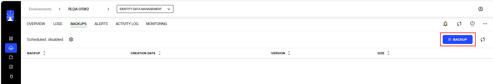
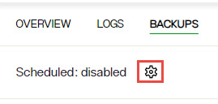

## Overview

For SaaS deployments, use the Environment Operations Center to restart the RadiantOne service, delete environments and the applications running in them, and perform backups.

## Restarting the RadiantOne Service

For SaaS deployments, restarting the RadiantOne Identity Data Management service is performed in the Environment Operations Center. In the EOC navigation pane, select Environments. On the Environments page, select an environment and an application. On the application page, click the Power button. For more details, see: [Starting Environments](/../../eoc/latest/environments/applications/stop-and-restart-application.md).

## Deleting Environments

By deleting an environment, you are also deleting application(s) that are installed in the environment. For SaaS deployments, you can delete an environment in the Environment Operations Center. From the Environments home screen, locate the environment you would like to delete from the list of environments. Go the specific environment and on the right top corner, select the ellipsis (...), to expand the options available and select DELETE from the list. For more details, see: [Delete an Environment](/../../eoc/latest/environments/environment-overview/delete-an-environment)

For self-managed deployments, you can delete the deployed Identity Data Managed application by following [these steps](../../installation/self-managed/#deleting-identity-data-management). For self-managed Identity Analytics deployment deletion, follow [these steps](https://developer.radiantlogic.com/ia/descartes/igrc-platform/self-managed/#deleting-identity-analytics-chart). 

## Performing Backups

Environment backups are performed in the Environment Operations Center. In the EOC navigation pane, select Environments and choose the environment. Click the BACKUPS tab.

For more details, see: [Backups](/../../eoc/latest/environments/backup-and-restore/create-backup)

### Manual

Manually trigger an environment backup from Environment Operations Center.

1. In Environment Operations Center, navigate to Environments > [EnviromentName] > BACKUPS tab.
1. Click **Backup**.
  

1. Enter a backup file name (there is a default auto-prefix) and click **SAVE**. This process takes a few minutes.

### Scheduled

Schedule backups from Environment Operations Center.

1. In Environment Operations Center, navigate to Environments > [EnviromentName] > BACKUPS tab.
1. Scheduled backups can be enabled and configured by clicking the cog icon next to: Sheduled: [enabled/disabled]
 

1. Toggle the *Automatic Backup* option on.
1. Configure the Data Retention Policy and backup schedule.
1. Click **SAVE**.
