## Overview

Monitoring is one of the most important aspects of maintaining the health of RadiantOne. It is highly recommended that you monitor the RadiantOne service on a regular basis. The RadiantOne service can be monitored from Environment Operations Center (for SaaS deployments only), and the Classic and Server Control Panels (for SaaS and Self-managed deployments), in addition to using third party tools.

### Switching to Classic Control Panel

To switch to Classic Control Panel, use the menu options for the logged in user in the upper right.

Once logged into the Classic Control Panel, click  in the upper right to access the Server Control Panel.

## Monitoring in Environment Operations Center

>[!warn] - Only SaaS deployments have access to Environment Operations Center. Self-managed deployments of RadiantOne do not.

In Environment Operations Center, navigate to the Monitoring section.
1. Select the Environment to monitor from the **ENVIRONMENT** drop-down list.
2. Select the Application to monitor from the **APPLICATION** drop-down list.
3. Select the Dashboard to display from the **DASHBOARD** drop-down list.
4. Select the RadiantOne node to monitor from the **NODE** drop-down list. If none are selected, the monitored stats for all nodes are shown.
5. Select a time range from the **TIME RANGE** drop-down list.

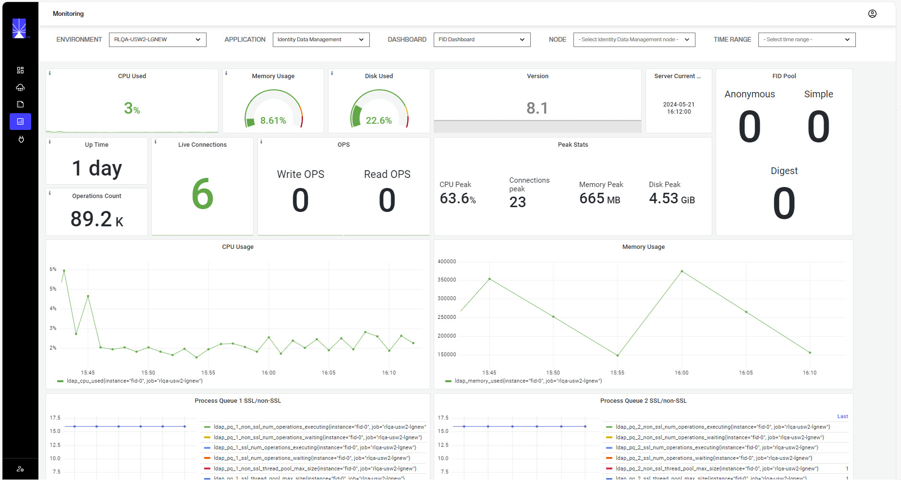

## Monitoring in Classic Control Panel

The key services to monitor are RadiantOne and ZooKeeper. There are default alerts configured for these services as well. 

### Expert Mode

Some settings in the Classic Control Panel are accessible only in Expert Mode. To switch to Expert Mode, click the Logged in as, (username) drop-down menu and select Expert Mode.

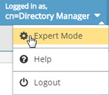

### Dashboard Tab

On the Dashboard Tab of the Classic Control Panel, the Overview section displays information about each RadiantOne cluster node. From here, you can see the status of all nodes. The cluster’s RadiantOne leader node is noted with a yellow-colored triangle beside the server name.

For each node, the Overview section displays the status of:

- Current CPU usage of the machine hosting RadiantOne.
- Current RadiantOne service memory usage.
- Current disk usage of the drive on the machine hosting RadiantOne.
- Disk latency
- Up time – how long the RadiantOne service has been running on the node.
- Version of RadiantOne installed on the node

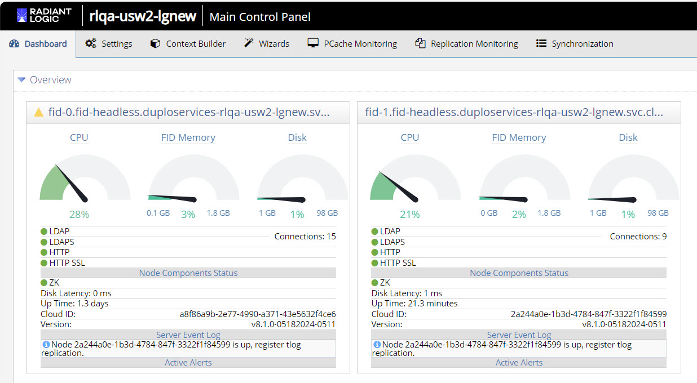

### Replication Monitoring Tab

RadiantOne Directory stores across multiple sites/environments support multi-master replication. This type of replication is referred to as inter-cluster replication. The state of inter-cluster replication can be monitored from the Replication Monitoring Tab.

The Replication Monitoring tab is relevant if inter-cluster replication is deployed.

**Central Journal Replication**

The default, recommended replication model for RadiantOne Directory stores is based on a publish-and-subscribe methodology. When writes occur on a site, the leader node publishes the changes into a central journal. The leader nodes on all other sites pick up the changes from the central journal and update their local stores. These changes are then automatically replicated out to follower/follower-only nodes within the cluster. 

If inter-cluster replication is enabled, the clusters that are participating in replication can be viewed in the Central Journal Replication section. The topology depicts the connectivity between the clusters and the cluster housing the replication journal. If a red line is visible, this indicates a connection problem between a cluster and the replication journal.

An example is shown below.

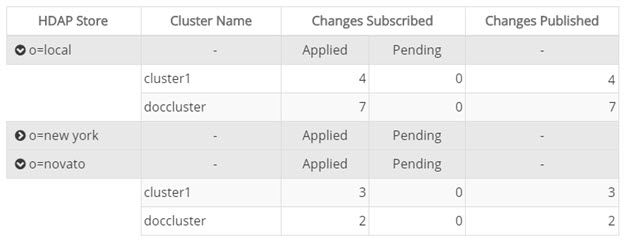

|Column Name | Definition |
|------------|------------|
| HDAP Store | The root naming context that stores the entries to be replicated across all clusters. |
| Cluster Name | The cluster name, as defined during the RadiantOne installation. | 
| Changes Subscribed (Applied) | The number of changes replicated to this cluster. | 
| Changes Subscribed (Pending) | The number of changes waiting to be replicated to this cluster. | 
| Changes Published | This value is a total of the number of applied and pending changes. | 

More than one store per cluster can be participating in inter-cluster replication. The table shown in the Central Journal Replication section details for each store the clusters involved in replication. Then, for each cluster, the table shows:

- The number of changes subscribed to, are broken down into changes that have been applied and changes that are pending.
- The number of changes published into the replication journal.

**Push Mode Replication**

To address a very small subset of use cases, namely where a global load balancer directs client traffic across data centers/sites, where the inter-cluster replication architecture might be too slow, you have the option to enable an additional, more real-time replication mode where changes can be pushed directly to intended targets. For example, an update made by a client to one data center might not be replicated to other data centers in time for the client to immediately read the change, if the read request it sent to a different data center than the update was. This is generally not an ideal load distribution policy when working with distributed systems. Load balancing is best deployed across multiple nodes within the same cluster on the same site/data center.

In any event, to address scenarios like this, a push replication mode can be used to send the changes directly to the intended targets. The targets must be other RadiantOne servers defined as LDAP data sources. 

If push mode replication is enabled, the clusters that are participating in replication can be viewed in the table in the Push Mode Replication section. The table lists, for each store, the clusters involved in replication. The source cluster, target cluster and connectivity status between them is shown.

### Synchronization Tab

From the Classic Control Panel > Synchronization tab, you can select a topology and monitor the activities of the capture, transform and apply processes associated with each pipeline.

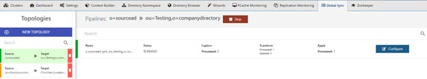

All topologies are listed on the left. Select a topology to view the sync pipelines. For each running pipeline, a list of entries processed by the Capture, Transform and Apply components are shown. For the Transform component, you see a number queued (messages in the queue waiting to be processed) and a number processed (entries transformed).

From the Synchronization tab, you can stop the synchronization flows with **Stop**. Clicking stop, pauses the synchronization for all pipelines associated with the topology. Click **Start** to start synchronization for all pipelines. To resume synchronization for a specific pipeline, click CONFIGURE next to the apply, select the Apply component and click Start.

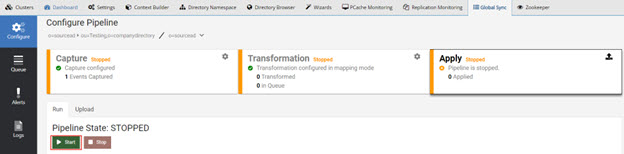

Click **Configure** next to a pipeline to access the queue monitoring, alert settings, and logs associated with the synchronization. In the Queue section, you can view the number of messages processed, the current queue size, and some processing statistics (rate per sec and peak processing times). You can also manage messages that failed to be applied by either deleting them or manually resending them.

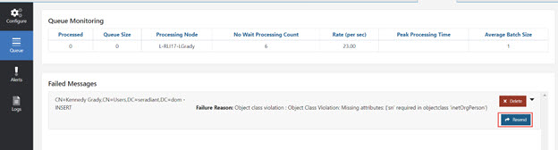

### Persistent Caceh Refresh (PCache Monitoring tab)

From the Classic Control Panel > PCache Monitoring tab, you can select a real-time persistent cache refresh configuration and monitor the activities of the capture and apply processes.

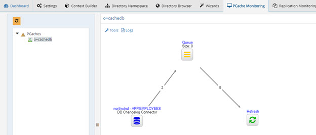

## Monitoring from the Server Control Panel

The items that can be monitored from the Server Control Panel are described in this section.

Click the "Server Control Panel" link at the top of the Classic Control Panel to launch the Server Control Panel.

### CPU, Memory, Disk Space, Disk Latency and Connection Usage

From the Server Control Panel > Dashboard Tab, you can monitor the CPU, disk space and latency on the machine hosting RadiantOne, and the RadiantOne service memory and connections.

>[!warning] 
>To use this feature, enable the cluster monitor at Classic Control Panel > Settings > Logs > Clustermonitor.

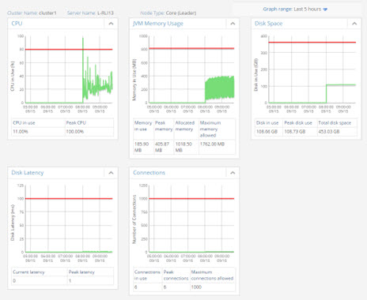

## Alerts

Alerts, both standard and custom, can be configured from the Classic Control Panel > Settings tab > Monitoring.

To manage standard alerts for memory, connections, disk space or disk latency:

1. In the Classic Control Panel go to Settings > Monitoring > Standard Alerts sub-section.
1. Define the memory threshold in the Memory section.
1. Define the connection threshold in the Connections section.
1. Define the disk space and disk latency thresholds in the Disk Alerts section.
 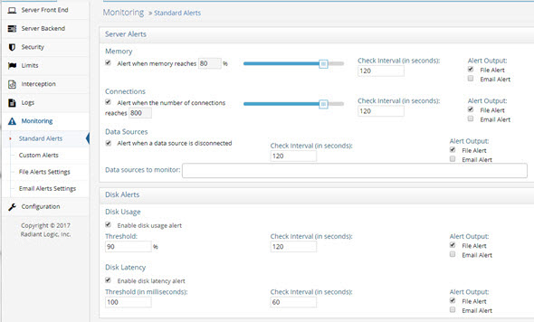

1. File alerts are enabled by default. If SMTP settings are configured in the Monitoring > Email Alert Settings section you can also use the Email Alert output.
1. Click **Save**.

### RadiantOne Directory Status

Store status (including number of entries, index size, revision, and search and write operations) can be monitored from the Server Control Panel > Usage & Activity tab > Universal Directory Status section.

To filter the stores displayed, click on gear icon and then click Select Filters. Select the stores to display and click OK. Click OK to exit the settings.

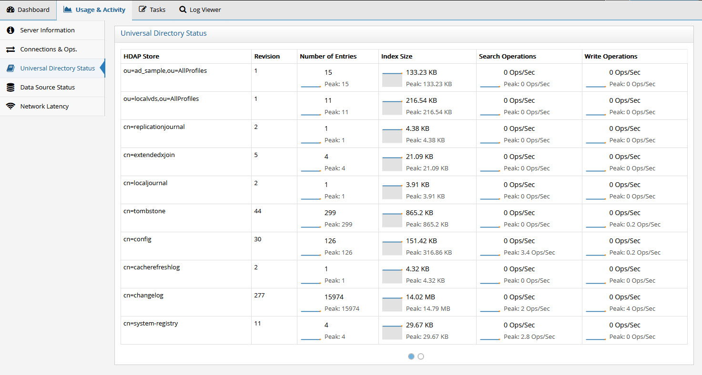

Figure 1.8 : Monitoring RadiantOne Universal Directory Stores from the Server Control Panel

### Configuring RadiantOne Directory Alerts

Alerts can be configured for RadiantOne Directory stores. To configure store alerts

1. In the Main Control Panel go to Settings Tab > Monitoring section > Custom Alerts sub-section (requires [Expert Mode](#expert-mode)).
2. Click Add.
3. From the Template drop-down menu, select **Custom**.
4. From the Monitoring Source drop-down menu, select hdap-store. The page refreshes and displays the store information in the table at the bottom.
5. Configure other parameters as required.
6. Click **Save**.

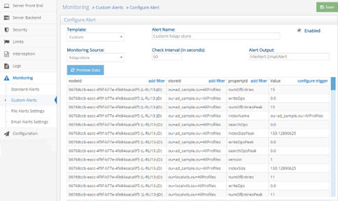

Figure 1.9 : Configuring a RadiantOne Directory Store Alert from the Main Control Panel

### Data Source Status

The status of the RadiantOne service (data sources named vds and vdsha) and any backend can be monitored from the Server Control Panel > Usage & Activity Tab > Data Source Status section.

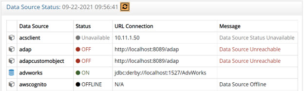

Figure 1.10 : Monitoring Data Sources from the Server Control Panel

The status values are on, off, offline, and unavailable. The following table describes each status.

| Status | Description | 
|--------|---------------------------|
| On | RadiantOne can connect to the data source. | 
| Off | The connection test to the data source failed. | 
| Offline | The data source’s active property is set to false. | 
| Unavailable | No classname property is defined for the data source. | 

If a data source has failover servers configured, the URL in the message indicates which server the status applies to.

To configure alerts for data source availability:

1. In the Main Control Panel go to Settings Tab > Monitoring section > Standard Alerts sub-section.
2. In the Data Sources section, there is the option to enable/disable alerts when a data source is disconnected (unreachable).

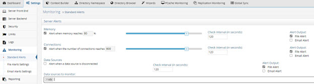

Figure 1.11 : Configuring a Data Source Alert from the Main Control Panel

3. Define the interval to check the data source availability. The default is 120 seconds.
4. File alerts are enabled by default. If SMTP settings are configured in the Monitoring > Email Alert Settings section you can also use the Email Alert output.
5. Click the field next to “Data sources to monitor:” and select a data source from the drop-down menu. The vds data source is selected by default and is used to monitor the RadiantOne service and alert when the service is stopped or started.

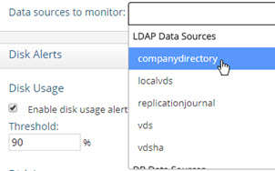

Figure 1.12: Selecting a Data Source to Monitor

6. Verify that the data source name is displayed in the “Data sources to monitor” field.
7. Click Save.

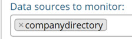

Figure 1.13: Example of a Data Source to Monitor

>[!note] 
>To disable alerts for a data source, click the X next to the data source name in the Data Source to monitor field, which removes it from the list.

### Network Latency

If deployed in a cluster, the latency between RadiantOne nodes can be monitored from the
Server Control Panel -> Usage & Activity tab -> Network Latency section.

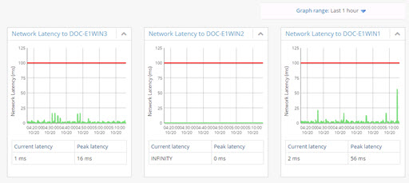

Figure 1. 14 : Monitoring Network Latency Between RadiantOne Nodes

### Control Panels - Delegated Administration Activity

Any user that can bind to RadiantOne can potentially administrator the server (if they belong to
the proper group). A user can belong to multiple groups. The following administration groups are
defined for RadiantOne:

- Directory Administrator Role
- Read Only Role
- Namespace Administrator Role
- Operator Role
- Schema Administrator Role
- ACI Administrator Role
- ICS Administrator Role
- ICS Operator Role

For details on the operations allowed for each user, please see the RadiantOne System Administration Guide.

When any user that is a member of one of the above delegated administration groups saves changes in the Main or Server Control Panel, this activity is logged into: web_access.log. This is a CSV formatted log file with the delimiter being `<TAB>`. To configure the log output for the Control Panel, navigate to the Main
Control Panel > Settings tab > Logs > Log Settings section. You can view and download web_access.log from Server Control Panel > Log Viewer.

Select Control Panel – Access from the Log Settings to Configure drop-down list. Define the log level, rollover size and number of files to keep archived.

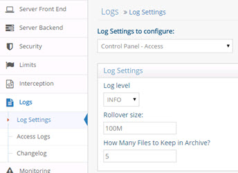

Figure 1.42: Main Control Panel Access Log Settings

### RadiantOne Logs and Error Messages to Monitor

The most important logs to monitor for RadiantOne are vds_server.log and vds_server_access.log. The log files can be viewed and downloaded from Server Control Panel > Log Viewer: You can monitor these logs for the following errors.

vds_server_access.log

- SearchResult {resultCode=53
- VDS_Server is shutting-down [Connection to ZooKeeper lost.]
- !!! Server Busy -- Maxmium TCP/IP connection limit(1000) reached

<RLI_HOME>/vds_server/logs/vds_server.log

The following errors indicate the server is shutting down or unable to accept more connections.

- Server is shutting down: VDS stop command invoked.
- Error in accepting an incoming connection: java.io.IOException: Too many open files

The following errors can indicate users are connecting to the server and attempting to perform
operations they are not authorized to.

- ??? Error in binding: Failed in passing security check point: IP address where the
ROOT_USER connected from is not listed.
- SearchResult {resultCode=50

The following errors indicate memory problems.

- java.lang.OutOfMemoryError: unable to create new native thread
- java.lang.OutOfMemoryError: GC overhead limit exceeded
- Root exception is java.net.SocketException: Too many open files

The following error indicates problems with ZooKeeper.

- Server is shutting down: VDS has been configured to stop if the connection to ZK is
not writable any more.
- VDS_Server is shutting-down [Connection to ZooKeeper lost.]
- ConnectionStateListener: ZK connection is not writable any more.
- ZooKeeper session has been lost. [vds_server]

### Periodic Persistent Cache Refresh Threshold Failures

To monitor periodic persistent cache refresh failures due to thresholds being reached, monitor
the periodiccache.log for keywords: “Threshold reached”. 

The periodiccache.log file can be viewed and downloaded from Server Control Panel > Log Viewer.

For example, assume a 50% Add Threshold has been configured and during the next refresh cycle, there are 85% more entries in the backend than there are in the persistent cache image.
This persistent cache refresh is aborted, and the following message can be found in the
periodiccache.log.

2021 - 04 - 20T11:44:59,487 ERROR - [Storage Periodic Refresh - o=sql] Refresh failed:
java.lang.Exception: Threshold reached with 85% difference for adds.

In the example above, a periodic persistent cache refresh is configured on the o=sql naming context.

### ZooKeeper Logs and Error Messages to Monitor

The most important log to monitor for ZooKeeper is zookeeper.log. This log file can be viewed and downloaded from Server Control Panel > Log Viewer. The following are critical error messages to monitor in this log:

- ERROR [ConnectionStateManager-0:ZooManager@?] - Connection lost. (local zookeeper node no longer able to contact peers in ensemble)
- Non-optimial configuration, consider an odd number of servers.
- Could not add appenderMBean for [null]
- Unexpected exception causing shutdown while sock still open

<!--

### RadiantOne Activity – Check/Parse Access Log (CSV Format) Output

By default, CSV logging is enabled in the Main Control Panel > Settings tab > Log > Access Logs settings. On the right, check the CSV option in Output format and click Save.

Figure 1.52: Enabling CSV Log

For details on the columns in the CSV file, please see the RadiantOne Logging and Troubleshooting Guide.

### RadiantOne Activity – Read Changes from a Database Table

The RadiantOne service logs all access to data in the vds_server_access.log by default as long as the server log level is set to a minimum of ACCESS. This includes who accessed the data, when (day and time) and what operations they performed. <!--This information can also be logged into a database which allows for third-party reporting tools to easily create meaningful charts and graphs for compliance analysis. Logging to a database requires the [CSV log format output](#radiantone-activity--checkparse-access-log-csv-format-output) enabled and running the Log2DB utility.

The database that houses the table which contains the log contents can be in any database server you choose. These settings are located on the Main Control Panel > Settings Tab > Reporting section > Log2DB Settings sub-section. The database associated with the “Database
Datasource” configured here must be running and accessible. To check which database this
data source points to, navigate to the Main Control Panel -> Settings Tab -> Server Backend > DB Data Sources.

>[!note] 
>The default settings leverage a Derby database that is included with RadiantOne and can be started with <RLI_HOME>/bin/DerbyServer.exe.

Once RadiantOne is configured to log to CSV and the database hosting the log contents is running, launch the Log2DB utility which is in charge of reading the CSV contents and writing into your database table (table name configured in the Log2db Settings).

>[!warning] If RadiantOne is deployed in a cluster, the Log2DB utility must be running on each node.

Details about configuring and starting the Log2DB utility and the database columns (describing the log contents) can be found in the Logging and Troubleshooting Guide.

### Check/Parse Alert File (CSV Format) Output or Emails Generated from Alerts enabled in Main Control Panel 

Output options and configuration are described in [Alerts](/alerts-settings/#alerts).

## Monitoring in EOC

For information on monitoring in the EOC, refer to the [EOC Monitoring Guide](/../../eoc/latest/monitoring/monitoring-overview).
