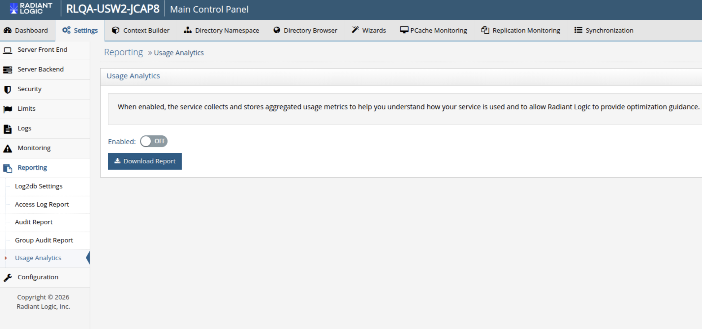

## Usage Analytics

When enabled, the usage analytics service collects and stores aggregated usage metrics to help you understand how your Identity Data Management service is used and allows Radiant Logic to provide optimization guidance.
Metrics do not include sensitive payload data.

### Enabling Usage Analytics

Follow these steps to enable the service:

1. In the Main Control Panel, navigate to Settings > Reporting > Usage Analytics.

2. Switch the “Enabled” toggle to ON anc click Save.

### Downloading Usage Analytics Report

To export the Usage Analytics report, click the Download button. The report will be downloaded to your device as a ZIP file.
