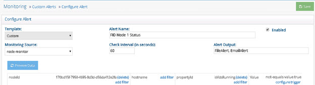
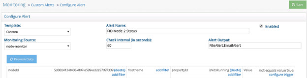
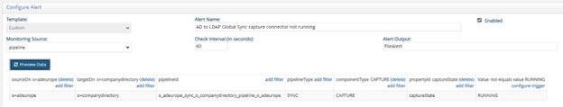
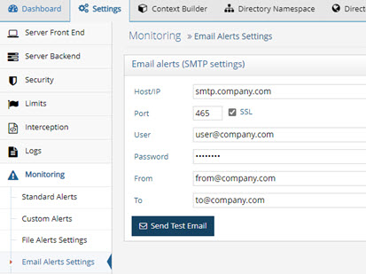
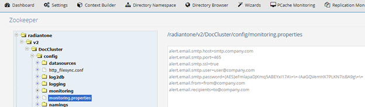
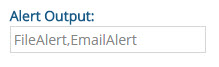
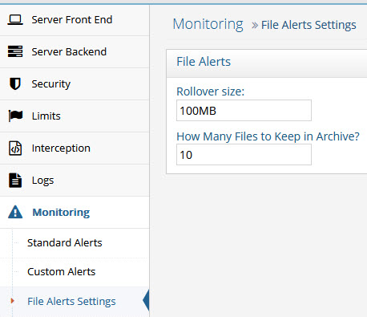
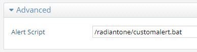

## Alerts Overview

Alerts associated with activities monitored from the Control Panels are configured from the Main Control Panel > Settings tab > Monitoring section and are tied to the Task Scheduler which must be running. The status of the Task Scheduler can be seen on the Tasks tab in the Server Control Panel associated with the current leader node.

>[!warning] For alerts that leverage data collectors, it is important to note that some properties within data collectors require the RadiantOne service to be running to get status information. If you have configured custom alerts that use properties in a data collector that require the RadiantOne service to be running, andthe service stops, no alerts are sent. Be mindful of this when using data collectors in custom alerts.

RadiantOne offers standard alerts and custom alerts. Standard alerts cover the recommended
minimum monitoring for the RadiantOne components and are pre-configured by default. Custom
alerts allow you to define monitoring rules for all aspects of RadiantOne not addressed by a
standard alert. Custom alerts are highly specialized and require services from Radiant Logic to setup. Please contact support@radiantlogic.com for details.

## Standard Alerts

For standard alerts, the default alert output is a file, but you can easily add email alerts to the configuration. When these alerts are activated, they are also displayed on the Main Control Panel’s Dashboard tab.

This section describes the aspects addressed by standard alerts.

### RadiantOne Service Memory Usage

A [file alert](#file-alert-settings), when the RadiantOne service’s memory usage reaches 90%, is enabled by default.
These settings can be changed from the Main Control Panel > Settings tab > Monitoring section > Standard Alerts. To change the memory threshold, slide the bar in the Memory section to the needed amount. Define the interval to check the memory (default is 120 seconds).
The default alert output is File Alert, but if SMTP settings are configured in the Monitoring > Email Alert Settings section you can also use the Email Alert output. Click the Save button when you are finished making changes.

### Connections to RadiantOne

A [file alert](#file-alert-settings), when the number of connections to RadiantOne reaches 800 is enabled by default.
These settings can be changed from the Main Control Panel -> Settings tab -> Monitoring
section -> Standard Alerts. To change the connection threshold, slide the bar in the
Connections section to the needed amount. Define the interval to check the connections (default
is 120 seconds). The default alert output is File Alert, but if SMTP settings are configured in the
Monitoring -> Email Alert Settings section you can also use the Email Alert output. Click the
Save button when you are finished making changes.

### Data Source Availability

An alert can be triggered when the availability of a backend data source changes. If the data
source has failover servers configured, the alert would only be triggered if all servers were
unavailable (alert would be in a triggered state), or in a scenario where all servers were
unavailable and then one or more of the servers comes back online (an alert would be issued
indicating the availability is back to normal). The setting can be changed from the Main Control
Panel > Settings tab > Monitoring section > Standard Alerts. Define the interval to check the data source availability (default is 120 seconds). The default alert output is File Alert, but if SMTP settings are configured in the Monitoring -> Email Alert Settings section you can also use the Email Alert output. To enable alerts for data source availability, check the “Alert when a data source is disconnected” option and select the Data Sources to Monitor from the drop-down list. Click Save  when you are finished.


### Disk Usage

A file alert, when the disk usage on the RadiantOne machine reaches 90% of max capacity, is
enabled by default. These settings can be changed from the Main Control Panel > Settings tab > Monitoring section > Standard Alerts. To change the disk usage, enter a threshold. Define the interval to check the data usage (default is 120 seconds). The default alert output is File Alert, but if SMTP settings are configured in the Monitoring > Email Alert Settings section you can also use the Email Alert output. Click the Save button when you are finished.

>[!warning] Closely monitoring disk space usage is extremely critical. If disk space is full, the RadiantOne service shuts down automatically.

### Disk Latency

A file alert, when the disk latency on the RadiantOne machine reaches 100ms, is enabled by default. These settings can be changed from the Main Control Panel > Settings tab > Monitoring section > Standard Alerts. To change the disk latency, enter a threshold (in milliseconds). Define the interval to check the disk latency (default is 120 seconds). The default alert output is File Alert, but if SMTP settings are configured in the Monitoring -> Email Alert Settings section you can also check the Email Alert output. Click the Save button when you are finished making changes.

### Processing Load on RadiantOne

Alerts based on RadiantOne processing load are pre-configured, but not enabled by default. If you would like to receive an alert when the RadiantOne processing queues reach a certain threshold, from the Main Control Panel > Settings tab > Monitoring section > Standard Alerts, slide the bars for processing queues and internal queues to the threshold amount. Check the “Enable processing queues alerts” option. Click Save when you are finished.

## Custom Alerts

Custom alerts allow you to define monitoring rules for all aspects of RadiantOne not addressed by a standard alert. The RadiantOne aspects that can be used in custom alerts are described in [data collectors](monitoring-and-reporting-guide/data-collectors). Custom alerts are highly specialized and generally require services from Radiant Logic to setup. Please contact support@radiantlogic.com for details. When these alerts are activated, they are also displayed on the Main Control Panel’s Dashboard tab.

All custom alerts defined appear on the Main Control Panel > Settings tab > Monitoring section > Custom Alerts section.

The “Enabled” column/status indicates if the alert is active.

### RadiantOne Service Availability

The RadiantOne service should be monitored. A default custom alert named “VDS Running
Check” is configured to monitor the state of the service. If RadiantOne is deployed in a cluster,
the state of the service on all nodes is monitored. To view the alert, navigate to the Main Control Panel > Settings Tab > Monitoring > Custom Alerts (requires [Expert Mode](#expert-mode)). Select the “VDS
Running Check” alert and click Edit.

This custom alert leverages the isVdsRunning property of the [node-monitor](monitoring-and-reporting-guide/data-collectors/#node-monitor) data collector to
trigger a [file alert](#file-alert-settings) if the RadiantOne service is not equal to true. If the value of the isVdsRunning
property is false or N/A, an alert is triggered.


Figure 1.15 : Default Alert for the RadiantOne Service Availability

If you have RadiantOne deployed in a cluster, you can monitor each service independently to
have more granularity of alerts. For example, if one service stops in a cluster, the default “VDS Running Check” alert will be triggered. If another RadiantOne service in the cluster stops, no new alert is sent since the status is currently in a triggered state. Only when the RadiantOne service on all nodes is running again is a new alert sent to indicate the status of the services is back to normal. To be alerted about each RadiantOne service status change independently, configure custom alerts for each node. To do this, create a custom alert for each node, conditioning the alert by nodeId and/or hostname. The examples shown in the following screens describe a three-node cluster. The node IDs are used in the filters conditioning each custom alert.

Three custom alerts (shown below) can be used to monitor the RadiantOne service status on
each cluster node. The isVdsRunning property name is case sensitive.



Figure 1. 16 : Custom Alert for RadiantOne Node 1



Figure 1. 17 : Custom Alert for RadiantOne Node 2


Figure 1.18 : Custom Alert for RadiantOne Node 3

```
If all RadiantOne services are stopped, the alerts.log would contain something like the following, related to the three custom alerts described above:

2018 - 10 - 11 14:55:47 Alert FID Node 1 Status TRIGGERED

+--------------------------------------+------------+--------------+-------+
| nodeId | hostname | propertyId | value |
+--------------------------------------+------------+--------------+-------+
| 170bd15f- 7950 - 4695 - 8d3d-d56da412e2fa | DOC-E1WIN1 | isVdsRunning | false |
+--------------------------------------+------------+--------------+-------+
Instance: vds_server
Alert ID: ac726962-e75d- 4737 - 895a-79aeb887abbd
2018 - 10 - 11 14:55:53 Alert FID Node 2 Status TRIGGERED
+--------------------------------------+------------+--------------+-------+
| nodeId | hostname | propertyId | value |
+--------------------------------------+------------+--------------+-------+
| 5d882413- 0480 - 4f07-a599-ad2a57097339 | DOC-E1WIN2 | isVdsRunning | false |
+--------------------------------------+------------+--------------+-------+

Instance: vds_server
Alert ID: 5824631f-7b02-423e-be0b-0e5dabc7ca1e
2018 - 10 - 11 14:55:55 Alert FID Node 3 Status TRIGGERED
+--------------------------------------+------------+--------------+-------+
| nodeId | hostname | propertyId | value |
+--------------------------------------+------------+--------------+-------+
| 4d01d785-aa87-43f5-96d0-d16a7fd35d08 | DOC-E1WIN3 | isVdsRunning | false |
+--------------------------------------+------------+--------------+-------+
Instance: vds_server
Alert ID: 15abdac2- 7040 - 4792 - 99cf-3d81369507e3
```

The default “VDS Running Check” alert would return the following in the alerts log under the same condition of all services were down:

`
2018 - 10 - 11 14:55:20 Alert VDS Running Check TRIGGERED
+--------------------------------------+------------+--------------+-------+
| nodeId | hostname | propertyId | value |
+--------------------------------------+------------+--------------+-------+
| 170bd15f- 7950 - 4695 - 8d3d-d56da412e2fa | DOC-E1WIN1 | isVdsRunning | false |
| 4d01d785-aa87-43f5-96d0-d16a7fd35d08 | DOC-E1WIN3 | isVdsRunning | false |
| 5d882413- 0480 - 4f07-a599-ad2a57097339 | DOC-E1WIN2 | isVdsRunning | false |
+--------------------------------------+------------+--------------+-------+
Instance: vds_server
Alert ID: default_vds_running`

If one of the RadiantOne services is restarted, an alert related to the corresponding custom alert
is issued. An example of the alerts.log is shown below.

`2018 - 10 - 11 15:00:44 Alert FID Node 1 Status BACK TO NORMAL
+--------------------------------------+------------+--------------+-------+
| nodeId | hostname | propertyId | value |
+--------------------------------------+------------+--------------+-------+
| 170bd15f- 7950 - 4695 - 8d3d-d56da412e2fa | DOC-E1WIN1 | isVdsRunning | true |
+--------------------------------------+------------+--------------+-------+
Instance: vds_server
Alert ID: ac726962-e75d- 4737 - 895a-79aeb887abbd`

Whereas the default “VDS Running Check” alert would not send a new alert in this condition because based on the status of all conditions in the alert configuration, it is still considered “triggered” and the state hasn’t changed.

### Persistent Cache Periodic Refresh Failure

To send an alert in the event of a persistent cache periodic refresh failure, configure a custom
alert.

1. Navigate to the Main Control Panel (of the current leader node if you have a cluster deployment) > Settings tab > Monitoring > Custom Alerts (requires [Expert Mode](#expert-mode)).
2. Select Custom from the Template drop-down menu.
3. Select event-log from the Monitoring Source drop-down menu.
4. Click Add Filter in the Event Type column, enter PCACHE for the value and click Add.
5. Click Add Filter in the namingDn column. Enter the cached naming context that you want to monitor periodic refreshes for and click Add.
6. Click Configure Trigger in the Value column.
7. Select “equals” from the Trigger Type drop-down list and enter a value of WARN.


Figure 1. 19 : Configure Trigger for Custom Alert

8. Click OK.
9. If you want to only be alerted if the validation threshold has been exceeded, you can configure a Trigger with parameters above -1 like shown below instead of using (equals value WARN).

    

    Figure 1. 20 : Configure Trigger for Custom Alert based on a Validation Threshold being Exceeded

10. Click Save.

When triggered, this alert displays on the Main Control Panel's Dashboard tab under Active Alerts as "ALERT: <alert_name>” and triggers a [file alert](#file-alert-settings). If SMTP settings are configured, [email alerts](#email-alert-settings) can be triggered as well by adding EmailAlert to the Alert Output setting (click save if you
modify the alert output).

### ZooKeeper Write Failure

The ZooKeeper Write Check alert is enabled by default. This custom alert can be configured
from the Main Control Panel (of the current leader node if you have a cluster deployment) > Settings Tab > Monitoring > Custom Alerts (requires [Expert Mode](#expert-mode)). Select the ZooKeeper Write Check alert and click Edit.

This custom alert triggers a [file alert](#file-alert-settings) if clients cannot write to ZooKeeper. If SMTP settings are configured, [email alerts](#email-alert-settings) can be triggered as well by adding EmailAlert to the Alert Output setting (click Save if you modify the alert output).

### Global Synchronization Capture Connector Stopped

To send an alert in the event of a global synchronization capture connector state change (e.g. a connector state changes from RUNNING to STOPPED), configure a custom alert.

1. Navigate to the Main Control Panel (of the current leader node if you have a cluster deployment) > Settings tab > Monitoring > Custom Alerts (requires [Expert Mode](#expert-mode)).
2. Select Custom from the Template drop-down menu.
3. Select pipeline from the Monitoring Source drop-down menu.
4. Click Add Filter in the sourceDn column. Enter the naming context corresponding to the source DN in your global sync topology and click Add.
5. Click Add Filter in the targetDn column. Enter the naming context corresponding to the target DN in your global sync topology and click Add.
6. Click Add Filter in the pipelineType column. Enter SYNC for the value and click Add.
7. Click Add Filter in the componentType column. Enter CAPTURE and click Add.
8. Click Add Filter in the propertyId column. Enter captureState and click Add.
9. Click Configure Trigger in the Value column.
10. Select “not-equals” from the Trigger Type drop-down list and enter a value of RUNNING. This means that if the capture connector state is not equal to RUNNING, an alert gets triggered.
11. Enter an Alert Name.
12. Click Save.



Figure 1. 21 : Custom Alert on Capture Connector

When triggered, this alert displays on the Main Control Panel's Dashboard tab under  Active Alerts as "ALERT: <alert_name>” and triggers a [file alert](#file-alert-settings). If SMTP settings are configured, [email alerts](#email-alert-settings) can be triggered as well by adding EmailAlert to the Alert Output setting (click save if you modify alert output).

### Global Synchronization Queue Size

To send an alert in the event of a global synchronization queue growing, configure a custom
alert.

1. Navigate to the Main Control Panel (of the current leader node if you have a cluster deployment) > Settings tab > Monitoring > Custom Alerts (requires [Expert Mode](#expert-mode)).
2. Select Custom from the Template drop-down menu.
3. Select pipeline from the Monitoring Source drop-down menu.
4. Click Add Filter in the sourceDn column. Enter the naming context corresponding to the source DN in your global sync topology and click Add.
5. Click Add Filter in the targetDn column. Enter the naming context corresponding to the target DN in your global sync topology and click Add.
6. Click Add Filter in the pipelineType column. Enter SYNC for the value and click Add.
7. Click Add Filter in the propertyId column. Enter processorQueueSize and click Add.
8. Click Configure Trigger in the Value column.
9. Select “above” from the Trigger Type drop-down list and enter a threshold number indicating the number of events in the queue that should trigger the alert. In the example below, 50 is used. This means that if this queue contains more than 50 unprocessed events, an alert is triggered.

    

    Figure 1. 22 : Configuring Alert Trigger

10. Enter an Alert Name.
11. Click Save.

    

    Figure 1. 23 : Custom Alert for Monitoring Global Sync Queue Size

12. When triggered, this alert displays on the Main Control Panel's Dashboard tab under Active Alerts as "ALERT: <alert_name>” and triggers a [file alert](#file-alert-settings). If SMTP settings are configured, [email alerts](#email-alert-settings) can be triggered as well by adding EmailAlert to the Alert Output setting (click save if you modify alert output).

### Configuration Changes

To configure alerts when configuration changes are made from the Main Control Panel > Settings tab or using the command line configuration utility (vdsconfig), configure the following
custom alert.

1. Navigate to the Main Control Panel (of the current leader node if you have a cluster deployment) > Settings tab > Monitoring > Custom Alerts (requires [Expert Mode](#expert-mode)).
2. Click Add.
3. Select Custom from the Template drop-down menu.
4. Select config-change from the Monitoring Source drop-down menu.
5. Click Configure Trigger in the Value column.
6. Select equals from the drop-down list and enter a value of true.

    

    Figure 1. 24 : Setting Trigger Parameter (equals true)

7. Click OK.
8. Click Save.
9. When triggered, this alert displays on the Main Control Panel's Dashboard tab under Active Alerts as "ALERT: <alert_name>” and triggers a [file alert](#file-alert-settings). If SMTP settings are configured, [email alerts](#email-alert-settings) can be triggered as well by adding EmailAlert to the Alert Output setting (click save if you modify alert output).

### File Descriptor Availability (Linux Only)

A file descriptor is an integer that uniquely represents an opened file. To ensure that the number of file descriptors in use does not reach the maximum file descriptor limit, configure a custom alert as follows.

1. Navigate to the Main Control Panel (of the current leader node if you have a cluster deployment) > Settings tab > Monitoring > Custom Alerts (requires [Expert Mode](#expert-mode)).
2. Click Add.
3. Select Custom from the Template drop-down menu.
4. Select node-monitor from the Monitoring Source drop-down menu.
5. Click Add Filter in the PropertyId column.
6. In the Collector Parameter Value field, enter systemOpenFileDescriptorsPercent and click Add.
7. Click Configure Trigger in the Value column.
8. Select "above" from the Trigger Type drop-down list and enter a value. In the following example, the trigger threshold is set to 60.

    

    Figure 1. 25 : Setting a Trigger Threshold (above 60)

9. Click OK.
10. Click Save.


## Email Alert Settings

If you would like to receive email alerts, configure the SMTP settings on the Main Control Panel (associated with the leader node if deployed in a cluster) > Settings Tab > Monitoring section > Email Alerts Settings.  If SSL is not used, StartTLS with TLS v1.3 is used.



Figure 1. 29 : Email Alert Settings

These properties are saved in Zookeeper at /radiantone/v1/cluster/config/monitoring.properties



Figure 1. 30 : Email Settings in the Monitoring.properties

These settings can be reused in log4j logging configurations by using the following properties:

${rli:alert.email.recipients}

${rli:alert.email.from}

${rli:alert.email.protocol}

${rli:alert.email.smtp.host}

${rli:alert.email.smtp.port}

${rli:alert.email.smtp.user}

${rli:alert.email.smtp.password}

An example of using these properties in a log4j configuration is shown below for the log configuration of the scheduler.


Figure 1.31 : Example of Leveraging Email Alert Settings in Log4J Configurations

After SMTP settings are configured, to enable email alerts for standard alerts, check the Email
Alert option and click Save.


Figure 1.32 : Standard Alert Output

To enable email alerts for custom alerts, enter a value of EmailAlert for the Alert Output setting and click Save.



Figure 1.33 : Custom Alert Output

### Customizing the Email Message

By default, email alerts send an HTML-formatted email with the following pattern:

`<html><head><style>table {border-collapse: collapse;} table th, table td { border: 1px solid #ccc; padding:5px;}</style></head><body><b>Alert %X{rli.alert.name}
%X{rli.alert.status}</b><br/>Server: %X{rli.node.hostname}<br/>Instance:
%X{rli.instance.name}<br/>%X{rli.alert.message}<br/>Collected
Data:<br/>%X{rli.alert.data.table.html}<br/>%d{yyyy-MM-dd HH:mm:ss}<br/>Alert ID:
%X{rli.alert.id}</body></html>`

This pattern produces an email message that looks like the following:

`------------------------------------
Alert Disk Usage above 90% TRIGGERED
Server: w-rli09-ben
Instance: vds_server
Collected Data:
nodeId
propertyId value 3124987d-63da-4bb7-9d88-9263664e9daf
diskPercent 96.19
2015 - 11 - 10 14:50:25
Alert ID: 00000000 - 0000 - 0000 - 0000 - 000000000002
------------------------------------`

To customize the email message associated with email alerts:

1. From the Zookeeper tab in the Main Control Panel navigate to:
    `/radiantone/<version>/<clusterName>/config/logging/log4j2-scheduler.json`
2. On the right, click Edit Mode.
3. To customize the email subject, edit the alert.email.subject property and overwrite the
    default value.
4. To customize the email content type, locate the property named:
    alert.email.contentType.
5. Enter a value of text/plain or text/html (to send HTML emails).
6. To customize the email message, locate the property named: alert.email.pattern.
7. Enter the pattern that dictates the email message. In addition to the regular log4j2 pattern elements, the following properties are available by using %X{property}:
   

`rli.node.hostname`
<br>`rli.alert.id - example "00000000- 0000 - 0000 - 0000 - 000000000002"`
<br> `rli.alert.name - name of the monitoring alert (for example "Alert Disk Usage above 90%")`
<br>`rli.alert.status - "TRIGGERED" or "BACK TO NORMAL"`
<br>`rli.instance.name`
<br>`rli.alert.data.table.cli - The data that has been polled in the form of a CLI table`
<br>`rli.alert.data.table.html - The data that has been polled in the form of an HTML table (forHTML emails)`
<br>`rli.alert.collector.id`
<br>`rli.alert.collector.<parameter>`
<br>`rli.alert.trigger`
<br>`rli.alert.trigger.id`
<br>`rli.alert.trigger.<parameter>`
<br>`rli.alert.data.<prop1>.<prop2>...<propn> - allows you to fetch any value in the collected data`

The pattern can be as simple as:

%X{rli.alert.name} %X{rli.alert.status} at %d{yyyy-MM-dd HH:mm:ss}

Which produces an email message like:

------------------------------------

Alert Disk Usage above 90% TRIGGERED at 2015- 11 - 10 14:50:25

------------------------------------

## File Alert Settings

File output is used for all pre-configured standard alerts. The alerts are logged in a CSV
formatted file located at <RLI_HOME>/logs/alerts.log.

The default rollover size for the alert file is 100MB. The default number of log files to keep archived is 10. The default archive location and file name is: <RLI_HOME>/logs/alerts-<number>.log. These settings can be changed from the Main Control Panel > Settings Tab > Monitoring section > File Alerts Settings sub-section.

To change the alert file location and/or the archive location, expand the Advanced section (requires [Expert Mode](#expert-mode)) and change the value for alert.log.file and alert.log.file.archive respectively.



Figure 1. 34 : File Alerts Settings

## Invoke Custom Actions

To invoke actions other than generating a file or sending an email, you can create a custom script that is invoked when an alert is triggered.

To enable an alert script:

1. In the Main Control Panel go to Settings → Monitoring → Standard Alerts.
2. Expand the Advanced section.
3. In the Alert Script field, enter the pathname to your script file (.bat file on Windows, .sh on Unix systems).

    

    Figure 1.5: Enabling an Alert Script from the Main Control Panel

4. Click Save.

To generate additional alert information, you can append your custom script mentioned above with the following four arguments.


| Argument | Description | Examples |
|----------|-------------|---------------------|
| 1 | Category | - “default_connections” <br> - “default_data_sources” <br> - "<node ID>" (for custom alerts)
| 2 | Status | - True=threshold exceeded. <br> - False=value below threshold. | 
| 3 | Name | - “connections in use...” <br> - “disk usage above...” <br> - “CPU usage above threshold” | 
| 4 | Registered value | This argument displays the registered value only if the associated alert is triggered. | 

To modify your custom script to output these alert descriptions:

1. Open your custom script in a text editor such as Notepad.
2. Append the script. The following example (Windows systems) calls for all four arguments and generates a text file called “alerts”.

`echo %1 %2 %3 %4 >>C:\radiantone\vds\alerts.txt`

3. Save the file.
4. Navigate in the file system to the file location and open the file. An example is shown below.


Figure 1.6 : Example Alert Descriptions

