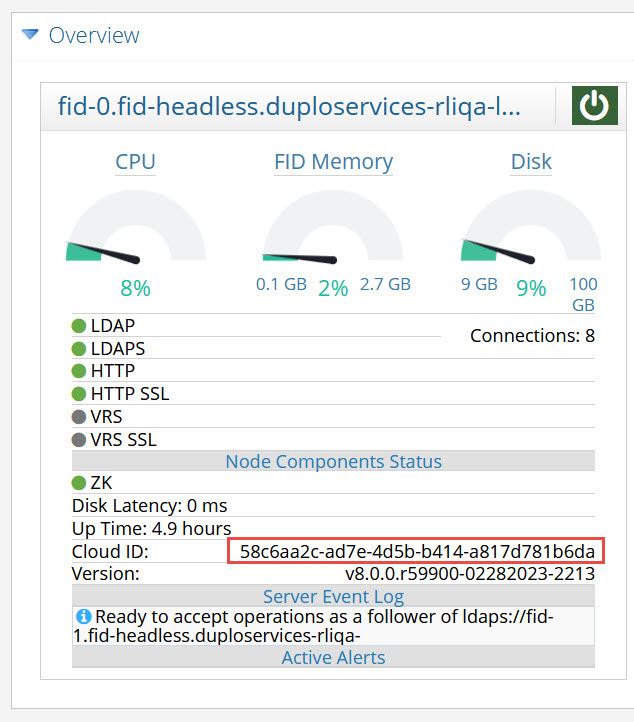

## Data Collectors

RadiantOne offers data collectors associated with various functions within the service. These data collectors can be used to configure custom alerts.

The names of data collectors are shown below.

Figure 1. 26 : Data Collectors

Descriptions for each data collector can be found in the following sections. Some properties
within data collectors require the RadiantOne service to be running to get status information.
Each description in this section indicates if the RadiantOne service needs to be running. If you
have configured custom alerts that use properties in a data collector that require the
RadiantOne service to be running, and the service stops, no alerts are sent. Be mindful of this
when using data collectors in custom alerts.

### Active-alerts

The active-alerts data collector returns information about all active alerts that are currently
triggered. If the response is empty, this means there are currently no alerts triggered.

>[!note] This data collector does not require a RadiantOne service to be running to return status information.

### Cloud-replication

The cloud-replication data collector returns information and statistics about all configured inter-cluster replication.

>[!note] This data collector requires a RadiantOne service to be running return status information.

A description of the properties is shown below.

- missingChanges – The number of pending changes that still need to be applied to the replicated domain on that server. This is calculated by finding the difference between the vdsSyncCursor on the domain on the target cluster and the number of changes in the replication journal for that domain that weren't applied by that cluster.
- ensurePush – a value of true indicates that Ensured Push Mode is enabled for the replicated domain. A value of false indicates that Ensured Push Mode is not enabled for the replicated domain.
- serverId – The unique ID of the server associated with the replicated domain.

### Cluster-info

The cluster-info data collector returns information and statistics about the RadiantOne cluster.

A description of the properties is shown below.

- upTime – the amount of time (in milliseconds) the RadiantOne service on the node has been running. This property does NOT require a RadiantOne service to be running to return information.
- zkEnsembleCanRead – the value is true if the ZooKeeper service on the node can be read. This value is false if the ZooKeeper service on the node cannot be read.
- data – the combined index size (in KB) of all RadiantOne Universal Directory (HDAP) stores in the cluster. This property requires a RadiantOne service to be running to return information.
- vdsLeader – the cloud ID associated with the current RadiantOne FID leader node in the cluster. This property requires an FID to be running to return information.
- zkEnsembleCanWrite – the value is true if the ZooKeeper service on the node can be written to. This value is false if the ZooKeeper service on the node cannot be written to.
- leaderSchedulerStarted - a value of true indicates the task scheduler is running on the RadiantOne leader node. A value of false indicates the task scheduler is not running on the leader node. This property does NOT require a RadiantOne service to be running to return information.
- name – the name of the cluster the node is a member of. This property does NOT require a RadiantOne service to be running to return information.
- storeCount – the number of RadiantOne Universal Directory stores on the node. This property requires a RadiantOne service to be running to return information.
- nodeCount – the number of nodes in the cluster. This property does NOT require a RadiantOne service to be running to return information.
- readOnly – the value is true if ZooKeeper on the node is in a read-only state. The value is false if ZooKeeper on the node is a read-write state. This property does NOT require a RadiantOne service to be running to return information.

### Cluster-latency

The cluster-latency data collector returns information about the current network latency and peak network latency both on the local node and between cluster nodes. The results indicate the current and peak network latency between all nodes. 

- currentLatency– current network latency (in milliseconds). This property requires an FID to be running in order to return information.
- peakLatency – peak network latency (in milliseconds), since the RadiantOne service started. This property does NOT require a RadiantOne service to be running to return information.

### Cluster-LDAP

The cluster-ldap data collector returns information about the current LDAP/LDAPS connectivity between RadiantOne cluster nodes. The results indicate the LDAP connectivity between all nodes and include the status of the local connectivity. 

- errors – if the RadiantOne LDAP service is running and there are problems connecting to the LDAP/LDAPS ports an error message is returned. Note – if the RadiantOne LDAP service isn’t running, the value of ldap/ldaps is NA and there is no error message. This property requires a RadiantOne service to be running to return information.
- ldap – a value of true indicates the ldap port of the RadiantOne service can be accessed successfully. A value of NA indicates connectivity to the LDAP port is unsuccessful because the RadiantOne LDAP service isn’t running. A value of false indicates the RadiantOne service is running but a connection on the LDAP port cannot be established. This property requires a RadiantOne service to be running to return information.
- ldaps – a value of true indicates the ldaps port of the RadiantOne service can be accessed successfully. A value of NA indicates connectivity to the LDAPS port is unsuccessful because the RadiantOne LDAP service isn’t running. A value of false indicates RadiantOne service is running but a connection on the LDAPS port cannot be established. This property requires a RadiantOne service to be running to return information.

### Cluster-zk

The cluster-zk data collector returns information about the current ZooKeeper connectivity, both on the local node and between cluster nodes. The results indicate the ZooKeeper connectivity between all nodes and include the status of the local connectivity. 

- canRead – a value of OK indicates the read access to ZooKeeper is successful. This property does NOT require a RadiantOne LDAP service to be running to return information.
- canWrite – a value of OK indicates the write access to ZooKeeper is successful. This property does NOT require a RadiantOne LDAP service to be running to return information.
- errors – if there are problems with the connectivity to ZooKeeper the error message is returned. This property does NOT require a RadiantOne LDAP service to be running to return information.

### Cluster-zk-v2

This is like the cluster-zk data collector, but it supports monitoring an external ZooKeeper ensemble. If you have deployed ZooKeeper in a separate cluster than RadiantOne, use this data collector to monitor ZooKeeper connectivity.

The following are the propertyID names and values:

- canRead – a value of OK indicates the read access to ZooKeeper is successful. This property does NOT require a RadiantOne LDAP service to be running to return information.
- canWrite – a value of OK indicates the write access to ZooKeeper is successful. This property does NOT require a RadiantOne LDAP service to be running to return information.

- errors – if there are problems with the connectivity to ZooKeeper the error message is returned. This property does NOT require a RadiantOne LDAP service to be running to return information.

### Config-change

The config-change data collector returns information about configuration changes.

The following are the propertyID names and descriptions returned by this collector:

- commits – a value of OK indicates the read access to ZooKeeper is successful. This property does NOT require a RadiantOne service to be running to return information.
- hasChange – Has a value of true or false indicating if any changes have been made to the configuration since last polling. The value is true if there have been configuration changes. Otherwise, the value is false.
- revision – Current ZooKeeper revision.

>[!note] This data collector does not require a RadiantOne service to be running to return information.

### Connections-info

The connections-info data collector returns information about current connections for a given RadiantOne node.

>[!note] This data collector requires a RadiantOne service to be running to return information.

For each current connection, the following properties are returned.

- connBindDn – Bind DN associated with the client connection.
- connClientIp – client IP address that established the connection.
- connClientPort – port number the client established the connection from.
- connId – unique identifier associated with the client connection.
- connServerIp – IP address of the RadiantOne node the client is connected to.
- connServerPort – port that the client connection is accessing RadiantOne on.
- opCount - the total number of operations the RadiantOne node has processed for the
connection.

>[!note] The opCount for certain connections, used for internal operations, returns a value that is higher than the combined total of opCountAdd, opCountAbandon, opCountBind, >opCountModify, opCountModifyDn, opCountCompare, and opCountDelete.

- opCountAbandon – number of abandon operations performed on this connection.
- opCountAdd – number of add operations performed on this connection.
- opCountBind – number of bind operations performed on this connection.
- opCountCompare – number of compare operations performed on this connection.
- opCountDelete – number of delete operations performed on this connection.
- opCountModify – number of modify operations performed on this connection.
- opCountModifyDn – number of modifyDN operations performed on this connection.
- opCountSearch – number of searches performed on this connection.

### CPLDS-monitoring

The cplds-monitoring data collector returns information about the automatic synchronization process from LDAP backends to RadiantOne Universal Directory stores.

>[!note] This data collector requires the RadiantOne service to be running to return information.

The following are the propertyID names and descriptions returned by this collector:

- source – the data source(s) where changes are detected and synchronized to destination RadiantOne naming contexts.
- destination – target naming context.
- lastSyncTime – the last time synchronization was run.
- lastChangesTime – the last time synchronization was run and changes were detected and applied.
- numOfChanges – the number of changes applied in the last synchronization run.
- fileChangeTime – the creation time of the LDIF file from the data source. This file is used by the change detection process to determine what data needs synchronized.

### Datasource-status

The datasource-status data collector returns information about the data source and its status based on if the RadiantOne node can connect to it.

>[!note] This data collector does NOT require the RadiantOne servcie to be running to return information.

For each data source, the following properties are returned.

- datasourceTypeInt – has a value of 1 for LDAP data sources, a value of 3 for JDBC databases, and a value of 7 for custom data sources.
- datasourceUrl – the URL configured for the data source.
- status – a value of false indicates the RadiantOne service on the node cannot connect to the data source. A value of true indicates the RadiantOne service on the node can successfully connect to the data source. A value of N/A indicates the connection cannot be tested, which is the case for custom data sources.

### Event-log

The event-log data collector returns information about recent events (eventType) like persistent cache initialization failures and refresh events that fail for a given RadiantOne node (nodeId) and naming context (namingDN). eventType has a value of PCACHE for persistent cache related events and SERVER for all other events.

>[!note] This data collector requires the RadiantOne service to be running to return information.

The following properties (propertyID) are returned for each periodic persistent cache refresh
event.

- date – timestamp providing the date and time the persistent cache refresh failure occurred.
- syncDiffPct - The percentage of which the validation threshold has been exceeded. If the failure was not due to a validation threshold, then the value is -1. In the example shown below, the validation threshold was exceeded by 10%.
- levelName – RadiantOne log level associated with the error.
- message – the error message associated with a periodic persistent cache refresh failure. An example would be: [Storage Periodic Refresh - o=companyprofiles] Refresh failed:
javax.naming.PartialResultException: [LDAP: error code 9 - Error on xjoin inetOrgPerson -vdAPPHR: [LDAP: error code 1 - Exception occured on examples :
The request to acquire more resource failed: ABORTED: the access to the new resource server cannot go through.]]

Another example would be: [Storage Periodic Refresh - o=derby] Refresh failed:
java.lang.Exception: Threshold reached with -10% difference.

### Hdap-store

The hdap-store data collector returns information and statistics about all RadiantOne Universal Directory (HDAP) stores and persistent cached branches for a given RadiantOne node (nodeID).

>[!note] This data collector requires the RadiantOne service to be running to return information.

For each store/persistent cache (storeId), the following properties are returned.

- numOfEntries – number of entries in the store/persistent cache. JSON sub-documents are counted as separate entries to comprise this value.
- writeOps – write operations per second.

- numOfEntriesPeak – peak number of entries in the store/persistent cache since the
RadiantOne service started.
- indexName - internal name of the index associated with the store/persistent cache.
- numOfLDAPEntriesPeak – peak number of LDAP entries in the store/persistent cache since the RadiantOne service started.
- folderSize – total size (in Bytes) of the file folder associated with the store/persistent cache (index, tlogs).
- searchOpsPeak – search operations per second peak, since the RadiantOne service started.
- version - current internal version of the store. This is used to manage replication.
- indexSize - current size of the index (in KB) for the store/persistent cache.
- searchOps – search operations per second.
- numOfLDAPEntries - number of LDAP entries in the store/persistent cache. JSON sub-documents are not counted as separate entries. If an entry has sub-documents, it is counted as a single LDAP entry.
- indexSizePeak - peak index size for the store/persistent cache since the RadiantOne service started.
- writeOpsPeak – write operations per second.

### Node-info

The node-info data collector returns general information about all RadiantOne cluster nodes. If you pass a nodeId in the request, the information returned is applicable to that single node.

The response includes the following properties for each node:

- cloudId – the identifier of the RadiantOne node. This property does NOT require a RadiantOne service to be running to return information.
- createdTime – time when the RadiantOne node was created. This property does NOT require the RadiantOne service to be running to return information.
- installPath – the product installation path. This property does NOT require the RadiantOne service to be running to return information.
- ip - IP address of the machine. This property does NOT require the RadiantOne service to be running to return information.
- isEnableSsl – has a value of “yes” when SSL is enabled for the RadiantOne service and a value of “no” when it is not enabled. This property does NOT require the RadiantOne service to be running to return information.
- javaHome – the installation location of Java. This property does NOT require the RadiantOne service to be running to return information.
- javaVersion - Java version used in RadiantOne. This property does NOT require the RadiantOne service to be running to return information.

- license – type of license associated with the installed RadiantOne product and the email address of the person the RadiantOne product is licensed to. This property requires the RadiantOne service to be running to return information.
- name – the friendly name of the machine where the RadiantOne node is installed. This property does NOT require the RadiantOne service to be running to return information.
- nodeType – has a value of READ_WRITE if the node is a core cluster node and a value of READ_ONLY if the node is a follower-only type of cluster node. This property does NOT require the RadiantOne service to be running to return information.
- port – the port number for LDAP access to RadiantOne. This property does NOT require the RadiantOne service to be running to return information.
- portSsl – the port number for LDAPS access to RadiantOne. This property does NOT require the RadiantOne service to be running to return information.
- product – the name of the RadiantOne product (license) installed. This property does NOT require the RadiantOne service to be running to return information.
- startTime – time when the RadiantOne service was started on the node. This property requires the RadiantOne service to be running to return information.
- vdsBuild – exact RadiantOne Build ID. This property does NOT require the RadiantOne service to be running to return information.
- vdsVersion – version or RadiantOne installed. This property does NOT require the RadiantOne service to be running to return information.

### Node-monitor

The node-monitor data collector returns statistics about the RadiantOne nodes. Each cluster node is identified by a cloud ID.

The cloud_ID associated with a node can be seen from the Server Control panel > Usage & Activity > Server Information > Cloud ID.

Figure 1.27 : Location to View Cloud ID Associated with a Cluster Node on Server Control Panel

The cloud_ID associated with a node can also be seen from the Main Control panel > Dashboard tab.

Figure 1. 28 : Location to View Cloud ID Associated with a Cluster Node on Main Control Panel

For each cluster node, the following properties are returned.

- activeConnections – number of current connections to the RadiantOne node. This property requires the RadiantOne service to be running to return information.
- committedVirtualMemorySize - amount of virtual memory that is guaranteed to be available to the running process in bytes, or -1 if this operation is not supported. This property does NOT require the RadiantOne service to be running to return information.
- connectionMax – number of maximum connections currently configured for RadiantOne. This property does NOT require the RadiantOne service to be running in order to return information.
- connectionPeak - greatest number of connections at one time to RadiantOne in a 24- hour timeframe. This property requires the RadiantOne service to be running in order to return information.
- connectionPercent – current percentage of maximum connections in use. This property requires the RadiantOne service to be running to return information.
- connectionTotal – total number of current connections to the RadiantOne node. This property requires the RadiantOne service to be running to return information.
- cpu - current percentage of system CPU utilized. This property does NOT require the RadiantOne service to be running to return information.
- cpuAvg -average percentage of system CPU utilized. This property does NOT require the RadiantOne service to be running to return information.

- cpuPeak - highest percentage of system CPU utilized at one time in a 24-hour timeframe. This property does NOT require the RadiantOne service to be running to return information.

- disk - current amount of disk space (in bytes) being used on entire system. This property does NOT require the RadiantOne service to be running to return information.

- diskLatency - latency in milliseconds of a write to disk operation. This property does NOT require the RadiantOne service to be running to return information.

- diskLatencyPeak – the peak disk latency calculated during a 24-hour period. This property does NOT require the RadiantOne service to be running to return information.

- diskPeak - greatest amount of disk space (in bytes) used on the entire system in a 24-hour timeframe. This property does NOT require the RadiantOne service to be running to return information.

- diskPercent - percentage of disk space used on entire system. This property does NOT require the RadiantOne service to be running to return information.

- diskTotal – total amount of disk space (in bytes) on the machine storage device. This property does NOT require the RadiantOne service to be running to return information.

- isControlPanelRunning – a value of true indicates that the Jetty web server hosting the Control Panel is running. A value of false indicates that the Jetty web server is not running. This property does NOT require the RadiantOne service to be running to return information.

- isSchedulerStarted - a value of true indicates the task scheduler is running on the node. A value of false indicates the task scheduler is not running on the node. This property does NOT require the RadiantOne service to be running to return information.

- isVdsLeader – a value of true indicates the RadiantOne service running on the node is the current cluster leader. A value of false indicates the RadiantOne service running on the node is not the cluster leader. This property does NOT require the RadiantOne service to be running to return information.

- isVdsRunning - a value of true indicates the RadiantOne LDAP service is running on the node. A value of false, indicates the RadiantOne LDAP service is not running on the node. This property does NOT require the RadiantOne service to be running to return information.

- jvmThreadCount - current number of live threads including both daemon and non-daemon threads. This property does NOT require the RadiantOne service to be running to return information.

- memoryAlloc - amount of memory currently allocated by JVM in kilobytes. This property requires the RadiantOne service to be running to return information.

- memoryMax – maximum amount of memory (in KB) that the RadiantOne service JVM is allowed to allocate. This property does NOT require the RadiantOne service to be running to return information.

- memoryPeak - greatest amount of memory used by the RadiantOne service’s JVM at one time in a 24-hour timeframe; value in kilobytes. This property requires the RadiantOne service to be running to return information.
- memoryPercent – percentage of the RadiantOne service’s JVM max memory used. This property requires the RadiantOne service to be running to return information.
- memoryUsed – amount of memory in use (in KB) by the RadiantOne service’s JVM. This property requires the RadiantOne service to be running to return information.
- operationTotal - total amount of LDAP operations performed on the RadiantOne service. This property requires the RadiantOne service to be running to return information.
- systemLoadAverage - the system load average for the last minute. The system load average is the sum of the number of runnable entities queued to the available processors and the number of runnable entities running on the available processors averaged over a period of time. The way in which the load average is calculated is operating system specific but is typically a damped time-dependent average. This property does NOT require the RadiantOne service to be running to return information.
- systemOpenFileDescriptors – number of currently open file descriptors. This is only applicable when RadiantOne is running Linux platforms. If RadiantOne is running on Windows, the value of this property is n/a. This property does NOT require the RadiantOne service to be running to return information.
- systemOpenFileDescriptorsPercent - current percentage of available open file descriptors in use. This is only applicable when RadiantOne is running Linux platforms. If RadiantOne is running on Windows, the value of this property is n/a. This property does NOT require the RadiantOne service to be running to return information.
- systemUsedPhysicalMemory - amount of physical memory (in bytes) used by the system. This property does NOT require the RadiantOne service to be running to return information.
- systemUsedPhysicalMemoryPercent - percentage of physical memory used by system. This property does NOT require the RadiantOne service to be running to return information.
- systemUsedSwap - amount of used swap space in bytes. This property does NOT require the RadiantOne service to be running to return information.
- systemUsedSwapPercent – percentage of system swap space used. This property does NOT require the RadiantOne service to be running to return information.

### Node-status

The node-status data collector returns an ON/OFF status for each RadiantOne service running
on each cluster node. If you pass a nodeId in the request, the information returned is applicable to that single node.

- http_status – status of the RadiantOne service HTTP port. A value of ON means the RadiantOne service is listening on the HTTP port. A value of OFF indicates the RadiantOne service is not listening on the HTTP port. This property does NOT require the RadiantOne service to be running to return information.
- https_status – status of the RadiantOne service HTTPS port. A value of ON means the RadiantOne service is listening on the HTTPS (for SSL/TLS) port. A value of OFF indicates the RadiantOne service is not listening on the HTTPS (for SSL/TLS) port. This property does NOT require the RadiantOne service to be running to return information.
- ldap_status – status of the RadiantOne service LDAP port. A value of ON means the RadiantOne service is listening on the LDAP port. A value of OFF indicates the RadiantOne service is not listening on the LDAP port. This property does NOT require the RadiantOne service to be running to return information.
- ldap_ssl_status – status of the RadiantOne service LDAPS port. A value of ON means the RadiantOne service is listening on the LDAPS (for SSL/TLS) port. A value of OFF indicates the RadiantOne service is not listening on the LDAPS (for SSL/TLS) port. This property does NOT require the RadiantOne service to be running to return information.
- vrs_ssl_status – status of the RadiantOne service’s JDBC SSL port. A value of ON means the RadiantOne service is listening on the JDBC SSL port. A value of OFF indicates the RadiantOne service is not listening on the JDBC SSL port. This property does NOT require the RadiantOne service to be running to return information.
- vrs_status – status of the RadiantOne service’s JDBC port. A value of ON means the RadiantOne service is listening on the JDBC port. A value of OFF indicates the RadiantOne service is not listening on the JDBC port. This property does NOT require the RadiantOne service to be running to return information.
- zk_status – status of the ZooKeeper on the node. A value of ON means ZooKeeper is running on the node. A value of OFF indicates ZooKeeper is not running on the node. This property does NOT require the RadiantOne service to be running to returninformation.

### Orchestrator-agent-job

The orchestrator-agent-job data collector returns information about the agents currently deployed in RadiantOne and their type. This data collector doesn't use traditional propertyId's.
Instead, it outputs the agent ID as the propertyId and its type as the value.

It also outputs any connector pcache ID's as the propertyId and any agents they are using it as the value.

>[!note] This data collector requires the RadiantOne service to be running to return information.

For each agent, the following properties are returned:

- agentId/agentType – The agent ID is the property and the agent type is the value. Shows what agents are running and their types. Available agent types: CPLDS, PERIODIC_REFRESH, REAL_TIME

- connector ID/agentId - The connector ID is the property ID and the agent ID is the value. This shows which connectors are using which agents.

### Periodic-refresh

The periodic-refresh data collector returns information and statistics about persistent caches configured for periodic refresh.

>[!note] This data collector requires the RadiantOne service to be running to return information.

For each periodic refresh, the following properties are returned:

- inserted – number of inserted entries applied to the persistent cache.
- updated – number of updates applied to the persistent cache.
- deleted – number of deleted entries applied to the persistent cache.
- agentName – the agent name that is running the periodic refresh. If RadiantOne is handling the periodic refresh (default), then an agent is not used and this property is blank.

### Pipeline

The pipeline data collector is for retrieving information about real-time persistent cache refresh and/or global synchronization processes

>[!note] This data collector requires the RadiantOne service to be running to return information.

**Real-time Persistent Cache Refresh**

A high-level real-time persistent cache refresh architecture is shown below.

Figure 1.39 : Real-time Persistent Cache Refresh Architecture

Pipeline properties for real-time persistent cache refresh processes are described below.

- SourceDn and targetDn values are the same, and indicate the DN in the RadiantOne namespace that is configured for real-time persistent cache refresh.
- The pipelineId is the identifier associated with the real-time persistent cache refresh.
- The pipelineType value is: PCACHE
- The componentType has one of the following values: APPLY, CAPTURE, PIPELINE, PROCESSOR.
- The CAPTURE componentType, related to step 1 in Figure 1.30, has the following properties (propertyId): captureCounter, captureHostname, captureMetaDn, captureState, captureType.
  *captureCounter* - indicates the number of changed entries published by the connector.
  *captureHostname* - indicates the identifier of the machine where the agent process is running. The agent oversees managing the connector states.
  *captureMetaDn* - is an identifier for the virtual node that the connector listens for changes on.
  *captureState* - is the status of the capture connector. The captureState can have one of the following values: RUNNING, DEPLOYING, STOPPED, ERROR, WAITING_FOR_AGENT.
  *captureType* - indicates the method used to capture changes. The captureType can have one of the following values: CHANGELOG, AD_DIRSYNC, AD_USN, AD_HYBRID, DB_TIMESTAMP, DB_COUNTER, DB_TRIGGER, SCIM2, SCIM1, GRAPHAPI, MGRAPH, OKTA, KAFKA, KAFKA_GG, PERSISTENT_SEARCH.
- The APPLY componentType, related to step 4 in Figure 1.30, has the following property: appliedCounter. This indicates the number of changes processed to apply to the persistent cache.
- The PIPELINE componentType has the following property: pipelineState, which indicates if the persistent cache refresh process is started. PipelineState can have one of the following values: RUNNING, SUSPENDED, UPLOADING, ERROR, DEPLOYING, WAITING_FOR_AGENT
- The PROCESSOR componentType has the following properties: processorCounter, processorHostname, processorQueueSize. The processor component logic is built into the Sync Engine shown in Figure 1.30 and is responsible for processing events from the queues. ProcessorCounter is the number of events processed from the queue. ProcessorHostname is the machine name where this process is running. ProcessorQueueSize is the number of entries in the queue waiting to be processed.ProcessorQueueSize is a good candidate to configure custom alertsfor. If this number is growing, and the pipeline is fully  started, it is an indicator that events are being processed too slow. This could be due to errors while applying events, or just slow machine hardware or network.

**Global Synchronization**

A high-level Global Synchronization architecture is shown below.

Figure 1. 40 : Global Synchronization Architecture

Pipeline properties for global synchronization processes are described below.

- SourceDn is the DN in the RadiantOne namespace associated with the data source where changes are captured.
- TargetDn is the DN in the RadiantOne namespace associated with the destination data source where changes are to be applied.
- The pipelineId is the identifier associated with the synchronization pipeline.
- The pipelineType value is: SYNC
- The componentType has one of the following values: APPLY, CAPTURE, PIPELINE, PROCESSOR.
- The CAPTURE componentType, related to step 1 in Figure 1.31, has the following properties (propertyId): captureCounter, captureHostname, captureMetaDn, captureState, captureType.
  *captureCounter* - indicates the number of changed entries published by the connector.
  *captureHostname* - indicates the identifier of the machine where the agent process is running. The agent oversees managing the connector states.
  *captureMetaDn* - is an identifier for the virtual node that the connector listens for changes on.
  *captureState* - is the status of the capture connector. The captureState can have one of the following values: RUNNING, DEPLOYING, STOPPED, ERROR, WAITING_FOR_AGENT
  *captureType* - indicates the method used to capture changes. The captureType can have one of the following values: CHANGELOG, AD_DIRSYNC, AD_USN, AD_HYBRID, DB_TIMESTAMP, DB_COUNTER, DB_TRIGGER, SCIM2, SCIM1, GRAPHAPI, MGRAPH, OKTA, KAFKA, KAFKA_GG, PERSISTENT_SEARCH
- The APPLY componentType, related to step 4 in Figure 1.31, has the following property (propertyId): appliedCounter. This indicates the number of changes applied on the target.
- The PIPELINE componentType has the following property (propertyId): pipelineState, which indicates if the synchronization process is started. PipelineState can have one of the following values: RUNNING, SUSPENDED, UPLOADING, ERROR, DEPLOYING, WAITING_FOR_AGENT
- The PROCESSOR componentType, has the following properties (propertyId): processorCounter, processorHostname, processorQueueSize. The processor component logic is built into the Sync Engine shown in Figure 1.31 and is responsible for processing events from the queues. ProcessorCounter is the number of events processed from the queue. ProcessorHostname is the machine name where this process is running. ProcessorQueueSize is the number of entries in the queue waiting to be processed. ProcessorQueueSize is a good candidate to configure custom alerts for. If this number is growing, and the pipeline is fully started, it is an indicator that events are being processed too slow. This could be due to errors while applying events, or just slow machine hardware or network.

### Process-info

The process-info data collector returns information and statistics about the internal RadiantOne
processing queues.

>[!note] This data collector requires the RadiantOne service to be running to return information.

This is the same information that you can find on the Server Control Panel > Usage & Activity tab > Connections & Ops.

For each processing queue type, the following properties are returned:

- opThreadExecuting – Current number of operations being executed.
- opThreadPoolSizeMax - This is the number of threads the RadiantOne service uses for handling client requests. The default value is 16 worker threads allocated per processing queue (128 for internal queues). This amount is sufficient for most deployments and should not be changed unless recommended by Radiant Logic.
- opThreadPoolSizePeak – Peak number of working threads.
- opWaitingInQueue – Number of operations in the queue waiting to be processed.
- waitingRatio - The ratio of threads that are waiting to be executed (opWaitingInQueue) to the thread pool max size (opThreadPoolSizeMax).

### Server-event

The server-event data collector returns the last 15 entries (not lines) in the server event log file
(<RLI_HOME>/vds_server/logs/vds_events.log).

>[!note] This data collector requires the RadiantOne service to be running to return information.
