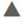
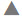

# Directory Namespace design

The virtual namespace is managed from the Main Control Panel > Directory Namespace tab. 

The RadiantOne namespace can be comprised of many different branches, each of which can come from a different configuration and be combined below a common naming context or have their own. The following are the options that can comprise the virtual Directory Information Tree (DIT):

▪	[Views from JDBC-accessible Backends](04-virtual-views-of-database-backends)

▪	[Views from LDAP Backends](03-virtual-view-of-ldap-backends)

▪	[RadiantOne Universal Directory (local storage)](05-radiantone-universal-directory)

▪	[Views from Cloud Services](08-virtual-views-of-cloud-directories-or-services)

RadiantOne includes some sample root naming contexts with the install. However, as mentioned above, you can create new naming contexts, and even configure multiple naming contexts.

From the Main Control Panel > Directory Namespace Tab, the Root Naming Contexts node displays all naming contexts configured in the directory. You can have as many naming contexts as you want. The naming contexts can be based on virtual trees (which aggregate multiple types of backends), local RadiantOne Universal directory stores, LDAP backends, database backends, web service backends, cloud services backends or any combination of the above. 

## Creating Naming Contexts

Root naming contexts can be created from the Main Control Panel > Directory Namespace tab.

To configure Root Naming Contexts from the Main Control Panel, click on the  button on the Directory Namespace tab. Follow the steps outlined in Chapters 3-8 applicable to the type of backend you want to mount below the naming context.

### Icon Descriptions

On the Main Control Panel > Directory Namespace tab, if a backend has been defined, the icon in the tree changes to show that it has been configured. All icons and corresponding descriptions are listed in the table below.

Icon | Description
-|-
 | Represents naming contexts and/or nodes associated with a virtual tree type of backend mapping.
 | Represents a node defined in a virtual tree/view as “label”.
	| Represents a node defined in a virtual tree/view as “container”.
 | Represents a node defined in a virtual tree/view as “content”.
 | Represents naming contexts and/or nodes associated with a backend database mapping.
 	| Represents naming contexts associated with an internally used default RadiantOne Universal Directory store.
 	| Represents naming contexts and/or nodes associated with a RadiantOne Universal Directory store.
 | Represents naming contexts and/or nodes associated with a backend directory mapping.
 	| Represents naming contexts and/or nodes associated with a web service or cloud directory backend mapping.
 	| Located in the Cache section. Represents a naming contexts and/or nodes configured for persistent cache with real-time refresh. For details on persistent cache with real-time refresh, see the RadiantOne Deployment and Tuning Guide.
 | Located in the Cache section. Represents a naming context and/or nodes configured for persistent cache with periodic refresh. For details on persistent cache with periodic refresh, see the RadiantOne Deployment and Tuning Guide.
 	| Located in the Cache section. Represents a naming context and/or nodes configured for persistent cache with periodic or real-time automated refresh that are currently marked as “inactive”. For details on persistent cache with real-time refresh, see the RadiantOne Deployment and Tuning Guide.
 	| Located in the Cache section. Represents a naming context and/or nodes configured for persistent cache without a refresh mechanism configured. The refresh process might be handled by an external, custom process. For details on persistent, see the RadiantOne Deployment and Tuning Guide.
 	| Located in the Cache section. Represents a naming context and/or nodes configured for persistent cache without a refresh mechanism configured, that are currently marked as “inactive”. For details on persistent cache, see the RadiantOne Deployment and Tuning Guide.
 	| Represents a directory backend naming context that has been cached. The corresponding cache configuration is located below the Cache section.
 	| Represents a database backend naming context that has been cached. The corresponding cache configuration is located below the Cache section.
 | Represents a label level below a naming context that has been cached. The corresponding cache configuration is located below the Cache section.
 | Represents a node defined in a virtual tree/view as “content” below a naming context that has been cached. The corresponding cache configuration is located below the Cache section.
 	| Represents a node defined in a virtual tree/view as “container” below a naming context that has been cached. The corresponding cache configuration is located below the Cache section.
 	| Represents a virtual tree backend naming context that has been cached. The corresponding cache configuration is located below the Cache section.

## Deleting Naming Contexts

To delete a naming context, you must first deactivate it (and delete any child naming contexts first if there are any defined).

1.	From the Main Control Panel > Directory Namespace Tab, select the naming context you want to delete below the Root Naming Contexts node.

2.	On the right side, uncheck the Active option and click **Save**.

3.	Click **Yes** to apply the changes to the server.

4.	Click **OK** to exit the confirmation.

5.	Click the **Delete**  button.

6.	Click **Yes** to confirm the deletion. 

7.	Click **OK** to exit the confirmation.

## Importing LDIF Files

Make sure the LDIF file is accessible on your local machine or has been uploaded to the RadiantOne service.Use the Main Control Panel > Settings > Configuration > File Manager to upload files. To import entries from an LDIF file, click . Navigate to the location of the LDIF file. Select the option to Add or Override Entries (this option adds new entries and updates entries that already exist) or Add Entries (This option adds entries only and does not try to update the entry if it already exists). Click **OK** to start the import task.

Figure 2.1: Import LDIF

## Managing Attribute Properties for Virtual Entries

Virtual entries are comprised of attributes from the primary backend, secondary objects (from joins, if relevant), and computed attributes (if relevant). All attributes that comprise the virtual entries can be seen on the Objects tab, in the Virtual Attribute table. From the Main Control Panel -> Directory Namespace Tab, select the primary backend below Root Naming Contexts and on the right side, select the Objects tab.

>[!note] 
>If the primary backend is an LDAP directory and no primary object has been added, click **Add** to select one.

The Virtual Attribute table displays all attributes from the primary objects (noted with a blue square in the origin column), attributes from secondary objects (noted with a green square in the origin column) and computed attributes (noted with an orange square in the origin column).

To customize the display based on a particular attribute origin, use the Display drop-down list. The options are: All, Primary, Join and Computed. Use the “all” option to display attributes from primary objects, secondary objects and ones that are computed. Use the “primary” option to display only attributes from primary objects. Use the “join” option to show only attributes returned from secondary objects. Use the “computed” option to display only computed attributes.

If you only want to display attributes that are marked as visible (NOT hidden), check the “visible only” checkbox.

If you want to modify an attribute’s hidden status, searchability, updateability or priority, select the attribute in the list and click the **Edit** button.

If you change anything related to the attributes of the virtual object, click **Save** in the upper right corner and click **Yes** to apply the changes to RadiantOne.

## Testing Authentication

You can test authentication for any entry in the RadiantOne namespace. To test authentication: 

1.	In the RadiantOne Main Control Panel, go to the Directory Browser tab. 

2.	Expand a root naming context and select an entry. 

3.	Click the   button. The Test Authentication window opens. 

4.	Enter the password and click the **Test bind** button. If the password is correct, the Test Authentication window returns the message “Binding successful”. If the password is incorrect, the Test Authentication window returns a message similar to the following. 

Connection failed:javax.naming.AuthenticationException: [LDAP: error code 49 – Reason: 52e – Invalid credentials. 
