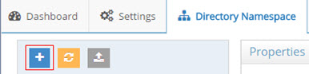
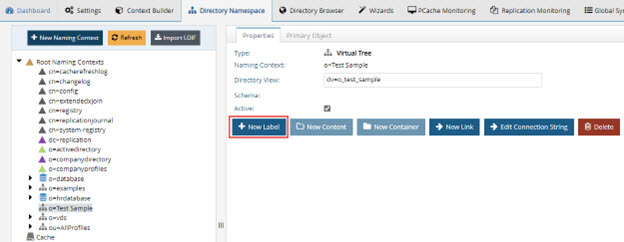
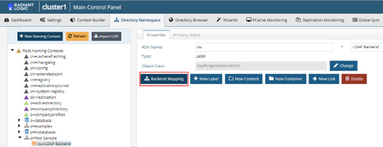
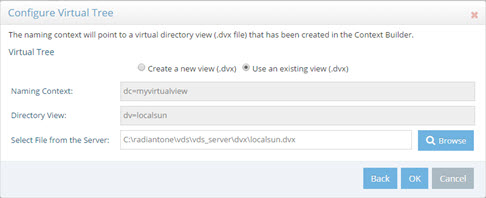

# Chapter 6: Virtual Views based on an Aggregation of Multiple Types of Backends

If your goal is to create a virtual view which aggregates multiple types of backends (combination of directories, database, web services…etc.), use the Virtual Tree type of option when creating the Root Naming Context.

## Configuration

This section is devoted to the steps required to manually build virtual views from multiple different types of backend sources using the Main Control Panel > Directory Namespace tab.
1.	On the Directory Namespace tab, click .

 
Figure 6.1: New Root Naming Context

2.	Enter a name for the new naming context. 

3.	Select the Virtual Tree option. This option allows you to build a virtual view from multiple types of backend data sources.

 
Figure 6.2: Creating a New Virtual Directory Tree

4.	Click **Next**.
5.	Select the Create a new view (.dvx) option click **OK**.

 
Figure 6.3: Creating a New Virtual Directory Tree

6.	After the root naming context is created, you can begin to create the hierarchy. Select the new naming context in the tree and choose New Label. Create as many labels (one for each level) as you want. 

 
Figure 6.4: Use New Labels/levels to Create the Hierarchy

7.	Select the type of node you want to create (o, ou, dc…etc.).

8.	Once the hierarchy is defined, you can start to define the backend configurations. Any leaf node (declared as a Label – yellow folder) in your view can have a specific type of backend defined for it. 

9.	Select the leaf node (the yellow folder) and click Backend Mapping > select the type of backend you want to define.

 
Figure 6.5: Backend Mappings

For details on the different parameters for each type of backend, please see the following sections:

-	[LDAP Backend Parameters and Settings](03-virtual-view-of-ldap-backends#ldap-backend-parameters-and-settings)

-	[Database Backend Parameters and Settings](04-virtual-views-of-database-backends#database-backend-parameters-and-settings)

-	[Universal Directory Parameters and Settings](05-radiantone-universal-directory#universal-directory-storage-parameters-and-settings)

If you need to modify a backend configuration, navigate to the appropriate location in the tree and modify the parameters on the tabs available on the right. Remember to click Save and click Yes to apply the changes to the server.

## Mounting Virtual Views Created with Context Builder

To mount virtual views created on the Main Control Panel > Context Builder tab, follow the steps below.

1.	From the Main Control Panel > Directory Namespace Tab click .
2.	Enter a root naming context where you want to mount the virtual view and select the Virtual Tree option.
3.	Click **Next**.
4.	Select the Use an Existing View (.dvx) option and click on the Browse button to locate the virtual view. A list of all virtual views displays.
5.	Select the virtual view that you want to mount below this new naming context and click **OK**. 
6.	Click **OK**.

 
Figure 6.6: Mounting a Virtual View Created in Context Builder into the RadiantOne Namespace

7.	Click **OK** to exit the confirmation.
8.	Click **Save** and click **Yes** to apply the changes to the server. 

Clients can now access the virtual view created in the Context Builder by querying RadiantOne starting at the naming context where you have mounted the view.
 