# Virtual Views of Cloud Directories and Services

## Introduction

Cloud services like Salesforce, Google Directory, Azure AD (which stores identities that access services like Office 365), among others can be virtualized in RadiantOne and a default virtual view mounted at o=cloudservices,o=vds can be seen as an example. If you update the default data sources associated with this view, it should return your data. The following list includes the default data sources that you can edit to point to your service. 

>[!note] The default data sources mentioned below can be used as samples of virtualizing data sources reachable via an API. To configure new custom data sources, see the RadiantOne Context Builder Guide.

Cloud Directory or Service	| RadiantOne Data Source
-|-
Salesforce | There are two methods supported for virtualizing Salesforce: JDBC or SCIM     [SCIM](#scim-access):  Edit the scimclient Custom Data Source and provide the required SCIM and OAuth properties.     [JDBC](#jdbc-access):   Edit radiantsalesforce DB Data Source.     The sample virtual view is salesforce.dvx and can be viewed in Context Builder, View Designer perspective.     The virtual view is mounted at dv=salesforce,o=cloudservices,o=vds for client access.
Azure AD | Edit graphapi Custom Data Source.     The sample virtual view is graphapi.dvx and can be viewed in Context Builder, View Designer perspective.     The virtual view is mounted at dv=graphapi,o=cloudservices,o=vds for client access.     For Azure Active Directory B2C, you can use the graphapib2c custom data source instead of graphapi.     Note – Microsoft plans to deprecate the API used in this sample soon. You can use the mgraph custom data source to virtualize Azure AD as an alternative.
[Google Directory](#google-directory) | Edit googledirectory Custom Data Source.    The sample virtual view is googledirectory.dvx and can be viewed in Context Builder, View Designer perspective.     The virtual view is not mounted in the virtual namespace by default, but can be by creating a new naming context in the Main Control Panel > Directory Namespace tab.
Concur	| Edit concur Custom Data Source. Script to call the Concur API located <RLI_HOME>\vds_server\custom\src\com\rli\scripts\customobjects. Updates to the API calls might be necessary.    The sample virtual view is concur.dvx and can be viewed in Context Builder, View Designer perspective.     The virtual view is mounted at dv=concur,o=cloudservices,o=vds for client access.
Workday	| Edit workdayhr Custom Data Source. Script to call the Workday API located <RLI_HOME>\vds_server\custom\src\com\rli\scripts\customobjects. Updates to the API calls might be necessary.    The sample virtual view is workdayhr.dvx and can be viewed in Context Builder, View Designer perspective.     The virtual view is mounted at dv=workdayhr,o=cloudservices,o=vds for client access.
Any service accessible via SCIM v1 | Edit scimclient Custom Data Source.    The sample virtual view is scimclient.dvx and can be viewed in Context Builder, View Designer perspective.     The virtual view is mounted at dv=scimclient,o=cloudservices,o=vds for client access.
Any service accessible via SCIM v2	| Edit scimclient2 Custom Data Source.    The sample virtual view is scimclient2.dvx and can be viewed in Context Builder, View Designer perspective.     The virtual view is not mounted in the virtual namespace by default, but can be by creating a new naming context in the Main Control Panel -> Directory Namespace tab.
SharePoint Online in Office 365	| Edit sharepointonline Custom Data Source to virtualize identities in the User Profile Database.    The sample virtual view is sharepointonline.dvx and can be viewed in Context Builder, View Designer perspective.     The virtual view is mounted at dv=sharepointonline,o=cloudservices,o=vds for client access.    To virtualize a User Profile Database in SharePoint on-premise, use the sharepoint Custom Data Source.    The sample virtual view is sharepoint.dvx and can be viewed in Context Builder, View Designer perspective.     The virtual view is mounted at dv=sharepoint,o=cloudservices,o=vds for client access.
[Okta Universal Directory](#okta-universal-directory) | Edit oktaclient Custom Data Source.    The sample virtual view is okta2.dvx and can be viewed in Context Builder, View Designer perspective.     The virtual view is not mounted in the virtual namespace by default, but can be by creating a new naming context in the Main Control Panel > Directory Namespace tab.
[SailPoint Identity IQ](#sailpoint-iiq) | Edit scimclient2 Custom Data Source (or clone it to create one specific for SailPoint).    Edit scimclient2.orx schema file in Context Builder to modify it as needed for SailPoint. Create a virtual view based on the modified scimclient2.orx file.

To connect to a new cloud service and create a virtual view, see the RadiantOne Context Builder Guide section on Custom Data Sources. 

More details about virtualizing [Salesforce](#salesforce), [Azure AD](#azure-active-directory), [Google Directory](#google-directory), [Okta Universal Directory](#okta-universal-directory), [SailPoint IdentityIQ](#sailpoint-iiq) and [PingOne Directory](#pingone-directory) by leveraging the sample default custom data sources can be found in this chapter.

### Operations Supported

The default custom data sources support Read, Update, and Delete (or deactivate) operations but most do not support authentication (support a delegated authentication request from FID). Therefore, virtual views of these sources are primarily used for joining with other virtual views to extend user profiles and/or attributes for enforcing authorization and auditing. For example, you can have a virtual view of an LDAP directory (that would handle authentication requests) that is joined with a virtual view of Salesforce (to retrieve additional profile attributes to augment the user entries from the LDAP directory). The only custom data sources that currently support authentication (RadiantOne translating the BIND request into a credentials checking request) are Okta Universal Directory, PingOne Directory, and Azure AD (when MFA is not enabled). 

### Change Detection (Connectors) for Cache Refresh 

If you configure persistent cache for virtual views of cloud directories/services, the change detection mechanisms for cache refresh are limited to Periodic and Custom (only for sources that contain a timestamp attribute for their entries, or Differential Query like Azure AD). The periodic change detection mechanism requires the entire data set to be retrieved at each polling interval and then the connector determines what has changed. The Custom change detection mechanism is a special timestamp-based approach that works with Azure AD (which also leverages Differential Query), Okta, and any SCIM-accessible backend. If the cloud directory/service does not support SCIM (and is something other than Azure AD or Okta), then the periodic option is the only choice for detecting changes for persistent cache refreshes.

For details on persistent cache refresh connectors, see the [RadiantOne Deployment and Tuning Guide](/deployment-and-tuning-guide/00-preface).

### Calling the Web Service through a Proxy Server 

If your company requires API calls to be made through a Web Proxy Server, add a property named “proxy” with a value that points to the proxy server and port (e.g. rli.vip.proxy.com:9090) to the custom data source. If SSL is required, add a property named “proxyssl” with a value of true.

## Salesforce

RadiantOne can virtualize Salesforce via [SCIM](#scim-access) or [JDBC](#jdbc-access). Both configurations are described in this section.

### SCIM Access

In order for RadiantOne to virtualize Salesforce via SCIM, it must authenticate using OAuth. RadiantOne leverages the Username-Password OAuth authentication flow (Resource Owner Password Credentials Grant) for SCIM access as this flow operates non-interactively, without requiring a user to actively give authorization. This requires you to create a connected app in Salesforce to associate with RadiantOne. You should consult your Salesforce documentation for steps on how to create a Connected Application that has been enabled for OAuth. The steps below provide general guidance and may not reflect the latest steps in Salesforce.

### Create a Salesforce Connected Application

1.	Log into Salesforce and go to Setup > Apps > App Manager and click **New Connected App**.

    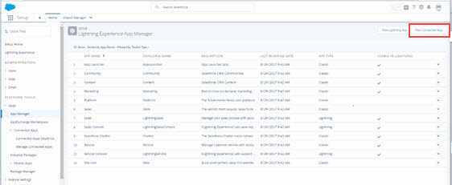

    Figure 1: Creating a Salesforce Connected App

1.	Enter a name for the application, email to associate with the application and check the option to Enable OAuth Settings.

1.	Enter a CallBack URL. RadiantOne doesn’t use this so the value doesn’t really matter. You can use: https://www.radiantlogic.com

1.	Select the OAuth scopes that are applicable and click  to add them.

1.	Leave all other defaults and click **Save**.

    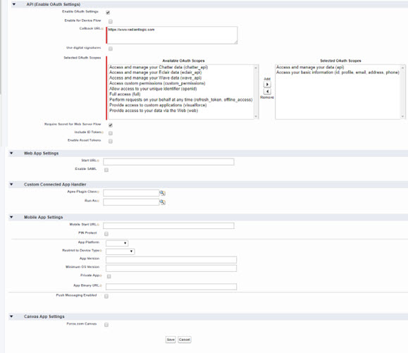

    Figure 2: Configuring Salesforce Connected App

    >[!warning] Allow up to 10 minutes before using the connected app.

1.	After clicking save, you are warned about the 10-minute wait time. Click **Continue**.

1.	Take note of the Consumer Key shown on the summary page. You need this value to configure RadiantOne.

1.	On the summary page, next to “Consumer Secret”, click “Click to Reveal” and take note of the value. You need this value to configure RadiantOne.

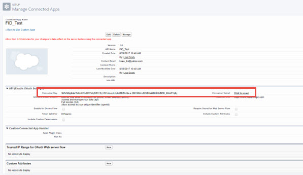

Figure 3: Sample Salesforce Connected App

>[!note] If you did not note the consumer key and secret values, you can return to this information from the App Manager section by selecting “View” from the drop-down list next to your app.

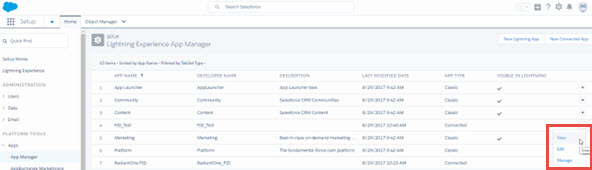

Figure 4: Viewing Consumer Key and Secret for Connected App

#### Configure a RadiantOne SCIM Data Source

1.	In the RadiantOne Main Control Panel > Settings tab > Server Backend > Custom data Sources section, select scimclient and click Edit.

    >[!note] If you are already using the scimclient custom data source to virtualize a SCIM backend, click the Clone button to make a copy that you can work with for Salesforce to avoid impacting your existing configuration.

1.	Click **Add**.

1.	Enter oauthurl for the Name property and provide a value of https://login.salesforce.com/services/oauth2/token which is the Salesforce Token Endpoint. 

1.	Click **OK**.

1.	Click **Add**.

1.	Enter oauthclientid for the Name property and provide the [Consumer Key](#create-a-salesforce-connected-application) value associated with your Salesforce Application. 

    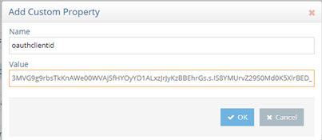

    Figure 8.5: Sample Consumer Key Value

1.	Click **OK**.

1.	Click **Add**.

1.	Enter oauthclientsecret for the Name property and provide the [Consumer Secret](#create-a-salesforce-connected-application) value associated with your Salesforce Application.

1.	Click **OK**. 

1.	Select the url property and click Edit.

1.	Enter the value matching your Salesforce SCIM service. The syntax is: 

    https://`<your_SCIMservice_url>`/services/scim/v1

    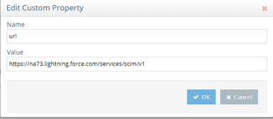

    Figure 8.6: The value matching your Salesforce SCIM service
 
    This URL should contain the same address you see when you are logged into Salesforce.  

    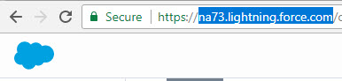

    Figure 8.7: Salesforce SCIM URL

1.	Click **OK**. 

1.	Select the username property and click **Edit**.

1.	Enter your Salesforce username (email).

1.	Click **OK**.

1.	Select the password property and click Edit.

1.	Enter the password (which is your password appended with the [security token](#getting-a-security-token-from-salesforce) you received from Salesforce) associated with your Salesforce user name.

1.	Click **OK**.

1.	Click **Save**.

#### Configure a RadiantOne Virtual View

RadiantOne includes a default SCIM schema file that can be modified to meet the needs of Salesforce. This section describes how to modify the default SCIM schema template and create a basic virtual view from Salesforce.

1.	Go to the Main Control Panel > Context Builder.

2.	Choose File > Open > Schema.

3.	Select the scimclient.orx and click OK.

4.	The SCIM schema information is going to be modified slightly for Salesforce, so save the file with a new name to avoid working with the default template. Click  and enter the new name (e.g. salesforcescimclient) and click OK.

    >[!note] The default data source associated with scimclient.orx is scimclient. if you cloned the default scimclient custom data source to work with Salesforce, right-click on the file name and choose Edit Connection String.  
    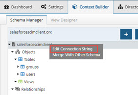

    Figure 8.8: The Edit Connection String Option

    Click “Edit” to select the appropriate custom data source. 

    

    Figure 9: Click Edit to select the appropriate custom data source
 
5.	Expand the file name > Objects > Tables and right-click on Users.

6.	Choose Edit Primary Key(s).
 
    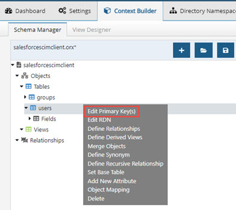

    Figure 10: Editing Primary Key for SCIM Schema

7.	Select the id attribute from the attributes list and use  to move it to the column on the right.

8.	Select the username attribute from the column on the right and use  to move it to the attributes column on the left.
 
    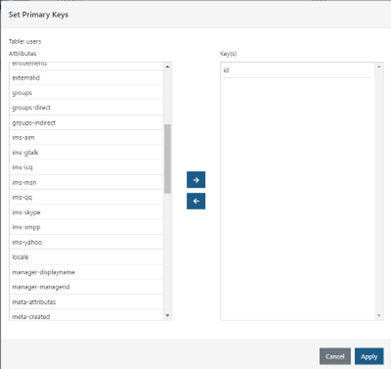

    Figure 11: Setting Primary Key

9.	Click **Apply**.

10.	Click .

    >[!warning] To virtualize group objects, define the primary key as ‘id’ just like you did above for the users object. Only Users and Group objects are in the schema definition by default. To virtualize other objects via SCIM, you must first create the object (Right-click on Tables > Add New Object) and add the attribute 'id' and define it as the primary key, just like you did above for the users object.

11.	Click the View Designer tab.

12.	Click .

13.	Enter a name for the virtual view.

14.	Click “Select” and browse to the salesforcescimclient file on the Custom Schemas tab and click OK.

    >[!note] The virtual view definition can be customized as needed. The steps in this guide create a basic virtual view of users.

    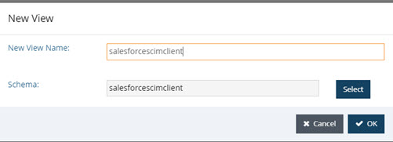

    Figure 12: Creating a Virtual View from Salesforce

15.	Select the salesforcescimclient node on the left and choose New Label on the right.

16.	Enter “object” for the Level type and “user” for the value.

17.	Click **OK**.

18.	Click object=user in the tree on the left and choose New Content on the right.

19.	Select the Users object and click **OK**.
 
    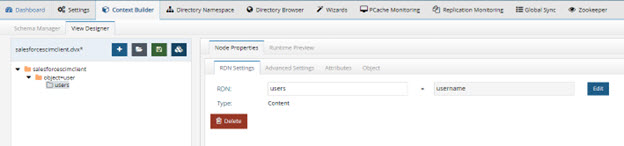

    Figure 8.13: Salesforce Virtual View

20.	For the selected users content node, click the Attributes tab.

21.	Click  to expose all available attributes in the virtual view.

22.	Click . Keep the same name (e.g. salesforcescimclient).

23.	To mount this virtual view in the RadiantOne namespace, do so from the [Main Control Panel](06-virtual-views-based-on-aggregation#mounting-virtual-views-created-with-context-builder) > Directory Namespace tab. 

24.	To test the virtual view, go to the Main Control Panel > Directory Browser tab and navigate below the naming context where you mounted the view in step 23. Your Salesforce user accounts are shown.

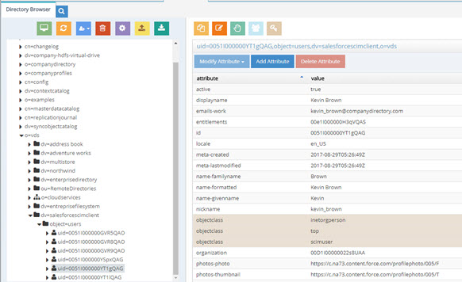

Figure 14: Sample Run Time Virtual View from Salesforce

### JDBC Access

As an alternative to using SCIM, RadiantOne includes a JDBC driver to virtualize Salesforce. This section describes the configuration.

1.	On the Main Control Panel > Settings tab > Server Backend section, go to DB Data Sources.
1.	On the right, click on radiantsalesforce and click **Edit**.

    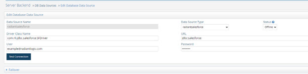

    Figure 8.15: Salesforce Custom Data Source

1.	Enter your Salesforce user email in the User property.
1.	Enter your Salesforce user’s password (which is your password appended with the [security token](#getting-a-security-token-from-salesforce) you received from Salesforce) in the Password property.
1.	If you are connecting to a production instance of Salesforce, the URL value should be: jdbc:salesforce:
If you are connecting to a sanbox/dev instance of Salesforce, the URL value should be: 

    jdbc:salesforce:<sandboxURL>

    e.g. `jdbc:salesforce:https://test.salesforce.com/services/Soap/u/30.0`

1.	Click **Save**. At this point, the default Salesforce view located at dv=salesforce,o=cloudservices,o=vds should return your data (contacts and accounts are the objects defined in the view).
1.	To view the schema associated with the radiantsalesforce data source, go to the Context Builder tab, Schema Manager sub-tab and open the schema named salesforce. The objects that can be virtualized from Salesforce are described in this file.
1.	To create a new virtual view, use the Context Builder tab > View Designer sub-tab. For details on using View Designer, see the [RadiantOne Context Builder Guide](/context-builder-guide/introduction.md).

#### Getting a Security Token from Salesforce

You should consult your Salesforce documentation for steps on how to acquire a security token for accessing Salesforce. The steps below provide general guidance and may not reflect the latest steps in Salesforce.

1.	Log in to Salesforce with the account you will use to connect to Salesforce from RadiantOne.

2.	In the top right header of the main page, locate the link with your name. 

3.	Click the down arrow and select My Settings.

4.	On the My Settings Page expand Personal.

5.	Select the Reset My Security Token option. Clicking the Reset Security Token button sends an email (to the email address associated with your Salesforce account) containing a new security token. Record this token string as you need to use this as part of the password when configuring the RadiantOne database data source that points to your Salesforce instance.
 
## Azure Active Directory

### Create Azure AD Application

If you have not already created an application in Azure AD, you must do so prior to configuring RadiantOne. 

>**Note - The steps below provide general guidance and may not reflect the latest Microsoft Azure AD interface. For more detailed configuration steps, refer to the Microsoft Azure Active Directory documentation.**

1.	In the Microsoft Azure portal associated with your Azure AD, click on Manage -> App Registrations and then the New Registration button.

2.	Provide a name for the application.

3.	Select the option for “Accounts in this organizational directory only” for the Supported Account Types.

4.	You do not need to provide a Redirect URI.

5.	Click **Register**. The registered app is displayed. Take note of the Application ID.

    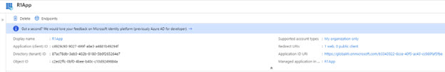

    Figure 8.16: Azure AD Application

6.	Click the application to access the specific settings.
7.	Navigate to Certificates & Secrets.

8.	In the Client Secret Section, click **New Client Secret**.

    >[!note] If you configured a certificate to use instead of a client secret, you will reference the certificate in the RadiantOne configuration instead and can skip this step and steps 9-10 below.

9.	Enter a description, expiration and click **Add** .

10.	Take note of the secret key value displayed.

11.	Navigate to API Permissions and click Add a Permission.

12.	RadiantOne supports both the legacy Azure Active Directory Graph API and the Microsoft Graph API. If you use the default graphapi custom data source in RadiantOne, it uses the legacy Azure Active Directory Graph API. If you use the default mgraph [custom data source](#configure-a-radiantone-scim-data-source) in RadiantOne, it uses the Microsoft Graph API. On the Microsoft API tab, be sure to select permission for the applicable API, based on what custom data source you are going to use.

    >[!note] Azure Active Directory Graph is in the legacy API section. Since support for the Azure Active Directory Graph API will soon be deprecated, it is recommended you use the RadiantOne mgraph custom data source and the Microsoft Graph API.

13.	Select Application permissions for the Type.

14.	Enable Directory.Read.All for read-only access. If you want read/write access to the data, enable the Directory.ReadWrite.All access.

    >[!note] If you need to be able to delete groups, you must also have the Group.ReadWrite.All permission.

    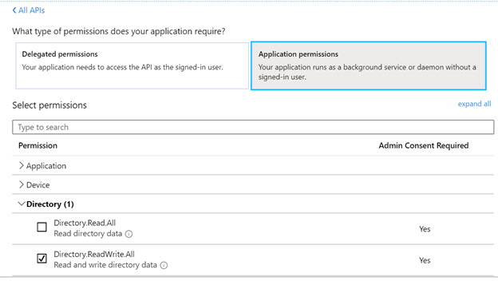
 
    Figure 8.17: Azure AD Application Permissions

15.	Click **Add Permissions**.

16.	In the Configured Permissions section, click Grant Admin Consent.

17.	Click Yes.

>[!note] It might take a few minutes for the permissions to take effect. If you change the permissions after you have started testing with RadiantOne, you should restart the RadiantOne service to force the new permissions to take effect.

Remember, if you are going to use the graphapi custom data source (as outlined in the next section) then the API permissions (for read/write access) should be assigned to the Azure Active Directory Graph API.

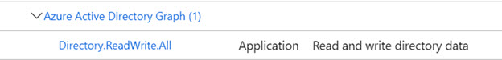

Figure 18: Read and write permissions for the Azure Active Directory Graph API
 
If you are going to use the mgraph custom data source (as outlined in the next section) then the API permissions (for read/write access) should be assigned to the Microsoft Graph API.

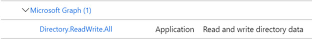

Figure 19: Read and write permissions for the Microsoft Graph API. 
 
To support delegating authentication requests to Azure AD (RadiantOne getting an LDAP bind request and sending the credentials checking to Azure AD), when using the mgraph custom data source, set “Treat Application as a public client” to Yes in the Authentication configuration for the application.

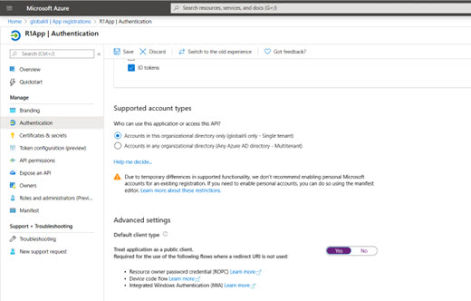

Figure 20: The "Treat Application as a public client" option

To support deleting user entries in Azure AD, one additional application API permission is required: User.ReadWrite.All. To support deleting groups, you must also have the Group.ReadWrite.all permission.

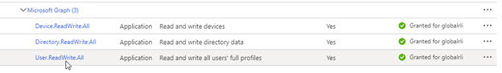

Figure 21: The User.Read.Write.All permission
 
### Configure RadiantOne Custom Data Source

The Azure application APPLICATION ID and SECRET KEY (or Certificate) described in the previous section are required to configure the Azure AD data source in RadiantOne.

RadiantOne supports both the legacy Azure Active Directory Graph API and the Microsoft Graph API. If you use the default graphapi custom data source in RadiantOne, it uses the legacy Azure Active Directory Graph API. If you use the default mgraph custom data source in RadiantOne, it uses the Microsoft Graph API. 

>[!note] Since the Azure Active Directory Graph API will soon be deprecated by Microsoft, it is advised to use the mgraph custom data source.

1.	On the Main Control Panel > Settings tab > Server Backend section, go to Custom Data Sources.

2.	On the right, click either the *graphapi* or *mgraph* data source and click Edit.

    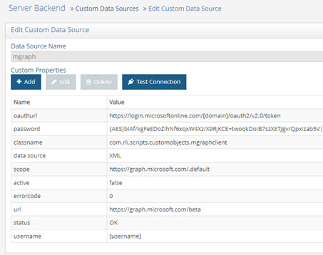 

    Figure 8.22: Azure AD Custom Data Source

3.	Select the username property and click **Edit**.

4.	Enter the value of the Azure AD Application ID.

5.	(Optional) If you are connecting to Azure AD with a certificate instead of a client secret, complete steps 5-14. Otherwise, skip to step 15. Click Add and create a property named “clientid”.

6.	Enter the Azure AD Application ID for the clientid property value and click **OK**.

7.	Click **Add** and create a property named auth_cert_password.

8.	Enter the value of your certificate password for the auth_cert_password property and click **OK**.

9.	Click **Add** and create a property named auth_cert_path.

10.	Enter the value of your certificate path for the auth_cert_path property and click **OK**.

11.	Click **Add** and create a property named auth_tenant.

12.	Enter the value of your azure AD tenant for the auth_tenant property and click **OK**.

13.	Click **Add** and create a property named auth_type.

14.	Enter the value access_token_with_certificate and click OK.

15.	(Optional) If you are using a client secret instead of a certificate, select the password property and click Edit.

16.	(Optional) If you are using a client secret instead of a certificate, enter the secret key associated with your Azure AD application. 

17.	Select the URL property and click Edit. Enter the URL for your Azure AD tenant (if using graphapi, this would look like: `https://graph.windows.net/<your _tenant_name>`. If using mgraph, this would look like: https://graph.microsoft.com/beta).

18.	Click **OK**.

19.	Select the oauthURL property and click **Edit**. 

20.	Enter the URL for your Azure AD tenant token endpoint (if using graphapi, this would look like: `https://login.microsoftonline.com/<your _tenant_name>/oauth2/token`. If using mgraph, this would look like: `https://login.microsoftonline.com/<your _tenant_name>/oauth2/v2.0/token`).

21.	Click **OK**.

22.	Select the active property and click **Edit**.

23.	Enter true to activate the data source.

24.	Click **OK**.

25.	If your company requires API calls to be made through a Web Proxy Server, add a property named “proxy” with a value that points to the proxy server and port (e.g. rli.vip.proxy.com:9090). If SSL is required, add a property named “proxyssl” with a value of true. 

>[!note] If SSL is used, ensure RadiantOne trusts the public certificate for the proxy server. To manually trust the certificate, import it the RadiantOne Client Certificate Truststore from the Main Control Panel > Settings > Security > Client Certificate Truststore.

26.	Click **OK**.

27.	(If using the mgraph custom data source) Select the scope property and click Edit. If the scope doesn’t exist, click Add to create it.

28.	The scope property value should be: https://graph.microsoft.us/.default for U.S. Government tenants (and https://graph.microsoft.com/.default for non-government tenants).

29.	Click **OK**.

30.	(If using the mgraph custom data source and Azure AD contains large volumes of users and/or groups; ~50K+ users) add two new properties: **max_retries_on_error** and **retry_interval_on_error**. These properties dictate the behavior of error recovery when initializing persistent cache on the virtual view of the Azure AD backend. Max_retries_on_error defines the number of retries when an error is encountered. This must be a positive, numeric value. After the maximum retries is exhausted, the exception is logged and the persistent cache initialization is stopped. If this property is not present, or contains an invalid value, no retry logic is used. Retry_interval_on_error indicates the amount of time to wait before the next retry. This value is in milliseconds. If this property is not present, or contains an invalid value, a default value of 10000 ms (10 seconds) is used.

>[!warning] After you successfully initialize the persistent cache, edit the mgraph custom data source and delete the max_retries_on_error and retry_interval_on_error properties so they don’t interfere with the persistent cache connector refresh logic which enforces similar properties.

31.	If you are going to virtualize Azure AD Groups, see Working with Azure AD Groups and you might need to add more properties to the graphapi data source described in these steps.

32.	Click **Save**. At this point, if you are using the graphapi custom data source, the default Azure view located at dv=graphapi,o=cloudservices,o=vds should return your data. If you are using the mgraph custom data source, you must create a new Root Naming Context on the Directory Namespace tab and mount the mgraph.dvx (default virtual view) in order to see the data.

>[!note] If you are using Azure Active Directory B2C, you can use the graphapib2c custom data source instead.

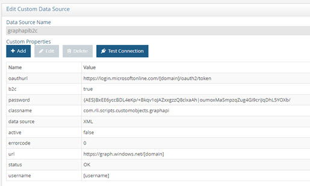

Figure 23: Azure AD B2C Custom Data Source

#### Working with Azure AD Groups

When working with Azure AD groups, the entries can be returned either with or without the members. Both options are described in the following sections.

>[!warning] This section is only applicable when using the graphapi custom data source. If you are using the mgraph custom data source, the group members are always returned with their virtual DNs (as long as users are in the same view definition as groups), comprised of either the user’s ID (GUID) or userPrincipalName depending on which attribute is defined as the “primary key” of the “Users” object in the mgraph.orx/mgraph.dvx files. Keep in mind that the member value must match the definition of the user in the view. For example, a group member identified by user=adot@globalrli.onmicrosoft.com,Category=User,dv=mgraph should match a user entry at this location/DN. If the group member is identified by the ID (e.g. users=859bab3d-1a09-4a7c-acc0-b1f2bef16f05,object=users,dv=graphapi,o=cloudservices,o=vds), then the user location/container in the view defintion should be based on the ID of the user as well.

##### Returning Group Members

If you are virtualizing Azure AD groups using the default graphapi custom data source, the default behavior of RadiantOne is to get the group members returned as DNs comprised of the user's userPrincipalName. This can be very time-consuming due to the extra processing required by RadiantOne to look-up and compute the userPrincipalName for each member. Therefore, this approach is only feasible if you have fewer than 500 relatively small groups (having fewer than a few hundred members).  An example is shown below.

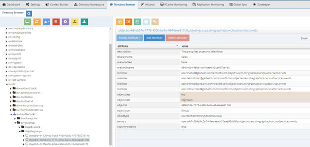

Figure 8.24: Group Members Returned with UserPrincipalName in the DN

If you have more than 500 groups and/or large groups (many members) you can optimize the return of members by adding memberoid=true in the graphapi custom data source. With the addition of this setting, the group members are returned as DNs comprised of the user's ObjectID instead of the userPrincipalName. This approach is more efficient since there is no extra translation of the member DNs. An example is shown below.

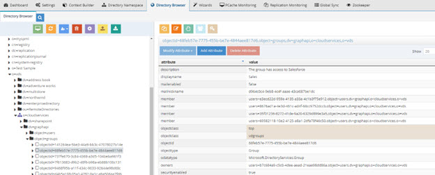

Figure 25: Group Members Returned with ObjectID in the DN

To add the memberoid property:

1.	Navigate to the Main Control Panel > Settings > Server Backend > Custom Data Sources.

2.	Select graphapi and click **Edit**.

3.	Click **Add**.

4.	Enter memberoid as the property name.

5.	Enter true for the value.

6.	Click **OK**.

    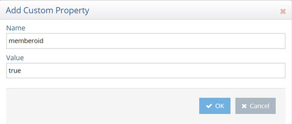

    Figure 26: Adding Memberoid Property

7.	Click **Save**.

8.	Since the group members are returned with their ObjectID (comprising the DN), you must make sure the corresponding virtual view of Azure AD users is also based on ObjectID. The default graphapi.orx schema and graphapi.dvx virtual view are based on userPrincipalName not ObjectID. To change the default schema, open graphapi.orx in Main Control Panel > Context Builder tab > Schema Manager sub-tab (it is listed on the Custom Schemas tab). 

9.	Right-click on the Users object and choose Edit Primary Key. 

10.	Define the Objectid attribute as the primary key and remove userPrincipalName. 

    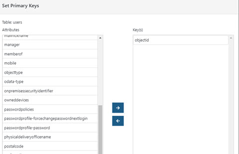

    Figure 8.27: Modifying Primary Key for Users Object

11.	Click **Apply**. 

12.	Save the schema. 

13.	Open graphapi.dvx in Main Control Panel > Context Builder tab > View Designer sub-tab. 

14.	In the tree view on the left, below graphapi, expand Object=Users and select the users content node. 

15.	Click **Delete** to remove this old definition. 

16.	In the tree view on the left, below graphapi, click Object=Users and choose **New Content** on the right. 

17.	Select Users and click **OK**. 

18.	On the Attributes tab for this node, use  to define specific attributes as part of the view, or click  to define all attributes.

    >[!warning] If you do not require directReports, ownedDevices, registeredDevices or other backlink attributes to be returned, avoid defining them in the virtual view. This will avoid costly lookups to return these attributes and greatly improve performance. If you need to support searches on surname, be sure to add “sn” as the Virtual Name as outlined in Virtualizing Surname/SN Attribute.

19.	Click  to save the virtual view.

20.	From the Main Control Panel > Directory Browser, expand the virtual view (e.g. o=vds > o=cloudservices > dv=graphapi > object=users) and ensure the user DN is returned with the Object ID. This matches how they are returned in the group membership.

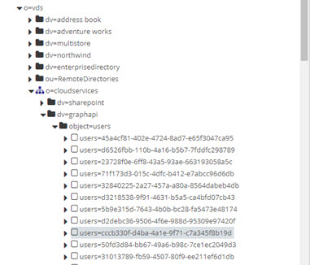

Figure 8.28: Users Returned with ObjectID in the DN

##### Returning Groups without Members for Searches with One Level or Sub Tree Scope

If you only need the basic group information without the members, on queries containing one level or sub tree scope, you can configure ignoremember=true in the graphapi custom data source. This is the most efficient method to get groups from Azure AD since no extra request for members is required. With this property, RadiantOne does not return members in the group entries for queries containing one level or sub tree scope. The members are only returned for group queries using base scope. On base searches, the members are returned with their UserPrincipalName in the DN.

>[!warning] If you set memberoid=true as described in the previous section, that value overrides the ignoremember=true setting. It is not recommended to use both ignoremember=true and memberoid=true.   
If you do not want group members returned at all, no matter the search scope, edit the graphapi.dvx file in the Main Control Panel > Context Builder tab > View Designer sub-tab and remove the member attribute on the Attributes tab, for the objectid content node below object=groups.**

To add the ignoremember property:

1.	Navigate to the Main Control Panel > Settings > Server Backend > Custom Data Sources.

2.	Select graphapi and click Edit.

3.	Click **Add**.

4.	Enter ignoremember as the property name.

5.	Enter true for the value.

6.	Click **OK**.

    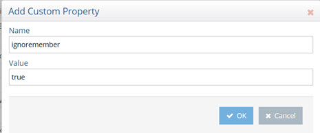

    Figure 8.29: Adding Ignoremember Property

7.	Click **Save**.

In the example shown below, group entries are returned without members. Note that a basic LDAP command line query is used. Using the Main Control Panel -> Directory Browser tab can be confusing because the “click” on the group entry (when browsing) is actually doing a base search, in which case the members are always returned.

`C:\SunResourceKit>ldapsearch -h doc-e1win1 -p 2389 -D "cn=directory manager" -w secretsecret -b "object=groups,dv=graphapi,o=cloudservices,o=vds" -s one (displayName=Sales)`

`version: 1`
 `dn: objectid=68feb57e-7775-455b-be7e-4844aee817d6,object=groups,dv=graphapi,o=cloudservices,o=vds`
 `mailnickname: d964c0c4-9eb8-4c4f-aaae-43ca687be1dc
owners: users=b7c684a9-c5c0-4dee-aead-21eae98dd86a,object=users,dv=graphapi,o=cloudservices,o=vds`
 `displayname: Sales`
 `odatatype: Microsoft.DirectoryServices.Group`
 `objectclass: top`
 `objectclass: vdgroups`
 `objectid: 68feb57e-7775-455b-be7e-4844aee817d6`
 `securityenabled: true`
 `objecttype: Group`
 `description: The group has access to Salesforce`
 `mailenabled: false`

#### Working with Multiple Azure AD Tenants

To work with multiple Azure AD tenants, you can clone the default graphapi or mgraph custom data source and change the properties to point to the tenant.

1.	From the Main Control Panel > Settings tab > Server Backend > Custom Data Sources, select graphapi and click **Clone**.

2.	Enter a data source name (e.g. graphapitenantb) and click Clone.

3.	Click OK to exit the confirmation.

4.	Select the new custom data source (e.g. graphapitenantb) and click **Edit**.

5.	Enter the properties needed to connect to the applicable tenant. The properties were described in the [previous section](#configure-radiantone-custom-data-source).

### Azure AD Schema

A schema file contains the metadata leveraged by RadiantOne to create virtual views of a data source. The default graphapi custom data source is associated with a schema file named graphapi.orx. The default mgraph custom data source is associated with a schema file named mgraph.orx. These files can be opened and modified in the Schema Manager sub-tab on the Main Control Panel > Context Builder tab. For details on this tool, see the [RadiantOne Context Builder Guide](/context-builder-guide/introduction.md).

The default objects defined in the schema are Contacts, Devices, Groups and Users. 

Any attributes that you want clients to use in a search filter, or insert/update, must be manually added to the applicable object definition in the schema file (right-click on the Fields level below the object and choose Add New Attribute). Once they are added to the schema file, make sure the attribute(s) is also properly added to the [virtual view](#azure-ad-virtual-view).

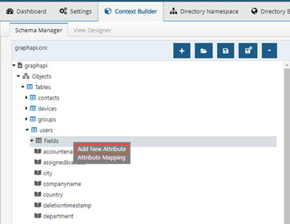

Figure 30: Graphapi Schema File

>[!note] If you are using Azure AD B2C, use the graphapib2c.orx file instead of the graphapi.orx file.

#### Working with Extension Attributes

To work with extension attributes in Azure objects, add the attribute name to the applicable object in the schema file (graphapi.orx or mgraph.orx based on the Azure AD API you are using). For example, if the extension attribute in Azure AD was: extension_0fe2bf0f259e4b2b8eee56ec9365117c_skypeId add an attribute named “extension_0fe2bf0f259e4b2b8eee56ec9365117c_skypeId” that has a virtual name/alias of “skypeId” to the object. Notice that the extension attribute name is comprised of your application ID. If you don’t know the application ID, you can go to https://graphexplorer.azurewebsites.net. Click the login link at the top-right corner, and sign in using the credentials for an administrator account in your organization’s directory. After you have signed in, click the URL in the resource text box (next to the GET button) and select the URL that ends in applications/ then click GET or click the enter key. Find the desired application entry from the results, and then copy its appId value, such as the following: "appId": "41ebd369-484d-4088-bab5-c9077f9e13a7" 

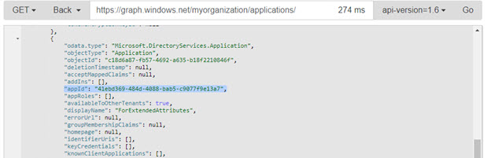

Figure 31: Copying the appId value
 
Once you have the appId, follow the steps below.

1.	On the Main Control Panel > Context Builder > Schema Manager sub-tab, right-click on the Fields level below the object and choose **Add New Attribute**.

2.	Enter the extension attribute full name using the appId value with the hyphens removed (e.g. extension_41ebd369484d4088bab5c9077f9e13a7_skypeId) with an alias for the friendly attribute name (e.g. skypeId).

    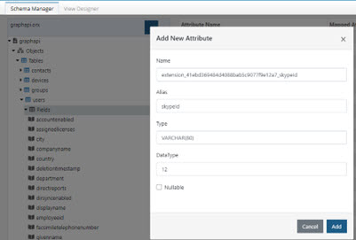

    Figure 8.32: Example Extension Attribute

3.	Click **Add**.

4.	Click **Save**.

>[!warning] The case used in Azure AD to create the extension attribute must match the case used when adding the extension attribute to the schema. In the example above, the “I” in skypeId is in uppercase. Therefore, when adding the extension attribute to the graphapi schema, make sure to follow this case-sensitive syntax.

### Azure AD Virtual View

The default graphapi custom data source is associated with a virtual view file named graphapi.dvx. The default mgraph custom data source is associated with a virtual view file named mgraph.dvx. These files can be opened and modified in the Main Control Panel > Context Builder tab > View Designer sub-tab. 

>[!note] If you are using Azure AD B2C, use the graphapib2c.dvx file instead of the graphapi.dvx or mgraph.dvx files.

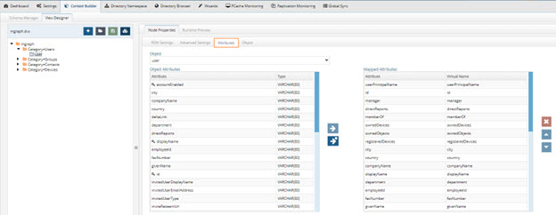

Figure 8.33: Mgraph Virtual View

If you’ve modified the graphapi.orx or mgraph.orx schema files to support extension attributes or if you want to limit the Azure AD attributes returned in the virtual view, you can modify the graphapi.dvx/mgraph.dvx files accordingly. 

1.	On Main Control Panel > Context Builder tab > View Designer sub-tab, choose File > Open > View. 

2.	Select graphapi.dvx or mgraph.dvx and click **OK**. 

3.	In the Tree View, expand below the object you’ve added extension attributes for. 

4.	Select the content node associated with the object.

5.	On the Attributes tab, select the extension attribute from the source attribute list (on the left) and use the  button and move it to the published attribute list (on the right). 

>[!warning] If you do not require directReports, ownedDevices, registeredDevices or other backlink attributes to be returned, avoid defining them in the virtual view. This will avoid costly lookups to return these attributes and greatly improve performance.

6.	Save the virtual view. The run time view mounted at dv=graphapi,o=cloudservices,o=vds should now return the extension attributes. If you are using the mgraph.dvx file, you can create a New Root Naming Context in the Main Control Panel > Directory Namespace tab and mount the mgraph.dvx file there. 

To create a new virtual view, load the graphapi.orx or mgraph.orx schema file in View Designer and define the new view. For details on using View Designer, see the RadiantOne Context Builder Guide.

#### Returning MemberOf for Users 

Users have a memberOf attribute which is the back link to the group entry to which they are related.  The value of the memberOf attribute is comprised of the Group entry's GUID. The default mgraph.dvx virtual view also returns a friendly *memberOfDisplayName* attribute that contains the display name attribute of the group entry. Clients can use this value for a more friendly display of the groups the user is associated with.

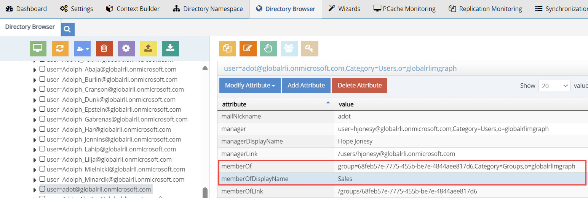

#### Virtualizing Surname/SN Attribute

The Azure AD schema uses the attribute “surname” to store a user’s last name. The RadiantOne default LDAP schema includes the following attribute type definition for “sn”:

`attributeTypes: ( 2.5.4.4 NAME ( 'sn' 'surName' ) DESC 'Standard LDAP attribute type' SUP name SYNTAX 1.3.6.1.4.1.1466.115.121.1.15 X-ORIGIN 'RFC 2256' )`

This schema definition can cause problems if clients issue searches or updates for the Azure AD view using a filter of (surname=<last_name>) because RadiantOne automatically translates this into a filter of (sn=<last_name>) when it queries Azure AD. Since the attribute in Azure AD is “surname” and not “sn”, the expected entry is not returned. To avoid this, you can either configure a mapping in the virtual view to map surname to sn, or edit the RadiantOne FID schema and remove the surname mapping from the sn attribute. 

>[!note] An alias of “streetaddress” is defined for the street attribute, and can run into the same issues. Either remove the alias from the RadiantOne FID schema, or remap properly in the virtual view using the same process outlined for the surname attribute below.

To configure a mapping for the surname attribute:

1.	On the Main Control Panel > Context Builder tab > View Designer sub-tab, click . 

2.	Select graphapi.dvx or mgraph.dvx and click OK. 

3.	Select the “users” content node (below object=users if using the graphapi.dvx file, or the “user” content node below Category=Users if using mgraph.dvx file) in the Tree View.

4.	Choose the Attributes tab. 

5.	Enter sn in the Virtual Name column for the surname attribute.

6.	Save the virtual view.
 
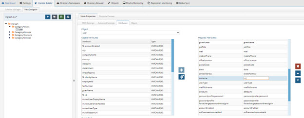 

Figure 8.34: Mgraph Virtual View with Mapping for Surname Attribute

This configuration supports clients that request filters with (sn=<last_name>) or (surname=<last_name>).

If you only want to support client requests with filters using (surname=<last_name>), you can edit the RadiantOne LDAP schema to remove the surname alias from the sn attribute.

1.	Navigate to <RLI_HOME>\vds_server\conf and edit ldapsechema_00.ldif. 

2.	Remove the 'surName' and the ( ) from the following definition: attributeTypes: ( 2.5.4.4 NAME ( 'sn' 'surName' ) DESC 'Standard LDAP attribute type' SUP name SYNTAX 1.3.6.1.4.1.1466.115.121.1.15 X-ORIGIN 'RFC 2256' ). 

3.	Save the file.

## Google Directory

>[!note] The steps below provide general guidance and may not reflect the latest Google Directory interface. For more detailed configuration steps, refer to the Google Directory documentation.

To virtualize Google Directory, a Service Account on the domain must be set to enable the connection. 

1.	Go to the developer console and log in as an administrator.   Developer console - `https://console.developers.google.com/project`   Admin console - `https://admin.google.com` or `https://admin.google.com/<your-domain>/AdminHome`

2.	Create a new project. 

3.	Click the new project and accept the default id if requested.

4.	On the left tab, go to “APIs & auth” > APIs and enable the “Admin SDK” API and make sure it displays in the list of enabled APIs and the status is ON.

5.	Go to “APIs & auth” > credentials. 

6.	In OAuth, create a new client ID and select the type “Service Account” and validate it by clicking “Create Client ID”.

    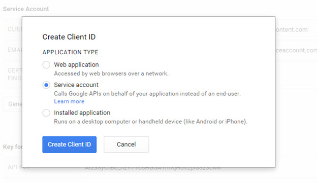

    Figure 8.35: Google Service Account

7.	Verify that the service account appears in API Project > Permissions.

    >[!warning] Take note of the client ID (<numbers-numbers&letters>.apps.googleusercontent.com) and the email address (`<same>@developer.gserviceaccount.com`) attached to the service account created, as you will need them later. Also notice that your browser just downloaded the P12 certificate that is needed to authenticate the Service account.

8.	Go to the Admin console and log in as an administrator for your domain. 

9.	Go to Security (if it does not appear on the dashboard/homepage, click “More controls” at the bottom).

10.	In Security, click API reference and check “Enable API access”.

    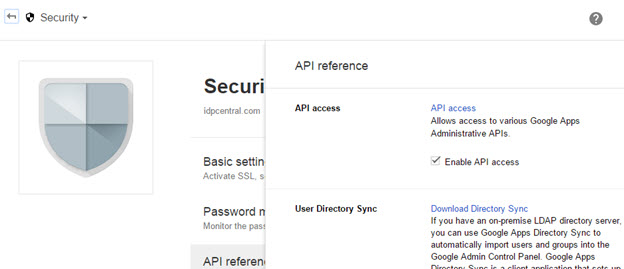

    Figure 8.36: Enabling Google API Access

11.	In Security, click “show more” then “Advanced settings” then “Manage API client access”. Here you can authorize the service account with different scopes that constrain its access to data. 

12.	In client name, fill in the client ID of the service account, and in the API scopes textbox fill in the following scopes as is:

    https://www.googleapis.com/auth/admin.directory.user,https://www.googleapis.com/auth/admin.directory.group,https://www.googleapis.com/auth/admin.directory.orgunit,https://www.googleapis.com/auth/admin.directory.device.mobile,https://www.googleapis.com/auth/admin.directory.device.chromeos

13.	Click “Authorize”. The service account is now entitled to view and manage all Directory data.

Figure 37: Enabling Google API Access

**Define Google Directory Data Source**

RadiantOne includes a custom data source defined for Google Directory. This default data source can be updated with connection criteria to your Google Directory instance. These steps are described in this section.

>[!note] You need the following information to update the data source. This information was described in the previous section.
 domain: your domain name (e.g. radiantlogic.com).
 service_account_user: the email of the admin account you created the service account with.
 service_account_email: the email of the service account. 
 service_account_p12_certificate: the full path on the server to the p12 certificate file. 

1.	On the Main Control Panel > Settings tab > Server Backend section, go to Custom Data Sources.

2.	On the right, click on googledirectory and click **Edit**.

    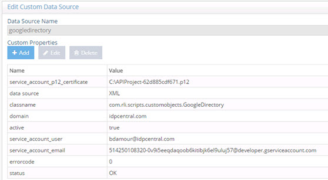

    Figure 8.38: Google Directory Custom Data Source

3.	Select the domain property and click **Edit**.

4.	Enter your domain name in the Domain parameter.

5.	Select the service_account_p12_certificate property and click **Edit**.

6.	Enter the full path to your certificate, including your certificate name and click OK.

7.	In the Custom Properties, select the service_account_user property and click **Edit**.

8.	Enter the value of the user account associated with the super admin role in your Google Directory and click **OK**.

9.	In the Custom Properties, select the service_account_email property and click **Edit**.

10.	Enter the value of the email account associated with your service account in the Google Directory and click **OK**. 

11.	Click **Save**. 

12.	A default virtual view named googledirectory.dvx is included with RadiantOne. This virtual view is associated with the googledirectory data source. Mount this virtual view in your RadiantOne namespace to view the data from your Google Directory. To mount the view, go to the Main Control Panel -> Directory Namespace tab.

13.	Although the googledirectory virtual view can be mounted at any available label in the namespace, this guide describes how to mount the view below a new root naming context. On the Directory Namespace tab, click **New Naming Context**.

14.	Enter a new root naming context (e.g. o=googledirectory) and select the Virtual Tree option.

    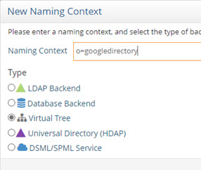

    Figure 8.39: New Root Naming Context

15.	Click **Next**.

16.	Choose the option to Use an Existing View (.dvx) and click **Browse** to select the googledirectory.dvx file.

17.	Click **OK**.

18.	Click **Ok** to complete the wizard and **OK** again to exit the confirmation.

>[!note] To view the schema associated with the googledirectory data source and default virtual view, go to the Main Control Panel > Context Builder tab > Schema Manager sub-tab and open the schema named googledirectory. The objects that can be virtualized from Google are described in this file. To create a new virtual view, use the View Designer sub-tab on the Context Builder tab and load the googledirectory.orx file. For details on using View Designer, see the [RadiantOne Context Builder Guide](/context-builder-guide/introduction.md).

You can browse the runtime virtual view from the Main Control Panel > Directory Browser tab. An example is shown below.

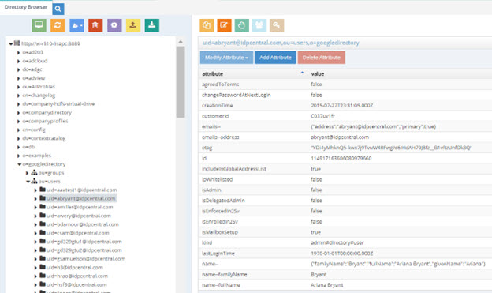

Figure 40: Sample Virtual View of Google Directory

## Okta Universal Directory

RadiantOne includes a default virtual view for Okta located at <RLI_HOME>/vds_server/dvx/okta2.dvx. You can use the default view by configuring the connection to your Okta directory as described in the [Configure RadiantOne Custom Data Source](#configure-radiantone-custom-data-source-1) section and mounting it in the RadiantOne Namespace. If you have custom attributes configured in your Okta directory that you would like to include in the virtual view, you can customize the virtual view with the steps outlined in [Extend Virtual View with New Okta Attributes](#optional-extend-virtual-view-with-new-okta-attributes), and [Modify the Virtual View](#optional-modify-the-virtual-view).

The virtual view can be aggregated and/or joined with virtual views from other identities silos; however this extended configuration is out of the scope of this document.

### Configure RadiantOne Custom Data Source 

1.	Navigate to the Main Control Panel > Settings tab > Server Backend section > Custom Data Sources > oktaclient 

1.	On the top, click **Edit**. 

1.	In the Custom Properties section, select the url property and click **Edit**.

1.	Enter the url required to connect to your Okta Rest service (e.g. https://myco.oktapreview.com/) and click **OK**.

1.	In the Custom Properties section, select the apitoken property and click **Edit**.

1.	Enter the apitoken obtained from your Okta Admin and click **OK**. 

1.	(Optional) If you have enabled the Advanced Search option in Okta, you can leverage it by creating a new property named “usesearch”. Click ADD and create a property named usesearch with a value of true like in the example shown below.  

    

    Figure 41: Creating the usesearch property

1.	Click **OK**.

1.	(Optional) If your company requires API calls to be made through a Web Proxy Server, click ADD and create a property named “proxy” with a value that points to the proxy server and port (e.g. rli.vip.proxy.com:9090).

1.	Click **OK**.

1.	(Optional) If you configured a “proxy” property and indicated the Web Proxy Server and port, and SSL is required, click **ADD** and create a property named “proxyssl” with a value of true.

1.	Click **OK**.

1.	Click **Save**.

    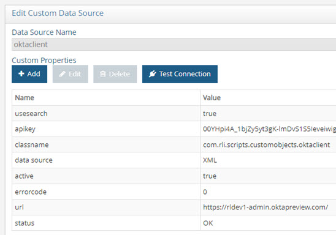

    Figure 8.42: Okta Custom Data Source Configuration
 
1.	From the Main Control Panel -> Directory Browser tab, navigate to the location where you’ve [mounted your virtual view](#optional-modify-the-virtual-view) (okta2.dvx). 

Figure 43: Sample Run Time Virtual View from Okta Universal Directory

### (Optional) Extend Virtual View with New Okta Attributes 

Virtual views are based on a metadata configuration file containing default attributes describing users and groups in the Okta directory. If you have custom attributes in Okta that you would like to expose in your virtual view, follow the steps in this section to add them. 

1.	Go to the Main Control Panel > Context Builder tab > Schema Manager sub-tab.

2.	Click .

3.	On the Custom Schemas tab, select okta2. Click Open. The okta2.orx file opens.

4.	To add a new attribute for users in the schema, expand the branches under okta2 > Objects > Tables > users > Fields. For groups, expand the branches under okta2 > Objects > Tables > groups > Fields.

5.	Right click on Fields and select Add New Attribute.

    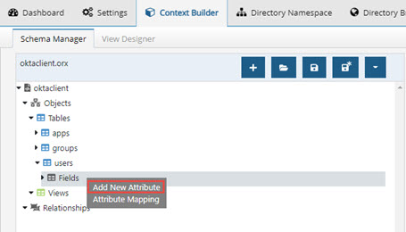

    Figure 44: Add New Attributes

6.	The ‘Add New Attribute’ opens. The Name of the attribute needs to be prefixed by ‘profile-’. For example, a custom attribute ‘uid’ in okta, should be entered as profile-uid.

    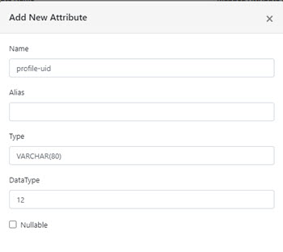

    Figure 8.45: Attribute Name

7.	Click OK.

8.	Repeat this process to add all the required custom attributes.

9.	Click .

### (Optional) Modify the Virtual View

If you have modified the metadata as described in Extend Virtual View with New Okta Attributes, update the virtual view to reflect the changes.

1.	Go to the Main Control Panel > Context Builder tab > View Designer sub-tab.

2.	Click .

3.	Select okta2 and click **OK**.

4.	In the virtual view definition, expand below object=users and select the users content level.

5.	Select the Attributes tab on the right.

6.	Select the custom attribute from the list on the left and then use the  button to map the attribute to the list on the right. Attributes shown in the right column are returned in the virtual view. If you want the attribute to display with a different name, click in the Virtual Name column and enter the name. In the example below, a custom attribute named profile-rli is added to the virtual view and has a virtual name of rli.

    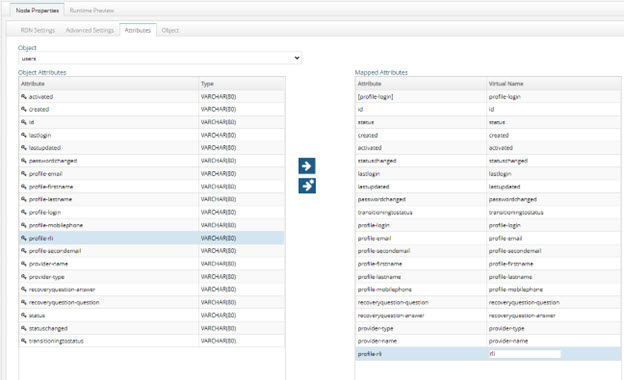

    Figure 46: Virtual View Definitions – Attributes

7.	To expose all Okta attributes in the virtual view, click the  button.

8.	If you’ve added custom attributes for groups, In the virtual view definition, navigate to okta2 > object=groups.

9.	Select the groups content node.

10.	Select the Attributes tab on the right.

11.	Select the custom attribute from the list on the left and then use the  button to map the attribute to the list on the right. Attributes shown in the right column are returned in the virtual view. If you want the attribute to display with a different name, click in the Virtual Name column and enter the name.

12.	Click .
 
## SailPoint IIQ

RadiantOne can virtualize the SailPoint Identity IQ database via SCIM. The configuration is described in this section.

### Configure RadiantOne SCIM Data Source

1.	In the RadiantOne Main Control Panel > Settings tab > Server Backend > Custom data Sources section, select scimclient2 and click **Edit**.

    >[!note] If you are already using the scimclient2 custom data source to virtualize a SCIM backend, click the Clone button to make a copy that you can work with for SailPoint to avoid impacting your existing configuration.

2.	Click **Advanced Edit**.

3.	Select the url property and click **Edit**.

4.	Enter the value matching your SailPoint SCIM service. The syntax is: `http://<SailPointServer>:<port>/identityiq/scim/v2`

5.	Click **OK**. 

6.	Select the username property and click **Edit**.

7.	Enter your SailPoint username (e.g. spadmin).

8.	Click **OK**.

9.	Select the password property and click **Edit**.

10.	Enter the password associated with your SailPoint user name.

11.	Click **OK**.

    >[!note] If OAuth is used for authentication, you do not need the username and password properties. Configure the oauthurl, oauthclientid, and oauthclientsecret properties instead. This is described in [OAuth Authentication](#oauth-authentication).

12.	Select the replaceonupdate property (add if it doesn’t exist). Set the value to true. This is required because the SailPoint SCIM interface doesn’t support standard update (PATCH) operations and requires a replace operation (PUT) instead. 

    >[!note] For SCIM servers that do not support PATCH operations, FID sends a PUT request to the SCIM Server, which replaces the entry.

13.	Click **Save**.

#### OAuth Authentication

For RadiantOne to support OAuth authentication in the SCIM requests to SailPoint, you must enable API Authentication in the SailPoint Admin Console.

>[!note] The steps below provide general guidance and may not reflect the latest SailPoint interface. For more detailed configuration steps, refer to the SailPoint documentation.

1.	Log into the SailPoint Admin Console as an administrator.

2.	Go to Global Settings.

    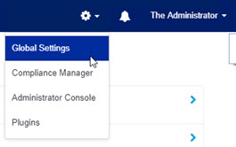

    Figure 8.47: SailPoint Global Settings

3.	Click API Authentication

    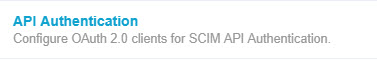

    Figure 8.48: SailPoint API Authentication

4.	Click **Create**.

5.	Enter a unique Client Name.

6.	Select the proxy user to associate with the client.

7.	Click Save.

8.	Take note of the Client Id and the Secret (click 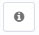 to reveal the secret).

    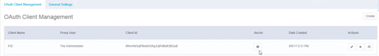

    Figure 8.49: SailPoint OAuth Client Configuration

9.	In the RadiantOne Main Control Panel > Settings tab > Server Backend > Custom Data Sources, select the configuration associated with SailPoint and click **Edit**.

10.	Click **Advanced Edit**.

11.	Click **Add**.

12.	Enter oauthurl for the Name property and enter the SailPoint Token Endpoint for the value. The syntax is:
http://<SailPointServer>:<port>/identityiq/oauth2/token 

13.	Click **OK**.

14.	Click **Add**.

15.	Enter oauthclientid for the Name property and provide the Client ID value associated with your SailPint OAuth client configuration. 
 
    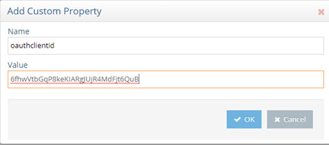

    Figure 8.50: Sample Client ID Value

16.	Click **OK**.

17.	Click **Add**.

18.	Enter oauthclientsecret for the Name property and provide the Client Secret value associated with your SailPoint OAuth client configuration.

19.	Click **OK**. 

20.	Click **Save**.

### Configure RadiantOne Virtual View

The Context Builder can be used to extract the metadata/schema from SailPoint and build a virtual view. 

1.	Go to the Main Control Panel > Context Builder tab > Schema Manager sub-tab.

2.	Click .

3.	Select the SCIM v2.0 option and click **Next**.

4.	Select the data source associated with SailPoint from the drop-down list and click **Next**.

    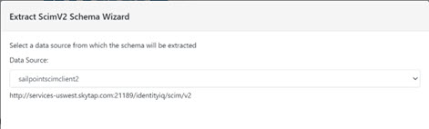
 
    Figure 8.51: SCIM v2 Schema Extraction

5.	Select the objects to extract and click Next. You can select all objects at this step because the virtual view definition can be customized to include only desired objects and attributes.

6.	Enter a file name for the schema and click Create Schema. The extracted schema opens in Schema Manager. Expand below each object to see the corresponding attributes.

7.	From the Context Builder tab > View Designer sub-tab, click .

8.	Enter a name for the virtual view.

9.	Click Select to choose the file containing the SailPoint schema on the Custom tab and click **OK***. 

    >[!note] The virtual view definition can be customized as needed. The steps in this guide create a basic virtual view.

10.	Click **OK** to create the view.

11.	Select the file name in the tree view on the left and click **New Label** on the right.

12.	Enter object for the Level Type and user for the value.

13.	Click **OK**.

14.	Select the object=user node in the tree view on the left and choose New Content on the right.

15.	Select the Users object and click **OK**.

    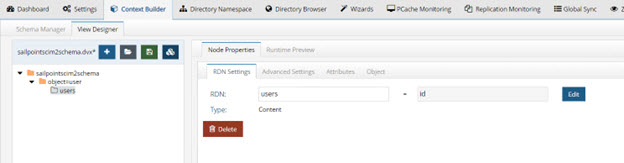
 
    Figure 52: SailPoint Virtual View

16.	For the selected users content node, click the Attributes tab.

17.	Click  to expose all available attributes in the virtual view.

    
 
    Figure 43: SailPoint Attributes Available in the Virtual View

18.	Click . 

19.	Mount this virtual view below a naming context, from the [Main Control Panel > Directory Namespace tab](06-virtual-views-based-on-aggregation#mounting-virtual-views-created-with-context-builder). 

20.	To test the virtual view, go to the Main Control Panel > Directory Browser tab and navigate below the naming context where you mounted the virtual view. Your SailPoint users are shown.

    

    Figure 54: Sample Run Time Virtual View from SailPoint

#### Configure Virtual View of Users with Groups/Entitlements

To virtualize SailPoint users with their entitlements/groups returned in the entry, you must use the Account object/resource instead of the Users object. This section describes how create a basic virtual view of accounts from SailPoint.

1.	From the Context Builder tab > View Designer sub-tab, click .

2.	Enter a name for the virtual view (e.g. sailpointscimclient2accounts).

3.	Click **Select** to choose the file containing the SailPoint schema on the Custom tab and click **OK**. 

4.	Click **OK** to create the view.

5.	Select the file name in the tree view on the left and click **New Label** on the right.

6.	Enter Object for the Level Type and Accounts for the value.

7.	Click **OK**.

8.	Select the Object=Accounts node in the tree view on the left and choose New Content on the right.

9.	Select the Accounts object and click **OK**.

10.	On the Attributes tab, click  to expose all available attributes in the virtual view. 

    >[!note] ID is the only required attribute. However, any attribute that you want clients to use in a filter (when querying RadiantOne) must be defined for the object.

11.	Click .

    
 
    Figure 55: SailPoint Accounts Virtual View

12.	Mount this virtual view below a naming context from the [Main Control Panel > Directory Namespace tab](06-virtual-views-based-on-aggregation#mounting-virtual-views-created-with-context-builder). 

13.	To test the virtual view, go to the Main Control Panel > Directory Browser tab and navigate below where you mounted the virtual view. Your SailPoint accounts are shown. For each account, the groups attribute returns the groups/entitlements the user is associated with. An example is shown below.

 
Figure 8.56: Run Time Sample of SailPoint Accounts

## PingOne Directory

RadiantOne can virtualize a PingOne Directory via SCIMv1. The configuration is described in this section. 
Configure RadiantOne SCIM Data Source

1.	In the RadiantOne Main Control Panel > Settings tab > Server Backend > Custom data Sources section, select scimclient and click **Edit**.

    >[!note] If you are already using the scimclient custom data source to virtualize a SCIM backend, click the Clone button to make a copy that you can work with for PingOne to avoid impacting your existing configuration.

2.	Select the url property and click **Edit**.

3.	Enter the value matching your PingOne service. 

    https://directory-api.pingone.com/api/directory

4.	Click **OK**. 

5.	Select the username property and click **Edit**.

6.	Enter your PingOne directory user ID.

7.	Click **OK**.

8.	Select the password property and click **Edit**.

9.	Enter the password associated with your PingOne user name.

10.	Click **OK**.

11.	Click **Add**.

12.	Enter bodyauth for the property name with a value of true. This ensures that the authentication credentials (for authenticating users in the PingOne data source) are sent in the body of the request instead of in the URL. If this property is not present, the credentials are sent to PingOne in the URL.

    
 
    Figure 57: Sample PingOne Custom Data Source

13.	(Optional) RadiantOne (as a SCIM client) uses paging when communicating with the SCIM service (backend). The default page size is 500. You can customize the page size by adding a custom property named pagesize to the data source. Click Add and enter pagesize for the property name and the page size for the value.

    
 
    Figure 58: Page Size Property for SCIM Backend

14.	(Optional) If you want to connect to PingOne directory using OAuth 2.0, click Add and complete steps 15-22. Otherwise, skip to step 23.

15.	Enter oauthurl for the Name property and enter the PingOne Token Endpoint for the value. The syntax is: https://directory-api.pingone.com/api/oauth/token

16.	Click **OK**.

17.	Click **Add**.

18.	Enter oauthclientid for the Name property and provide the Client ID value associated with your PingOne OAuth client configuration.

19.	Click **OK**.

20.	Click **Add**.

21.	Enter oauthclientsecret for the Name property and provide the Client Secret value associated with your PingOne OAuth client configuration.

22.	Click **OK**.

23.	Click **Save**.

### Configure RadiantOne Virtual View

RadiantOne includes a default SCIM virtual view that can be used to virtualize PingOne Directory (<RLI_HOME>\vds_server\dvx\scimclient.dvx). The default data source associated with this virtual view is named scimclient. If you cloned the default scimclient custom data source to work with PingOne in the previous section, you can edit the default scimclient virtual view to use your custom data source.

1.	Go to the Main Control Panel > Context Builder tab > Schema Manager sub-tab.

2.	Click .

3.	On the Custom Schemas tab, select the scimclient.orx and click Open.

4.	On the tree view on the left, right-click on scimclient and choose Edit Connection String.

5.	Click Edit to select the appropriate custom data source.

    
 
    Figure 59: Custom Data Source Associated with Virtual View

6.	Click **OK**. 

7.	Click .

    >[!warning] You can create a new virtual view instead of using the scimclient.dvx default one described in this section. However, you must first open scimclient.orx in Context Builder and Edit the Connection String to point to your appropriate custom data source. Otherwise, it continues to use the default custom data source named scimclient.

8.	Mount this virtual view below a root naming context, from the [Main Control Panel > Directory Namespace tab](06-virtual-views-based-on-aggregation#mounting-virtual-views-created-with-context-builder). 

9.	To test the virtual view, go to the Main Control Panel > Directory Browser tab and navigate below the naming context where you mounted the virtual view. Your PingOne user accounts are shown.

    
 
    Figure 8.60: Sample Run Time Virtual View from PingOne Directory

## AWS Cognito

This section describes how to virtualize AWS Cognito users and groups in RadiantOne using a default virtual view. Views created from AWS Cognito data sources are read-only, and binds are not supported. LDAP filters are also not supported. This means that when RadiantOne receives queries that contain filters from clients, those filters are not forwarded to AWS Cognito for processing. 

>[!note] To support LDAP filters, create a view of AWS Cognito and configure it for a persistent cache with periodic refresh. For information on creating your own views, refer to the Context Builder Guide. For information on configuring persistent cache with periodic refresh, refer to the [RadiantOne Deployment and Tuning Guide](/deployment-and-tuning-guide/00-preface).

To virtualize AWS cognito users and groups: 

1.	In AWS, make a note of the following values. 

    -	Pool ID
    -	Access Key ID
    -	Secret Key
 
2.	In the RadiantOne Main Control Panel, go to Settings > Server Backend > Custom Data Sources. 

3.	Select the awscognito data source and click **Edit**. The Edit AWS Data Source page displays. 

4.	Enter your AWS access key ID, secret access key, and region (optional).

5.	Click the **Advanced Edit button**. 

6.	Click the **Add** button. The Add Custom Property window opens. 

7.	Name the property poolid. In the Value field, enter the AWS pool ID value. 

8.	Click **OK**. 

9.	Click the **Add** button again. 

10.	Name the property classname. In the Value field, enter: com.rli.scripts.customobjects.awscognito
 
    

    Figure 8.61: AWS Cognito Custom Data Source

11.	Click **Save**. 

>[!note] If a confirmation box displays the message “Connection to the data source backend failed, save anyway?”, click Yes**.

12.	On the Directory Namespace tab, click the New Naming Context button. 

13.	Enter a unique naming context and select the Virtual Tree type. 

14.	Click **Next**. The Configure Virtual Tree window opens.

15.	Select Use an existing view (.dvx). 

16.	Click **Browse** next to Select File from the Server. The Choose a file on the server window opens. 

17.	Select awscognito.dvx and click **OK**. 

18.	Click **OK** again. Click **OK** to close the New Virtual Tree confirmation window. 

19.	Click the Directory Browser tab. 

20.	Click the  button. 

21.	Expand the new naming context. Expand Category=users and/or Category=groups. Verify that the naming context populated with your AWS users and groups. 

 
Figure 8.62: Sample Virtual View of AWS Cognito Users and Groups
