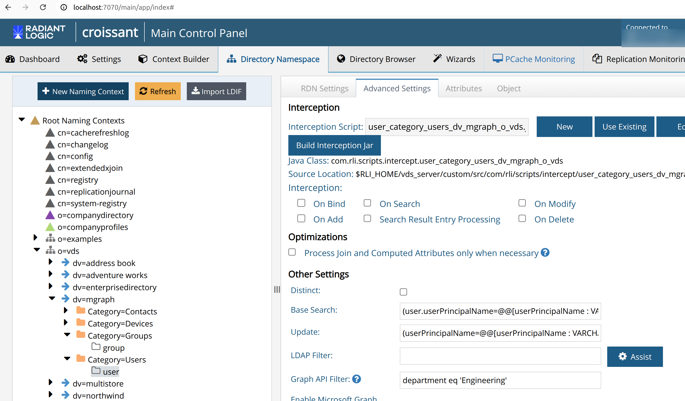
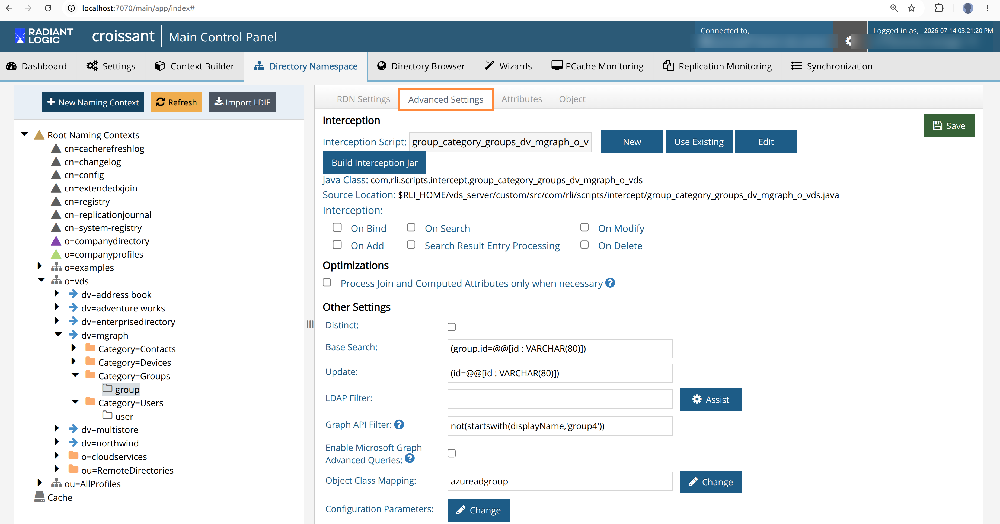
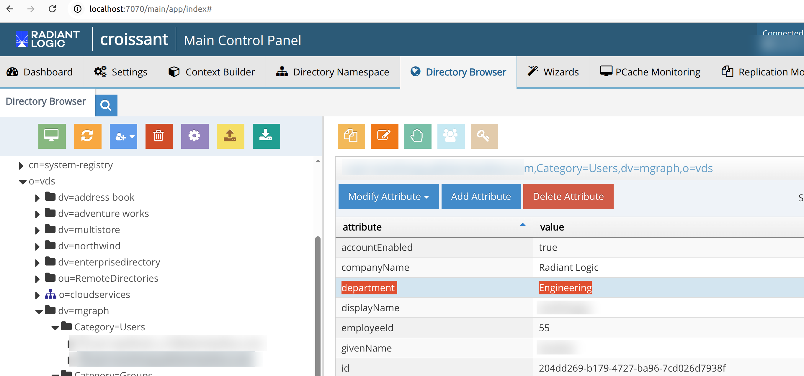
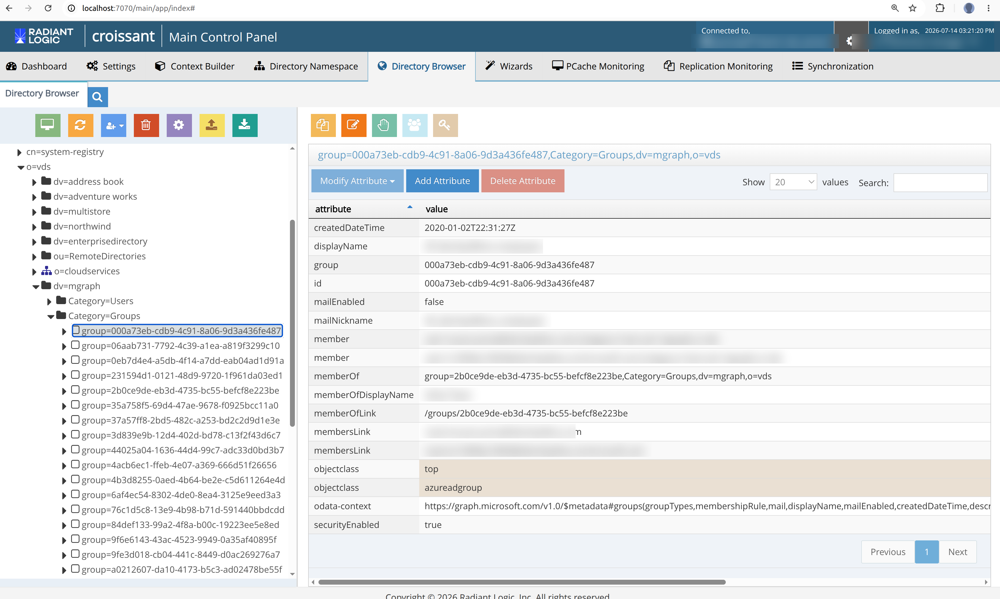

## Configuring a Graph API Filter on Entra ID Views

When using the **mgraph** custom data source, you can configure a **Graph API Filter** directly on content or container nodes in your virtual view. This filter is passed directly to Microsoft Graph API "list object" queries (for example, for users, groups, or devices) using the `$filter` query parameter, bypassing the LDAP-to-Graph API translation layer.

This approach gives you greater flexibility and control over which objects are returned from Entra ID.

To configure a Graph API Filter, follow these steps:

1. In the **Main Control Panel**, go to the **Directory Namespace** tab > select your mgraph-based virtual view (e.g., `dv=mgraph`).
2. In the tree view on the left, expand the view and select the content or container node you want to filter (for example, the `user` content node under `Category=Users`, or the `group` content node under `Category=Groups`).
3. Select the **Advanced Settings** tab for the selected node.
4. In the **Other Settings** section, locate the **Graph API Filter** field (below the existing LDAP Filter field).
5. Enter your Microsoft Graph API `$filter` expression. For example:
   - To return only users in the Engineering department: `department eq 'Engineering'`
   
   

 6. Some Graph API filter expressions such as those using `not`, `endsWith`, or other operators  are classified by Microsoft as [advanced queries](https://aka.ms/graph-docs/advanced-queries) and require the `ConsistencyLevel: eventual` header and `$count=true` parameter to be sent with the request. To enable advanced queries for a node, check the **Enable Microsoft Graph Advanced Queries** checkbox located directly below the Graph API Filter field. For example:

	- To return only groups whose display name does not start with "group4": `not(startswith(displayName,'group4'))`
   
   

7. Click **Save**.

### Verifying the filtered results

After saving, you can confirm the filter is applied by browsing the node in the **Directory Browser** tab. Only objects that match the Graph API filter are returned.

The image below shows a user listed under Category=Users. Notice that the department attribute is Engineering, which matches the department eq 'Engineering' filter that was applied in Step 5 above. 

Similarly, browsing `Category=Groups` returns only groups that satisfy the `not(startswith(displayName,'group4'))` filter applied in step 6. 

