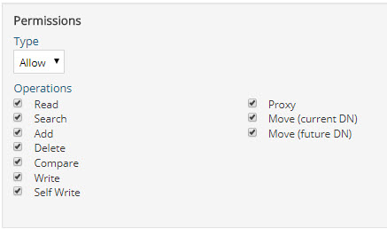

# Authorization Enforcement

## aci

A multi-valued attribute that stores information about the configured access controls that RadiantOne uses to enforce authorization to data in the RadiantOne namespace. Each value includes:

-	“target” indicating where to enforce the access control.

-	“targetscope” how many child entries the access control affects. Values could be subtree, base, or one.

-	“targetattr” indicates the list of attributes affected. A value of * indicates all attributes.

-	“version” an internal tracking number used to indicate the version.

-	“acl” indicates a unique name of the access permission.

-	The permission (allow or deny) for which kind of operations: read, compare, add, delete, search, write, proxy, import, export. These values correspond to the operations defined for the access control. If Read, Search, Add, Delete, Compare, Write, and Self Write are enabled, you will see “All” in the value. For example, assuming every operations is selected, you see (all,proxy,import,export) in the aci attribute value.

 
-	“groupdn” indicates the subject the access control is applicable for.

    An example value is: (target="ldap:///ou=globalaci,cn=config")(targetscope="subtree")(targetattr="*")(version 3.0; acl "aci7"; allow (read,search,write) groupdn="ldap:///cn=directory administrators,ou=globalgroups,cn=config";)

## acilocation

A single-valued attribute that indicates the location/target DN that an access control is applicable for.

## vdPrivilege

An attribute used by RadiantOne Control Panel to enforce authorization for users associated with the delegated administration groups.
