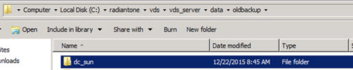

# Cluster Management

## Expert Mode

Some settings in RadiantOne are accessible only in Expert Mode. To switch to Expert Mode, click the Logged in as, (username) drop-down menu and select Expert Mode.

Figure 1: Accessing Expert Mode

>[!note] The Main Control Panel saves the last mode (Expert or Standard) it was in when you log out and returns to this mode automatically when you log back in. The mode is saved on a per-role basis.

## Configuring Email Notification for License Key Expiration

To configure an email notification related to a license key expiration:

1. In the Main Control Panel, switch to Expert Mode by clicking the Logged in as, (username) drop-down menu and select Expert Mode.
2. Click the Main Control Panel > Zookeeper tab.
3. Expand folder radiantone > version > cluster_name > config > vds_server.conf.
4. Click Edit Mode.
5. Locate the setting named: licenseExpirationMessageConfiguration
6. Set the following parameters:
    - smtpServerUrl: smtp server url
    - smtpPort: smtp port
    - username: smpt username
    - password: smtp password
    - messageSubject: the subject of the email
    - messageBody: the body of the email message
    - numberOfDaysBeforeExpiration: when to start sending emails before license expiration
    - licenseCheckIntervalDays: how frequently to check for when the license is going to expire.
    - licenseExpirationMessageRecipient: who to send the email notification to. Only one email address is supported.
    - licenseExpirationMessageSender: the email address from which to send the notification.
7. Click Save on the Zookeeper tab.

## Adding Nodes

To install nodes to an existing cluster, you need the following details:

- The server name of an existing core RadiantOne cluster node.
- The server names and ports of the ZooKeeper ensemble.
- The cluster name.
- The ZooKeeper login and password.
- A valid RadiantOne license key. Keys can be enforced at the cluster level or the node
level. Please check with your Radiant Logic representative to verify your license key type.

For exact installation steps, please see the [RadiantOne Installation Guide](/installation-guide/01-introduction).

## Removing Nodes

If ZooKeeper is deployed in an external ensemble, make sure all nodes are running.

If ZooKeeper is deployed local, on the same machines as the RadiantOne nodes, make sure it is running on all nodes. If ZooKeeper cannot be started on the RadiantOne node that needs removed, follow the steps in [Node and/or Services Cannot Be Restarted](#node-andor-services-cannot-be-restarted) instead of the steps in this section.

Make sure all other RadiantOne services are stopped on all nodes.

To remove a node from a cluster:

1. On the node that is to be removed from your cluster, run the following command (using  cluster.bat on Windows, cluster.sh on Linux): 
  <RLI_HOME>/bin/advanced/cluster.bat detach

2. Edit the <RLI_HOME>\vds_server\conf\cloud.properties file on each remaining cluster node and verify that the zk.servers value correctly lists the cluster nodes and ZooKeeper client port. If the zk.servers value is incorrect, run the following command (using cluster.bat on Windows, cluster.sh on Linux):
     <RLI_HOME>/bin/advanced/cluster.bat update-zk-client-conf

3. To update the vdsha and replicationjournal data sources (that still reference the removed RadiantOne node), on one of the remaining cluster nodes, run the following command (using cluster.bat on Windows, cluster.sh on Linux):  <RLI_HOME>/bin/advanced/cluster.bat reset-cluster-datasource

To update a specific data source, like vdsha, use the following command instead of the one mentioned above (vds_server is the instance name and vdsha is the data source name in this example):
<RLI_HOME>/bin/advanced/cluster.bat reset-cluster-datasource vds_server vdsha

4. To update the vdsha and replicationjournal data sources (that still reference the other cluster nodes), on the removed node, run the following command (using cluster.bat on Windows, cluster.sh on Linux):
     <RLI_HOME>/bin/advanced/cluster.bat reset-cluster-datasource
5. To update the cluster name on the removed node, run the following command (using cluster.bat on Windows, cluster.sh on Linux):
    <RLI_HOME>/bin/advanced/cluster.sh rename-cluster-zk <vds_instance_name>
    <new_cluster_name>
    vds_server is the default instance name.
6. Restart the RadiantOne service and Control Panel (Jetty) on all cluster nodes and the node that was removed from the cluster.

At this point, you have a two-node cluster and one node by itself, which could be the start of a new cluster.

## Renaming Clusters

Renaming a cluster is a delicate operation that should not be used frequently and is not recommended for deployed architectures involved in inter-cluster replication since the cluster name is key for the replication logic.

To rename a cluster, perform the following steps (using cluster.bat on Windows, cluster.sh on
Linux):

1. Stop all RadiantOne services except ZooKeeper.
2. On any RadiantOne node, run:
     <RLI_HOME>/bin/advanced/cluster.sh rename-cluster-zk <vds_instance_name>
    <old_cluster_name> <new_cluster_name>
    This moves the Zookeeper data from /radiantone/<version>/<old_cluster_name> to
    /radiantone/<version>/<new_cluster_name>
3. On each RadiantOne node, run:
     <RLI_HOME>/bin/advanced/cluster.sh rename-cluster-local <vds_instance_name>
    <new_cluster_name>
4. Start the Radiantone services on all nodes.

### Updating ZooKeeper Admin Credentials

During RadiantOne installation, the ZooKeeper admin username and password are defined. An example is shown below.

Figure 2: Setting Zookeeper Admin Credentials During Install

Updating the ZooKeeper admin credentials that were defined during installation is a very delicate operation. All ZooKeepers in the cluster must be functioning properly and allow read/write operations (they can’t be in read-only mode). All other RadiantOne services on all cluster nodes must be stopped, meaning that client requests cannot be processed during the time the ZooKeeper admin credentials are being updated.

To update the ZooKeeper admin username and/or password follow the steps below. These steps are the same whether ZooKeeper is running in an external ensemble or on the same local RadiantOne nodes unless otherwise mentioned.

1. On any RadiantOne node, run <RLI_HOME>/bin/advanced/cluster.bat list (use cluster.sh on Linux) from command line. Ensure the cluster is in a healthy state with all RadiantOne and ZooKeeper services up and running.

2. Run <RLI_HOME>/bin/advanced/stop_servers.bat (use stop_servers.sh on Linux) on all RadiantOne cluster nodes. This ensures all RadiantOne services are stopped.

3. If you are using an internal/local ZooKeeper, run <RLI_HOME>/bin/runZookeeper.bat (use runZookeeper.sh on Linux) on all RadiantOne cluster nodes. ZooKeeper on all nodes must be running. If you are using an external ZooKeeper ensemble, all servers should be running already, so you can skip this step.

4. On any RadiantOne node in the cluster, run <RLI_HOME>/bin/advanced/cluster.bat change-zk-server-credentials <instance_name> <new_adminuser> <new_password> where <instance_name> is vds_server, <new_adminuser> is the new ZooKeeper admin user. To keep the same admin user, enter the value of the current admin user and <new_password> is the new password for the ZooKeeper admin user. An example is shown below:  <RLI_HOME>/bin/advanced/cluster.bat change-zk-server-credentials vds_server admin newpassword

5. A warning appears, enter Y to continue.

    `WARN ClusterCommands:485 - !!! WARNING !!!`

    `WARN ClusterCommands:486 - This is a very sensitive operation.`

    `WARN ClusterCommands:487 - Please make sure that all the other RadiantOne programs and services are stopped on all the nodes of the cluster.`

    `WARN ClusterCommands:489 - Continue (y/n)?`

    >[!note] If you want to bypass the warning, use the true flag as follows:  `<RLI_HOME>/bin/advanced/cluster.bat change-zk-server-credentials <instance_name> <new_adminuser> <new_password> true`

6. After the command executes, the following warning is displayed.

    `WARN ClusterCommands:552 - Please update the client credentials and restart ZooKeeper on all the nodes.`

7. On each remaining RadiantOne cluster node, run <RLI_HOME>/bin/advanced/cluster.bat change-zk-client-credentials `<instance_name> <new_adminuser> <new_password>` where <instance_name> is vds_server, <new_adminuser> is the ZooKeeper admin user and <new_password> is the new password for the ZooKeeper admin user. An example is shown below:
     <RLI_HOME>/bin/advanced/cluster.bat change-zk-client-credentials vds_server admin
    newpassword
8. If you are using an internal/local ZooKeeper, restart ZooKeeper, one at a time, on all RadiantOne cluster nodes. You can use <RLI_HOME>/bin/stopZookeeper.bat (use stopZookeeper.sh on Linux) and then <RLI_HOME>/bin/runZookeeper.bat (use runZookeeper.sh on Linux) to restart ZooKeeper. Ensure the ZooKeeper you restarted is back up prior to restarting it on another node. If you are using an external ZooKeeper ensemble, restart each ZooKeeper service, one at a time, on all nodes. Typically the ZooKeeper services in an external ensemble run as Windows Service/Linux Daemons, so restart using the native OS utilities.

9. Start the RadiantOne service on all cluster nodes.

10. To ensure all servers in the cluster are running and accessible, run <RLI_HOME>/bin/advanced/cluster.bat list (use cluster.sh on Linux) from command line.

If the command returns with errors, resolve them prior to allowing clients to access
RadiantOne again.

## Updating RadiantOne Super User Credentials

The directory administrator (e.g. cn=directory manager) password is set during the install of
RadiantOne and can be changed from Main Control Panel > Settings > Server Front End > Administration. Click “Change the password” link in the Directory Manager Settings section. Enter the new value and click on the Save button in the upper right corner.

>[!warning] If you change the password and you are currently logged into the Control Panel as the super user, you must close the Control Panel and re-open it logging in with the new password.

To change the directory manager’s password from the Instance Manager command line utility, you can use the following command:

`<RLI_HOME>/bin/instancemanager -u -n vds_server -p 2389 -w newpassword`

The -p option is required when updating the password.

The RadiantOne service must be stopped when running this command. For more details on the Instance Manager utility, please see the RadiantOne Deployment and Tuning Guide.

You can also change the directory administrator’s password via LDAP. The DN representing the directory administrator is: cn=Directory Manager,ou=RootUsers,cn=config. The example below
is using an LDIF file and the ldapmodify command to modify the password:

`dn: cn=Directory Manager,ou=RootUsers,cn=config`
 `changetype: modify`
 `replace: userPassword`
 `userPassword: newpassword`

An example of the syntax used in the command is shown below, assuming the LDIF file described above is named ChangePassword.ldif.

`ldapmodify.exe -D "cn=Directory Manager,ou=RootUsers,cn=config" -w password -h localhost -
p 2389 -f c:\radiantone\ChangePassword.ldif`

>[!note] The RadiantOne service may be running when this command is executed.

## Maintaining Connections to Backend Systems

Once the connections are established between RadiantOne and the underlying systems, the only changes required are when those connections need to be updated. For example, if RadiantOne needs to point to a different server/port or use a different service account user/password then you must update the connection strings that are stored in the RadiantOne data sources.

The connection string information can be changed from the Main Control Panel > Settings Tab > Server Backend section. You can also update connection strings from command line using the vdsconfig utility. For details on the vdsconfig utility, please see the [Radiantone Command Line Configuration Guide](/command-line-configuration-guide/01-introduction).

## Backing up Configuration

If you are running RadiantOne on a virtual machine and would like to take periodic snapshots, ensure all RadiantOne components are stopped (<RLI_HOME>/bin/advanced/stop_servers) prior to taking the snapshot.

You should periodically use the RadiantOne Migration Utility with the export option to save a copy of the RadiantOne configuration.

The example below assumes the file containing the backup of the RadiantOne configuration is C:\tmp\backupMay.zip and the RadiantOne Migration Utility has been installed at
C:\MigrationUtility\radiantone-migration-tool-2.0.0:

`C:\MigrationUtility\radiantone-migration-tool-2.0.0\migrate.bat export C:\tmp\backupMay.zip`

Copy the exported file to a safe location where you maintain backups. If you need to [restore your RadiantOne configuration](#restoring-cluster-from-backup-configuration), you can use this backup file.

>[!note] It is also recommended to occasionally save a backup of your entire <RLI_HOME> folder to a safe location.

## Rebuilding Jar Files

Jar files can be rebuilt from command line. An example is shown below. Restart the RadiantOne service after jars are rebuilt.

`C:\radiantone\vds\vds_server\custom>c:\radiantone\vds\ant\bin\ant.bat buildjars`
 `Buildfile: build.xml compile:`
 `[javac] Compiling 28 source files to C:\radiantone\vds\vds_server\custom\classes`
 `[propertyfile] Updating property file: C:\radiantone\vds\vds_server\custom\build.txt buildjars:`
 `[jar] Building jar: C:\radiantone\vds\vds_server\custom\lib\customobjects.jar`
 `[jar] Building jar: C:\radiantone\vds\vds_server\custom\lib\intercept.jar`
 `[jar] Building jar: C:\radiantone\vds\vds_server\custom\lib\fidsync.jar`
 `[jar] Warning: skipping jar archive C:\radiantone\vds\vds_server\custom\lib\sync.jar because no files were included.`
 `[jar] Building jar: C:\radiantone\vds\vds_server\custom\lib\sync.jar`
 `[jar] Building jar: C:\radiantone\vds\vds_server\custom\lib\changeEventConvertors.jar`
 `##### BUILD SUCCESSFUL`
 `Total time: 5 seconds`

## Recovering a Failed Node

### Node and Services Can Be Restarted

If the node and services (e.g. ZooKeeper, RadiantOne, Jetty) can be restarted, once it is back online, the ZooKeeper from the failed node synchronizes all current configuration changes with the ensemble. The RadiantOne service on the failed node picks up changes to Universal Directory (HDAP) stores and persistent cache from the leader node.

### Node and/or Services Cannot Be Restarted

If the failed node cannot be restarted, or the required services on the node cannot be restarted, the failed node should be removed and a new cluster node should be created following the steps below. If ZooKeeper is local on the RadiantOne node to be removed, make sure the ZooKeeper service is stopped.

1. At this point, the RadiantOne service on the failed node is still registered in the cluster. Get the Cloud ID and ZooKeeper ID of the failed node by running <RLI_HOME>/bin/advanced/cluster.bat list on a healthy cluster node. Take note of the Cloud ID and ZooKeeper Server ID (e.g. 1, 2, 3) of the failed node. Below is an example:

    `| Hostname | Cloud ID | VDS status | ZooKeeper Server ID | ZooKeeper UP?`
     `| DOC-E1WIN1 | 8773eaa7-3de0- 4421 - 96ad-7de4c1b56c1c | ON | #1 | ON |`
     `| DOC-E1WIN2* | 4a506e15-b726- 4551 - 82a9-42759f00981c | ON | #2** | ON |`
     `| DOC-E1WIN3 | 2ded0740-3aeb- 4430 - bcf9-788ce666cc38 | ON | #3 | OFF |`

2. To remove reference to the failed node, on one healthy node of the cluster, run the following command (using cluster.bat on Windows, cluster.sh on Linux):  <RLI_HOME>/bin/advanced/cluster.bat zk-leave vds_server `<ZooKeeper Server ID of the failed node>`

3. On one healthy node of the cluster, run the following command (using cluster.bat on Windows, cluster.sh on Linux): <RLI_HOME>/bin/advanced/cluster.bat unregister vds_server < Cloud ID of the failed node >

4. Edit the <RLI_HOME>\vds_server\conf\cloud.properties file on each remaining cluster node and verify that the zk.servers value correctly lists the cluster nodes and ZooKeeper client port. If the zk.servers value is incorrect, run the following command (using cluster.bat on Windows, cluster.sh on Linux):  <RLI_HOME>/bin/advanced/cluster.bat update-zk-client-conf

5. On one of the remaining cluster nodes, manually update the vdsha and replicationjournal (if applicable) data sources to remove reference to the failed node. Data sources can be updated from the Main Control Panel > Settings tab > Server Backend section > LDAP data sources, or from command line using the vdsconfig utility. For details on using the command line options, please see the RadiantOne Command Line Configuration Guide.

6. Install RadiantOne on a new machine and have it join the existing cluster. For detailed steps on adding a node to an existing cluster, please see the RadiantOne Installation  Guide. Once the new node is installed, it automatically inherits from the existing configuration and data (Universal Directory stores and persistent cache).

## Manually Synchronizing Files to ZooKeeper

If ZooKeeper is running, all configuration changes made from the Main Control Panel or from the command line utility (vdsconfig) are updated on both the file system and in ZooKeeper (to be shared across all cluster nodes).

When RadiantOne configuration files are modified externally, directly on the file system, they are not automatically updated in ZooKeeper. In fact, when files are modified externally, they are overridden by ZooKeeper when the RadiantOne service starts or restarts.

Any manual, external changes made to files in the following directories require a manual sync
process to ZooKeeper:
 <RLI_HOME>/vds_server/datasources
 <RLI_HOME>/vds/config/log2db

The utility to synchronize files to ZooKeeper is:
 <RLI_HOME>\bin\advanced\zooKeeperUpdateUtil.bat

Pass the file name to synchronize to ZooKeeper using the -f property. Below is an example of
synchronizing the custom.xml file.

`C:\radiantone\vds\bin\advanced>zookeeperupdateUtil.bat -f`
 `C:\radiantone\vds\vds_server\datasources\custom.xml`

 `Using RLI home : C:\radiantone\vds`
 `Using Java home : C:\radiantone\vds\jdk\jre`
 `Radiant home Product env var : C:\radiantone\vds`
 `updating zookeeper with local file content`
 `[C:\radiantone\vds\vds_server\datasources\custom.xml]`

The utility does not require the RadiantOne service on the node to be running, but does require ZooKeeper on the node to be running.

## Recovering from an Entire Cluster Failure

### Using a Disaster Recovery/Backup Site

This option assumes you have maintained a cluster in a DR site that can be used to repair your primary cluster using the steps below. The overall objective is to temporarily add a new node to the DR cluster and then decouple it from the cluster so it becomes the leader node for your primary cluster.

1. Install RadiantOne on a new machine and have it join the existing DR cluster. For detailed steps on adding a node to an existing cluster, please see the [RadiantOne Installation Guide](/installation-guide/04-node-configuration-commands). For a list of cluster configuration required to add a new node, see [Adding Nodes](#adding-nodes). Once the new node is installed, it automatically inherits from the existing configuration and data (Universal Directory stores and persistent cache).

2. Stop all RadiantOne service and Jetty. ZooKeeper should be running on all nodes.

3. On the node that is to be used for restoring your primary cluster, run the following command to decouple it from the DR cluster (using cluster.bat on Windows, cluster.sh on Linux).

`<RLI_HOME>/bin/advanced/cluster.bat detach`

The rest of the steps are broken into two sections. One set of steps are performed on the DR Cluster and the other set of steps are performed on the node you decoupled from the DR cluster noted as the New Primary Cluster Node.

**Steps Associated with the Disaster Recovery Cluster/Site**

1. Edit the <RLI_HOME>\vds_server\conf\cloud.properties file on each of the DR cluster nodes and verify that the zk.servers value correctly lists only the nodes currently in the DR cluster and ZooKeeper client port. If the zk.servers value is incorrect, run the following command (using cluster.bat on Windows, cluster.sh on Linux):

    `<RLI_HOME>/bin/advanced/cluster.bat update-zk-client-conf`

2. To update the vdsha and replicationjournal data sources (that still reference the removed cluster node), on one of the DR cluster nodes, run the following command (using
cluster.bat on Windows, cluster.sh on Linux):

`<RLI_HOME>/bin/advanced/cluster.bat reset-cluster-datasource`

At this point, the DR cluster should be back to normal.

**Steps Associated with the New Primary Cluster Node**

1. Edit the <RLI_HOME>\vds_server\conf\cloud.properties file on the detached node and verify that the zk.servers value correctly lists only this detached node and ZooKeeper client port. If the zk.servers value is incorrect, run the following command (using cluster.bat on Windows, cluster.sh on Linux):

    `<RLI_HOME>/bin/advanced/cluster.bat update-zk-client-conf`

2. To update the vdsha and replicationjournal data sources (that still reference the other cluster nodes), run the following command (using cluster.bat on Windows, cluster.sh on Linux):

    `<RLI_HOME>/bin/advanced/cluster.bat reset-cluster-datasource`

3. To update the cluster name on the removed node, run the following command (using cluster.bat on Windows, cluster.sh on Linux):

    `<RLI_HOME>/bin/advanced/cluster.sh rename-cluster-zk <vds_instance_name> <new_cluster_name>`
     `vds_server is the default instance name.`

4. Start the RadiantOne service and Jetty on this node.

5. Install RadiantOne on a new machine and have it join the existing cluster. For detailed steps on adding a node to an existing cluster, please see the RadiantOne Installation Guide. Once the new node is installed, it automatically inherits from the existing configuration and data (RadiantOne Universal Directory stores and persistent cache).

6. Repeat step 5 to add another core cluster node. The cluster should have at least three core nodes if a local ZooKeeper ensemble is used. If an external ZooKeeper ensemble is used, the cluster should have at least two RadiantOne core nodes.

### Restoring Cluster from Backup Configuration

If there is no disaster recovery site to leverage for restoring a cluster, you can attempt to restore from backup files.

#### Restoring Configuration

You can restore your RadiantOne configuration in cases where you need to revert back to a
previous time, or in case of corruption to critical files required for the service to function. The information in this section assumes you are restoring the configuration on the same machine from which the [export](#backing-up-configuration) was performed.

>[!warning]
>Restoring the configuration only covers the existing resources in the backup. Any new configuration in the environment is not touched during the restore process.

To restore the configuration, you can use an [exported file](#backing-up-configuration) that was generated with the RadiantOne migration utility. Use the migration utility with the import option, reference the backup file and use the backup-restore argument.

The example below assumes the file containing the backup of the RadiantOne configuration is C:\tmp\backupMay.zip and the RadiantOne Migration Utility has been installed at
C:\MigrationUtility\radiantone-migration-tool-2.0.0:

`C:\MigrationUtility\radiantone-migration-tool-2.0.0\migrate.bat import C:\tmp\backupMay.zip backup-restore`

The backup-restore mode restores the following:

- vds_server.conf (in ZooKeeper)
- data sources (in ZooKeeper)
- client truststore (in ZooKeeper)
- RadiantOne instances (if multiple instances were used)
- .orx and .dvx files
- JDBC drivers (jdbcxml.xml)
- naming contexts (in ZooKeeper) – only the definition of the names, not the dependent files (e.g. underlying data sources, .dvx files...etc.)
- RadiantOne LDAP Schema files
- Monitoring configuration
- RadiantOne Universal Directory (HDAP) stores (not persistent cache)
- Custom project (restored only if the target RadiantOne version is the same as the version of the export). A backup copy of the custom folder is made in
<RLI_HOME>/<instance_name>/custom.yyyyMMdd-HHmmss/

When the RadiantOne configuration is [exported](#backing-up-configuration), a migration plan is generated. This migration plan contains the list of configuration (to be restored) and is named migration_plan.json. If you want to modify the migration plan prior to importing, use the following command to extract the migration plan from the zip file. In the example shown below, C:/import is the location where the backupMay.zip file has been copied to.

`C:\MigrationUtility\radiantone-migration-tool-2.0.0\migrate.bat generate-migration-plan C:\import\backupMay.zip`

This command creates migration_plan.json which contains the list of configurations that were exported from the source environment. Edit this file in your chosen text editor. Use the value: KEEP to indicate the resource should not be included in the restore. Use the value: MIGRATE to indicate the resource should be included in the restore. Do not change anything else in the file. When you are ready to import the configuration, run the following command. If you extracted and edited the migration_plan.json, it is used during the import instead of the one from the .zip file.

`C:\MigrationUtility\radiantone-migration-tool-2.0.0\migrate.bat import C:\import\backupMay.zip backup-restore`

#### Restoring RadiantOne Universal Directory (HDAP) Stores

RadiantOne Universal Directory stores can be restored from the Main Control Panel, or from command line.

##### From Main Control Panel

To restore a RadiantOne Universal Directory (HDAP) store, on the current RadiantOne leader node, go to the Main Control Panel > Directory Namespace Tab and select the RadiantOne Universal Directory (HDAP) store node. On the right side, click the Restore button on the Properties tab. Click Yes to confirm the restore operation and then select the date corresponding to the backup image to restore from.

##### From Command Line

The tool used for restoring RadiantOne Universal Directory (HDAP) stores from command line is named vdsconfig.bat (Windows) or vdsconfig.sh (Linux) and is located in <RLI_HOME>/bin. This utility should be used on the RadiantOne leader node. To verify the leader node, go to the Main Control Panel > Dashboard tab and look for the node that has a yellow triangle next to the name.

The restore-hdapstore command restores a RadiantOne Universal Directory (HDAP) store back to the state of a given backup image. To restore from the most recent backup image do not pass a backupid in the command. To restore from a specific point in time, pass the applicable backupid in the command. Use the - list argument to obtain a list of possible backup ids for the given naming context.

**Usage**

`restore-hdapstore -namingcontext <namingcontext> [-backupdir <backupdir>] [-backupid] <backupid>] [-instance <instance>] [-list]`

**Command Arguments**

- namingcontext `<namingcontext>`
  [required] The name of the naming context.

- backupdir `<backupdir>`
  The full path to the directory containing the backup files. Do not specify this option if you use the - backupid option.

- backupid <backupid>
 The ID of an existing backup image. If this is not specified, the restore attempts to use the latest backup image found. Use the -list argument to obtain a list of possible backup ids for the given naming context.

- instance <instance>
 The name of the RadiantOne instance. If this is not specified, the default instance named
vds_server is used.

- list
  Option used to print out the list of backup ids for the given naming context. Use this option first to get the list of backup ids as you must pass the backupid when you restore if you want to restore to a specific point in time.

**Examples**

`C:\radiantone\vds\bin>vdsconfig.bat restore-hdapstore -namingcontext o=newstore -backupzip C:\install\o_newstore-backup\ 2017 - 03 - 28_12- 17 - 53.zip`

The following example shows two separate commands starting with listing the backup images and then passing a backup ID to use to restore.

`C:\radiantone\vds\bin>vdsconfig.bat restore-hdapstore -namingcontext o=companydirectory -list`
 `Using RLI home : C:\radiantone\vds`
 `Using Java home : C:\radiantone\vds\jdk\jre`
 `0 [ConnectionStateManager-0] WARN com.rli.zookeeper.ZooManagerConnectionStateListener`
 `- Curator connection state change: CONNECTED`
 `8 [ConnectionStateManager-0] WARN com.rli.zookeeper.ZooManagerConnectionStateListener`
 `- VDS-ZK connection state changed: CONNECTED`
 `9 [ConnectionStateManager-0] WARN com.rli.zookeeper.ZooManager - ZooManager connection state changed: CONNECTED`
 `Current backups for 'o=companydirectory':`
 `Backup Id Date of Backup`
 `-------------------------------------------`
 `1440023312307 08/19/2015 15:28:`
 `1440023472460 08/19/2015 15:31:`
 `1440023524906 08/19/2015 15:32:`
 `1440088234257 08/20/2015 09:30:`

 `C:\radiantone\vds\bin>vdsconfig.bat restore-hdapstore -namingcontext o=companydirectory`

 `- backupid 1440023312307`
 `Using RLI home : C:\radiantone\vds`
 `Using Java home : C:\radiantone\vds\jdk\jre`
 `0 [ConnectionStateManager-0] WARN com.rli.zookeeper.ZooManagerConnectionStateListener`
 `- Curator connection state change: CONNECTED`
 `9 [ConnectionStateManager-0] WARN com.rli.zookeeper.ZooManagerConnectionStateListener`
 `- VDS-ZK connection state changed: CONNECTED`
 `9 [ConnectionStateManager-0] WARN com.rli.zookeeper.ZooManager - ZooManager connection state changed: CONNECTED`
 `The naming context has been successfully restored from its backup.`

#### Restoring Persistent Cache

Persistent cache can be restored (from a backup image), re-initialized (from the current image in the backends), or updated based on changes accumulated by the connectors (if real-time, connector-based refresh is deployed).

Depending on how long the entire cluster has been down, it might be more efficient to re- initialize the persistent cache as opposed to having RadiantOne update the cache gradually based on the backlog of changes captured by the connectors once they are back online.

If the cluster has not been down for very long it might be fine to have RadiantOne update the cache based on notification of the backlog of changes captured by the connectors. Once the connectors are started, they pick up changes from where they last left off and the persistent cache is refreshed with the changes that happened in the backends while the entire cluster was down.

You can also restore the persistent cache to a previous image based on a backup. If the data hasn’t changed in the backends since the last backup was taken, the persistent cache can be restored instead of re-initialized. This is faster than re-initializing and doesn’t require heavy load on the backends.

##### Restore a Persistent Cache to a Previous Image

Before running the restore command, copy the saved backup folder to the machine where you are restoring the image:

For example, if a naming context representing a persistent cache is named dc=sun, the storage name folder is dc_sun. In the example used below, this folder is copied to <RLI_HOME>/vds_server/data/oldbackup.

Figure 2. 3 : Example Storage of Persistent Cache

The tool used for restoring persistent cache from command line is named vdsconfig.bat (Windows) or vdsconfig.sh (Linux) and is located in <RLI_HOME>/bin. This utility should be used on the RadiantOne leader node. To verify the leader node, go to the Main Control Panel > Dashboard tab and look for the node that has a yellow triangle next to the name.

The restore-hdapstore command restores a persistent cache branch back to the state of a given backup image. To restore from the most recent backup image do not pass a backupid in the command. Just pass the location to the backup directory containing the files (in the -backupdir argument). To restore from a specific point in time, pass the applicable backupid in the command. Use the -list argument to obtain a list of possible backup ids for the given naming context.

**Usage**

`restore-hdapstore -namingcontext <namingcontext> [-backupdir <backupdir>] [-backupid] <backupid>] [-instance <instance>] [-list]`

Command Arguments

- namingcontext `<namingcontext>`
 [required] The name of the naming context.

- backupdir `<backupdir>`
 The full path to the directory containing the backup files. Do not specify this option if you use the - backupid option.

- backupid `<backupid>`
 The ID of an existing backup image. If this is not specified, the restore attempts to use the latest backup image found. Use the -list argument to obtain a list of possible backup ids for the given naming context.

- instance <instance>
 The name of the RadiantOne instance. If this is not specified, the default instance named vds_server is used.

- list
 Option used to print out the list of backup ids for the given naming context. Use this option first to get the list of backup ids as you must pass the backupid when you restore if you want to restore to a specific point in time.

Example

`C:\radiantone\vds\bin>vdsconfig.bat restore-hdapstore -namingcontext dc=sun -backupdir“C:\radiantone\vds\vds_server\data\oldbackup\dc_sun\ 2015 - 12 - 21_14- 41 - 02” -instance vds_server`

 `Using RLI home : C:\radiantone\vds`
 `Using Java home : C:\radiantone\vds\jdk\jre
0 [ConnectionStateManager-0] WARN com.rli.zookeeper.ZooManagerConnectionStateListener - Curator connection state change: CONNECTED`
 `9 [ConnectionStateManager-0] WARN com.rli.zookeeper.ZooManagerConnectionStateListener - VDS-ZK connection state changed: CONNECTED`
 `9 [ConnectionStateManager-0] WARN com.rli.zookeeper.ZooManager - ZooManager connection state changed: CONNECTED`
 `The naming context has been successfully restored from its backup`

##### Reinitialize Persistent Cache

To reinitialize a persistent cache:

1. On the RadiantOne leader node, go to the Main Control Panel > Directory Namespace tab.

2. Navigate below the Cache node and select the persistent cache branch.

3. On the right side, Refresh Settings tab, click on the Initialize button.

4. Select to Create a new LDIF file.

5. Click OK. A task is launched to re-initialize the persistent cache. Tasks can be monitored on from the Server Control Panel > Tasks tab associated with the RadiantOne leader node.
