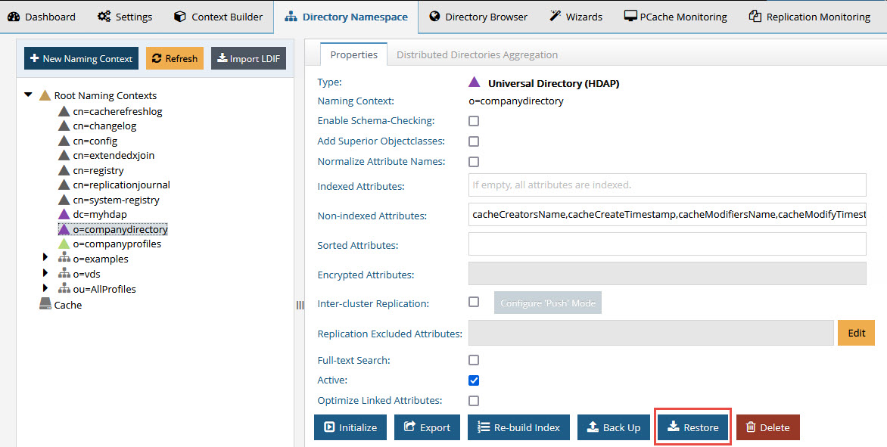

# Chapter 3: RadiantOne Universal Directory (HDAP) Store Management

## Re-Indexing

Re-indexing a store is an operation that should not be needed frequently. Re-indexation is a time-consuming process and should only be done while the service is offline during a scheduled maintenance window. The store is inaccessible and no other operations can be performed during the re-indexation.

If the Indexed Attributes or Sorted Indexes properties are changed, or if support for full text search is enabled, click on the Re-build Index button on the Properties Tab for the selected RadiantOne Universal Directory (HDAP) store on the Main Control Panel > Directory Namespace tab.

Re-indexing the store is processed as a task. The task is executed on the leader node of the cluster. The store on the leader node is re-indexed, and then activated again. All follower/follower-only nodes copy the updated index from the leader node.

## Re-Initializing

Stores must be re-initialized on the RadiantOne leader nodes of the cluster only. To determine the leader node, go to Dashboard tab of the Main Control Panel and locate the yellow triangle next to the name of the node.

If more than one cluster is involved, use an LDIF file exported from the cluster considered the “master” image to re-initialize all needed replicas.

><span style="color:red">**IMPORTANT NOTE – disable inter-cluster replication for the store prior to re-initializing the store only if you plan on re-initializing all replicas with a clean image. To maintain inter-cluster replication and process changes from other replicas that happen while one (or more) replicas are being re-initialized, do NOT disable inter-cluster replication.**

Re-initializing a store is an operation that is time-consuming and should only be done while the service is offline during a scheduled maintenance window. The store is inaccessible and no other operations can be performed during the re-initialization.

Stores can be initialized with LDIF files. Click on the Initialize button on the Properties Tab for the selected RadiantOne Universal Directory store on the Main Control Panel > Directory Namespace tab and browse to the desired LDIF file.

Re-initializing the store is processed as a task. The task is executed on the leader node of the cluster. The store on the leader node is initialized, and then activated again. All follower/follower-only nodes copy the data from the leader node.

Stores can be initialized/re-initialized from command line using vdsconfig.bat (Windows) or vdsconfig.sh (Linux) located in <RLI_HOME>/bin. This syntax is as follows:

```
init-hdap-store -ldif <ldif> -namingcontext <namingcontext>[-instance <instance>] [-interactive]
```

**Command Arguments**

- ldif `<ldif>`
<br>[required] The path to the LDIF file used for initializing.

- namingcontext `<namingcontext>`
<br>[required] The name of the naming context.

- instance `<instance>`
<br>The name of the RadiantOne instance. If not specified, the default instance named vds_server is used.

- interactive
<br>When this argument is specified, the command launches the tasks and periodically displays their current state until they are finished. If this argument is not specified, the command launches the tasks and terminates.

## Backing up a RadiantOne Universal Directory (HDAP) Store

The ongoing maintenance of your RadiantOne Universal Directory stores involves making regular back-ups.

>**Note – backups can be performed while the store is online. The store can be read/written to while the backup is taking place. However, it is generally best practice to backup during off-peak hours.**

After a store has been initialized, you can create backups anytime.

To back up an HDAP store:

1. Locate the current RadiantOneleader node on the Main Control Panel > Dashboard tab (is noted with symbol).
2. From the Main Control Panel associated with the RadiantOne leader node, click the Directory Namespace Tab.
3. Select a RadiantOne Universal Directory store node and on the Properties tab on the right, click the Back Up button. The Backup HDAP Store window opens.
4. Select one of the following options.

- Default backup location (<RLI_HOME>/vds_server/data/oldbackup)
- Custom backup location. Click Browse, specify a file path, and click OK.

>**Note – the browse option in the Custom Backup Location does not permit browsing above <RLI_HOME>. To select a custom backup location outside the <RLI_HOME> directory, enter the full location manually in the field below the
custom backup location radio button.**

5. Click **OK**. Click **OK** again to close the dialog box.

A compressed backup file is created in the location indicated in step 4 above, in a folder named after the root naming context being backed up (i.e. o_companydirectory-backup). The naming convention for the compressed file is yyyy-mm-dd_hh-mm-ss.zip. The compressed file is automatically encrypted using the RadiantOne server certificate keystore password.

Back ups can also be performed from command line. For details, please see the Command Line Configuration Guide.

## Restoring RadiantOne Universal Directory (HDAP) Stores

To restore a RadiantOne Universal Directory (HDAP) store:

1. Go to Main Control Panel > Directory Namespace Tab.
2. Select a RadiantOne Universal Directory (HDAP) store node and on the Properties tab on the right, click the Restore button.
3. Select one of the following restore options.

- Click the “Select the date available in the default backup directory” button, and select the drop-down menu option that corresponds to the data and time of the backup to be restored.
- Click the “Select the directory of an existing HDAP Store Backup” button, click Browse, select the location of the backup file, and click OK.

4. Click **OK** again. Click **OK** to close the dialog box.

The restore is performed using the compressed file located in the folder indicated. The compressed file is automatically decrypted using the RadiantOne server certificate keystore
password. The server where you are restoring the store must have the same server certificate keystore password than the server where you created the backup from.

>**Note – the compressed store files can only be unpacked in either the Main Control Panel or using the command line utility. For details on restoring a RadiantOne Universal Directory store from command line, see the RadiantOne
Command Line Configuration Guide.**



Figure 3.1: Restoring Universal Directory (HDAP) Store

## How to Unlock Accounts

A user’s account can be locked due to a violation of password policy (e.g. too many invalid login attempts).

If a user’s account is locked due to a violation of a password policy, only the directory administrator (or someone who is a member of the directory administrator group) can unlock the account by resetting the user’s password. If the lockout policy has a duration period, the account is automatically unlocked after the duration has passed.

## How to Disable Accounts

Disabled accounts are inactive. The user is not able to authenticate (bind) to the directory anymore. To disable an account, add an attribute named nsAccountLock with a value of true to the user entry. To enable the account, set nsAccountLock to false.