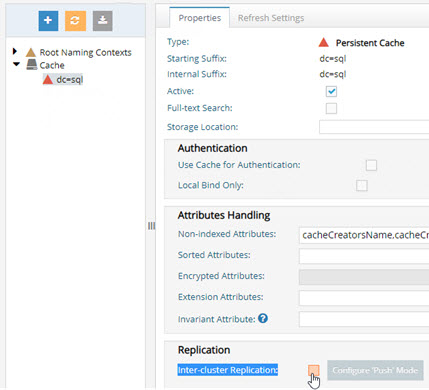

# Chapter 4: Persistent Cache Management

## Backing up Persistent Cache

To backup a persistent cache, go to the Main Control Panel > Directory Namespace tab > Cache node. Select the cached branch and on the right, click Export. Enter a file name and click OK. You can also use the backup-hdapstore option in the Command Line Utility. See the RadiantOne Command Line Configuration Guide.

## Re-Indexing Persistent Cache

Re-indexing a persistent cache is an operation that should not be needed frequently. Re-indexation is a time-consuming process and should only be done while the service is offline during a scheduled maintenance window. The store is inaccessible, and no other operations can be performed during the re-indexation. During the re-indexing, the persistent cache image is unable to service client requests. Therefore, RadiantOne bypasses the cache image and queries the backend(s) directly to service client requests.

If the Indexed Attributes or Sorted Indexes properties are changed, or if support for full text search is enabled, the persistent cache must be re-indexed. There are three main steps involved in re-indexing a persistent cache. These steps are listed below and then described in
more details in the following sections.

[Disable Inter Cluster Replication](#disable-inter-cluster-replication)

[Rebuild the Index](#rebuild-the-index)

[Enable Inter Cluster Replication](#enable-inter-cluster-replication)

[Disable Inter Cluster Replication](#disable-inter-cluster-replication)

If the persistent cache is involved in-inter cluster replication, temporarily disable the replication prior to rebuilding the index.

From the Main Control Panel > Directory Namespace tab > Cache node, select the cached branch. On the right, uncheck Inter-Cluster Replication. Click **Save**.


Figure 4. 1 : Disabling Inter-cluster Replication

### Rebuild the Index

Navigate to the Main Control Panel > Directory Namespace tab > Cache node. Select the cache node and on the right side, click the Re-build Index button on the Properties tab.

Re-indexing the persistent cache is processed as a task. The task is executed on the leader node of the cluster. The cache on the leader node is re-indexed, and then activated again. All follower/follower-only nodes copy the updated index from the leader node.

### Enable Inter-cluster Replication

If the persistent cache is involved in inter-cluster replication, enable the replication after rebuilding the index.

From the Main Control Panel > Directory Namespace tab > Cache node, select the cached branch. On the right, check Inter-cluster Replication. Click **Save**.

## Re-Initializing Persistent Cache

Persistent cache should be re-initialized during off-peak hours, or during scheduled downtime, since it is a CPU-intensive process and during the initialization, queries are delegated to the backend data sources which might not be able to handle the load.

Re-initialization occurs in two steps. Step one is to generate an LDIF file by querying the view(s) of the backend(s). Step two is to import the LDIF file. During the first step, RadiantOne bypasses the cache image and queries the backend(s) directly to service client requests. During the second step (the import), the store is unavailable and unable to service client requests. The import is typically fast (a few seconds) and client queries are briefly queued during this time.

Persistent cache must be re-initialized on RadiantOne leader nodes only. To determine the leader node, go to the Dashboard tab of the Main Control Panel and locate the yellow triangle icon next to the node name.

There are three main steps involved in re-initializing a persistent cache. These steps are listed below and then described in more details in the following sections.

[Disable Inter-cluster Replication](#disable-inter-cluster-replication)

[Re-initialize the Persistent Cache](#reinitialize-the-persistent-cache)

[Enable Inter-cluster Replication](#enable-inter-cluster-replication)

### Disable Inter-cluster Replication

If the persistent cache is involved in inter-cluster replication, temporarily disable the replication prior to reinitializing.

From the Main Control Panel > Directory Namespace tab > Cache node, select the cached branch. On the right, uncheck Inter-cluster Replication. Click **Save**.



Figure 4. 2 : Disabling Inter-cluster Replication

### Reinitialize the Persistent Cache

Navigate to the Main Control Panel > Directory Namespace tab > Cache node. Select the cache node and on the right side, select the Refresh Settings tab. Click the **Initialize** button.

Reinitializing the persistent cache is processed as a task. The task is executed on the leader node of the cluster. The cache on the leader node is reinitialized, and then activated again. All follower/follower-only nodes copy the updated data from the leader node.

### Enable Inter-cluster Replication

If the persistent cache is involved in inter-cluster replication, enable the replication after reinitializing.

From the Main Control Panel > Directory Namespace tab > Cache node, select the cached branch. On the right, check Inter-cluster Replication. Click **Save**.

## Re-synchronizing Persistent Cache

No matter the method used to maintain the persistent cache image (periodic refresh or real-time refresh), there may be times where you need to re-sync the persistent cache image with the image from the backend(s) and don’t need (or can’t do) a full re-initialization.

An LDAP query leveraging a special syntax for the base DN can be issued to force a re-sync of a persistent cache. The cached base DN should be prefixed with action=deltarefreshpcache.

This indicates that a new image should be created based on the current state of the backend(s) and that this image should be compared to the current cache to determine differences. Cached entries that have changed are updated accordingly.

With this approach, there is no down time of the persistent cache branch like there would be if you re-initialized the entire cache image. In addition, if you have replicas of your persistent cache deployed in other sites/data centers, they do not need to be re-initialized either. The changes applicable to the forced re-sync are applied to replicas through inter-cluster replication.

From an LDAP client, connect to RadiantOne as any member of the cn=directory administrators group (cn=directory manager) and issue a search with a base DN of: action=deltarefreshpcache,`<root_naming_context_of_persistent_cache>`

Below is an example using the ldapsearch command line client for a persistent cache located at o=cache.

```
ldapsearch -h vdsserver -p2389 -D"cn=directory manager" -b "action=deltarefreshpcache,o=cache" (objectclass=*)
```

You can also use the RadiantOne command line utility (vdsconfig) to issue the search. Below is an example. For more information on the command line utility, see the RadiantOne Command Line Configuration Guide.

```
C:\radiantone\vds\bin>vdsconfig.bat search-vds -dn "action=deltarefreshpcache,`<pcache naming>`" -filter "(objectclass=*)" -leader
```

This search triggers a re-sync of the persistent cache image based on the current image of
entries from the backends. Only entries that have changed are updated in the persistent cache.

## Recovering from Persistent Cache Update Errors

If an entry in the persistent cache fails to be updated, the entry in the cache refresh log is
tagged with a status attribute of 2.

An example of a failed cache refresh log entry can be seen in the figure below.


The fix-cacherefresh command in the vdsconfig utility (<RLI_HOME>/bin/vdsconfig) can be used to issue persistent cache refreshes for the failed entries. The command searches the cn=cacherefreshlog with a filter of (&(changenumber>=x)(status=y)) where the default changenumber is 0 and the default status=2 (to refresh only failed entries). You can change these default values when running the command if needed. The command then invokes an “action=synchronizecache” operation for each entry returned from the search which results in those entries being refreshed in the persistent cache.

For more information on the vdsconfig utilty and the fix-cacherefresh command, see the RadiantOne Command Line Configuration Guide.