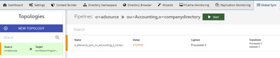
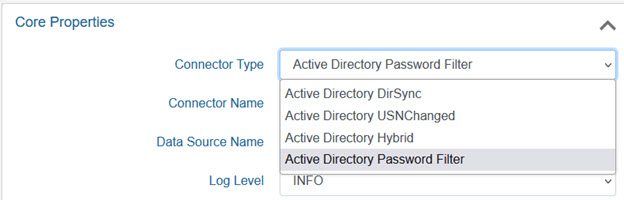
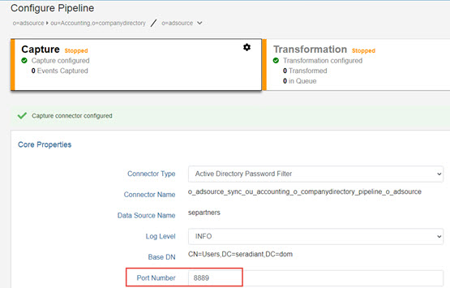

# Configuring Password Synchronization Topology

The first step in configuring password synchronization is to capture the schema and connection information from the Active Directory (where the password filter will be listening for changes) and all data stores that will receive the password changes. For help on capturing schemas, please see the [RadiantOne Context Builder Guide](/documentation/context-builder-guide/introduction).

>[!warning] If the destination/target receiving the password changes is an Active Directory, the target connector must connect to this Active Directory via SSL. For details on how to connect to a data source via SSL, please see the [RadiantOne System Administration Guide](/documentation/sys-admin-guide/01-introduction).

Next, configure the synchronization source and target using the Main Control Panel > Directory Namespace tab and then the needed topology using the Global Sync tab. The topology should be for password synchronization only because the capture/source connector type must be set as type AD Password Filter and this connector type can only be used for synchronizing password changes. In other words, even if you already have a topology that contains your Active Directory source object where you are already detecting changes from (inserts, updates, deletes), you should create a new topology that is solely for password synchronization.

The topology should consist of the user object from the Active Directory schema (as the source) and all other objects that should receive the password change (as targets). Each target requires a separate topology. For example, if Active Directory passwords need to be synchronized to Target Directory 1 and Target Directory 2, one topology will process the password sync from Active Directory to Target Directory 1 and one topology will process the password sync from Active Directory to Target Directory 2. The flow of change should come from the user object (representing the source where the password filter will be listening for changes) and be directed toward the other target object in the topology. In the transformation script, you must set the password attribute from the source user object to the correct destination attribute. The source and target attribute mapping should be userPassword. For help on configuring a topology, please see the [RadiantOne Global Sync Guide](/documentation/global-sync-guide/introduction).

>[!note] You will need the name of the synchronization object for the password filter configuration. For the password filter configuration, the synchronization object is the DN in the RadiantOne namespace that is the parent container for the source Active Directory users. In the example shown below, the sync object is o=adsource.

## Setting the Capture Connector Type

The Active Directory source object should be set for the password filter. Select the topology and click Configure. Select the capture component and the configuration displays. Select Active Directory Password Filter from the Connector Type drop-down menu.

Figure 1: AD Password Filter Connector Type

## Configuring the Connector Properties

Configure the Port Number property.

>[!warning]
>Other connector properties like log level, polling interval, etc. can also be defined, but typically the default values are sufficient. For details on all connector properties, please see the [RadiantOne Connector Properties Guide](/documentation/connector-properties-guide/overview).

### Port Number

The port that the connector should receive the password change on is configured at the level of the connector. Enter the port number and click Save. This should match the port you configure for the password filter.

Figure 2: Port Number for the Connector

### LDAP Filter

To further condition the entries that are published, you can indicate the desired criteria in the LDAP Filter property. This is a post filter, used to qualify which entries are published by the connector. You must enter a valid LDAP filter in the property.

This property can be used to avoid publishing unwanted information.

If a captured entry matches the criteria indicated in the LDAP filter property, it is published by the connector. If it doesn’t, the entry is not published. Information about the skipped entries is in the connector log (with log level set to DEBUG).

### Excluded Branches

To further condition the entries that are published, you can indicate a branch to exclude. In the Excluded Branches property, enter one or more suffixes associated with entries that should not be published in the message by the connector. To list many suffixes, separate the values with `<space>##<space>`. For example, ou=dept1,ou=com ## ou=dept2,ou=com. If the changed entry DN contains a suffix that matches the excluded branches value, or is a change in the exact entry that is listed (e.g. ou=dep1,ou=com), this entry is not published by the connector. Otherwise, the entry is included. This can avoid publishing unwanted information.

>[!note]
>If both included and excluded branches are used, an entry must satisfy the conditions defined in both settings to be included in the message. The included branches condition(s) is checked first.

### Included Branches

To further condition the entries that are published, you can indicate a branch to exclude. In the Excluded Branches property, enter one or more suffixes associated with entries that should not be published in the message by the connector. To list many suffixes, separate the values with `<space>##<space>`. For example, ou=dept1,ou=com ## ou=dept2,ou=com. If the changed entry DN contains a suffix that matches the excluded branches value, or is a change in the exact entry that is listed (e.g. ou=dep1,ou=com), this entry is not published by the connector. Otherwise, the entry is included. This can avoid publishing unwanted information.

>[!note]
>If both included and excluded branches are used, an entry must satisfy the conditions defined in both settings to be included in the message. The included branches condition(s) is checked first.
