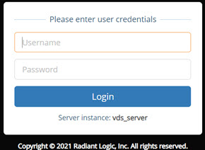
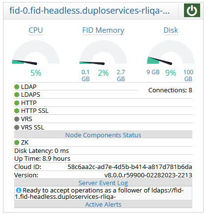

# Getting Started with RadiantOne

RadiantOne is managed from a Main Control Panel and a Server Control Panel. For cluster deployments, there is one Main Control Panel and one Server Control Panel associated with each node in a cluster. For example, if you have a three node cluster, you have one Main Control Panel and three Server Control Panels.

## Main Control Panel

Once RadiantOne has been installed, users should first launch the Main Control Panel, a web-based interface that serves as the central access point for settings and administrative controls.

The Main Control Panel offers administrators remote access to perform common tasks such as monitoring the RadiantOne components and backend data sources, checking server statistics, configuring persistent caches, and managing the virtual namespace. In addition, the identity service wizards and Server Control Panel are accessed from the Main Control Panel. For more information on the [Server Control Panel](#starting-the-main-control-panel), see Starting the Server Control Panel.

>[!note] To access the Main Control Panel, JavaScript must be enabled in the Internet browser you are using.

### Starting the Main Control Panel

To launch the Main Control Panel on Windows, navigate to the Start Menu > All Programs > RadiantOne > Control Panel. This starts the Jetty web server that hosts the Main and Server Control Panels and launches the Main Control Panel in the default web browser.

You can also execute <RLI_HOME>\bin\openControlPanel.bat. This starts the web server if it is not running in addition to opening the Main Control Panel in your default Internet browser. Use <RLI_HOME>/bin/openControlPanel.sh on UNIX platforms.

If the Jetty web server is started, you can launch the Main Control Panel from an Internet Browser using the following URL:

`http://<machine (http://<machine name>:7070/main/login)`

The default HTTP port for the web server hosting the control panel is 7070, the default SSL port is 7171 (you can set the ports during the RadiantOne install).

Your default web browser opens the Main Control Panel in a new tab. You can log in using cn=directory manager as the user with the password you defined during the install.

Figure 1: Main Control Panel Login

### Starting RadiantOne LDAP and HTTP Services

You can start the RadiantOne LDAP and HTTP services from the Main Control Panel. The Dashboard tab shows the server status. From the  drop-down menu, select to start the service. You can stop or restart the service on this screen unless you have installed RadiantOne as a service in which case you must start the service using the methods available on the host operating system. The Dashboard tab displays server statistics when the RadiantOne LDAP service is running.

>[!warning] For test environments and when initially setting up a cluster, it is best to have control over how and when the RadiantOne service starts. Therefore, it is recommended to not configure it as a Windows/Daemon service until you have your environment successfully configured. After, you can configure it to start/stop as a Windows service or Linux Daemon.

>[!warning]For details on configuring and starting RadiantOne as a Windows service or Linux Daemon, please see the RadiantOne Deployment and Tuning Guide.

Figure 2: Overview Section of the Dashboard Tab

If you have deployed a cluster, as long as the Jetty web server is running on all cluster nodes you can start/stop/restart RadiantOne on the nodes from the Dashboard tab of the Main Control Panel.

For details on the usage of each tab in the Main Control Panel, please see the RadiantOne Architect Guide and the RadiantOne System Administration Guide.

### Building Virtual Views

Although there are many ways to create virtual views, the easiest way to get started with RadiantOne is by using the Directory Tree Wizard. This wizard can be launched from the Wizards tab in the Main Control Panel and allows you to quickly aggregate multiple heterogeneous backend data sources below a common root naming context.

There are other wizards available that are focused on more specific use cases (e.g. identity correlation, building dynamic groups). For details on the usage of each wizard, please see the RadiantOne Architect Guide.

## Server Control Panel

The Server Control Panel offers administrators remote access to perform common tasks such as checking server statistics, reviewing log files, configuring server certificate settings, and viewing audit reports.

### Starting the Server Control Panel

The Server Control Panel link in the Main Control Panel opens the Server Control Panel. When this link is clicked, the Server Control Panel associated with the corresponding RadiantOne node opens to the Server Dashboard tab in a new browser tab. The user you are currently connected to the Main Control Panel with is automatically logged into the Server Control Panel.

For details on the usage of each tab in the Server Control Panel, please see the RadiantOne Architect Guide and the RadiantOne System Administration Guide.
