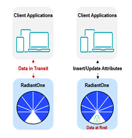

# RadiantOne FIPS 140-2 Mode

Chapter 1: Overview
Federal Information Processing Standards (FIPS) are issued by the National Institute of Standards and Technology (NIST) after approval by the Secretary of Commerce pursuant to Section 5131 of the Information Technology Management Reform Act of 1996 (Public Law 104-106) and the Computer Security Act of 1987 (Public Law 100-235). 

FIPS 140-2 lists the security requirements for cryptographic operations, and the purpose is to establish a baseline standard of how well the confidentiality and integrity of the information protected is. Data encrypted to the standards within FIPS 140-2 is considered to be protected against attacks. Many federal government agencies require that any Personally Identifiable Information (PII) that is classified as sensitive be secured by FIPS 140-2 certified algorithms. The Cryptographic Module Validation Program (CMVP) validates cryptographic modules to FIPS 140-2 and other cryptography based standards. 

## RadiantOne FIPS 140-2 Mode

RadiantOne includes a FIPS-certified cryptographic module. The certification can be referenced here: https://csrc.nist.gov/projects/cryptographic-module-validation-program/certificate/4375

Securing data-in-transit addresses communication between clients and the RadiantOne service as depicted in the diagram below and is addressed by SSL/TLS. Securing data-at-rest addresses how attributes (e.g. user passwords and other sensitive attributes) are encrypted when stored in the RadiantOne Universal Directory (HDAP) storage. These two layers are highlighted in the diagram below and both leverage the FIPS-certified Radiant Logic Cryptographic Module for Java.

 
Figure 1: Data in Transit and Data at Rest

This guide describes how to enable FIPS mode for RadiantOne. For details about the Radiant Logic Cryptographic Module for Java, please see the published security policy at the NIST URL referenced above.
