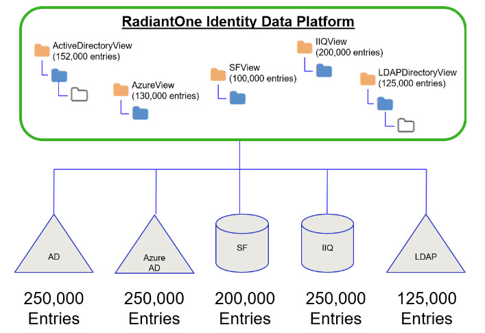
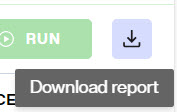

## Overview

This is the overview.

## Access Reports

Access reports 

## Entry Statistics Report

An entry statistics report is a way to gauge how many entries are being managed by the RadiantOne Identity Data Management product.
An entry is defined as a unique object (e.g. person, group, device…etc.) referenceable by a distinguished name and managed by the platform.   
For purposes of entry counting, the following definitions are used: 

-  Directory store: a naming context where a RadiantOne Directory Store is mounted. This is any local store used by the platform.
-  Persistent Cached View: a view that has been configured as persistent cache.
-  Layered View - a view that is created from another store/view in the RadiantOne namespace (Directory store, a persistent cache, an LDAP Proxy View or LDAP Model-driven View).
-  LDAP Proxy View - a non-cached view that is created directly from an LDAP backend data source using a “proxy” approach (e.g. reflecting an existing directory backend hierarchy).
-  Model-driven View -  a non-cached view that is created directly from a backend data source (of any type) using a “model-driven” approach that leverages specific types/class of objects, using container/content components. 

The entries stored in Directory Stores or persistent cache, or returned in views, contribute to the total entry count. Note that this is not necessarily equivalent to the total number of entries in the actual data source (backend), as depicted in the diagram below. 

### Creating an Entry Statistics Report

Navigate to Control Panel > Admin > Entry Statistics Report tab and click **RUN**.

The status of the process indicates one of the following values: 

-  Error: if any error during analysis occurred and there is an error message in the INFO column, the overall Status of the Entry Statistics report will display Error.
-  Pending: this is the status displayed while the entry count is processing.
-  Stopped: this is the status when an entry count is aborted.
-  Done: this is the status when an entry count report has completed without errors. 

>[!note] The entry statistics process logs to vds_server.log. You can look for keyword: NamingContextEntryCountStats in the log. 

The Entry Statistics Report categorizes the entry count results to classify the counting that was performed. Total Managed Entries appears at the top of the report and contains the entry count. 

The table in the report contains the following columns: DN, TYPE, ENTRIES, ACCOUNTED, SIMILAR NAMING CONTEXTS, INFO, DATASOURCE.  

**DN** the naming context that contains the entries analyzed. 

**TYPE**: the type of configuration that is mounted at the naming context. Possible values are: 
-  DIRECTORY
-  PERSISTENT CACHE
-  MODEL DRIVEN VIEW
-  LDAP PROXY
-  LAYERED VIEW
-  CUSTOM VIEW 

**ENTRIES**: the number of entries returned in the view. This number may or may not contribute to the total entry count. The Accounted column indicates if the number of entries contributed to the total count. 

**ACCOUNTED**: contains the keyword FULL, PARTIAL, or NONE to indicate how many entries in the view contributed to the total entry count. FULL means that all entries are included in the total. PARTIAL means that some of the entries are included in the total and some aren’t. NONE means that no entries were included in the total. 

**SIMILAR NAMING CONTEXTS**: naming contexts that are associated with the same backend data source as a naming context that has already contributed to the total entry count. The naming context that has contributed entries to the total count displays the other views/naming contexts in the SIMILAR NAMING CONTEXTS column. 

**INFO**: additional details about the DN, indicating if it represents a target used in a sync pipeline, if the view is a layered view, if the naming context is replicated across clusters, if the naming context is part of a global identity builder project, if the naming context is not active, or if there are errors when trying to count the entries. 

**DATASOURCE**: displays the RadiantOne data source that the view is associated with. Not applicable to the following types: DIRECTORY, LAYERED VIEW or CUSTOM VIEW.

### Exporting an Entry Statistics Report

Entry statistics reports can be exported to a CSV file using the *Download Report* option.

You can share your report with Radiant Logic if you want more details on how your total number of entries was calculated.
