# Introduction

Prior to diving into this guide, it is recommended that you read the [RadiantOne Architect Guide](/documentation/architect-guide/preface) for a high-level overview of the capabilities of the RadiantOne Platform. This guide introduces concepts in addition to step-by-step instructions to configure and administrate the RadiantOne.

For details on deploying RadiantOne including tuning and maintenance, please see the [RadiantOne Deployment and Tuning Guide](/documentation/deployment-and-tuning-guide/00-preface).

## How this Manual is Organized

This guide is broken down into the following chapters:

[Introduction](01-introduction.md)
<br> This chapter offers a quick introduction to this guide in addition to how the manual is organized and how to contact Radiant Logic technical support.

[Concepts](02-concepts.md)
<br> This chapter introduces the main concepts that are essential to understand to configure and administrate RadiantOne.

[Front End Settings](03-front-end-settings.md)
<br> This chapter describes the Settings tab, where you can manage the majority of RadiantOne settings.

[Backend Settings](04-backend-settings.md)
<br> This chapter introduces settings that are related to how RadiantOne accesses backend data sources.

[Creating Virtual Views](05-creating-virtual-views.md)
<br> This chapter describes how to create virtual views from LDAP, database or web service backends or local RadiantOne Universal Directory stores.

[Security](06-security.md)
<br> This chapter describes access controls, security settings for RadiantOne, and how to configure them.

[Directory Schema](07-directory-schema.md)
<br> This chapter describes the RadiantOne LDAP schema and the different ways to extend it.

[Directory Browser](08-directory-browser-tab.md)
<br> This chapter describes the functions offered in the Directory Browser tab.

[Logs](09-logs.md)
<br> This chapter describes the RadiantOne access log, changelog, and log settings. 

[Monitoring](10-monitoring.md)
<br> This chapter introduces persistent cache monitoring, replication monitoring, and alerts. 

## Technical Support

Refer to the [Technical support guide](../common-info/technical-support.md) for more information.

## Expert Mode

Some settings in the Main Control Panel are accessible only in Expert Mode. To switch to Expert Mode, click the Logged in as, (username) drop-down menu and select Expert Mode. 


>[!note] The Main Control Panel saves the last mode (Expert or Standard) it was in when you log out and returns to this mode automatically when you log back in. The mode is saved on a per-role basis.


# RadiantOne Control Panels

The RadiantOne Control Panels are web-based interfaces to provide remote access to the most commonly used tools and wizards. The control panels are used by administrators to configure and maintain the service. In addition, the control panels offer monitoring, access to server statistics, reports, task management, and other administration options. It can be accessed from mobile or non-mobile devices including smartphones and tablets.

>[!note] To access the control panels, JavaScript must be enabled in the Internet browser you are using.

For cluster deployments, each RadiantOne node includes a Control Panel and administrators can log into any of them.

## Accessing the Control Panels

The Control Panels utilize a web server that is installed with RadiantOne. The endpoint to access the Control Panel is defined when you create an environment in the Environment Operations Center. For details on creating environments and locating the Control Panel endpoint, see the [RadiantOne Environment Operations Center Guide](/documentation/environment-operations-center-guide/overview).


Figure 1: Main Control Panel Login Page

<!--

>[!warning] 
>You are unable to log in to the Control Panel if [mutual authentication](04-backend-settings#mutual-authentication) is set to REQUIRED.

-->

The background color of the login screen can be customized after you log into the Main Control Panel. Click  and enter a value for the Color Theme.

### Logging in with Username and Password

You can log in using directory administrator (default cn=directory manager) as the user with the password you set for the directory administrator during the install of RadiantOne. The Control Panel also supports [delegated administration](01-introduction#delegated-administration-of-radiantone) accounts if you prefer not to use the directory administrator account. When a user logs in, the control panel application passes the credentials to RadiantOne for authentication. A user can either use their full DN (if known), or their user ID. However, to login with just a user ID, you must configure a [user ID to DN Mapping](03-front-end-settings#user-to-dn-mapping).

The Main Control Panel displays a message when authentication fails. The table below lists the possible error messages. 

Message	 | Cause | Solution
-|-|-
“Authentication failed. Reason: Access is denied.” | Incorrect login ID or incorrect password. | Verify the login ID and password and try again.
"Authentication failed. Reason [LDAP: error code 49 - Password has expired.]" [A Reset Password link is displayed.] | Password expiry.	 | Click the Reset Password link.
“Authentication failed. Reason: [LDAP: error code 19 - The password failure limit has been reached and the account is locked. Please retry later or contact the system administrator to reset the password.]” | The account is locked. | Retry later or contact the system administrator to reset the password.

<!--

### Logging in with PIV Card/Smart Card/Certificate

You can log in using a PIV Card/Smart Card/Certificate as an alternative to using username and password. To support this functionality, login with the default super user account and configure the following.

1.	If the client certificate is signed by a Certificate Authority (CA) known/trusted by RadiantOne, you can skip steps 1-5. Otherwise, go to the Main Control Panel, Settings tab, Security, Client Certificate Truststore.

2.	In the Client Certificate Truststore section, click **IMPORT**.

3.	Enter a name in the Certificate Alias property.

4.	Choose the option to import file on the server or import a local file and browse to the public key certificate corresponding to the certificate on the PIV card of the user that should be allowed to login. Certificates imported into the Cluster Level Truststore are appended to the certificates contained in the cacerts store installed with the default JDK (<RLI_HOME>/jdk/jre/lib/security/cacerts). Therefore, all certificates not known/trusted by default should be imported into the Cluster Level Truststore.

5.	Click **OK**.

6.	On the Settings tab, Security section, SSL, click CHANGE next to Client Certificate DN Mapping.

>[!warning] 
>The Client Certificate DN Mapping is only accessible by a member of the [Directory Administrator role/group](01-introduction#delegated-administration-roles).

7.	Click `ADD` and set the Certificate DN to the subject in the user’s certificate. If the subject in the SSL certificate is blank, you can specify that a Subject Alternative Name (SAN) should be used. You can use an alternative name in the mapping by specifying {alt} before the regular expression. For example: {alt}^(.+)$ uses the first alternative name found. You can be more specific to specify which alternative name you want to match by specifying the type [0-8]. For example: {alt:0}^(.+)$ uses the otherName alternative name. The type number associated with each is shown below.

Alternative Name | Type Number
-|-
otherName | [0] 
rfc822Name | [1]
dNSName | [2]
x400Address | [3]
directoryName | [4]
ediPartyName  | [5]
uniformResourceIdentifier | [6]
iPAddress | [7]
registeredID | [8]

>[!note] 
>If the certificate subject/SAN fails to match a Client Certificate DN Mapping rule, the login to the Control Panel fails.

8.	Set the mapped DN to any [delegated admin user](01-introduction#delegated-administration-roles) configured in RadiantOne. An example is shown below where the certificate subject is mapped to cn=directory manager.

>[!note] 
>If the RadiantOne service is not running, you are only able to log into the Main Control Panel with the directory super user account (e.g. cn=directory manager). If your Client Certificate DN mapping results in a user that is not the directory super user, and the RadiantOne service is not running, you will not be able to log into the Main Control Panel.


 
Figure 2: Client Certificate DN Mapping

9.	Click **OK** to exit the Client Principal Mapping window.

10.	Click **Save**.

11.	Open a Chrome Internet browser and use Ctrl+Shift+n to enter incognito mode (you can use other browsers, and it is also recommended to use Incognito/InPrivate mode to ensure no cache affects the behavior).

12.	Access the Control Panel on the HTTPS endpoint. E.g. https://cp-rliqa.dc.federated-identity.com/main/login
<br>By default, the Control Panel leverages the same SSL server certificate as the RadiantOne service. Make sure this certificate is trusted by your computer/browser, otherwise the browser displays security warnings when you access the Control Panel over HTTPS. An example is shown below.

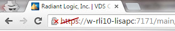

Figure 3: Security Message in Browser Due to Untrusted Certificate of the Control Panel

13.	The Control Panel will request a certificate from the browser, so the browser will prompt the user with a list of loaded/trusted certificates. The user selects/confirms their certificate. An example is shown below.


Figure 4: User Selects Certificate Associated with PIV Card

14.	[CRL checking](06-security#certificate-revocation-list) (if enabled) is applied and if the certificate is valid and trusted, the user is logged into the Control Panel and has the permissions associated with the user defined in the Client Certificate DN Mapping configured in steps 7 and 8 above.

15.	Once logged into the Main Control Panel, the user is prompted to select the certificate again. This second prompt is to indicate the credentials to be used for the Directory Browser tab (as a REST client to the RadiantOne service). 

>[!warning] 
>If you log out of the Control Panel, you are redirected to the main login form. If you want to be prompted to select your certificate again, you must close and re-open your web browser.

-->

### OpenID Connect Token Authentication 

The RadiantOne Main Control Panel also supports OpenID Connect (OIDC) token-based authentication. This option provides the security of sending user login credentials to the authentication server (the Identity Provider), not the application (Control Panel, the Relying Party). OpenID Connect token authentication allows you to send your username and password just once, to the Identity Provider (IDP) and then pass the token in the request to the Main Control Panel. When OIDC is configured in RadiantOne, the Main Control Panel login screen displays:


Figure 12: Login with Open ID Connect

The administrator must click the Login with OpenID Connect option to login with an OpenID Connect token.

The high-level flow is shown below.


Figure 4: OIDC Authorization Code Flow

Detailed steps:

1.	The RadiantOne Admin navigates his browser to the RadiantOne Main Control Panel and clicks “Login with OpenID Connect”.

2.	The browser redirects the user to the OIDC Provider’s authorization endpoint with the necessary parameters (ClientID, redirect URI, scope).

3.	The RadiantOne Admin will authenticate to OIDC server (if not already authenticated) and the OIDC server prompts the user for authorization: Control Panel wants to access info (scopes) about you. Do you Authorize this?

4.	Admin user gives consent.

5.	OIDC server gives Control Panel an Authorization code.

6.	The Control Panel sends the OIDC server the authorization code and requests an ID token.

7.	OIDC Server sends the ID token to Control Panel.

8.	Control Panel uses the information in the token along with the OIDC to FID User Mapping rules to locate the user in the FID namespace to enforce permissions based on what delegated admin role the user is a member of – which dictates what the admin is allowed to do within the Control Panel.

To enable support for OIDC authentication:

1.	Have your client ID and secret associated with the Control Panel application configured in your OIDC server ready. The Redirect URL configured for the web application should point to the URL associated with the Main Control Panel. Example: https://cp.federated-identity.com/main/j_spring_openid_security_check

2.	Log into the Main Control Panel.

3.	Navigate to Settings > Security > OIDC Provider Configuration.

4.	Select an OIDC Provider from the drop-down list. If you are using your own provider, select the Custom option.

5.	Click Discover. The Authorization Endpoint URL and Token Endpoint URL should auto-populate. If you configure a custom provider, you can enter the needed Authorization Endpoint URL and Token Endpoint URL. In OpenID Connect the authorization endpoint handles authentication and authorization of a user. In the OpenID Connect Authorization Code Flow, the token endpoint is used by a client to obtain an ID token, access token, and refresh token.

6.	Enter the Client ID associated with the Control Panel application configured in the OIDC provider.

7.	Enter the Client Secret associated with the Control Panel configured in the OIDC provider.

8.	Select the Client Authentication Method corresponding to how the Control Panel client has been configured in the OIDC Server. There are two options available: CLIENT_SECRET_POST and CLIENT_SECRET_BASIC.

9.	Click the value for Requested Scopes to display a list of possible choices: openid, email, profile. Openid is required. You can add more if needed as long as they match the configuration of the client in the OIDC server.

10.	Click Edit next to OIDC to FID User Mapping. This configuration determines the logic to link the user that logs into the Control Panel with an Open ID Connect token with an identity in the RadiantOne namespace. This process determines which identity is used to enforce authorization within the Main Control Panel. The user mappings must result in a single user. If no user is found or if more than one user is found, the login fails. The RadiantOne user that is linked to the authentication token must be a member of a RadiantOne [Delegated Administrative group](01-introduction#delegated-administration-roles). 

11.	In the OIDC to FID User Mappings window, click `Add`.

12.	There are two options for identifying the RadiantOne admin user. If the RadiantOne user can be identified by using values/claims from the token to comprise the DN, use the Simple DN Expression Builder. If the RadiantOne user can be identified by performing a lookup in RadiantOne based on values from the token, use the Search Expression Builder.

13.	Click `Save`.

Examples of configuring the Simple DN Expression and the Search Expression are shown below.

In the Simple DN Expression example shown below, the RadiantOne user is identified by using the given_name and family_name claims from the token to compute the DN.


Figure 5: DN Expression Builder

In the Search Expression example shown below, the values of the family_name, given_name, and email claims from the token are used to condition a sub-tree search in RadiantOne, starting at the dc=mydomain naming context to locate the identity.


Figure 6: Search Expression Builder

### Auto-Logout

After 30 minutes of inactivity, a user is automatically logged out.

## Adding a Custom Message on the Login Page

The Main Control Panel login page contains a basic username and password text box. To add a custom message on the login page, follow the steps below.

1.	Log in to the Main Control Panel as a member of the Directory Administrators role.

1.	Go to the Zookeeper tab (requires [Expert mode](01-introduction#expert-mode)).

1.	Navigate to `radiantone/<version>/<clusterName>/config/vds_server.conf`.

1.	On the right, click **Edit Mode**.

>[!warning] 
>Each property (corresponding to a line) must end in a comma (,) except for the last property in the configuration.

1.	Add (or edit) the motdHtml tag containing the message to display on the login page.

"motdHtml": "This is my custom message. Please login with your RadiantOne Administrator account.",


6.	Click **Save**.

7.	Log out of the Main Control Panel. 
An example of the custom message on the login page is shown below.


Figure 7: Custom Message on Login Page

If you would like the message to be prefixed with a “Warning” icon and be in bold font, go back to the Zookeeper tab and add or edit the "motdWarning" tag with a value of true. An example is shown below.

"motdWarning": true,


Figure 8: Custom Message on Login Page with Warning Label and Bold Font

If you would like the custom message and “Warning” icon to display as a popup window, go back to the Zookeeper tab, and add or edit the “motdPopup” tag with a value of true. An example is shown below.

"motdPopup" : true,


Figure 9: Custom Message Popup Window

## Using the Main Control Panel

The Main Control Panel allows administrators to manage and monitor the RadiantOne service. If a cluster is deployed, all nodes can be monitored and managed from the Main Control Panel. 

All settings configured in the Main Control Panel apply to all cluster nodes. 

Node/server specific configuration is managed from the Server Control Panel. The Server Control Panel associated with each node can be launched from the Dashboard tab of the Main Control Panel.

The configuration and monitoring features described in this section are applicable to the Main Control Panel. Configuration and monitoring features associated with the Server Control Panel are described [here](01-introduction#using-the-server-control-panel).

# Accessing the Server Control Panel

Once the Main Control Panel is started, you can also access the Server Control Panel by clicking  in the top banner. The Server Control Panel opens in a new browser tab and you are automatically logged in based on the identity used in the Main Control Panel. 

# Using the Server Control Panel

The Server Control Panel allows RadiantOne administrators to configure and monitor a specific RadiantOne node.

The configuration and monitoring features described in this section are applicable to the Server Control Panel. Configuration and monitoring features associated with the Main Control Panel are described [here](01-introduction#using-the-main-control-panel).

## Dashboard Tab

A series of graphs are displayed on the Dashboard tab and allow for monitoring a variety of aspects related to a given RadiantOne node. The graphs display CPU usage, JVM memory usage, disk space usage, disk latency and number of client connections.

>[!warning] 
>To use this feature, enable the cluster monitor at Main Control Panel > Settings > Logs > Clustermonitor.


Figure 10: Graphs Related to a Specific RadiantOne Node

In the upper right, you can indicate the time range the graphs should display. To indicate a time period of longer than 12 hours, choose the Custom option.


 
Figure 11: Graph Range

>[!warning] 
>It is generally not recommended to expand the graph range beyond a 12-hour period since it causes a large amount of HTTP and LDAP requests to RadiantOne that is proportional in quantity to the length of the time period requested. For example, a 12-hour period generates ~100 requests.

## Usage & Activity Tab

From the Usage & Activity tab on the Server Control Panel, you can access information about the RadiantOne software version installed on the node, monitor the current connections and operations, view statistics for all Universal Directory (HDAP) stores and view network latency between nodes (only applicable to cluster deployments).

### Server Information

Specific product details associated with the node are shown in the Server Information section.

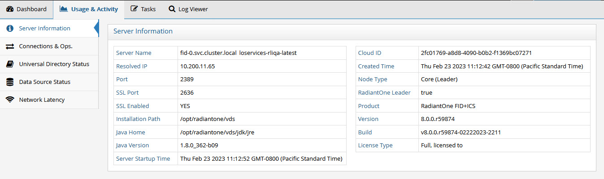
 
Figure 2: Server Information

**Server Name** – Indicates the machine name where RadiantOne is installed.

**Resolved IP** – The resolved IP address associated with the host name of the machine.

**Port** – Indicates the internal non-SSL (LDAP) port for the RadiantOne service.

**SSL Port** – Indicates the internal SSL (LDAPS) port for the RadiantOne service.

**SSL Enabled** – Indicates if SSL is enabled for the RadiantOne service. This is the LDAPS port.

**Installation Path** – Indicates the file system path where RadiantOne is installed.

**Java Home** – Indicates the location of Java in the environment being used by RadiantOne.

**Java Version** – Indicates the Java version used by RadiantOne.

**Server Startup Time** – Indicates the time the RadiantOne service was last started.

**Cloud ID** – The unique GUID associated with the RadiantOne node. 

**Created Time** – Indicates the time RadiantOne was installed.

**Node Type** – Indicates the type of node. If RadiantOne is deployed in a cluster, the value could be core (leader), core (follower) or follower only.

**RadiantOne Leader** – Has a value of true if the RadiantOne node is the leader of the cluster. Otherwise the value is false, meaning it is a follower or follower only node in the cluster.

**Product** - SKU associated with the RadiantOne version.

**Version** – Indicates the version of the RadiantOne.

**Build** – Indicates a specific build ID associated with RadiantOne.

**License Type** – Indicates the type of RadiantOne license used along with the email address and company name the license key was issued to.

## Connections & Operations

From the Connections & Ops section you can view the current usage summary in terms of connections and operations to RadiantOne.

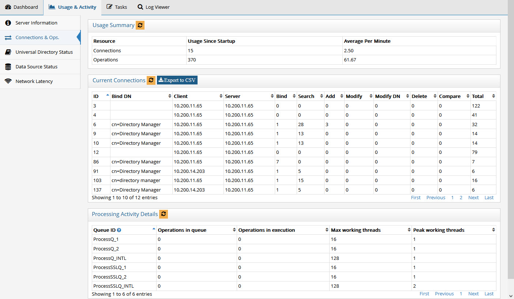
 
Figure 3: Server Connections and Operations

In the Usage Summary section, you see connection usage since startup and average per minute. You all see operations since startup and average per minute.

In the Current Connections section, there is a summary of operation types per connection (including a total number of operations) and the bind user that established the connection. You will also see the Client IP address associated with the open connections. To export current connection data into a CSV-format report, click **Export to CSV**. The .csv file is downloaded the client machine according to the web browser’s configuration.

The Processing Activity Details section, shows how many operations are waiting to be processed, how many operations are currently being executed in addition to the maximum working threads available and peak worker threads used.

### RadiantOne Universal Directory (HDAP) Status

Statistics for the stores can be viewed from the Universal Directory Status section. To filter the stores displayed, click on  and then click Select Filters. Select the stores to display and click OK.

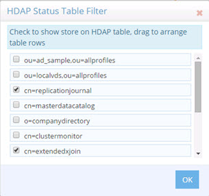
 
Figure 4: Tables to Display

For each store, you see total number of entries, index size, search operations per second and write operations per second.

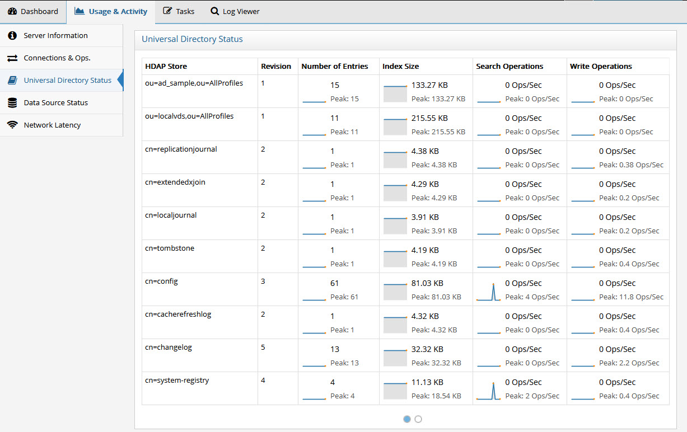
 
Figure 5: RadiantOne Universal Directory Stores

### Data Source Status

In the Data Source Status you can see the status of all data sources defined in RadiantOne. A green dot in the Status column indicates that the data source is configured properly and running. A red dot in the Status column indicates that something is wrong with the data source configuration and RadiantOne cannot currently access it. There is a corresponding error message that states the main problem. If the error is due to incorrect connection information, update the data source on the Main Control Panel > Settings Tab > Server Backend section. Once the error has been corrected click on the refresh icon next to “Data Source Status” and the data source information refreshes to reflect your changes.


Figure 6: Data Source Status

The status values are on, off, offline, and unavailable. The following table describes each status. 

Status	| Definition
-|-
On	| RadiantOne can connect to the data source.
Off	| The connection test to the data source failed.
Offline	| The data source’s active property is set to false.
Unavailable	| No classname property is defined for the data source.

### Network Latency

The graphs in the Network Latency section display the network latency between nodes in a cluster in addition to the network latency on the local node. In the upper right, you can indicate the time range the graphs should display.

>[!warning] 
>To use this feature, enable the cluster monitor at Main Control Panel > Settings > Logs > Clustermonitor.


 
Figure 7: Network Latency Graphs

<!-- 

## Settings Tab

To change the server name and manage server certificates, go to the Server Control Panel > Settings tab.

### Server Name

The hostname where the server is installed. By default this is set to the machine name.

This value can be seen in ZooKeeper from the Zookeeper tab in the Main Control Panel at: /radiantone/v1/cluster/shards/shard1/services/vds/registry/<unique ID assigned to the server>
<!--
If RadiantOne is running on a multi-homed machine, you can change this parameter to specify a single IP address (or host name). The value set here can work in conjunction with the Server Socket: Restrict to Host/IP specified in Multi Home settings and SSL Server socket: Restrict to Host/IP specified in [Multi Home settings](settings-tab#multi-home-settings) defined in the Main Control Panel > Settings tab > Server Front End section > Advanced sub-section.


Changing this value is a delicate operation that must be performed during off-peak hours generally during a maintenance window. You must have your original (unapplied) license key file from Radiant Logic and make sure that the RadiantOne service and Jetty (that hosts the Control Panel) are stopped. Then, follow the steps below.

1.	Save the original, unapplied license key into the <RLI_HOME>/vds_server folder (override the license.lic file that is there).

2.	Edit <RLI_HOME>/vds_server/conf/cloud.properties to set the zk.servers properties to match the new host name.

3.	Edit <RLI_HOME>/bin/openControlPanel.bat (or Linux equivalent) and update the value for: set URL=%PROTOCOL%://<YOUR_NEW_HOSTNAME>:%PORT%/

4.	Run openControlPanel.bat (or Linux equivalent) to launch the RadiantOne Main Control Panel. 

5.	From a command prompt, execute ./bin/advanced/cluster.bat update-hostname (or on linux: ./bin/advanced/cluster.sh update-hostname)

6.	Restart the machine. 

7.	Run openControlPanel.bat (this will start Jetty) to launch the RadiantOne Main Control Panel. 

8.	From the Settings tab > Server Back End > LDAP Data sources, edit replicationjournal and change the hostname to match the new value.

9.	Click **Save**. 

10.	From the Settings tab > Server Back End > LDAP Data sources, edit vdsha and change the hostname to match the new value.

11.	Click **Save**. 

12.	Start the RadiantOne service on all nodes.

### Manage Server Certificates

A server certificate used by RadiantOne uniquely identifies it to clients for establishing SSL/TLS and StartTLS connections. RadiantOne supports the JSSE standard provided by Java. RadiantOne is installed with a default self-signed certificate. If you have your own server certificate, please follow the steps listed below in the Replacing the Default Self-signed Certificate section.

>[!warning] 
>Every time you change the RadiantOne server certificate, you must export the public key and import this public key into the [Client Certificate Truststore](client-certificate-trust-store) (unless the CA that signed the server certificate is already trusted). Also, the RadiantOne server certificate is shared by the Jetty server to support HTTPS access to the Control Panel(s). If you prefer HTTPS access to the Main Control Panel to use a different certificate, you must [manually update the settings for Jetty](#updating-certificate-settings-for-jetty-https-access-to-the-main-control-panel).

### Replacing the Default Self-Signed Certificate

During the RadiantOne installation, a default self-signed certificate is generated for RadiantOne. This self-signed certificate can be replaced with one assigned by a Certificate Authority (CA). Follow the steps below corresponding to your certificate type. If you require a certificate and RadiantOne configuration that is FIPS 140-2 compliant, skip the steps in this section and see the RadiantOneFIPS_Mode Guide.

>[!warning] 
>If RadiantOne is deployed in a cluster, and each node has their own server certificate, the following steps must be performed on each node independently.

<!-- 

#### JKS Certificate

To replace the default installed self-signed certificate with a new JKS certificate type:

1.	Navigate in the file system to <RLI_HOME>/vds/vds_server/conf.

2.	In the file system, rename RLI.keystore.

3.	Open a command prompt and navigate to <RLI_HOME>/vds/jdk/jre/bin.

4.	Request a certificate from a certificate authority. The example below uses a Microsoft Certificate Authority. The following command generates the virtual directory server’s private key. In this scenario, this command creates the rli.keystore file.

```
C:\radiantone\vds\jdk\jre\bin>keytool -genkey -alias rli -keyalg RSA -keystore C:\radiantone\vds\vds_server\conf\rli.keystore -dname “cn=machine1,dc=novato,dc=radiantlogic,dc=com"
Enter keystore password: radiantlogic
Enter key password for <rli>
(RETURN if same as keystore password):
```

-	The rli.keystore must be located in <RLI_HOME>/<instance_name>/conf. The default keystore password is radiantlogic. The key password can be whatever you want. You must set this same password for the Server Certificate Password parameter on the Server Control Panel > Settings Tab. After setting the password here, remember to click **Save** and restart the RadiantOne service.

-	The -dname value is the name of the machine RadiantOne is running on.
-	The -alias value must be rli

>[!warning] 
>This stores a new certificate in the rli.keystore as alias rli, and with common name:machine1.novato.radiantlogic.com. Machine1 in this case is the name to reference RadiantOne through TCP/IP, so make sure to enter a valid dname parameter matching the hostname of the machine where RadiantOne is running. At this point the certificate will be “self-signed”. Later, the certificate will be modified and signed by the CA.

5.	From the Server Control Panel -> Settings tab, click **View** next to View Server Certificate. The initial key has been generated. 

>[!note] The View button is enabled for JKS certificate types only. It is not applicable for another other certificate types.


Figure 9: SSL Server Certificate for RadiantOne

6.	Next, you can download the Root Certificate from the Microsoft CA. From a web browser, access the certificate server.
http://< IP address>/certsrv

7.	Select Download a CA Certificate, Certificate Chain, or CRL.

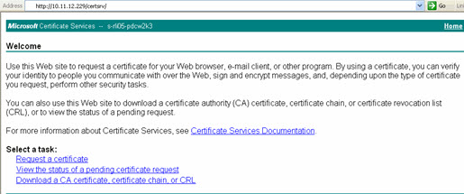
 
Figure 10: Certificates Services Console

8.	Select the certificate from the list and choose the encoding method DER.

9.	Click **Download CA certificate**.


 
Figure 11: Downloading a Root CA Certificate

10.	Click **Save** to save the certificate file.

11.	Navigate to <RLI_HOME>/<instance_name>/conf and save the certificate as certca.cer.

The file can be saved in any location. The location mentioned above is a suggestion.

12.	Import the certca.cert into rli.keystore with the following command:

```
C:\radiantone\vds\jdk\jre\bin>keytool -import -file c:\radiantone\vds\vds_server\conf\certca.cer -keystore c:\radiantone\vds\vds_server\conf\rli.keystore -alias rootca
Enter keystore password: radiantlogic
```

>[!warning] 
>The Root CA certificate and any intermediary signing certificates must be imported into rli.keystore.

13.	Next, you can generate a certificate signing request. The next few steps describe how to generate a request file that will be sent to the Microsoft CA so it can sign the private key that was generated in step 3 above.

```
C:\radiantone\vds\jdk\jre\bin>keytool -certreq -alias rli -keystore C:\radiantone\vds\vds_server\conf\rli.keystore -file C:\radiantone\vds\vds_server\conf\vdsserver.csr
Enter keystore password: radiantlogic
```

14.	Navigate to <RLI_HOME>\<instance_name>\conf and open the file vdsserver.csr and you will find the certificate request (see sample below):

```
-----BEGIN NEW CERTIFICATE REQUEST-----
MIIBnzCCAQgCAQAwXzETMBEGCgmSJomT8ixkARkTA2NvbTEcMBoGCgmSJomT8ixkARkTDHJhZGlhbnRsb2dpYzEWMBQGCgmSJomT8ixkARkTBm5vdmF0bzESMBAGA1UEAxMJdmRzc2VydmVyMIGfMA0GCSqGSIb3DQEBAQUAA4GNADCBiQKBgQDIMfutW56qae899+rd/36URsy+J1E3fgKCpi6C00suVOhZfGf97wNGlJKA6sz++WFaAiy/HhLyd4+zevsKGAY7x6fKhz3cGFaU/2ICgeSVPrOx6zhYyUyFedJYTpel7GKoqsxIlTvNnBtDg6mVE81BTSBXX5LrIf1HD9Y1dHJXbwIDAQABoAAwDQYJKoZIhvcNAQEEBQADgYEAQVpuEtcxGXWr4eFNSlBzEkCSp70AZyn+6fl3cl3vZnnez7s6TL/Uqgm4lUCIdPUQeRkr0VHNut+j4uVahax+IKvJ6ZJB4kzQC8Qz2hZuMPafjlEzcttgleQZ6bAgaFjpD3vn3poaYmokzGkwhdnU7EfEJzOXGAPW8c5H3PDqick=
-----END NEW CERTIFICATE REQUEST-----
```

15.	Now, the certificate request that was generated in the last step needs to be submitted to the Microsoft CA for signing. From a web browser, access the certificate server.
http://<IP address>/certsrv

16.	Select Request a Certificate Option.

17.	Select Advanced Certificate Request.


Figure 12: Requesting a Certificate

18.	Choose Submit a certificate request by using a base-64-encoded CMC or PKCS #10 file, or submit a renewal request by using a base-64-encoded PKCS #7 file.

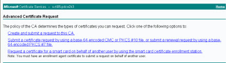
 
Figure 13: Advanced Certificate Request

19.	Paste the entire contents from the certificate request file that was generated previously.

20.	From the Certificate Template drop-down list, select Web Server.

21.	Click **Submit**.

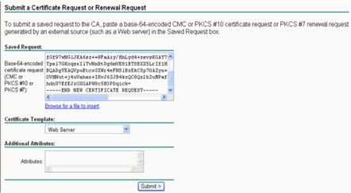
 
Figure 14: Submitting the Certificate Request

22.	Choose the DER encoded option.

23.	Click **Download Certificate**.

 
 
Figure 15: Downloading the Certificate

24.	Click **Save**.

25.	Navigate to <RLI_HOME>/<instance_name>/conf and name the file vds.cer.

26.	Finally, you can import the signed server certificate into the RadiantOne keystore using the following command:

```
C:\radiantone\vds\jdk\jre\bin>keytool -import -file c:\radiantone\vds\vds_server\conf\vds.cer -keystore c:\radiantone\vds\vds_server\conf\rli.keystore -v -alias rli
Enter keystore password: radiantlogic
Certificate reply was installed in keystore
[Saving c:\radiantone\vds\vds_server\conf\rli.keystore]
```

>[!warning] 
>This updates the server certificate that was created in Step 3. It will now be signed by the CA (and not self-signed anymore).

27.	Import the CA Root Certificate (e.g. certca.cer) into the RadiantOne client truststore from the Main Control Panel > Settings Tab > Security section > Client Certificate Truststore. On the right side, click IMPORT.

>[!warning] 
>Any client that needs to connect to the RadiantOne service via LDAPS or HTTPS (for the web service interface) must import this CA Root Certificate into their trust store (unless they already trust the CA who signed it).

28.	Enter an alias to uniquely identify the certificate in the truststore. Then, depending on the location of the certificate, choose to import the file from the server or the local box from where you are accessing the Control Panel from. After browsing to the certificate, click Open and then OK to exit the Import window.

29.	Click **Save**.

30.	From the Dashboard tab of the Main Control panel, launch the Server Control Panel associated with the node you configured the certificate for.

31.	On the Server Control Panel, go to the Settings Tab. 

32.	Set the Server Certificate Key Store to the keystore (e.g. c:\radiantone\vds\vds_server\conf\rli.keystore).

33.	Set the Server Certificate Key Type to JKS.

34.	Click **Change** next to the Server Certificate Password parameter. Enter the certificate password. Click **Save**. The Server Certificate Password must be the same value as the keystore password.

35.	If you made changes to the Server Certificate Key Store, Server Certificate Key Type or Server Certificate Password, restart the RadiantOne service. If RadiantOne is deployed in a cluster, each node has its own server certificate and must be updated independently.

>[!warning] 
>If Jetty is configured to use the same server certificate as RadiantOne (jetty.ssl.useVDSSSLConfig=true in <RLI_HOME>/vds_server/conf/jetty/config.properties), and you modify the RadiantOne server certificate outside of the RadiantOne Main Control Panel (e.g. using command line utilities like keytool), you must [manually update the Jetty settings](#updating-certificate-settings-for-jetty-https-access-to-the-main-control-panel).

><span style="color:red">**If you use the RadiantOne SAML Attribute service, manually update the certificate keystore path in <RLI_HOME>/vds_server/conf/saml/server/AttributeService.properties.**

#### PKCS12 Certificate

For PKCS12 types of certificates (.pfx or .p12), make sure the certificate is created with ServerAuth extended key usage. The public key certificate associated with the PKCS12 certificate is also required. This can be the public key certificate of the intermediate signing CA or the public key certificate of the root CA who signed the intermediate CA.

1.	Place the server certificate (containing the private key) into <RLI_HOME>/<instance_name>/conf directory. The default instance is vds_server.

2.	Open the Server Control Panel -> Settings Tab. 

3.	Set the Server Certificate Key Store to the path to the certificate (containing the private key). E.g. c:\radiantone\vds\vds_server\conf\doce1win2.pfx. 

4.	Set the Server Certificate Key Type to PKCS12.

5.	Click **Change** next to the Server Certificate Password parameter. Enter the certificate password and click **Save**, then close. The Server Certificate Password must be the same value as the keystore password.

6.	Click **Save**.

7.	Restart the RadiantOne service.

8.	Now, the public key (this can be the public key certificate of the intermediate signing CA or the public key certificate of the root CA who signed the intermediate CA) must be added to the RadiantOne client truststore. Go to the Main Control Panelv> Settings tab. Go to Security > Client Certificate Truststore. On the right, click Import.

9.	Enter an alias to uniquely identify the certificate in the truststore. Then, depending on the location of the certificate, choose to import the file from the server or the local box from where you are accessing the Control Panel from. After browsing to the certificate, click Open and then OK to exit the Import window.

10.	Click **OK** to save the changes.

>[!warning] 
>Any client that needs to connect to the RadiantOne service via LDAPS or HTTPS (for the web service interface) must import this public key certificate into their trust store (unless they already trust the CA who signed it).

11.	Save the changes.

12.	Restart the RadiantOne service. If RadiantOne is deployed in a cluster, each node has its own server certificate and must be updated independently.

>[!warning] if Jetty is configured to use the same SSL certificate as RadiantOne (jetty.ssl.useVDSSSLConfig=true in <RLI_HOME>/vds_server/conf/jetty/config.properties), and you modify the RadiantOne server certificate outside of the RadiantOne Main Control Panel (e.g. using command line utilities like keytool), you must [manually update the Jetty settings](#updating-certificate-settings-for-jetty-https-access-to-the-main-control-panel).

If you use the RadiantOne SAML Attribute service, manually update the certificate keystore path in <RLI_HOME>/vds_server/conf/saml/server/AttributeService.properties.

#### PKCS11 Certificate

The Cryptographic Token Interface Standard, PKCS#11, is produced by RSA Security and defines native programming interfaces to cryptographic tokens, such as hardware cryptographic accelerators and Smartcards. The Sun PKCS#11 provider included in Java is used to facilitate the integration of native PKCS11 tokens. This provider enables RadiantOne to access native PKCS11 tokens. The Sun PKCS11 provider does not implement cryptographic algorithms, but instead acts as a bridge between the Java JCA and JCE APIs and the native PKCS11 cryptographic API, translating the calls between the two. Any cryptographic device (e.g. smartcards, hardware accelerators...etc.) that includes a PKCS11 implementation can be leveraged by RadiantOne. The Sun PCKS11 provider requires an implementation of PKCS11 v2.0 or later installed on the RadiantOne machine. This implementation is in the form of a shared-object library (.so file on Linux) or dynamic-link library (.dll on Windows).

>[!note] for an example of RadiantOne deployed with PKCS11 and an NSS Database, see the RadiantOneFIPS_Mode document included with your RadiantOne install.

1.	Before you can create a PKS11 provider in the JVM you need to create a configuration file. The configuration file is a text file containing key-value pairs for the configuration options. Although there are many options available (see the Oracle Java PKCS11 Reference Guide), the example used below is for NSS.

    A file named “/home/vdsuser/vds-fips/nss_fips.cfg” is created with the following contents:

    name = nss-fips
    nssLibraryDirectory = /usr/lib64
    nssSecmodDirectory = /home/vdsuser/vds-fips/nssdb
    nssModule = fips

    >[!note] “/usr/lib64” is the folder under which the NSS libraries reside and “/home/vdsuser/vds-fips/nssdb” is the NSS database.

2.	Edit the java.security configuration file located at <RLI_HOME>\jdk\jre\lib\security and add the following line (10 is the next sequential number available in this example):
security.provider.10=sun.security.pkcs11.SunPKCS11 /home/vdsuser/vds-fips/nss_fips.cfg

    >[!note] the new line adds the PKCS11 provider with the appropriate configuration file configured in the step above.

3.	Open the Server Control Panel > Settings Tab.

4.	For PKCS11 key types, the Server Certificate Key Store is irrelevant and not used, so you can leave the default value.

5.	Set the Server Certificate Key Type to PKCS11.

6.	Click **Change** next to the Server Certificate Password parameter. Enter the password associated with the certificate database and click **Save**. The Server Certificate Password must be the same value as the keystore password.

7.	Restart the RadiantOne service.

8.	Now, the public key associated with the new server certificate must be added to the RadiantOne client truststore. The following command uses certutil to export the public key and store it in a file named cacert.cer.

```
# certutil -L -d /home/vdsuser/vds-fips/nssdb/ -n "vds" -r > /home/vdsuser/vds-fips/cacert.cer
```

9.	Go to the Main Control Panel-> Settings tab. Go to Security -> Client Certificate Truststore. On the right, click **Import**.

10.	Enter an alias to uniquely identify the public key certificate in the truststore. Then, depending on the location of the certificate, choose to import the file from the server or the local box from where you are accessing the Control Panel from. After browsing to the certificate, click **Open** and then **OK** to exit the Import window.

>[!warning] any client that needs to connect to the RadiantOne service via LDAPS or HTTPS (for the web service interface) must import this public key certificate into their trust store (unless they already trust the CA who signed it).

11.	Save the changes.

12.	Restart the RadiantOne service. If RadiantOne is deployed in a cluster, each node has its own server certificate and must be updated independently.

>[!warning] if Jetty is configured to use the same SSL certificate as RadiantOne (jetty.ssl.useVDSSSLConfig=true in <RLI_HOME>/vds_server/conf/jetty/config.properties), and you modify the RadiantOne server certificate outside of the RadiantOne Main Control Panel (e.g. using command line utilities like keytool), you must [manually update the Jetty settings](#updating-certificate-settings-for-jetty-https-access-to-the-main-control-panel).

><span style="color:red">**If you use the RadiantOne SAML Attribute service, manually update the certificate keystore path in <RLI_HOME>/vds_server/conf/saml/server/AttributeService.properties.**

## Updating Certificate Settings for Jetty (HTTPS Access to the Main Control Panel) 

For HTTPS access to the Main Control Panel, the Jetty web server uses the RadiantOne SSL server certificate by default, but could be updated to use a different store/certificate. To modify the default behavior and configure a separate server certificate for Jetty, modify the <RLI_HOME>/vds_server/conf/jetty/config.properties file and set jetty.ssl.useVDSSSLConfig=false. Then, you can use the <RLI_HOME>/bin/advanced/updateControlPanelSSLConfig command line utility to configure the Jetty certificate properties. Below is an example of the command properties.

>[!warning] if Jetty is configured to use the same SSL certificate as RadiantOne (jetty.ssl.useVDSSSLConfig=true), and you modify the RadiantOne server certificate outside of the RadiantOne Main Control Panel (e.g. using command line utilities like keytool), you must use the tool mentioned below to manually update the Jetty settings.

C:\radiantone\vds\bin\advanced>updateControlPanelSSLConfig

Command line options:

-i, --instance <instance name>: required, the instance to configure. The default is vds_server.

-k, --keystorePassword <password>: optional, the keystore password. This must be the same as the server certificate key password.

-f, --keystore <file>: optional, the JKS Keystore location
Restart Jetty after making changes to the SSL configuration.

>[!warning] The certificate key password is expected to be the same as the keystore password.

-->

## Tasks Tab

From the Server Control Panel > Tasks tab, you can start and stop the scheduler and manage defined tasks. When you perform various actions in the tools or wizards, a notification appears alerting you that the task has been defined and added to the scheduler. These tasks can be viewed and updated in the task list section of the Tasks tab. You can define a task as re-occurring in addition to setting the execution interval. You can also configure the JVM parameters for tasks that run inside their own dedicated JVM.


 
Figure 8: Tasks Tab

The following operations are considered tasks and generate an event in the Task Scheduler when they occur: 
-	Initializing a persistent cache 
-	Initializing a RadiantOne Universal Directory (HDAP) store 
-	Re-indexing a cache
-	Exporting entries to an LDIF file
-	Importing entries from an LDIF file
-	Login Analysis (initiated from the Global Identity Builder)

### Task Scheduler Configuration

Task Scheduler parameters can be modified by clicking **Config** in the Task Scheduler section. The Scheduler Configuration menu appears and allows you to modify the default JVM parameters and the lifespan of terminated tasks in the scheduler.

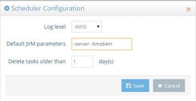
 
Figure 9: Task Scheduler Configuration

By default, each task executes in its own dedicated JVM. If the option “Dedicated JVM” is not checked in the specific task configuration, then the task executes inside the JVM of the scheduler. Users can customize the default JVM parameters to allow more memory, or change the performance settings. Users can customize the default JVM parameters to allow more memory to the virtual machine, or change the performance settings. However, tuning the JVM of the task scheduler is less important than tuning the dedicated JVM for the individual task. For a full list of possible behavioral and performance options, please see the link below.

http://www.oracle.com/technetwork/java/javase/tech/vmoptions-jsp-140102.html

You can specify the number of days that completed tasks are kept on the task list for users to see. For example, if you set the parameter to “10 days” then after 10 days all of the tasks with a status of “Finished” are deleted from the system. 

### Task List 

When operations are added as tasks, they appear in the Task List section, with information about the task displayed. Completed tasks by default are not displayed in the Task List unless the “Terminated” checkbox is checked. When there is a checked box by “Recurrent” this means that the task occurs more than once, on a regularly scheduled basis. The Last Termination date shows when the task was last executed.

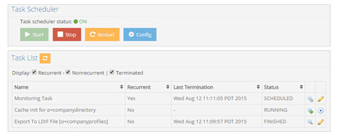
 
Figure 10: Sample Task List

To edit an existing task, click the pencil icon. The Task Configuration menu displays all task components. The name and status are shown, but cannot be changed. To make the task non-recurring (the task no longer repeats) uncheck the “Recurrent” box, the task runs one final time and then the status automatically changes to “Finished.” The execution interval (the frequency at which the task is executed) can be modified by changing the hours, minutes, and second boxes.

By default, all tasks run in their own dedicated JVM and the memory allocated for the task automatically expands up to ¼ of the total machine memory. For example, if the machine where RadiantOne is installed has 16 GB of RAM, the task memory expands up to 4 GB to process a task. If you prefer, you can define a max Java heap size in the JVM parameters instead of leveraging this default expansion. Other custom settings can be entered in the JVM Parameters as well. For a full list of possible behavioral and performance options, please see the link below.

http://www.oracle.com/technetwork/java/javase/tech/vmoptions-jsp-140102.html

If the “Dedicated JVM” option is unchecked, the task runs inside the JVM of the Task Scheduler.

Users must click “Update Task” before closing out of the task configuration screen to save the changes.

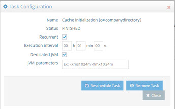
 
Figure 11: Task Configuration

<!--

### Custom Tasks

Certain operations like initializing a persistent cache or RadiantOne Universal Directory store, re-indexing a persistent cache or RadiantOne Universal Directory store, exporting or importing an LDIF file, and login analysis, are performed as tasks. Custom tasks can also be configured. 

1.	Create a task in the com.rli.scripts.tasks package by extending one the abstract tasks in the com.rli.task package (e.g. KillableTask). 

2.	Use your preferred Java IDE to create a jar for the task by exporting it. Customize the script generate the JAR file. 

3.	Click Browse to navigate to <RLI_HOME>/lib/ and provide a jar file name (e.g. customTask.jar).

4.	Click **Finish**.

5.	Create a properties file (e.g. customTask.properties) with the information about the task. An example of the file contents is shown below. Save this file to: <RLI_HOME>\vds_server\conf\scheduler\<someName>.properties

```
#Wed Jun 02 16:36:30 PDT 2021
arguments="-p" "29148"
isvolatile=false
_exitstatus=0
newjvm=false
runonerror=true
exec.order=16
repeat.seconds=8
disabled=false
exec.queue=customTask
taskname=customTask
main.class=com.rli.scripts.tasks.CustomTask
jvmargs=
```

A brief description of each property is outlined in the table below.

Property | Value
-|-
arguments | Provides arguments for readArguments method of the task. -p is process id.
isvolatile | Has a value of true or false. If false, the task is not deleted after it runs. If true, the task is deleted after it runs.
_exitstatus	 | Returns the status when the task has completed.
newjvm	 | Has a value of true or false. If false, the task uses global task scheduler JVM to execute. If true, the task will start a new JVM to run the task in.
runonerror | Has a value of true or false. If false, the task will not execute if the previous task failed. If true, the task will run even if the previous task failed.
exec.order | Order of execution of the task within the queue.
repeat.seconds | Interval in seconds, to run the task. If 0, then it is non-recurrent and only runs once.
disabled | Has a value of true or false. If false, the task does not start when the RadiantOne process starts. If true, the task starts when the RadiantOne process starts.
exec.queue | Adds a task to queue with the name indicated in this property.
taskname | The value of this property is the name shown in the tasks list on the Tasks tab in the Server Control Panel.
main.class | The value of this property is the name of the custom task java package name.
jvmargs	 | Only applicable if newjvm=true. This property can be used to customize the Java arguments for the task. E.g. -Xms1024m -Xmx1024m

6.	Navigate to the Server Control Panel associated with the RadiantOne leader node and go to the Tasks tab.

7.	Click **Restart** (and Yes to confirm) to restart the Task Scheduler. After restart, the custom task should appear in the list of tasks. The task can be managed from here.


Figure 20: Task Scheduler and Tasks

>[!note] logs related to tasks are located in <RLI_HOME>/vds_server/logs/scheduler/task.<task_name>.log**

--> 

### Log Viewer Tab

On the Server Control Panel > Logs Viewer Tab, you will find the logging console.

>[!note] 
>Only users that belong to the Directory Administrators group have access to the Log Viewer tab.

Select the log from the Log File drop-down list. You can also set a filter to limit your view of the log based on certain criteria (this only filters on the subset of log data visible in the log window), refresh the log view and/or choose to refresh continuously.


 
Figure 12: Log Viewer

To download a log file, select it from the Log File drop-down list and click `Download`. The log file is downloaded to your web browser's default download location.

To include a log's rollover files in the download, select the log from the Log File drop-down menu. Click the drop-down menu beside Download and select `Download from All with Rollovers`. A compressed file is downloaded to your web browser's default download location.

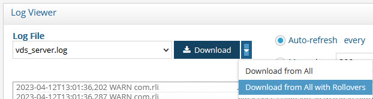
 
Figure 13: Downloading a Log File and Its Rollover Files

For complete details on logs and troubleshooting, please see the [RadiantOne Logging and Troubleshooting Guide](/documentation/logging-and-troubleshooting-guide/01-overview).

# Administration and Configuration

## Delegated Administration of RadiantOne

Any user that can bind to RadiantOne can potentially administrator the server if they belong to the proper group. A user can belong to multiple groups and the value(s) of the vdPrivilege operational attribute assigned to the group entry dictates the operations that members are authorized to do. The following administration groups are defined for RadiantOne:

`Directory Administrator Role` – members of this group can perform all operations (all operations that the other groups defined below can perform) in addition to:

-	Change privileges for the delegated roles

-	Update username and password properties for data sources via LDAP modify command

These functions are dictated by the following values of the vdPrivilege attribute in the group entry: 

```
- config-read
- config-write
- services-restart
- services-shutdown
- update-schema
- instance-read
- instance-write
- acl-read
- acl-write 
- naming-context-read
- naming-context-write
- data-source-read
- data-source-write
- data-store-read
- data-store-write
- ics-admin
- tasks-admin
- globalidviewer-read
- globalidviewer-write
- globalidviewer-designer
```

The group entry is located in the RadiantOne namespace at:
cn=directory administrators,ou=globalgroups,cn=config

`Read Only Role` – Members of this group can perform the following operations:

-	Read RadiantOne configuration 
-	Read settings for any configured instances
-	Read naming context configurations
-	Read configured data sources and view synchronization topologies on the Global Sync Tab
-	Log into the Global Identity Viewer console and access the Global Identity Viewer application

These functions are dictated by the following values of the vdPrivilege attribute in the group entry: 

```
- config-read
- instance-read
- naming-context-read
- data-source-read
- globalidviewer-read
```

The group entry is located in the RadiantOne namespace at:
cn=readonly,ou=globalgroups,cn=config

`Namespace Administrator Role` – Members of this group can perform the following operations:

-	Read RadiantOne configuration 
-	Restart the RadiantOne service from Main Control Panel 
-	Create, update, or delete naming contexts 
-	Create, update, or delete backend mappings
-	Create, update, and manage persistent cache
-	Create, update, or delete data sources
-	Create, update, or delete RadiantOne Universal Directory (HDAP) stores
-	Update RadiantOne LDAP schema
-	Launch tasks
-	View synchronization topologies and manage synchronization components on the Global Sync Tab

These functions are dictated by the following values of the vdPrivilege attribute in the group entry:

```
- config-read
- config-write
- services-restart
- update-schema
- naming-context-read
- naming-context-write
- data-source-read
- data-source-write
- data-store-read
- data-store-write
- tasks-admin
- ics-admin
```

The group entry is located in the RadiantOne namespace at:
cn=namespaceadmin,ou=globalgroups,cn=config

`Operator Role` – Members of this group can perform the following operations:

-	Read RadiantOne configuration 
-	Create, update, or delete RadiantOne Universal Directory (HDAP) Stores
-	Restart the RadiantOne service from the Main Control Panel
-	Stop the RadiantOne service from the Main Control Panel
-	Launch tasks
-	View synchronization topologies and manage synchronization components on the Global Sync Tab

These functions are dictated by the following values of the vdPrivilege attribute in the group entry:

```
- config-read
- config-write
- services-restart
- services-shutdown
- data-store-read
- data-store-write
- tasks-admin
- naming-context-read
```

The group entry is located in the RadiantOne namespace at:
cn=operator,ou=globalgroups,cn=config

``Schema Administrator Role` – Members of this group can perform the following operations:

-	Read RadiantOne configuration 
-	Create, update or delete schema objects (objectclasses or attributes)
-	Extend RadiantOne LDAP schema with objects and attributes from orx files
-	Create, update or delete data sources
-	View synchronization topologies and manage synchronization components on the Global Sync Tab

These functions are dictated by the following values of the vdPrivilege attribute in the group entry:

```
- config-read
- update-schema
- data-source-read
- data-source-write
```

The group entry is located in the RadiantOne namespace at:
cn=schemaadmin,ou=globalgroups,cn=config

`ACI Administrator Role` – Members of this group can perform the following operations:

-	Read RadiantOne configuration 
-	Create, update and delete access controls
-	View synchronization topologies and manage synchronization components on the Global Sync Tab

These functions are dictated by the following values of the vdPrivilege attribute in the group entry: 

```
- config-read
- acl-read
- acl-write 
- naming-context-read
```

The group entry is located in the RadiantOne namespace at:
cn=aciadmin,ou=globalgroups,cn=config

`ICS Administrator Role` – Members of this group can perform the following operations:

-	Read RadiantOne configuration 
-	Stop and start pipelines on the Global Sync Tab
-	Log into the Global Identity Viewer Console and access all applications

These functions are dictated by the following values of the vdPrivilege attribute in the group entry:

```
- config-read
- config-write
- naming-context-read
- data-source-read
- ics-admin
- ics-workflow-approve
- tasks-admin
- globalidviewer-read
- globalidviewer-write
- globalidviewer-designer
```

The group entry is located in the RadiantOne namespace at:
cn=icsadmin,ou=globalgroups,cn=config

`ICS Operator Role` – This role varies from the ICS Admin role in that this role cannot perform uploads from the Global Sync tab, nor can it modify connector properties. Members of this group can perform the following operations:

-	Read RadiantOne configuration 
-	Log into the Global Identity Viewer Console and access all applications

These functions are dictated by the following values of the vdPrivilege attribute in the group entry:

```
- config-read
- ics-operator
```

The group entry is located in the RadiantOne namespace at:
cn=icsoperator,ou=globalgroups,cn=config

### Managing Default Delegated Administration Roles

As mentioned above, the groups used for delegated administration are Directory Administrator, Namespace Administrator, Operator, Read Only, Schema Administrator, ICS Administrator, ICS Operator and ACI Administrator. These roles can be assigned to static members or dynamic members. Both are described below. Any user that is assigned to one of the delegated administration roles can login to the Control Panels and manage certain server settings based on the privileges (vdPrivilege attribute) assigned to the role. 

>[!note] 
>Remember that you might require a [User ID to DN Mapping](03-front-end-settings#user-to-dn-mapping) configuration depending on the ID that users log in with (their full DN versus just an ID).

>[!note]
>Delegated administrators do not have default permissions to manage virtual entries in the directory. If this is required, assign the proper [access controls](06-security#access-control) for the delegated admin groups.

#### Managing Explicit Members

>[!warning] 
>It is generally advised to assign only local (in a RadiantOne Universal Directory store) user accounts to delegated admin roles. Although you can assign any user in the RadiantOne namespace to a delegated admin role, use caution with this approach because if the backend isn’t accessible, then the user login to the Control Panel will fail and the user will not be able to administer RadiantOne. Also, performance can be degraded because RadiantOne must delegate the bind (authentication) to the backend instead of processing it locally.

1.	Log into the Main Control Panel as the super user and click on the Directory Browser tab.

1.	Navigate below ou=globalgroups,cn=config node to locate all of the groups.

1.	Select the group you want to manage and click  (Manage Group). From here you can remove users from groups and search for new users (located anywhere in the virtual namespace) to add to groups.


 
Figure 14: Manage Group Members

#### Managing Dynamic Members

Figure 15: Manage Group Members

>[!warning] 
>It is generally advised to assign only local (in a RadiantOne Universal Directory store) user accounts to delegated admin roles. Although you can assign any user in the RadiantOne namespace to a delegated admin role, use caution with this approach because if the backend isn’t accessible, then the user login to the Control Panel will fail and the user will not be able to administer RadiantOne. Also, performance can be degraded because RadiantOne must delegate the bind (authentication) to the backend instead of processing it locally.

1.	Log into the Main Control Panel as the super user and click on the Directory Browser tab. 

1.	Navigate below ou=globalgroups,cn=config node to locate all of the groups. 

1.	Select the group you want to manage and on the right side, select the objectclass attribute.

1.	Choose Modify Attribute > Add Value.

1.	Enter a new value of groupOfURLS and click **OK**.

1.	Select the group entry and click  (Manage Group).

1.	Click **Edit Dynamic Members**. From here you can manage the criteria for dynamic members.


Figure 16: Manage Group Window

1.	Click **Add Member(s)**.

1.	Enter the base DN where users/potential group members are located, or click  to navigate to this location.

1.	Select the scope associated with the base DN to locate potential members.

1.	Enter an LDAP filter that qualifies group members (e.g. l=Casper, meaning all users that have a location of Casper would be a member of the group).

1.	Click **Confirm**.

1.	Either add more members, or click **Close** to close the window.

1.	After the configuration, the group entry has a memberURL attribute that contains the criteria for group members.

1.	Now, configure RadiantOne to translate the dynamic group criteria into static members by setting Special Attributes Handling for Dynamic Groups. Navigate to the Main Control Panel > Settings tab.

1.	Switch the Control Panel to [Expert Mode](01-introduction#expert-mode).

1.	After the browser reloads, navigate to the Settings tab > Interception > Special Attributes Handling.

1.	In the Dynamic Group section click **Add**.

1.	Click **Choose** and either navigate to the exact dynamic group entry or the parent node where all of your dynamic groups are located. For example, if you wanted all of the delegated admin groups to be dynamic, you can select the cn=config branch in the RadiantOne namespace like shown in the screen below.

1.	Click **OK**.


Figure 17: Dynamic Group Setting

1.	Set the member attribute to either member or uniqueMember (to match your membership attribute) and click Save in the upper right.

Any user that is dynamically assigned to a delegated admin group can log in to the Control Panel and administer the server based on the role they are associated with.

### Managing Default Delegated Administration Users

As mentioned above, the groups used for delegated administration are Directory Administrator, Namespace Administrator, Operator, Schema Administrator, ACI Administrator, ICS Administrator, ICS Operator, and one role for Read Only access.

>[!note] 
>Delegated administrators do not have default permissions to manage virtual entries in the directory. If this is required, assign the proper [access controls](06-security#access-control) for the delegated admin groups.

Default administrative users are included as members of these groups. They are as follows.

Default administrative user | Group membership 
-|-
uid=aciadmin,ou=globalusers,cn=config | Member of the ACI Administrator Group.
uid=namespaceadmin,ou=globalusers,cn=config | Member of the Namespace Administrator Group.
uid=operator,ou=globalusers,cn=config | Member of the Operator Group.
uid=schemaadmin,ou=globalusers,cn=config | Member of the Schema Administrator Group.
uid=superadmin,ou=globalusers,cn=config | Member of the Directory Administrator Group.
uid=icsadmin,ou=globalusers,cn=config | Member of the ICS Administrator Group.
uid=icsoperator,ou=globalusers,cn=config | Member of the ICS Operator Group.
uid=readonly,ou=globalusers,cn=config | Member of the Read Only Group.

You can use the default users for delegated administration of RadiantOne activities, or you can add your own users to the various admin roles as described in the [Managing Delegation Administration Roles](#managing-default-delegated-administration-roles). To use the default users, you can log in with any of the following (depending on the RadiantOne configuration you want to manage). For details on what activities these users can perform, please see [Delegated Administration of RadiantOne](#delegated-administration-of-radiantone).

>[!note] For details on how to update the default delegate admin user’s passwords, see the [RadiantOne Hardening Guide](/documentation/hardening-guide/00-preface).

user: aciadmin
<br> password: <set to the same password you defined for the super user (cn=directory manager) during the installation>

user: namespaceadmin
<br> password: <set to the same password you defined for the super user (cn=directory manager) during the installation>

user: operator
<br> password: <set to the same password you defined for the super user (cn=directory manager) during the installation>

user: schemaadmin
<br> password: <set to the same password you defined for the super user (cn=directory manager) during the installation>

user: superadmin
<br> password: <set to the same password you defined for the super user (cn=directory manager) during the installation>

user: icsadmin
<br> password: <set to the same password you defined for the super user (cn=directory manager) during the installation>

user: icsoperator
<br> password: <set to the same password you defined for the super user (cn=directory manager) during the installation>

user: readonly
<br> password: <set to the same password you defined for the 
super user (cn=directory manager) during the installation>

The reason you can login with just the user ID as opposed to the full DN is because a default [user ID to DN mapping](03-front-end-settings#user-to-dn-mapping) has been configured for the cn=config branch in RadiantOne. This allows RadiantOne to identify the proper user DN based on the ID they log into the Main Control Panel with. This default mapping is shown below.


 
Figure 18: Default User ID to DN Mapping Rule

### Leveraging Existing Groups for Delegated Administration

As an alternative to using the [default delegated admin groups](#delegated-administration-of-radiantone) for enforcing authorization in the Control Panels, you can leverage your existing groups for these roles. Your groups and members must be in either a RadiantOne Universal Directory store, or persistent cache. If you choose to use your own existing groups and users, the [default delegated admin users](#delegated-administration-roles) will not be able to log into the Control Panel.

>[!warning] 
>If your users and groups are in a persistent cache, the bind (credentials-checking) step during the login to the Control Panel is delegated to the backend directory for validation. If the backend isn’t accessible, then the user login to the Control Panel will fail and the user will not be able to administer RadiantOne. Also, performance can be degraded because RadiantOne must delegate the bind to the backend instead of processing it locally.

To configure groups and users for delegated administration, follow the steps below.

1.	The groups and users that you want to use for delegated administration must all be located under the same root naming context. Either import your groups and users into a RadiantOne Universal Directory store (e.g. import an LDIF file), or create a virtual view of groups and users and configure it as persistent cache. For assistance on creating RadiantOne Universal Directory stores, see the [RadiantOne Namespace Configuration Guide](/documentation/namespace-configuration-guide/01-introduction). For assistance on configuring persistent cache, see the [RadiantOne Deployment and Tuning Guide](/documentation/deployment-and-tuning-guide/00-preface).

1.	(Optional) If your groups and users are in persistent cache, go to the Main Control Panel > Directory Namespace > Cache node and select your cache branch. On the Properties tab on the right, enter vdPrivilege in the Extension Attributes list and click Save.


Figure 19: Entering vdPrivilege in the Extension Attributes Field

1.	Navigate to the Main Control Panel > Directory Browser tab.

1.	Navigate to the group location and select the group that you want to be associated with a delegated administrator role. Click **Add Attribute** and enter the name vdPrivilege and enter a value associated with the [delegated admin role](#delegated-administration-roles).


Image 20: Modify Attribute > Add Value
 
1.	Select the vdPrivilege attribute and click **Modify Attribute > Add Value**.

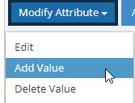

Image 21: Adding the vdPrilvilege Attribute

1.	Add a required value for the role. The required values and corresponding roles are described in [Delegated Administration Roles](#delegated-administration-roles).

1.	In the Add Value window, click  to add another value. Repeat this step to add all required values as outlined in [Delegated Administration Roles](#delegated-administration-roles). Click **Confirm** after all values have been added. In the example below, a group named Management has been assigned the privileges required for the Directory Administrator role.


 
Figure 22: Example of Assigning an Existing Group to the Directory Administrator Role

>[!note] 
>Delegated administrators do not have default permissions to manage virtual entries in the directory. If this is required, assign the proper [access controls](06-security#access-control) for the delegated admin groups.

1.	Go to the Main Control Panel > Zookeeper tab (requires [Expert Mode](01-introduction#expert-mode)).

1.	Navigate to `/radiantone/<version>/<clusterName>/config/vds_server.conf`.

1.	Click **Edit Mode**.

1.	Locate the “roleBase” property and set the value to the root naming context where your users and groups are located (e.g. “roleBase” : “o=companydirectory”,).

1.	Locate the “roleName” property and set the value to the RDN/attribute name containing the group name (e.g. “roleName” : “cn”,).

1.	Locate the “roleSearch” property and if the group objectclass stores the members in the uniqueMember attribute, set the value to: "(uniqueMember:1.2.840.113556.1.4.1941:={0})",
<br> If the group objectclass stores the members in the member attribute, set the value to "(member:1.2.840.113556.1.4.1941:={0})",

1.	Click **Save**.

1.	To test, logout of the Control Panel and login with a user that is a member of one of your existing groups. Make sure the user can perform the activities associated with their role as outlined in [Delegated Administration Roles](#delegated-administration-roles). Remember, you must either use the full user DN as the login name, or define the proper User to DN mapping rules to allow the user to login with just an “ID”.


 
Figure 23: Example of User Login with Full DN

#### Delegated Administration Roles

The roles and corresponding required permissions are described in the table below.

Role	| Required Permissions (Value of vdPrivilege)
-|-
<span style="color:lightblue">Directory Administrator</span> <br> Members of this group can perform all operations (all operations that the other groups defined below can perform) in addition to:<br>Change privileges for the delegated roles<br>Access the Global Sync Tab <br>Update username and password properties for data sources via LDAP modify command | <span style="color:lightblue">config-read <br>config-write <br>services-restart <br> services-shutdown <br>update-schema <br>instance-read <br>instance-write <br>acl-read <br>acl-write <br>naming-context-read <br>naming-context-write <br>data-source-read <br>data-source-write <br>data-store-read <br>data-store-write <br>ics-admin <br>tasks-admin <br>globalidviewer-read <br>globalidviewer-write </span>
<span style="color:lightblue">Read Only</span> <br> Members of this group can read the RadiantOne configuration, read settings for any configured instances, read naming context configurations, read configured data sources, and view synchronization topologies on the Global Sync Tab. Members can also log into the RadiantOne Global Identity Viewer Console and use the Global Identity Viewer to search for identities and groups. | <span style="color:lightblue">config-read <br>instance-read <br>naming-context-read <br>data-source-read <br>globalidviewer-read </span>
<span style="color:lightblue">Namespace Administrator</span> <br> Members of this group can perform the following operations:<br> Read RadiantOne configuration<br> Access Wizards tab in Main Control Panel<br> Restart the RadiantOne service from Main Control Panel<br> Create, update, or delete naming contexts<br> Create, update, or delete backend mappings<br> Create, update, and manage persistent cache <br> Create, update, or delete data sources<br> Create, update, or delete RadiantOne Universal Directory stores<br> Update RadiantOne LDAP schema<br> Launch tasks	| <span style="color:lightblue">config-readconfig-write <br>services-restart<br>update-schema <br>naming-context-read<br>naming-context-write <br>data-source-read <br> data-store-read <br> data-store-write <br> tasks-admin <br> ics-admin
<span style="color:lightblue">Operator</span> <br> Members of this group can perform the following operations: <br> Read RadiantOne configuration <br> Create, update, or delete RadiantOne Universal Directory (HDAP) Stores <br> Restart the RadiantOne service from the Main Control Panel <br> Stop the RadiantOne service from the Main Control Panel <br> Launch Tasks | <span style="color:lightblue">config-read <br> config-write <br> services-restart <br> services-shutdown <br> data-store-read <br> data-store-write <br> tasks-admin <br> naming-context-read</span>
<span style="color:lightblue">Schema Administrator </span> <br> Members of this group can perform the following operations: <br> Read RadiantOne configuration <br> Create, update or delete schema objects (objectclasses or attributes <br> Extend RadiantOne LDAP schema with objects and attributes from orx files <br> Create, update or delete data sources | <span style="color:lightblue">config-read <br> update-schema <br> data-source-read <br> data-source-write </span>
<span style="color:lightblue">ACI Administrator</span> <br> Members of this group can perform the following operations: <br> Read RadiantOne configuration <br> Create, update and delete access controls | <span style="color:lightblue">config-read <br> acl-read <br> acl-write <br> naming-context-read </span>
<span style="color:lightblue">ICS Administrator</span> <br> Members of this group can perform the following operations: <br> Read RadiantOne configuration <br> Access Wizards tab in Main Control Panel <br> Perform all operations from the Global Sync Tab <br> Log into the RadiantOne Global Identity Viewer | <span style="color:lightblue">config-read <br> config-write <br> naming-context-read <br> data-source-read <br> ics-admin <br> ics-workflow-approve <br> tasks-admin <br> globalidviewer-read <br> globalidviewer-write <br> globalidviewer-designer</span>
<span style="color:lightblue">ICS Operator</span> <br> Members of this group can perform the following operations: <br> Read RadiantOne configuration <br> Access the Global Sync tab and read topologies <br> Log into the RadiantOne Global Identity Viewer | <span style="color:lightblue">config-read <br> ics-operator
<span style="color:lightblue">Global ID Viewer Design</span> <br> Members of this group can log into the Global Identity Viewer and perform the following operations: <br> View entries & attributes <br> Perform searches <br> Edit & delete templates <br> Create, edit and delete queries <br> Export search results <br> Modify attribute values <br> Configure and schedule reports <br> For details on the Global Identity Viewer, see the [RadiantOne Global Identity Viewer Guide](/documentation/global-identity-viewer-guide/01-introduction)
 | <span style="color:lightblue"> config-read <br> config-write <br> globalidviewer-designer <br> tasks-admin
<span style="color:lightblue">Global ID Viewer Write</span> <br> Members of this group can log into the Global Identity Viewer and perform the following operations: <br> View entries & attributes <br> Perform searches <br> Export search results <br> Modify attribute values <br> For details on the Global Identity Viewer, see the RadiantOne Global Identity Viewer Guide	| <span style="color:lightblue"> config-read <br> globalidviewer-write

## Configuration Lock

The RadiantOne super user account (e.g. cn=directory manager) and members of the cn=directory administrators group (cn=directory administrators,ou=globalgroups,cn=config) can enable a lock on all configuration changes. This ensures that no changes are being made while the configuration is being backed up and/or migrated. To lock the configuration, navigate to Main Control Panel > Settings > Configuration > Configuration Lock. Toggle the Configuration Changes property to the Locked position. Click **Save**.

When the configuration is locked, no one can make changes to the RadiantOne configuration (either from the UI or command line tools). In the UI, an  icon appears at the top of the Control Panel, configuration options are read-only, and FID can be restarted but not stopped. Command-line operations that display information still function, but operations that modify the configuration do not. Only the RadiantOne super user, or a member of the cn=directory administrators group, can unlock the configuration. When they log into the Control Panel, there is a message along with a button, prompting them to unlock the configuration.

When other users log into the Control Panel, there is a message prompting the user to contact the Directory Manager to unlock the configuration. 


 
Figure 24: Message Displayed for Locked Configuration


