# Settings Tab

From the Settings Tab, you can manage the majority of RadiantOne settings. All settings found on this tab are detailed in this section.

Cluster settings are stored in ZooKeeper. These can be viewed/edited from the Zookeeper tab in the Main Control Panel (navigate to radiantone > `<version>` > <cluster_name> > config > vds_server.conf and click **Edit Mode** in the upper right corner).

## Server Front End

These settings are related to how clients access RadiantOne and can be managed from the Main Control Panel > Settings tab > Server Front End section. 
 
### Administration

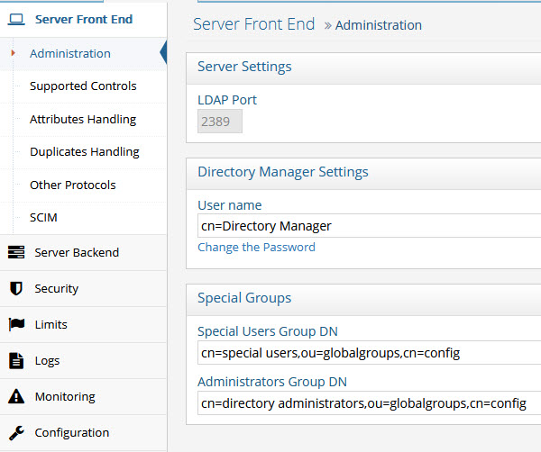
 
Figure 1: Administration Section

#### LDAP Port

This is the internal LDAP port used by the RadiantOne service. The externally facing endpoint/port that clients use to access the service is created when the RadiantOne environment is installed. For details on creating environments and locating the RadiantOne service endpoints, see the Environment Operations Center Guide.

The RadiantOne service also offers an endpoint for the HTTP port for SCIM and REST requests.

#### Directory Manager User

The directory manager (cn=directory manager by default) is the super user for the directory and this account is defined during the RadiantOne install. For details on defining this account, see the Environment Operations Center Guide.

The super user is the only user that can login to the Main Control Panel while RadiantOne is not running. When you log into the Main Control Panel with this user, you can perform any of the operations described in [Delegation Administration](01-introduction.md#delegated-administration-of-radiantone). Also, access permissions and password policies do not apply for this user. This safety measure prevents someone from accidentally denying the rights needed to access and manage the server. Access to this super user account should be limited. If you require many directory managers, add these as members to the [Directory Administrator Role](01-introduction.md#delegated-administration-roles) instead of having them all use the single super user account.

The RadiantOne super user account is associated with an LDAP entry in the RadiantOne namespace located at: cn=Directory Manager,ou=RootUsers,cn=config. Cn=Directory Manager,ou=RootUsers,cn=config is authorized the same as cn=Directory Manager. If you want to log into the Main Control Panel with a [PIV Card/Certificate](01-introduction#logging-in-with-piv-cardsmart-cardcertificate) as the super user, you can store the certificate in the entry at this location.

To configure the Directory Manager username:

1.	In the Main Control Panel, go to the Setting Tab > Server Front End section > Administration sub-section.
2.	In the Directory Manager Settings section on the right side, edit the value in the User name field.

>[!warning] 
>The new value of the parameter should be in the same syntax: `cn=<new user value>`.

3.	Click **Save**.

4.	Restart the RadiantOne service.

5.	Re-open the Main Control Panel.

6.	Log in as the new user.

If you update the Directory Manager username, the LDAP entry in the RadiantOne namespace is located at: cn=Directory Manager,ou=RootUsers,cn=config is updated with a seeAlso attribute that contains the value of the new username. This allows the new username to be used to log into the Main Control Panel.

#### Directory Manager Password

The directory administrator (e.g. cn=directory manager) password is set during the install of RadiantOne and can be updated in Control Panel. You must know the current password to update the password. To change this password, from the Main Control Panel > Settings Tab > Administration section, click “Change the password” link. Enter the old (current) password and the new value. Confirm the new value and click **Save** in the upper right corner.

>[!warning] 
>If you change the password and you are currently logged into the Control Panel as the directory administrator, you must close the Control Panel and re-open it logging in with the new password.

You can also change the directory administrator’s password via LDAP. The DN representing the directory administrator is: cn=Directory Manager,ou=RootUsers,cn=config. The example below is using an LDIF file and the ldapmodify command to modify the password:

`dn: cn=Directory Manager,ou=RootUsers,cn=config`
<br>`changetype: modify`
<br>`replace: userPassword`
<br>`userPassword: newpassword`

An example of the syntax used in the command is shown below, assuming the LDIF file described above is named ChangePassword.ldif. You must bind as the cn=directory manager with the current password in order to update the password with this LDAP command.

ldapmodify.exe -D "cn=Directory Manager,ou=RootUsers,cn=config" -w currentpassword -h localhost -p 2389 -f c:\radiantone\ChangePassword.ldif

>[!note] 
>The RadiantOne service may be running when this command is executed.

You can also change the directory administrator's password via REST (ADAP API). The following commands can be issued from a Linux client that is able to connect to the RadiantOne service's REST endpoint.
Set the following on the Linux client:
```
REST_ENDPOINT="https://localhost:9101"
BIND_DN="cn=Directory Manager"
BIND_USER_DN="cn=Directory Manager,ou=rootusers,cn=config"
CURRENT_PASSWORD="MySuperSecretPassw0rd2"
NEW_PASSWORD="MySuperSecretPassw0rd3"
BASE64_USERNAME_PASSWORD=$(echo -n $BIND_DN:$CURRENT_PASSWORD | base64)
```

Run the following curl command on the Linux client:
```
curl -k --location --request PATCH "$REST_ENDPOINT/adap/$BIND_USER_DN" \
--header "Content-Type: application/json" \
--header "Authorization: Basic $BASE64_USERNAME_PASSWORD" \
--data '{
   "params": {
      "mods": [
       {
         "attribute": "userPassword",
         "type": "REPLACE",
          "values": [
           "'$NEW_PASSWORD'"
           ]            
          }
       ]
   }
}'
```

<br>
If the command is successful, an HTTP status of 200 is returned: 
{"httpStatus":200}

An example of using Postman as a REST client to update the cn=directory manager password is shown below.
1. Add an Authorization header that contains Basic with the base 64 encoded value for cn=directory manager:currentpassword. Use cn=directory manager in the authorization header value, not cn=Directory Manager,ou=RootUsers,cn=config. E.g. <br>Basic Y249RGlyZWN0b3J5IE1hbmFnZXI6bmV3cGFzc3dvcmQxMjM=

2. Issue a PATCH operation with `http://RESTENDPOINT:8089/adap/cn=Directory Manager,ou=RootUsers,cn=config` with the following body:

```
{
    "params": {
        "mods": [
            {
                "attribute": "userPassword",
                "type": "REPLACE",
                "values": ["newpassword"]
            }
        ]
    }
}
```


<!--
#### Allowed IP Addresses

To prevent the unwarranted use of the directory administrator (super user) account, you can set specific IP addresses from where the directory administrator account can connect to the RadiantOne service from. This value can be a single IP address or a list of IP addresses separated by a comma. The IP address syntax can also support a range of IP addresses.

>[!warning] 
>When the “Allowed IP Addresses” property is used, the Control Panel is accessible from any machine whose IP address matches that of a registered RadiantOne cluster node (with the list of node IPs being resolved periodically), in addition to the allowed IPs configured in this property.

The default value for this parameter is 0 (or could also have no value). This means that the directory administrator (super user) can bind against the RadiantOne service from anywhere.

This parameter can be changed in the Main Control Panel > Settings Tab > Administration section. On the right side, set the value for the Allowed IPs parameter. Both IPv4 and IPv6 addresses are supported. A mix of IPv4 and IPv6 can also be used.

Example set for a range of IP addresses:

10.11.12.0/24 which represents the given IPv4 address and its associated routing prefix 10.11.12.0, or equivalently, its subnet mask 255.255.255.0, which has 24 leading 1-bits. This covers the range between 10.11.12.0 to 10.11.12.255.

Example set for a range of IPv6 addresses:
2001:db8::/32 which covers the range between 2001:db8:0:0:0:0:0:0 to 2001:db8:ffff:ffff:ffff:ffff:ffff:ffff

Restart Jetty (server hosting the Control Panel) and the RadiantOne service (on all nodes if running in a cluster) after making changes to this property.

-->

#### Special Users Group DN

This parameter can be set to the DN of any special group you want that is defined in the virtual namespace. The special users group is checked for enforcing access regulation (if access restrictions are set). To manage this value, from the Main Control Panel -> Settings Tab -> Administration section, locate the Special Users Group DN parameter. Enter the value of a valid group DN located in the virtual namespace.

For details on how this group is related to access restrictions, see the section titled [Access Regulation](06-security#access-regulation).

#### Administrators Group DN

This parameter can be set to the DN of the Administrators group defined in the virtual namespace. The administrators group is checked for authorization purposes as members of this group do not have limits or password policy enforced for them. To manage this value, from the Main Control Panel > Settings Tab > Administration section, locate the Administrators Group DN parameter. Enter the value of a valid group DN located in the virtual namespace.

#### Admin HTTP Service

The RadiantOne service Admin HTTP Service ports are used internally for:

-	Block replication for RadiantOne Universal Directory stores.

-	File replication for things such as custom project changes and connector properties. 

-	REST admin API for collecting statistics and monitoring things like, node status, cluster status, and replication status.

-	RadiantOne service actions like restart and standby.

#### Internal Banner Configuration

A custom message can be added to the banner of RadiantOne User Interface pages. This includes the Main Control Panel, the Server Control Panel, the login page, the logout landing page, and the Insights, Reports, and Administration Console.

To add a custom message:

1. Log into the Main Control Panel as a member of the Directory Administrators role. 

2. Navigate to Settings > Administration > Internal Banner Configuration section. 

3. Enter the message to appear in the banner in the Banner Text field. 

4. Specify a color in the Banner Background Color field. You can indicate the color by name or by hex color code.

    >[!note] If you enter a hex color code, include the "#" character here. If the color specified is not recognized, it defaults to gray. 

5. Specify the banner's text color. You can indicate the color by name or by hex color code.

    >[!note] If you enter a hex color code, include the "#" character here. If the color specified is not recognized, it defaults to gray. 

    

6. Click Save. The next time the control panel or console is opened (or the browser tab is refreshed), the custom banner message is displayed. 

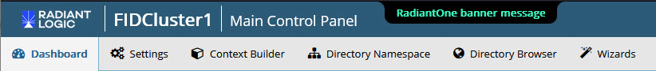

#### Message of the Day Configuration

The Main Control Panel login page contains a basic username and password text box. To add a custom message on the login page, follow the steps below.

1. Log in to the Main Control Panel as a member of the Directory Administrators role.

1. Navigate to Settings > Administration > Message of the Day Configuration section.

    

1. Add (or edit) the **Message Content (Text)** field containing the message to display on the login page. For example:

    `This is my custom message. Please login with your RadiantOne Administrator account.`

    An example of the custom message on the login page is shown below.

    
    
    Figure 16: Custom Message on Login Page

1. Add (or edit) the message title to display on the login page. 
   
   >[!note] For the message title to be displayed, the **Is Popup?** option must also be selected (see step 6).

1. If you would like the message to be prefixed with a “Warning” icon, click the **Is Warning?** box. This displays the message of the day in a bold font. An example is shown below.

    

    Figure 17: Custom Message on Login Page with Warning Label and Bold Font

1. If you would like the custom message and “Warning” icon to display as a popup window, check the **Is Popup?** box. An example is shown below.

    

    Figure 18: Custom Message Popup Window

1.	Click **Save**.

1.	Log out of the Main Control Panel. The changes you have made are displayed on the Login Page. 

## Supported Controls and Features

A control or feature is additional information that can be included in an LDAP request or response. For example, the server-side sort request control can be included in a search request to indicate the server should sort the matching entries before sending them to the client. LDAP controls have a unique object identifier (OID) and notion of criticality. The criticality is a flag that indicates how the server should behave if it does not recognize a requested control from a client, or if it cannot support the control in the context in which it was requested. A criticality of “true” indicates that the control is a critical part of the request, and that the server should reject the request if it cannot support the control. A criticality of “false” indicates that the control is optional, and that if the server cannot support the control then it should go ahead and process the operation as if the control had not been included. The criticality does not come into play if the server does support the control within the context of the request.

RadiantOne supports the following LDAP controls.

2.16.840.1.113730.3.4.18 – Proxied Authorization Control

1.2.840.113556.1.4.805 – Subtree Delete Control

1.2.840.113556.1.4.319 – Paged Results Control

2.16.840.1.113730.3.4.3 – Persistent Search LDAPv3 Control

1.2.840.113556.1.4.473 – LDAP Server Side Sort Control

2.16.840.1.113730.3.4.9 – VLV Request LDAPv3 Control

1.3.6.1.4.1.42.2.27.8.5.1 - Password policy control

1.3.6.1.1.13.1 - LDAP pre-read

1.3.6.1.1.13.2 - LDAP post-read

RadiantOne supports the following LDAP features:

1.3.6.1.1.14 – Modify-Increment Extension

1.3.6.1.4.1.4203.1.5.1 – All Operational Attributes Extension

1.3.6.1.4.1.4203.1.5.3 - Absolute True and False Filters as described in RFC 4526

The Paged Results, VLV, Server Side Sort, Persistent Search and Proxy Authorization controls are not enabled by default. The Subtree Delete and Password Policy Controls are enabled by default. The Modify-Increment, All Operational Attributes, and Absolute True/False filters extensions are enabled by default.
This section describes each control or feature and how to enable it if needed.


 
Figure 2: Supported Controls Section

### Paged Results Control

The Paged Results Control allows an LDAP client to retrieve the results of a query in chunks (to control the rate at which search results are returned from the RadiantOne service). This feature can be useful when the client has limited resources and may not be able to process the entire result set from a given LDAP query. The client should specify the page size (number of entries per chunk) during the initial query. For more details on this control, please refer to the LDAP RFC 2696. This control can be enabled/disabled from the Main Control Panel > Settings Tab > Server Front End section > Supported Controls sub-section. Check the Enable paged results box and click Save. Restart the RadiantOne service. If you have a cluster deployed, restart the service on all nodes.

The LDAP control ID is 1.2.840.113556.1.4.319. If you query the RadiantOne service using an empty base DN (starting point), you should see a supportedControl attribute with the value of 1.2.840.113556.1.4.319.

Below is an example of an LDAP client issuing a query to RadiantOne using paging.


 

In the vds_server_access.log you should see multiple search requests returning a maximum number of entries specified in the page size from the client (a minimum log level of ACCESS must be set for RadiantOne server log). In the screen shot above, a total of 5,040 entries were returned to the client. The vds_server_access.log can be viewed and downloaded from the Server Control Panel > Log Viewer.

Sample vds_server_access.log content:

2006-09-27 09:21:40,390 INFO --> conn=9 op=35 SearchRequest {dn="ou=Remote LDAP Directories,dc=tutorial,dc=com",scope=2,derefAliases=0,sizeLimit=0,timeLimit=0,attrsOnly=false,filter="(objectclass=*)",attributes="1.1"} LDAPControl {1.2.840.113556.1.4.319 true}

2006-09-27 09:21:43,984 INFO <== conn=9 op=35 SearchResult {resultCode=0, matchedDN=null, errorMessage=null} LDAPControl {1.2.840.113556.1.4.319 true} **### nEntries=1000 ###**

2006-09-27 09:21:46,953 INFO --> conn=9 op=36 SearchRequest {dn="ou=Remote LDAP Directories,dc=tutorial,dc=com",scope=2,derefAliases=0,sizeLimit=0,timeLimit=0,attrsOnly=false,filter="(objectclass=*)",attributes="1.1"} LDAPControl {1.2.840.113556.1.4.319 true}

2006-09-27 09:21:47,718 INFO <== conn=9 op=36 SearchResult {resultCode=0, matchedDN=null, errorMessage=null} LDAPControl {1.2.840.113556.1.4.319 true} **### nEntries=1000 ###**

2006-09-27 09:21:48,890 INFO --> conn=9 op=37 SearchRequest {dn="ou=Remote LDAP Directories,dc=tutorial,dc=com",scope=2,derefAliases=0,sizeLimit=0,timeLimit=0,attrsOnly=false,filter="(objectclass=*)",attributes="1.1"} LDAPControl {1.2.840.113556.1.4.319 true}

2006-09-27 09:21:49,187 INFO <== conn=9 op=37 SearchResult {resultCode=0, matchedDN=null, errorMessage=null} LDAPControl {1.2.840.113556.1.4.319 true} **### nEntries=1000 ###**

2006-09-27 09:21:50,359 INFO --> conn=9 op=38 SearchRequest {dn="ou=Remote LDAP Directories,dc=tutorial,dc=com",scope=2,derefAliases=0,sizeLimit=0,timeLimit=0,attrsOnly=false,filter="(objectclass=*)",attributes="1.1"} LDAPControl {1.2.840.113556.1.4.319 true}

2006-09-27 09:21:50,687 INFO <== conn=9 op=38 SearchResult {resultCode=0, matchedDN=null, errorMessage=null} LDAPControl {1.2.840.113556.1.4.319 true} **### nEntries=1000 ###**

2006-09-27 09:21:51,968 INFO --> conn=9 op=39 SearchRequest {dn="ou=Remote LDAP Directories,dc=tutorial,dc=com",scope=2,derefAliases=0,sizeLimit=0,timeLimit=0,attrsOnly=false,filter="(objectclass=*)",attributes="1.1"} LDAPControl {1.2.840.113556.1.4.319 true}

2006-09-27 09:21:52,265 INFO <== conn=9 op=39 SearchResult {resultCode=0, matchedDN=null, errorMessage=null} LDAPControl {1.2.840.113556.1.4.319 true} **### nEntries=1000 ###**

2006-09-27 09:21:53,546 INFO --> conn=9 op=40 SearchRequest {dn="ou=Remote LDAP Directories,dc=tutorial,dc=com",scope=2,derefAliases=0,sizeLimit=0,timeLimit=0,attrsOnly=false,filter="(objectclass=*)",attributes="1.1"} LDAPControl {1.2.840.113556.1.4.319 true}

2006-09-27 09:21:53,562 INFO <== conn=9 op=40 SearchResult {resultCode=0, matchedDN=null, errorMessage=null} LDAPControl {1.2.840.113556.1.4.319 true} **### nEntries=40 ###**

### VLV and Server Side Sort Controls

The Virtual List Views (VLV) control works in conjunction with the Server Side Sort Control, and allows a client to request that the RadiantOne service only return a subset of a large sorted dataset. By default, RadiantOne does not order its results because doing so is often a waste of the server's time since there may not be a need for ordering. However, when the VLV control is enabled, it works in conjunction with a server-side sort control. This ensures that the subset of values returned to the client are in order and the consecutive subsets follow that order continuously so there are no overlapping entries.

By using the VLV control, the client can retrieve results more quickly and is not required to store too many search results at a time. This is more efficient and prevents the client from being overwhelmed with too many entries that it may not be able to handle.

This control can be enabled/disabled from the Main Control Panel > Settings Tab > Server Front End section > Supported Controls sub-section. Check the Enable VLV/Sort option and click Save. Restart the RadiantOne service. If you have a cluster deployed, restart the service on all nodes.

**Configure a Sorted Attributes List**

A sorted attributes list is required at the level of the RadiantOne Universal Directory store or Persistent Cache configuration for the service to enforce the VLV/sort control on the branch. 

1.	From the Main Control Panel > Directory Namespace tab, navigate to the naming context associated with a RadiantOne Universal Directory (HDAP) store or persistent cache (located below the Cache node).

2.	In the Sorted Attributes list, enter a comma separated list of attribute names that should have a special, sorted index. Any attribute that the client requests the sorting be based on should be entered here. The value of this attribute must be unique across all entries in the selected branch. For example, if your client is going to be Microsoft Outlook, the attribute cn must be added to the Sorted Attribute list.

3.	Click **Save** in the upper right corner. The RadiantOne service does not need to be restarted.

If the VLV control has been enabled but a client searches (and passes the VLV control) in a branch that is not associated with a RadiantOne Universal Directory store or persistent cache, it performs one of the following:

-	Forwards the search request along with the included control to the backend LDAP server (if the branch in the RadiantOne namespace is associated with an LDAP backend). In this case, it is the responsibility of the backend LDAP server to implement the VLV control. RadiantOne returns any controls received from the LDAP backend to the client.

-	Not use the VLV control at all (if the backend is associated with something other than an LDAP server or local Universal Directory store/persistent cache).

If the VLV control has not been enabled at all, but a client issues it in the search request as a critical control, the RadiantOne service returns LDAP protocol error code 2.

The flowchart shown below depicts the behavior of RadiantOne for applying the VLV control.


 

### Persistent Search Control

Using the Persistent Search Control is one of the recommended approaches for other processes to detect changes that have happened to RadiantOne entries. The [changelog](09-logs#changelog) is the other method that can be used.

This control can be enabled/disabled from the Main Control Panel > Settings Tab > Server Front End section > Supported Controls sub-section. Check the Persistent Search option and click Save. Restart the RadiantOne service. If you have a cluster deployed, restart the service on all nodes.

If you enable the persistent search control, an LDAP client can receive notifications of changes that occur in the RadiantOne namespace. When a persistent search is requested, RadiantOne keeps the search operation going so clients can receive changed entries (and additional information about the changes that occurred). 

>[!note] 
>The changelog number associated with the changed entries (logged into cn=changelog) is also returned in the persistent search response.

### Proxied Authorization Control

This control can be enabled/disabled from the Main Control Panel > Settings Tab > Server Front End section > Supported Controls sub-section. Check the Enable Proxy Authorization box and click Save. Restart the RadiantOne service. If you have a cluster deployed, restart the service on all nodes.

Authorization for RadiantOne data is checked based on the user who authenticated. The authorization ID (DN) is linked to the authenticated ID (DN) for the same connection. With the proxy authorization control enabled, the client can switch the user ID (for authorization purposes) without having to re-authenticate with a new connection. After the Proxy Authorization control is enabled from here, the configuration (who is allowed to impersonate whom) is defined as access controls from the Settings tab > Security section > Access Control sub-section. For more details on the configuration, please see [Operations](06-security#operations).

>[!warning] 
>To allow the RadiantOne super user (e.g. cn=directory manager) to impersonate other users, you must enable the “[Allow Directory Manager to Impersonate Other Users](06-security#allow-directory-manager-to-impersonate-other-users)” option. In this special scenario, access controls defining the “proxy” permission is not required. However, the Proxy Authorization Control must be enabled.

### Subtree Delete Control

By default, only leaf nodes (nodes without child entries) can be deleted. If you need to delete an entire subtree, you must pass the subtree delete control (1.2.840.113556.1.4.805) in the request.

By default, only the RadiantOne super user (e.g. cn=directory manager) is allowed to issue delete requests with the subtree delete control. To configure access controls to allow other non-admin/super user accounts to perform sub-tree deletes, follow the steps below.

1.	Go to the Main Control Panel > Settings tab > Security > Access Control.

2.	Click **Add**.

3.	Enter an ACI Description (e.g. treedelete). 

4.	Click **Save.**

5.	Select the new ACI from the list of ACIs for root and click **Manual Edit**.

6.	Overwrite the aci definition with the following (update the userdn value to the DN of the user that you want to allow to use the subtree delete control):

    (targetcontrol = "1.2.840.113556.1.4.805") (version 3.0; acl "Tree delete control access"; allow(read) userdn="ldap:///uid=Aaron_Medler,ou=Accounting,o=companydirectory";).

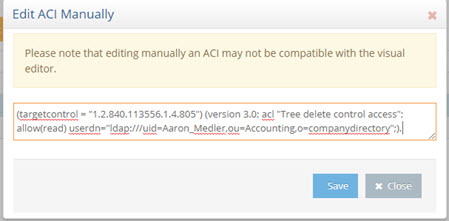


>[!note] 
>To allow anyone to perform a subtree delete request, use a value of “ldap:///anyone” for the userdn as shown in the example below.

>(targetcontrol = "1.2.840.113556.1.4.805") (version 3.0; acl "Anonymous tree delete control access"; allow(read) userdn ="ldap:///anyone";).

7.	Click **Save**.

If the target DN is associated with a RadiantOne Universal Directory (HDAP) store, then RadiantOne processes the subtree delete control. If the target DN is a proxy view to a backend directory, RadiantOne request with the subtree delete control is delegated to the backend for processing.

For example, there are two delete requests shown below (snippets from vds_server.log). The first delete request shows the scenario where the sub tree delete control isn’t passed and the delete fails (with error code 66) and the other shows where the control (1.2.840.113556.1.4.805) is passed and the delete is successful.

Delete request without passing the subtree delete control:

`2017-10-03 10:39:51,526 INFO SessionHandler:1115 - --> conn[SSL/TLS]=1886 op=16 MsgID=16 DeleteRequest {entry=ou=test,o=companydirectory} LDAPControl {2.16.840.1.113730.3.4.2 false}`
<br>`2017-10-03 10:39:51,606 ERROR BackendRouter:3743 - ??? BackendRouter.deleteEntry(): Error from backend: com.rli.slapd.server.LDAPException: (66); Only leaf entry can be deleted.; Operation not allowed on nonleaf`
<br>`2017-10-03 10:39:51,654 INFO SessionHandler:3152 - <== conn[SSL/TLS]=1886 op=16 MsgID=16 DeleteResponse {resultCode=66, matchedDN=null, errorMessage=Only leaf entry can be deleted.} ### etime=128 ###`
<br>`2017-10-03 10:40:40,583 WARN session:561 - Session 17zh5m7l2n01j1gis29nv1entj is now immortal (maxInactiveInterval=-1)`

Delete request passing the subtree delete control:

`2017-10-03 10:40:40,584 INFO SessionHandler:1115 - --> conn[SSL/TLS]=1886 op=17 MsgID=17 DeleteRequest {entry=ou=test,o=companydirectory} LDAPControl {1.2.840.113556.1.4.805 true} LDAPControl {2.16.840.1.113730.3.4.2 false}`
<br>`2017-10-03 10:40:40,654 INFO SessionHandler:3152 - <== conn[SSL/TLS]=1886 op=17 MsgID=17 DeleteResponse {resultCode=0, matchedDN=null, errorMessage=null} ### etime=70 ###`

### Password Policy Control 

The Password Policy Control is enabled by default and allows a client to request information about the current password policy information for a user entry in all password policy enforcement related LDAP operations, specifically BIND, ADD, and MODIFY.  

Specify the Password Policy Control in the LDAP request in the following ways:

-	With the OID. Use the `--control` or `-J` option with the Password Policy Control OID: 1.3.6.1.4.1.42.2.27.8.5.1 with no value.

-	Use the `--usePasswordPolicyControl` option. This option is used for bind requests. An example request and response is shown below.

```
PS C:\Users\test> ldapsearch -h localhost -p 2389 -D "uid=Aaron_Medler,ou=Accounting,o=companydirectory" -w password -b o=companydirectory 
-s sub --usePasswordPolicyControl "(uid=Aaron)"
# Bind Result:
# Result Code: 19 (constraint violation)
# Diagnostic Message: Reason: 775 - Account locked : The password failure limit has been reached and the account is locked. Please retry later or contact the system administrator to reset the password.
# Password Policy Response Control:
#      OID: 1.3.6.1.4.1.42.2.27.8.5.1
#      Error Type: account locked
#      Warning Type: None
# An error occurred while attempting to create a connection pool to communicate with the directory server: LDAPException(resultCode=19 (constraint violation), errorMessage='Reason: 775 - Account locked : The password failure limit has been reached and the account is locked. Please retry later or contact the system administrator to reset the password.', diagnosticMessage='Reason: 775 - Account locked : The password failure limit has been reached and the account is locked. Please retry later or contact the system administrator to reset the password.', responseControls={PasswordPolicyResponseControl(errorType='account locked', isCritical=false)}, ldapSDKVersion=4.0.1, revision='26090')
```

### Modify Increment Extension Feature

RadiantOne supports the modify-increment extension feature as outlined in RFC 4525 by default. This is advertised in the rootDSE in the supportedFeature attribute with a value of 1.3.6.1.1.14.

This extension allows ldap modify operations to support increment capability. The attribute being modified must be appropriate for the request, meaning that it must be of type numeric or integer. The definition of the attribute, in the RadiantOne LDAP schema, must indicate AUTO INCREMENT ATTRIBUTE for the description. An example is shown below for an attribute named uidNumber:

```
attributetypes: ( 1.3.6.1.4.1.40747.92.154461398.154346690.151743700.95511113.1090264 NAME 'uidnumber' DESC 'AUTO INCREMENT ATTRIBUTE' SYNTAX 1.3.6.1.4.1.1466.115.121.1.27 )
```

An example of an ldapmodify request for incrementing the uidNumber by a value of 1 is shown below.

```
# Increment uidNumber
dn: uid=user1,dc=example,dc=com
changetype: modify
increment: uidNumber
uidNumber: 1
```

### All Operational Attributes Extension Feature

RadiantOne supports the All Operational Attributes extension feature as outlined in [RFC 3673](https://www.rfc-editor.org/rfc/rfc3673) by default. This is advertised in the rootDSE to support searching for all operational attributes. 

Using the + character in your comma-separated list of return attributes, this extension allows LDAP searches of RadiantOne Universal Directory stores to return all operational attributes (except computed operational attributes, which must be specified by name). This feature can be useful when trying to determine which operational attributes exist in an entry.

>[!note] 
>Search results may not include all requested attributes if precluded by access controls.

### Absolute True and False Filters

This extension is intended to allow a more direct mapping between DAP and LDAP as needed to implement DAP-to-LDAP gateways. Clients can verify the support of this feature by accessing the RadiantOne RootDSE and verifying OID 1.3.6.1.4.1.4203.1.5.3 is advertised.

This extension allows clients to use “and” and “or” filters with zero filter elements. An “and” filter consisting of an empty set of filters evaluates to true. This filter is represented by the string “(&)”. An “or” filter consisting of an empty set of filters evaluates to false. This filter is represented by the string “(|)”.

### Authorization Identity Control

Authorization Identity Control is a mechanism that allows a client to retrieve the authorization identity established in a bind operation. This is useful when certificates-based authentication is used. Also, some SASL authentication mechanisms may not involve explicitly providing a DN, or may result in an authorization identity which is different from the authentication identity provided by the client.

The Authorization Identity Control (--reportAuthzID) may be submitted in a bind request only. The authorization identity request control has an object identifier of "2.16.840.1.113730.3.4.16" and does not have a value. RadiantOne advertises support for the Authorization Identity Control in the rootDSE. A client that requests the rootDSE sees this value returned as a supported control.


>[!warning] 
>The Authorization Identity Control is allowed for use in conjunction with LDAP bind operations only and therefore cannot be used after the client has authenticated. To obtain the authorization identity at any time after the bind has completed, use the “[Who Am I](settings-tab#who-am-i-extended-operation)” extended operation.

In the following example, the authorization identity control is requested by sending --reportAuthzID in the request.

```
$ ./ldapsearch.bat -h 10.0.3.86 -p 2389 -D "uid=Aaron_Medler,ou=Accounting,o=companydirectory" 
-w password --reportAuthzID -b o=companydirectory -s base objectclass=*
```

The sample command above results in the following type of bind request logged by RadiantOne.

```
BindRequest {version=3, name=uid=Aaron_Medler,ou=Accounting,o=companydirectory, authentication=********} AuthorizationIdentityRequestControl {2.16.840.1.113730.3.4.16 false}
```

The bind response from RadiantOne contains the identity assumed by the client. If the bind request succeeds and results in an identity (not anonymous), the control value contains the authorization identity (authzID). If the bind request resulted in an anonymous association, the control value field is a string of zero length. In the example shown below, the authorization identity is uid=aaron_medler,ou=Accounting,o=companydirectory.

BindResponse {resultCode=0, matchedDN=null, errorMessage=null} AuthorizationIdentityResponseControl {2.16.840.1.113730.3.4.15 false authzID=dn:uid=Aaron_Medler,ou=Accounting,o=companydirectory} ### etime=3 ###

### Who Am I Extended Operation

The "Who am I?" extended operation, as outlined in [RFC 4532](https://www.rfc-editor.org/rfc/rfc4532), provides a mechanism for a client to request the authorization identity associated with the bound connection. Using this extended operation obtains the authorization identity associated with the user or application entity after the bind has established integrity and data confidentiality protections. This approach provides greater flexibility than the [Authorization Identity Control](03-front-end-settings#authorization-identity-control) because it can be requested at any time, not just during a bind operation. In addition, this extended operation can be augmented with a Proxied Authorization Control to determine the authorization identity that the server associated with the identity asserted in the [Proxied Authorization Control](03-front-end-settings#proxied-authorization-control).
RadiantOne advertises support for the “Who Am I” extended operation in the rootDSE. A client that requests the rootDSE sees the 1.3.6.1.4.1.4203.1.11.3 OID value returned as a supported control.


In the following example, a whoami extended request is performed.

```
$ ldapwhoami -h 10.11.12.21 -p 2389 -D "uid=Aaron_Medler,ou=Accounting,o=companydirectory" -w password dn:uid=Aaron_Medler,ou=Accounting,o=companydirectory
```

If the server can provide the authorization identity it associates with the client, the server returns a whoami Response with a successful resultCode. If the client is an anonymous entity, the response field is present but empty. Otherwise, the authzId represents the authorization identity it currently associates with the client in the response field.

Below is an example of a RadiantOne response to a “Who Am I” extended operation request.

```
2018-05-25 08:20:45,246 INFO SessionHandler:1135 - --> conn=477 op=2 MsgID=2 ExtendedRequest {OID='1.3.6.1.4.1.4203.1.11.3', value=''}

2018-05-25 08:20:45,246 INFO SessionHandler:3498 - <== conn=477 op=2 MsgID=2 ExtendedResponse {resultCode=0, matchedDN=null, errorMessage=null, OID='1.3.6.1.4.1.4203.1.11.3', value='dn:uid=Aaron_Medler,ou=Accounting,o=companydirectory'} ### etime=0 ###
```

### Dynamic Entries Extension

The RadiantOne Universal Directory supports temporary entries using the dynamicObject auxiliary object class as specified in [RFC 2589](https://www.rfc-editor.org/rfc/rfc2589). These entries are associated with a time to live attribute and once expired, the entry is automatically removed from the directory. For details on this extension, see the RadiantOne Namespace Configuration Guide.

## Suppressing Partial Results Error

The Partial Results Error (error code 9) typically occurs because a backend directory that RadiantOne is querying returns referral objects as part of the query result and this response is passed back to the client that queried RadiantOne. Referral objects are pointers to other LDAP servers that might contain additional data related to the query. If you want the RadiantOne service to suppress this error code because clients cannot handle or ignore it properly, set the *allowPartialSearchResults* property to true using the RadiantOne REST API:

`https://<rli_rest_endpoint>/adap/util?action=vdsconfig&commandname=set-property&name=allowPartialSearchResults&value=true`

For assistance with changing configuration see: [RadiantOne REST Configuration API](../command-line-configuration-guide/introduction)

## Attributes Handling


 

### Hide Operational Attributes

Check the Hide Operational Attributes option on the Main Control Panel > Settings tab > Server Front End > Attributes Handling section if you do not want LDAP clients to have access to operational attributes (stored in a RadiantOne Universal Directory store) such as: createTimestamp, modifiersName, modifyTimestamp, creatorsName…etc. If you choose to hide operational attributes, LDAP clients must specifically request the operational attribute they want during the search request, otherwise it is not returned.

>[!note] 
>Operational attributes are not hidden from the root user (e.g. cn=Directory Manager) or members of the cn=Directory Administrators group.

Uncheck the Hide Operational Attributes option if LDAP clients are allowed to view the attributes.

### Operational Attributes Excluded from Being Hidden

If checked, the Hide Operational Attributes option hides all operational attributes from non-root users and users that are not a member of the cn=Directory Administrators group. To accommodate third-party integrations that rely on certain operational attributes, without requiring the service account to have Directory Administrator privileges, you can indicate a list of operational attributes that should not be hidden. Indicate them in the Exclude Operational Attributes From Being Hidden field. Separate attribute names with a single space. 

### Attributes Not Displayed in Logs

This property allows you to control which attribute values are not printed in clear in the RadiantOne logs. If you do not want certain attribute values printed in clear in the logs, you can indicate them here. Each attribute name should be separated with a single space. Any attribute indicated here has a value of ***** printed in the logs instead of the value in clear.

### Binary Attributes

Sometimes, LDAP directory schema definitions do not define certain attributes as binary even though the value of these attributes is binary. An example of this is the objectGUID attribute in Microsoft Active Directory. If the LDAP backend schema definition does not properly define the attribute type as binary, RadiantOne does not translate the value properly when returning it to an LDAP client. To ensure RadiantOne translates the value as binary, you must list the attribute name in the Binary Attributes parameter (space separated list). This parameter is global and applies to any backend LDAP that RadiantOne is accessing. The binary attributes can be defined from the Main Control Panel > Settings tab > Server Front End > Attributes Handling section. As long as the attribute name is listed, RadiantOne returns the value to a client as binary even if the backend LDAP server doesn’t define it as such.

>[!note] 
>If a binary attribute should be searchable, define the attribute in the RadiantOne LDAP schema with a friendly name indicating it as binary. Below is an example for the certificateRevocationList attribute: attributeTypes: ( 2.5.4.39 NAME ( 'certificateRevocationList;binary' 'certificateRevocationList' ) DESC 'Standard LDAP attribute type' SYNTAX 1.3.6.1.4.1.1466.115.121.1.5 X-ORIGIN 'RFC 2256’ )

### Excluded Attributes from Active Directory

This parameter is for Active Directory backends and is used for excluding specific attributes from being returned from the backend. Certain “system” attributes (e.g. dscorepropagationdata) returned from Active Directory (even for non-admin users) can cause problems for building persistent cache because the data type is not handled properly, and these attributes need to be added to the RadiantOne LDAP schema for the local storage to handle them in the cache. Also, these attributes cause problems for the change capture connector needed for real-time persistent cache refresh to work properly. Attributes that are not required by RadiantOne client applications, should be added to this list to ensure they are not returned in the view from Active Directory. By default, the AD attributes that are excluded are ds*, acs*, ms* and frs* (* is a wildcard meaning that any attributes with those prefixes are excluded). Any attributes that you do not want returned from the backend Active Directory can be added to the Excluded Attributes property. This value is defined from the Main Control Panel > Settings tab > Server Front End > Attributes Handling section. Make sure a space separates the attributes listed. Click **Save** when finished.

### Multi-Valued Database Attributes

The Multi-Valued Database Attributes setting can be managed from the Main Control Panel > Settings tab > Server Front End > Attributes Handling section. This parameter allows for special processing of a database attribute that contains a multi-value. The database attribute must contain values separated by a space then the pound sign (#), then a space before the next value. For example, assume the following table existed inside a database:

Database Table Sample:

Name | Mail | 	Title
-|-|-
Harold Carter | hcarter@rli.com # harold@yahoo.com | HR Admin # HR # HR MGR

RadiantOne can return the database record with multi-valued attributes for Mail and Title.

Entry returned by RadiantOne with Multi-Valued Attributes Set:

```
cn=Harold Carter
mail = hcarter@rli.com
mail = harold@yahoo.com
title = HR Admin
title = HR
title = HR MGR
```

For RadiantOne to return database attributes as multi-valued, the attribute names must be listed in the Multi-valued DB Attributes parameter. The value of this parameter should be the database attribute name (or Mapped Attribute Name if one is being used). If there is more than one attribute, separate them with a comma.

If the Multi-valued DB Attributes parameter is not set, then RadiantOne would return the following:

Entry returned by RadiantOne if NO Multi-Valued Attributes Set:

```
cn=Harold Carter
mail = hcarter@rli.com # harold@yahoo.com
title = HR Admin # HR # HR MGR
```

### Keyword Attributes for Context Search

The attributes that you want to be searchable from the sample RadiantOne client applications (e.g. Context Browser) must be defined in the Keyword Search Attributes. This parameter is located in the Main Control Panel > Settings tab > Server Front End > Attributes Handling section and should contain a comma separated list of attribute names that you want RadiantOne to use to locate the contexts relevant to the keyword searched from the Context Browser. 

The value that is searched from Context Browser results in a search against all attributes listed in the Keyword Search Attributes parameter. For example, if boots was the keyword entered in Context Browser, and productname, productdescription, and shipname where the attributes configured as Keyword Search Attributes, RadiantOne would return all contexts found where “productname=boots”, “productdescription=boots”, and/or “shipname=boots”. The Context Browser displays all contexts in which the keyword was found and based on the view hierarchy/definition (verb tagging), the results are in the form of human-readable sentences.

For more information on Context Browser, please see the RadiantOne Context Browser Guide.

## Duplicate Identity Handling


Figure 9: Duplicate Identity Handling Section

### Duplicate DN Removal

During the identification phase (finding the person in the directory tree) of the authentication process, it is important that a search for a specific, unique user account only returns one entry.

When aggregating model-driven virtual views (created in Context Builder) from multiple sources, there is the potential to have duplicate DN’s (because the same person exists in more than one source or the same identifier belongs to different people). Returning multiple users with the same DN is a violation of an LDAP directory. Therefore, if your virtual namespace encounters this configuration issue, you can enable the Duplicate DN Removal option to have RadiantOne return only the first entry. This is fine if the duplicate DN’s result in the same person. If they are not the same person, then you have a different problem which is identity correlation (correlating and reconciling the same person in multiple data sources) that needs to be addressed. To assist with your identity correlation problem, please see the RadiantOne Global Identity Builder Guide.

Let’s look at an example of duplicate DN’s being returned for the same person. A person named Laura Callahan has an Active Directory account and a Sun Directory account. If both sources are virtualized and then merge-linked into a common virtual tree, a search on the tree would yield two results (because the RDN configured in the virtual views is exactly the same). Below is a screen shot of the virtual tree where both virtual views are linked, and a search from the Main Control Panel, Directory Browser tab, that returns two results.


 


 
If Laura Callahan in Active Directory is in fact the same Laura Callahan as in Sun, you can enable Duplicate DN Removal to consolidate the two accounts. The screen shots below show the Duplicate DN Removal option enabled and the new result for the search.

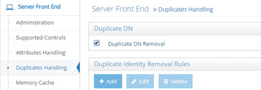
 


 
The one entry returned with attributes from the first source the user was found in (Active Directory in this example).


 
### Duplicate Identity Removal Rules

>[!note] 
>In general, it is usually recommended that you use the Global Identity Builder to build your view if you know you have overlapping entries that require correlation/disambiguation.

In cases where RadiantOne is aggregating common user identities from multiple data sources, you have the option to configure it to remove any duplicate users (from search responses) if it finds there is a common attribute/identifier (across the data sources you have aggregated). It can also be used as a way for RadiantOne to eliminate ambiguity by returning only one unique entry. Let’s take two sources as an example. Source 1 is Active Directory and source 2 is a Sun directory. Both sources have been aggregated into the virtual namespace below a naming context of dc=demo and as the two following screens show, Laura Callahan exists in both.


 


 
The unique Identifier between the examples above is employeeID (employeeNumber in Sun has been mapped to employeeID to provide a common attribute between Sun and Active Directory). Therefore, a subtree search for employeeID=8 below dc=demo would return two people in this example.

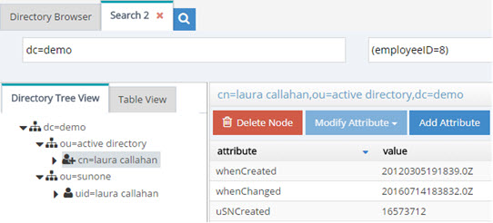
 

Now, if Duplicate Identity Removal rules are configured, RadiantOne returns only the first entry that it finds (in this case, the one from Active Directory). Multiple duplicate identity rules can be configured (each branch in the RadiantOne namespace may have a duplicate identity removal rule). In addition, multiple attributes may be used to determine a duplicate identity. For example, you can set uid,employeeid and this means if an entry has the same uid and employeeid then it is the same person. Make sure to list the attributes you want to use to determine a duplicate identity with a comma separating each attribute name. Remember to save your settings after defining the rules.

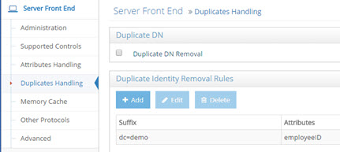


>[!warning] 
>The identity attribute selected, must satisfy the following requirements: 
<br>Single-valued <br>Represent an identity (sAMAccountName, employeeID, etc...) <br>If the attribute is not present in an entry, the entry is returned. <br>If no suffix is specified, this identity attribute applies to the whole server search response.<br>The RadiantOne service must be restarted after changing these parameters. <br>Any search response returned by RadiantOne (below the specified starting suffix) checks if another entry with the same attribute/value has already been returned. If an entry with the same identity attribute value has been returned, then others are not returned.


This is ideal for handling authentication requests (to ensure only one entry is returned to base authentication on). However, for authorization purposes, if a user exists in more than one source, only attributes from the first source are returned. If you need a complete profile of attributes coming from all the user’s accounts, then you need to configure joins to all branches in the virtual tree where the user may have an account. This join condition can be based on the identity attribute (or any other attribute that can be used to uniquely identify the person in the other branch). As a result, searches for the user still return only one entry. Without a join configured across these virtual views, only attributes from the first source the user was found in would be returned. For details on joining, please see [Joins](02-concepts#joins) in the Concepts section.

>[!warning] 
>If your use case requires identity correlation to address user overlap, and a complete identity profile is needed for authorization, you should review the capabilities of the Global Identity Builder as opposed to trying to use Duplicate Identity Removal.

## Memory Cache

RadiantOne supports two types of memory cache: Query and Entry. For complete details on both, please see the RadiantOne Deployment and Tuning Guide.

Memory cache can be configured from the Main Control Panel > Settings Tab > Server Front End > Memory Cache section.

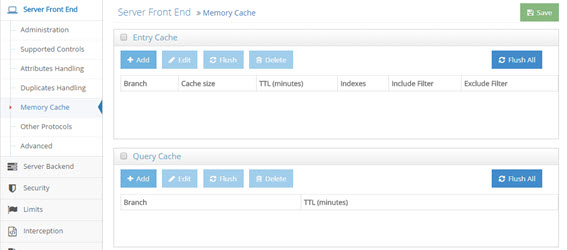

### Entry Cache

>[!note] 
>This setting is accessible only in [Expert Mode](01-introduction#expert-mode).

To define an entry cache:

1.	In the Main Control Panel go to the > Settings Tab > Server Front End > Memory Cache section. 

2.	Check the Entry Cache box. 

3.	Click **Add**.

4.	Choose a starting point in the virtual namespace from where you want to start caching entries.

5.	Indicate the number of entries to cache, Time to Live (how long you want the entries to remain in the cache), which attributes to index, and any desired include or exclude filters.

6.	Click **OK**. The new entry cache is displayed. 

7.	Click **Save**.

>[!note] 
>You can flush the entry memory cache at any time from the Main Control Panel > Settings Tab > Server Front End > Memory Cache section. Click FLUSH ALL located in the Entry cache section.

For complete details on how entry memory cache works, please see the RadiantOne Deployment and Tuning Guide.

### Query Cache

>[!note] 
>This setting is accessible only in [Expert Mode](01-introduction#expert-mode).

To define a query cache:

1.	In the Main Control Panel, go to > Settings Tab > Server Front End > Memory Cache section.

2.	Check the Query Cache box. 

3.	Click **Add**.

4.	Choose a starting point in the virtual namespace from where you want to start caching queries. 

5.	Indicate the Time to Live (how long you want the queries to remain in the cache). 

6.	Click **OK**. The new query cache is displayed.

7.	Click **Save**.

>[!note] 
>You can flush the query memory cache at any time from the Main Control Panel > Settings Tab > Server Front End > Memory Cache section. Click **FLUSH ALL** located in the Query cache section.

For complete details on how query memory cache works, please see the RadiantOne Deployment and Tuning Guide. 

## Other Access Protocols

In addition to supporting LDAP operations, RadiantOne can also be accessed via SPML, DSML, REST and SAML. The configuration for these additional services is located on the Settings tab, Server Front End Section, Other Protocols sub-section.

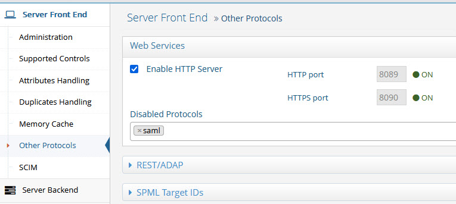


### Web Services (HTTP) Port

The HTTPS interface is enabled by default. The RadiantOne service accepts web service requests (SCIM, ADAP, DSML, SPML) on this endpoint. For details on accessing the RadiantOne Web Services, please see http://developer.radiantlogic.com/developer/.

**DSML, SPML, SCIM, REST (ADAP), SAML**

SCIM settings are configured in the Server Front End > SCIM section. 

For details on configuring and accessing RadiantOne via DSML, SPML, SCIM, and REST, please see http://developer.radiantlogic.com/developer/. 

## Interception

The idea behind interception is that it allows you to customize and override the default processing of RadiantOne. In most cases, this is accomplished with interception scripts. However, there are also some built-in configuration capabilities that allow you to customize the behavior of RadiantOne within invoking a script. This section introduces Global Interception Scripts, User to DN Mapping and Search Filter Mapping Rules.

>[!note] 
>This section is accessible only in [Expert Mode](01-introduction#expert-mode).

### Global Interception

For specific details, please see [Interception Scripts](02-concepts#interception-scripts) in the Concepts section. This section describes how to enable interception scripts at a global level (which are applicable to the entire RadiantOne namespace – all naming contexts).

To enable global interception:

1.	From the Main Control Panel > Settings Tab > Interception section > Global Interception sub section.

2.	On the right side, enable the operations you want to intercept. Save the settings and then you can edit the globalintercept.java script.


 
3.	After your script has been customized, save the file and then rebuild the intercept.jar

4.	Restart the RadiantOne service. Your script logic is now invoked for the operations you have enabled.

## Global External Joins	

A global join applies to all entries contained in any root naming context. Joins that you want to be global to RadiantOne can be configured using the Join Wizard accessed from the Global Join sub-tab. This wizard helps you configure the syntax.

For complete details on the usage and configuration of joins, please see the section titled [Joins](02-concepts#joins).

To configure a global join:

1.	From the Main Control Panel, go to the Settings tab > Interception section > Global External Joins.

2.	Click **Add**. The Join Wizard opens.

3.	Select Regular and click **Next**.

4.	Select an Object Class associated with the entries from the primary object that you want to join.

5.	Select the attribute you want to base the join condition on from the Join Attribute drop-down menu. Click Next.

6.	Select the data source that represents the location that contains the secondary objects you want to join with. This can be either RadiantOne or another LDAP server that has been defined as a [data source](02-concepts#data-source). If using RadiantOne as the secondary join source, select vds as the data source. If you want to join to some other LDAP, you must first configure the [data source](02-concepts#data-source) and then it appears in the drop-down list to select during this step. 

7.	Click **Browse** to locate the Base DN or enter the location yourself.

8.	Specify the scope of search to perform to find the entries to join with. The drop-down options are base, one, 
or sub.

10.	Select the specific object class associated with the secondary entries you want to join with in the Object Class parameter from the drop-down list. For information on schema extension, please see [Extending RadiantOne LDAP Schema](07-directory-schema#extending-the-radiantone-ldap-schema).

11.	Select the attribute from the secondary object that you want to base the join condition on from the Join Attribute drop-down menu. The value of this attribute should match the value of the primary source join attribute that you set in step above. The Join Condition parameter displays the attribute matching criteria for the join.

12.	Click **Next**.

13.	Decide if you would like all the possible attributes returned from the secondary object or if you would like to list the attributes to return. If you choose to list the attributes, click Add and enter the name of the attribute (or select from the drop-down list). You also can provide a virtual/mapped name (this is optional and is the name of the attribute that appears in the virtual entry). Click **OK** and repeat this process for each attribute you would like returned from the secondary object. Click **Next**.

14.	Enter a unique name for this join profile and click **Finish**.

15.	Click **Save**.

## User to DN Mapping

Typically, an LDAP client performs authentication first by searching RadiantOne for a specific user (based on configuration of the client to search for a specific attribute like cn, sAMAccountName, uid…etc.), and then issues a bind with the user DN returned in the search. These two steps are referred to as identification and credential checking respectively.

If this functionality is not implemented at the client level, RadiantOne can be configured to perform the identification step with user ID to DN mappings. This configuration describes how RadiantOne should find the user DN based on the ID that was received in the bind request.

Let’s look at the following examples to describe the difference.

In the diagrams below, the client is configured to search for the user account and then issue the bind.

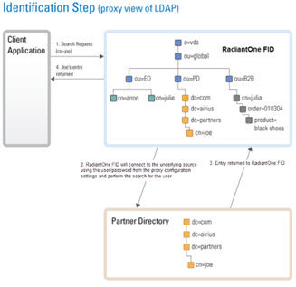


 

If the client application is not configured (or cannot be configured) to issue a search and then bind, RadiantOne can be configured to perform the search (to find the DN). This is accomplished using User ID to DN mappings.


 

### Manage Global User to DN Mapping

This location is just for configuring a global user ID to DN mapping. If you are configuring a mapping for <!--[Kerberos](security#kerberos), [NTLM](security#ntlm) or --> [MD5](06-security#md5), the configuration is set in that section located on the Main Control Panel > Settings Tab > Security section > Authentication Methods.

There are three different ways to determine the DN from the user ID (using regular expression syntax). Each is described below.

-	Setting a specific User ID to DN. In this example, if lcallahan were received in the authentication request, RadiantOne would base the authentication on the DN: cn=laura Callahan,cn=users,dc=mycompany,dc=com

```
    lcallahan (the user ID) -> (maps to) cn= laura Callahan, cn=users,dc=mycompany,dc=com
```

-	Specify a DN Suffix, replacing the $1 value with the User ID.

```
(.+) -> uid=$1,ou=people,ou=ssl,dc=com
(.+) represents the value coming in to RadiantOne. If it received a User ID of lcallahan, the DN used to issue the Bind to the underlying directory would be: uid=lcallahan,ou=people,ou=ssl,dc=com.
```

-	Specify a Base DN, scope of the search, and a search filter to search for the user based on the User ID received in the bind request.

```
(.+) -> dc=domain1,dc=com??sub?(sAMAccountName=$1)
```

If RadiantOne received a User ID of lcallahan, it would issue a search like:

```
dc=domain1,dc=com??sub?(sAMAccountName=lcallahan)
```

Then, a bind request is issued with the user DN that is returned.

For options 2 and 3 described above, multiple variables can be used (not just 1 as described in the examples). Let’s look at an example mapping that uses multiple variables:

```
(.+)@(.+).(.+).com -> ou=$2,dc=$3,dc=com??sub?(&(uid=$1)(dc=$3))
```

If RadiantOne received a user ID like laura_callahan@ny.radiant.com, the search that would be issued would look like:

```
ou=ny,dc=radiant,dc=com??sub?(&(uid=laura_callahan)(dc=radiant))
```

RadiantOne uses the DN returned in the search result to issue the Bind request to the backend directory.

### Processing Multiple Mapping Rules

Many User to DN Mapping rules can be configured. They are processed by RadiantOne in the order they appear.

If a single User ID is found with the first mapping rule, then no other rules are evaluated. If the credential is correct, the user is authenticated (by the underlying directory). If the credentials are not correct, the authentication fails. If the authentication fails, no other DN mapping rules are executed. Only if the user is not found using the first DN mapping rule or if multiple users are returned based on the first rule causing ambiguity, will the other rules be evaluated. 

For example, if Laura Callahan, with a login of laura_callahan, is in two sources and there are two DN Mapping rules configured:

```
dc=domain1,dc=com??sub?(sAMAccountName=$1)
uid=$1,ou=people,ou=ssl,dc=com
```

The first DN Mapping rule is evaluated (dc=domain1,dc=com??sub?(sAMAccountName=laura_callahan)

If Laura Callahan’s account is found from the search, a BIND request is issued using her DN. If the credentials don’t match what are in the underlying directory, the authentication fails. The second DN mapping rule is NOT evaluated. Only when the first DN mapping rule fails to find a user, or if multiple users are returned by the first rule (causing ambiguity), will the other DN mapping rules be used. If no other rules are defined, the authentication fails.

## Search Filter Mapping Rules

As an alternative to writing an interception script for modifying an incoming query search filter, you can configure search filter mapping rules. This allows you to translate an incoming search filter into an alternative filter. The translation is based on regular expression syntax and configurable from the Main Control Panel > Settings Tab > Interception section > Search Filter Mapping Rules sub-section. These mapping rules are invoked at a global level meaning that no matter what naming context/base DN a client indicates in their search request, these filter mapping/translation rules are applied.

The general syntax is to define incoming filter criterion that you want to intercept and then what you want to replace it with. Since an incoming LDAP filter can be quite complex and involve many attribute conditions, you could have a variable to translate each of these filter components. However, the filter pattern syntax indicated in the configuration always starts with a (.*) and end with a (.*). This indicates that everything in the filter prior to and every part of the filter after the components you want to translate should remain the same. For example, an incoming LDAP filter could be something like: (&(objectclass=user)(l=Novato)(title=Sales Manager)). Let’s assume you want to translate filters like this into (&(objectclass=user)(city=Novato)(title=Sales Manager)). Therefore, the incoming filter pattern would look something like this: (.*)\(l=(.+)\)(.*) meaning that every part of the filter before the component using the l attribute and every part of the filter after the component using the l attribute should remain the same, and the “l” component should be translated into “city”.

Below are some examples of search filter mappings.

For this example, if an LDAP search filter contains “city”, it is replaced by a search for the attribute “l”. Using regular expression, define that any filter with the pattern (.*)\(city=(.*) should be replaced by $1(l=$2), as shown below.

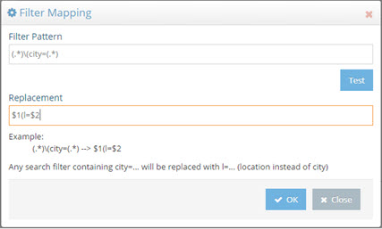
 

If RadiantOne receives a request containing a filter of (city=Los Angeles), all entries with l=Los Angeles are returned. This is shown in the example below.


 

The (.*) before and after city in the filter pattern ensures all information before and after city in the incoming LDAP filter is not translated. For example, if the incoming filter is something like (&(city=Los Angeles)(employeeType=Manager)), while the filter component for city is replaced by “l”, the search for employeeType=Manager is not translated. Therefore, the search filter is processed as: (&(l=Los Angeles)(employeeType=Manager)). An example is shown below.


 
The search filter mapping rules can also be used to replace more than one attribute condition in a single search. For example, assume you want all searches for city and title to be replaced by location (“l”) and employeetype, therefore, the filter pattern could be defined as: (.*)\(city=(.+)\)\(title=(.+)\)(.*) and the replacement pattern as $1(&(l=$2)(employeetype=$3))$4


 

Now, as a runtime example, all searches containing a filter for (&(city=Los Angeles)(title=Manager)) will return a list of entries with l=Los Angeles and employeetype=Manager and this can be seen in the screen below.

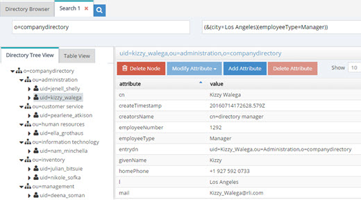
 

The translation rule isn’t limited to a one-to-one attribute mapping. You can also leverage a lookup based on the incoming filter to determine what the filter should be translated into. In the following example, a lookup will be performed against the vds data source (as indicated by the [vds] part of the LDAP URL used in the replacement pattern) on the o=companydirectory branch for entries containing an attribute of `postalCode=<the value of the zipcode received in the incoming filter>`. The “l” attribute for this entry is returned and passed in the filter for processing instead of the value of the zipcode. The incoming filter and replacement patterns are shown below:

Incoming Filter: (.*)\(zipcode=(.+)\)(.*)

Replacement: $1(l=`ldap://[vds]/o=companydirectory?ou?sub?(postalcode=$2)`)$3

>[!warning] 
>In the replacement syntax, the LDAP URL is enclosed in backticks/grave accents (generally located below the tilde character on keyboards), not to be mistaken for single quotes.**


 
According to the filter pattern in this example, if the incoming filter included (zipcode=94949), it would be translated into a filter of l=Novato (lookup in vds data source where postalcode=94949 and returning the l attribute for this entry). Therefore, in this example, all entries with l=Novato are returned by the search and a sample can be seen below.


 
## Redirections

By default, RadiantOne handles operations against a naming context associated with a Universal Directory (HDAP) store locally. However, in certain deployment scenarios (e.g. for performance or multi cluster deployments), not all stores should receive all types of operations. For each naming context representing a Universal Directory store, you can dictate whether write and bind operations should be redirected to another RadiantOne server. 

First, all RadiantOne servers must be defined as data sources in the Main Control Panel > Settings Tab > Server Backend section. Then, from the Settings Tab > Interception section > Redirections sub-section, select the naming context where you would like to redirect operations on the right side.

If you want to redirect write operations to another RadiantOne cluster, select a branch and click **EDIT**. In the “Redirect Write Operations (Add, Modify, Delete) To” drop-down list, select the data source representing the location where you want the writes to be sent.

For redirected writes, you also have the option to define the local write mode. This functionality requires Inter-Cluster replication to be enabled on the Universal Directory store. For details on Inter-Cluster replication, please see the RadiantOne Deployment and Tuning Guide. The options are as follow:

-	Write locally after reading from redirected source (default behavior).

    The write request is redirected and if it is successful the local store is written to after reading from the remote source. This functionality requires Inter-Cluster replication to be enabled on the Universal Directory store.

-	No local write.
<br>The write request is redirected to the remote data source. There is no immediate update made to the local store. This functionality requires Inter-Cluster replication to be enabled on the Universal Directory store.

-	Write locally based on the request.
<br>The write request is redirected and if it is successful the local store is also written to immediately. This functionality requires Inter-Cluster replication to be enabled on the Universal Directory store.

In all the above cases, the local entry is also updated later through inter-cluster replication.

You may also condition the write redirection based on attributes received in the modify request. Modifications to certain attributes, generally operational ones like pwdAccountLockedTime, pwdFailureTime…etc, should be handled locally and not redirected. List these conditional attributes (comma separated) in the Attributes Preventing Redirection on Write Operations property. Write operations are not redirected if any of the attributes defined in this property are present in the request.

If you want to redirect bind operations to another RadiantOne server, select a branch and click Edit. In the ‘Redirect Bind Operations To’ drop-down list, select the data source to direct bind operations to.

When you are finished, click **Save** in the top right corner.

For more examples of using redirects, please see the RadiantOne Deployment and Tuning Guide.


