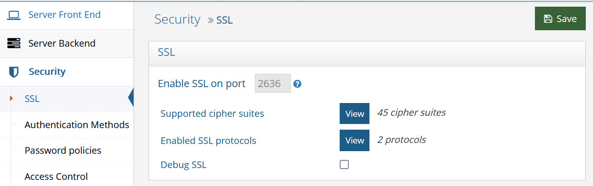
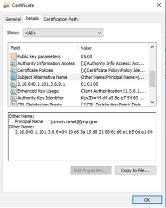
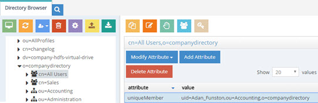
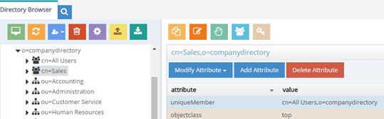
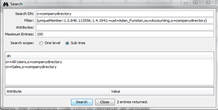

# Security

To access the RadiantOne service via LDAP, the LDAP client must authenticate itself. This process is called a “bind” operation and means, the client must tell the LDAP server who is going to be accessing the data so that the server can decide what the client is allowed to see and do (authorization). After the client successfully authenticates, RadiantOne checks whether the client is allowed to perform subsequent requests. This process is called authorization and is enforced via [access controls](#access-control).

RadiantOne supports three types of authentication: anonymous, simple and SASL.

**Anonymous:**

Clients that send an LDAP request without doing a "bind" are treated as anonymous. Clients who bind to RadiantOne without a password value are also considered anonymous. 

**Simple:**

Simple authentication consists of sending the LDAP server the fully qualified DN of the client (user) and the client's clear-text password. To avoid exposing the password in clear over the network, you can use SSL (an encrypted channel). For details on configuring SSL, please see the [SSL Settings](#ssl-settings) section.

<!--

**SASL:**

Clients that send an authentication request to RadiantOne using Kerberos (GSS-SPNEGO), (GSSAPI), MD5 (DIGEST-MD5) or Certificate (EXTERNAL) are leveraging one of the supported SASL mechanisms. The SASL EXTERNAL mechanism is supported by default, but you must configure the [Client Certificate to DN Mapping](#client-certificate-dn-mapping) so the RadiantOne service knows how to identify the user in the certificate to a user in the RadiantOne namespace. For details on these supported mechanisms, please see [Authentication Methods](#authentication-methods).

-->



Figure 1: SSL Settings

## SSL Settings

SSL settings are applicable to clients connecting to the RadiantOne service LDAPS endpoint and involve indicating how <!--mutual authentication should be handled, client certificate DN mapping (for enforcing authorization), -->managing the certificates in the default Java truststore (cacerts), which cipher suites are supported by RadiantOne, and certificate revocation. These subjects are described in this section.

### Enable SSL

SSL/TLS is used by default and cannot be disabled.

<!--

### Certificate-based Authentication: Support for Mutual Authentication

A certificate is an electronic document that identifies an entity which can be an individual, a server, a company, or some other entity. The certificate also associates the entity with a public key.

For normal SSL communications, where the only requirement is that the client trusts the server, no additional configuration is necessary (if both entities trust each other). For mutual authentication, where there is a reciprocal trust relationship between the client and the server, the client must generate a certificate containing his identity and private key in his keystore. The client must also make a version of the certificate containing his identity and public key, which RadiantOne must store in its truststore. In turn, the client needs to trust the server; this is accomplished by importing the server's CA certificate into the client truststore.

>[!note] 
>Certificate-based authentication (mutual authentication) requires the use of SSL or StartTLS for the communication between the client and RadiantOne.

The diagram below shows how certificates and the SSL protocol are used together for authentication.


Figure 2: Mutual Authentication

There are three options for mutual authentication and this can be set from the Main Control Panel > Settings Tab > Security section > SSL > Mutual Auth. Client Certificate drop-down menu: Required, Requested and None (default value). If mutual authentication is required, choose the Required option. If this option is selected, it forces a mutual authentication. If the client fails to provide a valid certificate which can be trusted by RadiantOne, authentication fails, and the TCP/IP connection is dropped.

If mutual authentication is not required, but you would like RadiantOne to request a certificate from the client, choose the Requested option. In this scenario, if the client provides a valid/trusted certificate, a mutual authentication connection is established. If the certificate presented is invalid, the authentication fails. If no certificate is presented, the connection continues (using a simple LDAP bind) but is not mutual authentication.

If you do not want RadiantOne to request a client certificate at all, check the None option.

If the client certificate is not signed by a known certificate authority, it must be added in the [RadiantOne client truststore](#client-certificate-trust-store-cluster-level-trust-store).


#### Requiring Certificate-based Authentication

If you want to require certificate-based authentication:

1. The client must trust the RadiantOne server certificate (import the RadiantOne public key certificate into the client truststore, unless the server certificate has been signed by a certificate authority known/trusted by the client).

2. The RadiantOne service must trust the client (import the client’s public key certificate into the [RadiantOne client truststore](#client-certificate-trust-store-cluster-level-trust-store), unless the client certificate is signed by a known/trusted certificate authority).

3. From the Main Control Panel > Settings Tab > Security section > SSL > Mutual Auth. Client Certificate drop-down menu, select Required.

4. From the Main Control Panel > Settings Tab > Security section > SSL, click **Change** next to [Client Certificate DN Mapping](#client-certificate-dn-mapping) and define your mappings.

>[!warning] 
>The Client Certificate DN Mapping is only accessible by a member of the [Directory Administrator role/group](01-introduction#delegated-administration-of-radiantone).

5. Click **Save** and restart the RadiantOne service. If RadiantOne is deployed in a cluster, restart RadiantOne on all nodes.

### Client Certificate DN Mapping

To authorize a user who authenticates using a certificate (e.g. SASL External) you must set a client certificate DN mapping. This maps the user DN (Subject or Subject Alternate Name from the certificate) to a specific DN in the RadiantOne namespace. After, the DN in the RadiantOne namespace determines authorization (access controls). 

>[!note] 
>To avoid problems with special characters, RadiantOne normalizes the certificate subject prior to applying the certificate DN mapping.

To set the client certificate DN mapping:

1. Go to the Main Control Panel > Settings Tab > Security Section > SSL sub-section.

2. Click **Change** next to the Client Certificate DN Mapping property.

>[!warning] 
>The Client Certificate DN Mapping is only accessible by a member of the [Directory Administrator role/group](01-introduction#delegated-administration-of-radiantone).

There are different ways to determine the DN from the subject or subject alternative name in the certificate (using regular expression syntax).

Setting a specific subject or subject alternative name to DN in the virtual namespace:

```
cn=lcallahan,dc=rli,dc=com (the user DN in the certificate) -> (maps to) cn= laura Callahan,cn=users,dc=mycompany,dc=com
```

Specify a Base DN, scope of the search, and a search filter to search for the user based on the subject or subject alternative name received in the certificate:

```
uid=(.+),dc=rli,dc=com -> dc=domain1,dc=com??sub?(sAMAccountName=$1)
```

If RadiantOne received a certificate subject of uid=lcallahan,dc=rli,dc=com then it would look for the virtual entry based on:

```
dc=domain1,dc=com??sub?(sAMAccountName=lcallahan)
```

Then, authorization would be based on the user DN that is returned.

As another option, multiple variables can be used (not just 1 as described in the previous example). Let’s take a look at an example mapping that uses multiple variables:

```
cn=(.+),dc=(.+),dc=(.+),dc=com -> (maps to) ou=$2,dc=$3,dc=com??sub?(&(uid=$1)(dc=$3))
```

If RadiantOne received a subject from the certificate that looked like: cn=laura_callahan,dc=ny,dc=radiant,dc=com, the search that would be issued would look like:

```
ou=ny,dc=radiant,dc=com??sub?(&(uid=laura_callahan)(dc=radiant))
```

RadiantOne uses the DN returned in the search result to base authorization on. 

If the subject in the SSL certificate is blank, you can specify that a Subject Alternative Name (SAN) should be used. You can use an alternative name in the mapping by specifying {alt} before the regular expression. For example: {alt}^(.+)$ uses the first alternative name found. You can be more specific and specify which alternative name in the certificate that you want to match by specifying the type [0-8]. For example: {alt:0}^(.+)$ uses the otherName alternative name. The type number associated with each is shown below.

otherName                         [0]
rfc822Name                       [1]
dNSName                          [2]
x400Address                      [3]
directoryName                   [4]
ediPartyName                    [5]
uniformResourceIdentifier  [6]
iPAddress                           [7]
registeredID                        [8]

For example, {alt:0}^(.+)@my.gov$ defined as the Certificate DN captures "james.newt" for the certificate shown below.


 
Figure 2: Example SSL Certificate

If all mapping rules fail to locate a user, anonymous access is granted (if anonymous access is allowed to RadiantOne).

>[!note] 
>As an alternative to anonymous access, it is generally recommended that you create a final mapping that results in associating the authenticated user with a default user that has minimum access rights. An example is shown below where the last mapping rule matches to a user identified in RadiantOne as “uid=default,ou=globalusers,cn=config”.


Figure 3: Example Default Mapping Rule

**Processing Multiple Mapping Rules**

Many Client Certificate DN Mapping rules can be configured. They are processed by RadiantOne in the order they appear.

The first DN mapping rule in the list is applied first. IF the user is found with the first mapping rule, then no other rules are evaluated. ONLY if the user is NOT found using the first DN mapping rule will the other rules be evaluated. If all mapping rules fail to locate a user, anonymous access is granted (if anonymous access is allowed to RadiantOne).

For example, let’s say two DN Mapping rules have been configured:

```
dc=domain1,dc=com??sub?(sAMAccountName=$1)
uid=$1,ou=people,ou=ssl,dc=com
```

The first DN Mapping rule will be evaluated like:

```
dc=domain1,dc=com??sub?(sAMAccountName=laura_callahan)
```

If Laura Callahan’s entry is found from the search, authorization is based on this user DN (and the groups this user is a member of). If the account is not found, then the second mapping rule is evaluated. If all mapping rules fail to locate a user in the virtual namespace, the user who authenticated with the certificate is considered anonymous.

Only when the first DN mapping rule fails to find a user will the other DN mapping rules be used.

Remember, changing any parameters related to SSL requires a restart of the RadiantOne service.

### Client Certificates (Default Java Truststore)

For RadiantOne to connect via SSL to an underlying data source, or accept client certificates for authentication, the appropriate client certificate needs imported (unless they are signed by a trusted/known Certificate Authority). For classic RadiantOne architectures (active/active or active/passive), these certificates can be imported into the default Java trust store (<RLI_HOME>\jdk\jre\lib\security\cacerts). 

>[!warning] 
>If RadiantOne is deployed in a cluster, import the client certificates into the [cluster level truststore](client-certificate-trust-store#client-certificate-trust-store-cluster-level-trust-store) instead of the default one so they can be dynamically shared across all cluster nodes.

To manage the client certificates contained in the default Java trust store, click **Manage** next to the Client Certificates property.


Figure 4: Managing Client Certificates in the Default Java Truststore

**Viewing Client Certificates**

To view a certificate, select the certificate in the list and click **View Certificate**. Valuable information about the certificate is shown (who issued the certificate, who the certificate was issued to, when the certificate is set to expire, status…etc.). From this location, you have the option to copy the certificate to a file.

**Adding Client Certificates**

To add a certificate:

1. Click **Add Certificate**. 

2. Browse to the location of the client certificate file and click **OK**. 

3. Click **Add Certificate**. 

4. Enter a short, unique name (alias) for the certificate and click **OK**. 

5. Enter the Key Store Password and click **OK**. The default password is changeit.The added certificate appears in the list.

6. Click **Save** in the upper right corner.

7. Restart the RadiantOne service.

**Deleting Client Certificates**

To delete a certificate:

1. Select the desired certificate and click **Delete Certificate**.

2. Click **Yes** to confirm the deletion.

3. Click **Save** in the upper right corner.

4. Restart the RadiantOne service.

**Set Key Store Password**

To change the Key Store password (which by default is changeit):

1. Click **Set Password**.

2. Enter the old password, new password, and confirm the new password. Click **OK**.

3. Save **Save** in the upper right corner.

-->

### Supported Cipher Suites

To view the cipher strength levels enabled in RadiantOne, go to the Main Control Panel > Settings Tab > Security section > SSL sub-section and click `View` next to Supported Cipher Suites.

### Enabled SSL Protocols

To view the enabled SSL protocols enabled in RadiantOne, go to the Main Control Panel > Settings Tab > Security section > SSL sub-section. Click `View` next to Enabled SSL Protocols.

### Debug SSL

SSL is enabled by default, but SSL logging is disabled by default. When SSL logging is enabled, SSL events have an entry in vds_server.log.  SSL events are logged at INFO level, so log settings for VDS – Server must be at least at INFO level. You can view and download the vds_server.log from the Server Control Panel > Log Viewer.

>[!note] 
>For more information on log levels, refer to the RadiantOne Logging and Troubleshooting Guide.

To enable SSL logging:

1. From the Main Control Panel, click Settings > Logs > Log Settings.

2. From the Log Settings to Configure drop-down menu, select VDS – Server. 

3. Verify that the Log Level drop-down menu is set to one of the following: INFO, DEBUG, or TRACE. 

4. If you change the log level, click **Save**. 

5. Click **Security -> SSL**.

6. In the SSL section, check the Debug SSL box. 

7. Click **Save**.

8. Restart the RadiantOne service. 

## Authentication Methods

>[!note] 
>This section is accessible only in [Expert Mode](01-introduction#expert-mode).

**Simple LDAP Bind**
<br>For accounts stored in Universal Directory (HDAP) stores, the following table lists the potential LDAP response codes returned during bind operations.

Condition | Bind Response Error Code and Message
-|-
User Name and Password are Correct. Bind is successful.	 | Error code 0
Valid User Name with Incorrect Password. Bind is unsuccessful. | Error code 49, Reason 52e - invalid credentials
Invalid User Name/DN. Bind is unsuccessful. | Error code 49, Reason 525 – User not found
Valid User Name with Expired Password. Bind is unsuccessful.| Error code 49, Reason 532 – Password expired. Password has expired. <br>Password Expired Response Control: 2.16.840.1.113730.3.4.4
User Name and Password are Correct. Account is locked due to nsAccountLock attribute set to true. Bind is unsuccessful. |Error code 53, Reason 533 - Account disabled: Account inactivated. Contact system administrator to activate this account.
Valid User Name with Incorrect Password. Account locked due to too many bind attempts with invalid password. Bind is unsuccessful. | Error code 19, Reason 775 – Account Locked: The password failure limit has been reached and the account is locked. Please retry later or contact the system administrator to reset the password.
Valid User Name with no password. Bind might succeed; it depends on the “Bind Requires Password” setting. | If “Bind Requires Password” is enabled, error code 49, invalid credentials, is returned. If “Bind Requires Password” is not enabled, the user is authenticated as Anonymous.
User Name and Password are Corrrect. Account is locked due to inactivity. Bind is unsuccessful.	| Error Code 50, Reason 775 – Account Locked. This account has been locked due to inactivity. Please contact the system administrator to reset the password.
No User Name with no password. Bind is successful. | Error code 0. User is authenticated as Anonymous. <br>Even if “Bind Requires Password” is enabled, error code 0 is returned. User is authenticated as Anonymous.

## RadiantOne Universal Directory Attribute Encryption

Attribute encryption prevents data from being readable while stored in a RadiantOne Universal Directory store, any temporary replication stores/attributes (cn=changelog, cn=replicationjournal, cn=localjournal), backup files, and exported LDIF files (must use the LDIFZ file extension). Attribute values are encrypted before they are stored in the Universal Directory store, and decrypted before being returned to the client, as long as the client is authorized to read the attribute (based on ACLs defined in RadiantOne), is connected to RadiantOne via SSL, and is not a member of the special group (e.g. [cn=ClearAttributesOnly,cn=globalgroups,cn=config)](#clear-attributes-only-group).

There are two items to configure. One is the criteria for the key generation used to encrypt/decrypt the attributes. Two is the list of attributes you want to encrypt.

## Key Generation

To define the criteria used to generate an encryption key:

1.	Navigate to Main Control Panel > Settings Tab > Security section > Attribute Encryption sub-section.

2.	On the right, click **Define Key Generation**.

3.	Select the desired cipher from the drop-down list or select [AWSKMS](#using-amazon-web-services-aws-with-a-customer-master-key-cmk) if you want to use your own Customer Master Key (CMK) in Amazon Web Services (AWS) Key Management Service (KMS) and have configured the necessary settings in ZooKeeper. 


 
Figure 4: Attribute Encryption Key

4.	If you selected a cipher suite in the previous step, enter a security key. This value is used to auto-generate an encryption key. If you plan on deploying multiple clusters that will participate in inter cluster replication for encrypted attributes, take note of the value you enter here as you must use it when configuring the security key in the other clusters.

An encryption key is auto-generated based on the cipher and security key value provided. This key is used across nodes in a cluster to encrypt/decrypt the attributes configured for encryption. If inter-cluster replication is deployed, all clusters must be configured with the same cipher and security key.

### Using Amazon Web Services (AWS) with a Customer Master Key (CMK)

Instead of using the default key generation, you have the option to use a customer master key stored in AWS. The following steps describe the configuration.

>[!note] 
>Key rotation is optional in AWS for KMS. If enabled, the default key rotation is once every 365 days. For details on AWS Key Management Service, please see the AWS documentation.

1.	Log into your AWS account to create your CMK (Customer Master Key).

2.	With your CMK information, log into the Main Control Panel and go to the ZooKeeper tab.

3.	On the ZooKeeper tab, navigate to /radiantone/v2/doccluster/config/vds_server.conf, click Edit Mode, and locate the following properties:

```
  "awsAccessKeyId" : null,
  "awsSecretAccessKey" : null,
  "awsKmsCMKRegion" : null,
  "awsKmsCMKAlias" : null,
```

4.	For the “awsAccessKeyId” property, overwrite the null value with your AWS Access Key ID.

5.	For the “awsSecretAccessKey” property, overwrite the null value with your AWS Access Key Secret.

6.	For “awsKmsCMKRegion” property, overwrite the null value with your AWS region (e.g. "us-east-2").

7.	For “awsKmsCMKAlias” property, overwrite the null value with (e.g. "alias/My_Master_Key”).

8.	Click **Save**.

9.	Navigate to Main Control Panel > Settings > Security > Attribute Encryption and click **Define Key Generation** in the relevant section.

10.	Select the AWSKMS option from the drop-down list and click **OK**.

11.	Click **OK** to confirm.

12.	Define the attributes to encrypt as outlined in the next section.

### Attributes to Encrypt

No attributes are encrypted by default. To configure a list of attributes to encrypt:

1.	Navigate to the RadiantOne Universal Directory (HDAP) store (or configured persistent cache branch) on the Main Control Panel > Directory Namespace tab. 

2.	Enter a comma-separated list of attribute names in the Encrypted Attributes property. 
3.	Click **Save**.
4.	Click **Re-build Index** (if your configuration is a Universal Directory Store) or **Initialize** to reinitialize the cache (if your configuration is a Persistent Cache).

Attributes listed in the Encrypted Attributes property are added to the Non-indexed attribute list by default. This means these attributes are not searchable by default. Indexing encrypted attributes is generally not advised as the index itself is less secure than the attribute stored in Universal Directory/persistent cache. However, if you must be able to search on the encrypted attribute value, it must be indexed. Only “exact match/equality” index is supported for encrypted attributes. To make an encrypted attribute searchable, remove the attribute from the list of nonindexed attributes and then click **Re-build Index** or **Initialize** (to reinitialize) if the branch is a persistent cache.

### Accessing Encrypted Attributes

Attribute values are encrypted before they are stored in Universal Directory/persistent cache, and decrypted before being returned to the client, as long as the client is authorized to read the attribute (based on ACLs defined in RadiantOne), is connected to RadiantOne via SSL, and not a member of the [special group](#clear-attributes-only-group) containing members not allowed to get these attributes (e.g. cn=ClearAttributesOnly,cn=globalgroups,cn=config). 
 
### Using Main Control Panel

When viewing Universal Directory/persistent cache entries or exporting them to an LDIF file from the Main Control Panel > Directory Browser tab, make sure you are connected via SSL, otherwise the attributes are returned/exported as encrypted.

Operations performed on the Directory Browser tab are based on an SSL connection to RadiantOne, and the attributes defined as encrypted are returned decrypted as long as the user you’ve connected to the Main Control Panel with is authorized to read those attributes and this user is not a member of the Clear Attributes Only Group (which by default is the [ClearAttributesOnly group](#clear-attributes-only-group) located at,ou=globalgroups,cn=config).

#### Querying Changelog

When entries containing encrypted attributes are updated and logged into the RadiantOne changelog (e.g. cn=changelog), a client that is connected to RadiantOne via SSL, and is NOT a member of the special [Clear Attributes Only Group](#clear-attributes-only-group) (which by default is the ClearAttributesOnly group located at,ou=globalgroups,cn=config) can see encrypted attributes in clear text. If the client is connected to RadiantOne via SSL and is a member of the special [Clear Attributes Only Group](#clear-attributes-only-group), the value in the “changes” attribute is returned encrypted.

#### Clear Attributes Only Group

To apply a deny-by-exception policy to encrypted attributes, you can add users to the ClearAttributesOnly group. Members of this group cannot get encrypted attributes in clear, even if ACLs dictate they can read the encrypted attribute(s) and they are connecting to RadiantOne via SSL.

The table below summarizes the behavior of this special group when a user is connected to RadiantOne via SSL.

Is user a member of the special group?	| Attributes In DIT	| Values in “changes” attribute In Changelog
-|-|-
No		| Clear text	| Clear text
Yes		| Not displayed	| Encrypted

To add a user to the Clear Attributes Only group:

1.	In the Main Control Panel, click the Directory Browser tab.

2.	Expand cn=config and then expand ou=globalgroups.

3.	Select cn=ClearAttributesOnly.

4.	On the right, click  (Manage Group).

5.	From here you can add users to the group.

>[!note] 
>To change the default group, on the Main Control Panel, go to the Zookeeper tab (requires [Expert Mode](01-introduction#expert-mode)). Expand radiantone > `<version>` > `<clustername>` > config and select vds_server.conf. Modify the value for "encryptedAttributeBlacklistGroupDn" to the full DN that points to the group entry to which the exclusion behavior should apply.

### Updating Encrypted Attributes

To update encrypted attributes, the client must connect to RadiantOne via SSL and be authorized (via ACLs) to read and update the attribute and not be in the special [Clear Attributes Only Group](#clear-attributes-only-group). When editing entries from the Main Control Panel > Directory Browser tab > selected Universal Directory store, the attributes defined as encrypted are shown in clear as long as the user you’ve connected to the Main Control Panel is authorized to read those attributes and is not a member of the blacklisted group. In this case, the connected user can also update the encrypted attribute if permissions allow for it.

### Changing an Encryption Key

If you need to change the encryption security key, follow the steps below.

1.	Go to Main Control Panel > Directory Namespace tab.

2.	Select the naming context representing the Universal Directory (HDAP) store.

3.	On the right, remove all values from the encrypted attributes list.

4.	Click **Save**.

5.	Click **Re-build Index**.

6.	Repeat steps 1-5 for each store that has encrypted attributes.

7.	Go to Main Control Panel > Settings tab > Security > Attribute Encryption.

8.	Click **Define Key Generation**. This option is only available if you removed encrypted attributes and rebuilt the index for all applicable stores.

9.	Go to Main Control Panel > Directory Namespace tab.

10.	Select the naming context representing the Universal Directory (HDAP) store.

11.	On the right, add required attributes to the encrypted attributes list.

12.	Click **Sav**e.

13.	Click **Re-build Index**.

14.	Repeat steps 9-13 for all stores that require encrypted attributes.

## LDIF File Encryption

Using the LDIFZ format when exporting entries produces a zipped and encrypted LDIF file. This prevents data from being readable while stored in exported LDIF files. This setting is required to support [LDIFZ file exports](#requiring-ldifz-for-exports). 

### Key Generation

To define the criteria used to generate an encryption key:

1.	Navigate to Main Control Panel > Settings Tab > Security section > Attribute Encryption sub-section.

2.	On the right, for LDIFZ Encryption Key, click **Define Key Generation**.

3.	Select the desired cipher from the drop-down list or select [AWSKMS](#using-amazon-web-services-aws-with-a-customer-master-key-cmk) if you want to use your own Customer Master Key (CMK) in Amazon Web Services (AWS) Key Management Service (KMS) and have configured the necessary settings in ZooKeeper. If unlimited Java security libraries are enabled, there are more available ciphers in this drop-down list.

4.	If you selected a cipher suite in the previous step, enter a security key. This value is used to auto-generate an encryption key. If you plan on deploying multiple clusters that will participate in inter cluster replication and you are going to initialize Universal Directory (HDAP) stores from an exported LDIFZ file, take note of the value you enter here as you must use it when configuring the LDIFZ cipher and security key in the other clusters.

### Changing an Encryption Key

If you need to change the LDIFZ encryption security key, follow the steps below.

1.	Go to Main Control Panel > Settings tab > Security > Attribute Encryption.

2.	On the right, for LDIFZ Encryption Key, click Define Key Generation.

3.	Select the cipher and enter a security key.

4.	Click **OK**.

5.	Click **Save**.

>[!note] 
>LDIFZ files generated with the old encryption key are no longer usable.

### Requiring LDIFZ for Exports

The Secure LDIF Export option allows you to enforce the use of the encrypted LDIFZ format when exporting entries from the Directory Browser tab. With this setting enabled, using the unencrypted LDIF format for exports is not supported.

>[!note] 
>Enabling secure LDIF exports requires first defining an LDIFZ encryption key. See the [Changing an Encryption Key](#changing-an-encryption-key) section for more information.

To enable the secure LDIF export option:

1.	In the Main Control Panel, click the Settings tab.

2.	Navigate to the Security section and select Attribute Encryption.

3.	In the Secure LDIF Export section, click the Enabled switch.

4.	Click **Save**.

This feature works with the LDIFZ Encryption option as outlined in the table below.

<table>
<tr>
<td>LDIFZ Encryption Key	
<td>Secure LDIF Export	
<td>Available Export Formats:		
<br>LDIF	 
<td>Available Export Formats: 
<br>LDIFZ </p>
<tr>
<td> undefined	
<td>Disabled	
<td>🗹	
<td>⌧</p>
<tr>
<td>undefined
<td>Enabled	
<td> N/A because you can’t enable Secure LDIF if the LDIFZ encryption key is not defined.	
<td>N/A because you can’t enable Secure LDIF if the LDIFZ encryption key is not defined.
<tr>
<td>defined	
<td>Disabled	
<td> 🗹	
<td>🗹
<tr>
<td>defined
<td> Enabled	
<td> ⌧	
<td>🗹
</table>

## DoS Filter

DoS filter settings allow you to limit the number or frequency of interactions, such as the number of incoming requests, that RadiantOne has. This is useful for limiting exposure to abuse from request flooding that might result from a misconfigured client or from maliciousness. If enabled, the filter keeps track of the number of requests per second from a connection. If a limit is exceeded, the request is either rejected, delayed, or throttled. 

Requests in excess of the per-second limit are throttled by being queued for delayed processing, and eventually rejected altogether if they continue to accumulate.  An unthrottled request is processed immediately without intervention by the filter.

To enable DoS filtering:

1. In the Main Control Panel, navigate to Settings > Security > DoS Filter. The DoS Filter page is displayed. 
 
1. Make changes to the following settings as required. 

 - Click Enable DoS Filter.
 - Max Requests per Second per Connection – The maximum number of requests from a connection per second. Requests above this limit will be delayed for processing and eventually dropped if they continue to accumulate. The default value is 25.

 - Minimum Delay in Milliseconds – Over-limit requests will be delayed this long before being processed. Set to -1 to immediately discard over-limit requests, or set to 0 for no delay.

 - Max Over-limit Requests Pending – After Max Requests per Second per Connection + Throttled Requests total requests within a one-second period is reached, additional messages are ignored and discarded. 

 - Max Processing Time in Milliseconds – The maximum allowable time to process a request. 

 - Max Idle Tracker in Milliseconds – Sets the maximum amount of time to keep track of request rates for a connection before discarding it.  

 - Insert Header – Check this option to insert the Dos filter headers into the response.

 - Track Session – Check this option to have usage rates tracked by session (if a session exists). 
 - Track Remote Port – Set this option to have usage rates tracked by IP and port if session tracking is not used. 
 - IP Whitelist – Enter a comma-separated list of IP addresses that are not to be rate-limited. Each entry is IP address, either in the form of a dotted decimal notation A.B.C.D or in the CIDR notation A.B.C.D/M

    >[!note] RadiantOne FID automatically whitelists all hosts that are members of the cluster so that node-to-node communications are unaffected; these hosts do not need to be added to the whitelist. This whitelist displays only the hosts that are added manually. 

 - HTTP Response Code – When the DoS filter cancels the processing of a request, it sends back an HTTP response code. Use this setting to change that code. The default value is 430. 

1. Click Save.

## Security and Access Controls

When RadiantOne receives a request, it uses the user in the bind operation, and the access control instructions (ACIs) defined in order to allow or deny access to directory information. The server can allow or deny permissions such as read, write, search, or compare. 

>[!warning] 
>ACI are not enforced for the [RadiantOne super user](03-front-end-settings-tab#directory-manager-user) (e.g. cn=directory manager).

With ACI, you can control access to targets such as:
-	the entire virtual namespace
-	a specific subtree
-	specific entries in the virtual namespace
-	a specific set of entry attributes
-	specific entry attribute values

You can define access to the following subjects:
-	a particular user
-	all users who belong to a specific group
-	all users of the directory

Access controls are set from the Main Control Panel > Settings Tab > Security section > Access Control sub-section. 

The general ACI syntax is as follows:

```
(TARGET_DN)(SCOPE)(ATTRIBUTES)(VERSION; ACI_NAME; ALLOW/DENY (OPERATIONS) SUBJECT;)
```

The following default ACIs are defined:
-	All users have read access to the directory for search, compare, and read operations.

>[!warning] 
>If you delete the default read access, this does not delete read access to the RootDSE for RadiantOne. If you want to remove access to the RootDSE, check the  option after you delete the default global read access. This denies access to the RootDSE to everyone except cn=directory manager. You can also add a new ACI that dictates RootDSE access. Below is an example of allowing public access to the RootDSE: 
<br>(target="ldap:///")(targetscope="base")(targetattr="*")(version 3.0; acl "RootDSE accessible to public"; allow (read,search,compare) userdn="ldap:///anyone";)

-	Users in the group cn=directory administrators,ou=globalgroups,cn=config have full access to the RadiantOne configuration as it is equivalent to cn=directory manager access. However, unlike cn=directory manager, users in this Directory Administrators group are subject to ACIs when accessing data in the RadiantOne namespace.

Access controls defined in RadiantOne are associated with an objectclass named vdACI.

## Access Control Terms & Definitions

### ACI Description

Each access control instruction has a description which explains the context of the rule.

### Location (Target DN)

The location is the target where the access control is to be applied and is a distinguished name.

>[!warning] 
>It is recommended that you set access permissions at the root of your tree. When setting the target, you can navigate to the specific branch that you want to protect.

When setting access controls on a sub-branch, you do not see which access controls have been set up at the parent nodes in the tree. This increases the chance that you may have conflicting access controls defined. Defining access controls at the root helps prevent creating conflicting access rules.

### Target Filter

You can also add an LDAP filter condition on the target resource (location) to protect.

For example, you can define the target resource as: all the entries under dv=address book,o=vds that have the attribute securitylevel set to 'secret'. 

To create this example, from the Main Control Panel > Settings Tab > Security section -> Access Control sub-section, browse to the dv=address book,o=vds branch and click **Add**. 


Figure 5: Setting Access Controls

### Scope

The scope of an access control rule can be entry level (base), one level or subtree level. Entry level pertains to the single entry specified in the Target DN. One level pertains to the entry specified in the Target DN and all child branches one level below it. Subtree level pertains to the entry specified in the Target DN as well as all child branches below this point.


 
Figure 6: Example of Entry Level Access Control


 
Figure 7: Example of Sub Tree Level Access Control

### Target Attributes

The rule can indicate “equal to” (=) or “not equal to” (!=). Select the desired condition in the drop-down list. 


Figure 8: Target Attributes Operator

The access rule can apply to “all” attributes or choose the “custom” option and click **Select** to narrow the list.

For example, if you wanted an access control to apply to all attributes except for “aci”, you can use the (!=) operator, and click Select to choose the aci attribute. This results in a rule indicating the following for targetattr: (targetattr!="aci"). You would see this syntax if you chose to manually edit (by clicking **Manual Edit**) the rule after it was created. An example is shown below.


Figure 9: Manual Edit of ACI

### Authentication Context

The Authentication Context section offers a variety of settings related to bind rules that can be used for defining the access control instruction. These include the days and times of the week during which the identity is allowed to authenticate and location from which the identity must bind (IP or DNS addresses).

<!--

#### Level of Assurance

A Level of Assurance, as defined by the ISO/IEC 29115 Standard, describes the degree of confidence in the process leading up to and including an authentication. It provides assurance that the entity claiming a particular identity, is the entity to which that identity was assigned. There are 5 levels of assurance used by RadiantOne to enforce access controls to data. The default level is no enforcement of assurance (Level 0). You can use this level when there is minimum risk associated with the authentication strength used to access the RadiantOne data. 

Level 1 indicates an authentication method of basic credentials (username+password) is required to access the data. At this level, there is little confidence in the asserted identity's validity. You can use this level when there is low risk associated with the authentication strength used to access the RadiantOne data. 

Level 2 indicates an authentication method of Kerberos (leveraging GSSAPI) is required to access the data. At this level, there is some confidence in the asserted identity's validity. You can use this level when there is moderate risk associated with the authentication strength used to access the RadiantOne data.

>[!warning] 
>Ensure you have RadiantOne configured properly as a [Kerberos LDAP service](security#kerberos).

Level 3 indicates multi-factor authentication (e.g. RSA SecurID token code, Yubikey) is required to access the data. At this level, there is high confidence in the asserted identity's validity. You can use this level when there is high risk associated with the authentication strength used to access the RadiantOne data. 


>[!warning] 
>Ensure you have RadiantOne configured properly with a [Custom Authentication Provider](interception#custom-authentication-providers).

Level 4 indicates certificate-based (mutual) authentication is required to access the data. There is very high confidence in an asserted identity of the entity. This is the highest level of authentication assurance and should be used when there is very high risk associated with accessing the data.

>[!warning] 
>Ensure you have RadiantOne configured properly for [Mutual Authentication](server-backend#mutual-authentication).

Select the assurance level from the drop-down list and select an operator. You can use Equals (=), Not Equal To (!=), Greater Than (>), Greater Than or Equal To (>=), Less Than (<), or Less Than or Equal To (<=).

-->

#### Days and Times

Indicate the days and times during the week which the access control instruction is applicable. Select a week day and then enter a time range. Click  to add the time range. Multiple time ranges per day are supported.

### Permissions

If no access permissions have been defined, the default behavior is to grant read access to all attributes except “aci” to everyone. This default is set on the Main Control Panel > Settings Tab > Security section > Access Control sub-section. Select the “root” node. Click **Edit** or **Manual Edit** to view/edit it.


 
Figure 11: Default Global ACI Setting

#### Type

You can explicitly allow or deny access permissions by selecting the applicable option from the drop-down.


 
Figure 12: Permission Type

#### Operations

The specific operations a user can perform on directory data are defined below. You can allow or deny all operations, or you can assign one or more of the following:

**All**

Indicates that the subject has the following rights to the targeted entry: read, write, search, delete, compare, and selfwrite. The All access right does not give the following rights to the target entry: proxy.

Example of syntax when all operations are selected:

(targetattr = "homePhone")(target = "ldap:///dv=address book,o=vds")(targetfilter = "(securitylevel=secret)")(targetscope = "subtree")(version 3.0;acl "myaci";allow (all) (userdn = "ldap:///all");)

**Read**

Indicates whether users can read the directory entries and the attributes of entries specified in the ACI. This permission applies only to the search operation. 

**Search**

Indicates whether users can search on the targets specified in the ACI. This permission applies only to the search operation. The Search right is checked once, and after the search is allowed or denied, it is not checked again. If the search is allowed, the read right is then applied to each entry to be returned as a result of the search and to each attribute of each entry.

**Add**

Indicates whether users can create entries.

**Delete**

Indicates whether users can delete entries.

**Compare**

Indicates whether users can compare data they supply in the request with data stored in the directory. With compare rights, the directory returns a success or failure message in response to an inquiry, but the user cannot see the value of the entry or attribute. 

**Write**

Indicates whether users can modify an entry by adding, modifying, or deleting attributes. This permission applies to the modify and modRDN operations.

**Self Write**

Indicates whether users can add or delete their own DN in an attribute of the target group entry. The syntax of this attribute must be a distinguished name. This right is used only for group management. Self write works with proxy authorization: it grants the right to add or delete the proxy DN from the group entry (not the DN of the user from the Bind operation).

**Proxy**

Authorization for RadiantOne data is checked based on the user who authenticated. The authorization ID (DN) is linked to the authenticated ID (DN) for the same connection. With the proxy authorization control enabled, the client can switch the user ID (for authorization purposes) without having to re-authenticate with a new connection.

If there is the need to base authorization on a different user than the one who authenticated, you can use the proxy authorization control. This is primarily useful in environments where an application must authenticate many users and doesn’t want to maintain an open connection to RadiantOne for each of them. With this approach, the application can authenticate the user, and after, impersonate that user for authorization purposes. The application can use its own service account when connecting to RadiantOne and pass the needed control along with the user DN of the person they want to represent for authorization in their requests. RadiantOne then checks the proxy authorization rules that have been configured in access controls to make sure the service account is allowed to represent the person passed in their request. If so, the service account is allowed to perform any operations the person they are impersonating would be allowed to do.

The proxy option indicates whether the subject can access the target with the rights of another entry. You can grant proxy access using the DN of any user in the directory except the special cn=directory manager user. In addition, you cannot grant proxy rights to the cn=directory manager user. If the branch you are protecting with access controls is a local LDAP/HDAP store, then this requires the [Proxy Authorization control](03-front-end-settings#proxied-authorization-control) enabled for RadiantOne.

### Subjects

A subject is whom the access control rule applies to. The subject types that can be associated with access control rules are described below:

>[!warning] 
>It is recommended to define access controls on subjects that are located in a RadiantOne Universal Directory (HDAP) store or persistent cache. This prevents possible performance or network issues involved with RadiantOne connecting to a backend directory in order to enforce authorization. If your ACI’s require subjects that are located in backend directories, make sure that the backend is configured for high availability and that the [RadiantOne data source](02-concepts#data-source) is configured with the failover servers appropriately.

-	Users – applicable to any specific user(s).
-	Groups – applicable to a group of users. If the group is a nested group in HDAP, enable Main Control Panel > Settings > Security > Access Control > [Enable Nested Groups](06-security#enable-nested-groups) and configure [Linked Attribute](05-creating-virtual-views#linked-attributes) settings from Main Control Panel > Settings > Interception > Special Attributes Handling.
-	Tree Branch - Applicable to the DN specified as part of the subject and all entries below it in the virtual directory tree. The defined access permissions apply to any user found in the tree branch you choose.
-	Public – anyone connected to the directory is considered public. This also includes anonymous users.
-	Self – applicable to the user whose authenticated DN matches the DN of the entry that is being accessed.
-	Authenticated – applicable to any user who successfully authenticates.
-	Parent – applicable to the entry only if their bind DN is the parent of the targeted entry. For example, to allow users to modify any child entries of their bind DN, create the following ACI on the dv=address book,o=vds node:
(targetattr = "*")(target = "ldap:///dv=address book,o=vds")(targetscope = "subtree")(version 3.0;acl "myaci";allow (write) (userdn = "ldap:///parent");)

<!--

You can indicate that a client connection must originate from a single IP address or a range of addresses. Both IPv4 and IPv6 addresses are supported and you can indicate a range of IP addresses using “/”. A mix of IPv4 and IPv6 can also be used. See below for examples:

**Single IPv4 address**
<br>10.11.12.129

**Single IPv6 address**
<br>fe80::b010:e554:f9d5:dec0%10
**Range of IPv4 addresses (use the “/”) like:**
<br>10.11.12.0/24 which represents the given IPv4 address and its associated routing prefix 10.11.12.0, or equivalently, its subnet mask 255.255.255.0, which has 24 leading 1-bits. This covers the range between 10.11.12.0 to 10.11.12.255.	
**Range of IPv6 addresses:**
<br>2001:db8::/32 which covers the range between 2001:db8:0:0:0:0:0:0 to 2001:db8:ffff:ffff:ffff:ffff:ffff:ffff

For IPv6 addresses, use the syntax defined by RFC 2373. For example, 0:0:0:0:0:0:13.1.68.3 which can also be expressed as ::13.1.68.3 are both valid forms of IPv6 addresses. An address with a subnet prefix length can also be used (e.g. 12AB::CD30:0:0:0:0/60). Wildcards cannot be used in IPv6 addresses.

>[!note] 

To use DNS addresses, manually edit the ACI after saving it by clicking **Manually Edit**. Use the keyword dns and enter the fully qualified DNS domain name. Use an operator of either “equal to” (=) or “not equal to” (!=). Wildcards are supported in the DNS address.

-->

## ACI Evaluation Rules

The ACI evaluation rules that RadiantOne follows are:

1.	When the RadiantOne service starts, all ACIs defined in the entries below "ou=aggregate,ou=globalaci,cn=config" are loaded.

2.	To determine if an operation is allowed or denied, RadiantOne looks in the ACI list for the target of the operation to collect all target-matched aci values.

3.	RadiantOne separates the aci values into two lists; one list contains all the aci values that match the target and denies the required access, and the other list contains all the aci values that match the target and allows the required access.

4.	If the deny list contains any aci values after this procedure, access is immediately denied.

5.	If the deny list is empty, then the allow list is processed. If the allow list contains any aci values, access is allowed.

If both lists are empty, access is denied.

>[!warning] 
>To troubleshoot/trace ACI evaluation decisions, [RadiantOne server log level](09-logs#log-settings) must be set to DEBUG. When DEBUG level is set, the evaluation rules can be seen in vds_server.log. This log can be viewed and downloaded from Server Control Panel > Log Viewer.

## Setting Access Controls

To define access controls:

>[!warning] 
>Access rights can be defined by any user who is a member of the ACI Administrators group or the Directory Administrators group. For details on all administrative groups available for RadiantOne, please see [Delegated Administration of RadiantOne](01-introduction#delegated-administration-of-radiantone).

1.	From the Main Control Panel > Settings Tab > Security section > Access Control sub-section, select the Enable ACI checkbox on the right side in the Authorization section and click **Save**.

2.	In the Access Control section, select root.

>[!note] 
>Although there is not an absolute requirement, it is generally recommended to define all your access controls at the root level so you can come back to this single level and see all configured access controls across the entire virtual namespace.

3.	Click **Add**. The Edit ACI pane is displayed.

>[!note] 
>The Target Scope pull-down menu value defaults to subtree, and the Target Attributes value defaults to All.

4.	Enter an ACI description.

5.	Click **Choose** to navigate to the target DN.

6.	In the Target Scope drop-down list, select base, onelevel or subtree.

7.	In the Target Filter, enter an applicable LDAP filter to narrow the entries affected by the access control rule. This step is optional.

8.	For the Target Attributes, select either “equal to” (=) or “not equal to” (!=) from the drop-down list. Then choose to either have the access rule apply to “all” or “custom”. If custom is selected, click SELECT to narrow the list.

    If you choose custom, and your attribute doesn’t appear in the list, you must update the RadiantOne LDAP schema appropriately before setting the ACI. For details on this, please see [Extending RadiantOne LDAP Schema](07-directory-schema#extending-the-radiantone-ldap-schema). After the schema has been updated, go back to the Settings tab > Security section > Access Controls sub-section and follow the steps mentioned above to add the custom attribute list.

9.	In the Permissions section, select either to allow or deny. 

10.	Select the [operations](06-security#operations) that you want allowed or denied.

11.	In the Authentication Context section, configure bind rules as needed.

12.	In the Apply to section, select the [subjects](06-security#subjects) that will be allowed or denied access. 

    To assign users, groups or users associated in a specific tree/branch, click **LDAP SEARCH**. 

    To assign public, click **ALLOW PUBLIC**.

    To assign self, click **ALLOW SELF**.

    To assign all authenticated users, click **ALLOW AUTHENTICATED**.

    To assign permissions associated with the parent, click **ALLOW PARENT**.

13.	Click **Save** when finished.

## Client Certificate Trust Store (Cluster Level Trust Store)

The certificates in the Client Certificate Trust Store are used by RadiantOne to connect via SSL to underlying data sources. Therefore, the appropriate client (public key) certificate (associated with the server certificate of the backend) needs imported into the Client Certificate Trust Store (unless they are signed by a trusted/known Certificate Authority).

Client certificates can be added to the Client Certificate Truststore at any time without needing to restart the RadiantOne service. All RadiantOne cluster nodes share the contents of the Client Certificate Truststore.

Import client certificates into the truststore from the Main Control Panel > Settings Tab > Security section > Client Certificate Truststore. Certificates can be viewed, imported, exported or deleted from here.

## Viewing Client Certificates

To view a certificate, select the certificate in the list and click **View**. Valuable information about the certificate is shown (who issued the certificate, who the certificate was issued to, when the certificate is set to expire, status…etc.).

### Adding Client Certificates

To add a certificate:
1.	Click **Import**.
2.	Enter a short, unique name (alias) for the certificate.
3.	Browse to the location of the client certificate file and click **OK**.
4.	Click **Save** in the upper right corner.

### Deleting Client Certificates

To delete a certificate:

1.	Select the desired certificate and click **Delete**.
2.	Click **Yes** to confirm the deletion.
3.	Click **OK** to exit the confirmation.
4.	Click **Save** in the upper right corner.

### Exporting Client Certificates

To export a certificate:

1.	Select the desired certificate and click **Export**.
2.	Enter a location to export the file to.
3.	Enter a name for the exported file.
4.	Click **OK** to export the certificate to a file.
5.	Click **OK** to exit the confirmation.
6.	Click **Save** in the upper right corner.

# Limits

The settings found in the Main Control Panel > Settings Tab > Limits section are related to enforcing search size limits and activity quotas. These settings prevent against Denial of Service (DoS) attacks towards RadiantOne. Remember to save any changes you make to limits.

>[!warning]
>Changing any property in the Limits section requires a restart of the RadiantOne service to take effect. If RadiantOne is deployed in a cluster, restart the service on all nodes.

## Global Limits

The following parameters are configured from the Main Control Panel > Settings Tab > Limits section > Global Limits sub-section.


Figure 13: Global Limits Section
 
### Maximum Connections

The maximum number of client connections the server can accept concurrently (connecting at the exact same time).

#### Manually Closing a Client Connection

A connection can be manually closed by issuing an LDAP search to RadiantOne with the connection ID. The connection ID can be viewed from the Server Control Panel > Usage & Activity tab > Connections & Operations. 

With the connection ID, connect to RadiantOne as the super user (e.g. cn=directory manager) and perform a search request with a base DN of, `action=closeconnection,ID=<connectionID>`. An example is shown below using the ldapsearch utility. This example closes the connection associated with ID 148300.

```
C:\SunKit>ldapsearch -h 10.11.10.40 -p 2389 -D "cn=directory manager" -w password -b action=closeconnection,ID=148300 (objectlcass=*)
```

### Size Limit

The maximum number of entries a search operation can return. This allows for limiting the number of entries LDAP clients can receive from a query. By default this value is set to 0 which means there is no restriction on the size. 

>[!warning] 
>This parameter is a global parameter for RadiantOne. If you want more granular, specific size limits set, then you should set them in the Custom Limits sections.

### Time Limit

The time (in seconds) during which a search operation is expected to finish. If a search operation does not finish within this time parameter, the query is aborted. By default, this value is set to 0 which means there is no restriction on time. 

### Look Through Limit

The look through limit is the maximum number of entries you want the server to check in response to a search request. You should use this value to limit the number of entries the server will look through to find an entry. This limits the processing and time spent by the server to respond to potentially bogus search requests (for example, if a client sends a search filter based on an attribute that is not indexed). By default, this is set to 0, which means that there is no limit set for the number of entries that the server will look through.

>[!warning] 
>This property is not used by RadiantOne Universal Directory (HDAP) stores.

### Idle Timeout

The length of time (in seconds) to keep a connection open without any activity from the client. The default is 900, which means the idle connection is kept open for 900 seconds and then closed by the server. 

## Custom Limits

Custom limits are more fine-grained than global limits and can be defined in the Main Control Panel > Settings > Limits > Custom Limits section. Custom limits can be configured for the pre-defined users: “Anonymous Users”, and “Authenticated Users”. They can also be more granular and associated with users belonging to any group or located below any branch/naming context (subtree) in RadiantOne.

>[!note] 
>Multiple custom limits are not allowed for anonymous users and authenticated users.

Custom limits override any Global Limits defined in the Main Control Panel > Settings tab > Limits section > Global Limits sub-section. The order of precedence (highest to lowest) for global and custom limits containing the same subject is: Group, Sub-tree, Authenticated Users, Anonymous Users, Global. For custom limits defined within the same root naming context, the limit defined for the deepest entry in the tree will take precedence. For example, if a custom size limit of 3 is defined for a subject location of ou=Novato,ou=California,dc=USA and a size limit of 5 is defined for a subject location of ou=California,dc=USA, if a user of uid=Svc1,ou=Novato,ou=California,dc=USA connects to RadiantOne, the custom size limit of 3 will be enforced.

>[!note] 
>This section is accessible only in [Expert Mode](01-introduction#expert-mode).

### Granular Limits

To define custom limits:
1.	Click **ADD** in the Custom Limits section.

2.	Select a subject from the drop-down list. The possible subjects are described below.
    - Sub-tree - the location (base DN) in the RadiantOne namespace containing the users that are affected by the custom limits.
    - Group – a group entry in the virtual namespace. All members of this group are affected by the custom limits.
    - Anonymous users – any authenticated users or anonymous users.
    - Authenticated Users – any authenticated users.

3.	Click **CHOOSE** to browse and select a subject location – if sub-tree is selected, the subject location is the base DN containing the users that are affected by the custom limits. If group is selected, the subject location is the DN of the group entry. All members of this group are affected by the custom limits. If authenticated users or anonymous users are selected, subject location is irrelevant.

4.	Enter a value for maximum connections. This is the maximum number of concurrent connections the subject can create. By default, this value is set to 0 which means there is no restriction on maximum connections.

5.	Enter a value for size limit. This is the maximum number of entries a search operation can return. This allows for limiting the number of entries LDAP clients can receive from a query. By default, this value is set to 0 which means there is no restriction on the size. 

6.	Enter a value for idle timeout. This is the length of time (in seconds) to keep a connection open without any activity from the client. By default, this value is set to 0 which means there is no restriction on idle time.

7.	Click **OK**.

8.	Click **Save**. The RadiantOne service needs to be restarted.

### Number of Processing Queues

If you are running RadiantOne on a multi-processor machine, performance and efficiency of the server might improve by increasing the value for the Number of Processing Queues parameter. The default value is 2 and is sufficient for most deployments. As a general guideline, this value should never exceed 3.

>[!warning] 
>This parameter does not affect the actual number of processors that get used. However, it does improve the utilization of the available processors.

A better indicator for performance is the number of threads allocated for each processing queue. For each processing queue, the maximum number of concurrent worker threads is 80 by default. This value can be seen/changed in the Max Concurrent Working Threads parameter. For more details, see the next section.

After making changes, click **Save**. RadiantOne must be restarted for the changes to take effect. If deployed in a cluster, restart the service on all nodes.

### Maximum Concurrent Working Threads

This is the number of threads the virtual directory server uses for handling client requests. In other words, this defines the number of concurrent LDAP requests RadiantOne can handle. If there are backends involved (e.g. proxy views without persistent cache), then you must also consider how the backend handles the level of concurrency you define here as well because requests made to RadiantOne may directly result in concurrent requests sent to the backend(s).

The default value is 16, which means 16 worker threads allocated per processing queue defined in the Number of Processing Queues property. This amount is sufficient for most deployments and generally should not be modified unless recommended by Radiant Logic. You might be able to increase this number if:

-	You are using a multiprocessor system - Multiprocessor systems can support larger thread pools than single processor systems. See the Number of Processors parameter above.

-	Clients connecting to RadiantOne perform many time-consuming operations simultaneously (like complex searches or updates).

-	RadiantOne needs to support many simultaneous client connections.

It is difficult to provide an exact formula for determining the optimal number of maximum concurrent working threads to set because it depends on the machine and environment where RadiantOne is running. Generally, the value for concurrent working threads should not be modified unless recommended by Radiant Logic. If it is modified, you must verify the value you set with testing. Incrementally change the value and retest. In the test results, you should start to see performance peak and then a decrease. The peak in the curve should represent the optimal setting.

### Max Pending Connection Requests

The max pending connection property represents a queue of server socket connections associated with requests from clients. This is not managed by the RadiantOne process. As soon as a TCP connection is established to RadiantOne, the connection is removed from the pending queue. A maximum number of pending client requests can be set in the Max Pending Connection Requests parameter. This parameter should not be changed unless advised by a Radiant Logic Support Engineer. 

## Access Regulation

After a client connects to the RadiantOne service, the amount of activity they perform can be limited by configuring access regulation. The activity checking can be performed based on the user that connects to RadiantOne.

The “Restrictions Checking Interval” parameter indicated in the Per User section is the time frame in which the activity (max binds and max operations) is monitored. Once the time interval is reached, the counts are reset. For example, if Special Users Group checking is enabled, and the checking interval, max bind operations per checking interval and max operations per checking interval are set to 300, 30 and 10 respectively, during a 5 minute (300 secs) period, anyone who is a member of the special users group can bind no more than 30 times to the RadiantOne service and not perform more than 10 operations. This count resets every 5 minutes. If a user attempts to perform more than the allowed number of operations, the RadiantOne service refuses the operation and the client must wait until the checking interval resets.

### Per User

The following groups of users found on the Main Control Panel > Settings tab > Limits section > Per User sub-section allow you to configure fine-grained activity control:

>[!note] 
>Members of the Administrators group specified on the Main Control Panel > Settings Tab > Server Front End > Administration section do not have any access limitations in terms of max connections or max operations per second.

### Anonymous

An anonymous user is a client who connects anonymously (no username or password) to the RadiantOne service. To enable checking for this category of user, check the Enable Access Checking option in the Anonymous section of the Per User Category sub-section. Enter a number for the maximum bind operations that anonymous users are allowed to perform. Also enter a number for the maximum number of operations per checking interval they are allowed to issue. Any parameters that are set to 0 have no limits applied. The restrictions checking interval dictates the number of seconds the server should wait before determining if these thresholds are reached.

### Authenticated Users

An authenticated user encompasses any client who successfully authenticates no matter which group they are a member of. To enable checking for this category of users, check the Enable Access Checking option in the Authenticated Users section of the Per User Category sub-section. Enter a number for the maximum bind operations that authenticated users are allowed to perform. Also enter a number for the maximum number of operations per checking interval they are allowed to issue. Any parameters that are set to 0 have no limits applied. The restrictions checking interval dictates the number of seconds the server should wait before determining if these thresholds are reached.

### Special Users Group

Special Users are anyone who successfully binds and is a member of the special user group defined on the Main Control Panel > Server Front End > Administration section. To enable checking for this category of users, check the Enable Access Checking option in the Special Users Group section in the Per User Category sub-section. Enter a number for the maximum bind operations that users in the Special Users Group are allowed to perform. Also enter a number for the maximum number of operations per checking interval they are allowed to issue. Any parameters that are set to 0 have no limits applied. The restrictions checking interval dictates the number of seconds the server should wait before determining if these thresholds are reached.

# Access Control

The settings found in the Main Control Panel > Settings Tab > Security section > Access Control sub-section are for defining access permissions for the virtual namespace. There is a section for configuring access controls, and there is a section for global authorization settings.


 
Figure 14: Access Controls

For details on RadiantOne Access Controls and how to define them, please see [Security and Access Controls](06-security#security-and-access-controls).

## Authorization

The settings configured in the Authorization section determine how RadiantOne handles authorization. These settings dictate whether RadiantOne enforces defined access controls, allows anonymous access, requires passwords for bind operations, and if nested groups are supported. Each setting is described in more details below.

### Enable ACI

The checking of ACIs by RadiantOne can be enabled or disabled by using the Enable ACI checkbox. Check the box to enable and uncheck to disable. For specific details about setting ACI, please see [Security and Access Controls](06-security#security-and-access-controls).

### Allow Anonymous Access

If RadiantOne should allow anonymous access, then check the Allow Anonymous Access checkbox. If RadiantOne should not allow anonymous access, uncheck this box. By default, anonymous access is allowed. This is the default global access permission for anonymous users and is enforced before subsequent ACI rules. In other words, even if anonymous access were allowed as a general policy, subsequent ACI rules could prevent anonymous users from accessing any data. For details on access controls that can be set, please [Security and Access Controls](06-security#security-and-access-controls).

### Allow Directory Manager to Impersonate Other Users

Proxy authorization allows the user that creates a connection to RadiantOne to impersonate/request access on behalf of another user. This allows authorization to be enforced for a user other than the one that creates the connection/binds to RadiantOne. By default, the RadiantOne super user (e.g. cn=directory manager) is not allowed to impersonate other users. If you want this special user to be able to impersonate other users (to enforce authorization based on other users instead of as the super user), enable the “Allow Directory Manager to Impersonate Other Users” option. Also, verify that the [Proxy Authorization Control](03-front-end-settings#proxied-authorization-control) is enabled for RadiantOne because this is the control that allows clients to request access on behalf of another user.

<!--

### Bind Requires SSL or StartTLS

If a user binds to RadiantOne and provides a password, that password is vulnerable to interception by a third party when sent over non-SSL ports. To help prevent this vulnerability, you can enforce that binds always use the SSL/TLS ports by using the Bind requires SSL or StartTLS option.

>[!warning] 
>As a best practice, it is recommended that you only allow SSL communication to the RadiantOne service. If you require non-SSL communication but still want to require that binds use SSL or StartTLS, you can use this option.

This option requires enabling SSL. If you want binds to use StartTLS, you must also enable StartTLS. Refer to [SSL Settings](security#ssl-settings) for more information on these settings.

If you enable Bind Requires SSL or StartTLS, to avoid problems when using the Main Control Panel you must enable “Use SSL” for internal connections in Main Control Panel > Settings > Internal Connections. This setting corresponds to the “internalVDSClientEnableSSL” setting in ZooKeeper at: /radiantone/v2/doc737cluster/config/vds_server.conf.
-->


 
Figure 15: Internal Connection Settings

### Bind Requires Password

If a user binds to RadiantOne and does not provide a password, the default behavior is to treat it like an anonymous user. This may introduce security problems for the client application, or in certain cases where machines like printers may bind against RadiantOne, that do not verify that the client actually provided a password. If the Bind Requires Password setting is enabled, and no password is specified in the bind request, RadiantOne tries to bind the specified user and return an invalid credential error to the client. If Bind Requires Password is not enabled, and a bind request comes in with a valid user DN and no password, it is considered an anonymous bind. Bind requires Password is enabled by default. 

### Enable Nested Groups

If you have groups stored in a RadiantOne Universal Directory store and want to support groups as members, check the Enable Nested Groups option.

>[!warning] 
>Processing nested groups is not efficient and is not enabled by default. When nested groups are used in RadiantOne ACLs for access controls, many recursive searches are required. Large groups with a mix of many members including other groups as members can have poor performance. Use nested groups with caution and validate your use case with performance testing to ensure response times meet your needs.

### LDAP_MATCHING_RULE_IN_CHAIN

RadiantOne supports the LDAP_MATCHING_RULE_IN_CHAIN operator and allows clients to issue search filters using the 1.2.840.113556.1.4.1941 matching rule OID. This provides a method to look up the ancestry of an object and can be used in a search filter to retrieve all groups a user is a member of even when that group is nested (and is a member of another group). If the base DN in the RadiantOne namespace is associated with a proxy view, the search filter containing the matching rule OID is passed to the backend which must process the LDAP_MATCHING_RULE_IN_CHAIN. If the base DN in the RadiantOne namespace is associated with a persistent cache or a Universal Directory store, RadiantOne processes the matching rule locally.

>[!warning] 
>If you are using the Linked Attributes calculation in RadiantOne and the users and groups are local, in a persistent cache or Universal Directory store, you must enable the Optimize Linked Attribute setting to support filters requesting isMemberOf/memberOf. This ensures good performance. For details on this setting, see the Namespace Configuration Guide (applicable to RadiantOne Universal Directory stores) or the Deployment and Tuning Guide (applicable to persistent cache).


As a simple example, assume there is a group named All Users and that this group is a member of another group named Sales. The screen below shows the All Users group containing member Adan_Funston.


 
Figure 16: Example Group

The screen below shows the Sales group containing the All Users group as a member.


 
Figure 17: Example Nested Group

A client can issue a search leveraging the matching rule OID to retrieve all groups Adan_Funston is a member of with the following search filter.

```
(uniqueMember:1.2.840.113556.1.4.1941:=uid=Adan_Funston,ou=Accounting,o=companydirectory)
```

A search request to RadiantOne with the above filter would return Sales and All Users as shown in the example client below.


 
Figure 18: Search Filter using Matching Rule OID

>[!warning] 
>Queries requesting an intersecting set of multiple memberships like in the following filter are not supported.**

>[!warning]
>(&(ismemberof:1.2.840.113556.1.4.1941:=cn=max,ou=groups,dc=data)(ismemberof:1.2.840.113556.1.4.1941:=cn=othergroup,ou=groups,dc=data))
