# Security

To access the RadiantOne service via LDAP, the LDAP client must authenticate itself. This process is called a “bind” operation and means, the client must tell the LDAP server who is going to be accessing the data so that the server can decide what the client is allowed to see and do (authorization). After the client successfully authenticates, RadiantOne checks whether the client is allowed to perform subsequent requests. This process is called authorization and is enforced via [access controls](#access-control-terms--definitions).

RadiantOne supports three types of authentication: anonymous, simple and SASL.

**Anonymous:**

Clients that send an LDAP request without doing a "bind" are treated as anonymous. Clients who bind to RadiantOne without a password value are also considered anonymous. 

**Simple:**

Simple authentication consists of sending the LDAP server the fully qualified DN of the client (user) and the client's clear-text password. To avoid exposing the password in clear over the network, you can use SSL (an encrypted channel). For details on configuring SSL, please see the [SSL Settings](#ssl-settings) section.

**SASL:**

Clients that send an authentication request to RadiantOne using Kerberos (GSS-SPNEGO), NTLM (GSSAPI), MD5 (DIGEST-MD5) or Certificate (EXTERNAL) are leveraging one of the supported SASL mechanisms. The SASL EXTERNAL mechanism is supported by default, but you must configure the [Client Certificate to DN Mapping](#client-certificate-dn-mapping) so the RadiantOne service knows how to identify the user in the certificate to a user in the RadiantOne namespace. For details on these supported mechanisms, please see [Authentication Methods](#authentication-methods).

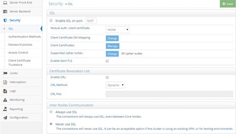

Figure 1: SSL Settings

## SSL Settings

SSL settings are applicable to clients connecting to the RadiantOne service via LDAPS and involve enabling SSL/TLS and Start TLS, indicating how mutual authentication should be handled, client certificate DN mapping (for enforcing authorization), managing the certificates in the default Java truststore (cacerts), which cipher suites are supported by RadiantOne, certificate revocation and inter nodes communications (relevant only for cluster deployments). These subjects are described in this section.

### Enable SSL

SSL/TLS is enabled by default (TLS v1.0, v1.1 and v1.2 are supported), and during the installation of RadiantOne a self-signed default certificate is generated. For steps on replacing the self-signed certificate, see [Replacing the Default Self-Signed Certificate](01-introduction#replacing-the-default-self-signed-certificate).

By default the SSL port is set to 636 and this is defined during the installation of RadiantOne.

>[!warning] You must restart the RadiantOne service after changing any SSL-related settings. RadiantOne loads the server certificate when it is started, so in order for the newly added certificate to take effect, restart the server.

### Forbidding Access on the Non-SSL Port

For steps to disable access on the non-ssl ports, please see the [RadiantOne Hardening Guide](/hardening-guide/00-preface).

### Certificate-based Authentication: Support for Mutual Authentication

A certificate is an electronic document that identifies an entity which can be an individual, a server, a company, or some other entity. The certificate also associates the entity with a public key.

For normal SSL communications, where the only requirement is that the client trusts the server, no additional configuration is necessary (if both entities trust each other). For mutual authentication, where there is a reciprocal trust relationship between the client and the server, the client must generate a certificate containing his identity and private key in his keystore. The client must also make a version of the certificate containing his identity and public key, which RadiantOne must store in its truststore. In turn, the client needs to trust the server; this is accomplished by importing the server's CA certificate into the client truststore.

>[!note] Certificate-based authentication (mutual authentication) requires the use of SSL or StartTLS for the communication between the client and RadiantOne.

The diagram below shows how certificates and the SSL protocol are used together for authentication.


Figure 2: Mutual Authentication

There are three options for mutual authentication and this can be set from the Main Control Panel > Settings Tab > Security section > SSL > Mutual Auth. Client Certificate drop-down menu: Required, Requested and None (default value). If mutual authentication is required, choose the Required option. If this option is selected, it forces a mutual authentication. If the client fails to provide a valid certificate which can be trusted by RadiantOne, authentication fails, and the TCP/IP connection is dropped.

If mutual authentication is not required, but you would like RadiantOne to request a certificate from the client, choose the Requested option. In this scenario, if the client provides a valid/trusted certificate, a mutual authentication connection is established. If the certificate presented is invalid, the authentication fails. If no certificate is presented, the connection continues (using a simple LDAP bind) but is not mutual authentication.

If you do not want RadiantOne to request a client certificate at all, check the None option.

If the client certificate is not signed by a known certificate authority, it must be added in the [RadiantOne client truststore](#client-certificate-trust-store-cluster-level-trust-store).

#### Requiring Certificate-based Authentication

If you want to require certificate-based authentication:

1. The client must trust the RadiantOne server certificate (import the RadiantOne public key certificate into the client truststore, unless the server certificate has been signed by a certificate authority known/trusted by the client).

2. The RadiantOne service must trust the client (import the client’s public key certificate into the [RadiantOne client truststore](#client-certificate-trust-store-cluster-level-trust-store), unless the client certificate is signed by a known/trusted certificate authority).

3. From the Main Control Panel > Settings Tab > Security section > SSL, make sure either SSL and/or StartTLS is enabled.

4. From the Main Control Panel > Settings Tab > Security section > SSL > Mutual Auth. Client Certificate drop-down menu, select Required.

5. From the Main Control Panel > Settings Tab > Security section > SSL, click **Change** next to [Client Certificate DN Mapping](#client-certificate-dn-mapping) and define your mappings.

>[!warning] The Client Certificate DN Mapping is only accessible by a member of the [Directory Administrator role/group](01-introduction#delegated-administration-of-radiantone).

6. Click **Save** and restart the RadiantOne service. If RadiantOne is deployed in a cluster, restart RadiantOne on all nodes.

### Client Certificate DN Mapping

To authorize a user who authenticates using a certificate (e.g. SASL External) you must set a client certificate DN mapping. This maps the user DN (Subject or Subject Alternate Name from the certificate) to a specific DN in the RadiantOne namespace. After, the DN in the RadiantOne namespace determines authorization (access controls). 

>[!note] To avoid problems with special characters, RadiantOne normalizes the certificate subject prior to applying the certificate DN mapping.

To set the client certificate DN mapping:

1. Go to the Main Control Panel > Settings Tab > Security Section > SSL sub-section.

2. Click **Change** next to the Client Certificate DN Mapping property.

>[!warning] The Client Certificate DN Mapping is only accessible by a member of the [Directory Administrator role/group](01-introduction#delegated-administration-of-radiantone).

There are different ways to determine the DN from the subject or subject alternative name in the certificate (using regular expression syntax).

Setting a specific subject or subject alternative name to DN in the virtual namespace:

`cn=lcallahan,dc=rli,dc=com (the user DN in the certificate) -> (maps to) cn= laura Callahan,cn=users,dc=mycompany,dc=com`

Specify a Base DN, scope of the search, and a search filter to search for the user based on the subject or subject alternative name received in the certificate:

`uid=(.+),dc=rli,dc=com -> dc=domain1,dc=com??sub?(sAMAccountName=$1)`

If RadiantOne received a certificate subject of uid=lcallahan,dc=rli,dc=com then it would look for the virtual entry based on:

`dc=domain1,dc=com??sub?(sAMAccountName=lcallahan)`

Then, authorization would be based on the user DN that is returned.

As another option, multiple variables can be used (not just 1 as described in the previous example). Let’s take a look at an example mapping that uses multiple variables:

`cn=(.+),dc=(.+),dc=(.+),dc=com -> (maps to) ou=$2,dc=$3,dc=com??sub?(&(uid=$1)(dc=$3))`

If RadiantOne received a subject from the certificate that looked like: cn=laura_callahan,dc=ny,dc=radiant,dc=com, the search that would be issued would look like:

`ou=ny,dc=radiant,dc=com??sub?(&(uid=laura_callahan)(dc=radiant))`

RadiantOne uses the DN returned in the search result to base authorization on. 

If the subject in the SSL certificate is blank, you can specify that a Subject Alternative Name (SAN) should be used. You can use an alternative name in the mapping by specifying {alt} before the regular expression. For example: {alt}^(.+)$ uses the first alternative name found. You can be more specific and specify which alternative name in the certificate that you want to match by specifying the type [0-8]. For example: {alt:0}^(.+)$ uses the otherName alternative name. The type number associated with each is shown below.

otherName                         [0]
<br>rfc822Name                       [1]
<br> dNSName                          [2]
<br> x400Address                      [3]
<br> directoryName                   [4]
<br> ediPartyName                    [5]
<br> uniformResourceIdentifier  [6]
<br> iPAddress                           [7]
<br> registeredID                        [8]

For example, {alt:0}^(.+)@my.gov$ defined as the Certificate DN captures "james.newt" for the certificate shown below.


 
Figure 3: Example SSL Certificate

If all mapping rules fail to locate a user, anonymous access is granted (if anonymous access is allowed to RadiantOne).

>[!note] As an alternative to anonymous access, it is generally recommended that you create a final mapping that results in associating the authenticated user with a default user that has minimum access rights. An example is shown below where the last mapping rule matches to a user identified in RadiantOne as “uid=default,ou=globalusers,cn=config”.


Figure 4: Example Default Mapping Rule

### Testing Certificate DN Mapping Rules

The test-cert-mapping command can be used to test the subject (or SAN) associated with a given certificate against the existing certificate to DN mappings. This allows you to verify your client principal mapping rules. For information about the test-cert-mapping command see, the [Radiantone Command Line Configuration Guide](/command-line-configuration-guide/01-introduction).

**Processing Multiple Mapping Rules**

Many Client Certificate DN Mapping rules can be configured. They are processed by RadiantOne in the order they appear.

The first DN mapping rule in the list is applied first. IF the user is found with the first mapping rule, then no other rules are evaluated. ONLY if the user is NOT found using the first DN mapping rule will the other rules be evaluated. If all mapping rules fail to locate a user, anonymous access is granted (if anonymous access is allowed to RadiantOne).

For example, let’s say two DN Mapping rules have been configured:

`dc=domain1,dc=com??sub?(sAMAccountName=$1)
uid=$1,ou=people,ou=ssl,dc=com`

The first DN Mapping rule will be evaluated like:

`dc=domain1,dc=com??sub?(sAMAccountName=laura_callahan)`

If Laura Callahan’s entry is found from the search, authorization is based on this user DN (and the groups this user is a member of). If the account is not found, then the second mapping rule is evaluated. If all mapping rules fail to locate a user in the virtual namespace, the user who authenticated with the certificate is considered anonymous.

Only when the first DN mapping rule fails to find a user will the other DN mapping rules be used.

Remember, changing any parameters related to SSL requires a restart of the RadiantOne service.

### Client Certificates (Default Java Truststore)

For RadiantOne to connect via SSL to an underlying data source, or accept client certificates for authentication, the appropriate client certificate needs imported (unless they are signed by a trusted/known Certificate Authority). For classic RadiantOne architectures (active/active or active/passive), these certificates can be imported into the default Java trust store (<RLI_HOME>\jdk\jre\lib\security\cacerts). 

>[!warning] If RadiantOne is deployed in a cluster, import the client certificates into the [cluster level truststore](#client-certificate-trust-store-cluster-level-trust-store) instead of the default one so they can be dynamically shared across all cluster nodes.

To manage the client certificates contained in the default Java trust store, click **Manage** next to the Client Certificates property.


Figure 5: Managing Client Certificates in the Default Java Truststore

**Viewing Client Certificates**

To view a certificate, select the certificate in the list and click **View Certificate**. Valuable information about the certificate is shown (who issued the certificate, who the certificate was issued to, when the certificate is set to expire, status…etc.). From this location, you have the option to copy the certificate to a file.

**Adding Client Certificates**

To add a certificate:

1. Click **Add Certificate**. 

2. Browse to the location of the client certificate file and click **OK**. 

3. Click **Add Certificate**. 

4. Enter a short, unique name (alias) for the certificate and click **OK**. 

5. Enter the Key Store Password and click **OK**. The default password is changeit.The added certificate appears in the list.

6. Click **Save** in the upper right corner.

7. Restart the RadiantOne service.

**Deleting Client Certificates**

To delete a certificate:

1. Select the desired certificate and click **Delete Certificate**.

2. Click **Yes** to confirm the deletion.

3. Click **Save** in the upper right corner.

4. Restart the RadiantOne service.

**Set Key Store Password**

To change the Key Store password (which by default is changeit):

1. Click **Set Password**.

2. Enter the old password, new password, and confirm the new password. Click **OK**.

3. Save **Save** in the upper right corner.

### Supported Cipher Suites

To view the cipher strength levels enabled by default in RadiantOne, go to the Main Control Panel > Settings Tab > Security section > SSL sub-section and click **Change** next to Supported Cipher Suites. The ciphers that are checked are enabled. To change the enabled ciphers, check/uncheck the desired values.

After changing the cipher levels, save your changes and restart the RadiantOne service.

For details on installing stronger cipher suites, see the [RadiantOne Hardening Guide](/hardening-guide/00-preface).

### Enabled SSL Protocols

The default SSL/TLS protocol options are SSLv2Hello, SSL v3, TLSv1, TLSv1.1 TLSv1.2 and TLS v1.3. Some of the less secure protocols in this list are disabled by default in the <RLI_HOME>/jdk/jre/lib/security/java.security file, noted in the jdk.tls.disabledAlgorithms property.

Out of the available protocols, not in the disabled list, you can limit which ones you want RadiantOne to support. You can limit the protocols from the Main Control Panel > Settings Tab > Security section > SSL sub-section. Click **Change** next to Enabled SSL Protocols. Select the protocols to support and click **OK**. Restart the RadiantOne service on all nodes.

If you want to support one of the less secure protocols, edit the java.security file and remove the protocol from the jdk.tls.disabledAlgorithms value. Then, make sure it is enabled in RadiantOne. Restart RadiantOne on all nodes. If a protocol is enabled in RadiantOne, but in the list of disabled algorithms in the java.security file, it will not be supported at runtime for SSL communication.

>[!note] Only enable the SSL protocols that comply with your company’s security policy.

### Enable STARTTLS

Start TLS allows clients to request a secure channel to RadiantOne at any time without having to establish a new connection on a different port. For example, a client can process an LDAP search operation on a normal connection and then, without closing the connection, request a secure layer over the same connection with StartTLS for the use of changing passwords or viewing encrypted attributes. After finishing the use of the secure channel, the client can switch back to the non-secure channel on the same connection. The flexibility offered by the Start TLS extension allows for the secure LDAPS channel to be turned on and off on demand.

To enable Start TLS for clients to access RadiantOne:

1. Go to the Main Control Panel > Settings Tab > Security section > SSL sub-section.

2. Check the Enable SSL option and then check the Enable Start TLS option. 

3. Save the changes. 

4. Restart the RadiantOne service.

>[!warning] When using Start TLS, the default server certificate included with the RadiantOne installation does not work. You must generate a new certificate (either self-signed or requested from a Certificate Authority) that contains the proper machine and domain name of the RadiantOne machine. Also, the host name specified from the client should match the value in the certificate. If you try to use the default self-signed certificate included with the RadiantOne installation, the following error message (‘xxxxx’ being your server name) is returned: javax.net.ssl.SSLPeerUnverifiedException: hostname of the server 'xxxxx' does not match the hostname in the server's certificate.

### Debug SSL

SSL is enabled by default, but SSL logging is disabled by default. When SSL logging is enabled, SSL events have an entry in vds_server.log. This log file is located in <RLI_HOME>\vds_server\logs. SSL events are logged at INFO level, so log settings for VDS – Server must be at least at INFO level. 

>[!note] For more information on log levels, refer to the [RadiantOne Logging and Troubleshooting Guide](/logging-and-troubleshooting-guide/01-overview).

To enable SSL logging:

1. From the Main Control Panel, click Settings > Logs > Log Settings.

2. From the Log Settings to Configure drop-down menu, select VDS – Server. 

3. Verify that the Log Level drop-down menu is set to one of the following: INFO, DEBUG, or TRACE. 

4. If you change the log level, click **Save**. 

5. Click **Security -> SSL**.

6. In the SSL section, check the Debug SSL box. 

7. Click **Save**.

8. On the Main Control Panel’s Dashboard tab, restart the RadiantOne service. 

### Certificate Revocation List

A Certificate Revocation List (CRL) is a list identifying revoked certificates, signed by a Certificate Authority (CA) and made available to the public. The CRL has a limited validity period, and updated versions of the CRL are published by the CA when the previous CRL’s validity period expires. 

RadiantOne supports CRL checking and relies on the underlying Java security libraries (JSSE) to handle this logic during the SSL/TLS handshake process before the LDAP bind is received by the server. Both CRLDP and OCSP are supported. For CRLDP (CRL Distribution Point), there are URIs specified by the certificate's "CRL Distribution Points", by which the servers hosting CRL can be reached. For OCSP (Online Certificate Status Protocol), the URIs are specified in the certificate in the extended attribute “authorityInfoAccess”, by which the servers enforcing CRL checking can be reached. More details about OCSP can be found in [RFC 2560](https://datatracker.ietf.org/doc/html/rfc2560).

#### Enable CRL

If clients are connecting to RadiantOne with certificates (establishing mutual authentication) and the client certificate should be validated to ensure it has not been revoked prior to accepting it, the Enable CRL parameter needs checked. From the Main Control Panel go to the Settings tab > Security > SSL. Then, on the right side, check the Enable CRL option.

#### CRL Methods

There are three different supported CRL checking methods; dynamic, static and failover. These methods are described below. 

>[!note] The tradeoff between a static CRL file and a dynamic CRL checking would be that a dynamic CRL would be more robust and correct but the size of the CRL file may impact the performance of the revocation checking logic.

### Dynamic

CRLDP and OCSP are used to determine certificate validity and revocation status. OCSP is checked first. If OCSP returns the certificate's status as unknown, then the CRLDP is used.

### Failover

CRLDP and OCSP are used to determine certificate validity and revocation status (OCSP is checked first). If the checking fails to get the CRL from CRLDP and using OCSP, then it attempts to check the certificate’s status against the static CRL file(s) specified in the [CRL file/directory parameter](#crl-filedirectory). The CRL file(s) are loaded only once when the RadiantOne service starts.

### Static

The certificate is validated against a preloaded local CRL file (this can be many files zipped together or could be a file system directory where all CRL files are located). The certificate authority’s CRL file must be downloaded and the location of the file must be specified in the [CRL file/directory parameter](#crl-filedirectory). The CRL file(s) are loaded only once when the RadiantOne service starts.

To select the CRL method, from the Main Control Panel got to the Settings tab > Security > SSL. Then, on the right side, once the Enable CRL option is checked, the CRL Method drop-down list is available. Select the desired method from this list. Click **Save** to apply your changes to the server.

#### CRL File/Directory

If the static (or failover) CRL checking mechanism has been selected, the value of the Server Certificate Revocation List File parameter should point to the CRL file downloaded from the certificate authority. This can be a file containing multiple CRL files if needed. Client certificates can be validated against this list. 

The Server Certificate Revocation List File parameter is configurable from the [Server Control Panel](01-introduction#accessing-the-server-control-panel) > Settings tab. If you are deployed in a cluster, each node must have the CRL file on their host machine and the location can vary. Therefore, you must go into the Server Control Panel associated with each node and set the location of the CRL file. 

### Inter Nodes Communication

Within a cluster, nodes must be able to communicate with each other. This is required for block replication (replicating data across RadiantOne Universal Directory stores) which uses the Admin HTTP Service [HTTP/HTTPS](03-front-end-settings#admin-http-service) and redirecting write operations to the leader node which uses [LDAP/LDAPS](03-front-end-settings#ldap-port). If the communication across the cluster nodes should use SSL, choose the Always use SSL option. If your cluster nodes are running in a secured environment (and in general they should be), you can choose to never use SSL. Forcing the use of SSL will slow down the communication speed between nodes.

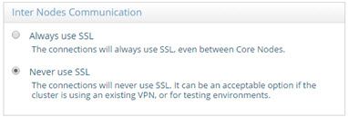

Figure 6: Inter Nodes Communication

## Authentication Methods

>[!note] This section is accessible only in [Expert Mode](01-introduction#expert-mode).

### Kerberos

RadiantOne supports Kerberos v5, and can act as both a [Kerberos client](#kerberos), and a Kerberized service. As a Kerberos client, RadiantOne can request tickets from a KDC to use to connect to kerberized services. As a Kerberized service, RadiantOne can accept tickets from clients as a form of authentication. These configurations have been certified with Windows 2000, 2003 and 2008 in addition to MIT Kerberos on Linux CENTOS. This section describes RadiantOne support as a Kerberized server. For details on RadiantOne support as a Kerberos client, please see the section on defining [LDAP data sources](04-backend-settings#ldap-data-sources). The following diagram provides the high-level architecture and process flow for RadiantOne acting as a Kerberized service.

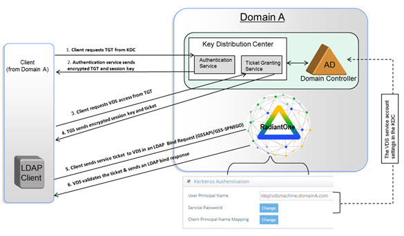
 
Figure 7: RadiantOne as a Kerberized Service

Kerberos can be used for authentication to RadiantOne (acting as a Kerberized Service) as long as the client resides within the same domain or trusted domain forest as the RadiantOne service (and the RadiantOne machine must be in the same Kerberos realm/domain, or at least within the same forest as Active Directory). For authentication amongst un-trusted/different domains, the NTLM protocol is triggered instead. For details on configuring cross-domain authentication for RadiantOne, please see the section on [NTLM](#ntlm). To continue with configuring Kerberos for access to RadiantOne in Microsoft domains, follow the steps below. For details on MIT Kerberos support, see [Support for MIT Kerberos](#support-for-mit-kerberos).

>[!note] All machines (client, domain controller…etc.) must be in sync in terms of clock (time/date settings). Also, if you have deployed RadiantOne in a cluster, the service account created in the KDC can use the server name of the load balancer that is configured in front of the RadiantOne cluster nodes. <br> To use a generic or common account for multiple RadiantOne cluster nodes, you need to set the SPN on the account matching the FQDN of the host that requests the kerberos ticket. There is no need to create individual accounts for each RadiantOne node/host. Refer to the account using the UPN in the RadiantOne configuration. <br> The account can have multiple SPNs. An example is shown below.<br>
sAMAccountName: svc-vdsadmin
<br>UPN: ldap/vds.example.net@example.net
<br>SPN: ldap/host1.example.net
<br>ldap/vds.example.net
<br>ldap/host2.example.net
<br>ldap/host3.example.net

#### Configuring RadiantOne as a Kerberized Service

>[!warning] RadiantOne MUST be running on port 389. The default port for RadiantOne is 2389. To change the port, you must stop the RadiantOne service, and then edit the port from the Main Control Panel > Settings Tab > Administration section. After changing the port and saving your changes, restart the RadiantOne service. If RadiantOne is deployed in a cluster, all the service on all nodes.

1. Create a Kerberos identification for the RadiantOne service by creating a user account in the Active Directory domain controller (KDC) for the host computer on which RadiantOne runs. When creating the account, you can use the name of the computer. For example, if the host is named AMAZONA-EQ3PKP4.cloudcfs.radiant.com, create a user in Active Directory with a user logon name of AMAZONA-EQ3PKP4.cloudcfs.radiant.com.

    >[!note] If you have deployed RadiantOne in a cluster behind a load balancer (the clients access the load balancer), the KDC service account in Active Directory should use the server name of the load balancer. The UPN of the account should represent the load balancer machine and the SPN attribute should list the FQDN of each RadiantOne node in the cluster (as separate values of the SPN attribute). There is no need to create individual accounts for each RadiantOne host because the KDC account can have multiple SPNs. Each SPN will be associated with a RadiantOne node (and local traffic manager(s) if multiple layers of traffic managers are used). An example of a KDC account is described below <BR> sAMAccountName: svc-vdsadmin

    >**UPN: ldap/vds.example.net@example.net**

    >**SPN: ldap/vds.example.net@example.net
          <br>ldap/host1.example.net
          <br>ldap/vds.example.net
          <br>ldap/host2.example.net
          <br>ldap/host3.example.net**

    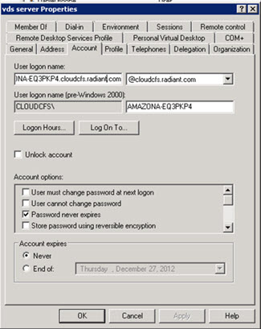

    Figure 8: Sample Active Directory Account for RadiantOne on the KDC

2. Create a User Mapping and Keytab file using KTPASS. 

    If you do not have the ktpass utility (part of the Windows Resource Kit Tools), you can download it from Microsoft’s website.

    Below is a sample command to be run on the KDC machine:

    `ktpass –princ ldap/AMAZONA-EQ3PKP4.cloudcfs.radiant.com@CLOUDCFS.RADIANT.COM -pass` 
    <br> `password -mapuser “vds server” -out c:\temp\amazona-eq3pkp4.LDAP.keytab `

    <br> `------result of executing the command------`
    <br> `Targeting domain controller: AMAZONA-CMF8EDC.cloudcfs.radiant.com`
    <br> `Successfully mapped AMAZONA-EQ3PKP4.cloudcfs.radiant.com to AMAZONA-EQ3PKP4.`
    <br> `Password successfully set!`
    <br> `WARNING: pType and account type do not match. This might cause problems.`
    <br> `Key created.`
    <br> `Output keytab to c:\temp\amazona-eq3pkp4.LDAP.keytab:`
    <br> `Keytab version: 0x502`
    <br> `keysize 97 ldap/amazona-eq3pkp4.radiant.com@CLOUDCFS.RADIANT.COM ptype 0` 
    <br> `(KRB5_NT_UNKNOWN) vno 3 etype 0x17 (RC4-HMAC) keylength 16` 
    <br> `(0xf70be0d13c22ee9e2bc249af6874019e)`

    -	Amazona-eq3pkp4.cloudcfs.radiant.com is the fully qualified domain name for the machine running RadiantOne.
    -	CLOUDCFS.RADIANT.COM is the realm and must be in upper case in the ktpass command.
    -	password is the password for the user account created in Step 1. 
    -	The keytab file will be in c:/temp and be named amazon-eq3pkp4.LDAP.keytab.

    After executing the ktpass command, if you go into the Active Directory account created in [Step 1](#configuring-radiantone-as-a-kerberized-service), you will see that the user login name value has been changed to ldap/amazona-eq3pkp4.cloudcfs.radiant.com.

    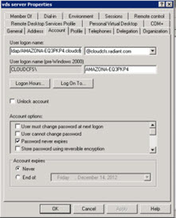

    Figure 9: Example User Account on the KDC after using the ktpass Utility

3.	Go to the Main Control Panel > Settings Tab > Security section > Authentication Methods sub-section and check the box to enable Kerberos Authentication. Click **Save**.

4.	The userPrincipalName and password associated with the service account created in Active Directory (KDC) in the [first step](#configuring-radiantone-as-a-kerberized-service) can be entered in the Main Control Panel > Settings Tab > Security section > Authentication Methods sub-section > Kerberos Authentication section. RadiantOne uses this information to authenticate to the KDC when it starts if there is no keytab file present. If there is a keytab file present (and RadiantOne is configured to use it), and the keytab file contains the “principal” keyword with a value of the user principal name for the RadiantOne service account in the KDC, it is used to get the secret key/password to use for authenticating to the KDC instead of the settings configured in the Control Panel. If the keytab file does not contain the “principal” defined in it, you must set the user principal name in the Kerberos Authentication section, but you do not need to configure the password.

5. Copy the keytab file created when running the ktpass utility to the RadiantOne machine (anywhere on the machine is fine) and configure the needed parameters described below. This step is optional. If there is no keytab file present, RadiantOne uses the service principal and password that are defined on the Main Control Panel > Settings Tab > Security Section > Authentication Methods sub-section > Kerberos Authentication to authenticate to the KDC. 

    If you choose to copy the keytab file to the RadiantOne machine, edit the <RLI_HOME>/<instance_name>/conf/krb5/vds_krb5login.conf file. To enable RadiantOne to participate in SSO with clients via Kerberos tokens, a JAAS login file is needed to tell where and how the RadiantOne service is authenticated. The JAAS login file (vds_ krb5login.conf) is provided with RadiantOne. The default content of this file is as follows:

    `vds_server {`
    <br> `com.sun.security.auth.module.Krb5LoginModule required`
    <br> `storeKey=true;`
    <br> `};`

    If RadiantOne should use the keytab file, add the following parameters to the vds_krb5login.conf file:

    `useKeyTab=true`
    <br> `keyTab= "c:/radiantone/amazona-eq3pkp4.LDAP.keytab”`

    **useKeyTab** – set this to true if you want the server to get the principal’s key from the keytab. The default value (if this parameter is not set in the file) is False. As mentioned above, if there is no keytab specified, RadiantOne uses the service name and password defined on the Main Control Panel > Settings Tab > Security Section > Authentication Methods sub-section > Kerberos Authentication section on the right side, to authenticate to the KDC when the RadiantOne service first starts.

    **principal** – set this to the user principal name of the account in the KDC associated with the RadiantOne service. If this property is not defined in the keytab file, it must be set in the Main Control Panel > Settings Tab > Security section > Authentication Methods sub-section > Kerberos Authentication section.

    **keyTab** – set this to the full path and file name of the keytab to get the principal’s secret key. Surround the value with double quotes and the word keyTab is case-sensitive (it should appear in the vds_krb5login.conf file in this exact case).

    For information on other optional configuration parameters, please refer to the Krb5LoginModule class in the Java Authentication and Authorization Service (JAAS) documentation.

6. Edit the RadiantOne Kerberos configuration file to include the realm and KDC. The Kerberos configuration file is named vds_server_krb5.conf and is in <RLI_HOME>/vds_server/conf/krb5.

    Edit this file and set the appropriate values in the [libdefaults] and [realms] sections. Below is an example that matches the use case we have been using in this section.

    `[libdefaults]`
    <br> `default_realm = CLOUDCFS.RADIANT.COM`
    <br> `[realms]`
    <br> `CLOUDCFS.RADIANT.COM = {`
    <br> `kdc = 10.11.12.205:88`
    <br> `default_domain = CLOUDCFS.RADIANT.COM`
    <br> `}`

7.	Verify the RadiantOne rootdse responds with the appropriate Supported SASL Mechanisms by using a client (e.g. LDAP Browser) to query RadiantOne with a “blank/empty” base DN. The following should be returned.

    `supportedSASLMechanisms: GSSAPI`
    <br> `supportedSASLMechanisms: GSS-SPNEGO`

8. Configure Client Principal Name Mapping. This step is optional and can be used to define a mapping between the user who authenticates with a Kerberos ticket and a user DN in the virtual namespace. The DN is required for the RadiantOne service to enforce access permissions (authorization). If no client principal name mappings are configured, RadiantOne creates an account in a local Universal Directory store that is linked to the person who authenticated using a Kerberos ticket.

    There are three different ways to determine the DN from the user ID in the Kerberos ticket received in the LDAP bind (using regular expression syntax). Each is described below.

-	Setting a specific User ID to DN. In this example, if lcallahan were received in the authentication request, RadiantOne would base the authorization on the DN: cn=laura Callahan,cn=users,dc=mycompany,dc=com

`lcallahan (the user ID) 🡪 (maps to) cn= laura Callahan,cn=users,dc=mycompany,dc=com`

-	Specify a DN Suffix, replacing the $1 value with the User ID.

`(.+) -> uid=$1,ou=people,ou=ssl,dc=com`

`(.+) represents the value coming in to RadiantOne from the Kerberos ticket. If RadiantOne received a User ID of lcallahan, then the DN used for authorization is: uid=lcallahan,ou=people,ou=ssl,dc=com.`

-	Specify a Base DN, scope of the search, and a search filter to search for the user based on the User ID received in the bind request.

`(.+) -> dc=domain1,dc=com??sub?(sAMAccountName=$1)`

If RadiantOne received a User ID of lcallahan from the Kerberos ticket, it would issue a search like:

`dc=domain1,dc=com??sub?(sAMAccountName=lcallahan)`

The user DN returned from the search is used by RadiantOne to identify the user entry in the virtual namespace and to base authorization decisions on.

For the second and third options described above, multiple variables can be used (not just 1 as described in the examples). Let’s look at an example mapping that uses multiple variables:

`(.+)@(.+).(.+).com -> ou=$2,dc=$3,dc=com??sub?(&(uid=$1)(dc=$3))`

If RadiantOne received a user ID like laura_callahan@ny.radiant.com, the search that would be issued would look like:

`ou=ny,dc=radiant,dc=com??sub?(&(uid=laura_callahan)(dc=radiant))`

For more details, please see [Processing Multiple Mapping Rules](03-front-end-settings#processing-multiple-mapping-rules).

The user DN returned from the search is used by RadiantOne to identify the user entry in the RadiantOne namespace and to base authorization decisions on. For more information, please see [Authorization of Kerberos Users](#authorization-of-kerberos-users).

Changing any Kerberos-related parameters requires a restart of the RadiantOne service. Save your changes prior to restarting the service. 

#### Accessing RadiantOne as a Kerberized Service from a Kerberos Client

The Kerberos client (user or machine) must also have an account on the KDC machine.

>[!warning]
>RadiantOne must be running on a different machine than the client that is connecting to it, otherwise the Microsoft libraries for LDAP use the local security and not a Kerberos ticket. This is only relevant for LDAP clients that use the Microsoft libraries (LDP and Softerra LDAP Administrator v3.3 for example).

The following example configurations describe:

-	Using JXplorer as the LDAP client connecting to RadiantOne as a Kerberized service.

-	Using LDP as the LDAP client connecting to RadiantOne as a Kerberized service.

-	Using Softerra LDAP Administrator v3.3 connecting to RadiantOne as a Kerberized service.

**Example 1 – Using JXplorer Client**

The Kerberos client user account logs into their machine and they must first make sure that JXplorer is configured to use Kerberos.

Edit the jxplorer.bat file (to pass a Java parameter specifying where to find the Kerberos configuration file) and then start JXplorer using this bat file. Below is an example of the file content. The Kerberos filename in this example is Kerberos.conf:

`--------------------------------jxplorer.bat---------------------------------------------`
<br> `rem # Use this version if limited by 256 character max batch file length (earlier windows versions)`
<br> `rem # java -Djava.ext.dirs=jars;dsml/jars com.ca.directory.jxplorer.JXplorer`

<br> `rem # This version is slightly preferable, as it doesn't override the standard java extensions directory`
<br> `rem # (note that 'classes' is only used if you are compiling the code yourself; otherwise jars/jxplorer.jar is used.)`
<br> `java -
Djava.security.krb5.conf=kerberos.conf -classpath .;jars/jxplorer.jar;jars/help.jar;jars/jhall.jar;jars/junit.jar;jars/ldapsec.jar;jars/log4j.jar;jars/dsml/activation.jar;jars/dsml/commons-logging.jar;jars/dsml/dom4j.jar;jars/dsml/dsmlv2.jar;jars/dsml/mail.jar;jars/dsml/saaf-api.jar;jars/dsml/saaj-ri.jar com.ca.directory.jxplorer.JXplorer`
<br> `--------------------------------------------------------------------------------------------------------`


Below is an example of the Kerberos configuration file that JXplorer references:

`--------------------------------kerberos.conf-----------------------------------------------------`
<br> `[libdefaults]`
<br> `  default_realm = CLOUDCFS.RADIANT.COM   `

<br> `[realms]`
<br> `	CLOUDCFS.RADIANT.COM = {`
<br> `		kdc = 10.11.12.205:88`
<br> `		default_domain = CLOUDCFS.RADIANT.COM`
<br> `	}`
<br> `------------------------------------------------------------------------------------------------------`

After you run JXplorer, click on connect and enter the parameters to connect to RadiantOne. In the Security section, choose the GSSAPI option.


Figure 10: JXplorer Authenticating to RadiantOne using Kerberos

After the Kerberos client user successfully authenticates via Kerberos, authorization will be determined based on the access rights configured in RadiantOne. For more information, please see the section titled, [Authorization of Kerberos Users](#authorization-of-kerberos-users).

Example 2 – Using LDP Client
<br>Run ldp and create a new connection. Enter the values for RadiantOne and click **OK**.


Figure 11: Connection to RadiantOne from LDP Client

Click **Advanced**, you should have the NEGOTIATE (or in older LDP versions, use the SSPI method) selected. See Figure below.

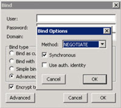

Figure 12: LDP Bind Options

You do not need to enter a user password. Just click OK. See below as an example.

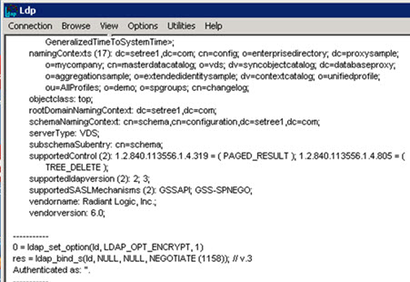

Figure 13: LDP after Authenticating to RadiantOne via Kerberos

After the Kerberos client user successfully authenticates via Kerberos, authorization is determined based on the access rights configured in RadiantOne. For more information, please see the section titled, [Authorization of Kerberos Users](#authorization-of-kerberos-users).

**Example 3 – Using Softerra LDAP Administrator Client**

The following describes the connection parameters from Softerra LDAP Administrator v2012.2.

1. Create a new profile specifying the RadiantOne connection criteria. Be sure to use the fully qualified name for RadiantOne machine.

    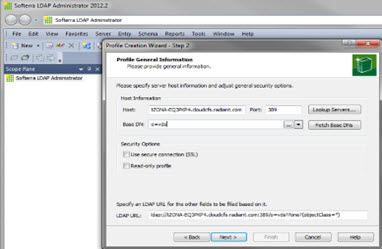

    Figure 14: Sample Connection to RadiantOne from Softerra

2. Click **Next**.

3. You can choose the option currently logged on user (for Active Directory only) or select the GSS Negotiate mechanism and specify the username you want to use to connect and click Finish. See the screen shots below as an example.

    

    Figure 15: Use User Currently Logged into the Machine Option

    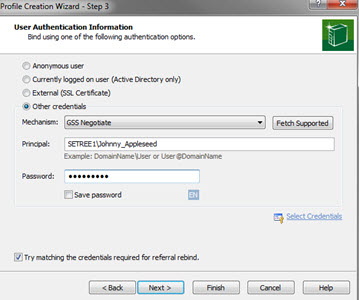

    Figure 16: Specifying Alternate Credentials

4. Click **Finish**. At the bottom of the LDAP Administrator console you will be able to see whom you are connected as (johnny_appleseed@setree1.com is the example shown below). 


Figure 15: Softerra LDAP Administrator Interface

After the Kerberos client user successfully authenticates via Kerberos, authorization will be determined based on the access rights configured in RadiantOne. For more information, please see the section titled, [Authorization of Kerberos Users](06-security#authorization-of-kerberos-users).
 
#### Support for MIT Kerberos

The following steps were certified on Linux CENTOS to configure RadiantOne as a Kerberized service.

1. To manage the Kerberos database locally, launch

    `kadmin.local`

2. Add the RadiantOne service to Kerberos database with the following:

    `add_principal ldap/vds.novato.radiantlogic.com@EXAMPLE.COM`

3. Ensure FQDN of service can be resolved via DNS using ping or other methods.

4. Ensure unlimited Java cipher suites are installed. This is to be compatible with certain clients using stronger cyphers. Note that Kerberos can be enabled in RadiantOne without installing the extra ciphers, but most clients using kerberos require these ciphers that RadiantOne does not bundle out of the box. For details on installing unlimited cipher suites, see the [RadiantOne Hardening Guide](/hardening-guide/00-preface).

5. From the Main Control Panel > Settings Tab > Security section > Authentication Methods enable Kerberos Authentication and enter the user principal name and service password associated with the RadiantOne service account that was created in the KDC.

6. Click **CHANGE** next to Client Principal Name Mapping and define the mapping to be used for authorization.

7. Restart the RadiantOne service.


Figure 16: Enabling RadiantOne as a Kerberized Service

#### Authorization of Kerberos Users

After a client successfully authenticates with a Kerberos ticket, RadiantOne tries to link the user to a DN based on any Client Principal Name Mappings that you have set up. If no Client Principal Name Mappings are defined or if no mapping results are found for a particular user, RadiantOne translates the user principal name and realm into a DN and stores that user in the local LDAP store below a suffix of ou=krbusers,cn=config. The user DN consists of the principal name and the realm (from which they came from). An example would be:

`uid=lcallahan,cn=NOVATO.RADIANTLOGIC.COM,ou=krbusers,cn=config`

In the example above, all users who authenticate from the NOVATO.RADIANTLOGIC.COM realm are located here. Each realm has its own location in the local LDAP store. Below is an example from a different realm:

`uid=sbuchanan,cn=NA.RADIANTLOGIC.COM,ou=krbusers,cn=config`

Once the user is stored locally (or linked to an existing DN), they can be added to groups and included in access control lists. This allows users who authenticate using Kerberos access to protected information in the RadiantOne namespace. See below for the location in the directory tree for the authenticated users (This location is for users that could not be linked using Client Principal Name Mappings).


Figure 17: Location of Users who Successfully Authenticate using Kerberos

### NTLM

SASL binding via GSSAPI/GSS-SPNEGO will attempt to use Kerberos by default. You have the option to use NTLM in conjunction with Kerberos, or not at all (based on your company security policy). If used in conjunction with Kerberos, it applies as a backup protocol to be used if there is a problem with Kerberos authentication. If enabled, the NTLM protocol is used if one of the systems involved in authentication cannot use Kerberos authentication, is configured improperly, or if the client application does not provide sufficient information to use Kerberos. If NTLM is not enabled, and there is a problem with the Kerberos authentication, the bind (using GSSAPI/GSS-SPNEGO) to RadiantOne fails. Also, by using NTLM, RadiantOne is able to support cross-domain authentication. This means, that a user that is not logged into the same domain that RadiantOne is a member of (or a domain that is trusted by the RadiantOne domain) can still access RadiantOne and benefit from NTLM for authentication. RadiantOne supports NTLM v2.

Like all challenge-response protocols, the password is not sent over the protocol but the challenge instead. Since NTLM relies on the domain controller to authenticate its users, RadiantOne needs to know on which domain controller the challenge is generated before sending the challenge back to the user. This information can typically be retrieved from user’s request. If the domain information is not passed, RadiantOne takes the default one to generate the challenge. The first domain listed in the NT Domain parameter is the default one. The diagram below depicts the architecture and process flows.

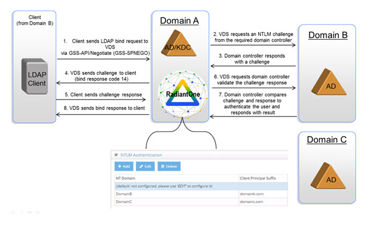

Figure 18: RadiantOne Support for NTLM Authentication

In the figure above, since the client is accessing RadiantOne from domain B and VDS has been “kerberized” in domain A (and domain A and B do not trust each other), Kerberos cannot be used for authentication. However, NTLM can. The NTLM authentication flow is as follows:

1. Client binds to RadiantOne - The client sends an LDAP bind request to RadiantOne via GSSAPI/GSS-SPNEGO along with an NTLM Type 1 Message {e.g. NT_Domain=‘DOMAINB' Workstation='W-RLI06-MACHINE1' }

2. RadiantOne requests an NTLM challenge message. RadiantOne requests an NTLM challenge from the required domain controller. RadiantOne knows which domain controller to send the request to because of the NT_Domain property that came in the bind request. If the NT_Domain property is not passed, RadiantOne uses the first one configured in the NT Domain property list.

3. Domain controller responds with a challenge. The domain controller generates a challenge, and sends it to RadiantOne.

4. RadiantOne sends the challenge message to client. The challenge message includes an LDAP bind response code 14 (SASL_BIND_IN_PROGRESS). This indicates the server requires the client to send a new bind request, with the same SASL mechanism, to continue the authentication process. 

5. Client sends response message. The client then issues a new bind request via GSS-SPNEGO along with an NTLM Type 3 Message {e.g. Username='test5' NT_Domain=‘DOMAINB' }.

6. RadiantOne requests domain controller validate the challenge and response. RadiantOne sends the username, the original challenge, and the response from the client computer to the domain controller. 

7. Domain controller compares challenge and response to authenticate user. The domain controller obtains the password hash for the user, and then uses this hash to encrypt the original challenge. Next, the domain controller compares the encrypted challenge with the response from the client computer. If they match, the domain controller sends RadiantOne confirmation that the user is authenticated. Otherwise, user is not authenticated.

8. RadiantOne sends bind response to the client. Assuming valid credentials, RadiantOne grants the client access.

To enable NTLM:

1. Go to the Main Control Panel > Settings Tab > Security section > Authentication Methods sub-section.

2. Check the NTLM Authentication option.

3. Each domain that should be supported needs to be configured in this list. The default domain is empty by default and must be configured. Therefore, select the default domain in the list and click **EDIT**.

4. Enter the NT Domain, client principal suffix, Domain Controller IP Address, Domain Controller Host BIOS Name, RadiantOne Computer Account (in the domain), RadiantOne Computer Account Password, IP Range, and configure a client principal name mapping if applicable. An example of NTLM settings is shown below.


Figure 19: NTLM Domain Controller Configuration

More details about the NT Domain Controller settings can be found below. After you have configured the default domain, click **ADD** to add any additional domains that are required.

>[!note]
>Changing any of these parameters requires a restart of the RadiantOne service. If RadiantOne is deployed in a cluster, restart the service on all nodes.

**NT Domain**

A unique domain name that a client may belong to (connecting to RadiantOne from). If the client is not connecting to RadiantOne from the same domain (or a trusted domain), then their domain must be configured otherwise they cannot connect to RadiantOne.

**Client Principal Suffix**

The “Kerberos style” realm that corresponds to the above NT domain. 

**DC IP Address**

Enter the IP address of the domain controller you configured in the NT Domain property.

**DC Host BIOS Name**

Enter the host name (NETBIOS name) of the machine hosting the NT Domain.

**Computer Account**

RadiantOne must have a service account (defined as a computer account) in the NT Domain. If the RadiantOne host machine joined an Active Directory (AD) domain, the domain controller should have already generated a Computer account for your host. It is under the node "CN=Computer, DC=`<domain>`" in AD. However, RadiantOne does not require a physical Computer account to run NTLMv2. It can be a service account but it must be defined under the "CN=Computers" container. To create a service/computer account in your NT Domain, from the Active Directory Users and Computers interface, right-click on the "CN=Computers" node. Choose 'New' and then click on 'Computer'. Follow the wizard to create a service computer account. 

The Computer Account value you enter in the Main Control Panel must be in format of: `<computer_name>$@<domain>`
e.g. `NTLMv2$@testad.com` 

**Computer Account Password**

The password for the RadiantOne service/computer account in the NT Domain should be entered here. Assigning or resetting the password for a computer account can be done with ADSIEdit. From the Active Directory domain controller machine, launch ADSIEdit (run adsiedit.msc). Browse to the Computer account, right click on it, and choose "Reset Password". The password can be entered here. Also update this password for the computer account password property in the Main Control Panel.

**IP Range**

This list defines the IP Addresses for the clients that are authenticated to this configured domain controller. IP Range is required for all configured domains except the default one.

If the client can send the Domain information to RadiantOne in the Type 1 message, RadiantOne would be able to choose which domain controller to generate the corresponding challenge, which is embedded in the Type 2 message sent back to client. If the client is not able to indicate the Domain in the Type 1 message, RadiantOne references the IP ranges configured and determine the relevant domain. If based on the configured IP ranges (across all configured domains), RadiantOne cannot determine which domain to use, it uses the default one.

**Client Principal Name Mapping**

After authentication via NTLM, authorization (access permissions) must be determined. Client Principal Name Mapping can be used to set up a mapping between the user who authenticates using NTLM and a user DN. The DN is required to set access permissions and for RadiantOne to enforce authorization. If no client principal name mappings are configured (or the ones configured fail to link the username to a valid DN in the virtual tree), then RadiantOne allows [anonymous access](access-control#allow-anonymous-access) (you must make sure anonymous access is allowed). To configure the mapping, click **Change** next to the Client Principal Name Mapping parameter.

There are three different ways to determine the DN from the user ID received in the LDAP bind (using regular expression syntax). Each is described below.

-	Setting a specific User ID to DN. In this example, if lcallahan were received in the authentication request, RadiantOne would base the authorization on the DN: cn=laura Callahan,cn=users,dc=mycompany,dc=com

`lcallahan (the user ID) -> (maps to) cn= laura Callahan,cn=users,dc=mycompany,dc=com`

- Specify a DN Suffix, replacing the $1 value with the User ID.

`(.+) -> uid=$1,ou=people,ou=ssl,dc=com`

`(.+) represents the value coming into RadiantOne from the bind operation. If RadiantOne received a User ID of lcallahan, then the DN it bases authorization on is: uid=lcallahan,ou=people,ou=ssl,dc=com.`

-	Specify a Base DN, scope of the search, and a search filter to search for the user based on the User ID received in the bind request.

`(.+) -> dc=domain1,dc=com??sub?(sAMAccountName=$1)`

If RadiantOne received a User ID of lcallahan from the bind request, it would issue a search like:

`dc=domain1,dc=com??sub?(sAMAccountName=lcallahan)`

The user DN returned from the search is used by RadiantOne to identify the user entry in the RadiantOne namespace and to base authorization decisions on.

For options 2 and 3 described above, multiple variables can be used (not just 1 as described in the examples). Let’s take a look at an example mapping that uses multiple variables:

`(.+)@(.+).(.+).com -> ou=$2,dc=$3,dc=com??sub?(&(uid=$1)(dc=$3))`

If RadiantOne received a user ID like laura_callahan@ny.radiant.com, the search that would be issued would look like:

`ou=ny,dc=radiant,dc=com??sub?(&(uid=laura_callahan)(dc=radiant))`

The user DN returned from the search is used by RadiantOne to identity the user entry in the virtual namespace and to base authorization decisions on.

For more details, please see [Processing Multiple Mapping Rules](interception#processing-multiple-mapping-rules).

Changing any NTLM-related parameters requires a restart of RadiantOne. Click **Save** prior to restarting. If deployed in a cluster, restart the service on all nodes.

### MD5

If desired, an LDAP client can send RadiantOne a hashed password using Digest MD5 for authentication. RadiantOne must have access to the password in clear. When the password is received, RadiantOne uses the Digest MD5 hashing algorithm to encrypt it and compare to the value received from the client. If the compare succeeds, the bind was successful. Otherwise, the bind fails.

To enable MD5 authentication, check the MD5 Authentication box from the Main Control Panel > Settings Tab > Security section > Authentication Methods sub-section.

Changing any MD5-related settings requires a restart of the RadiantOne service after saving the new settings.

**Server Fully Qualified Name**

Enter the Server fully qualified name for the machine running RadiantOne (<machine_name>.<domain_name>).

**Client User Name Mapping**

After authentication via MD5, authorization (access permissions) must be determined. Client User Name Mapping can be used to set up a mapping between the user who authenticates using MD5 and a user DN in the virtual namespace. The DN is required to set access permissions and for RadiantOne to enforce authorization. If no client user name mappings are configured (or the ones configured fail to link the user name to a valid DN in the virtual tree), then RadiantOne allows [anonymous access](access-control#allow-anonymous-access) (you must make sure anonymous access is allowed). To configure the mapping, click **Change** next to the Client User Name Mapping parameter.

There are three different ways to determine the DN from the user ID received in the LDAP bind (using regular expression syntax). Each is described below.

- Setting a specific User ID to DN. In this example, if lcallahan were received in the authentication request, RadiantOne would base the authorization on the DN: cn=laura Callahan,cn=users,dc=mycompany,dc=com

`lcallahan (the user ID) -> (maps to) cn= laura Callahan,cn=users,dc=mycompany,dc=com`

-	Specify a DN Suffix, replacing the $1 value with the User ID.

`(.+) -> uid=$1,ou=people,ou=ssl,dc=com`

`(.+) represents the value coming into RadiantOne from the bind operation. If it received a User ID of lcallahan, then the DN RadiantOne bases authorization on is: uid=lcallahan,ou=people,ou=ssl,dc=com.`

-	Specify a Base DN, scope of the search, and a search filter to search for the user based on the User ID received in the bind request.

`(.+) -> dc=domain1,dc=com??sub?(sAMAccountName=$1)`

If RadiantOne received a User ID of lcallahan from the bind request, it would issue a search like:

`dc=domain1,dc=com??sub?(sAMAccountName=lcallahan)`

The user DN returned from the search is used by RadiantOne to identify the user entry in the RadiantOne namespace and to base authorization decisions on.

For options 2 and 3 described above, multiple variables can be used (not just 1 as described in the examples). Let’s look at an example mapping that uses multiple variables:

`(.+)@(.+).(.+).com -> ou=$2,dc=$3,dc=com??sub?(&(uid=$1)(dc=$3))`

If RadiantOne received a user ID like laura_callahan@ny.radiant.com, the search that would be issued would look like:

`ou=ny,dc=radiant,dc=com??sub?(&(uid=laura_callahan)(dc=radiant))`

The user DN returned from the search is used by RadiantOne to identify the user entry in the virtual namespace and to base authorization decisions on.

For more details, please see [Processing Multiple Mapping Rules](interception#processing-multiple-mapping-rules).

**Global Authentication Strength**

The Global Authentication Strength parameter is used to specify that a client must bind to RadiantOne by using a specific authentication method. The parameter is configured on the Main Control Panel > Settings Tab > Security section > Authentication Methods. The values are as follows:

**None**
<br>There are no restrictions on what authentication method a client uses. This is the default.

**Simple**
<br>The bind rule is evaluated to be true if the client is accessing the directory using a username and password.

**SSL**
<br>The client must bind to the directory over an SSL/TLS or STARTTLS connection. The bind rule is evaluated to be true if the client authenticates to the directory by using simple authentication (bind DN and password) or with a certificate over LDAPS.

**SASL**
<br>The bind rule is evaluated to be true if the client authenticates to the directory by using one of the following SASL mechanisms: DIGEST-MD5, GSSAPI, EXTERNAL or GSS-SPNEGO.

**Simple LDAP Bind**
<br>For accounts stored in Universal Directory (HDAP) stores, the following table lists the potential LDAP response codes returned during bind operations.

Condition | Bind Response Error Code and Message
-|-
User Name and Password are Correct. Bind is successful.	 | Error code 0
Valid User Name with Incorrect Password. Bind is unsuccessful. | Error code 49, Reason 52e - invalid credentials
Invalid User Name/DN. Bind is unsuccessful. | Error code 49, Reason 525 – User not found
Valid User Name with Expired Password. Bind is unsuccessful.| Error code 49, Reason 532 – Password expired. Password has expired. <br>Password Expired Response Control: 2.16.840.1.113730.3.4.4
User Name and Password are Correct. Account is locked due to nsAccountLock attribute set to true. Bind is unsuccessful. |Error code 53, Reason 533 - Account disabled: Account inactivated. Contact system administrator to activate this account.
Valid User Name with Incorrect Password. Account locked due to too many bind attempts with invalid password. Bind is unsuccessful. | Error code 19, Reason 775 – Account Locked: The password failure limit has been reached and the account is locked. Please retry later or contact the system administrator to reset the password.
Valid User Name with no password. Bind might succeed; it depends on the “Bind Requires Password” setting. | If “Bind Requires Password” is enabled, error code 49, invalid credentials, is returned. If “Bind Requires Password” is not enabled, the user is authenticated as Anonymous.
User Name and Password are Corrrect. Account is locked due to inactivity. Bind is unsuccessful.	| Error Code 50, Reason 775 – Account Locked. This account has been locked due to inactivity. Please contact the system administrator to reset the password.
No User Name with no password. Bind is successful. | Error code 0. User is authenticated as Anonymous. <br>Even if “Bind Requires Password” is enabled, error code 0 is returned. User is authenticated as Anonymous.
[Bind Requires SSL or StartTLS](#bind-requires-ssl-or-starttls) is enabled and a user attempts to bind over a non-SSL connection. | Error code 13. Confidentiality Required.

# RadiantOne Universal Directory Attribute Encryption

Attribute encryption prevents data from being readable while stored in a RadiantOne Universal Directory store, any temporary replication stores/attributes (cn=changelog, cn=replicationjournal, cn=localjournal), backup files, and exported LDIF files (must use the LDIFZ file extension). Attribute values are encrypted before they are stored in the Universal Directory store, and decrypted before being returned to the client, as long as the client is authorized to read the attribute (based on ACLs defined in RadiantOne), is connected to RadiantOne via SSL, and is not a member of the special group (e.g. [cn=ClearAttributesOnly,cn=globalgroups,cn=config)](#clear-attributes-only-group).

There are two items to configure. One is the criteria for the key generation used to encrypt/decrypt the attributes. Two is the list of attributes you want to encrypt.

## Key Generation

To define the criteria used to generate an encryption key:

1.	Navigate to Main Control Panel > Settings Tab > Security section > Attribute Encryption sub-section.

2.	On the right, click **Define Key Generation**.

3.	Select the desired cipher from the drop-down list or select [AWSKMS](#using-amazon-web-services-aws-with-a-customer-master-key-cmk) if you want to use your own Customer Master Key (CMK) in Amazon Web Services (AWS) Key Management Service (KMS) and have configured the necessary settings in ZooKeeper. If unlimited Java security libraries are installed, there are more ciphers shown in this drop-down list.

    >[!note] If you want to use stronger ciphers that are not listed, you must add crypto.policy=unlimited in <RLI_HOME>/jdk/jre/lib/security/java.security file. For more details, see the [RadiantOne Hardening Guide](/hardening-guide/00-preface).

    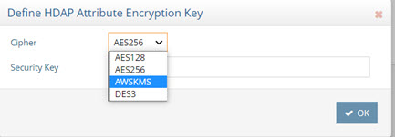
 
    Figure 20: Attribute Encryption Key

4.	If you selected a cipher suite in the previous step, enter a security key. This value is used to auto-generate an encryption key. If you plan on deploying multiple clusters that will participate in inter cluster replication for encrypted attributes, take note of the value you enter here as you must use it when configuring the security key in the other clusters.

An encryption key is auto-generated based on the cipher and security key value provided. This key is used across nodes in a cluster to encrypt/decrypt the attributes configured for encryption. If inter-cluster replication is deployed, all clusters must be configured with the same cipher and security key.

### Using Amazon Web Services (AWS) with a Customer Master Key (CMK)

Instead of using the default key generation, you have the option to use a customer master key stored in AWS. The following steps describe the configuration.

>[!note] Key rotation is optional in AWS for KMS. If enabled, the default key rotation is once every 365 days. For details on AWS Key Management Service, please see the AWS documentation.

1.	Log into your AWS account to create your CMK (Customer Master Key).

2.	With your CMK information, log into the Main Control Panel and go to the ZooKeeper tab.

3.	On the ZooKeeper tab, navigate to /radiantone/v2/doccluster/config/vds_server.conf, click Edit Mode, and locate the following properties:

    ` "awsAccessKeyId" : null,`
    <br> `  "awsSecretAccessKey" : null,`
    <br> `  "awsKmsCMKRegion" : null,`
    <br> `  "awsKmsCMKAlias" : null,`

4.	For the “awsAccessKeyId” property, overwrite the null value with your AWS Access Key ID.

5.	For the “awsSecretAccessKey” property, overwrite the null value with your AWS Access Key Secret.

6.	For “awsKmsCMKRegion” property, overwrite the null value with your AWS region (e.g. "us-east-2").

7.	For “awsKmsCMKAlias” property, overwrite the null value with (e.g. "alias/My_Master_Key”).

8.	Click **Save**.

9.	Navigate to Main Control Panel > Settings > Security > Attribute Encryption and click **Define Key Generation** in the relevant section.

10.	Select the AWSKMS option from the drop-down list and click **OK**.

11.	Click **OK** to confirm.

12.	Define the attributes to encrypt as outlined in the next section.

### Attributes to Encrypt

No attributes are encrypted by default. To configure a list of attributes to encrypt:

1.	Navigate to the RadiantOne Universal Directory (HDAP) store (or configured persistent cache branch) on the Main Control Panel > Directory Namespace tab. 

2.	Enter a comma-separated list of attribute names in the Encrypted Attributes property. 
3.	Click **Save**.
4.	Click **Re-build Index** (if your configuration is a Universal Directory Store) or **Initialize** to reinitialize the cache (if your configuration is a Persistent Cache).

Attributes listed in the Encrypted Attributes property are added to the Non-indexed attribute list by default. This means these attributes are not searchable by default. Indexing encrypted attributes is generally not advised as the index itself is less secure than the attribute stored in Universal Directory/persistent cache. However, if you must be able to search on the encrypted attribute value, it must be indexed. Only “exact match/equality” index is supported for encrypted attributes. To make an encrypted attribute searchable, remove the attribute from the list of nonindexed attributes and then click **Re-build Index** or **Initialize** (to reinitialize) if the branch is a persistent cache.

### Accessing Encrypted Attributes

Attribute values are encrypted before they are stored in Universal Directory/persistent cache, and decrypted before being returned to the client, as long as the client is authorized to read the attribute (based on ACLs defined in RadiantOne), is connected to RadiantOne via SSL, and not a member of the [special group](#clear-attributes-only-group) containing members not allowed to get these attributes (e.g. cn=ClearAttributesOnly,cn=globalgroups,cn=config). 
 
### Using Main Control Panel

When viewing Universal Directory/persistent cache entries or exporting them to an LDIF file from the Main Control Panel > Directory Browser tab, make sure you are connected via SSL, otherwise the attributes are returned/exported as encrypted.

If you are connected to the [Control Panel via SSL](01-introduction#accessing-the-control-panel-over-ssl), then the operations performed on the Directory Browser tab are based on an SSL connection to RadiantOne, and the attributes defined as encrypted are returned decrypted as long as the user you’ve connected to the Main Control Panel with is authorized to read those attributes and this user is not a member of the Clear Attributes Only Group (which by default is the [ClearAttributesOnly group](#clear-attributes-only-group) located at,ou=globalgroups,cn=config).

#### Querying Changelog

When entries containing encrypted attributes are updated and logged into the RadiantOne changelog (e.g. cn=changelog), a client that is connected to RadiantOne via SSL, and is NOT a member of the special [Clear Attributes Only Group](#clear-attributes-only-group) (which by default is the ClearAttributesOnly group located at,ou=globalgroups,cn=config) can see encrypted attributes in clear text. If the client is connected to RadiantOne via SSL and is a member of the special [Clear Attributes Only Group](#clear-attributes-only-group), the value in the “changes” attribute is returned encrypted.

#### Clear Attributes Only Group

To apply a deny-by-exception policy to encrypted attributes, you can add users to the ClearAttributesOnly group. Members of this group cannot get encrypted attributes in clear, even if ACLs dictate they can read the encrypted attribute(s) and they are connecting to RadiantOne via SSL.

The table below summarizes the behavior of this special group when a user is connected to RadiantOne via SSL.

Is user a member of the special group?	| Attributes In DIT	| Values in “changes” attribute In Changelog
-|-|-
No		| Clear text	| Clear text
Yes		| Not displayed	| Encrypted

To add a user to the Clear Attributes Only group:

1.	In the Main Control Panel, click the Directory Browser tab.

2.	Expand cn=config and then expand ou=globalgroups.

3.	Select cn=ClearAttributesOnly.

4.	On the right, click  (Manage Group).

5.	From here you can add users to the group.

>[!note]
>To change the default group, on the Main Control Panel, go to the Zookeeper tab (requires [Expert Mode](01-introduction#expert-mode)). Expand radiantone > `<version>` > `<clustername>` > config and select vds_server.conf. Modify the value for "encryptedAttributeBlacklistGroupDn" to the full DN that points to the group entry to which the exclusion behavior should apply.

### Updating Encrypted Attributes

To update encrypted attributes, the client must connect to RadiantOne via SSL and be authorized (via ACLs) to read and update the attribute and not be in the special [Clear Attributes Only Group](#clear-attributes-only-group). When editing entries from the Main Control Panel > Directory Browser tab > selected Universal Directory store, encrypted attributes appear as encrypted because this operation is not connected to RadiantOne via SSL. If you are connected to the [Control Panel via SSL](01-introduction#accessing-the-control-panel-over-ssl), then the Directory Browser tab connects to RadiantOne via SSL and the attributes defined as encrypted are shown in clear as long as the user you’ve connected to the Main Control Panel is authorized to read those attributes and is not a member of the blacklisted group. In this case, the connected user can also update the encrypted attribute if permissions allow for it.

### Changing an Encryption Key

If you need to change the encryption security key, follow the steps below.

1.	Go to Main Control Panel > Directory Namespace tab.

2.	Select the naming context representing the Universal Directory (HDAP) store.

3.	On the right, remove all values from the encrypted attributes list.

4.	Click **Save**.

5.	Click **Re-build Index**.

6.	Repeat steps 1-5 for each store that has encrypted attributes.

7.	Go to Main Control Panel > Settings tab > Security > Attribute Encryption.

8.	Click **Define Key Generation**. This option is only available if you removed encrypted attributes and rebuilt the index for all applicable stores.

9.	Go to Main Control Panel > Directory Namespace tab.

10.	Select the naming context representing the Universal Directory (HDAP) store.

11.	On the right, add required attributes to the encrypted attributes list.

12.	Click **Save**.

13.	Click **Re-build Index**.

14.	Repeat steps 9-13 for all stores that require encrypted attributes.

## LDIF File Encryption

Using the LDIFZ format when exporting entries produces a zipped and encrypted LDIF file. This prevents data from being readable while stored in exported LDIF files. This setting is required to support [LDIFZ file exports](#requiring-ldifz-for-exports). 

### Key Generation

To define the criteria used to generate an encryption key:

1.	Navigate to Main Control Panel > Settings Tab > Security section > Attribute Encryption sub-section.

2.	On the right, for LDIFZ Encryption Key, click **Define Key Generation**.

3.	Select the desired cipher from the drop-down list or select [AWSKMS](#using-amazon-web-services-aws-with-a-customer-master-key-cmk) if you want to use your own Customer Master Key (CMK) in Amazon Web Services (AWS) Key Management Service (KMS) and have configured the necessary settings in ZooKeeper. If unlimited Java security libraries are enabled, there are more available ciphers in this drop-down list.

    >[!note] If you want to use stronger ciphers that are not listed, you must add (or uncomment) crypto.policy=unlimited in <RLI_HOME>/jdk/jre/lib/security/java.security file. For more details, see the [RadiantOne Hardening Guide](/hardening-guide/00-preface).

4.	If you selected a cipher suite in the previous step, enter a security key. This value is used to auto-generate an encryption key. If you plan on deploying multiple clusters that will participate in inter cluster replication and you are going to initialize Universal Directory (HDAP) stores from an exported LDIFZ file, take note of the value you enter here as you must use it when configuring the LDIFZ cipher and security key in the other clusters.

### Changing an Encryption Key

If you need to change the LDIFZ encryption security key, follow the steps below.

1.	Go to Main Control Panel > Settings tab > Security > Attribute Encryption.

2.	On the right, for LDIFZ Encryption Key, click Define Key Generation.

3.	Select the cipher and enter a security key.

4.	Click **OK**.

5.	Click **Save**.

>[!note] LDIFZ files generated with the old encryption key are no longer usable.

### Requiring LDIFZ for Exports

The Secure LDIF Export option allows you to enforce the use of the encrypted LDIFZ format when exporting entries from the Directory Browser tab. With this setting enabled, using the unencrypted LDIF format for exports is not supported.

>[!note] Enabling secure LDIF exports requires first defining an LDIFZ encryption key. See the [Changing an Encryption Key](#changing-an-encryption-key) section for more information.

To enable the secure LDIF export option:

1.	In the Main Control Panel, click the Settings tab.

2.	Navigate to the Security section and select Attribute Encryption.

3.	In the Secure LDIF Export section, click the Enabled switch.

4.	Click **Save**.

This feature works with the LDIFZ Encryption option as outlined in the table below.

<table>
<tr>
<td>LDIFZ Encryption Key	
<td>Secure LDIF Export	
<td>Available Export Formats:		
<br>LDIF	 
<td>Available Export Formats: 
<br>LDIFZ </p>
<tr>
<td> undefined	
<td>Disabled	
<td>🗹	
<td>⌧</p>
<tr>
<td>undefined
<td>Enabled	
<td> N/A because you can’t enable Secure LDIF if the LDIFZ encryption key is not defined.	
<td>N/A because you can’t enable Secure LDIF if the LDIFZ encryption key is not defined.
<tr>
<td>defined	
<td>Disabled	
<td> 🗹	
<td>🗹
<tr>
<td>defined
<td> Enabled	
<td> ⌧	
<td>🗹
</table>

## ADAP External Token Validators

External token validators allow applications to use an access token to call an API on behalf of itself. The API then responds with the requested data. This section assumes that your OIDC provider is already set up.

>[!warning] The processes described in this section are not hardened against security risks. For more information on hardening RadiantOne, refer to the [RadiantOne Hardening Guide](/hardening-guide/00-preface). 

### Getting an Access Token

This section describes using the Postman REST client to obtain an access token. 

1. Start a new request. 

1. Click the Auth tab.

1. From the Type drop down menu, select OAuth 2.0. The Current Token section displays. 

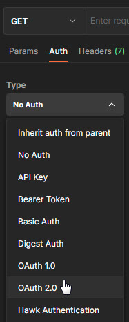

Figure 21: The Type drop-down menu
 
2. In the Configure New Token section, enter the Client ID and client secret.

    >[!note] These values were created during the OIDC provider configuration process. 

3. Provide the access token URL. 

    >[!note] This value can be found using the using the metadata URL from the Authorization Server. 


Figure 22: Configuring an access token in Postman

4. Click Get New Access Token. The new access token's details are displayed. 


Figure 23: The Token Details section in Postman
 
5. Copy this token and decode it for the values needed by the FID server. You can do this at https://jwt.io/.

6. Keep the decoded token. Several values contained within are required for mapping attributes. 

### FID Configuration

This section describes configuring proxy authorization, configuring an ADAP external token validator, and attribute mapping.

#### Configuring Proxy Authorization

The RadiantOne ADAP (or SCIM) service queries the RadiantOne FID LDAP service using proxy authorization.

To configure proxy authorization: 

1. In the Main Control Panel, navigate to Settings > Server Front End > Supported Controls.

1. Enable Proxy Authorization and click Save.

1. Navigate to Settings > Security > Access Control.

1. Enable the “Allow Directory Manager to impersonate other users” option and click Save.

#### Configuring ADAP External Token Validator

To add an external token validator:

1. In the Main Control Panel, navigate to Settings > Security > External Token Validators. 

1. Click **Add**. The New ADAP External Token Validator page displays.


Figure 24: The New ADAP External Token Validator Page

1. Name the external token validator.

1. Toggle the Enable switch to On. 

1. Select an OIDC provider from the drop-down menu. 

1. Paste the Metadata URI from your OIDC authorization server into the Discovery URL field. 

1. Click Discover. The JSON Web Key Set URI auto-populates. 

1. Use the Expected Audience from your OIDC client to populate the Expected Audience field. 

1. Other values can be obtained from the decoded access token. See the [Getting An Access Token](#getting-an-access-token) section for more information.  


Figure 25: Configuring an ADAP External Token Validator

1. Click Edit next to Claims to FID User Mapping. The OIDC to FID User Mappings page displays.

1. Click Add. 

1. Define either a search expression or a simple DN Expression. In this example, a search expression is defined as shown below. 


Figure 26: Editing OIDC to FID User Mapping

1. Click OK. Click OK again to close the OIDC to FID User Mappings window.

1. Click Save. 

#### Attribute Mapping

Map a uniquely identifying attribute to a corresponding claim value in the token (refer to the [Getting An Access Token](#getting-an-access-token) section for more information). In the following image, the attribute **mail** is mapped to the claim value **email**.

>[!note] In some cases, creating a new attribute may be required.

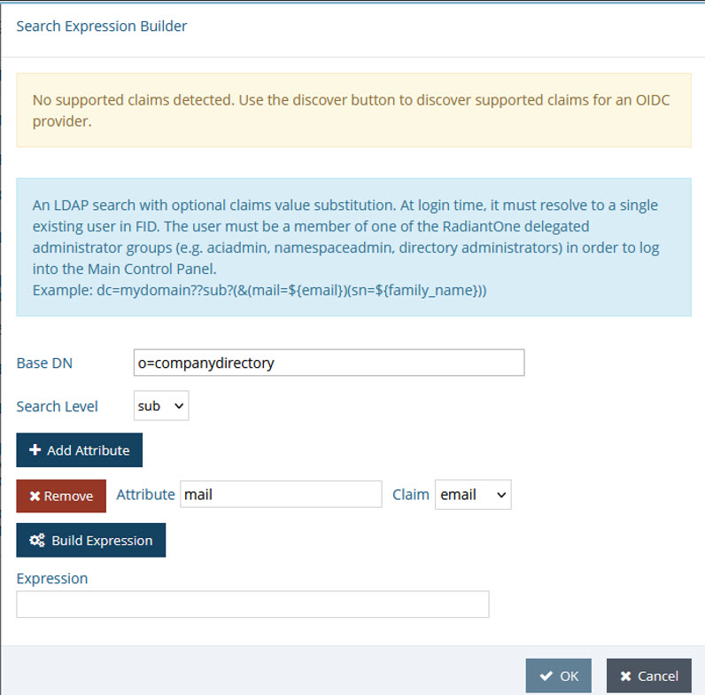

Figure 27: The Search Expression Builder

### Completing the Request with Postman

To complete the request with Postman:

1. Request a new access token (see [Getting An Access Token](#getting-an-access-token)). 
1. Click Use Token. This inserts an Authorization header that inserts your bearer token. 


Figure 28: Requesting a new access token

1. Send the bearer token to the FID ADAP. In this example, a basic ADAP search is performed. 

Field |	Value
-|-
URL Syntax	|http://`<ip:port>`/adap/<baseDN>
Example URL |http://54.219.166.170:8089/adap/o=companydirectory
Method	|Get


Figure 29: Sending the bearer token to RadiantOne

## DoS Filter

DoS filter settings allow you to limit the number or frequency of interactions, such as the number of incoming requests, that RadiantOne has. This is useful for limiting exposure to abuse from request flooding that might result from a misconfigured client or from maliciousness. If enabled, the filter keeps track of the number of requests per second from a connection. If a limit is exceeded, the request is either rejected, delayed, or throttled. 

Requests in excess of the per-second limit are throttled by being queued for delayed processing, and eventually rejected altogether if they continue to accumulate.  An unthrottled request is processed immediately without intervention by the filter.

To enable DoS filtering:

1. In the Main Control Panel, navigate to Settings > Security > DoS Filter. The DoS Filter page is displayed. 
 
1. Make changes to the following settings as required. 

  - Click Enable DoS Filter.
  - Max Requests per Second per Connection – The maximum number of requests from a connection per second. Requests above this limit will be delayed for processing and eventually dropped if they continue to accumulate. The default value is 25.

  - Minimum Delay in Milliseconds – Over-limit requests will be delayed this long before being processed. Set to -1 to immediately discard over-limit requests, or set to 0 for no delay.

  - Max Over-limit Requests Pending – After Max Requests per Second per Connection + Throttled Requests total requests within a one-second period is reached, additional messages are ignored and discarded. 

  - Max Processing Time in Milliseconds – The maximum allowable time to process a request. 

  - Max Idle Tracker in Milliseconds – Sets the maximum amount of time to keep track of request rates for a connection before discarding it.  

  - Insert Header – Check this option to insert the Dos filter headers into the response.

  - Track Session – Check this option to have usage rates tracked by session (if a session exists). 
  - Track Remote Port – Set this option to have usage rates tracked by IP and port if session tracking is not used. 
  - IP Whitelist – Enter a comma-separated list of IP addresses that are not to be rate-limited. Each entry is IP address, either in the form of a dotted decimal notation A.B.C.D or in the CIDR notation A.B.C.D/M

    >[!note] RadiantOne FID automatically whitelists all hosts that are members of the cluster so that node-to-node communications are unaffected; these hosts do not need to be added to the whitelist. This whitelist displays only the hosts that are added manually. 

  - HTTP Response Code – When the DoS filter cancels the processing of a request, it sends back an HTTP response code. Use this setting to change that code. The default value is 430. 

1. Click Save. 

# Security and Access Controls

When RadiantOne receives a request, it uses the user in the bind operation, and the access control instructions (ACIs) defined in order to allow or deny access to directory information. The server can allow or deny permissions such as read, write, search, or compare. 

>[!warning] ACI are not enforced for the [RadiantOne super user](03-front-end-settings#directory-manager-user) (e.g. cn=directory manager).

With ACI, you can control access to targets such as:
-	the entire virtual namespace
-	a specific subtree
-	specific entries in the virtual namespace
-	a specific set of entry attributes
-	specific entry attribute values

You can define access to the following subjects:
-	a particular user
-	all users who belong to a specific group
-	all users of the directory
-	a specific client identified by its IP address

Access controls are set from the Main Control Panel > Settings Tab > Security section > Access Control sub-section. 

The general ACI syntax is as follows:

`(TARGET_DN)(SCOPE)(ATTRIBUTES)(VERSION; ACI_NAME; ALLOW/DENY (OPERATIONS) SUBJECT;)`

The following default ACIs are defined:
-	All users have read access to the directory for search, compare, and read operations.

>[!warning] If you delete the default read access, this does not delete read access to the RootDSE for RadiantOne. If you want to remove access to the RootDSE, check the  option after you delete the default global read access. This denies access to the RootDSE to everyone except cn=directory manager. You can also add a new ACI that dictates RootDSE access. Below is an example of allowing public access to the RootDSE: 
<br>(target="ldap:///")(targetscope="base")(targetattr="*")(version 3.0; acl "RootDSE accessible to public"; allow (read,search,compare) userdn="ldap:///anyone";)

-	Users in the group cn=directory administrators,ou=globalgroups,cn=config have full access to the RadiantOne configuration as it is equivalent to cn=directory manager access. However, unlike cn=directory manager, users in this Directory Administrators group are subject to ACIs when accessing data in the RadiantOne namespace.

Access controls defined in RadiantOne are associated with an objectclass named vdACI.

## Access Control Terms & Definitions

### ACI Description

Each access control instruction has a description which explains the context of the rule.

### Location (Target DN)

The location is the target where the access control is to be applied and is a distinguished name.

>[!warning] It is recommended that you set access permissions at the root of your tree. When setting the target, you can navigate to the specific branch that you want to protect.

When setting access controls on a sub-branch, you do not see which access controls have been set up at the parent nodes in the tree. This increases the chance that you may have conflicting access controls defined. Defining access controls at the root helps prevent creating conflicting access rules.

### Target Filter

You can also add an LDAP filter condition on the target resource (location) to protect.

For example, you can define the target resource as: all the entries under dv=address book,o=vds that have the attribute securitylevel set to 'secret'. 

To create this example, from the Main Control Panel > Settings Tab > Security section -> Access Control sub-section, browse to the dv=address book,o=vds branch and click **Add**. 


Figure 30: Setting Access Controls

### Scope

The scope of an access control rule can be entry level (base), one level or subtree level. Entry level pertains to the single entry specified in the Target DN. One level pertains to the entry specified in the Target DN and all child branches one level below it. Subtree level pertains to the entry specified in the Target DN as well as all child branches below this point.


 
Figure 31: Example of Entry Level Access Control


 
Figure 32: Example of Sub Tree Level Access Control

### Target Attributes

The rule can indicate “equal to” (=) or “not equal to” (!=). Select the desired condition in the drop-down list. 


Figure 33: Target Attributes Operator

The access rule can apply to “all” attributes or choose the “custom” option and click **Select** to narrow the list.

By default, the root ACI prevents only the target attribute aci from being returned. This default ACI is shown below.

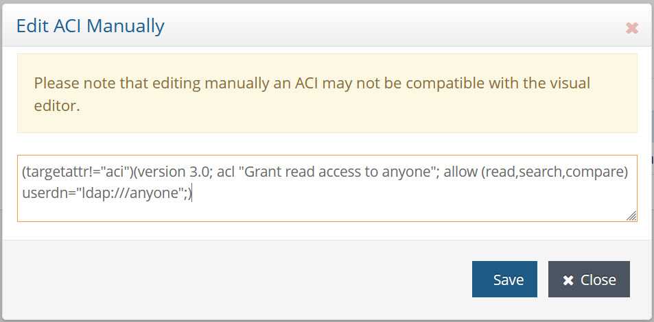

Figure 34: Manual Edit of ACI

To improve security, if you want to also prevent userpassword from being returned, you can do so as shown in the following example ACI. 

(targetattr != "aci || userPassword")(target = "ldap:///")(targetscope = "subtree")(version 3.0;acl "grant read access to anyone";allow (read,compare,search) (userdn = "ldap:///anyone");)

If you do not want to return the userPassword attribute for anyone other than self, you can do so as shown in the following example ACI. 

(targetattr = "userPassword")(target = "ldap:///")(targetscope = "subtree")(version 3.0;acl "Allow Access to userPassword to self";allow (all) (userdn = "ldap:///self");)

### Authentication Context

The Authentication Context section offers a variety of settings related to bind rules that can be used for defining the access control instruction. These include the level of assurance associated with the authentication method, days and times of the week during which the identity is allowed to authenticate, and location from which the identity must bind (IP or DNS addresses).

#### Level of Assurance

A Level of Assurance, as defined by the ISO/IEC 29115 Standard, describes the degree of confidence in the process leading up to and including an authentication. It provides assurance that the entity claiming a particular identity, is the entity to which that identity was assigned. There are 5 levels of assurance used by RadiantOne to enforce access controls to data. The default level is no enforcement of assurance (Level 0). You can use this level when there is minimum risk associated with the authentication strength used to access the RadiantOne data. 

Level 1 indicates an authentication method of basic credentials (username+password) is required to access the data. At this level, there is little confidence in the asserted identity's validity. You can use this level when there is low risk associated with the authentication strength used to access the RadiantOne data. 

Level 2 indicates an authentication method of Kerberos (leveraging GSSAPI) is required to access the data. At this level, there is some confidence in the asserted identity's validity. You can use this level when there is moderate risk associated with the authentication strength used to access the RadiantOne data.

>[!warning]
>Ensure you have RadiantOne configured properly as a [Kerberos LDAP service](06-security#kerberos).

Level 3 indicates multi-factor authentication (e.g. RSA SecurID token code, Yubikey) is required to access the data. At this level, there is high confidence in the asserted identity's validity. You can use this level when there is high risk associated with the authentication strength used to access the RadiantOne data. 

>[!warning]
>Ensure you have RadiantOne configured properly with a [Custom Authentication Provider](interception#custom-authentication-providers).

Level 4 indicates certificate-based (mutual) authentication is required to access the data. There is very high confidence in an asserted identity of the entity. This is the highest level of authentication assurance and should be used when there is very high risk associated with accessing the data.

>[!warning]
>Ensure you have RadiantOne configured properly for [Mutual Authentication](server-backend#mutual-authentication).

Select the assurance level from the drop-down list and select an operator. You can use Equals (=), Not Equal To (!=), Greater Than (>), Greater Than or Equal To (>=), Less Than (<), or Less Than or Equal To (<=).

#### Days and Times

Indicate the days and times during the week which the access control instruction is applicable. Select a week day and then enter a time range. Click  to add the time range. Multiple time ranges per day are supported.

### Permissions

If no access permissions have been defined, the default behavior is to grant read access to all attributes except “aci” to everyone. This default is set on the Main Control Panel > Settings Tab > Security section > Access Control sub-section. Select the “root” node. Click **Edit** or **Manual Edit** to view/edit it.


 
Figure 35: Default Global ACI Setting

#### Type

You can explicitly allow or deny access permissions by selecting the applicable option from the drop-down.


 
Figure 36: Permission Type

#### Operations

The specific operations a user can perform on directory data are defined below. You can allow or deny all operations, or you can assign one or more of the following:

**All**

Indicates that the subject has the following rights to the targeted entry: read, write, search, delete, compare, and selfwrite. The All access right does not give the following rights to the target entry: proxy.

Example of syntax when all operations are selected:

(targetattr = "homePhone")(target = "ldap:///dv=address book,o=vds")(targetfilter = "(securitylevel=secret)")(targetscope = "subtree")(version 3.0;acl "myaci";allow (all) (userdn = "ldap:///all");)

**Read**

Indicates whether users can read the directory entries and the attributes of entries specified in the ACI. This permission applies only to the search operation. 

**Search**

Indicates whether users can search on the targets specified in the ACI. This permission applies only to the search operation. The Search right is checked once, and after the search is allowed or denied, it is not checked again. If the search is allowed, the read right is then applied to each entry to be returned as a result of the search and to each attribute of each entry.

**Add**

Indicates whether users can create entries.

**Delete**

Indicates whether users can delete entries.

**Compare**

Indicates whether users can compare data they supply in the request with data stored in the directory. With compare rights, the directory returns a success or failure message in response to an inquiry, but the user cannot see the value of the entry or attribute. 

**Write**

Indicates whether users can modify an entry by adding, modifying, or deleting attributes. This permission applies to the modify and modRDN operations.

**Self Write**

Indicates whether users can add or delete their own DN in an attribute of the target group entry. The syntax of this attribute must be a distinguished name. This right is used only for group management. Self write works with proxy authorization: it grants the right to add or delete the proxy DN from the group entry (not the DN of the user from the Bind operation).

**Proxy**

Authorization for RadiantOne data is checked based on the user who authenticated. The authorization ID (DN) is linked to the authenticated ID (DN) for the same connection. With the proxy authorization control enabled, the client can switch the user ID (for authorization purposes) without having to re-authenticate with a new connection.

If there is the need to base authorization on a different user than the one who authenticated, you can use the proxy authorization control. This is primarily useful in environments where an application must authenticate many users and doesn’t want to maintain an open connection to RadiantOne for each of them. With this approach, the application can authenticate the user, and after, impersonate that user for authorization purposes. The application can use its own service account when connecting to RadiantOne and pass the needed control along with the user DN of the person they want to represent for authorization in their requests. RadiantOne then checks the proxy authorization rules that have been configured in access controls to make sure the service account is allowed to represent the person passed in their request. If so, the service account is allowed to perform any operations the person they are impersonating would be allowed to do.

The proxy option indicates whether the subject can access the target with the rights of another entry. You can grant proxy access using the DN of any user in the directory except the special cn=directory manager user. In addition, you cannot grant proxy rights to the cn=directory manager user. If the branch you are protecting with access controls is a local LDAP/HDAP store, then this requires the [Proxy Authorization control](03-front-end-settings#proxied-authorization-control) enabled for RadiantOne.

### Subjects

A subject is whom the access control rule applies to. The subject types that can be associated with access control rules are described below:

>[!warning] It is recommended to define access controls on subjects that are located in a RadiantOne Universal Directory (HDAP) store or persistent cache. This prevents possible performance or network issues involved with RadiantOne connecting to a backend directory in order to enforce authorization. If your ACI’s require subjects that are located in backend directories, make sure that the backend is configured for high availability and that the [RadiantOne data source](concepts#data-source) is configured with the failover servers appropriately.

-	Users – applicable to any specific user(s).
-	Groups – applicable to a group of users. If the group is a nested group in HDAP, enable Main Control Panel > Settings > Security > Access Control > [Enable Nested Groups](access-control#enable-nested-groups) and configure [Linked Attribute](interception#linked-attributes) settings from Main Control Panel > Settings > Interception > Special Attributes Handling.
-	Tree Branch - Applicable to the DN specified as part of the subject and all entries below it in the virtual directory tree. The defined access permissions apply to any user found in the tree branch you choose.
-	Public – anyone connected to the directory is considered public. This also includes anonymous users.
-	Self – applicable to the user whose authenticated DN matches the DN of the entry that is being accessed.
-	Authenticated – applicable to any user who successfully authenticates.
- Group Owner - applicable to the owner, manager, or role of the group.  You can define the target, scope, attributes and permissions using the Control Panel and then select this ACI and click **Manual Edit** to refine the subject for this complex scenario. See below for an example:<br>

(targetattr="*")(target="ldap:///o=My Company?manager,owner,role")(targetscope = "subtree")(version 3.0;acl "Group owner access only";allow (all)(userdn = "ldap:///self");)<br>

The above ACI will dictate that:  if the binding user is the "manager", or the "owner", or bearing the "role" of the targeted entity, then the binding user has the access to targeted entry;  otherwise, the access is denied.<br>

-	Parent – applicable to the entry only if their bind DN is the parent of the targeted entry. For example, to allow users to modify any child entries of their bind DN, create the following ACI on the dv=address book,o=vds node:
(targetattr = "*")(target = "ldap:///dv=address book,o=vds")(targetscope = "subtree")(version 3.0;acl "myaci";allow (write) (userdn = "ldap:///parent");)<br>

-	IP Address – applicable to a specific client IP address. 
You can indicate that a client connection must originate from a single IP address or a range of addresses. Both IPv4 and IPv6 addresses are supported and you can indicate a range of IP addresses using “/”. A mix of IPv4 and IPv6 can also be used. See below for examples:

**Single IPv4 address**
<br>10.11.12.129

**Single IPv6 address**
<br>fe80::b010:e554:f9d5:dec0%10
**Range of IPv4 addresses (use the “/”) like:**
<br>10.11.12.0/24 which represents the given IPv4 address and its associated routing prefix 10.11.12.0, or equivalently, its subnet mask 255.255.255.0, which has 24 leading 1-bits. This covers the range between 10.11.12.0 to 10.11.12.255.	
**Range of IPv6 addresses:**
<br>2001:db8::/32    which covers the range between 2001:db8:0:0:0:0:0:0 to 2001:db8:ffff:ffff:ffff:ffff:ffff:ffff

For IPv6 addresses, use the syntax defined by RFC 2373. For example, 0:0:0:0:0:0:13.1.68.3 which can also be expressed as ::13.1.68.3 are both valid forms of IPv6 addresses. An address with a subnet prefix length can also be used (e.g. 12AB::CD30:0:0:0:0/60). Wildcards cannot be used in IPv6 addresses.

>[!note]
>To use DNS addresses, manually edit the ACI after saving it by clicking **Manually Edit**. Use the keyword dns and enter the fully qualified DNS domain name. Use an operator of either “equal to” (=) or “not equal to” (!=). Wildcards are supported in the DNS address.

## ACI Evaluation Rules

The ACI evaluation rules that RadiantOne follows are:

1.	When the RadiantOne service starts, all ACIs defined in the entries below "ou=aggregate,ou=globalaci,cn=config" are loaded.

2.	To determine if an operation is allowed or denied, RadiantOne looks in the ACI list for the target of the operation to collect all target-matched aci values.

3.	RadiantOne separates the aci values into two lists; one list contains all the aci values that match the target and denies the required access, and the other list contains all the aci values that match the target and allows the required access.

4.	If the deny list contains any aci values after this procedure, access is immediately denied.

5.	If the deny list is empty, then the allow list is processed. If the allow list contains any aci values, access is allowed.

If both lists are empty, access is denied.

>[!warning]
>To troubleshoot/trace ACI evaluation decisions, [RadiantOne server log level](logs#log-settings) must be set to DEBUG. When DEBUG level is set, the evaluation rules can be seen in: <RLI_HOME>/vds_server/logs/vds_server.log

## Setting Access Controls

To define access controls:

>[!warning]
>Access rights can be defined by any user who is a member of the ACI Administrators group or the Directory Administrators group. For details on all administrative groups available for RadiantOne, please see [Delegated Administration of RadiantOne](01-introduction#delegated-administration-of-radiantone).

1.	From the Main Control Panel > Settings Tab > Security section > Access Control sub-section, select the Enable ACI checkbox on the right side in the Authorization section and click **Save**.
1.	In the Access Control section, select root.

    >[!note] Although there is not an absolute requirement, it is generally recommended to define all your access controls at the root level so you can come back to this single level and see all configured access controls across the entire virtual namespace.

1.	Click **Add**. The Edit ACI pane is displayed.

    >[!note] The Target Scope pull-down menu value defaults to subtree, and the Target Attributes value defaults to All.

1.	Enter an ACI description.
1.	Click **Choose** to navigate to the target DN.
1.	In the Target Scope drop-down list, select base, onelevel or subtree.
1.	In the Target Filter, enter an applicable LDAP filter to narrow the entries affected by the access control rule. This step is optional.
1.	For the Target Attributes, select either “equal to” (=) or “not equal to” (!=) from the drop-down list. Then choose to either have the access rule apply to “all” or “custom”. If custom is selected, click SELECT to narrow the list.

    If you choose custom, and your attribute doesn’t appear in the list, you must update the RadiantOne LDAP schema appropriately before setting the ACI. For details on this, please see [Extending RadiantOne LDAP Schema](radiantone-ldap-schema#extending-the-radiantone-ldap-schema). After the schema has been updated, go back to the Settings tab > Security section > Access Controls sub-section and follow the steps mentioned above to add the custom attribute list.

1.	In the Permissions section, select either to allow or deny. 
1.	Select the [operations](06-security#operations) that you want allowed or denied.
1.	In the Authentication Context section, configure bind rules as needed.
1.	In the Apply to section, select the [subjects](06-security#subjects) that will be allowed or denied access. 

    To assign users, groups or users associated in a specific tree/branch, click **LDAP SEARCH**. 

    To assign public, click **ALLOW PUBLIC**.

    To assign self, click **ALLOW SELF**.

    To assign specific IP addresses, click **ALLOW IP**.

    To assign all authenticated users, click **ALLOW AUTHENTICATED**.

    To assign permissions associated with the parent, click **ALLOW PARENT**.

1.	Click **Save** when finished.

# Access Control

The settings found in the Main Control Panel > Settings Tab > Security section > Access Control sub-section are for defining access permissions for the virtual namespace. There is a section for configuring access controls, and there is a section for global authorization settings.


 
Figure 37: Access Controls

For details on RadiantOne Access Controls and how to define them, please see [Security and Access Controls](#security-and-access-controls).

## Authorization

The settings configured in the Authorization section determine how RadiantOne handles authorization. These settings dictate whether RadiantOne enforces defined access controls, allows anonymous access, requires passwords for bind operations, and if nested groups are supported. Each setting is described in more details below.

### Enable ACI

The checking of ACIs by RadiantOne can be enabled or disabled by using the Enable ACI checkbox. Check the box to enable and uncheck to disable. For specific details about setting ACI, please see [Security and Access Controls](#security-and-access-controls).

### Allow Anonymous Access

If RadiantOne should allow anonymous access, then check the Allow Anonymous Access checkbox. If RadiantOne should not allow anonymous access, make sure this checkbox is not checked. This is the default global access permission for anonymous users and is enforced before subsequent ACI rules. In other words, even if anonymous access were allowed as a general policy, subsequent ACI rules could prevent anonymous users from accessing any data. For details on access controls that can be set, please [Security and Access Controls](#security-and-access-controls).

### Allow Directory Manager to Impersonate Other Users

Proxy authorization allows the user that creates a connection to RadiantOne to impersonate/request access on behalf of another user. This allows authorization to be enforced for a user other than the one that creates the connection/binds to RadiantOne. By default, the RadiantOne super user (e.g. cn=directory manager) is not allowed to impersonate other users. If you want this special user to be able to impersonate other users (to enforce authorization based on other users instead of as the super user), enable the “Allow Directory Manager to Impersonate Other Users” option. Also, verify that the [Proxy Authorization Control](03-front-end-settings#proxied-authorization-control) is enabled for RadiantOne because this is the control that allows clients to request access on behalf of another user.

### Bind Requires SSL or StartTLS

If a user binds to RadiantOne and provides a password, that password is vulnerable to interception by a third party when sent over non-SSL ports. To help prevent this vulnerability, you can enforce that binds always use the SSL/TLS ports by using the Bind requires SSL or StartTLS option.

>[!warning] As a best practice, it is recommended that you only allow SSL communication to the RadiantOne service. If you require non-SSL communication but still want to require that binds use SSL or StartTLS, you can use this option.

This option requires enabling SSL. If you want binds to use StartTLS, you must also enable StartTLS. Refer to [SSL Settings](security#ssl-settings) for more information on these settings.

If you enable Bind Requires SSL or StartTLS, to avoid problems when using the Main Control Panel you must enable “Use SSL” for internal connections in Main Control Panel > Settings > Internal Connections. This setting corresponds to the “internalVDSClientEnableSSL” setting in ZooKeeper at: /radiantone/v2/doc737cluster/config/vds_server.conf.

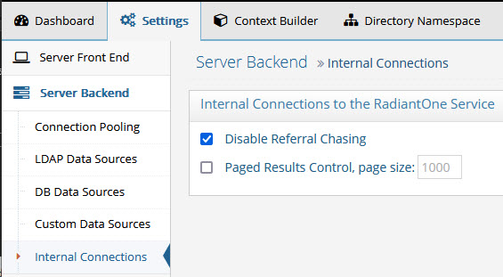
 
Figure 38: Internal Connection Settings

### Bind Requires Password

If a user binds to RadiantOne and does not provide a password, the default behavior is to treat it like an anonymous user. This may introduce security problems for the client application, or in certain cases where machines like printers may bind against RadiantOne, that do not verify that the client actually provided a password. If the Bind Requires Password setting is enabled, and no password is specified in the bind request, RadiantOne tries to bind the specified user and return an invalid credential error to the client. If Bind Requires Password is not enabled, and a bind request comes in with a valid user DN and no password, it is considered an anonymous bind.

### Enable Nested Groups

If you have groups stored in a RadiantOne Universal Directory store and want to support groups as members, check the Enable Nested Groups option.

>[!warning] Processing nested groups is not efficient and is not enabled by default. When nested groups are used in RadiantOne ACLs for access controls, many recursive searches are required. Large groups with a mix of many members including other groups as members can have poor performance. Use nested groups with caution and validate your use case with performance testing to ensure response times meet your needs.

### LDAP_MATCHING_RULE_IN_CHAIN

RadiantOne supports the LDAP_MATCHING_RULE_IN_CHAIN operator and allows clients to issue search filters using the 1.2.840.113556.1.4.1941 matching rule OID. This provides a method to look up the ancestry of an object and can be used in a search filter to retrieve all groups a user is a member of even when that group is nested (and is a member of another group). If the base DN in the RadiantOne namespace is associated with a proxy view, the search filter containing the matching rule OID is passed to the backend which must process the LDAP_MATCHING_RULE_IN_CHAIN. If the base DN in the RadiantOne namespace is associated with a persistent cache or a Universal Directory store, RadiantOne processes the matching rule locally.

>[!warning] If you are using the Linked Attributes calculation in RadiantOne and the users and groups are local, in a persistent cache or Universal Directory store, you must enable the Optimize Linked Attribute setting to support filters requesting isMemberOf/memberOf. This ensures good performance. For details on this setting, see the Namespace Configuration Guide (applicable to RadiantOne Universal Directory stores) or the [RadiantOne Deployment and Tuning Guide](/deployment-and-tuning-guide/00-preface) (applicable to persistent cache).


As a simple example, assume there is a group named All Users and that this group is a member of another group named Sales. The screen below shows the All Users group containing member Adan_Funston.


 
Figure 39: Example Group

The screen below shows the Sales group containing the All Users group as a member.


 
Figure 40: Example Nested Group

A client can issue a search leveraging the matching rule OID to retrieve all groups Adan_Funston is a member of with the following search filter.
```
(uniqueMember:1.2.840.113556.1.4.1941:=uid=Adan_Funston,ou=Accounting,o=companydirectory)
```
A search request to RadiantOne with the above filter would return Sales and All Users as shown in the example client below.


 
Figure 41: Search Filter using Matching Rule OID

>[!warning]
>Queries requesting an intersecting set of multiple memberships like in the following filter are not supported. <BR>(&(ismemberof:1.2.840.113556.1.4.1941:=cn=max,ou=groups,dc=data)(ismemberof:1.2.840.113556.1.4.1941:=cn=othergroup,ou=groups,dc=data))

# Access Control

The settings found in the Main Control Panel > Settings Tab > Security section > Access Control sub-section are for defining access permissions for the virtual namespace. There is a section for configuring access controls, and there is a section for global authorization settings.


 
Figure 42: Access Controls

For details on RadiantOne Access Controls and how to define them, please see [Security and Access Controls](#security-and-access-controls).

## Authorization

The settings configured in the Authorization section determine how RadiantOne handles authorization. These settings dictate whether RadiantOne enforces defined access controls, allows anonymous access, requires passwords for bind operations, and if nested groups are supported. Each setting is described in more details below.

### Enable ACI

The checking of ACIs by RadiantOne can be enabled or disabled by using the Enable ACI checkbox. Check the box to enable and uncheck to disable. For specific details about setting ACI, please see [Security and Access Controls](#security-and-access-controls).

### Allow Anonymous Access

If RadiantOne should allow anonymous access, then check the Allow Anonymous Access checkbox. If RadiantOne should not allow anonymous access, make sure this checkbox is not checked. This is the default global access permission for anonymous users and is enforced before subsequent ACI rules. In other words, even if anonymous access were allowed as a general policy, subsequent ACI rules could prevent anonymous users from accessing any data. For details on access controls that can be set, please [Security and Access Controls](#security-and-access-controls).

### Allow Directory Manager to Impersonate Other Users

Proxy authorization allows the user that creates a connection to RadiantOne to impersonate/request access on behalf of another user. This allows authorization to be enforced for a user other than the one that creates the connection/binds to RadiantOne. By default, the RadiantOne super user (e.g. cn=directory manager) is not allowed to impersonate other users. If you want this special user to be able to impersonate other users (to enforce authorization based on other users instead of as the super user), enable the “Allow Directory Manager to Impersonate Other Users” option. Also, verify that the [Proxy Authorization Control](03-front-end-settings#proxied-authorization-control) is enabled for RadiantOne because this is the control that allows clients to request access on behalf of another user.

### Bind Requires SSL or StartTLS

If a user binds to RadiantOne and provides a password, that password is vulnerable to interception by a third party when sent over non-SSL ports. To help prevent this vulnerability, you can enforce that binds always use the SSL/TLS ports by using the Bind requires SSL or StartTLS option.

>[!warning]
>As a best practice, it is recommended that you only allow SSL communication to the RadiantOne service. If you require non-SSL communication but still want to require that binds use SSL or StartTLS, you can use this option.

This option requires enabling SSL. If you want binds to use StartTLS, you must also enable StartTLS. Refer to [SSL Settings](security#ssl-settings) for more information on these settings.

If you enable Bind Requires SSL or StartTLS, to avoid problems when using the Main Control Panel you must enable “Use SSL” for internal connections in Main Control Panel > Settings > Internal Connections. This setting corresponds to the “internalVDSClientEnableSSL” setting in ZooKeeper at: /radiantone/v2/doc737cluster/config/vds_server.conf.


 
Figure 43: Internal Connection Settings

### Bind Requires Password

If a user binds to RadiantOne and does not provide a password, the default behavior is to treat it like an anonymous user. This may introduce security problems for the client application, or in certain cases where machines like printers may bind against RadiantOne, that do not verify that the client actually provided a password. If the Bind Requires Password setting is enabled, and no password is specified in the bind request, RadiantOne tries to bind the specified user and return an invalid credential error to the client. If Bind Requires Password is not enabled, and a bind request comes in with a valid user DN and no password, it is considered an anonymous bind.

### Enable Nested Groups

If you have groups stored in a RadiantOne Universal Directory store and want to support groups as members, check the Enable Nested Groups option.

>[!warning]
>Processing nested groups is not efficient and is not enabled by default. When nested groups are used in RadiantOne ACLs for access controls, many recursive searches are required. Large groups with a mix of many members including other groups as members can have poor performance. Use nested groups with caution and validate your use case with performance testing to ensure response times meet your needs.

### LDAP_MATCHING_RULE_IN_CHAIN

RadiantOne supports the LDAP_MATCHING_RULE_IN_CHAIN operator and allows clients to issue search filters using the 1.2.840.113556.1.4.1941 matching rule OID. This provides a method to look up the ancestry of an object and can be used in a search filter to retrieve all groups a user is a member of even when that group is nested (and is a member of another group). If the base DN in the RadiantOne namespace is associated with a proxy view, the search filter containing the matching rule OID is passed to the backend which must process the LDAP_MATCHING_RULE_IN_CHAIN. If the base DN in the RadiantOne namespace is associated with a persistent cache or a Universal Directory store, RadiantOne processes the matching rule locally.

>[!warning]
>If you are using the Linked Attributes calculation in RadiantOne and the users and groups are local, in a persistent cache or Universal Directory store, you must enable the Optimize Linked Attribute setting to support filters requesting isMemberOf/memberOf. This ensures good performance. For details on this setting, see the Namespace Configuration Guide (applicable to RadiantOne Universal Directory stores) or the [RadiantOne Deployment and Tuning Guide](/deployment-and-tuning-guide/00-preface) (applicable to persistent cache).


As a simple example, assume there is a group named All Users and that this group is a member of another group named Sales. The screen below shows the All Users group containing member Adan_Funston.


 
Figure 44: Example Group

The screen below shows the Sales group containing the All Users group as a member.


 
Figure 45: Example Nested Group

A client can issue a search leveraging the matching rule OID to retrieve all groups Adan_Funston is a member of with the following search filter.

`(uniqueMember:1.2.840.113556.1.4.1941:=uid=Adan_Funston,ou=Accounting,o=companydirectory)`

A search request to RadiantOne with the above filter would return Sales and All Users as shown in the example client below.


 
Figure 46: Search Filter using Matching Rule OID

>[!warning]
>Queries requesting an intersecting set of multiple memberships like in the following filter are not supported. <BR>(&(ismemberof:1.2.840.113556.1.4.1941:=cn=max,ou=groups,dc=data)(ismemberof:1.2.840.113556.1.4.1941:=cn=othergroup,ou=groups,dc=data))

# Client Certificate Trust Store (Cluster Level Trust Store)

Many RadiantOne installed components (e.g. Control Panel) act as client’s to the local RadiantOne service and might require SSL access. Therefore, any time you change the RadiantOne server certificate, you must import the corresponding public key certificate into the Client Certificate Trust Store (unless the signer of the server certificate is already trusted).

Also, the certificates in the Client Certificate Trust Store are used by RadiantOne to connect via SSL to underlying data sources. Therefore, the appropriate client (public key) certificate (associated with the server certificate of the backend) needs imported into the Client Certificate Trust Store (unless they are signed by a trusted/known Certificate Authority).

RadiantOne loads all client certificates from the default Java truststore (<RLI_HOME>/jdk/jre/lib/security/cacerts) when it starts. Then, it dynamically loads all other certificates from the Client Certificate Trust Store. This allows client certificates to be dynamically added at any time without needing to restart the RadiantOne service. When RadiantOne is deployed in a cluster, all nodes share the contents of the Client Certificate Trust Store.

>[!note]
>It is not recommended to import client certificates into the default Java truststore (<RLI_HOME>/jdk/jre/lib/security/cacerts) since this is overwritten each time there is a RadiantOne patch that requires a Java update and requires a restart of the RadiantOne service every time you add new certificates. For these reasons, it is recommended to use the RadiantOne Client Certificate Trust Store instead.

Import client certificates into the truststore from the Main Control Panel > Settings Tab > Security section > Client Certificate Truststore. Certificates can be viewed, imported, exported or deleted from here.

>[!warning]
>When RadiantOne is deployed in a cluster, the public key associated with each server node must be stored in the client certificate truststore if you want the nodes to be able to communicate with each other over SSL. Keep this in mind if you ever change the server certificates on any of the cluster nodes.

## Viewing Client Certificates

To view a certificate, select the certificate in the list and click **View**. Valuable information about the certificate is shown (who issued the certificate, who the certificate was issued to, when the certificate is set to expire, status…etc.).

### Adding Client Certificates

To add a certificate:
1.	Click **Import**.
2.	Enter a short, unique name (alias) for the certificate.
3.	Browse to the location of the client certificate file and click **OK**.
4.	Click **Save** in the upper right corner.

### Deleting Client Certificates

To delete a certificate:

1.	Select the desired certificate and click **Delete**.
2.	Click **Yes** to confirm the deletion.
3.	Click **OK** to exit the confirmation.
4.	Click **Save** in the upper right corner.

### Exporting Client Certificates

To export a certificate:

1.	Select the desired certificate and click **Export**.
2.	Enter a location to export the file to.
3.	Enter a name for the exported file.
4.	Click **OK** to export the certificate to a file.
5.	Click **OK** to exit the confirmation.
6.	Click **Save** in the upper right corner.

>[!note] If RadiantOne is deployed in a cluster, all nodes share the contents of the client certificate truststore.

# Password Policies

When using a RadiantOne Universal Directory store or persistent cache (with password policy enforcement enabled), you can establish password policies for managing things such as password length, quality, reset frequency, lockout…etc. Password policies are only enforced for RadiantOne Universal Directory stores and persistent caches (that contain the user passwords and have enabled the enforcement of password policies) not any other kind of backend configuration (proxies, databases…etc.).


 
Figure 47: Password Policies

## Privileged Password Policy Group

To allow users to bypass password policies, you can add them to the PrivilegedPasswordPolicyGroup group. This group can be useful, for example, if you want a helpdesk user to reset a user’s password. The password policies are not checked, so this user can set a password that does not meet the password content criteria, could be in history, etc.

>[!warning] In addition to PrivilegedPasswordPolicyGroup group members, password policies also do NOT apply to the RadiantOne super user account (cn=directory manager for example) or any member of the cn=directory administrators,ou=globalgroups,cn=config group (or the specific Directory Administrators group you have set on the Main Control Panel > Settings Tab > Server Front End > Administration sub-section).

To assign users to the Privileged Password Policy Group:

1.	In the Main Control Panel, click the Directory Browser tab.

2.	Expand cn=config and ou=globalgroups.

3.	Select cn=PrivilegedPasswordPolicyGroup.

4.	On the right, click **Manage Group**.

5.	Add privileged accounts to this group.

## Password Policy Configuration

From the Main Control Panel > Settings Tab > Security section > Password Policies sub-section, you can configure the following:

### Password Policy Scope

There is a default password policy that is enforced at a global level for all RadiantOne Universal Directory stores and persistent cache (if password policy enforcement is enabled), no matter where a user account is located. You can override the default policy with a custom one that is applicable only to a certain subset of the user population (determined by group they are a member of, or the location of the entry in the virtual namespace).

>[!note]
>If a given user entry is affected by both a global and local policy, the local policy takes precedence. For more details, see [Password Policy Precedence](#password-policy-precedence). To enable password policy enforcement for a persistent cache branch, check the Enable Password Policy Enforcement option on the cache settings. For more details on persistent cache, see the [RadiantOne Deployment and Tuning Guide](/deployment-and-tuning-guide/00-preface).

#### Default Password Policy

In the ‘Choose a Password Policy’ drop-down menu, the default password policy is named Default Policy. Choose this option to edit the components of the global default policy.


 
Figure 48: Password Policy Scope

#### Custom Password Policy

To create a custom password policy, next to the ‘Choose a Password Policy’ drop-down, click **New**. Enter a policy name applicable to the intended usage and click **OK**.

The ‘Subject’ of the custom policy can be either Sub-tree or Group and is based on a specific base DN. Click **CHOOSE** to select a base DN. If the subject is set to sub-tree, this means that all user entries below the chosen base DN (which must be a RadiantOne Universal Directory store or persistent cache) are affected by the custom policy. If the subject is set to group, this means that all users that are a member of the group specified in the base DN are affected by the custom policy. The group DN can represent a static group (unique members listed in the group entry) or a dynamic group (associated with the groupOfURLs object class and contains a memberURL attribute dictating the members). RadiantOne evaluates dynamic membership automatically to enforce password policies. If a user is affected by a policy defined for sub-tree and for group, the one associated with the group takes precedence.

>[!note] Custom policy properties override those defined in the default policy. The only exception is the password content properties where you can choose to enable the enforcement of the custom policy, or choose to use the default policy. Keep in mind that a value of 0 (zero) in a custom policy for password content means an unlimited amount is allowed. It does not mean that it is undefined.

An example of a custom password policy is shown below. It is applicable to all users who are located in a RadiantOne Universal Directory store and are a member of the Special Users group identified in the DIT as cn=special users,ou=globalgroups,cn=config.

>[!note] If you define multiple custom password policies associated with groups (as the Subject), they should not have the same precedence if they share members. If a user is affected by multiple group-based policies, the one with the highest precedence (lowest numeric value in the precedence setting) is enforced.

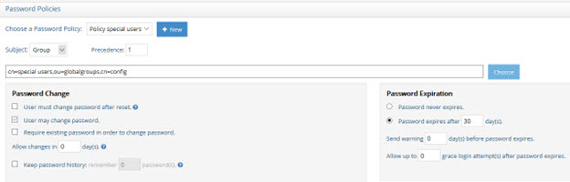
 
Figure 49: Example Custom Password Policy Applicable to a Group

An example of a custom password policy applicable to all users below a specific container is shown below. This custom policy is enforced for all users in a RadiantOne Universal Directory store located below o=local.

>[!note] Precedence level is not configurable for policies defined on a sub tree. Multiple password policies configured with sub tree subject, should not be configured for the same location. If multiple policies impact the same branch, the policy defined at the lowest point is enforced.


 
Figure 50: Example Custom Password Policy Applicable to a Sub Tree

### Password Policy Precedence

If the user entry has a [pwdPolicySubentry](#pwdpolicysubentry) attribute that contains a DN pointing to a password policy located below cn=Password Policy,cn=config in RadiantOne, this policy takes precedence and is enforced for the user. If the user entry doesn’t have a pwdPolicySubentry attribute, or if the value points to a non-existent policy below cn=Password Policy,cn=config, then RadiantOne evaluates other configured password policies that affect the user.

The examples below describe how password policies are enforced.

-	If a user has a [pwdPolicySubentry](#pwdpolicysubentry) attribute that matches a policy configured in RadiantOne, this policy is enforced. No other password policies are considered.

-	If a user is affected by both a global and local policy, the local policy takes precedence. 

-	If a user is affected by both a group-based policy and a sub-tree based policy, the group policy takes precedence. 

-	If a user is affected by multiple group-based policies, the one with the highest precedence (lowest numeric value in the precedence setting) is enforced. 

-	If a user is affected by multiple sub-tree based policies, the one with the deepest DN value is enforced.
Items to keep in mind:

-	The precedence value is a number between 1 and 1000. 1 is the highest level. 1000 is the lowest level. This value is stored in the policyPrecedence attribute of the password policy entry in RadiantOne.

-	The default password policy always has the lowest precedence level (a numeric value of 1000).

-	Each custom password policy defined for groups is associated with a precedence level. This level dictates which policy is enforced for a user that is associated with many group policies. For example, if a user is a member of many groups and each group is associated with a different password policy, the precedence number determines which policy to enforce.

-	Multiple password policies configured with sub tree subject, should not be configured for the same location. If multiple policies impact the same branch, the policy defined at the lowest point (deepest DN) is enforced.
-	If you define multiple custom password policies associated with groups (as the Subject), they should not have the same precedence if they share members.

### Password Policy Associated with Control Panel Delegated Administrator Roles
The default delegated administrator roles and users associated with the RadiantOne Control Panel are located in the cn=config naming context. To define a custom password policy for users associated with these roles, select the sub-tree subject and enter cn=config for the location (or any location where the users are located). An example is shown below where the passwords for the delegated administrator accounts expire after 5 days.


>[!note] If you want a custom password policies to be associated with a specific delegated administrator role, select the "group" subject in the password policy, and click **Choose** to navigate to the group entry that is associated with the role.


## Password Changes


 
Figure 51: Password Changes Options

### User must change password after reset

This value is stored in the pwdMustChange attribute of the cn=Password Policy entry and has a value of True or False. If True, the user must change their passwords when they first bind to the directory after their password has been reset. The bind error message returned from RadiantOne is “You must change your password before submitting any other requests”.

>[!warning]
>The applicable password policy must indicate: "User must change password after reset" and "User may change password".

Actions considered as a reset that will trigger the “You must change your password before submitting any other requests” bind error are:

-	A new user account is added. In order to be considered a password reset, the account must be created by a user other than the cn=directory manager, or any member of the cn=directory administrators group.

-	An existing user account’s password is changed by a user other than themselves, cn=directory manager, or any member of the cn=directory administrators group (cn=directory administrators,ou=globalgroups,cn=config).

If this attribute is not present, or if the value is False, users are not required to change their password upon binding after the password administrator resets the password. 

### User may change password

This value is stored in the pwdAllowUserChange attribute of the cn=Password Policy entry. This value indicates whether users can change their own passwords. If enabled, the value is True, if not the value is False.

### Require existing password in order to change password

This value is stored in the pwdSafeModify attribute of the cn=Password Policy entry. This value is either True (if enabled) or False. This value specifies whether the existing password must be sent along with the new password when being changed.

### Allow a password to be changed after a certain number of days

This value is stored in the pwdMinAge attribute of the cn=Password Policy entry. It holds the number of seconds that must elapse between modifications to the password. If this attribute is not present, 0 seconds is assumed. From the Main Control Panel, you can indicate the length of time in any combination of days, hours and/or minutes using “d” for days (e.g. 1d), “h” for hours (e.g. 4h), and “m” for minutes (e.g. 5m). A value of 1d 5h 45m would indicate a password could be changed after 1 day, 5 hours and 45 minutes.

>[!note] Your password policy must uphold the following rule: pwdMinAge + pwdExpireWarning < pwdMaxAge.

### Keep a password history

This value is stored in the pwdInHistory attribute of the cn=Password Policy entry. It holds the maximum number of used passwords to store in the pwdHistory attribute. If this attribute is not present, or if the value is 0, used passwords are not stored in the pwdHistory attribute and the value may be reused.

## Password Expiration

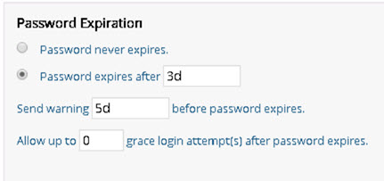
 
Figure 52: Password Expiration Options
 
### Password never expires

This value is stored in the pwdMaxAge attribute of the cn=Password Policy entry. If this option is enabled, then the value is 0d.

### Password expires after a certain amount of time

This value is stored in the pwdMaxAge attribute of the cn=Password Policy entry. If this option is enabled, the value contains the amount of time after which a modified password expires. If this attribute is not present, or if the value is 0d, the password does not expire. If not 0d, the value must be greater than or equal to the value of pwdMinAge (the Allow a password to be changed after a certain number of days parameter). From the Main Control Panel, you can indicate the length of time in any combination of days, hours and/or minutes using “d” for days (e.g. 1d), “h” for hours (e.g. 4h), and “m” for minutes (e.g. 5m). A value of 1d 5h 45m would indicate a password expires after 1 day, 5 hours and 45 minutes.

>[!note] Your password policy must uphold the following rule: pwdMinAge + pwdExpireWarning < pwdMaxAge.

If a user’s password is expired, the next time a client (on the user’s behalf) connects to RadiantOne, the bind will fail and the additional information returned to the client indicates the password has expired. An example using an ldapsearch command line client by a user identified as “tuser” is shown below.

`ldapsearch -h 10.11.12.164 -p 2389 -D "uid=tuser,ou=people,o=global" -w password -b "o=global" "(uid=tuser)"`
<br>`ldap_simple_bind: Invalid credentials`
<br>`ldap_simple_bind: additional info: Password has expired.`

During the bind, RadiantOne calculates if the user’s password has expired and returns the bind response and additional information to the client. It is up to the client to prompt the user to reset their password, if this functionality is desired.

The user entry stored in RadiantOne doesn’t contain an attribute that indicates a user’s password has expired. However, the entry contains an attribute (passwordExpWarned) indicating when the password expiring warning was send in the bind response.

`dn: uid=tuser,ou=people,o=global`
<br>`passwordExpWarned: 20170622194148.238Z`

### Send a warning before the password expires

This value is stored in the pwdExpireWarning attribute of the cn=Password Policy entry. It contains the amount of time before a password is due to expire in which case an expiration warning message is returned to an authenticating user. From the Main Control Panel, you can indicate the length of time in any combination of days, hours and/or minutes using “d” for days (e.g. 1d), “h” for hours (e.g. 4h), and “m” for minutes (e.g. 5m). A value of 1d would indicate a password expiration warning should be sent 1 day prior to the password expiring.

If this attribute is not present, or if the value is 0d no warnings are returned. If not 0d, the value must be smaller than the value of the pwdMaxAge attribute.

>[!note] Your password policy must uphold the following rule: pwdMinAge + pwdExpireWarning < pwdMaxAge.

When this is configured, a control is returned with the BindResponse (even if the client doesn’t specifically request it) indicating the amount of time until expiration. An example is shown below.

PasswordExpiringControl {2.16.840.1.113730.3.4.5 false secondsUntilExpiration=432000}

### Allow a certain number of login attempts after the password expires

These are known as grace logins. The value of this parameter is stored in the pwdGraceAuthNLimit attribute of the cn=Password Policy entry. The parameter specifies the number of times an expired password can be used to authenticate. If this attribute is not present, or if the value is 0, authentication fails if the password has expired.

During the grace login attempts, bind requests are processed. However, the subsequent operation after the bind must be a modifyRequest to change the password. Otherwise, an error message is returned indicating “You must change your password before submitting any other requests”.

## Password Content

The following are the password content options.
-	Password minimum length
-	Minimum required digit (0-9) characters
-	Minimum required uppercase (A-Z) characters
-	Minimum required lowercase (a-z) characters
-	Minimum required special characters
-	Password encryption

If more complex password content is required, the Password Strength Rule can be used.

Each of these properties is described below.
 
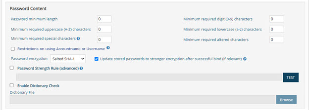

Figure 53: Password Content and Account Lockout Options

### Enabled

This option is only applicable to custom password policies.

Custom policies can enforce specific password content criteria or inherit from the default policy. If enabled, the custom policy password contents are enforced and override the conditions defined in the default policy. A value of 0 means unlimited, NOT undefined.

If not enabled, the default policy dictates the password content criteria.

### Password minimum length

This value is stored in the pwdMinLength attribute of the cn=Password Policy entry. This attribute holds the minimum number of characters that must be used in a password. If this attribute is not present, no minimum password length is enforced.

### Minimum Required Digit Characters

This value indicates the number of required numerical characters required in passwords.

### Minimum Required Uppercase Characters

This indicates the number of uppercase characters required in passwords.

### Minimum Required Lowercase Characters

This value indicates the number of lowercase characters required in passwords.

### Minimum Required Special Characters

This value indicates the number of special characters required in passwords.

### Minimum Required Altered Characters

This value indicates the number of characters that must vary between the old password and the new password. This option requires enabling both “User must change password after reset” and “Require existing password in order to change password” in the Password Change section of the password policy.

>[!note] This leverages the Damerau Levenshtein algorithm to determine the variation of characters between the old and new passwords.

### Restrictions on Using Accountname or Username

This value is stored in the pwdEnableNotContainNames attribute of the cn=Password Policy entry and has a value of true or false. If true, the user’s password must not contain the user’s accoutname or parts of the user’s full name that exceed two consecutive characters.

For the accountname value, the sAMAccountname attribute is checked first. If sAMAccountname is not found, the uid attribute is checked. If uid is not found, rdn value is checked. For the user’s full name, the attribute displayName is checked. If displayName is not present, cn is checked. If the cn attribute is not found, the full name is computed (givenName+sn) and checked. These checks are not case-sensitive.

### Password Encryption

The passwords that are stored in a RadiantOne Universal Directory store may be hashed using any of the following methods: Clear, CRYPT, MD5, PBKDF2AD, Salted SHA-1, Salted SHA-256, Salted SHA-384, Salted SHA-512, and SHA-1. The least secure methods of CRYPT, MD5, and SHA-1 have been hidden as options from the Main Control Panel.

>[!warning] PBKDF2AD is the required password encryption expected in Azure AD. Therefore, if your HDAP store (or persistent cache) will be synchronized to Azure AD, and passwords are a part of the synchronization, use the PBKDF2AD encryption option to store passwords in the RadiantOne Universal Directory.

### Automatic Update to Stronger Password Hash

If the “Update stored passwords to stronger encryption after successful bind” is enabled, user accounts that contain a password hashed with a less secure method than allowed for the current password policy are automatically updated to the stronger hash after a successful bind. The only exception to this is for passwords that have a current hash of: PKCS5S2, PBKDF2, PBKDF2AD, SCRYPT, BCRYPT, SMD4, or MD4, in which case the hashing is not changed. This value is stored in the pwdEnableAlgorithmUpgrade attribute of the cn=Password Policy entry and has a value of True or False.

The strength order is as follows:

`CLEAR -> CRYPT -> MD5 -> SHA1 -> SSHA1 -> SHA256 -> SSHA256 -> SHA384 -> SSHA384 -> SHA512 -> SSHA512 -> (PKCS5S2 | PBKDF2 | PBKDF2AD | SCRYPT | BCRYPT | SMD4 | MD4)`

>[!note] PKCS5S2, PBKDF2, PBKDF2AD, SCRYPT, BCRYPT, SMD4, and MD4 are considered as special hashes of the strongest ranking.

### Password Strength Rule

The default options for enforcing password content are based on an AND operation. For example, if you set a minimum password length, minimum number of required digits, and a minimum number of required uppercase letters, the rule would be expressed as follows.

`<min password length> AND <min # of digits> AND <min # uppercase letters>.`

The Password Strength Rule option allows you to define and test password strength requirements that are more complex using an OR condition. For example, you could use the Password Strength Rule option to require a password to have 'n' number of special characters OR 'n' number of Upper Case characters. In another example, a password strength rule requiring at least six total characters, with at least one lower case, at least one uppercase letter, and at least one digit OR one symbol would be expressed in the Password Strength Rule field as follows.

`^.(?=.{6,})(?=.[a-z])(?=.[A-Z])(?=.[\d\W]).*$`

Another example would be if you do not want to allow special characters to be used in the password. This would be expressed in the Password Strength Rule field as:
^[a-zA-Z0-9]+$

>[!note] Checking the Password Strength Rule box disables and overrides all other password Content options except Password minimum length and Password encryption.

Enter your password strength rule using regular expression syntax.

Click **Test** to compile your expression.

### Enable Dictionary Check

The Enable Dictionary Check option is comparable to the Strong Password Check plug-in found in legacy LDAP directories. This enables RadiantOne to verify that a user’s password doesn’t contain unallowed strings from a specified dictionary file. This can be used as a method to enforce strong password policies.

>[!warning] The default behavior uses an exact match comparison of the password to a dictionary value. To enforce a contains match comparison, go to the Main Control Panel > Zookeeper tab, navigate to `/radiantone/<version>/<clusterName>/config/vds_server.conf` and click EDIT MODE. Set the following: "enablePwdPolicyDictionarySubstringCheck" : true <BR> The value of “true” must be in all lowercase, as shown above. <BR>You can also set this property using the vdsconfig command line utility, set-property command. For details, see the [Radiantone Command Line Configuration Guide](/command-line-configuration-guide/01-introduction).

To enable this feature:

1.	From Main Control Panel, navigate to the Settings tab >Security > Password policies section.

2.	Locate the Password Content section and check the option to Enable Dictionary Check. This value is stored in the pwdEnableDictionary attribute of the cn=Password Policy entry and has a value of True or False.

3.	Click **Browse** to navigate to the dictionary file. The value for the location of the dictionary file is stored in the pwdDictionaryFile attribute of the cn=Password Policy entry.

    >[!note] The dictionary file must be a text-formatted file containing one dictionary word per line.

4.	Click **Save**.

## Account Activity and Lockout

Accounts may be automatically locked under two circumstances:

1.	If a user has not authenticated successfully to RadiantOne for longer than a specified period of time.

2.	If a user has reached the failed login threshold.

### Keep Track of User’s Last Successful Login Time

If you want to keep track of a user’s last successful login time, enable the option to “Keep track of the user’s last successful logon time” in the Account Activity section of the password policy.

>[!warning] You can exclude pwdLastLogonTime changes from the RadiantOne changelog by setting the following property in ZooKeeper at /radiantone/<Config_Version>/<RadiantOne_ClusterName>/config/vds_server.conf: "skipLoggingIntoChangelogForPwdLastLogonTime" : "true", <BR> This alleviates excessive writing into the changelog when you have a large volume of user login activity. This property is enforced globally and affects all password policies.

You can indicate the frequency that RadiantOne records the time of the last successful authentication. The default value is 0s meaning that the last login time is updated on every successful authentication. To change the default, indicate the length of time in any combination of days, hours and/or minutes using “d” for days (e.g. 1d), “h” for hours (e.g. 4h), and “m” for minutes (e.g. 5m). For example, a value of 1d indicates the last login time is updated if at least 1 day has passed since the last successful authentication. Subsequent successful authentications, within this time frame, do not change the last login time.

>[!warning] There is a performance impact on RadiantOne if you keep track of last successful logins because a write operation is performed with a successful bind. It is recommended that you indicate a frequency for writing the last login and that you test the usage of this feature to determine if the degradation in performance is acceptable for your usage.

If accounts should be automatically locked when a user has not authenticated successfully for a predetermined amount of time, indicate the threshold (number of days) in the “Account Activity” section of the password policy where you see “Lock user’s account if the user is idle longer than <X> days”. The user’s password must be reset to unlock the account. Once the account is unlocked, if it is not used for login longer than the specified time, the account is locked again. If the value is zero days, this means users will never be locked out.

### Lock Accounts Based on Number of Failed Logins

If accounts should be locked out after a failed login threshold is met, check the Accounts may be locked out option in the password policy, and establish the criteria.

-	How may login failures are allowed? Enter this value for X (Lockout account after X login failures).

This value is stored in the pwdMaxFailure attribute of the cn=Password Policy entry and contains the number of failed login attempts to allow. This corresponds to the operational attribute for the user entry named pwdFailureTime which stores the time(s) of the login failure(s).

-	How often to reset the failure count? Enter this value for X (Reset failure count after X minutes).

This value is stored in the pwdFailureCountInterval attribute of the cn=Password Policy entry. This is the temporary interval of time in which RadiantOne keeps track of the number of failed login attempts. For example, if the number of login failures allowed is 2 and the reset failure account is 5 minutes, this means if a user login fails twice within 5 minutes, the account will be locked. If the user logs in unsuccessfully once and then doesn’t try again until after the 5-minute interval has passed, the number of unsuccessful login attempts is reset and the new failed login attempt counts as the first failure instead of the second failure. This relates to the number of values for the pwdFailureTime operational attribute in the user’s entry which is used to determine how many failed logins have been attempted.

>[!note] Once an account is locked, the reset failure count is irrelevant in terms of determining how many failed login attempts have occurred.

-	How long is an account locked out?
    <br>Lockout forever
    <br>Lockout duration X minutes

    This value is stored in the pwdLockoutDuration attribute of the cn=Password Policy entry. This relates to the operational attribute [pwdAccountLockedTime](#pwdaccountlockedtime) in the user’s entry which includes a timestamp indicating when the user’s account became locked. Once a lockout duration has passed, or a user’s password has been reset by an administrator, the account is unlocked. Any user (other than the locked out user) that has the proper permissions (ACI’s) can reset the user’s password.

### Unlocking Accounts

If a user’s account is locked, it can become unlocked by resetting the user’s password. Any user (other than the locked out user) that has the proper permissions (ACI’s) can reset the user’s password. If the lockout policy has a duration period, the account is automatically unlocked after the duration has passed.

## Operational Password Attributes Stored in User Entries

>[!warning] Since these attributes are defined as operational attributes, they do not appear in the user entries unless specifically requested in the search from the client.

### pwdHistory

Stores the previous values used for passwords to prevent users from re-using previous passwords. The number of passwords that are stored is determined by the value set in the pwdInHistory attribute of the Password Policy.

### pwdChangedTime

A Generalized Time attribute containing the time the password was last changed.

### pwdLastLogonTime

Stores the user’s last successful login time (bind) if the “Keep track of the user’s last successful logon time” is enabled.

### pwdAccountLockedTime

A Generalized Time attribute containing the time at which the account was locked. If the account is not locked, this attribute is not present.

If the maximum consecutive login failures (pwdMaxFailure) have been reached during a certain period of time (pwdFailureCountInterval), the user entry will have the operational attribute of: pwdAccountLockedTime and it will contain the time the account became locked.

### passwordExpWarned

A Generalized Time attribute containing the time at which the password expiration warning was first sent to the client.

### pwdFailureTime

A multi-valued Generalized Time attribute containing the times of previous consecutive login failures. If the last login was successful, this attribute is not present. The number of values will be no more than the value defined in Number of Login Failures for the password policy.


Figure 54: Number of Login Failures
 
If the last login was successful, this attribute is not present.

>[!note]
>Once the Reset Failure count has passed, the values of the pwdFailureTime attribute are updated during the next unsuccessful login attempt and the values are removed if the next login is successful.

### pwdGraceUseTime

A multi-valued Generalized Time attribute containing the times of the previous grace logins.

### pwdPolicySubentry

An attribute that contains the DN of the password policy associated with the user. RadiantOne does not write to this attribute or allow password policies to be defined on individual users from the Main Control Panel. However, if the entry was imported from another directory, this attribute could have a value that dictates which password policy affects the user. If the value matches a policy defined in RadiantOne, this policy is enforced for the user. If the value does not match a policy defined in RadiantOne it is ignored and other configured policies below cn=Password Policy,cn=config are checked. If multiple policies affect the user, the one with the highest priority (based on precedence level) is enforced.

### pwdReset

A Boolean attribute containing the value TRUE if the password has been reset and must be changed by the user. If a user’s password is set/reset by the RadiantOne super user (e.g. cn=directory manager), a member of the cn=directory administrators group (cn=directory administrators,ou=globalgroups,cn=config), or the user himself, this does not trigger pwdReset set to TRUE. Only when a user’s password is set/reset by other users (e.g. helpdesk) is the pwdReset set to TRUE. When the affected user logs in with the new password for the first time, they are not allowed to perform operations until they reset their password. For example, if the user attempts a search, RadiantOne responds with error code 53 and a message indicating “You must change your password before submitting any other requests”. After the user updates their password, pwdReset is removed from their entry.

If a user resets their password, RadiantOne performs the following checks based on the password policy:

-	Check if the user is allowed to change their password
-	Check minimum password age
-	Check if old password is provided with new password (if the “Require Existing Password in order to Change Password” policy is enabled)
-	Check the password length
-	Check the password quality (correct number of required characters – upper/lower/number…etc.)
-	Check if the password is in the history
-	Check if the password contains unallowed strings based on a dictionary file

After the BIND response is returned, it is up to the client to prompt the user accordingly (depending on what kind of password policy response or control was returned). 

RadiantOne returns one of the following responses to the client application:

Modify Response Code | Meaning
-|-
53	| User password changes are not allowed. If the “User may change password” is NOT enabled, and a user tries to change their password, they get this error. <br> <br> OR <br> <br> The password cannot be changed because it has not been long enough since the last password change. If a user tries to change their password before the minimum number of days between changes has been reached, they get this error message. <br> <br> OR <br> <br> The bind user’s entry contains pwdReset=TRUE, meaning they must change their password because it has been reset. The error message returned from RadiantOne is “LDAP error code 53 – Reason 773 – User must reset password: You must change your password before submitting any other requests”.
19 | This code could mean any of the following: <br> Not enough time has passed since the password was last changed. If a user tries to change their password before the minimum number of days between changes has been reached, they get this error message. <br> <br> OR <br> <br> The user’s current password must be provided for password changing. If the “Require Existing Password in order to Change Password” option is enabled, and a user tries to change their password and doesn’t provide their existing password, they get this error message. <br> <br> OR <br> <br> The provided password is too short. If the new password doesn’t meet the required length, they get this error message. <br> <br> Invalid password syntax: there must be at least <N> special character(s) in the password. If the new password doesn’t contain the appropriate number of special characters as dictated by the password policy, they get this error message. The <N> is the number required per the policy. <br> <br> Invalid password syntax: there must be at least <N> uppercase character(s) in the password. If a user tries to change their password and it doesn’t contain the appropriate number of upper case characters as indicated in the password policy, they get this error message. The <N> is the number of uppercase characters required. <br> <br> Invalid password syntax: there must be at least <N> numerical character(s) in the password. If a user tries to change their password and it doesn’t contain the appropriate number of numeric characters as dictated by the password policy they get this error. The <N> is the number of numeric characters required. <br> <br> Invalid password syntax: there must be at least <N> lowercase character(s) in the password. If a user tries to change their password and it doesn’t contain the appropriate number of lowercase characters as dictated by the password policy, they get this error message. The <N> is the number of lowercase characters required. <br> <br> OR <br> <br> Password in history. If a user is allowed to change their password and the “Keep password history” option is enabled, and the user tries to change their password to one that is in the “history”, this error message be returned. <br> <br> OR <br> <br> The value is not allowed by the configured password dictionary. Constraint violation.

# Limits

The settings found in the Main Control Panel -> Settings Tab -> Limits section are related to enforcing search size limits and activity quotas. These settings prevent against Denial of Service (DoS) attacks towards RadiantOne. Remember to save any changes you make to limits.

>[!warning] Changing any property in the Limits section requires a restart of the RadiantOne service to take effect. If RadiantOne is deployed in a cluster, restart the service on all nodes.

## Global Limits

The following parameters are configured from the Main Control Panel > Settings Tab > Limits section > Global Limits sub-section.


Figure 55: Global Limits Section
 
### Maximum Connections

The maximum number of client connections the server can accept concurrently (connecting at the exact same time).

#### Manually Closing a Client Connection

A connection can be manually closed by issuing an LDAP search to RadiantOne with the connection ID. The connection ID can be viewed from the Server Control Panel > Usage & Activity tab > Connections & Operations. The connection ID can also be retrieved with a one level search to RadiantOne below cn=monitor. The cn=connection-`<ID>` entries are associated with the current connections. A base search on one of these entries, returns an attribute named connectionID. This attribute contains the identifier for the connection and is what should be used to manually close the connection.

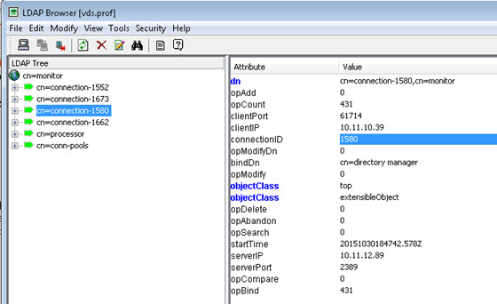

Figure 56: Retrieving Connection ID from cn=Monitor

With the connection ID, connect to RadiantOne as the super user (e.g. cn=directory manager) and perform a search request with a base DN of, action=closeconnection,ID=<connectionID>. An example is shown below using the ldapsearch utility. This example closes the connection associated with ID 148300.

`C:\SunKit>ldapsearch -h 10.11.10.40 -p 2389 -D "cn=directory manager" -w password -b action=closeconnection,ID=148300 (objectlcass=*)`

### Size Limit

The maximum number of entries a search operation can return. This allows for limiting the number of entries LDAP clients can receive from a query. By default this value is set to 0 which means there is no restriction on the size. 

>[!warning]
>This parameter is a global parameter for RadiantOne. If you want more granular, specific size limits set, then you should set them in the Custom Limits sections.

### Time Limit

The time (in seconds) during which a search operation is expected to finish. If a search operation does not finish within this time parameter, the query is aborted. By default, this value is set to 0 which means there is no restriction on time. 

### Look Through Limit

The look through limit is the maximum number of entries you want the server to check in response to a search request. You should use this value to limit the number of entries the server will look through to find an entry. This limits the processing and time spent by the server to respond to potentially bogus search requests (for example, if a client sends a search filter based on an attribute that is not indexed). By default, this is set to 0, which means that there is no limit set for the number of entries that the server will look through.

>[!warning]
>This property is not used by RadiantOne Universal Directory (HDAP) stores.

### Idle Timeout

The length of time (in seconds) to keep a connection open without any activity from the client. The default is 900, which means the idle connection is kept open for 900 seconds and then closed by the server. 

## Custom Limits

Custom limits are more fine-grained than global limits and can be defined in the Main Control Panel > Settings > Limits > Custom Limits section. Custom limits can be configured for the pre-defined users: “Anonymous Users”, and “Authenticated Users”. They can also be more granular and associated with users belonging to any group or located below any branch/naming context (subtree) in RadiantOne.

>[!note]
>Multiple custom limits are not allowed for anonymous users and authenticated users.

Custom limits override any Global Limits defined in the Main Control Panel > Settings tab > Limits section > Global Limits sub-section. The order of precedence (highest to lowest) for global and custom limits containing the same subject is: Group, Sub-tree, Authenticated Users, Anonymous Users, Global. For custom limits defined within the same root naming context, the limit defined for the deepest entry in the tree will take precedence. For example, if a custom size limit of 3 is defined for a subject location of ou=Novato,ou=California,dc=USA and a size limit of 5 is defined for a subject location of ou=California,dc=USA, if a user of uid=Svc1,ou=Novato,ou=California,dc=USA connects to RadiantOne, the custom size limit of 3 will be enforced.

>[!note]
>This section is accessible only in [Expert Mode](01-introduction#expert-mode).

### Granular Limits

To define custom limits:
1.	Click **ADD** in the Custom Limits section.

2.	Select a subject from the drop-down list. The possible subjects are described below.
    -	Sub-tree - the location (base DN) in the RadiantOne namespace containing the users that are affected by the custom limits.
    -	Group – a group entry in the virtual namespace. All members of this group are affected by the custom limits.
    -	Anonymous users – any authenticated users or anonymous users.
    -	Authenticated Users – any authenticated users.

3.	Click **CHOOSE** to browse and select a subject location – if sub-tree is selected, the subject location is the base DN containing the users that are affected by the custom limits. If group is selected, the subject location is the DN of the group entry. All members of this group are affected by the custom limits. If authenticated users or anonymous users are selected, subject location is irrelevant.

4.	Enter a value for maximum connections. This is the maximum number of concurrent connections the subject can create. By default, this value is set to 0 which means there is no restriction on maximum connections.

5.	Enter a value for size limit. This is the maximum number of entries a search operation can return. This allows for limiting the number of entries LDAP clients can receive from a query. By default, this value is set to 0 which means there is no restriction on the size. 

6.	Enter a value for idle timeout. This is the length of time (in seconds) to keep a connection open without any activity from the client. By default, this value is set to 0 which means there is no restriction on idle time.

7.	Click **OK**.

8.	Click **Save**. The RadiantOne service needs to be restarted.

### Number of Processing Queues

If you are running RadiantOne on a multi-processor machine, performance and efficiency of the server might improve by increasing the value for the Number of Processing Queues parameter. The default value is 2 and is sufficient for most deployments. As a general guideline, this value should never exceed 3.

>[!warning] This parameter does not affect the actual number of processors that get used. However, it does improve the utilization of the available processors.

A better indicator for performance is the number of threads allocated for each processing queue. For each processing queue, the maximum number of concurrent worker threads is 80 by default. This value can be seen/changed in the Max Concurrent Working Threads parameter. For more details, see the next section.

After making changes, click **Save**. RadiantOne must be restarted for the changes to take effect. If deployed in a cluster, restart the service on all nodes.

### Maximum Concurrent Working Threads

This is the number of threads the virtual directory server uses for handling client requests. In other words, this defines the number of concurrent LDAP requests RadiantOne can handle. If there are backends involved (e.g. proxy views without persistent cache), then you must also consider how the backend handles the level of concurrency you define here as well because requests made to RadiantOne may directly result in concurrent requests sent to the backend(s).

The default value is 16, which means 16 worker threads allocated per processing queue defined in the Number of Processing Queues property. This amount is sufficient for most deployments and generally should not be modified unless recommended by Radiant Logic. You might be able to increase this number if:

-	You are using a multiprocessor system - Multiprocessor systems can support larger thread pools than single processor systems. See the Number of Processors parameter above.

-	Clients connecting to RadiantOne perform many time-consuming operations simultaneously (like complex searches or updates).

-	RadiantOne needs to support many simultaneous client connections.

It is difficult to provide an exact formula for determining the optimal number of maximum concurrent working threads to set because it depends on the machine and environment where RadiantOne is running. Generally, the value for concurrent working threads should not be modified unless recommended by Radiant Logic. If it is modified, you must verify the value you set with testing. Incrementally change the value and retest. In the test results, you should start to see performance peak and then a decrease. The peak in the curve should represent the optimal setting.

### Max Pending Connection Requests

The max pending connection property represents a queue of server socket connections associated with requests from clients. This is not managed by the RadiantOne process. As soon as a TCP connection is established to RadiantOne, the connection is removed from the pending queue. A maximum number of pending client requests can be set in the Max Pending Connection Requests parameter. This parameter should not be changed unless advised by a Radiant Logic Support Engineer. 

## Access Regulation

After a client connects to the RadiantOne service, the amount of activity they perform can be limited by configuring access regulation. The activity checking can be performed based on the user that connects to RadiantOne and/or what computer/client (IP address) they are connecting from.

The “Restrictions Checking Interval” parameter indicated in the Per User or Per Computer sections is the time frame in which the activity (max binds and max operations) is monitored. Once the time interval is reached, the counts are reset. For example, if Special Users Group checking is enabled, and the checking interval, max bind operations per checking interval and max operations per checking interval are set to 300, 30 and 10 respectively, during a 5 minute (300 secs) period, anyone who is a member of the special users group can bind no more than 30 times to the RadiantOne service and not perform more than 10 operations. This count resets every 5 minutes. If a user attempts to perform more than the allowed number of operations, the RadiantOne service refuses the operation and the client must wait until the checking interval resets.

### Per User

The following groups of users found on the Main Control Panel > Settings tab > Limits section > Per User sub-section allow you to configure fine-grained activity control:

>[!note]
>Members of the Administrators group specified on the Main Control Panel > Settings Tab > Server Front End > Administration section do not have any access limitations in terms of max connections or max operations per second.

### Anonymous

An anonymous user is a client who connects anonymously (no username or password) to the RadiantOne service. To enable checking for this category of user, check the Enable Access Checking option in the Anonymous section of the Per User Category sub-section. Enter a number for the maximum bind operations that anonymous users are allowed to perform. Also enter a number for the maximum number of operations per checking interval they are allowed to issue. Any parameters that are set to 0 have no limits applied. The restrictions checking interval dictates the number of seconds the server should wait before determining if these thresholds are reached.

### Authenticated Users

An authenticated user encompasses any client who successfully authenticates no matter which group they are a member of. To enable checking for this category of users, check the Enable Access Checking option in the Authenticated Users section of the Per User Category sub-section. Enter a number for the maximum bind operations that authenticated users are allowed to perform. Also enter a number for the maximum number of operations per checking interval they are allowed to issue. Any parameters that are set to 0 have no limits applied. The restrictions checking interval dictates the number of seconds the server should wait before determining if these thresholds are reached.

### Special Users Group

Special Users are anyone who successfully binds and is a member of the special user group defined on the Main Control Panel > Server Front End > Administration section. To enable checking for this category of users, check the Enable Access Checking option in the Special Users Group section in the Per User Category sub-section. Enter a number for the maximum bind operations that users in the Special Users Group are allowed to perform. Also enter a number for the maximum number of operations per checking interval they are allowed to issue. Any parameters that are set to 0 have no limits applied. The restrictions checking interval dictates the number of seconds the server should wait before determining if these thresholds are reached.

### Per Computer/Client

Computers/client applications are identified by their IP address. IP configurations are located on the Main Control Panel > Settings Tab > Limits Section > Per Computer sub-section. These settings allow you to configure fine-grained activity control per computer/client machines.

### IP address

All client machines fall into this category. To enable checking for this category of computer, check the Enable Access Checking option in the IP Address section of the Per Computer sub-section. Enter a number for the maximum amount of connections all computers are allowed to create. Also enter a number for the maximum number of operations per checking interval they are allowed to issue. Any parameters that are set to 0 have no limits applied. The restrictions checking interval dictates the number of seconds the server should wait before determining if these thresholds are reached.

### Special IP Address 

Any client who connects from one of the IP addresses listed in the Special IP Addresses parameter. 

Both IPv4 and IPv6 addresses are supported, and you can indicate a range of IP addresses using “/”. A mix of IPv4 and IPv6 can also be used. 

Example set for a range of IPv4 addresses: 

`10.11.12.0/24    which represents the given IPv4 address and its associated routing prefix 10.11.12.0, or equivalently, its subnet mask 255.255.255.0, which has 24 leading 1-bits. This covers the range between 10.11.12.0 to 10.11.12.255.`

Example set for a range of IPv6 addresses:

`2001:db8::/32    which covers the range between 2001:db8:0:0:0:0:0:0 to 2001:db8:ffff:ffff:ffff:ffff:ffff:ffff`

To enable checking for this category of computer/client, check the Enable Access Checking option in the Special IP Address section on the Per Computer sub-section. Enter a number for the maximum amount of connections all computers are allowed to create. Also enter a number for the maximum number of operations per checking interval they are allowed to issue. Any parameters that are set to 0 have no limits applied. The restrictions checking interval dictates the number of seconds the server should wait before determining if these thresholds are reached.

>[!warning]
>If you have enabled activity checking for both users (special users, authenticated and/or anonymous) and computers (IP address and Special IP), the activity per computer takes precedence over the user activity. The order of precedence is special IP addresses, IP addresses, special users, authenticated users, and then anonymous users. For example, let’s say that special user access checking, IP address access checking, and special IP address access checking have been enabled, and the max connections are set to 50, 30, and 40 respectively. Any user who connects that is a member of the special users group from a computer that is not a member of the special IP address group, is only allowed to make a maximum of 30 connections during the checking interval.

