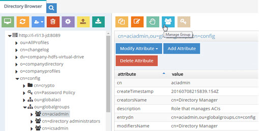
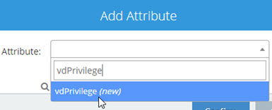
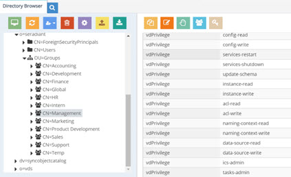

# Administration and Configuration

## Identity Service Wizards

RadiantOne includes a set of wizards to assist administrators with some of the most common configuration tasks. They are designed to guide administrators through the creation of an identity service. This includes tasks such as building a unique user list, how to handle group entries (migrate them or create dynamic groups), and how to design the namespace (flat tree or merge into an existing hierarchy). Each wizard is tailored for specific use cases, depending on the needs of the applications that will be consuming the identity service.

The wizards are launched from the [Wizards Tab](wizards-tab#wizards-tab) in the Main Control Panel. The RadiantOne service must be running prior to launching a wizard and can be started from the Dashboard tab in the Main Control Panel if needed.

Below is a summary for each wizard. For more information including configuration steps, please see the Identity Service Wizards Guide.

### Directory Tree Wizard

The Directory Tree Wizard creates a virtual view which can aggregate multiple types of backends (combination of directories, database, web services, and so on) under a naming context. The wizard guides you through creating the root naming context, creating levels of hierarchy beneath the root naming context, and mounting LDAP and database backends to leaf nodes.

Data sources that you connect to in the Directory Tree Wizard must be configured prior to reaching the Define Backends page of the wizard. This can be done before launching the wizard from the Main Control Panel > Settings tab > Server Backend section.

### Identity Data Analysis

The RadiantOne Identity Data Analysis tool analyzes the quality of data in the backends, helping you determine which attributes would be the best candidates for correlation rules in addition to providing other information that is important for sizing and tuning your identity service. 

The Identity Data Analysis tool generates a report for each of your data sources. These reports give a glimpse of the data and provide insight on the quality and size. This provides RadiantOne administrators with valuable information about what can be used for correlation logic and join rules. You can mount virtual views from each of your data sources below a global root naming context in the RadiantOne namespace and point the Identity Data Analysis tool to this location to perform a single analysis/report from all sources at once. This helps to detect attribute uniqueness and calculate statistics across heterogeneous data sources.

### Global Identity Builder

The Global Identity Builder can be used in situations where applications require a single data source to locate all users required for authentication and/or need to access a complete user profile for attribute-based authorization. The overlapping identities do not need to have a single common identifier, because a combination of matching rules can be used to determine a link. The Global Identity Builder creates a unique reference list of identities spread throughout multiple data silos. An existing single source of identities is not required. For details, please see the RadiantOne Global Identity Builder Guide.

### Groups Builder

The Groups Builder Wizard manages virtual views for defining groups and members. With this wizard, you can define rules for dynamically creating groups from multiple heterogeneous data sources. Administrators can utilize this wizard to either create user-defined or auto-generated groups. 

For more information on [groups](concepts#groups) supported in RadiantOne please see [Concepts](concepts.md).

The Groups Builder wizard should be used in situations where applications are accessing RadiantOne to retrieve groups/membership for enforcing authorization and a list of applicable groups either does not currently exist in any backend data source or the existing groups are insufficient because they lack all the required members. This wizard should be used if there is the need to add new members into existing groups or if there is the need to build entirely new global groups containing members from multiple different data sources.

### Groups Migration

Existing group membership references user DNs, the naming of which is based on the structure of the LDAP directory. When you model a new directory namespace with virtualization, the user DNs change. The four steps in the Group Migration Wizard assist with the effort of translating the existing group membership to match the new namespace. 

### Merge Tree

The Merge Tree Wizard merges multiple data sources into a single RadiantOne naming context, while maintaining the underlying directory hierarchy. The Merge Tree Wizard is ideal for situations where applications expect to find information in an explicit hierarchy which already exists in a backend LDAP directory and there is a need to extend a part of this hierarchy with additional entries from other data sources. 

>[!warning] The Merge Tree Wizard does not perform identity correlation or joins. If the data sources being merged contain overlapping users (identified by the same DN after the merge) only the entry from the primary/main source are returned when browsing or searching against the view. If the overlapping users have an attribute in common, you can always join the view created in the merge tree wizard with another virtual view to return attributes from other sources.

## Delegated Administration of RadiantOne

Any user that can bind to RadiantOne can potentially administrator the server if they belong to the proper group. A user can belong to multiple groups and the value(s) of the vdPrivilege operational attribute assigned to the group entry dictates the operations that members are authorized to do. The following administration groups are defined for RadiantOne:

**Directory Administrator Role** – members of this group can perform all operations (all operations that the other groups defined below can perform) in addition to:

-	Change privileges for the delegated roles

-	Update username and password properties for data sources via LDAP modify command

These functions are dictated by the following values of the vdPrivilege attribute in the group entry: 

```
- config-read
- config-write
- services-restart
- services-shutdown
- update-schema
- instance-read
- instance-write
- acl-read
- acl-write 
- naming-context-read
- naming-context-write
- data-source-read
- data-source-write
- data-store-read
- data-store-write
- ics-admin
- tasks-admin
- globalidviewer-read
- globalidviewer-write
- globalidviewer-designer
```

The group entry is located in the RadiantOne namespace at:
cn=directory administrators,ou=globalgroups,cn=config

**Read Only Role** – Members of this group can perform the following operations:

-	Read RadiantOne configuration 
-	Read settings for any configured instances
-	Read naming context configurations
-	Read configured data sources and view synchronization topologies on the Global Sync Tab
-	Log into the Global Identity Viewer console and access the Global Identity Viewer application

These functions are dictated by the following values of the vdPrivilege attribute in the group entry: 

```
- config-read
- instance-read
- naming-context-read
- data-source-read
- globalidviewer-read
```

The group entry is located in the RadiantOne namespace at:
cn=readonly,ou=globalgroups,cn=config

**Namespace Administrator Role** – Members of this group can perform the following operations:

-	Read RadiantOne configuration 
-	Restart the RadiantOne service from Main Control Panel 
-	Create, update, or delete naming contexts 
-	Create, update, or delete backend mappings
-	Create, update, and manage persistent cache
-	Create, update, or delete data sources
-	Create, update, or delete RadiantOne Universal Directory (HDAP) stores
-	Update RadiantOne LDAP schema
-	Launch tasks
-	View synchronization topologies and manage synchronization components on the Global Sync Tab

These functions are dictated by the following values of the vdPrivilege attribute in the group entry:

```
- config-read
- config-write
- services-restart
- update-schema
- naming-context-read
- naming-context-write
- data-source-read
- data-source-write
- data-store-read
- data-store-write
- tasks-admin
- ics-admin
```

The group entry is located in the RadiantOne namespace at:
cn=namespaceadmin,ou=globalgroups,cn=config

**Operator Role** – Members of this group can perform the following operations:

-	Read RadiantOne configuration 
-	Create, update, or delete RadiantOne Universal Directory (HDAP) Stores
-	Restart the RadiantOne service from the Main Control Panel
-	Stop the RadiantOne service from the Main Control Panel
-	Launch tasks
-	View synchronization topologies and manage synchronization components on the Global Sync Tab

These functions are dictated by the following values of the vdPrivilege attribute in the group entry:

```
- config-read
- config-write
- services-restart
- services-shutdown
- data-store-read
- data-store-write
- tasks-admin
- naming-context-read
```

The group entry is located in the RadiantOne namespace at:
cn=operator,ou=globalgroups,cn=config

**Schema Administrator Role** – Members of this group can perform the following operations:

-	Read RadiantOne configuration 
-	Create, update or delete schema objects (objectclasses or attributes)
-	Extend RadiantOne LDAP schema with objects and attributes from orx files
-	Create, update or delete data sources
-	View synchronization topologies and manage synchronization components on the Global Sync Tab

These functions are dictated by the following values of the vdPrivilege attribute in the group entry:

```
- config-read
- update-schema
- data-source-read
- data-source-write
```

The group entry is located in the RadiantOne namespace at:
cn=schemaadmin,ou=globalgroups,cn=config

**ACI Administrator Role** – Members of this group can perform the following operations:

-	Read RadiantOne configuration 
-	Create, update and delete access controls
-	View synchronization topologies and manage synchronization components on the Global Sync Tab

These functions are dictated by the following values of the vdPrivilege attribute in the group entry: 

```
- config-read
- acl-read
- acl-write 
- naming-context-read
```

The group entry is located in the RadiantOne namespace at:
cn=aciadmin,ou=globalgroups,cn=config

**ICS Administrator Role** – Members of this group can perform the following operations:

-	Read RadiantOne configuration 
-	Stop and start pipelines on the Global Sync Tab
-	Log into the Global Identity Viewer Console and access all applications

These functions are dictated by the following values of the vdPrivilege attribute in the group entry:

```
- config-read
- config-write
- naming-context-read
- data-source-read
- ics-admin
- ics-workflow-approve
- tasks-admin
- globalidviewer-read
- globalidviewer-write
- globalidviewer-designer
```

The group entry is located in the RadiantOne namespace at:
cn=icsadmin,ou=globalgroups,cn=config

**ICS Operator Role** – This role varies from the ICS Admin role in that this role cannot perform uploads from the Global Sync tab, nor can it modify connector properties. Members of this group can perform the following operations:

-	Read RadiantOne configuration 
-	Log into the Global Identity Viewer Console and access all applications

These functions are dictated by the following values of the vdPrivilege attribute in the group entry:

```
- config-read
- ics-operator
```

The group entry is located in the RadiantOne namespace at:
cn=icsoperator,ou=globalgroups,cn=config

### Managing Default Delegated Administration Roles

As mentioned above, the groups used for delegated administration are Directory Administrator, Namespace Administrator, Operator, Read Only, Schema Administrator, ICS Administrator, ICS Operator and ACI Administrator. These roles can be assigned to static members or dynamic members. Both are described below. Any user that is assigned to one of the delegated administration roles can login to the Control Panels and manage certain server settings based on the privileges (vdPrivilege attribute) assigned to the role. 

>[!note] remember that you might require a [User ID to DN Mapping](interception#user-to-dn-mapping) configuration depending on the ID that users log in with (their full DN versus just an ID).

>**Delegated administrators do not have default permissions to manage virtual entries in the directory. If this is required, assign the proper [access controls](access-control#access-control) for the delegated admin groups.**

#### Managing Explicit Members

>[!warning] it is generally advised to assign only local (in a RadiantOne Universal Directory store) user accounts to delegated admin roles. Although you can assign any user in the RadiantOne namespace to a delegated admin role, use caution with this approach because if the backend isn’t accessible, then the user login to the Control Panel will fail and the user will not be able to administer RadiantOne. Also, performance can be degraded because RadiantOne must delegate the bind (authentication) to the backend instead of processing it locally.

1.	Log into the Main Control Panel as the super user and click on the Directory Browser tab.

2.	Navigate below ou=globalgroups,cn=config node to locate all of the groups.

3.	Select the group you want to manage and click  (Manage Group). From here you can remove users from groups and search for new users (located anywhere in the virtual namespace) to add to groups.


 
Figure 1: Manage Group Members

#### Managing Dynamic Members

Figure 1: Manage Group Members

>[!warning] It is generally advised to assign only local (in a RadiantOne Universal Directory store) user accounts to delegated admin roles. Although you can assign any user in the RadiantOne namespace to a delegated admin role, use caution with this approach because if the backend isn’t accessible, then the user login to the Control Panel will fail and the user will not be able to administer RadiantOne. Also, performance can be degraded because RadiantOne must delegate the bind (authentication) to the backend instead of processing it locally.

1.	Log into the Main Control Panel as the super user and click on the Directory Browser tab. 

2.	Navigate below ou=globalgroups,cn=config node to locate all of the groups. 

3.	Select the group you want to manage and on the right side, select the objectclass attribute.

4.	Choose Modify Attribute > Add Value.

5.	Enter a new value of groupOfURLS and click **OK**.

6.	Select the group entry and click  (Manage Group).

7.	Click **Edit Dynamic Members**. From here you can manage the criteria for dynamic members.


Figure 2: Manage Group Window

8.	Click **Add Member(s)**.

9.	Enter the base DN where users/potential group members are located, or click  to navigate to this location.

10.	Select the scope associated with the base DN to locate potential members.

11.	Enter an LDAP filter that qualifies group members (e.g. l=Casper, meaning all users that have a location of Casper would be a member of the group).

12.	Click **Confirm**.

13.	Either add more members, or click **Close** to close the window.

14.	After the configuration, the group entry has a memberURL attribute that contains the criteria for group members.

15.	Now, configure RadiantOne to translate the dynamic group criteria into static members by setting Special Attributes Handling for Dynamic Groups. Navigate to the Main Control Panel > Settings tab.

16.	Switch the Control Panel to [Expert Mode](introduction#expert-mode).

17.	After the browser reloads, navigate to the Settings tab > Interception > Special Attributes Handling.

18.	In the Dynamic Group section click **Add**.

19.	Click **Choose** and either navigate to the exact dynamic group entry or the parent node where all of your dynamic groups are located. For example, if you wanted all of the delegated admin groups to be dynamic, you can select the cn=config branch in the RadiantOne namespace like shown in the screen below.

20.	Click **OK**.


Figure 3: Dynamic Group Setting

21.	Set the member attribute to either member or uniqueMember (to match your membership attribute) and click Save in the upper right.

Any user that is dynamically assigned to a delegated admin group can log in to the Control Panel and administer the server based on the role they are associated with.

### Managing Default Delegated Administration Users

As mentioned above, the groups used for delegated administration are Directory Administrator, Namespace Administrator, Operator, Schema Administrator, ACI Administrator, ICS Administrator, ICS Operator, and one role for Read Only access.

>[!note] Delegated administrators do not have default permissions to manage virtual entries in the directory. If this is required, assign the proper [access controls](access-control#access-control) for the delegated admin groups.

Default administrative users are included as members of these groups. They are as follows:

><span style="color:lightblue">uid=aciadmin,ou=globalusers,cn=config</span>
<br> Member of the ACI Administrator Group.

><span style="color:lightblue">uid=namespaceadmin,ou=globalusers,cn=config</span>
<br>Member of the Namespace Administrator Group.

><span style="color:lightblue">uid=operator,ou=globalusers,cn=config<span>
<br>Member of the Operator Group.

><span style="color:lightblue">uid=schemaadmin,ou=globalusers,cn=config</span>
<br>Member of the Schema Administrator Group.

><span style="color:lightblue">uid=superadmin,ou=globalusers,cn=config<span>
<br>Member of the Directory Administrator Group.

><span style="color:lightblue">uid=icsadmin,ou=globalusers,cn=config</span>
<br>Member of the ICS Administrator Group.

><span style="color:lightblue">uid=icsoperator,ou=globalusers,cn=config</span>
<br>Member of the ICS Operator Group.

><span style="color:lightblue">uid=readonly,ou=globalusers,cn=config</span>
<br>Member of the Read Only Group.

You can use the default users for delegated administration of RadiantOne activities, or you can add your own users to the various admin roles as described in the [Managing Delegation Administration Roles](#managing-default-delegated-administration-roles). To use the default users, you can log in with any of the following (depending on the RadiantOne configuration you want to manage). For details on what activities these users can perform, please see [Delegated Administration of RadiantOne](#delegated-administration-of-radiantone).

>[!note] for details on how to update the default delegate admin user’s passwords, see the RadiantOne Hardening Guide.

user: aciadmin
<br> password: <set to the same password you defined for the super user (cn=directory manager) during the installation>

user: namespaceadmin
<br> password: <set to the same password you defined for the super user (cn=directory manager) during the installation>

user: operator
<br> password: <set to the same password you defined for the super user (cn=directory manager) during the installation>

user: schemaadmin
<br> password: <set to the same password you defined for the super user (cn=directory manager) during the installation>

user: superadmin
<br> password: <set to the same password you defined for the super user (cn=directory manager) during the installation>

user: icsadmin
<br> password: <set to the same password you defined for the super user (cn=directory manager) during the installation>

user: icsoperator
<br> password: <set to the same password you defined for the super user (cn=directory manager) during the installation>

user: readonly
<br> password: <set to the same password you defined for the 
super user (cn=directory manager) during the installation>

The reason you can login with just the user ID as opposed to the full DN is because a default [user ID to DN mapping](interception#user-to-dn-mapping) has been configured for the cn=config branch in RadiantOne. This allows RadiantOne to identify the proper user DN based on the ID they log into the Main Control Panel with. This default mapping is shown below.


 
Figure 4: Default User ID to DN Mapping Rule

### Leveraging Existing Groups for Delegated Administration

As an alternative to using the [default delegated admin groups](administration-and-configuration#delegated-administration-of-radiantone) for enforcing authorization in the Control Panels, you can leverage your existing groups for these roles. Your groups and members must be in either a RadiantOne Universal Directory store, or persistent cache. If you choose to use your own existing groups and users, the [default delegated admin users](administration-and-configuration#delegated-administration-roles) will not be able to log into the Control Panel.

>[!warning] if your users and groups are in a persistent cache, the bind (credentials-checking) step during the login to the Control Panel is delegated to the backend directory for validation. If the backend isn’t accessible, then the user login to the Control Panel will fail and the user will not be able to administer RadiantOne. Also, performance can be degraded because RadiantOne must delegate the bind to the backend instead of processing it locally.

To configure groups and users for delegated administration, follow the steps below.

1.	The groups and users that you want to use for delegated administration must all be located under the same root naming context. Either import your groups and users into a RadiantOne Universal Directory store (e.g. import an LDIF file), or create a virtual view of groups and users and configure it as persistent cache. For assistance on creating RadiantOne Universal Directory stores, see the RadiantOne Namespace Configuration Guide. For assistance on configuring persistent cache, see the RadiantOne Deployment and Tuning Guide.

2.	(Optional) If your groups and users are in persistent cache, go to the Main Control Panel > Directory Namespace > Cache node and select your cache branch. On the Properties tab on the right, enter vdPrivilege in the Extension Attributes list and click Save.


Figure 5: Entering vdPrivilege in the Extension Attributes Field

3.	Navigate to the Main Control Panel > Directory Browser tab.

4.	Navigate to the group location and select the group that you want to be associated with a delegated administrator role. Click **Add Attribute** and enter the name vdPrivilege and enter a value associated with the [delegated admin role](#delegated-administration-roles).



Image 6: Modify Attribute > Add Value
 
5.	Select the vdPrivilege attribute and click **Modify Attribute > Add Value**.


Image 7: Adding the vdPrilvilege Attribute

6.	Add a required value for the role. The required values and corresponding roles are described in [Delegated Administration Roles](#delegated-administration-roles).

7.	In the Add Value window, click  to add another value. Repeat this step to add all required values as outlined in [Delegated Administration Roles](#delegated-administration-roles). Click **Confirm** after all values have been added. In the example below, a group named Management has been assigned the privileges required for the Directory Administrator role.


 
Figure 8: Example of Assigning an Existing Group to the Directory Administrator Role

>[!note] Delegated administrators do not have default permissions to manage virtual entries in the directory. If this is required, assign the proper [access controls](access-control#access-control) for the delegated admin groups.

8.	Go to the Main Control Panel > Zookeeper tab (requires [Expert Mode](introduction#expert-mode)).

9.	Navigate to /radiantone/v1/cluster/config/vds_server.conf.

10.	Click **Edit Mode**.

11.	Locate the “roleBase” property and set the value to the root naming context where your users and groups are located (e.g. “roleBase” : “o=companydirectory”,).

12.	Locate the “roleName” property and set the value to the RDN/attribute name containing the group name (e.g. “roleName” : “cn”,).

13.	Locate the “roleSearch” property and if the group objectclass stores the members in the uniqueMember attribute, set the value to: "(uniqueMember:1.2.840.113556.1.4.1941:={0})",
<br> If the group objectclass stores the members in the member attribute, set the value to "(member:1.2.840.113556.1.4.1941:={0})",

14.	Click **Save**.

15.	To test, logout of the Control Panel and login with a user that is a member of one of your existing groups. Make sure the user can perform the activities associated with their role as outlined in [Delegated Administration Roles](#delegated-administration-roles). Remember, you must either use the full user DN as the login name, or define the proper User to DN mapping rules to allow the user to login with just an “ID”.


 
Figure 9: Example of User Login with Full DN

#### Delegated Administration Roles

The roles and corresponding required permissions are described in the table below.

Role	| Required Permissions (Value of vdPrivilege)
-|-
<span style="color:lightblue">Directory Administrator</span> <br> Members of this group can perform all operations (all operations that the other groups defined below can perform) in addition to:<br>Change privileges for the delegated roles<br>Access the Global Sync Tab <br>Update username and password properties for data sources via LDAP modify command | <span style="color:lightblue">config-read <br>config-write <br>services-restart <br> services-shutdown <br>update-schema <br>instance-read <br>instance-write <br>acl-read <br>acl-write <br>naming-context-read <br>naming-context-write <br>data-source-read <br>data-source-write <br>data-store-read <br>data-store-write <br>ics-admin <br>tasks-admin <br>globalidviewer-read <br>globalidviewer-write </span>
<span style="color:lightblue">Read Only</span> <br> Members of this group can read the RadiantOne configuration, read settings for any configured instances, read naming context configurations, read configured data sources, and view synchronization topologies on the Global Sync Tab. Members can also log into the RadiantOne Global Identity Viewer Console and use the Global Identity Viewer to search for identities and groups. | <span style="color:lightblue">config-read <br>instance-read <br>naming-context-read <br>data-source-read <br>globalidviewer-read </span>
<span style="color:lightblue">Namespace Administrator</span> <br> Members of this group can perform the following operations:<br> Read RadiantOne configuration<br> Access Wizards tab in Main Control Panel<br> Restart the RadiantOne service from Main Control Panel<br> Create, update, or delete naming contexts<br> Create, update, or delete backend mappings<br> Create, update, and manage persistent cache <br> Create, update, or delete data sources<br> Create, update, or delete RadiantOne Universal Directory stores<br> Update RadiantOne LDAP schema<br> Launch tasks	| <span style="color:lightblue">config-readconfig-write <br>services-restart<br>update-schema <br>naming-context-read<br>naming-context-write <br>data-source-read <br> data-store-read <br> data-store-write <br> tasks-admin <br> ics-admin
<span style="color:lightblue">Operator</span> <br> Members of this group can perform the following operations: <br> Read RadiantOne configuration <br> Create, update, or delete RadiantOne Universal Directory (HDAP) Stores <br> Restart the RadiantOne service from the Main Control Panel <br> Stop the RadiantOne service from the Main Control Panel <br> Launch Tasks | <span style="color:lightblue">config-read <br> config-write <br> services-restart <br> services-shutdown <br> data-store-read <br> data-store-write <br> tasks-admin <br> naming-context-read</span>
<span style="color:lightblue">Schema Administrator </span> <br> Members of this group can perform the following operations: <br> Read RadiantOne configuration <br> Create, update or delete schema objects (objectclasses or attributes <br> Extend RadiantOne LDAP schema with objects and attributes from orx files <br> Create, update or delete data sources | <span style="color:lightblue">config-read <br> update-schema <br> data-source-read <br> data-source-write </span>
<span style="color:lightblue">ACI Administrator</span> <br> Members of this group can perform the following operations: <br> Read RadiantOne configuration <br> Create, update and delete access controls | <span style="color:lightblue">config-read <br> acl-read <br> acl-write <br> naming-context-read </span>
<span style="color:lightblue">ICS Administrator</span> <br> Members of this group can perform the following operations: <br> Read RadiantOne configuration <br> Access Wizards tab in Main Control Panel <br> Perform all operations from the Global Sync Tab <br> Log into the RadiantOne Global Identity Viewer console and access all applications	| <span style="color:lightblue">config-read <br> config-write <br> naming-context-read <br> data-source-read <br> ics-admin <br> ics-workflow-approve <br> tasks-admin <br> globalidviewer-read <br> globalidviewer-write <br> globalidviewer-designer</span>
<span style="color:lightblue">Approvers</span> <br> Members of this group can perform the following operations: <br> Read RadiantOne configuration <br> Access the Approvals Application in the RadiantOne Global Identity Viewer Console | <span style="color:lightblue">config-read <br> ics-workflow-approve </span>
<span style="color:lightblue">ICS Operator</span> <br> Members of this group can perform the following operations: <br> Read RadiantOne configuration <br> Access the Global Sync tab and read topologies <br> Log into the RadiantOne Global Identity Viewer console and access all applications | <span style="color:lightblue">config-read <br> ics-operator
<span style="color:lightblue">Global ID Viewer Design</span> <br> Members of this group can log into the Global Identity Viewer and perform the following operations: <br> View entries & attributes <br> Perform searches <br> Edit & delete templates <br> Create, edit and delete queries <br> Export search results <br> Modify attribute values <br> Configure and schedule reports <br> For details on the Global Identity Viewer, see the RadiantOne Global Identity Viewer Guide | <span style="color:lightblue"> config-read <br> config-write <br> globalidviewer-designer <br> tasks-admin
<span style="color:lightblue">Global ID Viewer Write</span> <br> Members of this group can log into the Global Identity Viewer and perform the following operations: <br> View entries & attributes <br> Perform searches <br> Export search results <br> Modify attribute values <br> For details on the Global Identity Viewer, see the RadiantOne Global Identity Viewer Guide	| <span style="color:lightblue"> config-read <br> globalidviewer-write
