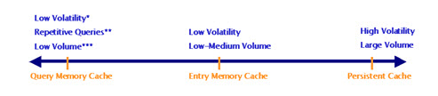

# Cache

This chapter offers an introduction to caching options included in RadiantOne. For complete details on configuring cache, please see the RadiantOne Deployment and Tuning Guide.

RadiantOne offers different caching options to accommodate a variety of deployment needs.

-	Memory Cache (Entry Cache and Query Cache)
-	Persistent Cache (with periodic refresh or real-time refresh)

The diagram below provides a general “rule of thumb” as to what type of cache to implement.

Figure 5.1: Cache Types
 
* Low volatility during the life of the cache (the time to live)

** Repetitive Queries – a query having exactly the same syntax (same user, same filter, same ACL)

*** Low Volume – The size of the cache as measured by (Nb entries * entry size * 2.5) cannot exceed the amount of memory allocated for cache

For persistent cache, there is no limitation in terms of number of entries since everything is stored on disk. When fully indexed, the persistent cache provides performance levels comparable to the fastest “classical” LDAP directory.

