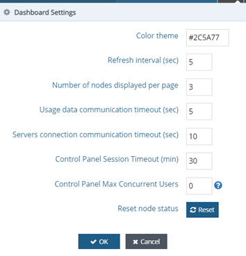
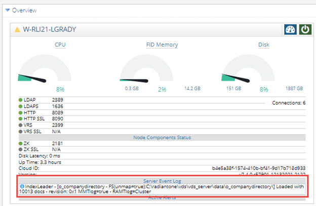
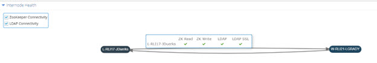

# Clusters Tab

The clusters tab allows you to view subclusters. This tab is available only when one or more subclusters have been installed. For more information, refer to the RadiantOne Installation Guide.

Once a new subcluster is defined, you can click on the Open link to launch the Control Panel for that cluster. 

 
Figure 3.29: The Clusters Tab

## Dashboard Tab

The dashboard tab is displayed upon successfully logging in to the Main Control Panel. It displays information that is valuable for every RadiantOne node.

### Dashboard Settings

The Dashboard Settings options () located at the top of the Main Control Panel allow you to customize the Main Control Panel, including how statistics related to the RadiantOne service are gathered. Each configurable option is described below.

 
Figure 3.30: Dashboard Settings

### Color Theme

This option allows you to configure the background color of the top bar in the Main Control Panel and Server Control Panel. The background color is also used for the Main Control Panel login screen which can be useful, for example, if you want to differentiate between many clusters. Either enter the hexadecimal color code or select from the color chart that appears when you click in the Color Theme property. Changes made with this option affect the Main Control Panel and Server Control Panel for all nodes of the same cluster. 

### Refresh Interval (sec)

The refresh interval is the frequency at which the CPU, FID Memory and Disk usage are refreshed. The default value is 5 seconds.

### Number of Nodes Displayed per Page

The number of nodes displayed per page indicates the number of RadiantOne cluster nodes shown on the Dashboard tab per page. The default is 3 which means if a cluster has more than 3 nodes, the additional nodes are displayed on different pages. 

### Usage Data Communication Timeout (sec)

The usage data communication timeout indicates how long the monitoring process should wait before determining the data usage of the node. The data usage is everything displayed on the Dashboard tab except for the components’ status (running or not). The default value is 5 seconds. If this value is exceeded, a spinning refresh icon () displays next to the node name.

### Servers Connection Communication Timeout (sec)

The severs connection communication timeout indicates how long the monitoring process should wait for determining the status (running or not) of each component on the node.  The default value is 10 seconds. If this value is exceeded, a red exclamation point icon displays next to the node name.

This setting is also used to determine how long to wait for an authentication response during the process of retrieving a token for ADAP to use on the Directory Browser tab (ADAP is the name of the RESTful Web Service API in RadiantOne). If the authentication has been delegated to a backend that is slow to respond, the ADAP token might not be generated, resulting in authentication errors when accessing the Directory Browser tab. Increasing the value in the Servers Connection Communication Timeout allows for more time to perform the authentication and generate the ADAP token.

### Control Panel Session Timeout (min)

The Control Panel session timeout indicates how long until the current control panel session expires due to inactivity and the user is logged out. The default value is 30 minutes. To avoid reaching the control panel session timeout when both the Main and Server Control Panels are open, maintain activity in either control panel (activity in both control panels is not required).

### Control Panel Max Concurrent Users

The Control Panel max concurrent user value indicates how many control panel sessions are allowed concurrently. This field accepts integer values of 0 and higher. The default value is 0, for an unlimited number of sessions. If attempting to connect to the Control Panel while the number of concurrent sessions is reached, the Login page displays the following message: “Authentication Failed. Reason: Maximum sessions exceeded”. 

### Reset Node Status

The Reset button resets the nodes’ status. When an LDAP or ZooKeeper error occurs in the monitoring, it is reflected on the cluster dashboard. Past errors persist in the collectors for 12 hours and appear on the dashboard as a yellow warning icon with a message. The Reset button is to immediately clear the cache of the collectors and those messages so they no longer display on the Dashboard tab.

The OK button saves and applies the new settings.
The Cancel button reverts the changes back to the previous settings.

## Overview Section

The Overview section displays the cluster nodes. You can see the status of services on the nodes and which node is the cluster’s RadiantOne leader ( beside the server name) The RadiantOne leader node handles write operations for the cluster. 

>**Note - You can also determine the current RadiantOne leader by using the node-monitor data collector. For details, see the Monitoring and Reporting Guide.**

You can start, stop and restart the RadiantOne service here by selecting an option from the  drop-down menu, (as long as it is not configured to run as a service) and access the Server Control Panel associated with the node by clicking on the  button. You are only able to perform these operations if the Jetty Application Server hosting the Control Panel on a particular node is running. If it isn’t, these buttons are gray. A red exclamation point icon next to the node name indicates that the application server hosting the Control Panel is not running on the node. Go to the node machine to start the application server hosting the Control Panel.

 
Figure 3.31: Message When Control Panel Associated with a Node is Not Running

For each node, the Overview section displays the status of:

-	Current CPU usage

-	Current FID memory usage

-	Current disk usage

-	RadiantOne service’s LDAP port

>**Note – if “Bind requires SSL or StartTLS” is enabled, a message is displayed indicating “Secure Bind Required”.**

-	RadiantOne service’s LDAPS port

-	RadiantOne service’s HTTP port

-	RadiantOne service’s HTTPS port

-	VRS (SQL) port

-	VRS (SQL) SSL port

-	ZooKeeper (ZK) on the node (in Node Component Status section). If ZK is running in a separate cluster instead of on the same machine as RadiantOne, the external ZK URL is shown. If SSL Is configured for the ZK connection, the SSL port is shown here.
-	Disk latency

-	Up time – how long the RadiantOne service on the node has been running.

-	Version of RadiantOne installed on the node

Figure 3.32: Overview Section of the Main Dashboard Tab – Example of Cluster Containing 2 FID Nodes

A green dot next to the line item indicates the service/port is running. 

A gray dot means the service is not running.

If there has been an error with the service during the past 12 hours, an orange exclamation point icon appears in the line item. Hover over the icon with your mouse to view the warning message.

If there is an error with the ZooKeeper service, a red X is shown in the line item. Hover over the icon with your mouse to view the error message.

If RadiantOne is deployed in a classic active/active or active/passive architecture, only one node is shown in the Overview section. If RadiantOne is deployed in a cluster architecture, each cluster node is shown in the Overview section. If the cluster has more than three nodes, a paging option is shown (i.e. ) in the upper right corner. Click to go to the next page where up to three additional nodes are displayed. You can page through the nodes three at a time. You can adjust the number of nodes that are displayed in the [Dashboard Settings](#dashboard-settings).

## Server Event Log

The Server Events log aggregates major events on server nodes such as startup information, leader switches, and RadiantOne Universal Directory (HDAP) store states. This log provides a quick diagnostic of the cluster status and feedback on the server initialization phases. The last status from the log is shown in the Main Control Panel’s Overview section, in the Server Event Log section for each node.

Figure 3.33: Accessing the Server Event Log from the Main Control Panel’s Dashboard Tab

Click the status information to view the end of the Events Log. To view the entire log, open the log file directly from a text viewer like Notepad++.  This log is located at <RLI_HOME>\<instance_name>\logs\vds_events.log. 

## Active Alerts

The Active Alerts section displays alert information about memory, connections, disk space, disk latency, and CPU usage. Standard alerts are configured in the Main Control Panel at Settings -> Monitoring -> Standard Alerts. Custom Alerts are configured in the Main Control Panel at Settings -> Monitoring -> Custom Alerts. When these alerts are activated, they are displayed on the Main Control Panel’s Dashboard tab.

 
Figure 3.34: The Active Alerts Section on the Main Dashboard Tab

For more information on configuring standard and custom alerts, refer to the RadiantOne Monitoring and Reporting Guide.

## Internode Health Section

The Internode Health section displays a topology of all nodes in the cluster and information about the connectivity between the nodes. There are two lines between each node indicating the direction of connectivity.

 
Figure 3.35: Internode Health Diagram

If you hover the mouse pointer over a node, more details are shown. By default, this includes the availability of the LDAP and LDAPS ports for the RadiantOne service, and the ability to read and write to ZooKeeper on the target node. To toggle information about ZooKeeper or LDAP connectivity, check/uncheck the corresponding box in the upper-left corner of the Internode Health section.

 
Figure 3.36: Health Details

A green checkmark means connectivity on the RadiantOne LDAP and/or LDAPS ports is fine and ZooKeeper can be read from and written to.

A red X means there is no connectivity on the LDAP and/or LDAPS ports for RadiantOne and/or ZooKeeper cannot be read from or written to. 

You can also click on any icon depicting the server name to launch the Server Control Panel associated with that node. 
